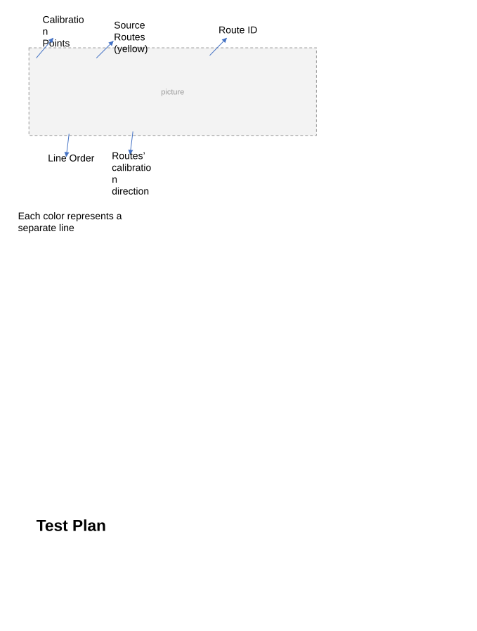
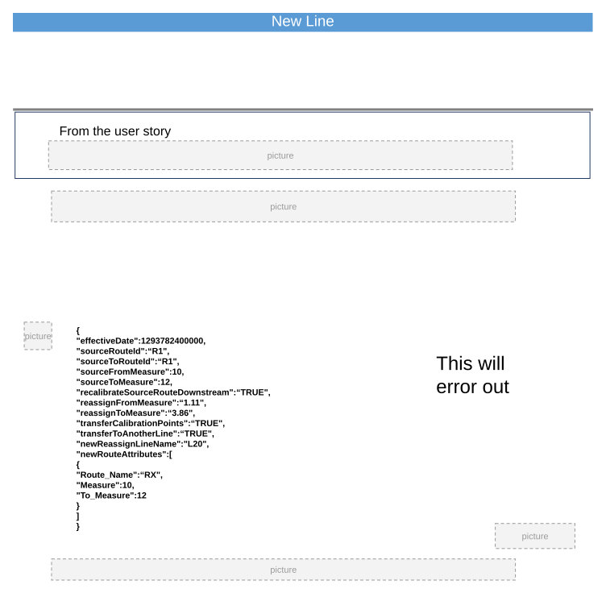
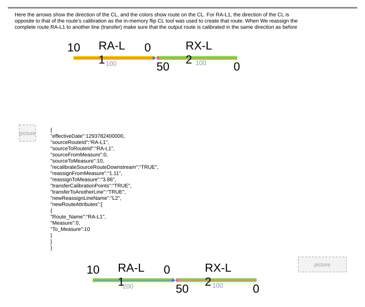

# Reassign Routes to Another Line with Original Route ID/Name Maintenance - REST Test Plan

| Field | Value |
| --- | --- |
| **Doc** | 542 · Test Plan · Server |
| **Product** | — |
| **Release** | — |
| **Issues** | — |
| **Source** | [Reassign_REST_5044.pptx](<https://esriis.sharepoint.com/sites/LocationReferencing/Shared%20Documents/General/Test%20Plans/Reassign_REST_5044.pptx>) |
| **People** | author Rahul Rakshit · PE — · dev Claire Wang |
| **Edited** | 2023-06-21 22:16 by Rahul Rakshit |
| **Extracted** | 2026-09-04 · lane xmlstrip · format 3.0 · prompt v2.0.2 |
| **Keywords** | route reassignment · route transfer · calibration points · time slicing · route measures · route name validation · recalibration · partial routes · route attributes · error handling |
| **Tools** | — |

## Summary

This document provides a detailed test plan for reassigning routes from one line to another in a linear referencing system using REST operations. It covers various scenarios including transferring routes and measures, handling partial routes, time slicing, recalibration, route name changes, and error conditions related to route attributes and measures. The plan includes verification criteria and expected behaviors for each test case.

## Related documents

<!-- related:begin -->
- [Reassign Route Supporting Transferring to Another Line - Test Plan](<https://esriis.sharepoint.com/sites/lrsworkspace/LRS Doc Index/Test Plans/reassign-route-supporting-transferring-to-another-line.md>) — similar text 0.35 · 4 title words · 1 filename word · same kind/folder <!-- rel:538 s=5.999 -->
- [Reassign to a new or existing line with original Route ID/Name maintained on the target line - REST](<https://esriis.sharepoint.com/sites/lrsworkspace/LRS Doc Index/User Stories/reassign-to-a-new-or-existing-line-with-original-route-id.md>) — similar text 0.30 · 6 title words · 2 filename words · same surface <!-- rel:607 s=5.558 -->
- [Reassign to a New or Existing Line with Original Route ID/Name Maintained on the Target Line - REST](<https://esriis.sharepoint.com/sites/lrsworkspace/LRS Doc Index/User Stories/565-reassign-to-a-new-or-existing-line-with-original-route-id.md>) — similar text 0.29 · 6 title words · 2 filename words · same surface <!-- rel:594 s=5.459 -->
- [Reassign UI Existing Line Test Plan](<https://esriis.sharepoint.com/sites/lrsworkspace/LRS Doc Index/Test Plans/reassign-ui-existing-line.md>) — similar text 0.36 · 2 title words · 1 filename word · same kind/folder <!-- rel:535 s=4.657 -->
- [Reassign Route Transfer to Another Line Method: Support Move Event Behavior Test Plan](<https://esriis.sharepoint.com/sites/lrsworkspace/LRS Doc Index/Test Plans/5141-reassign-route-transfer-to-another-line-method-support-move.md>) — similar text 0.26 · 4 title words · 1 filename word · same kind/folder <!-- rel:533 s=4.515 -->
<!-- related:end -->

<!-- docs:begin -->
## Esri documentation

[Route reassignment](https://doc.esri.com/en/arcgis-pro/latest/help/production/location-referencing-pipelines/reassign-routes.html)
<!-- docs:end -->

---

## Overview

### Slide 1 — Transfer to another line with original Route ID/Name being able to maintain on the target line - REST <!-- slide 1 -->

Routes’ calibration direction
Each color represents a separate line

[figure: Test Plan · Calibration Points · Source Routes (yellow) · Line Order · Route ID]



### Slide 2 <!-- slide 2 -->

| R Name | L NAME | From Date | To Date | Line Order |
| --- | --- | --- | --- | --- |
| 1A | L0 | 1/1/2000 | Null | 100 |
| 2A | L0 | 1/1/2000 | Null | 200 |
| 3A | L0 | 1/1/2000 | Null | 300 |
| 1B | L1 | 1/1/2000 | Null | 100 |
| 2B | L1 | 1/1/2000 | Null | 200 |
| 3B | L1 | 1/1/2000 | Null | 300 |
| 1C | L2 | 1/1/2000 | Null | 100 |
| 2C | L2 | 1/1/2000 | Null | 200 |
| 3C | L2 | 1/1/2000 | Null | 300 |

| Test ID | 1 | Network Type | Engineering |
| --- | --- | --- | --- |
| Test | Reassign all the routes in a line to another line on right, transferring routes and measures. |  |  |

{
   "effectiveDate":,
   "sourceRouteId":"1A",
   "sourceToRouteId":"3A",
   "sourceFromMeasure":2,
   "sourceToMeasure":4,
   "recalibrateSourceRouteDownstream":“TRUE",
   "reassignFromMeasure":“20",
   "reassignToMeasure":“200",
   "transferCalibrationPoints":"TRUE",
   "transferToAnotherLine":"TRUE",
   "newReassignLineName":"L1",
   "newRouteAttributes":[
      {
         "Route_Name":"1A",
         “FromMeasure":2,
         "ToMeasure":4

```
      },
      {
```

         "Route_Name":"2A",
         “FromMeasure":0,
         "ToMeasure":2

```
      },
      {
```

         "Route_Name":"3A",
         “FromMeasure":0,
         "ToMeasure":4

```
      }
   ]
}
```

## Test Cases

### TC-U01 — Verification <!-- src: S5 · slide 3 · label Verification -->

**Steps:**
1. Each output target route corresponds to the exact input route
2. The line orders are updated for the source and target
3. The source and target routes are time sliced
4. The CPs are time sliced
5. The CPs are updated
6. The CLS is updated in case a partial route is reassigned
7. The CL is split in case a partial route is reassigned
8. Edit log entries

### TC-U02 — Recalibrate Target (Yes) <!-- src: S3 · slide 48 · table · Yes -->

- **ID:** Yes

### TC-U03 — Recalibrate Target (Yes) <!-- src: S3 · slide 50 · table · Yes -->

- **ID:** Yes

### TC-U04 — Recalibrate Target (Yes) <!-- src: S3 · slide 52 · table · Yes -->

- **ID:** Yes

### TC-U05 — Recalibrate Target (Yes) <!-- src: S3 · slide 53 · table · Yes -->

- **ID:** Yes

### TC-U06 — Recalibrate Target (Yes) <!-- src: S3 · slide 55 · table · Yes -->

- **ID:** Yes

## Other content

### Slide 3 <!-- slide 3 -->

| R Name | L NAME | From Date | To Date | Line Order |
| --- | --- | --- | --- | --- |
| 1A | L0 | 1/1/2000 | 12/31/2010 | 100 |
| 2A | L0 | 1/1/2000 | 12/31/2010 | 200 |
| 3A | L0 | 1/1/2000 | 12/31/2010 | 300 |
| 1B | L1 | 1/1/2000 | 12/31/2010 | 100 |
| 2B | L1 | 1/1/2000 | 12/31/2010 | 200 |
| 3B | L1 | 1/1/2000 | 12/31/2010 | 300 |
| 1A | L1 | 12/31/2010 | Null | 100 |
| 2A | L1 | 12/31/2010 | Null | 200 |
| 3A | L1 | 12/31/2010 | Null | 300 |
| 1B | L1 | 12/31/2010 | Null | 400 |
| 2B | L1 | 12/31/2010 | Null | 500 |
| 3B | L1 | 12/31/2010 | Null | 600 |
| 1C | L2 | 1/1/2000 | Null | 100 |
| 2C | L2 | 1/1/2000 | Null | 200 |
| 3C | L2 | 1/1/2000 | Null | 300 |

| Test ID | 1 | Network Type | Engineering |
| --- | --- | --- | --- |
| Test | Reassign all the routes in a line to another line on right, transferring routes and measures. |  |  |

### Slide 4 <!-- slide 4 -->

| R Name | L NAME | From Date | To Date | Line Order |
| --- | --- | --- | --- | --- |
| 1A | L0 | 1/1/2000 | Null | 100 |
| 2A | L0 | 1/1/2000 | Null | 200 |
| 3A | L0 | 1/1/2000 | Null | 300 |
| 1B | L1 | 1/1/2000 | Null | 100 |
| 2B | L1 | 1/1/2000 | Null | 200 |
| 3B | L1 | 1/1/2000 | Null | 300 |
| 1C | L2 | 1/1/2000 | Null | 100 |
| 2C | L2 | 1/1/2000 | Null | 200 |
| 3C | L2 | 1/1/2000 | Null | 300 |

| Test ID | 1A | Network Type | Engineering |
| --- | --- | --- | --- |
| Test | Reassign all the routes in a line to another line on right, transferring routes. reassignFromMeasure not provided. |  |  |

{
   "effectiveDate":,
   "sourceRouteId":"1A",
   "sourceToRouteId":"3A",
   "sourceFromMeasure":2,
   "sourceToMeasure":4,
   "recalibrateSourceRouteDownstream":“TRUE",
   "reassignFromMeasure":“",
   "reassignToMeasure":“200",
   "transferCalibrationPoints":"TRUE",
   "transferToAnotherLine":"TRUE",
   "newReassignLineName":"L1",
   "newRouteAttributes":[
      {
         "Route_Name":"1A",
         "Measure":2,
         "To_Measure":4

```
      },
      {
```

         "Route_Name":"2A",
         "Measure":0,
         "To_Measure":2

```
      },
      {
```

         "Route_Name":"3A",
         "Measure":0,
         "To_Measure":4

```
      }
   ]
}
```

'reassignFromMeasure' parameter not specified.

### Slide 5 <!-- slide 5 -->

| R Name | L NAME | From Date | To Date | Line Order |
| --- | --- | --- | --- | --- |
| 1A | L0 | 1/1/2000 | Null | 100 |
| 2A | L0 | 1/1/2000 | Null | 200 |
| 3A | L0 | 1/1/2000 | Null | 300 |
| 1B | L1 | 1/1/2000 | Null | 100 |
| 2B | L1 | 1/1/2000 | Null | 200 |
| 3B | L1 | 1/1/2000 | Null | 300 |
| 1C | L2 | 1/1/2000 | Null | 100 |
| 2C | L2 | 1/1/2000 | Null | 200 |
| 3C | L2 | 1/1/2000 | Null | 300 |

| Test ID | 1B | Network Type | Engineering |
| --- | --- | --- | --- |
| Test | Reassign all the routes in a line to another line on right, transferring routes. reassignToMeasure not provided. |  |  |

{
   "effectiveDate":,
   "sourceRouteId":"1A",
   "sourceToRouteId":"3A",
   "sourceFromMeasure":2,
   "sourceToMeasure":4,
   "recalibrateSourceRouteDownstream":“TRUE",
   "reassignFromMeasure":“20",
   "reassignToMeasure":“",
   "transferCalibrationPoints":"TRUE",
   "transferToAnotherLine":"TRUE",
   "newReassignLineName":"L1",
   "newRouteAttributes":[
      {
         "Route_Name":"1A",
         "Measure":2,
         "To_Measure":4

```
      },
      {
```

         "Route_Name":"2A",
         "Measure":0,
         "To_Measure":2

```
      },
      {
```

         "Route_Name":"3A",
         "Measure":0,
         "To_Measure":4

```
      }
   ]
}
```

'reassignToMeasure' parameter not specified.

### Slide 6 <!-- slide 6 -->

| R Name | L NAME | From Date | To Date | Line Order |
| --- | --- | --- | --- | --- |
| 1A | L0 | 1/1/2000 | Null | 100 |
| 2A | L0 | 1/1/2000 | Null | 200 |
| 3A | L0 | 1/1/2000 | Null | 300 |
| 1B | L1 | 1/1/2000 | Null | 100 |
| 2B | L1 | 1/1/2000 | Null | 200 |
| 3B | L1 | 1/1/2000 | Null | 300 |
| 1C | L2 | 1/1/2000 | Null | 100 |
| 2C | L2 | 1/1/2000 | Null | 200 |
| 3C | L2 | 1/1/2000 | Null | 300 |

| Test ID | 1C | Network Type | Engineering |
| --- | --- | --- | --- |
| Test | Reassign all the routes in a line to another line on right, transferring routes. reassignFromMeasure and reassignToMeasure not provided. |  |  |

{
   "effectiveDate":,
   "sourceRouteId":"1A",
   "sourceToRouteId":"3A",
   "sourceFromMeasure":2,
   "sourceToMeasure":4,
   "recalibrateSourceRouteDownstream":“TRUE",
   "reassignFromMeasure":“",
   "reassignToMeasure":“",
   "transferCalibrationPoints":"TRUE",
   "transferToAnotherLine":"TRUE",
   "newReassignLineName":"L1",
   "newRouteAttributes":[
      {
         "Route_Name":"1A",
         "Measure":2,
         "To_Measure":4

```
      },
      {
```

         "Route_Name":"2A",
         "Measure":0,
         "To_Measure":2

```
      },
      {
```

         "Route_Name":"3A",
         "Measure":0,
         "To_Measure":4

```
      }
   ]
}
```

'reassignFromMeasure' parameter not specified.

### Slide 7 <!-- slide 7 -->

| R Name | L NAME | From Date | To Date | Line Order |
| --- | --- | --- | --- | --- |
| 1A | L0 | 1/1/2000 | Null | 100 |
| 2A | L0 | 1/1/2000 | Null | 200 |
| 3A | L0 | 1/1/2000 | Null | 300 |
| 1B | L1 | 1/1/2000 | Null | 100 |
| 2B | L1 | 1/1/2000 | Null | 200 |
| 3B | L1 | 1/1/2000 | Null | 300 |
| 1C | L2 | 1/1/2000 | Null | 100 |
| 2C | L2 | 1/1/2000 | Null | 200 |
| 3C | L2 | 1/1/2000 | Null | 300 |

| Test ID | 1D | Network Type | Engineering |
| --- | --- | --- | --- |
| Test | Reassign all the routes in a line to another line on right, transferring routes. Measures changed. Route’s from M = Route’s to M |  |  |

{
   "effectiveDate":,
   "sourceRouteId":"1A",
   "sourceToRouteId":"3A",
   "sourceFromMeasure":2,
   "sourceToMeasure":4,
   "recalibrateSourceRouteDownstream":“TRUE",
   "reassignFromMeasure":“20",
   "reassignToMeasure":“200",
   "transferCalibrationPoints":"TRUE",
   "transferToAnotherLine":"TRUE",
   "newReassignLineName":"L1",
   "newRouteAttributes":[
      {
         "Route_Name":"1A",
         “FromMeasure":2,
         "ToMeasure":2

```
      },
      {
```

         "Route_Name":"2A",
         "Measure":0,
         "To_Measure":2

```
      },
      {
```

         "Route_Name":"3A",
         "Measure":0,
         "To_Measure":4

```
      }
   ]
}
```

From FromMeasure of Route 1A is equal to the ToMeasure

### Slide 8 <!-- slide 8 -->

| R Name | L NAME | From Date | To Date | Line Order |
| --- | --- | --- | --- | --- |
| 1A | L0 | 1/1/2000 | Null | 100 |
| 2A | L0 | 1/1/2000 | Null | 200 |
| 3A | L0 | 1/1/2000 | Null | 300 |
| 1B | L1 | 1/1/2000 | Null | 100 |
| 2B | L1 | 1/1/2000 | Null | 200 |
| 3B | L1 | 1/1/2000 | Null | 300 |
| 1C | L2 | 1/1/2000 | Null | 100 |
| 2C | L2 | 1/1/2000 | Null | 200 |
| 3C | L2 | 1/1/2000 | Null | 300 |

| Test ID | 1E | Network Type | Engineering |
| --- | --- | --- | --- |
| Test | Reassign all the routes in a line to another line on right, transferring routes. Measures changed. Route’s from M > Route’s to M |  |  |

{
   "effectiveDate":,
   "sourceRouteId":"1A",
   "sourceToRouteId":"3A",
   "sourceFromMeasure":2,
   "sourceToMeasure":4,
   "recalibrateSourceRouteDownstream":“TRUE",
   "reassignFromMeasure":“20",
   "reassignToMeasure":“200",
   "transferCalibrationPoints":"TRUE",
   "transferToAnotherLine":"TRUE",
   "newReassignLineName":"L1",
   "newRouteAttributes":[
      {
         "Route_Name":"1A",
         “FromMeasure":2,
         "ToMeasure":0

```
      },
      {
```

         "Route_Name":"2A",
         "Measure":0,
         "To_Measure":2

```
      },
      {
```

         "Route_Name":"3A",
         "Measure":0,
         "To_Measure":4

```
      }
   ]
}
```

From Measure of Route 1A is greater than the To Measure

### Slide 9 <!-- slide 9 -->

| R Name | L NAME | From Date | To Date | Line Order |
| --- | --- | --- | --- | --- |
| 1A | L0 | 1/1/2000 | Null | 100 |
| 2A | L0 | 1/1/2000 | Null | 200 |
| 3A | L0 | 1/1/2000 | Null | 300 |
| 1B | L1 | 1/1/2000 | Null | 100 |
| 2B | L1 | 1/1/2000 | Null | 200 |
| 3B | L1 | 1/1/2000 | Null | 300 |
| 1C | L2 | 1/1/2000 | Null | 100 |
| 2C | L2 | 1/1/2000 | Null | 200 |
| 3C | L2 | 1/1/2000 | Null | 300 |

| Test ID | 1F | Network Type | Engineering |
| --- | --- | --- | --- |
| Test | Reassign all the routes in a line to another line on right, transferring routes. Measures changed. Two Routes’s From M > To M and One Route’s From M = To M |  |  |

{
   "effectiveDate":,
   "sourceRouteId":"1A",
   "sourceToRouteId":"3A",
   "sourceFromMeasure":2,
   "sourceToMeasure":4,
   "recalibrateSourceRouteDownstream":“TRUE",
   "reassignFromMeasure":“20",
   "reassignToMeasure":“200",
   "transferCalibrationPoints":"TRUE",
   "transferToAnotherLine":"TRUE",
   "newReassignLineName":"L1",
   "newRouteAttributes":[
      {
         "Route_Name":"1A",
         “FromMeasure":2,
         "ToMeasure":0

```
      },
      {
```

         "Route_Name":"2A",
         “FromMeasure":4,
         "ToMeasure":2

```
      },
      {
```

         "Route_Name":"3A",
         “FromMeasure":0,
         "ToMeasure":0

```
      }
   ]
}
```

From Measure of Route 1A is greater than the To Measure

### Slide 10 <!-- slide 10 -->

| R Name | L NAME | From Date | To Date | Line Order |
| --- | --- | --- | --- | --- |
| 1A | L0 | 1/1/2000 | Null | 100 |
| 2A | L0 | 1/1/2000 | Null | 200 |
| 3A | L0 | 1/1/2000 | Null | 300 |
| 1B | L1 | 1/1/2000 | Null | 100 |
| 2B | L1 | 1/1/2000 | Null | 200 |
| 3B | L1 | 1/1/2000 | Null | 300 |
| 1C | L2 | 1/1/2000 | Null | 100 |
| 2C | L2 | 1/1/2000 | Null | 200 |
| 3C | L2 | 1/1/2000 | Null | 300 |

| Test ID | 1G | Network Type | Engineering |
| --- | --- | --- | --- |
| Test | Reassign all the routes in a line to another line on right, transferring routes. Route name changed. Duplicate route name provided. |  |  |

{
   "effectiveDate":,
   "sourceRouteId":"1A",
   "sourceToRouteId":"3A",
   "sourceFromMeasure":2,
   "sourceToMeasure":4,
   "recalibrateSourceRouteDownstream":“TRUE",
   "reassignFromMeasure":“20",
   "reassignToMeasure":“200",
   "transferCalibrationPoints":"TRUE",
   "transferToAnotherLine":"TRUE",
   "newReassignLineName":"L1",
   "newRouteAttributes":[
      {
         "Route_Name":"1A",
         “FromMeasure":2,
         "ToMeasure":4

```
      },
      {
```

         "Route_Name":“1A",
         “FromMeasure":0,
         "ToMeasure":2

```
      },
      {
```

         "Route_Name":"3A",
         “FromMeasure":0,
         "ToMeasure":4

```
      }
   ]
}
```

Error message to be provided by the Dev prior to testing

### Slide 11 <!-- slide 11 -->

| R Name | L NAME | From Date | To Date | Line Order |
| --- | --- | --- | --- | --- |
| 1A | L0 | 1/1/2000 | Null | 100 |
| 2A | L0 | 1/1/2000 | Null | 200 |
| 3A | L0 | 1/1/2000 | Null | 300 |
| 1B | L1 | 1/1/2000 | Null | 100 |
| 2B | L1 | 1/1/2000 | Null | 200 |
| 3B | L1 | 1/1/2000 | Null | 300 |
| 1C | L2 | 1/1/2000 | Null | 100 |
| 2C | L2 | 1/1/2000 | Null | 200 |
| 3C | L2 | 1/1/2000 | Null | 300 |

| Test ID | 1H | Network Type | Engineering |
| --- | --- | --- | --- |
| Test | Reassign all the routes in a line to another line on right, transferring routes. Route name changed. Two duplicate route names provided. |  |  |

{
   "effectiveDate":,
   "sourceRouteId":"1A",
   "sourceToRouteId":"3A",
   "sourceFromMeasure":2,
   "sourceToMeasure":4,
   "recalibrateSourceRouteDownstream":“TRUE",
   "reassignFromMeasure":“20",
   "reassignToMeasure":“200",
   "transferCalibrationPoints":"TRUE",
   "transferToAnotherLine":"TRUE",
   "newReassignLineName":"L1",
   "newRouteAttributes":[
      {
         "Route_Name":"1A",
         "Measure":2,
         "To_Measure":4

```
      },
      {
```

         "Route_Name":“1A",
         "Measure":0,
         "To_Measure":2

```
      },
      {
```

         "Route_Name":“1A",
         "Measure":0,
         "To_Measure":4

```
      }
   ]
}
```

Error message to be provided by the Dev prior to testing

### Slide 12 <!-- slide 12 -->

| R Name | L NAME | From Date | To Date | Line Order |
| --- | --- | --- | --- | --- |
| 1A | L0 | 1/1/2000 | Null | 100 |
| 2A | L0 | 1/1/2000 | Null | 200 |
| 3A | L0 | 1/1/2000 | Null | 300 |
| 1B | L1 | 1/1/2000 | Null | 100 |
| 2B | L1 | 1/1/2000 | Null | 200 |
| 3B | L1 | 1/1/2000 | Null | 300 |
| 1C | L2 | 1/1/2000 | Null | 100 |
| 2C | L2 | 1/1/2000 | Null | 200 |
| 3C | L2 | 1/1/2000 | Null | 300 |

| Test ID | 1I | Network Type | Engineering |
| --- | --- | --- | --- |
| Test | Reassign all the routes in a line to another line on right, transferring routes. Route name changed. A route name that already exists in current time slice with another line provided. |  |  |

{
   "effectiveDate":,
   "sourceRouteId":"1A",
   "sourceToRouteId":"3A",
   "sourceFromMeasure":2,
   "sourceToMeasure":4,
   "recalibrateSourceRouteDownstream":“TRUE",
   "reassignFromMeasure":“20",
   "reassignToMeasure":“200",
   "transferCalibrationPoints":"TRUE",
   "transferToAnotherLine":"TRUE",
   "newReassignLineName":"L1",
   "newRouteAttributes":[
      {
         "Route_Name":"1A",
         "Measure":2,
         "To_Measure":4

```
      },
      {
```

         "Route_Name":“2A",
         "Measure":0,
         "To_Measure":2

```
      },
      {
```

         "Route_Name":“2B",
         "Measure":0,
         "To_Measure":4

```
      }
   ]
}
```

Route 2B already exists on Line L1.

### Slide 13 <!-- slide 13 -->

| R Name | L NAME | From Date | To Date | Line Order |
| --- | --- | --- | --- | --- |
| 1A | L0 | 1/1/2000 | Null | 100 |
| 2A | L0 | 1/1/2000 | Null | 200 |
| 3A | L0 | 1/1/2000 | Null | 300 |
| 1B | L1 | 1/1/2000 | Null | 100 |
| 2B | L1 | 1/1/2000 | Null | 200 |
| 3B | L1 | 1/1/2000 | Null | 300 |
| 1C | L2 | 1/1/2000 | Null | 100 |
| 2C | L2 | 1/1/2000 | Null | 200 |
| 3C | L2 | 1/1/2000 | Null | 300 |

| Test ID | 1J | Network Type | Engineering |
| --- | --- | --- | --- |
| Test | Reassign all the routes in a line to another line on right, transferring routes. Route name changed. Two route names that already exists in current time slice with other lines provided. |  |  |

{
   "effectiveDate":,
   "sourceRouteId":"1A",
   "sourceToRouteId":"3A",
   "sourceFromMeasure":2,
   "sourceToMeasure":4,
   "recalibrateSourceRouteDownstream":“TRUE",
   "reassignFromMeasure":“20",
   "reassignToMeasure":“200",
   "transferCalibrationPoints":"TRUE",
   "transferToAnotherLine":"TRUE",
   "newReassignLineName":"L1",
   "newRouteAttributes":[
      {
         "Route_Name":"1A",
         "Measure":2,
         "To_Measure":4

```
      },
      {
```

         "Route_Name":“2C",
         "Measure":0,
         "To_Measure":2

```
      },
      {
```

         "Route_Name":“2B",
         "Measure":0,
         "To_Measure":4

```
      }
   ]
}
```

Route 2C already exists on Line L2.

### Slide 14 <!-- slide 14 -->

| R Name | L NAME | From Date | To Date | Line Order |
| --- | --- | --- | --- | --- |
| 1A | L0 | 1/1/2000 | Null | 100 |
| 2A | L0 | 1/1/2000 | Null | 200 |
| 3A | L0 | 1/1/2000 | Null | 300 |
| 1B | L1 | 1/1/2000 | Null | 100 |
| 2B | L1 | 1/1/2000 | Null | 200 |
| 3B | L1 | 1/1/2000 | Null | 300 |
| 1C | L2 | 1/1/2000 | Null | 100 |
| 2C | L2 | 1/1/2000 | Null | 200 |
| 3C | L2 | 1/1/2000 | Null | 300 |

| Test ID | 1K | Network Type | Engineering |
| --- | --- | --- | --- |
| Test | Reassign all the routes in a line to another line on right, transferring routes. Measures changed. From M of a route is not provided. |  |  |

{
   "effectiveDate":,
   "sourceRouteId":"1A",
   "sourceToRouteId":"3A",
   "sourceFromMeasure":2,
   "sourceToMeasure":4,
   "recalibrateSourceRouteDownstream":“TRUE",
   "reassignFromMeasure":“20",
   "reassignToMeasure":“200",
   "transferCalibrationPoints":"TRUE",
   "transferToAnotherLine":"TRUE",
   "newReassignLineName":"L1",
   "newRouteAttributes":[
      {
         "Route_Name":"1A",
         "Measure": ,
         "To_Measure":4

```
      },
      {
```

         "Route_Name":“2A",
         "Measure":0,
         "To_Measure":2

```
      },
      {
```

         "Route_Name":“3A",
         "Measure":0,
         "To_Measure":4

```
      }
   ]
}
```

Use the original measure in this case

### Slide 15 <!-- slide 15 -->

| R Name | L NAME | From Date | To Date | Line Order |
| --- | --- | --- | --- | --- |
| 1A | L0 | 1/1/2000 | Null | 100 |
| 2A | L0 | 1/1/2000 | Null | 200 |
| 3A | L0 | 1/1/2000 | Null | 300 |
| 1B | L1 | 1/1/2000 | Null | 100 |
| 2B | L1 | 1/1/2000 | Null | 200 |
| 3B | L1 | 1/1/2000 | Null | 300 |
| 1C | L2 | 1/1/2000 | Null | 100 |
| 2C | L2 | 1/1/2000 | Null | 200 |
| 3C | L2 | 1/1/2000 | Null | 300 |

| Test ID | 1L | Network Type | Engineering |
| --- | --- | --- | --- |
| Test | Reassign all the routes in a line to another line on right, transferring routes. Measures changed. To M of a route is not provided. |  |  |

{
   "effectiveDate":,
   "sourceRouteId":"1A",
   "sourceToRouteId":"3A",
   "sourceFromMeasure":2,
   "sourceToMeasure":4,
   "recalibrateSourceRouteDownstream":“TRUE",
   "reassignFromMeasure":“20",
   "reassignToMeasure":“200",
   "transferCalibrationPoints":"TRUE",
   "transferToAnotherLine":"TRUE",
   "newReassignLineName":"L1",
   "newRouteAttributes":[
      {
         "Route_Name":"1A",
         "Measure": 0,
         "To_Measure":

```
      },
      {
```

         "Route_Name":“2A",
         "Measure":0,
         "To_Measure":2

```
      },
      {
```

         "Route_Name":“3A",
         "Measure":0,
         "To_Measure":4

```
      }
   ]
}
```

Use the original measure in this case

### Slide 16 <!-- slide 16 -->

| R Name | L NAME | From Date | To Date | Line Order |
| --- | --- | --- | --- | --- |
| 1A | L0 | 1/1/2000 | Null | 100 |
| 2A | L0 | 1/1/2000 | Null | 200 |
| 3A | L0 | 1/1/2000 | Null | 300 |
| 1B | L1 | 1/1/2000 | Null | 100 |
| 2B | L1 | 1/1/2000 | Null | 200 |
| 3B | L1 | 1/1/2000 | Null | 300 |
| 1C | L2 | 1/1/2000 | Null | 100 |
| 2C | L2 | 1/1/2000 | Null | 200 |
| 3C | L2 | 1/1/2000 | Null | 300 |

| Test ID | 1L | Network Type | Engineering |
| --- | --- | --- | --- |
| Test | Reassign all the routes in a line to another line on right, transferring routes. Measures changed. From and To M of a route is not provided. |  |  |

{
   "effectiveDate":,
   "sourceRouteId":"1A",
   "sourceToRouteId":"3A",
   "sourceFromMeasure":2,
   "sourceToMeasure":4,
   "recalibrateSourceRouteDownstream":“TRUE",
   "reassignFromMeasure":“20",
   "reassignToMeasure":“200",
   "transferCalibrationPoints":"TRUE",
   "transferToAnotherLine":"TRUE",
   "newReassignLineName":"L1",
   "newRouteAttributes":[
      {
         "Route_Name":"1A",
         "Measure": ,
         "To_Measure":

```
      },
      {
```

         "Route_Name":“2A",
         "Measure":0,
         "To_Measure":2

```
      },
      {
```

         "Route_Name":“3A",
         "Measure":0,
         "To_Measure":4

```
      }
   ]
}
```

Use the original measure in this case

### Slide 17 <!-- slide 17 -->

| R Name | L NAME | From Date | To Date | Line Order |
| --- | --- | --- | --- | --- |
| 1A | L0 | 1/1/2000 | Null | 100 |
| 2A | L0 | 1/1/2000 | Null | 200 |
| 3A | L0 | 1/1/2000 | Null | 300 |
| 1B | L1 | 1/1/2000 | Null | 100 |
| 2B | L1 | 1/1/2000 | Null | 200 |
| 3B | L1 | 1/1/2000 | Null | 300 |
| 1C | L2 | 1/1/2000 | Null | 100 |
| 2C | L2 | 1/1/2000 | Null | 200 |
| 3C | L2 | 1/1/2000 | Null | 300 |

| Test ID | 1M | Network Type | Engineering |
| --- | --- | --- | --- |
| Test | Reassign all the routes in a line to another line on right, transferring routes. Route Name changed. Route name is more than 255 characters. |  |  |

{
   "effectiveDate":,
   "sourceRouteId":"1A",
   "sourceToRouteId":"3A",
   "sourceFromMeasure":2,
   "sourceToMeasure":4,
   "recalibrateSourceRouteDownstream":“TRUE",
   "reassignFromMeasure":“20",
   "reassignToMeasure":“200",
   "transferCalibrationPoints":"TRUE",
   "transferToAnotherLine":"TRUE",
   "newReassignLineName":"L1",
   "newRouteAttributes":[
      {
         "Route_Name":"Chi bentornato profondata uno crepitando hai villanella convertira eguagliare. Piramide poi ben per dubitare colpire finestra. Turbare informi ansieta noi viaggio disceso tue suo puo. Dirtelo sveglia sorriso se tornato so porpora le le dovesti.",
         "Measure":0 ,
         "To_Measure":4

```
      },
      {
```

         "Route_Name":“2A",
         "Measure":0,
         "To_Measure":2

```
      },
      {
```

         "Route_Name":“3A",
         "Measure":0,
         "To_Measure":4

```
      }
   ]
}
```

Route name cannot exceed 255 <whatever length is set up> characters.

### Slide 18 <!-- slide 18 -->

| R Name | L NAME | From Date | To Date | Line Order |
| --- | --- | --- | --- | --- |
| 1A | L0 | 1/1/2000 | Null | 100 |
| 2A | L0 | 1/1/2000 | Null | 200 |
| 3A | L0 | 1/1/2000 | Null | 300 |
| 1B | L1 | 1/1/2000 | Null | 100 |
| 2B | L1 | 1/1/2000 | Null | 200 |
| 3B | L1 | 1/1/2000 | Null | 300 |
| 1C | L2 | 1/1/2000 | Null | 100 |
| 2C | L2 | 1/1/2000 | Null | 200 |
| 3C | L2 | 1/1/2000 | Null | 300 |

| Test ID | 1N | Network Type | Engineering |
| --- | --- | --- | --- |
| Test | Reassign all the routes in a line to another line on right, transferring routes. newReassignLineName is the same name as that of the source routes. |  |  |

{
   "effectiveDate":,
   "sourceRouteId":"1A",
   "sourceToRouteId":"3A",
   "sourceFromMeasure":2,
   "sourceToMeasure":4,
   "recalibrateSourceRouteDownstream":“TRUE",
   "reassignFromMeasure":“20",
   "reassignToMeasure":“200",
   "transferCalibrationPoints":"TRUE",
   "transferToAnotherLine":"TRUE",
   "newReassignLineName":"L0",
   "newRouteAttributes":[
      {
         "Route_Name":"1A",
         "Measure": ,
         "To_Measure":

```
      },
      {
```

         "Route_Name":“2A",
         "Measure":0,
         "To_Measure":2

```
      },
      {
```

         "Route_Name":“3A",
         "Measure":0,
         "To_Measure":4

```
      }
   ]
}
```

Error message to be provided by the dev prior to testing.

### Slide 19 <!-- slide 19 -->

| R Name | L NAME | From Date | To Date | Line Order |
| --- | --- | --- | --- | --- |
| 1A | L0 | 1/1/2000 | Null | 100 |
| 2A | L0 | 1/1/2000 | Null | 200 |
| 3A | L0 | 1/1/2000 | Null | 300 |
| 1B | L1 | 1/1/2000 | Null | 100 |
| 2B | L1 | 1/1/2000 | Null | 200 |
| 3B | L1 | 1/1/2000 | Null | 300 |
| 1C | L2 | 1/1/2000 | Null | 100 |
| 2C | L2 | 1/1/2000 | Null | 200 |
| 3C | L2 | 1/1/2000 | Null | 300 |

| Test ID | 1O | Network Type | Engineering |
| --- | --- | --- | --- |
| Test | Reassign all the routes in a line to a new line, transferring routes. newReassignLineName is more than 255 characters. |  |  |

{
   "effectiveDate":,
   "sourceRouteId":"1A",
   "sourceToRouteId":"3A",
   "sourceFromMeasure":2,
   "sourceToMeasure":4,
   "recalibrateSourceRouteDownstream":“TRUE",
   "reassignFromMeasure":“20",
   "reassignToMeasure":“200",
   "transferCalibrationPoints":"TRUE",
   "transferToAnotherLine":"TRUE",
   "newReassignLineName":“11111 11111 11111 11111 11111 11111 11111 11111 11111 11111 11111 11111 11111 11111 11111 11111 11111 11111 11111 11111 11111 11111 11111 11111 11111 11111 11111 11111 11111 11111 11111 11111 11111 11111 11111 11111 11111 11111 11111 11111 11111 11111 11111 11111 11111 11111 11111 11111 11111 11111 11111 ",
   "newRouteAttributes":[
      {
         "Route_Name":"1A",
         "Measure": ,
         "To_Measure":

```
      },
      {
```

         "Route_Name":“2A",
         "Measure":0,
         "To_Measure":2

```
      },
      {
```

         "Route_Name":“3A",
         "Measure":0,
         "To_Measure":4

```
      }
   ]
}
```

Do what it does with the existing code as we already have this parameter.

### Slide 20 <!-- slide 20 -->

| R Name | L NAME | From Date | To Date | Line Order |
| --- | --- | --- | --- | --- |
| 1A | L0 | 1/1/2000 | Null | 100 |
| 2A | L0 | 1/1/2000 | Null | 200 |
| 3A | L0 | 1/1/2000 | Null | 300 |
| 1B | L1 | 1/1/2000 | Null | 100 |
| 2B | L1 | 1/1/2000 | Null | 200 |
| 3B | L1 | 1/1/2000 | Null | 300 |
| 1C | L2 | 1/1/2000 | Null | 100 |
| 2C | L2 | 1/1/2000 | Null | 200 |
| 3C | L2 | 1/1/2000 | Null | 300 |

| Test ID | 1P | Network Type | Engineering |
| --- | --- | --- | --- |
| Test | Reassign all the routes in a line to another line on right, transferring routes. newReassignLineName is the same name as that of the source routes. From measure for the target route is not a numeric value. |  |  |

{
   "effectiveDate":,
   "sourceRouteId":"1A",
   "sourceToRouteId":"3A",
   "sourceFromMeasure":2,
   "sourceToMeasure":4,
   "recalibrateSourceRouteDownstream":“TRUE",
   "reassignFromMeasure":“20",
   "reassignToMeasure":“200",
   "transferCalibrationPoints":"TRUE",
   "transferToAnotherLine":"TRUE",
   "newReassignLineName":"L1",
   "newRouteAttributes":[
      {
         "Route_Name":"1A",
         "Measure": Q,
         "To_Measure":2

```
      },
      {
```

         "Route_Name":“2A",
         "Measure":0,
         "To_Measure":2

```
      },
      {
```

         "Route_Name":“3A",
         "Measure":0,
         "To_Measure":4

```
      }
   ]
}
```

The Measure value for Route 1A is invalid.

### Slide 21 <!-- slide 21 -->

| R Name | L NAME | From Date | To Date | Line Order |
| --- | --- | --- | --- | --- |
| 1A | L0 | 1/1/2000 | Null | 100 |
| 2A | L0 | 1/1/2000 | Null | 200 |
| 3A | L0 | 1/1/2000 | Null | 300 |
| 1B | L1 | 1/1/2000 | Null | 100 |
| 2B | L1 | 1/1/2000 | Null | 200 |
| 3B | L1 | 1/1/2000 | Null | 300 |
| 1C | L2 | 1/1/2000 | Null | 100 |
| 2C | L2 | 1/1/2000 | Null | 200 |
| 3C | L2 | 1/1/2000 | Null | 300 |

| Test ID | 1Q | Network Type | Engineering |
| --- | --- | --- | --- |
| Test | Reassign all the routes in a line to another line on right, transferring routes. newReassignLineName is the same name as that of the source routes. To measure for the target route is not a numeric value. |  |  |

{
   "effectiveDate":,
   "sourceRouteId":"1A",
   "sourceToRouteId":"3A",
   "sourceFromMeasure":2,
   "sourceToMeasure":4,
   "recalibrateSourceRouteDownstream":“TRUE",
   "reassignFromMeasure":“20",
   "reassignToMeasure":“200",
   "transferCalibrationPoints":"TRUE",
   "transferToAnotherLine":"TRUE",
   "newReassignLineName":"L1",
   "newRouteAttributes":[
      {
         "Route_Name":"1A",
         "Measure": 1,
         "To_Measure":Y

```
      },
      {
```

         "Route_Name":“2A",
         "Measure":0,
         "To_Measure":2

```
      },
      {
```

         "Route_Name":“3A",
         "Measure":0,
         "To_Measure":4

```
      }
   ]
}
```

The To Measure value for Route 1A is invalid.

### Slide 22 <!-- slide 22 -->

| R Name | L NAME | From Date | To Date | Line Order |
| --- | --- | --- | --- | --- |
| 1A | L0 | 1/1/2000 | Null | 100 |
| 2A | L0 | 1/1/2000 | Null | 200 |
| 3A | L0 | 1/1/2000 | Null | 300 |
| 1B | L1 | 1/1/2000 | Null | 100 |
| 2B | L1 | 1/1/2000 | Null | 200 |
| 3B | L1 | 1/1/2000 | Null | 300 |
| 1C | L2 | 1/1/2000 | Null | 100 |
| 2C | L2 | 1/1/2000 | Null | 200 |
| 3C | L2 | 1/1/2000 | Null | 300 |

| Test ID | 1R | Network Type | Engineering |
| --- | --- | --- | --- |
| Test | Reassign all the routes in a line to another line on right, transferring routes. newReassignLineName is the same name as that of the source routes. From Measure and To measure for the target route is not a numeric value. |  |  |

{
   "effectiveDate":,
   "sourceRouteId":"1A",
   "sourceToRouteId":"3A",
   "sourceFromMeasure":2,
   "sourceToMeasure":4,
   "recalibrateSourceRouteDownstream":“TRUE",
   "reassignFromMeasure":“20",
   "reassignToMeasure":“200",
   "transferCalibrationPoints":"TRUE",
   "transferToAnotherLine":"TRUE",
   "newReassignLineName":"L1",
   "newRouteAttributes":[
      {
         "Route_Name":"1A",
         "Measure": T,
         "To_Measure":Y

```
      },
      {
```

         "Route_Name":“2A",
         "Measure":0,
         "To_Measure":2

```
      },
      {
```

         "Route_Name":“3A",
         "Measure":0,
         "To_Measure":4

```
      }
   ]
```

}]
The To Measure value for Route 1A is invalid. The From Measure value for Route 1A is invalid.

### Slide 23 <!-- slide 23 -->

| R Name | L NAME | From Date | To Date | Line Order |
| --- | --- | --- | --- | --- |
| 1A | L0 | 1/1/2000 | Null | 100 |
| 2A | L0 | 1/1/2000 | Null | 200 |
| 3A | L0 | 1/1/2000 | Null | 300 |
| 1B | L1 | 1/1/2000 | Null | 100 |
| 2B | L1 | 1/1/2000 | Null | 200 |
| 3B | L1 | 1/1/2000 | Null | 300 |
| 1C | L2 | 1/1/2000 | Null | 100 |
| 2C | L2 | 1/1/2000 | Null | 200 |
| 3C | L2 | 1/1/2000 | Null | 300 |

| Test ID | 1S | Network Type | Engineering |
| --- | --- | --- | --- |
| Test | Reassign all the routes in a line to another line on right, transferring routes. The number of input routes is more than the number of output routes. |  |  |

{
   "effectiveDate":,
   "sourceRouteId":"1A",
   "sourceToRouteId":"3A",
   "sourceFromMeasure":2,
   "sourceToMeasure":4,
   "recalibrateSourceRouteDownstream":“TRUE",
   "reassignFromMeasure":“20",
   "reassignToMeasure":“200",
   "transferCalibrationPoints":"TRUE",
   "transferToAnotherLine":"TRUE",
   "newReassignLineName":"L1",
   "newRouteAttributes":[
      {
         "Route_Name":"1A",
         "Measure": 1,
         "To_Measure":5

```
      },
      {
```

         "Route_Name":“2A",
         "Measure":0,
         "To_Measure":2

```
      }
 ]
}
```

Error message to be provided by the dev prior to testing.

### Slide 24 <!-- slide 24 -->

| R Name | L NAME | From Date | To Date | Line Order |
| --- | --- | --- | --- | --- |
| 1A | L0 | 1/1/2000 | Null | 100 |
| 2A | L0 | 1/1/2000 | Null | 200 |
| 3A | L0 | 1/1/2000 | Null | 300 |
| 1B | L1 | 1/1/2000 | Null | 100 |
| 2B | L1 | 1/1/2000 | Null | 200 |
| 3B | L1 | 1/1/2000 | Null | 300 |
| 1C | L2 | 1/1/2000 | Null | 100 |
| 2C | L2 | 1/1/2000 | Null | 200 |
| 3C | L2 | 1/1/2000 | Null | 300 |

| Test ID | 1T | Network Type | Engineering |
| --- | --- | --- | --- |
| Test | Reassign all the routes in a line to another line on right, transferring routes. The number of input routes is less than the number of output routes. |  |  |

{
   "effectiveDate":,
   "sourceRouteId":"1A",
   "sourceToRouteId":"3A",
   "sourceFromMeasure":2,
   "sourceToMeasure":4,
   "recalibrateSourceRouteDownstream":“TRUE",
   "reassignFromMeasure":“20",
   "reassignToMeasure":“200",
   "transferCalibrationPoints":"TRUE",
   "transferToAnotherLine":"TRUE",
   "newReassignLineName":"L1",
   "newRouteAttributes":[
       {
         "Route_Name":"1A",
         "Measure": 0,
         "To_Measure":3

```
      },
      {
```

         "Route_Name":“2A",
         "Measure":0,
         "To_Measure":2

```
      },
      {
```

         "Route_Name":“3A",
         "Measure":0,
         "To_Measure":4

```
      },
{
```

         "Route_Name":“2V",
         "Measure":0,
         "To_Measure":2

```
      }

   ]
```

}]
Error message to be provided by the dev prior to testing.

### Slide 25 <!-- slide 25 -->

| R Name | L NAME | From Date | To Date | Line Order |
| --- | --- | --- | --- | --- |
| 1A | L0 | 1/1/2000 | Null | 100 |
| 2A | L0 | 1/1/2000 | Null | 200 |
| 3A | L0 | 1/1/2000 | Null | 300 |
| 1B | L1 | 1/1/2000 | Null | 100 |
| 2B | L1 | 1/1/2000 | Null | 200 |
| 3B | L1 | 1/1/2000 | Null | 300 |
| 1C | L2 | 1/1/2000 | Null | 100 |
| 2C | L2 | 1/1/2000 | Null | 200 |
| 3C | L2 | 1/1/2000 | Null | 300 |

| Test ID | 1U | Network Type | Engineering |
| --- | --- | --- | --- |
| Test | Reassign all the routes in a line to another line on right, transferring routes. Target Route name for one of the routes not provided. |  |  |

{
   "effectiveDate":,
   "sourceRouteId":"1A",
   "sourceToRouteId":"3A",
   "sourceFromMeasure":2,
   "sourceToMeasure":4,
   "recalibrateSourceRouteDownstream":“TRUE",
   "reassignFromMeasure":“20",
   "reassignToMeasure":“200",
   "transferCalibrationPoints":"TRUE",
   "transferToAnotherLine":"TRUE",
   "newReassignLineName":"L1",
   "newRouteAttributes":[
      {
         "Route_Name":"",
         "Measure": 0,
         "To_Measure":2

```
      },
      {
```

         "Route_Name":“2A",
         "Measure":0,
         "To_Measure":2

```
      },
      {
```

         "Route_Name":“3A",
         "Measure":0,
         "To_Measure":4

```
      }
   ]
```

}]
Error message to be provided by the dev prior to testing.

### Slide 26 <!-- slide 26 -->

| R Name | L NAME | From Date | To Date | Line Order |
| --- | --- | --- | --- | --- |
| 1A | L0 | 1/1/2000 | Null | 100 |
| 2A | L0 | 1/1/2000 | Null | 200 |
| 3A | L0 | 1/1/2020 | Null | 300 |
| 1B | L1 | 1/1/2000 | Null | 100 |
| 2B | L1 | 1/1/2000 | Null | 200 |
| 3B | L1 | 1/1/2000 | Null | 300 |
| 1C | L2 | 1/1/2000 | Null | 100 |
| 2C | L2 | 1/1/2000 | Null | 200 |
| 3C | L2 | 1/1/2000 | Null | 300 |

| Test ID | 1V | Network Type | Engineering |
| --- | --- | --- | --- |
| Test | Reassign all the routes in a line to another line on right, transferring routes and measures. The time slice of one of the routes is outside the date of reassignment. |  |  |

{
   "effectiveDate":,
   "sourceRouteId":"1A",
   "sourceToRouteId":"3A",
   "sourceFromMeasure":2,
   "sourceToMeasure":4,
   "recalibrateSourceRouteDownstream":“TRUE",
   "reassignFromMeasure":“20",
   "reassignToMeasure":“200",
   "transferCalibrationPoints":"TRUE",
   "transferToAnotherLine":"TRUE",
   "newReassignLineName":"L1",
   "newRouteAttributes":[
      {
         "Route_Name":"1A",
         "Measure":2,
         "To_Measure":4

```
      },
      {
```

         "Route_Name":"2A",
         "Measure":0,
         "To_Measure":2

```
      },
      {
```

         "Route_Name":"3A",
         "Measure":0,
         "To_Measure":4

```
      }
   ]
}
```

| Recalibrate Source | Yes |
| --- | --- |
| Recalibrate Target | Yes |
| Date | 12/31/1990 |
|  |  |

Route 3A not found for the date of reassignment.
Do as we do today

### Slide 27 <!-- slide 27 -->

| Test ID | 1W | Network Type | Engineering |
| --- | --- | --- | --- |
| Test | Reassign all the routes in a line to another line on right, transferring routes. Target From or To measure is - |  |  |

{
   "effectiveDate":,
   "sourceRouteId":"1A",
   "sourceToRouteId":"3A",
   "sourceFromMeasure":2,
   "sourceToMeasure":4,
   "recalibrateSourceRouteDownstream":“TRUE",
   "reassignFromMeasure":“20",
   "reassignToMeasure":“200",
   "transferCalibrationPoints":"TRUE",
   "transferToAnotherLine":"TRUE",
   "newReassignLineName":"L1",
   "newRouteAttributes":[
      {
         "Route_Name":"",
         "Measure": -,
         "To_Measure":2

```
      },
      {
```

         "Route_Name":“2A",
         "Measure":0,
         "To_Measure":2

```
      },
      {
```

         "Route_Name":“3A",
         "Measure":0,
         "To_Measure":4

```
      }
   ]
```

}]
Graphic Courtesy: Claire Wang

### Slide 28 <!-- slide 28 -->

| R Name | L NAME | From Date | To Date | Line Order |
| --- | --- | --- | --- | --- |
| 1A | L0 | 1/1/2000 | Null | 100 |
| 2A | L0 | 1/1/2000 | Null | 200 |
| 3A | L0 | 1/1/2000 | Null | 300 |
| 1B | L1 | 1/1/2000 | Null | 100 |
| 2B | L1 | 1/1/2000 | Null | 200 |
| 3B | L1 | 1/1/2000 | Null | 300 |
| 1C | L2 | 1/1/2000 | Null | 100 |
| 2C | L2 | 1/1/2000 | Null | 200 |
| 3C | L2 | 1/1/2000 | Null | 300 |

| Recalibrate Source | Yes |
| --- | --- |
| Recalibrate Target | Yes |
| Date | 12/31/2010 |
|  |  |

| Test ID | 2 | Network Type | Engineering |
| --- | --- | --- | --- |
| Test | Reassign all the routes in a line to another line on right, 2/3 route names and measures maintained. The first route in the line has changed. |  |  |

{
   "effectiveDate":,
   "sourceRouteId":"1A",
   "sourceToRouteId":"3A",
   "sourceFromMeasure":2,
   "sourceToMeasure":4,
   "recalibrateSourceRouteDownstream":“TRUE",
   "reassignFromMeasure":“1.11",
   "reassignToMeasure":“3.86",
   "transferCalibrationPoints":“TRUE",
   "transferToAnotherLine":“TRUE",
   "newReassignLineName":"L1",
   "newRouteAttributes":[
      {
         "Route_Name":"1A-Change",
         "Measure":5,
         "To_Measure":8

```
      },
      {
```

         "Route_Name":"2A",
         "Measure":0,
         "To_Measure":2

```
      },
      {
```

         "Route_Name":"3A",
         "Measure":0,
         "To_Measure":4

```
      }
   ]
}
```

Q. What happens if RID is also provided?

A. Ignore in that case

### Slide 29 <!-- slide 29 -->

| Test ID | 2 | Network Type | Engineering |
| --- | --- | --- | --- |
| Test | Reassign all the routes in a line to another line on right, 2/3 route names and measures maintained. The first route in the line has changed. |  |  |

| R Name | L NAME | From Date | To Date | Line Order |
| --- | --- | --- | --- | --- |
| 1A | L0 | 1/1/2000 | 12/31/2010 | 100 |
| 2A | L0 | 1/1/2000 | 12/31/2010 | 200 |
| 3A | L0 | 1/1/2000 | 12/31/2010 | 300 |
| 1B | L1 | 1/1/2000 | 12/31/2010 | 100 |
| 2B | L1 | 1/1/2000 | 12/31/2010 | 200 |
| 3B | L1 | 1/1/2000 | 12/31/2010 | 300 |
| 1A-Change | L1 | 12/31/2010 | Null | 100 |
| 2A | L1 | 12/31/2010 | Null | 200 |
| 3A | L1 | 12/31/2010 | Null | 300 |
| 1B | L1 | 12/31/2010 | Null | 400 |
| 2B | L1 | 12/31/2010 | Null | 500 |
| 3B | L1 | 12/31/2010 | Null | 600 |
| 1C | L2 | 1/1/2000 | Null | 100 |
| 2C | L2 | 1/1/2000 | Null | 200 |
| 3C | L2 | 1/1/2000 | Null | 300 |


### Slide 30 <!-- slide 30 -->

| R Name | L NAME | From Date | To Date | Line Order |
| --- | --- | --- | --- | --- |
| 1A | L0 | 1/1/2000 | Null | 100 |
| 2A | L0 | 1/1/2000 | Null | 200 |
| 3A | L0 | 1/1/2000 | Null | 300 |
| 1B | L1 | 1/1/2000 | Null | 100 |
| 2B | L1 | 1/1/2000 | Null | 200 |
| 3B | L1 | 1/1/2000 | Null | 300 |
| 1C | L2 | 1/1/2000 | Null | 100 |
| 2C | L2 | 1/1/2000 | Null | 200 |
| 3C | L2 | 1/1/2000 | Null | 300 |

| Recalibrate Source | Yes |
| --- | --- |
| Recalibrate Target | Yes |
| Date | 12/31/2010 |
|  |  |

| Test ID | 3 | Network Type | Engineering |
| --- | --- | --- | --- |
| Test | Reassign a middle route to another line on right. Keep Name intact |  |  |

{
   "effectiveDate":,
   "sourceRouteId":“2A",
   "sourceToRouteId":“2A",
   "sourceFromMeasure":0,
   "sourceToMeasure":2,
   "recalibrateSourceRouteDownstream":“TRUE",
   "reassignFromMeasure":“2",
   "reassignToMeasure":“2.00004",
   "transferCalibrationPoints":“TRUE",
   "transferToAnotherLine":“TRUE",
   "newReassignLineName":"L1",
   "newRouteAttributes":[
      {
         "Route_Name":“2A",
         "Measure":0,
         "To_Measure":2

```
]
}
```

The source route should touch the target line.


### Slide 31 <!-- slide 31 -->

| Recalibrate Source | Yes |
| --- | --- |
| Recalibrate Target | Yes |
| Date | 12/31/2010 |
|  |  |

| Test ID | 5 | Network Type | Engineering |
| --- | --- | --- | --- |
| Test | Reassign in the middle spanning routes to the line on the right. |  |  |

| R Name | L NAME | From Date | To Date | Line Order |
| --- | --- | --- | --- | --- |
| 1A | L0 | 1/1/2000 | Null | 100 |
| 2A | L0 | 1/1/2000 | Null | 200 |
| 3A | L0 | 1/1/2000 | Null | 300 |
| 1B | L1 | 1/1/2000 | Null | 100 |
| 2B | L1 | 1/1/2000 | Null | 200 |
| 3B | L1 | 1/1/2000 | Null | 300 |
| 1C | L2 | 1/1/2000 | Null | 100 |
| 2C | L2 | 1/1/2000 | Null | 200 |
| 3C | L2 | 1/1/2000 | Null | 300 |

{
   "effectiveDate":,
   "sourceRouteId":“2B",
   "sourceToRouteId":"3B",
   "sourceFromMeasure":6,
   "sourceToMeasure":2,
   "recalibrateSourceRouteDownstream":“TRUE",
   "reassignFromMeasure":“3",
   "reassignToMeasure":“55",
   "transferCalibrationPoints":“TRUE",
   "transferToAnotherLine":“TRUE",
   "newReassignLineName":"L2",
   "newRouteAttributes":[
      {
         "Route_Name":“2B Line3",
         "Measure":6,
         "To_Measure":8

```
      },
      {
```

         "Route_Name":“3B",
         "Measure":0,
         "To_Measure":2

```
      }
]
}
```


### Slide 32 <!-- slide 32 -->

| Test ID | 5 | Network Type | Engineering |
| --- | --- | --- | --- |
| Test | Reassign in the middle spanning routes to the line on the right |  |  |

| R Name | L NAME | From Date | To Date | Line Order |
| --- | --- | --- | --- | --- |
| 1A | L0 | 1/1/2000 | Null | 100 |
| 2A | L0 | 1/1/2000 | Null | 200 |
| 3A | L0 | 1/1/2000 | Null | 300 |
| 2B | L1 | 12/31/2010 | Null | 200 |
| 1B | L1 | 1/1/2000 | Null | 100 |
| 2B | L1 | 1/1/2000 | 12/31/2010 | 200 |
| 3B | L1 | 1/1/2000 | 12/31/2010 | 300 |
| 1C | L2 | 1/1/2000 | 12/31/2010 | 100 |
| 2C | L2 | 1/1/2000 | 12/31/2010 | 200 |
| 3C | L2 | 1/1/2000 | 12/31/2010 | 300 |
| 2B Line3 | L2 | 12/31/2010 | Null | 100 |
| 3B | L2 | 12/31/2010 | Null | 200 |
| 1C | L2 | 12/31/2010 | Null | 300 |
| 2C | L2 | 12/31/2010 | Null | 400 |
| 3C | L2 | 12/31/2010 | Null | 500 |


### Slide 33 <!-- slide 33 -->

| Recalibrate Source | Yes |
| --- | --- |
| Recalibrate Target | Yes |
| Date | 12/31/2010 |
|  |  |

| Test ID | 5A | Network Type | Engineering |
| --- | --- | --- | --- |
| Test | Reassign in the middle spanning routes to the line on the right. The Target route name of the partial route is unchanged. |  |  |

| R Name | L NAME | From Date | To Date | Line Order |
| --- | --- | --- | --- | --- |
| 1A | L0 | 1/1/2000 | Null | 100 |
| 2A | L0 | 1/1/2000 | Null | 200 |
| 3A | L0 | 1/1/2000 | Null | 300 |
| 1B | L1 | 1/1/2000 | Null | 100 |
| 2B | L1 | 1/1/2000 | Null | 200 |
| 3B | L1 | 1/1/2000 | Null | 300 |
| 1C | L2 | 1/1/2000 | Null | 100 |
| 2C | L2 | 1/1/2000 | Null | 200 |
| 3C | L2 | 1/1/2000 | Null | 300 |

{
   "effectiveDate":,
   "sourceRouteId":“2B",
   "sourceToRouteId":"3B",
   "sourceFromMeasure":6,
   "sourceToMeasure":2,
   "recalibrateSourceRouteDownstream":“TRUE",
   "reassignFromMeasure":"<measure>",
   "reassignToMeasure":"<measure>",
   "transferCalibrationPoints":“TRUE",
   "transferToAnotherLine":“TRUE",
   "newReassignLineName":"L2",
   "newRouteAttributes":[
      {
         "Route_Name":“2B",
         "Measure":6,
         "To_Measure":8

```
      },
      {
```

         "Route_Name":“3B",
         "Measure":0,
         "To_Measure":2

```
      }
]
}
```

Error message to be provided by the dev prior to testing.


### Slide 34 <!-- slide 34 -->

| Recalibrate Source | Yes |
| --- | --- |
| Recalibrate Target | Yes |
| Date | 12/31/2010 |
|  |  |

| Test ID | 5B | Network Type | Engineering |
| --- | --- | --- | --- |
| Test | Reassign in the middle spanning routes to the line on the right. The Target route name is a retired route on the same line. |  |  |

| R Name | L NAME | From Date | To Date | Line Order |
| --- | --- | --- | --- | --- |
| 1A | L0 | 1/1/2000 | Null | 100 |
| 2A | L0 | 1/1/2000 | Null | 200 |
| 3A | L0 | 1/1/2000 | Null | 300 |
| 1B | L1 | 1/1/2000 | Null | 100 |
| 2B | L1 | 1/1/2000 | Null | 200 |
| 3B | L1 | 1/1/2000 | Null | 300 |
| 1C | L2 | 1/1/2000 | Null | 100 |
| 2C | L2 | 1/1/2000 | Null | 200 |
| 3C | L2 | 1/1/2000 | Null | 300 |

{
   "effectiveDate":,
   "sourceRouteId":“2B",
   "sourceToRouteId":"3B",
   "sourceFromMeasure":6,
   "sourceToMeasure":2,
   "recalibrateSourceRouteDownstream":“TRUE",
   "reassignFromMeasure":"<measure>",
   "reassignToMeasure":"<measure>",
   "transferCalibrationPoints":“TRUE",
   "transferToAnotherLine":“TRUE",
   "newReassignLineName":"L2",
   "newRouteAttributes":[
      {
         "Route_Name":“retiredRouteA1",
         "Measure":6,
         "To_Measure":8

```
      },
      {
```

         "Route_Name":“3B",
         "Measure":0,
         "To_Measure":2

```
      }
]
}
```

Allow if it's the target line. No error in this case.


### Slide 35 <!-- slide 35 -->

| Recalibrate Source | Yes |
| --- | --- |
| Recalibrate Target | Yes |
| Date | 12/31/2010 |
|  |  |

| Test ID | 5C | Network Type | Engineering |
| --- | --- | --- | --- |
| Test | Reassign in the middle spanning routes to the line on the right. The Target route name is a retired route on another line. |  |  |

| R Name | L NAME | From Date | To Date | Line Order |
| --- | --- | --- | --- | --- |
| 1A | L0 | 1/1/2000 | Null | 100 |
| 2A | L0 | 1/1/2000 | Null | 200 |
| 3A | L0 | 1/1/2000 | Null | 300 |
| 1B | L1 | 1/1/2000 | Null | 100 |
| 2B | L1 | 1/1/2000 | Null | 200 |
| 3B | L1 | 1/1/2000 | Null | 300 |
| 1C | L2 | 1/1/2000 | Null | 100 |
| 2C | L2 | 1/1/2000 | Null | 200 |
| 3C | L2 | 1/1/2000 | Null | 300 |

{
   "effectiveDate":,
   "sourceRouteId":“2B",
   "sourceToRouteId":"3B",
   "sourceFromMeasure":6,
   "sourceToMeasure":2,
   "recalibrateSourceRouteDownstream":“TRUE",
   "reassignFromMeasure":"<measure>",
   "reassignToMeasure":"<measure>",
   "transferCalibrationPoints":“TRUE",
   "transferToAnotherLine":“TRUE",
   "newReassignLineName":"L2",
   "newRouteAttributes":[
      {
         "Route_Name":“retiredRouteA2",
         "Measure":6,
         "To_Measure":8

```
      },
      {
```

         "Route_Name":“3B",
         "Measure":0,
         "To_Measure":2

```
      }
]
}
```

Error message to be provided by the dev prior to testing.


### Slide 36 — New Line <!-- slide 36 -->

| Recalibrate Source | Yes |
| --- | --- |
| Recalibrate Target | Yes |
| Date | 12/31/2020 |
|  |  |

| Test ID | 7 | Network Type | Engineering |
| --- | --- | --- | --- |
| Test | Routes in line have different time slices, reassign to a new line. No Change. |  |  |

| R Name | L NAME | From Date | To Date | Line Order |
| --- | --- | --- | --- | --- |
| 1A | L0 | 1/1/2000 | Null | 100 |
| 2A | L0 | 1/1/2010 | Null | 200 |
| 3A | L0 | 1/1/2020 | Null | 300 |
| 1B | L1 | 1/1/2002 | Null | 100 |
| 2B | L1 | 1/1/2005 | Null | 200 |
| 3B | L1 | 1/1/2010 | Null | 300 |
| 1C | L2 | 1/1/2020 | Null | 100 |
| 2C | L2 | 1/1/2020 | Null | 200 |
| 3C | L2 | 1/1/2020 | Null | 300 |

{
   "effectiveDate":,
   "sourceRouteId":"1A",
   "sourceToRouteId":"3A",
   "sourceFromMeasure":2,
   "sourceToMeasure":4,
   "recalibrateSourceRouteDownstream":“TRUE",
   "reassignFromMeasure":“0",
   "reassignToMeasure":“2345",
   "transferCalibrationPoints":“TRUE",
   "transferToAnotherLine":“TRUE",
   "newReassignLineName":"LX",
   "newRouteAttributes":[
      {
         "Route_Name":"1A",
         "Measure":2,
         "To_Measure":4

```
      },
      {
```

         "Route_Name":"2A",
         "Measure":0,
         "To_Measure":2

```
      },
      {
```

         "Route_Name":"3A",
         "Measure":0,
         "To_Measure":4

```
      }
   ]
}
```

### Slide 37 <!-- slide 37 -->

| Test ID | 7 | Network Type | Engineering |
| --- | --- | --- | --- |
| Test | Routes in line have different time slices, reassign to a new line. No change. |  |  |

| R Name | L NAME | From Date | To Date | Line Order |
| --- | --- | --- | --- | --- |
| 1A | L0 | 1/1/2000 | 12/31/2020 | 100 |
| 2A | L0 | 1/1/2010 | 12/31/2020 | 200 |
| 3A | L0 | 1/1/2020 | 12/31/2020 | 300 |
| 1A | LX | 12/31/2020 | Null | 100 |
| 2A | LX | 12/31/2020 | Null | 200 |
| 3A | LX | 12/31/2020 | Null | 300 |
| 1B | L1 | 1/1/2002 | Null | 100 |
| 2B | L1 | 1/1/2005 | Null | 200 |
| 3B | L1 | 1/1/2010 | Null | 300 |
| 1C | L2 | 1/1/2020 | Null | 100 |
| 2C | L2 | 1/1/2020 | Null | 200 |
| 3C | L2 | 1/1/2020 | Null | 300 |


### Slide 38 — New Line <!-- slide 38 -->

| Recalibrate Source | Yes |
| --- | --- |
| Recalibrate Target | Yes |
| Date | 12/31/2020 |
|  |  |

| Test ID | 8 | Network Type | Engineering |
| --- | --- | --- | --- |
| Test | Routes in line have different time slices, reassign to a new line. Change Route Name. |  |  |

| R Name | L NAME | From Date | To Date | Line Order |
| --- | --- | --- | --- | --- |
| 1A | L0 | 1/1/2000 | Null | 100 |
| 2A | L0 | 1/1/2010 | Null | 200 |
| 3A | L0 | 1/1/2020 | Null | 300 |
| 1B | L1 | 1/1/2002 | Null | 100 |
| 2B | L1 | 1/1/2005 | Null | 200 |
| 3B | L1 | 1/1/2010 | Null | 300 |
| 1C | L2 | 1/1/2020 | Null | 100 |
| 2C | L2 | 1/1/2020 | Null | 200 |
| 3C | L2 | 1/1/2020 | Null | 300 |

{
   "effectiveDate":,
   "sourceRouteId":"1A",
   "sourceToRouteId":"3A",
   "sourceFromMeasure":2,
   "sourceToMeasure":4,
   "recalibrateSourceRouteDownstream":“TRUE",
   "reassignFromMeasure":“123",
   "reassignToMeasure":“2390",
   "transferCalibrationPoints":“TRUE",
   "transferToAnotherLine":“TRUE",
   "newReassignLineName":"LX",
   "newRouteAttributes":[
      {
         "Route_Name":“AA",
         "Measure":2,
         "To_Measure":4

```
      },
      {
```

         "Route_Name":“BB",
         "Measure":0,
         "To_Measure":2

```
      },
      {
```

         "Route_Name":“CC",
         "Measure":0,
         "To_Measure":4

```
      }
   ]
}
```

### Slide 39 <!-- slide 39 -->

| Test ID | 8 | Network Type | Engineering |
| --- | --- | --- | --- |
| Test | Routes in line have different time slices, reassign to a new line. Change Route Name. |  |  |

| R Name | L NAME | From Date | To Date | Line Order |
| --- | --- | --- | --- | --- |
| 1A | L0 | 1/1/2000 | 12/31/2020 | 100 |
| 2A | L0 | 1/1/2010 | 12/31/2020 | 200 |
| 3A | L0 | 1/1/2020 | 12/31/2020 | 300 |
| AA | LX | 12/31/2020 | Null | 100 |
| BB | LX | 12/31/2020 | Null | 200 |
| CC | LX | 12/31/2020 | Null | 300 |
| 1B | L1 | 1/1/2002 | Null | 100 |
| 2B | L1 | 1/1/2005 | Null | 200 |
| 3B | L1 | 1/1/2010 | Null | 300 |
| 1C | L2 | 1/1/2020 | Null | 100 |
| 2C | L2 | 1/1/2020 | Null | 200 |
| 3C | L2 | 1/1/2020 | Null | 300 |


### Slide 40 — New Line <!-- slide 40 -->

| Recalibrate Source | Yes |
| --- | --- |
| Recalibrate Target | Yes |
| Date | 12/31/2020 |
|  |  |

| Test ID | 9 | Network Type | Engineering |
| --- | --- | --- | --- |
| Test | Reassign the middle route in a line to a new line. Change measures. |  |  |

| R Name | L NAME | From Date | To Date | Line Order |
| --- | --- | --- | --- | --- |
| 1A | L0 | 1/1/2000 | Null | 100 |
| 2A | L0 | 1/1/2010 | Null | 200 |
| 3A | L0 | 1/1/2020 | Null | 300 |
| 1B | L1 | 1/1/2002 | Null | 100 |
| 2B | L1 | 1/1/2005 | Null | 200 |
| 3B | L1 | 1/1/2010 | Null | 300 |
| 1C | L2 | 1/1/2020 | Null | 100 |
| 2C | L2 | 1/1/2020 | Null | 200 |
| 3C | L2 | 1/1/2020 | Null | 300 |

{
   "effectiveDate":,
   "sourceRouteId":“2A",
   "sourceToRouteId":“2A",
   "sourceFromMeasure":0,
   "sourceToMeasure":2,
   "recalibrateSourceRouteDownstream":“TRUE",
   "reassignFromMeasure":“34",
   "reassignToMeasure":“209",
   "transferCalibrationPoints":“TRUE",
   "transferToAnotherLine":“TRUE",
   "newReassignLineName":"LX",
   "newRouteAttributes":[
      {
         "Route_Name":“2A",
         "Measure":8,
         "To_Measure":20

```
      }
]
}
```


### Slide 41 <!-- slide 41 -->

| Test ID | 9 | Network Type | Engineering |
| --- | --- | --- | --- |
| Test | Reassign the middle route in a line to a new line. Change measures. |  |  |

| R Name | L NAME | From Date | To Date | Line Order |
| --- | --- | --- | --- | --- |
| 1A | L0 | 1/1/2000 | Null | 100 |
| 2A | L0 | 1/1/2010 | 12/31/2020 | 200 |
| 3A | L0 | 1/1/2020 | 12/31/2010 | 300 |
| 3A | L0 | 12/31/2020 | Null | 200 |
| 2A | LX | 12/31/2020 | Null | 100 |
| 1B | L1 | 1/1/2002 | Null | 100 |
| 2B | L1 | 1/1/2005 | Null | 200 |
| 3B | L1 | 1/1/2010 | Null | 300 |
| 1C | L2 | 1/1/2020 | Null | 100 |
| 2C | L2 | 1/1/2020 | Null | 200 |
| 3C | L2 | 1/1/2020 | Null | 300 |

100
100


### Slide 42 — New Line <!-- slide 42 -->

| Recalibrate Source | Yes |
| --- | --- |
| Recalibrate Target | Yes |
| Date | 12/31/2030 |
|  |  |

| Test ID | 10 | Network Type | Engineering |
| --- | --- | --- | --- |
| Test | Reassign partial routes in a line to a new line. Change names of partial routes. |  |  |

| R Name | L NAME | From Date | To Date | Line Order |
| --- | --- | --- | --- | --- |
| 1A | L0 | 1/1/2000 | Null | 100 |
| 2A | L0 | 1/1/2010 | Null | 200 |
| 3A | L0 | 1/1/2020 | Null | 300 |
| 1B | L1 | 1/1/2002 | Null | 100 |
| 2B | L1 | 1/1/2005 | Null | 200 |
| 3B | L1 | 1/1/2010 | Null | 300 |
| 1C | L2 | 1/1/2020 | Null | 100 |
| 2C | L2 | 1/1/2020 | Null | 200 |
| 3C | L2 | 1/1/2020 | Null | 300 |

{
   "effectiveDate":,
   "sourceRouteId":"1C",
   "sourceToRouteId":"3C",
   "sourceFromMeasure":4,
   "sourceToMeasure":6,
   "recalibrateSourceRouteDownstream":“TRUE",
   "reassignFromMeasure":“30",
   "reassignToMeasure":“193",
   "transferCalibrationPoints":“TRUE",
   "transferToAnotherLine":“TRUE",
   "newReassignLineName":"LX",
   "newRouteAttributes":[
      {
         "Route_Name":"1C",
         "Measure":4,
         "To_Measure":6

```
      },
      {
```

         "Route_Name":"2C",
         "Measure":2,
         "To_Measure":6

```
      },
      {
```

         "Route_Name":"3C LINEX",
         "Measure":4,
         "To_Measure":6

```
      }
   ]
}
```


### Slide 43 <!-- slide 43 -->

| Test ID | 10 | Network Type | Engineering |
| --- | --- | --- | --- |
| Test | Reassign partial routes in a line to a new line. Change names of partial routes. |  |  |

| R Name | L NAME | From Date | To Date | Line Order |
| --- | --- | --- | --- | --- |
| 1A | L0 | 1/1/2000 | Null | 100 |
| 2A | L0 | 1/1/2010 | Null | 200 |
| 3A | L0 | 1/1/2020 | Null | 300 |
| 1B | L1 | 1/1/2002 | Null | 100 |
| 2B | L1 | 1/1/2005 | Null | 200 |
| 3B | L1 | 1/1/2010 | Null | 300 |
| 1C | L2 | 1/1/2020 | 12/31/2030 | 100 |
| 2C | L2 | 1/1/2020 | 12/31/2030 | 200 |
| 3C | L2 | 1/1/2020 | 12/31/2030 | 300 |
| 1C | LX | 12/31/2030 | Null | 100 |
| 2C | LX | 12/31/2030 | Null | 200 |
| 3C LineX | LX | 12/31/2030 | Null | 300 |
| 3C | L2 | 12/31/2030 | Null | 100 |


### Slide 44 <!-- slide 44 -->

| R Name | L NAME | From Date | To Date | Line Order |
| --- | --- | --- | --- | --- |
| 1A | L0 | 1/1/2000 | Null | 100 |
| 2A | L0 | 1/1/2000 | Null | 200 |
| 3A | L0 | 1/1/2000 | Null | 300 |
| 1B | L1 | 1/1/2000 | Null | 100 |
| 2B | L1 | 1/1/2000 | Null | 200 |
| 3B | L1 | 1/1/2000 | Null | 300 |
| 1C | L2 | 1/1/2000 | Null | 100 |
| 2C | L2 | 1/1/2000 | Null | 200 |
| 3C | L2 | 1/1/2000 | Null | 300 |

| Test ID | 11 | Network Type | Engineering |
| --- | --- | --- | --- |
| Test | Reassign all the routes in a line to another line on right, transferring routes and measures. The effective date is same as one the source route’s From Date |  |  |

{
   "effectiveDate":,
   "sourceRouteId":"1A",
   "sourceToRouteId":"3A",
   "sourceFromMeasure":2,
   "sourceToMeasure":4,
   "recalibrateSourceRouteDownstream":“TRUE",
   "reassignFromMeasure":“20",
   "reassignToMeasure":“200",
   "transferCalibrationPoints":"TRUE",
   "transferToAnotherLine":"TRUE",
   "newReassignLineName":"L1",
   "newRouteAttributes":[
      {
         "Route_Name":"1A",
         "Measure":2,
         "To_Measure":4

```
      },
      {
```

         "Route_Name":"2A",
         "Measure":0,
         "To_Measure":2

```
      },
      {
```

         "Route_Name":"3A",
         "Measure":0,
         "To_Measure":4

```
      }
   ]
}
```

### Slide 45 <!-- slide 45 -->

| R Name | L NAME | From Date | To Date | Line Order |
| --- | --- | --- | --- | --- |
| 1A | L1 | 1/1/2000 | Null | 100 |
| 2A | L1 | 1/1/2000 | Null | 200 |
| 3A | L1 | 1/1/2000 | Null | 300 |
| 1B | L1 | 1/1/2000 | Null | 400 |
| 2B | L1 | 1/1/2000 | Null | 500 |
| 3B | L1 | 1/1/2000 | Null | 600 |
| 1C | L2 | 1/1/2000 | Null | 100 |
| 2C | L2 | 1/1/2000 | Null | 200 |
| 3C | L2 | 1/1/2000 | Null | 300 |

| Test ID | 11 | Network Type | Engineering |
| --- | --- | --- | --- |
| Test | Reassign all the routes in a line to another line on right, transferring routes and measures. The effective date is same as one the source route’s From Date |  |  |

### Slide 46 <!-- slide 46 -->

| R Name | L NAME | From Date | To Date | Line Order |
| --- | --- | --- | --- | --- |
| X1 | L3 | 1/1/2000 | Null | 100 |
| X2 | L3 | 1/1/2000 | Null | 200 |
| 1B | L1 | 1/1/2000 | Null | 100 |
| 2B | L1 | 1/1/2000 | Null | 200 |
| 3B | L1 | 1/1/2000 | Null | 300 |

| Test ID | 12 | Network Type | Engineering |
| --- | --- | --- | --- |
| Test | Reassign to fill the gap in a line by transferring route. |  |  |

{
   "effectiveDate":,
   "sourceRouteId":"1B",
   "sourceToRouteId":“1B",
   "sourceFromMeasure":3,
   "sourceToMeasure":5,
   "recalibrateSourceRouteDownstream":“TRUE",
   "reassignFromMeasure":“20",
   "reassignToMeasure":“200",
   "transferCalibrationPoints":"TRUE",
   "transferToAnotherLine":"TRUE",
   "newReassignLineName":"L3",
   "newRouteAttributes":[
            {
         "Route_Name":“1B",
         "Measure":3,
         "To_Measure":5

```
      }
   ]
}
```

| Recalibrate Source | Yes |
| --- | --- |
| Recalibrate Target | Yes |
| Date | 12/31/2023 |
|  |  |


### Slide 47 <!-- slide 47 -->

| R Name | L NAME | From Date | To Date | Line Order |
| --- | --- | --- | --- | --- |
| X1 | L3 | 1/1/2000 | Null | 100 |
| X2 | L3 | 1/1/2000 | 12/31/2023 | 200 |
| 1B | L1 | 1/1/2000 | 12/31/2023 | 100 |
| 2B | L1 | 1/1/2000 | 12/31/2023 | 200 |
| 3B | L1 | 1/1/2000 | 12/31/2023 | 300 |
| X2 | L3 | 12/31/2023 | Null | 300 |
| 1B | L3 | 12/31/2023 | Null | 200 |
| 3B | L1 | 12/31/2023 | Null | 200 |
| 2B | L1 | 12/31/2023 | Null | 100 |

| Test ID | 12 | Network Type | Engineering |
| --- | --- | --- | --- |
| Test | Reassign to fill the gap in a line by transferring route. |  |  |


### Slide 48 <!-- slide 48 -->

| R Name | L NAME | From Date | To Date | Line Order |
| --- | --- | --- | --- | --- |
| X1 | L3 | 1/1/2000 | Null | 100 |
| X2 | L3 | 1/1/2000 | Null | 200 |
| 1B | L1 | 1/1/2000 | Null | 100 |
| 2B | L1 | 1/1/2000 | Null | 200 |
| 3B | L1 | 1/1/2000 | Null | 300 |

| Test ID | 13 | Network Type | Engineering |
| --- | --- | --- | --- |
| Test | Reassign to fill the gap in a line by transferring route. |  |  |

{
   "effectiveDate":,
   "sourceRouteId":"1B",
   "sourceToRouteId":“1B",
   "sourceFromMeasure":3,
   "sourceToMeasure":4,
   "recalibrateSourceRouteDownstream":“TRUE",
   "reassignFromMeasure":“20",
   "reassignToMeasure":“200",
   "transferCalibrationPoints":"TRUE",
   "transferToAnotherLine":"TRUE",
   "newReassignLineName":"L3",
   "newRouteAttributes":[
            {
         "Route_Name":“1B-New",
         "Measure":3,
         "To_Measure":4

```
      }
   ]
}
```

|  |  |

### Slide 49 <!-- slide 49 -->

| R Name | L NAME | From Date | To Date | Line Order |
| --- | --- | --- | --- | --- |
| X1 | L3 | 1/1/2000 | Null | 100 |
| X2 | L3 | 1/1/2000 | 12/31/2023 | 200 |
| 1B | L1 | 1/1/2000 | 12/31/2023 | 100 |
| 2B | L1 | 1/1/2000 | Null | 200 |
| 3B | L1 | 1/1/2000 | 12/31/2023 | 300 |
| X2 | L3 | 12/31/2023 | Null | 300 |
| 1B-New | L3 | 12/31/2023 | Null | 200 |
| 1B | L1 | 12/31/2023 | Null | 100 |

| Test ID | 13 | Network Type | Engineering |
| --- | --- | --- | --- |
| Test | Reassign part of a route to another line. |  |  |

### Slide 50 <!-- slide 50 -->

| R Name | L NAME | From Date | To Date | Line Order |
| --- | --- | --- | --- | --- |
| X1 | L3 | 1/1/2000 | Null | 100 |
| X2 | L3 | 1/1/2000 | Null | 200 |
| 1B | L1 | 1/1/2000 | Null | 100 |
| 2B | L1 | 1/1/2000 | Null | 200 |
| 3B | L1 | 1/1/2000 | Null | 300 |

| Test ID | 14 | Network Type | Engineering |
| --- | --- | --- | --- |
| Test | Reassign part of a route to another line - 2. |  |  |

{
   "effectiveDate":,
   "sourceRouteId":"1B",
   "sourceToRouteId":“1B",
   "sourceFromMeasure":4,
   "sourceToMeasure":5,
   "recalibrateSourceRouteDownstream":“TRUE",
   "reassignFromMeasure":“20",
   "reassignToMeasure":“200",
   "transferCalibrationPoints":"TRUE",
   "transferToAnotherLine":"TRUE",
   "newReassignLineName":"L3",
   "newRouteAttributes":[
            {
         "Route_Name":“1B-New",
         "Measure":12,
         "To_Measure":14

```
      }
   ]
}
```

|  |  |

### Slide 51 <!-- slide 51 -->

| R Name | L NAME | From Date | To Date | Line Order |
| --- | --- | --- | --- | --- |
| X1 | L3 | 1/1/2000 | Null | 100 |
| X2 | L3 | 1/1/2000 | 12/31/2023 | 200 |
| 1B | L1 | 1/1/2000 | 12/31/2023 | 100 |
| 2B | L1 | 1/1/2000 | Null | 200 |
| 3B | L1 | 1/1/2000 | 12/31/2023 | 300 |
| X2 | L3 | 12/31/2023 | Null | 300 |
| X1 | L3 | 12/31/2023 | Null | 100 |
| 1B-New | L3 | 12/31/2023 | Null | 200 |
| 1B | L1 | 12/31/2023 | Null | 100 |

| Test ID | 14 | Network Type | Engineering |
| --- | --- | --- | --- |
| Test | Reassign part of a route to another line - 2. |  |  |

### Slide 52 <!-- slide 52 -->

| R Name | L NAME | From Date | To Date | Line Order |
| --- | --- | --- | --- | --- |
| X1 | L3 | 1/1/2000 | Null | 100 |
| X2 | L3 | 1/1/2000 | Null | 200 |
| 1B | L1 | 1/1/2000 | Null | 100 |
| 2B | L1 | 1/1/2000 | Null | 200 |
| 3B | L1 | 1/1/2000 | Null | 300 |

| Test ID | 15 | Network Type | Engineering |
| --- | --- | --- | --- |
| Test | Reassign part of a route to another line - 3. |  |  |

{
   "effectiveDate":,
   "sourceRouteId":"1B",
   "sourceToRouteId":“1B",
   "sourceFromMeasure":3.5,
   "sourceToMeasure":4.5,
   "recalibrateSourceRouteDownstream":“TRUE",
   "reassignFromMeasure":“20",
   "reassignToMeasure":“200",
   "transferCalibrationPoints":"TRUE",
   "transferToAnotherLine":"TRUE",
   "newReassignLineName":"L3",
   "newRouteAttributes":[
            {
         "Route_Name":“1B-New",
         "Measure":3.5,
         "To_Measure":4.5

```
      }
   ]
}
```

|  |  |

Source routes must touch either the start or end of an existing route in the target.

### Slide 53 <!-- slide 53 -->

| R Name | L NAME | From Date | To Date | Line Order |
| --- | --- | --- | --- | --- |
| X1 | L3 | 1/1/2000 | Null | 100 |
| 1A | L0 | 1/1/2000 | Null | 100 |
| 2A | L0 | 1/1/2000 | Null | 200 |

| Test ID | 16 | Network Type | PoM |
| --- | --- | --- | --- |
| Test | Reassign part of a route to another line. |  |  |

{
   "effectiveDate":,
   "sourceRouteId":"1A",
   "sourceToRouteId":“1A",
   "sourceFromMeasure":6.5,
   "sourceToMeasure":7.5,
   "recalibrateSourceRouteDownstream":“TRUE",
   "reassignFromMeasure":“20",
   "reassignToMeasure":“200",
   "transferCalibrationPoints":"TRUE",
   "transferToAnotherLine":"TRUE",
   "newReassignLineName":"L3",
   "newRouteAttributes":[
            {
         "Route_Name":“1A-New",
         "Measure":6.5,
         "To_Measure":7.5

```
      }
   ]
}
```

|  |  |

Source routes must touch either the start or end of an existing route in the target.

### Slide 54 <!-- slide 54 -->

### Slide 55 <!-- slide 55 -->

| R Name | L NAME | From Date | To Date | Line Order |
| --- | --- | --- | --- | --- |
| X1 | L3 | 1/1/2000 | Null | 100 |
| 1A | L0 | 1/1/2000 | Null | 100 |
| 2A | L0 | 1/1/2000 | Null | 200 |

| Test ID | 17 | Network Type | PoM |
| --- | --- | --- | --- |
| Test | Reassign a route to another line. |  |  |

{
   "effectiveDate":,
   "sourceRouteId":"1A",
   "sourceToRouteId":“1A",
   "sourceFromMeasure":6,
   "sourceToMeasure":8,
   "recalibrateSourceRouteDownstream":“TRUE",
   "reassignFromMeasure":“20",
   "reassignToMeasure":“200",
   "transferCalibrationPoints":"TRUE",
   "transferToAnotherLine":"TRUE",
   "newReassignLineName":"L3",
   "newRouteAttributes":[
            {
         "Route_Name":“1A-New",
         "Measure":6,
         "To_Measure":8

```
      }
   ]
}
```

|  |  |

The Postmile network does not have LineName, only LineID. The REST signature does not have a parameter to pass LineID when transfering routes to another line. We decided to pass the LineID for the PoM network via the below property
// optional, only needed when reassigning to a new line or another existing line
"newReassignLineName" : ""

### Slide 56 <!-- slide 56 -->

| R Name | L NAME | From Date | To Date | Line Order |
| --- | --- | --- | --- | --- |
| X1 | L3 | 1/1/2000 | Null | 100 |
| 1A | L0 | 1/1/2000 | 12/31/2023 | 100 |
| 2A | L0 | 1/1/2000 | Null | 100 |
| 1A-New | L3 | 12/31/2023 | Null | 200 |

| Test ID | 17 | Network Type | PoM |
| --- | --- | --- | --- |
| Test | Reassign a route to another line. |  |  |

### Slide 57 <!-- slide 57 -->

| Test ID | 18 | Network Type | PoM |
| --- | --- | --- | --- |
| Test | Reassign a route to another line. |  |  |

Fill in the line order

[figure: 100 · 200]

### Slide 58 <!-- slide 58 -->

| Test ID | 19 | Network Type | PoM |
| --- | --- | --- | --- |
| Test | Reassign part of a route to another line. |  |  |

Fill in the line order

[figure: 100 · 200]

### Slide 59 <!-- slide 59 -->

| Test ID | 20 | Network Type | PoM |
| --- | --- | --- | --- |
| Test | Reassign part of a route to another line. |  |  |

Fill in the line order

[figure: 100 · 200]

### Slide 60 <!-- slide 60 -->

| Test ID | 21 | Network Type | PoM |
| --- | --- | --- | --- |
| Test | Reassign part of a route to another line. |  |  |

Fill in the line order

[figure: 100 · 200]

### Slide 61 <!-- slide 61 -->

| Test ID | 22 | Network Type | PoM |
| --- | --- | --- | --- |
| Test | Reassign part of a route to another line. |  |  |

Fill in the line order

[figure: 100 · 200]

### Slide 62 <!-- slide 62 -->

| Test ID | 23 | Network Type | PoM |
| --- | --- | --- | --- |
| Test | Reassign part of a route to another line. |  |  |

Fill in the line order

[figure: 100 · 200]

### Slide 63 <!-- slide 63 -->

| Test ID | 24 | Network Type | PoM |
| --- | --- | --- | --- |
| Test | Reassign part of a route to another line. |  |  |

Fill in the line order

[figure: 100 · 200 · 300 · 400]

### Slide 64 <!-- slide 64 -->

| Test ID | 25 | Network Type | PoM |
| --- | --- | --- | --- |
| Test | Reassign part of a route to another line. |  |  |

Fill in the line order

[figure: 100 · 200 · 300 · 400]

### Slide 65 <!-- slide 65 -->

| R Name | L NAME | From Date | To Date | Line Order |
| --- | --- | --- | --- | --- |
| R1 | L0 | 1/1/2000 | Null | 100 |
| T1 | L1 | 1/1/2000 | Null | 300 |

| Recalibrate Source | Yes |
| --- | --- |
| Recalibrate Target | Yes |
| Date | 12/31/2010 |
|  |  |

| Test ID | 26 | Network Type | Engineering |
| --- | --- | --- | --- |
| Test | Reassign all the routes in a line to another line on right,transnfer CPs. |  |  |

{
   "effectiveDate":,
   "sourceRouteId":“R1",
   "sourceToRouteId":“R1",
   "sourceFromMeasure":10,
   "sourceToMeasure":128,
   "recalibrateSourceRouteDownstream":“TRUE",
   "reassignFromMeasure":“1.11",
   "reassignToMeasure":“3.86",
   "transferCalibrationPoints":“TRUE",
   "transferToAnotherLine":“TRUE",
   "newReassignLineName":"L1",
   "newRouteAttributes":[
      {
         "Route_Name":“R1",
         "Measure":10,
         "To_Measure":128

```
      }
]
}
```

| R Name | L NAME | From Date | To Date | Line Order |
| --- | --- | --- | --- | --- |
| R1 | L0 | 1/1/2000 | 12/31/2010 | 100 |
| T1 | L1 | 1/1/2000 | 12/31/2010 | 300 |
| R1 | L1 | 12/31/2010 | Null | 100 |
| T1 | L1 | 12/31/2010 | Null | 200 |

### Slide 66 — New Line <!-- slide 66 -->

| Recalibrate Source | Yes |
| --- | --- |
| Recalibrate Target | Yes |
| Date | 12/31/2010 |
|  |  |

| Test ID | 27 | Network Type | Engineering |
| --- | --- | --- | --- |
| Test | Reassign a route to a new line. The Target route name is a retired route on another line. |  |  |

| R Name | L NAME | From Date | To Date | Line Order |
| --- | --- | --- | --- | --- |
| R1 | L0 | 1/1/2000 | Null | 100 |
| RX | L1 | 1/1/2000 | 12/31/2010 | 100 |
| RX | L1 | 12/31/2010 | 12/31/2020 | 100 |

{
   "effectiveDate":,
   "sourceRouteId":“R1",
   "sourceToRouteId":“R1",
   "sourceFromMeasure":10,
   "sourceToMeasure":12,
   "recalibrateSourceRouteDownstream":“TRUE",
   "reassignFromMeasure":“1.11",
   "reassignToMeasure":“3.86",
   "transferCalibrationPoints":“TRUE",
   "transferToAnotherLine":“TRUE",
   "newReassignLineName":"L20",
   "newRouteAttributes":[
      {
         "Route_Name":“RX",
         "Measure":10,
         "To_Measure":12

```
      }
]
}
```

| R Name | L NAME | From Date | To Date | Line Order |
| --- | --- | --- | --- | --- |
| R1 | L0 | 1/1/2000 | 12/31/2010 | 100 |
| RX | L1 | 1/1/2000 | 12/31/2010 | 100 |
| RX | L1 | 12/31/2010 | 12/31/2020 | 100 |
| RX | L20 | 12/31/2010 | Null | 100 |

From the user story

This will error out



### Slide 67 <!-- slide 67 -->

| Test ID | 28 | Network Type | Engineering |
| --- | --- | --- | --- |
| Test | Reassign a route to an existing Line. The CL direction for the route is opposite to the calibration direction of the route. |  |  |

Here the arrows show the direction of the CL, and the colors show route on the CL. For RA-L1, the direction of the CL is opposite to that of the route’s calibration as the in-memory flip CL tool was used to create that route. When We reassign the complete route RA-L1 to another line (transfer) make sure that the output route is calibrated in the same direction as before
{
   "effectiveDate":,
   "sourceRouteId":“RA-L1",
   "sourceToRouteId":“RA-L1",
   "sourceFromMeasure":0,
   "sourceToMeasure":10,
   "recalibrateSourceRouteDownstream":“TRUE",
   "reassignFromMeasure":“1.11",
   "reassignToMeasure":“3.86",
   "transferCalibrationPoints":“TRUE",
   "transferToAnotherLine":“TRUE",
   "newReassignLineName":"L2",
   "newRouteAttributes":[
      {
         "Route_Name":“RA-L1",
         "Measure":0,
         "To_Measure":10

```
      }
]
}
```

| Recalibrate Source | Yes |
| --- | --- |
| Recalibrate Target | Yes |
| Date | 12/31/2010 |
|  |  |

| R Name | L NAME | From Date | To Date | Line Order |
| --- | --- | --- | --- | --- |
| R1 | L0 | 1/1/2000 | Null | 100 |
| RX | L1 | 1/1/2000 | 12/31/2011 | 100 |

| R Name | L NAME | From Date | To Date | Line Order |
| --- | --- | --- | --- | --- |
| RA-L1 | L0 | 1/1/2000 | 12/31/2010 | 100 |
| RX-L2 | L1 | 1/1/2000 | 12/31/2011 | 100 |
| RA-L1 | L1 | 12/31/2010 | 12/31/2011 | 200 |
| RA-L1 | L1 | 12/31/2010 | Null | 100 |

[figure: 10 · 0 · 50 · RA-L1 · RX-L2 · 100 · 200]



### Slide 68 — New Line <!-- slide 68 -->

| Test ID | 29 | Network Type | PoM |
| --- | --- | --- | --- |
| Test | Reassign a line to a new line. |  |  |

{
   "effectiveDate":,
   "sourceRouteId":"1A",
   "sourceToRouteId":“1A",
   "sourceFromMeasure":2,
   "sourceToMeasure":8,
   "recalibrateSourceRouteDownstream":“TRUE",
   "reassignFromMeasure":“20",
   "reassignToMeasure":“200",
   "transferCalibrationPoints":"TRUE",
   "transferToAnotherLine":"TRUE",
   "newReassignLineName":"LX",
   "newRouteAttributes":[
            {
         "Route_Name":“1A",
         "Measure":2,
         "To_Measure":8

```
      },
{
```

         "Route_Name":“2A",
         "Measure":0,
         "To_Measure":2

```
      },

   ]
}
```

| R Name | L NAME | From Date | To Date | Line Order |
| --- | --- | --- | --- | --- |
| 1A | L0 | 1/1/2000 | Null | 100 |
| 2A | L0 | 1/1/2010 | Null | 200 |

### Slide 69 <!-- slide 69 -->

| Test ID | 29 | Network Type | PoM |
| --- | --- | --- | --- |
| Test | Reassign a line to a new line. |  |  |

| R Name | L NAME | From Date | To Date | Line Order |
| --- | --- | --- | --- | --- |
| 1A | L0 | 1/1/2000 | 12/31/2023 | 100 |
| 2A | L0 | 1/1/2010 | 12/31/2023 | 200 |
| 1A | LX | 12/31/2023 | Null | 100 |
| 2A | LX | 12/31/2023 | Null | 200 |

### Slide 70 — New Line <!-- slide 70 -->

| Test ID | 30 | Network Type | PoM |
| --- | --- | --- | --- |
| Test | Reassign a line to a new line where there are more than 30 routes in a line |  |  |
