# Reassign - Transfer to Another Line with StayPut and Retire Event Behavior - Test Plan

|   |   |
| --- | --- |
| **Kind** | Test Plan · Pro |
| **Release** | — |
| **Product** | Roads & Highways · Pipeline Referencing |
| **Issue** | [ArcGISPro/ps-location-referencing#5140](https://devtopia.esri.com/ArcGISPro/ps-location-referencing/issues/5140) |
| **Source** | [ReassignStayput.RetireEB_Testplan.pptx](<https://esriis.sharepoint.com/sites/LocationReferencing/Shared%20Documents/General/Test%20Plans/ReassignStayput.RetireEB_Testplan.pptx>) |
| **Edited** | 2023-08-02 23:08 by Lakshmi Ananthanarayanan |
| **Extracted** | 2026-09-04 · lane `xmlstrip` |

<!-- metadata
```yaml
title: "Reassign - Transfer to Another Line with StayPut and Retire Event Behavior - Test Plan"
source_file: "ReassignStayput.RetireEB_Testplan.pptx"
source_url: "https://esriis.sharepoint.com/sites/LocationReferencing/Shared%20Documents/General/Test%20Plans/ReassignStayput.RetireEB_Testplan.pptx"
doc_id: 528
doc_kind: "Test Plan"
surface: "Pro"
doc_revision: ""
target_release: ""
pe: "Lakshmi"
dev: "Eric"
author: "Lakshmi Ananthanarayanan"
last_edited_by: "Lakshmi Ananthanarayanan"
last_edited: "2023-08-02T23:08:48Z"
extracted: 2026-09-04
extraction_lane: xmlstrip
prompt_version: "v2.0.2"
keywords: ["reassign", "transfer to another line", "stayput", "retire event behavior", "route reassignment", "event behavior", "spanning event", "non spanning event", "measure change", "route name change", "recalibration", "time slicing", "linear referencing", "line network", "route transfer"]
tools: []
products: ["Roads & Highways", "Pipeline Referencing"]
issues: ["ArcGISPro/ps-location-referencing#5140"]
related: [{"doc":533,"file":"reassign-route-transfer-to-another-line-method-support-move-event-behavior-test__doc533.md","s":7.719},{"doc":527,"file":"transfer-to-another-line-support-snap-event-behavior-test-plan__doc527.md","s":6.911},{"doc":526,"file":"transfer-to-another-line-support-snap-event-behavior-test-plan__doc526.md","s":6.446},{"doc":572,"file":"support-event-behaviors-for-new-reassign-method-transfer-to-another-line__doc572.md","s":6.037},{"doc":513,"file":"export-network-reassign-transfer-test-plan-v1__doc513.md","s":5.668}]
```
-->

## Summary

Test plan for reassigning routes and events to another line in a linear referencing system, supporting StayPut and Retire event behaviors. Covers various scenarios including spanning and non-spanning events, route and measure changes, recalibration options, and effective dates. Includes verification steps and automation notes for REST and ReadyAPI.

## Related documents

<!-- related:begin -->
- [Reassign Route Transfer to Another Line Method: Support Move Event Behavior Test Plan](<https://esriis.sharepoint.com/sites/lrsworkspace/LRS Doc Index/Test Plans/reassign-route-transfer-to-another-line-method-support-move-event-behavior-test__doc533.md>) — similar text 0.38 · 6 title words · 1 filename word · same kind/surface/folder <!-- rel:533 -->
- [Transfer to Another Line – Support Snap Event Behavior Test Plan](<https://esriis.sharepoint.com/sites/lrsworkspace/LRS Doc Index/Test Plans/transfer-to-another-line-support-snap-event-behavior-test-plan__doc527.md>) — similar text 0.23 · 5 title words · 1 filename word · same kind/dev/folder <!-- rel:527 -->
- [Transfer to Another Line – Support Snap Event Behavior Test Plan](<https://esriis.sharepoint.com/sites/lrsworkspace/LRS Doc Index/Test Plans/transfer-to-another-line-support-snap-event-behavior-test-plan__doc526.md>) — similar text 0.24 · 5 title words · 1 filename word · same kind/dev/folder <!-- rel:526 -->
- [Support Event Behaviors for New Reassign Method: Transfer to another line](<https://esriis.sharepoint.com/sites/lrsworkspace/LRS Doc Index/User Stories/support-event-behaviors-for-new-reassign-method-transfer-to-another-line__doc572.md>) — similar text 0.22 · 5 title words · 1 filename word <!-- rel:572 -->
- [Export Network Reassign Transfer Test Plan V1](<https://esriis.sharepoint.com/sites/lrsworkspace/LRS Doc Index/Test Plans/export-network-reassign-transfer-test-plan-v1__doc513.md>) — similar text 0.07 · 2 title words · 1 filename word · same kind/surface/folder <!-- rel:513 -->
<!-- related:end -->

<!-- docs:begin -->
## Esri documentation

[Event editing using the attribute table](https://doc.esri.com/en/arcgis-pro/latest/help/production/roads-highways/event-editing-using-the-attribute-table.html) · [Route reassignment](https://doc.esri.com/en/arcgis-pro/latest/help/production/roads-highways/reassign-routes.html) · [Event behavior for route retirement](https://doc.esri.com/en/arcgis-pro/latest/help/production/roads-highways/event-behavior-for-route-retirement.html) · [Event behavior](https://doc.esri.com/en/arcgis-pro/latest/help/production/roads-highways/what-is-event-behavior.html) · [Multiple linear referencing methods](https://doc.esri.com/en/arcgis-pro/latest/help/production/location-referencing-pipelines/multiple-linear-referencing-methods.html)
<!-- docs:end -->

---

## Slide 1 — Reassign - Transfer to another line – Support StayPut and Retire Event Behavior – Test Plan

devtopia Issue

PE: Lakshmi
Dev: Eric

## Slide 2

Data

- Test with FS in Pro
- Test on a mix of RH and APR data, line network only.
- Test with projected & unprojected data
- Test line events (spanning and non-spanning) and point events
- Test for retire and stayput event behavior with “Transfer to another line” method

Test with the following data conditions

- Test time slicing
- Test transferring entire route, multiple entire routes, partial route, and combinations
- Test with recalibrating and not recalibrating source downstream option.
- Test by changing the name of the target route
- Test by changing the measures of the target route
- Test events that cover entire reassigned portion, more than reassigned portion, and shorter than reassigned portion
- Test events on begin-end, begin-middle, middle-middle, and middle-end of routes.
- Test by transferring to an existing line and transferring to a new line.

## Add test cases <!-- slide 3 -->

Automation

Add test cases through REST , ready API automation
Doc

Adding an example for transfer to line for stayput and retire event behavior in the Reassign route event behavior
Verification

- Verify edit log.
- Ensure shape, measure, and LRS attributes for all time slices on events are correct after running AEB
- For retire , if the event touches the edit activity than the event retires
- For stayput, point event and , the portion of the  line event falling under the reassigned portion will be retired and the rest of the event will be created in the same location.
5 .     Verify source routes are recalibrated downstream and calibrate event behavior applied  to the downstream events if recalibrate source routes downstream checked

## Slide 4

Reassign all the routes in a line to another line transferring routes and measures. ; keep original measures; keep original route name.
1: Transfer to an existing line – spanning Events – Stayput and Retire Behavior.

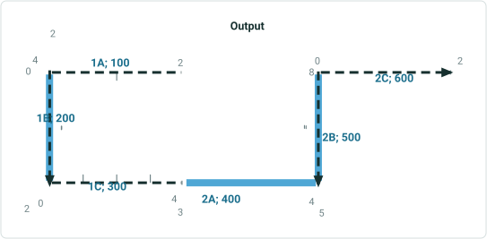

| Route Name | Line Name | Line Order | From Date | To Date | From M | To M |
| --- | --- | --- | --- | --- | --- | --- |
| 1A | L1 | 100 | 1/1/2000 | <Null> | 2 | 4 |
| 1B | L1 | 200 | 1/1/2000 | <Null> | 0 | 2 |
| 1C | L1 | 300 | 1/1/2000 | <Null> | 0 | 4 |
| 2A | L2 | 100 | 1/1/2000 | <Null> | 3 | 5 |
| 2B | L2 | 200 | 1/1/2000 | <Null> | 4 | 8 |
| 2C | L2 | 300 | 1/1/2000 | <Null> | 0 | 2 |

| Event ID | From Date | To Date | From Route ID | From M | To Route ID | To M | Location Error |
| --- | --- | --- | --- | --- | --- | --- | --- |
| S1 | 1/1/2000 | <Null> | 1A | 2 | 1C | 4 | No Error |
| S2 | 1/1/2000 | <Null> | 1A | 2 | 1B | 1 | No Error |
| S3 | 1/1/2000 | <Null> | 1B | 1.5 | 1C | 4 | No Error |
| S4 | 1/1/2000 | <Null> | 1A | 3 | 1C | 1 | No Error |
| S5 | 1/1/2000 | <Null> | 1B | 0 | 1B | 2 | No Error |

| Route Name | Line Name | Line Order | From Date | To Date | From M | To M |
| --- | --- | --- | --- | --- | --- | --- |
| 1A | L1 | 100 | 1/1/2000 | 1/1/2023 | 2 | 4 |
| 1B | L1 | 200 | 1/1/2000 | 1/1/2023 | 0 | 2 |
| 1C | L1 | 300 | 1/1/2000 | 1/1/2023 | 0 | 4 |
| 2A | L2 | 100 | 1/1/2000 | 1/1/2023 | 3 | 5 |
| 2B | L2 | 200 | 1/1/2000 | 1/1/2023 | 4 | 8 |
| 2C | L2 | 300 | 1/1/2000 | 1/1/2023 | 0 | 2 |
| 1A | L2 | 100 | 1/1/2023 | <Null> | 2 | 4 |
| 1B | L2 | 200 | 1/1/2023 | <Null> | 0 | 2 |
| 1C | L2 | 300 | 1/1/2023 | <Null> | 0 | 4 |
| 2A | L2 | 400 | 1/1/2023 | <Null> | 3 | 5 |
| 2B | L2 | 500 | 1/1/2023 | <Null> | 4 | 8 |
| 2C | L2 | 600 | 1/1/2023 | <Null> | 0 | 2 |

| Event ID | From Date | To Date | From Route ID | From M | To Route ID | To M | Location Error |
| --- | --- | --- | --- | --- | --- | --- | --- |
| S1 | 1/1/2000 | 1/1/2023 | 1A | 2 | 1C | 4 | No Error |
| S2 | 1/1/2000 | 1/1/2023 | 1A | 2 | 1B | 1 | No Error |
| S3 | 1/1/2000 | 1/1/2023 | 1B | 1.5 | 1C | 4 | No Error |
| S4 | 1/1/2000 | 1/1/2023 | 1A | 3 | 1C | 1 | No Error |
| S5 | 1/1/2000 | 1/1/2023 | 1B | 0 | 1B | 2 | No Error |

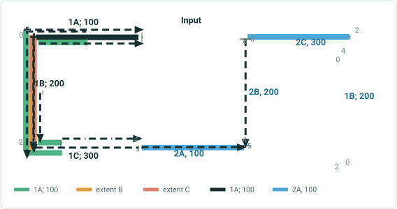

| Effective Date | 1/1/2023 |
| --- | --- |

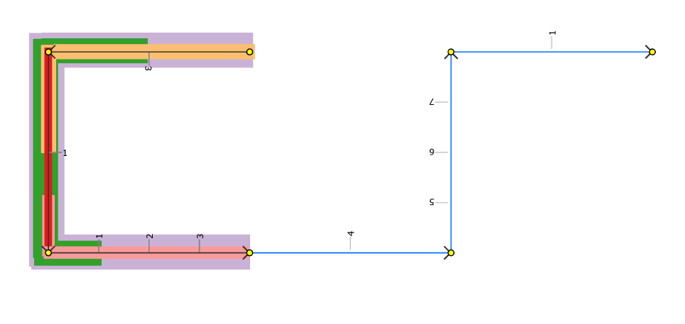 

## Slide 5

Reassign all the routes in a line to another line on right, transferring routes. Measures changed. Route Name changed.
2: Transfer to an existing line – spanning Events – Stayput and Retire Behavior.

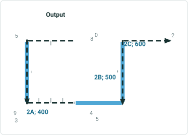

| Route Name | Line Name | Line Order | From Date | To Date | From M | To M |
| --- | --- | --- | --- | --- | --- | --- |
| 1A | L1 | 100 | 1/1/2000 | <Null> | 2 | 4 |
| 1B | L1 | 200 | 1/1/2000 | <Null> | 0 | 2 |
| 1C | L1 | 300 | 1/1/2000 | <Null> | 0 | 4 |
| 2A | L2 | 100 | 1/1/2000 | <Null> | 3 | 5 |
| 2B | L2 | 200 | 1/1/2000 | <Null> | 4 | 8 |
| 2C | L2 | 300 | 1/1/2000 | <Null> | 0 | 2 |

| Event ID | From Date | To Date | From Route ID | From M | To Route ID | To M | Location Error |
| --- | --- | --- | --- | --- | --- | --- | --- |
| S1 | 1/1/2000 | <Null> | 1A | 2 | 1C | 4 | No Error |
| S2 | 1/1/2000 | <Null> | 1A | 2 | 1B | 1 | No Error |
| S3 | 1/1/2000 | <Null> | 1B | 1.5 | 1C | 4 | No Error |
| S4 | 1/1/2000 | <Null> | 1A | 3 | 1C | 1 | No Error |
| S5 | 1/1/2000 | <Null> | 1B | 0 | 1B | 2 | No Error |

| Event ID | From Date | To Date | From Route ID | From M | To Route ID | To M | Location Error |
| --- | --- | --- | --- | --- | --- | --- | --- |
| S1 | 1/1/2000 | 1/1/2023 | 1A | 2 | 1C | 4 | No Error |
| S2 | 1/1/2000 | 1/1/2023 | 1A | 2 | 1B | 1 | No Error |
| S3 | 1/1/2000 | 1/1/2023 | 1B | 1.5 | 1C | 4 | No Error |
| S4 | 1/1/2000 | 1/1/2023 | 1A | 3 | 1C | 1 | No Error |
| S5 | 1/1/2000 | 1/1/2023 | 1B | 0 | 1B | 2 | No Error |

| Route Name | Line Name | Line Order | From Date | To Date | From M | To M |
| --- | --- | --- | --- | --- | --- | --- |
| 1A | L1 | 100 | 1/1/2000 | 1/1/2023 | 2 | 4 |
| 1B | L1 | 200 | 1/1/2000 | 1/1/2023 | 0 | 2 |
| 1C | L1 | 300 | 1/1/2000 | 1/1/2023 | 0 | 4 |
| 2A | L2 | 100 | 1/1/2000 | 1/1/2023 | 3 | 5 |
| 2B | L2 | 200 | 1/1/2000 | 1/1/2023 | 4 | 8 |
| 2C | L2 | 300 | 1/1/2000 | 1/1/2023 | 0 | 2 |
| 1A_New | L2 | 100 | 1/1/2023 | <Null> | 5 | 8 |
| 1B_New | L2 | 200 | 1/1/2023 | <Null> | 2 | 4 |
| 1C_New | L2 | 300 | 1/1/2023 | <Null> | 5 | 9 |
| 2A | L2 | 400 | 1/1/2023 | <Null> | 3 | 5 |
| 2B | L2 | 500 | 1/1/2023 | <Null> | 4 | 8 |
| 2C | L2 | 600 | 1/1/2023 | <Null> | 0 | 2 |

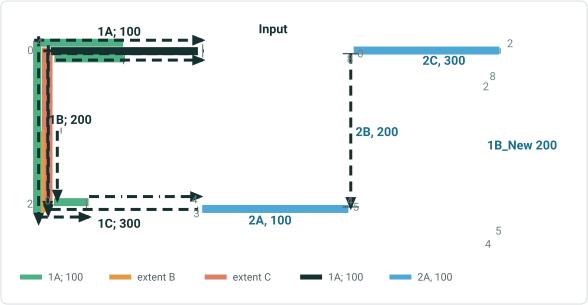

| Effective Date | 1/1/2023 |
| --- | --- |

 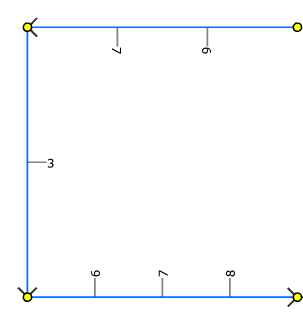 

## Slide 6

Reassign all the routes in a line to another line on right, transferring routes and measures. The effective date is same as source route’s From Date. keep original measures; keep original route name
3-1: Transfer to an existing line – spanning Events – Stayput and Retire Behavior. – irrespective of behavior

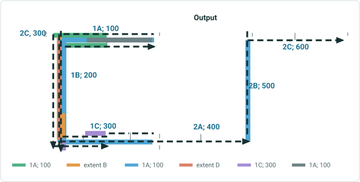

| Route Name | Line Name | Line Order | From Date | To Date | From M | To M |
| --- | --- | --- | --- | --- | --- | --- |
| 1A | L1 | 100 | 1/1/2000 | <Null> | 2 | 4 |
| 1B | L1 | 200 | 1/1/2000 | <Null> | 0 | 2 |
| 1C | L1 | 300 | 1/1/2000 | <Null> | 0 | 4 |
| 2A | L2 | 100 | 1/1/2000 | <Null> | 3 | 5 |
| 2B | L2 | 200 | 1/1/2000 | <Null> | 4 | 8 |
| 2C | L2 | 300 | 1/1/2000 | <Null> | 0 | 2 |

| Event ID | From Date | To Date | From Route ID | From M | To Route ID | To M | Location Error |
| --- | --- | --- | --- | --- | --- | --- | --- |
| S1 | 1/1/2000 | <Null> | 1A | 2 | 1C | 4 | No Error |
| S2 | 1/1/2000 | <Null> | 1A | 2 | 1B | 1 | No Error |
| S3 | 1/1/2000 | <Null> | 1B | 1.5 | 1C | 4 | No Error |
| S4 | 1/1/2000 | <Null> | 1A | 3 | 1C | 1 | No Error |
| S5 | 1/1/2000 | <Null> | 1B | 0 | 1B | 2 | No Error |

| Event ID | From Date | To Date | From Route ID | From M | To Route ID | To M | Location Error |
| --- | --- | --- | --- | --- | --- | --- | --- |
| S1 | 1/1/2000 | <Null> | 1A | 2 | 1C | 4 | No Error |
| S2 | 1/1/2000 | <Null | 1A | 2 | 1B | 1 | No Error |
| S3 | 1/1/2000 | <Null | 1B | 1.5 | 1C | 4 | No Error |
| S4 | 1/1/2000 | <Null | 1A | 3 | 1C | 1 | No Error |
| S5 | 1/1/2000 | <Null | 1B | 0 | 1B | 2 | No Error |

| Route Name | Line Name | Line Order | From Date | To Date | From M | To M |
| --- | --- | --- | --- | --- | --- | --- |
| 1A | L2 | 100 | 1/1/2000 | <Null> | 2 | 4 |
| 1B | L2 | 200 | 1/1/2000 | <Null> | 0 | 2 |
| 1C | L2 | 300 | 1/1/2000 | <Null> | 0 | 4 |
| 2A | L2 | 400 | 1/1/2000 | <Null> | 3 | 5 |
| 2B | L2 | 500 | 1/1/2000 | <Null> | 4 | 8 |
| 2C | L2 | 600 | 1/1/2000 | <Null> | 0 | 2 |

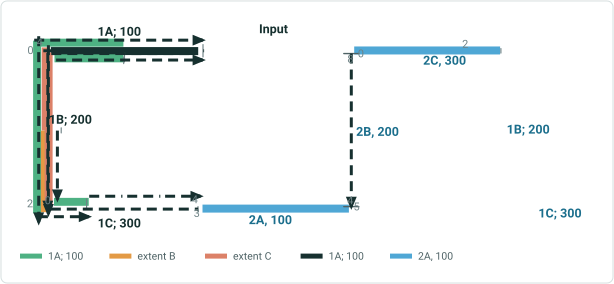

| Effective Date | 1/1/2000 |
| --- | --- |

 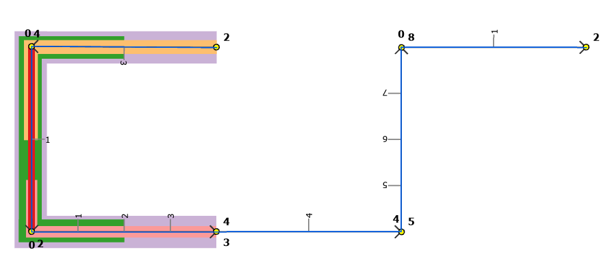

## Slide 7

Reassign all the routes in a line to another line on right, transferring routes and measures. The effective date is same as source route’s From Date. Change Measures; keep original route name
3-2: Transfer to an existing line – spanning Events – Stayput & Retire – irrespective of behavior

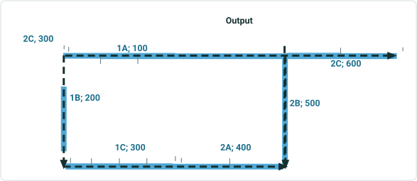

| Route Name | Line Name | Line Order | From Date | To Date | From M | To M |
| --- | --- | --- | --- | --- | --- | --- |
| 1A | L1 | 100 | 1/1/2000 | <Null> | 2 | 4 |
| 1B | L1 | 200 | 1/1/2000 | <Null> | 0 | 2 |
| 1C | L1 | 300 | 1/1/2000 | <Null> | 0 | 4 |
| 2A | L2 | 100 | 1/1/2000 | <Null> | 3 | 5 |
| 2B | L2 | 200 | 1/1/2000 | <Null> | 4 | 8 |
| 2C | L2 | 300 | 1/1/2000 | <Null> | 0 | 2 |

| Event ID | From Date | To Date | From Route ID | From M | To Route ID | To M | Location Error |
| --- | --- | --- | --- | --- | --- | --- | --- |
| S1 | 1/1/2000 | <Null> | 1A | 2 | 1C | 4 | No Error |
| S2 | 1/1/2000 | <Null> | 1A | 2 | 1B | 1 | No Error |
| S3 | 1/1/2000 | <Null> | 1B | 1.5 | 1C | 4 | No Error |
| S4 | 1/1/2000 | <Null> | 1A | 3 | 1C | 1 | No Error |
| S5 | 1/1/2000 | <Null> | 1B | 0 | 1B | 2 | No Error |

| Event ID | From Date | To Date | From Route ID | From M | To Route ID | To M | Location Error |
| --- | --- | --- | --- | --- | --- | --- | --- |
| S1 | 1/1/2000 | <Null> | 1A | 2 | 1C | 4 | Invalid Measure |
| S2 | 1/1/2000 | <Null | 1A | 2 | 1B | 1 | Invalid Measure |
| S3 | 1/1/2000 | <Null | 1B | 1.5 | 1C | 4 | Invalid Measure |
| S4 | 1/1/2000 | <Null | 1A | 3 | 1C | 1 | Invalid Measure |
| S5 | 1/1/2000 | <Null | 1B | 0 | 1B | 2 | Invalid Measure |

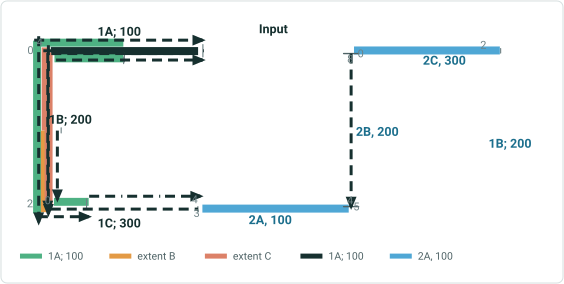

| Effective Date | 1/1/2000 |
| --- | --- |

| Route Name | Line Name | Line Order | From Date | To Date | From M | To M |
| --- | --- | --- | --- | --- | --- | --- |
| 1A | L2 | 100 | 1/1/2000 | <Null> | 5 | 8 |
| 1B | L2 | 200 | 1/1/2000 | <Null> | 2 | 4 |
| 1C | L2 | 300 | 1/1/2000 | <Null> | 5 | 9 |
| 2A | L2 | 400 | 1/1/2000 | <Null> | 3 | 5 |
| 2B | L2 | 500 | 1/1/2000 | <Null> | 4 | 8 |
| 2C | L2 | 600 | 1/1/2000 | <Null> | 0 | 2 |

 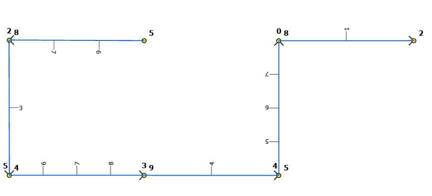

## Slide 8

Reassign all the routes in a line to another line on right, transferring routes and measures. The effective date is same as source route’s From Date. Change Measures; Change route name
3-3: Transfer to an existing line – spanning Events – Stayput & Retire – irrespective of behavior

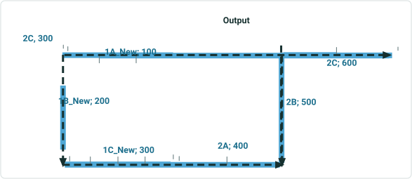

| Route Name | Line Name | Line Order | From Date | To Date | From M | To M |
| --- | --- | --- | --- | --- | --- | --- |
| 1A | L1 | 100 | 1/1/2000 | <Null> | 2 | 4 |
| 1B | L1 | 200 | 1/1/2000 | <Null> | 0 | 2 |
| 1C | L1 | 300 | 1/1/2000 | <Null> | 0 | 4 |
| 2A | L2 | 100 | 1/1/2000 | <Null> | 3 | 5 |
| 2B | L2 | 200 | 1/1/2000 | <Null> | 4 | 8 |
| 2C | L2 | 300 | 1/1/2000 | <Null> | 0 | 2 |

| Event ID | From Date | To Date | From Route ID | From M | To Route ID | To M | Location Error |
| --- | --- | --- | --- | --- | --- | --- | --- |
| S1 | 1/1/2000 | <Null> | 1A | 2 | 1C | 4 | No Error |
| S2 | 1/1/2000 | <Null> | 1A | 2 | 1B | 1 | No Error |
| S3 | 1/1/2000 | <Null> | 1B | 1.5 | 1C | 4 | No Error |
| S4 | 1/1/2000 | <Null> | 1A | 3 | 1C | 1 | No Error |
| S5 | 1/1/2000 | <Null> | 1B | 0 | 1B | 2 | No Error |

| Event ID | From Date | To Date | From Route ID | From M | To Route ID | To M | Location Error |
| --- | --- | --- | --- | --- | --- | --- | --- |
| S1 | 1/1/2000 | <Null> | 1A | 2 | 1C | 4 | Route Not Found |
| S2 | 1/1/2000 | <Null | 1A | 2 | 1B | 1 | Route Not Found |
| S3 | 1/1/2000 | <Null | 1B | 1.5 | 1C | 4 | Route Not Found |
| S4 | 1/1/2000 | <Null | 1A | 3 | 1C | 1 | Route Not Found |
| S5 | 1/1/2000 | <Null | 1B | 0 | 1B | 2 | Route Not Found |

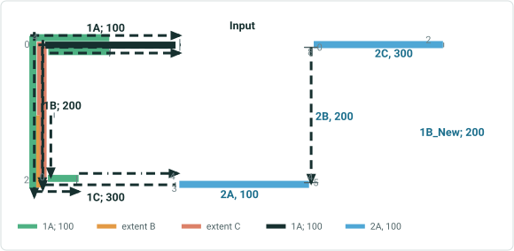

| Effective Date | 1/1/2000 |
| --- | --- |

| Route Name | Line Name | Line Order | From Date | To Date | From M | To M |
| --- | --- | --- | --- | --- | --- | --- |
| 1A_new | L2 | 100 | 1/1/2000 | <Null> | 5 | 8 |
| 1B_new | L2 | 200 | 1/1/2000 | <Null> | 2 | 4 |
| 1C_new | L2 | 300 | 1/1/2000 | <Null> | 5 | 9 |
| 2A | L2 | 400 | 1/1/2000 | <Null> | 3 | 5 |
| 2B | L2 | 500 | 1/1/2000 | <Null> | 4 | 8 |
| 2C | L2 | 600 | 1/1/2000 | <Null> | 0 | 2 |

 

## Slide 9

Reassign all the routes in a line to another line on right, transferring routes and measures. The effective date is same as source route’s From Date. Keep original route name , changing only the  from measure on the first route
3-4: Transfer to an existing line – spanning Events – StayPut and Retire Behavior. (?)

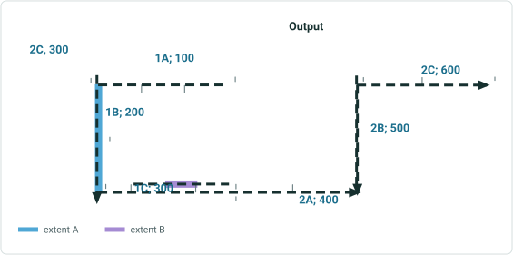

| Route Name | Line Name | Line Order | From Date | To Date | From M | To M |
| --- | --- | --- | --- | --- | --- | --- |
| 1A | L1 | 100 | 1/1/2000 | <Null> | 2 | 4 |
| 1B | L1 | 200 | 1/1/2000 | <Null> | 0 | 2 |
| 1C | L1 | 300 | 1/1/2000 | <Null> | 0 | 4 |
| 2A | L2 | 100 | 1/1/2000 | <Null> | 3 | 5 |
| 2B | L2 | 200 | 1/1/2000 | <Null> | 4 | 8 |
| 2C | L2 | 300 | 1/1/2000 | <Null> | 0 | 2 |

| Event ID | From Date | To Date | From Route ID | From M | To Route ID | To M | Location Error |
| --- | --- | --- | --- | --- | --- | --- | --- |
| S1 | 1/1/2000 | <Null> | 1A | 2 | 1C | 4 | No Error |

| Event ID | From Date | To Date | From Route ID | From M | To Route ID | To M | Location Error |
| --- | --- | --- | --- | --- | --- | --- | --- |
| S1 | 1/1/2000 | <Null> | 1A | 2 | 1C | 4 | No Error |

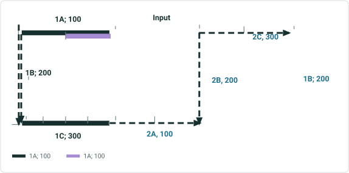

| Effective Date | 1/1/2000 |
| --- | --- |

| Route Name | Line Name | Line Order | From Date | To Date | From M | To M |
| --- | --- | --- | --- | --- | --- | --- |
| 1A | L2 | 100 | 1/1/2000 | <Null> | 1 | 4 |
| 1B | L2 | 200 | 1/1/2000 | <Null> | 0 | 2 |
| 1C | L2 | 300 | 1/1/2000 | <Null> | 0 | 4 |
| 2A | L2 | 400 | 1/1/2000 | <Null> | 3 | 5 |
| 2B | L2 | 500 | 1/1/2000 | <Null> | 4 | 8 |
| 2C | L2 | 600 | 1/1/2000 | <Null> | 0 | 2 |

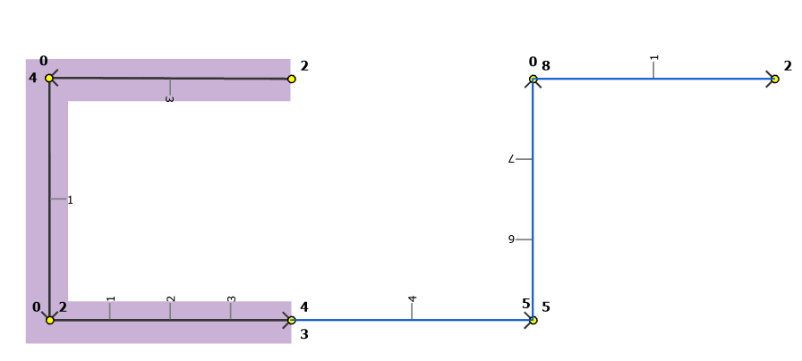 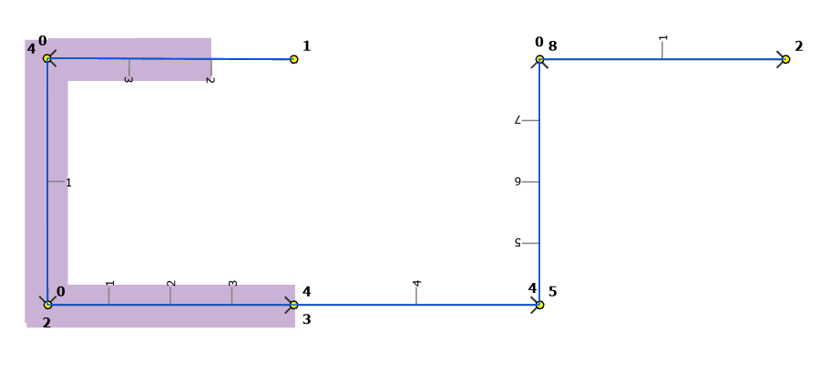

## Slide 10

Reassign all the routes in a line to another line on right, transferring routes and measures. The effective date is same as source route’s From Date. Same route name , changing only the  To Measure of the last route
3-5: Transfer to an existing line – spanning Events – Stayput & Retire Behavior.

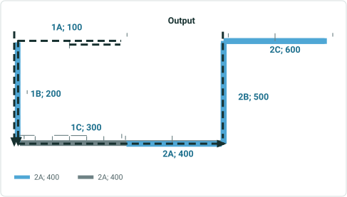

| Route Name | Line Name | Line Order | From Date | To Date | From M | To M |
| --- | --- | --- | --- | --- | --- | --- |
| 1A | L1 | 100 | 1/1/2000 | <Null> | 2 | 4 |
| 1B | L1 | 200 | 1/1/2000 | <Null> | 0 | 2 |
| 1C | L1 | 300 | 1/1/2000 | <Null> | 0 | 4 |
| 2A | L2 | 100 | 1/1/2000 | <Null> | 3 | 5 |
| 2B | L2 | 200 | 1/1/2000 | <Null> | 4 | 8 |
| 2C | L2 | 300 | 1/1/2000 | <Null> | 0 | 2 |

| Event ID | From Date | To Date | From Route ID | From M | To Route ID | To M | Location Error |
| --- | --- | --- | --- | --- | --- | --- | --- |
| S1 | 1/1/2000 | <Null> | 1A | 2 | 1C | 4 | No Error |

| Event ID | From Date | To Date | From Route ID | From M | To Route ID | To M | Location Error |
| --- | --- | --- | --- | --- | --- | --- | --- |
| S1 | 1/1/2000 | <Null> | 1A | 2 | 1C | 4 | No Error |

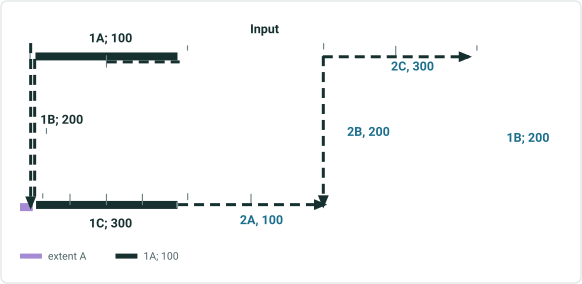

| Effective Date | 1/1/2000 |
| --- | --- |

| Route Name | Line Name | Line Order | From Date | To Date | From M | To M |
| --- | --- | --- | --- | --- | --- | --- |
| 1A | L2 | 100 | 1/1/2000 | <Null> | 2 | 4 |
| 1B | L2 | 200 | 1/1/2000 | <Null> | 0 | 2 |
| 1C | L2 | 300 | 1/1/2000 | <Null> | 0 | 6 |
| 2A | L2 | 400 | 1/1/2000 | <Null> | 3 | 5 |
| 2B | L2 | 500 | 1/1/2000 | <Null> | 4 | 8 |
| 2C | L2 | 600 | 1/1/2000 | <Null> | 0 | 2 |

 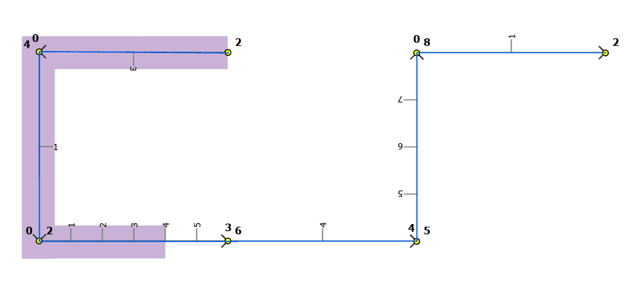

## Slide 11

Reassign all the routes in a line to another line on right, transferring routes and measures. The effective date is same as source route’s From Date. Same route name , changing the  To Measure of the last route, changing the from measure of the first route
3-6: Transfer to an existing line – spanning Events – Stayput & Retire Behavior.

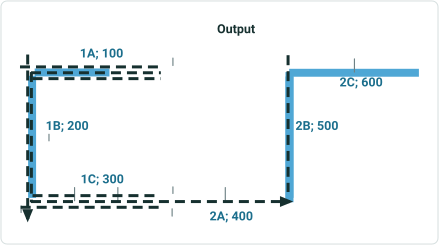

| Route Name | Line Name | Line Order | From Date | To Date | From M | To M |
| --- | --- | --- | --- | --- | --- | --- |
| 1A | L1 | 100 | 1/1/2000 | <Null> | 2 | 4 |
| 1B | L1 | 200 | 1/1/2000 | <Null> | 0 | 2 |
| 1C | L1 | 300 | 1/1/2000 | <Null> | 0 | 4 |
| 2A | L2 | 100 | 1/1/2000 | <Null> | 3 | 5 |
| 2B | L2 | 200 | 1/1/2000 | <Null> | 4 | 8 |
| 2C | L2 | 300 | 1/1/2000 | <Null> | 0 | 2 |

| Event ID | From Date | To Date | From Route ID | From M | To Route ID | To M | Location Error |
| --- | --- | --- | --- | --- | --- | --- | --- |
| S1 | 1/1/2000 | <Null> | 1A | 2 | 1C | 4 | No Error |

| Event ID | From Date | To Date | From Route ID | From M | To Route ID | To M | Location Error |
| --- | --- | --- | --- | --- | --- | --- | --- |
| S1 | 1/1/2000 | <Null> | 1A | 2 | 1C | 4 | Partial Match Fr M & To M |

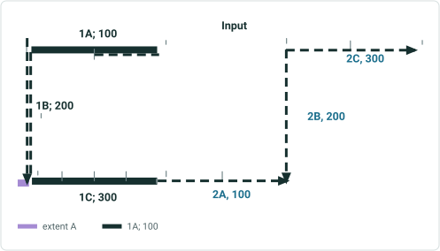

| Effective Date | 1/1/2000 |
| --- | --- |

| Route Name | Line Name | Line Order | From Date | To Date | From M | To M |
| --- | --- | --- | --- | --- | --- | --- |
| 1A | L2 | 100 | 1/1/2000 | <Null> | 3 | 4 |
| 1B | L2 | 200 | 1/1/2000 | <Null> | 0 | 2 |
| 1C | L2 | 300 | 1/1/2000 | <Null> | 0 | 3 |
| 2A | L2 | 400 | 1/1/2000 | <Null> | 3 | 5 |
| 2B | L2 | 500 | 1/1/2000 | <Null> | 4 | 8 |
| 2C | L2 | 600 | 1/1/2000 | <Null> | 0 | 2 |

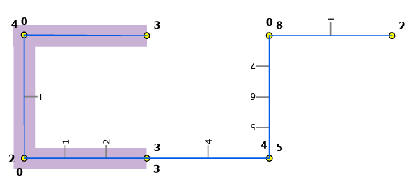 

## Slide 12

 Reassign all the routes in a line to another line on right, 2/3 route names and measures maintained. The first route in the line has changed name and measure changed.
4: Transfer to an existing line – spanning Events – Stayput and Retire Behavior.

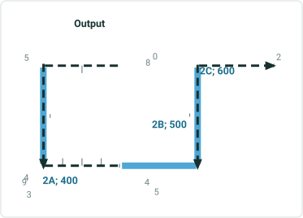

| Route Name | Line Name | Line Order | From Date | To Date | From M | To M |
| --- | --- | --- | --- | --- | --- | --- |
| 1A | L1 | 100 | 1/1/2000 | <Null> | 2 | 4 |
| 1B | L1 | 200 | 1/1/2000 | <Null> | 0 | 2 |
| 1C | L1 | 300 | 1/1/2000 | <Null> | 0 | 4 |
| 2A | L2 | 100 | 1/1/2000 | <Null> | 3 | 5 |
| 2B | L2 | 200 | 1/1/2000 | <Null> | 4 | 8 |
| 2C | L2 | 300 | 1/1/2000 | <Null> | 0 | 2 |

| Event ID | From Date | To Date | From Route ID | From M | To Route ID | To M | Location Error |
| --- | --- | --- | --- | --- | --- | --- | --- |
| S1 | 1/1/2000 | <Null> | 1A | 2 | 1C | 4 | No Error |
| S2 | 1/1/2000 | <Null> | 1A | 2 | 1B | 1 | No Error |
| S3 | 1/1/2000 | <Null> | 1B | 1.5 | 1C | 4 | No Error |
| S4 | 1/1/2000 | <Null> | 1A | 3 | 1C | 1 | No Error |
| S5 | 1/1/2000 | <Null> | 1B | 0 | 1B | 2 | No Error |

| Event ID | From Date | To Date | From Route ID | From M | To Route ID | To M | Location Error |
| --- | --- | --- | --- | --- | --- | --- | --- |
| S1 | 1/1/2000 | 1/1/2023 | 1A | 2 | 1C | 4 | No Error |
| S2 | 1/1/2000 | 1/1/2023 | 1A | 2 | 1B | 1 | No Error |
| S3 | 1/1/2000 | 1/1/2023 | 1B | 1.5 | 1C | 4 | No Error |
| S4 | 1/1/2000 | 1/1/2023 | 1A | 3 | 1C | 1 | No Error |
| S5 | 1/1/2000 | 1/1/2023 | 1B | 0 | 1B | 2 | No Error |

| Route Name | Line Name | Line Order | From Date | To Date | From M | To M |
| --- | --- | --- | --- | --- | --- | --- |
| 1A | L1 | 100 | 1/1/2000 | 1/1/2023 | 2 | 4 |
| 1B | L1 | 200 | 1/1/2000 | 1/1/2023 | 0 | 2 |
| 1C | L1 | 300 | 1/1/2000 | 1/1/2023 | 0 | 4 |
| 2A | L2 | 100 | 1/1/2000 | 1/1/2023 | 3 | 5 |
| 2B | L2 | 200 | 1/1/2000 | 1/1/2023 | 4 | 8 |
| 2C | L2 | 300 | 1/1/2000 | 1/1/2023 | 0 | 2 |
| 1A_New | L2 | 100 | 1/1/2023 | <Null> | 5 | 8 |
| 1B | L2 | 200 | 1/1/2023 | <Null> | 0 | 2 |
| 1C | L2 | 300 | 1/1/2023 | <Null> | 0 | 4 |
| 2A | L2 | 400 | 1/1/2023 | <Null> | 3 | 5 |
| 2B | L2 | 500 | 1/1/2023 | <Null> | 4 | 8 |
| 2C | L2 | 600 | 1/1/2023 | <Null> | 0 | 2 |

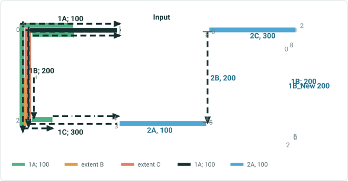

| Effective Date | 1/1/2023 |
| --- | --- |

   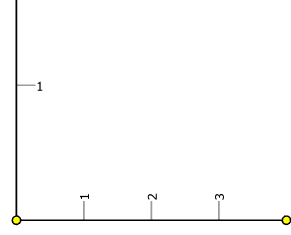 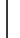

## Slide 13

Reassign 1 entire route  and a partial route  in a line to another line transferring routes and measures. ; Keep the same name for the
entire route and partial route (name of a retired route from the line to which route is reassigned), Change measures
5-1: Transfer to an existing line – spanning Events – Stayput Behavior

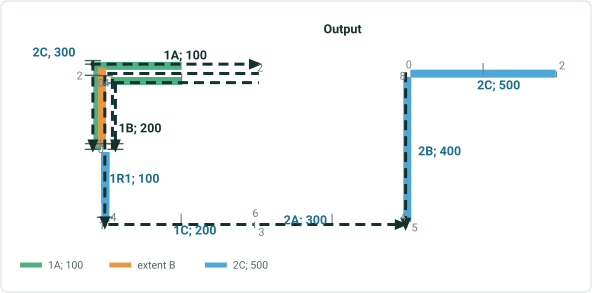

| Route Name | Line Name | Line Order | From Date | To Date | From M | To M |
| --- | --- | --- | --- | --- | --- | --- |
| 1A | L1 | 100 | 1/1/2000 | <Null> | 2 | 4 |
| 1B | L1 | 200 | 1/1/2000 | <Null> | 0 | 2 |
| 1C | L1 | 300 | 1/1/2000 | <Null> | 0 | 4 |
| 2A | L2 | 100 | 1/1/2000 | <Null> | 3 | 5 |
| 2B | L2 | 200 | 1/1/2000 | <Null> | 4 | 8 |
| 2C | L2 | 300 | 1/1/2000 | <Null> | 0 | 2 |

| Event ID | From Date | To Date | From Route ID | From M | To Route ID | To M | Location Error |
| --- | --- | --- | --- | --- | --- | --- | --- |
| S1 | 1/1/2000 | <Null> | 1A | 2 | 1C | 4 | No Error |
| S2 | 1/1/2000 | <Null> | 1A | 2 | 1B | 1 | No Error |
| S3 | 1/1/2000 | <Null> | 1B | 1 | 1C | 4 | No Error |
| S4 | 1/1/2000 | <Null> | 1A | 3 | 1C | 2 | No Error |
| S5 | 1/1/2000 | <Null> | 1C | 0 | 1C | 4 | No Error |

| Route Name | Line Name | Line Order | From Date | To Date | From M | To M |
| --- | --- | --- | --- | --- | --- | --- |
| 1A | L1 | 100 | 1/1/2000 | <Null> | 2 | 4 |
| 1B | L1 | 200 | 1/1/2000 | 1/1/2023 | 0 | 2 |
| 1C | L1 | 300 | 1/1/2000 | 1/1/2023 | 0 | 4 |
| 2A | L2 | 100 | 1/1/2000 | 1/1/2023 | 3 | 5 |
| 2B | L2 | 200 | 1/1/2000 | 1/1/2023 | 4 | 8 |
| 2C | L2 | 300 | 1/1/2000 | 1/1/2023 | 0 | 2 |
| 1B | L1 | 200 | 1/1/2023 | <Null> | 0 | 1 |
| 1R1 | L2 | 100 | 1/1/2023 | <Null> | 0 | 1 |
| 1C | L2 | 200 | 1/1/2023 | <Null> | 4 | 6 |
| 2A | L2 | 300 | 1/1/2023 | <Null> | 3 | 5 |
| 2B | L2 | 400 | 1/1/2023 | <Null> | 4 | 8 |
| 2C | L2 | 500 | 1/1/2023 | <Null> | 0 | 2 |

| Event ID | From Date | To Date | From Route ID | From M | To Route ID | To M | Location Error |
| --- | --- | --- | --- | --- | --- | --- | --- |
| S1 | 1/1/2000 | 1/1/2023 | 1A | 2 | 1C | 4 | No Error |
| S1 | 1/1/2023 | <Null> | 1A | 2 | 1B | 1 | No Error |
| S2 | 1/1/2000 | <Null> | 1A | 2 | 1B | 1 | No Error |
| S3 | 1/1/2000 | 1/1/2023 | 1B | 1 | 1C | 4 | No Error |
| S4 | 1/1/2000 | 1/1/2023 | 1A | 3 | 1C | 2 | No Error |
| S4 | 1/1/2023 | <Null> | 1A | 3 | 1B | 1 | No Error |
| S5 | 1/1/2000 | 1/1/2023 | 1B | 0 | 1B | 2 | No Error |

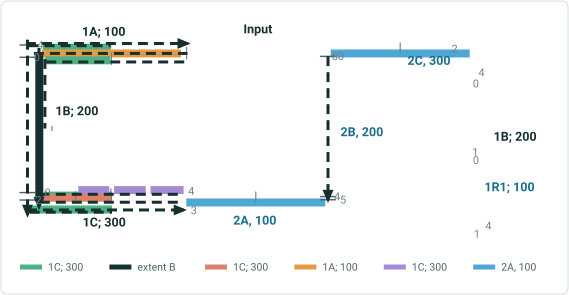

| Effective Date | 1/1/2023 |
| --- | --- |

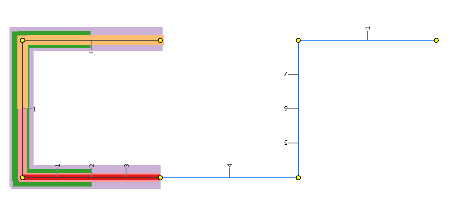

## Slide 14

Reassign 1 entire route  and a partial route  in a line to another line transferring routes and measures. ; Keep the same name for the
Entire route and partial route (name of a retired route from the line to which route is reassigned). Change measures
5-2: Transfer to an existing line – spanning Events – Retire Behavior

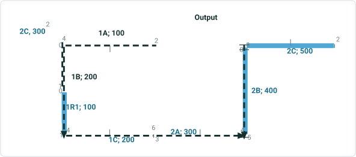

| Route Name | Line Name | Line Order | From Date | To Date | From M | To M |
| --- | --- | --- | --- | --- | --- | --- |
| 1A | L1 | 100 | 1/1/2000 | <Null> | 2 | 4 |
| 1B | L1 | 200 | 1/1/2000 | <Null> | 0 | 2 |
| 1C | L1 | 300 | 1/1/2000 | <Null> | 0 | 4 |
| 2A | L2 | 100 | 1/1/2000 | <Null> | 3 | 5 |
| 2B | L2 | 200 | 1/1/2000 | <Null> | 4 | 8 |
| 2C | L2 | 300 | 1/1/2000 | <Null> | 0 | 2 |

| Event ID | From Date | To Date | From Route ID | From M | To Route ID | To M | Location Error |
| --- | --- | --- | --- | --- | --- | --- | --- |
| S1 | 1/1/2000 | <Null> | 1A | 2 | 1C | 4 | No Error |
| S2 | 1/1/2000 | <Null> | 1A | 2 | 1B | 1 | No Error |
| S3 | 1/1/2000 | <Null> | 1B | 1 | 1C | 4 | No Error |
| S4 | 1/1/2000 | <Null> | 1A | 3 | 1C | 2 | No Error |
| S5 | 1/1/2000 | <Null> | 1C | 0 | 1C | 4 | No Error |

| Route Name | Line Name | Line Order | From Date | To Date | From M | To M |
| --- | --- | --- | --- | --- | --- | --- |
| 1A | L1 | 100 | 1/1/2000 | <Null> | 2 | 4 |
| 1B | L1 | 200 | 1/1/2000 | 1/1/2023 | 0 | 2 |
| 1C | L1 | 300 | 1/1/2000 | 1/1/2023 | 0 | 4 |
| 2A | L2 | 100 | 1/1/2000 | 1/1/2023 | 3 | 5 |
| 2B | L2 | 200 | 1/1/2000 | 1/1/2023 | 4 | 8 |
| 2C | L2 | 300 | 1/1/2000 | 1/1/2023 | 0 | 2 |
| 1B | L1 | 200 | 1/1/2023 | <Null> | 0 | 1 |
| 1R1 | L2 | 100 | 1/1/2023 | <Null> | 0 | 1 |
| 1C | L2 | 200 | 1/1/2023 | <Null> | 4 | 6 |
| 2A | L2 | 300 | 1/1/2023 | <Null> | 3 | 5 |
| 2B | L2 | 400 | 1/1/2023 | <Null> | 4 | 8 |
| 2C | L2 | 500 | 1/1/2023 | <Null> | 0 | 2 |

| Event ID | From Date | To Date | From Route ID | From M | To Route ID | To M | Location Error |
| --- | --- | --- | --- | --- | --- | --- | --- |
| S1 | 1/1/2000 | 1/1/2023 | 1A | 2 | 1C | 4 | No Error |
| S2 | 1/1/2000 | <Null> | 1A | 2 | 1B | 1 | No Error |
| S3 | 1/1/2000 | 1/1/2023 | 1B | 1 | 1C | 4 | No Error |
| S4 | 1/1/2000 | 1/1/2023 | 1A | 3 | 1C | 2 | No Error |
| S5 | 1/1/2000 | 1/1/2023 | 1B | 0 | 1B | 2 | No Error |


| Effective Date | 1/1/2023 |
| --- | --- |


## Slide 15

 Transfer partial route (1/2 of a route) in a line to adjacent upstream existing line , recalibrate source route downstream ,calibrate set to stayput, change Route Name, no measure change for the reassigned route portion
6-1: Transfer to an existing line – spanning Events – Stayput Behavior

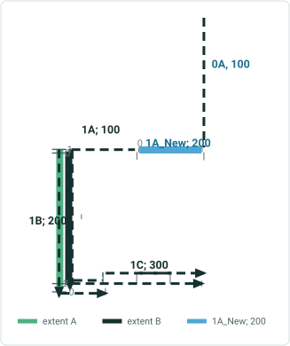

| Route Name | Line Name | Line Order | From Date | To Date | From M | To M |
| --- | --- | --- | --- | --- | --- | --- |
| 0A | L0 | 100 | 1/1/2000 | <Null> | 3 | 5 |
| 1A | L1 | 100 | 1/1/2000 | <Null> | 2 | 4 |
| 1B | L1 | 200 | 1/1/2000 | <Null> | 0 | 2 |
| 1C | L1 | 300 | 1/1/2000 | <Null> | 0 | 4 |

| Event ID | From Date | To Date | From Route ID | From M | To Route ID | To M | Location Error |
| --- | --- | --- | --- | --- | --- | --- | --- |
| S1 | 1/1/2000 | <Null> | 1A | 2 | 1C | 4 | No Error |
| S2 | 1/1/2000 | <Null> | 1A | 2 | 1B | 1 | No Error |
| S3 | 1/1/2000 | <Null> | 1B | 1.5 | 1C | 4 | No Error |
| S4 | 1/1/2000 | <Null> | 1A | 3 | 1C | 1 | No Error |
| S5 | 1/1/2000 | <Null> | 1A | 2 | 1A | 3 | No Error |

| Event ID | From Date | To Date | From Route ID | From M | To Route ID | To M | Location Error |
| --- | --- | --- | --- | --- | --- | --- | --- |
| S1 | 1/1/2000 | 1/1/2023 | 1A | 2 | 1C | 4 | No Error |
| S1 | 1/1/2023 | <Null> | 1A | 0 | 1C | 4 | No Error |
| S2 | 1/1/2000 | 1/1/2023 | 1A | 2 | 1B | 1 | No Error |
| S2 | 1/1/2023 | <Null> | 1A | 0 | 1B | 1 | No Error |
| S3 | 1/1/2000 | <Null> | 1B | 1.5 | 1C | 4 | No Error |
| S4 | 1/1/2000 | 1/1/2023 | 1A | 3 | 1C | 1 | No Error |
| S4 | 1/1/2000 | <Null> | 1A | 0 | 1C | 1 | No Error |
| S5 | 1/1/2000 | 1/1/2023 | 1A | 2 | 1A | 3 | No Error |

| Route Name | Line Name | Line Order | From Date | To Date | From M | To M |
| --- | --- | --- | --- | --- | --- | --- |
| 0A | L0 | 100 | 1/1/2000 | <Null> | 3 | 5 |
| 1A_New | L0 | 200 | 1/1/2023 | <Null> | 2 | 3 |
| 1A | L1 | 100 | 1/1/2023 | <Null> | 0 | 1 |
| 1A | L1 | 100 | 1/1/2000 | 1/1/2023 | 2 | 4 |
| 1B | L1 | 200 | 1/1/2000 | <Null> | 0 | 2 |
| 1C | L1 | 300 | 1/1/2000 | <Null> | 0 | 4 |

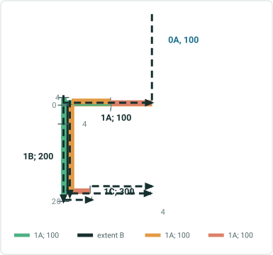

| Effective Date | 1/1/2023 |
| --- | --- |
| Source RD | Yes |

## Slide 16

 Transfer partial route (1/2 of a route) in a line to adjacent upstream existing line , recalibrate source route downstream, calibrate set to retire, route name changed , no measure change for the reassigned route portion
6-2: Transfer to an existing line – spanning Events – Retire Behavior

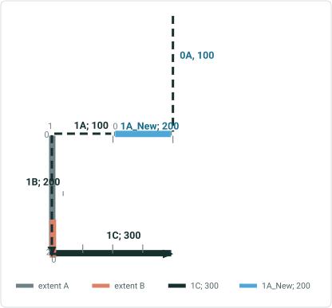

| Route Name | Line Name | Line Order | From Date | To Date | From M | To M |
| --- | --- | --- | --- | --- | --- | --- |
| 0A | L0 | 100 | 1/1/2000 | <Null> | 3 | 5 |
| 1A | L1 | 100 | 1/1/2000 | <Null> | 2 | 4 |
| 1B | L1 | 200 | 1/1/2000 | <Null> | 0 | 2 |
| 1C | L1 | 300 | 1/1/2000 | <Null> | 0 | 4 |

| Event ID | From Date | To Date | From Route ID | From M | To Route ID | To M | Location Error |
| --- | --- | --- | --- | --- | --- | --- | --- |
| S1 | 1/1/2000 | <Null> | 1A | 2 | 1C | 4 | No Error |
| S2 | 1/1/2000 | <Null> | 1A | 2 | 1B | 1 | No Error |
| S3 | 1/1/2000 | <Null> | 1B | 1.5 | 1C | 4 | No Error |
| S4 | 1/1/2000 | <Null> | 1A | 3 | 1C | 1 | No Error |
| S5 | 1/1/2000 | <Null> | 1A | 2 | 1A | 3 | No Error |

| Event ID | From Date | To Date | From Route ID | From M | To Route ID | To M | Location Error |
| --- | --- | --- | --- | --- | --- | --- | --- |
| S1 | 1/1/2000 | 1/1/2023 | 1A | 2 | 1C | 4 | No Error |
| S2 | 1/1/2000 | 1/1/2023 | 1A | 2 | 1B | 1 | No Error |
| S3 | 1/1/2000 | <Null> | 1B | 1.5 | 1C | 4 | No Error |
| S4 | 1/1/2000 | 1/1/2023 | 1A | 3 | 1C | 1 | No Error |
| S5 | 1/1/2000 | 1/1/2023 | 1A | 2 | 1A | 3 | No Error |

| Route Name | Line Name | Line Order | From Date | To Date | From M | To M |
| --- | --- | --- | --- | --- | --- | --- |
| 0A | L0 | 100 | 1/1/2000 | <Null> | 3 | 5 |
| 1A_New | L0 | 200 | 1/1/2023 | <Null> | 2 | 3 |
| 1A | L1 | 100 | 1/1/2023 | <Null> | 0 | 1 |
| 1A | L1 | 100 | 1/1/2000 | 1/1/2023 | 2 | 4 |
| 1B | L1 | 200 | 1/1/2000 | <Null> | 0 | 2 |
| 1C | L1 | 300 | 1/1/2000 | <Null> | 0 | 4 |


| Effective Date | 1/1/2023 |
| --- | --- |
| Source RD | Yes |

## Slide 17

 Transfer partial route (1/2 of a route) in a line to adjacent upstream existing line ,  do not recalibrate source route downstream, route name changed , no measure change for the reassigned route portion
7-1: Transfer to an existing line – spanning Events – Stayput Behavior


| Route Name | Line Name | Line Order | From Date | To Date | From M | To M |
| --- | --- | --- | --- | --- | --- | --- |
| 0A | L0 | 100 | 1/1/2000 | <Null> | 3 | 5 |
| 1A | L1 | 100 | 1/1/2000 | <Null> | 2 | 4 |
| 1B | L1 | 200 | 1/1/2000 | <Null> | 0 | 2 |
| 1C | L1 | 300 | 1/1/2000 | <Null> | 0 | 4 |

| Event ID | From Date | To Date | From Route ID | From M | To Route ID | To M | Location Error |
| --- | --- | --- | --- | --- | --- | --- | --- |
| S1 | 1/1/2000 | <Null> | 1A | 2 | 1C | 4 | No Error |
| S2 | 1/1/2000 | <Null> | 1A | 2 | 1B | 1 | No Error |
| S3 | 1/1/2000 | <Null> | 1B | 1.5 | 1C | 4 | No Error |
| S4 | 1/1/2000 | <Null> | 1A | 3 | 1C | 1 | No Error |
| S5 | 1/1/2000 | <Null> | 1A | 2 | 1A | 3 | No Error |

| Event ID | From Date | To Date | From Route ID | From M | To Route ID | To M | Location Error |
| --- | --- | --- | --- | --- | --- | --- | --- |
| S1 | 1/1/2000 | 1/1/2023 | 1A | 2 | 1C | 4 | No Error |
| S1 | 1/1/2023 | <Null> | 1A | 3 | 1C | 4 | No Error |
| S2 | 1/1/2000 | 1/1/2023 | 1A | 2 | 1B | 1 | No Error |
| S2 | 1/1/2023 | <Null> | 1A | 3 | 1B | 1 | No Error |
| S3 | 1/1/2000 | <Null> | 1B | 1.5 | 1C | 4 | No Error |
| S4 | 1/1/2000 | <Null> | 1A | 3 | 1C | 1 | No Error |
| S5 | 1/1/2000 | 1/1/2023 | 1A | 2 | 1A | 3 | No Error |

| Route Name | Line Name | Line Order | From Date | To Date | From M | To M |
| --- | --- | --- | --- | --- | --- | --- |
| 0A | L0 | 100 | 1/1/2000 | <Null> | 3 | 5 |
| 1A_New | L0 | 200 | 1/1/2023 | <Null> | 2 | 3 |
| 1A | L1 | 100 | 1/1/2023 | <Null> | 3 | 4 |
| 1A | L1 | 100 | 1/1/2000 | 1/1/2023 | 2 | 4 |
| 1B | L1 | 200 | 1/1/2000 | <Null> | 0 | 2 |
| 1C | L1 | 300 | 1/1/2000 | <Null> | 0 | 4 |


| Effective Date | 1/1/2023 |
| --- | --- |
| Source RD | No |

## Slide 18

 Transfer partial route (1/2 of a route) in a line to adjacent upstream existing line ,  do not recalibrate source route downstream, route name changed , no measure change for the reassigned route portion
7-2: Transfer to an existing line – spanning Events – Retire Behavior

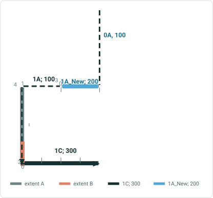

| Route Name | Line Name | Line Order | From Date | To Date | From M | To M |
| --- | --- | --- | --- | --- | --- | --- |
| 0A | L0 | 100 | 1/1/2000 | <Null> | 3 | 5 |
| 1A | L1 | 100 | 1/1/2000 | <Null> | 2 | 4 |
| 1B | L1 | 200 | 1/1/2000 | <Null> | 0 | 2 |
| 1C | L1 | 300 | 1/1/2000 | <Null> | 0 | 4 |

| Event ID | From Date | To Date | From Route ID | From M | To Route ID | To M | Location Error |
| --- | --- | --- | --- | --- | --- | --- | --- |
| S1 | 1/1/2000 | <Null> | 1A | 2 | 1C | 4 | No Error |
| S2 | 1/1/2000 | <Null> | 1A | 2 | 1B | 1 | No Error |
| S3 | 1/1/2000 | <Null> | 1B | 1.5 | 1C | 4 | No Error |
| S4 | 1/1/2000 | <Null> | 1A | 3 | 1C | 1 | No Error |
| S5 | 1/1/2000 | <Null> | 1A | 2 | 1A | 3 | No Error |

| Event ID | From Date | To Date | From Route ID | From M | To Route ID | To M | Location Error |
| --- | --- | --- | --- | --- | --- | --- | --- |
| S1 | 1/1/2000 | 1/1/2023 | 1A | 2 | 1C | 4 | No Error |
| S2 | 1/1/2000 | 1/1/2023 | 1A | 2 | 1B | 1 | No Error |
| S3 | 1/1/2000 | <Null> | 1B | 1.5 | 1C | 4 | No Error |
| S4 | 1/1/2000 | <Null> | 1A | 3 | 1C | 1 | No Error |
| S5 | 1/1/2000 | 1/1/2023 | 1A | 2 | 1A | 3 | No Error |

| Route Name | Line Name | Line Order | From Date | To Date | From M | To M |
| --- | --- | --- | --- | --- | --- | --- |
| 0A | L0 | 100 | 1/1/2000 | <Null> | 3 | 5 |
| 1A_New | L0 | 200 | 1/1/2023 | <Null> | 2 | 3 |
| 1A | L1 | 100 | 1/1/2023 | <Null> | 3 | 4 |
| 1A | L1 | 100 | 1/1/2000 | 1/1/2023 | 2 | 4 |
| 1B | L1 | 200 | 1/1/2000 | <Null> | 0 | 2 |
| 1C | L1 | 300 | 1/1/2000 | <Null> | 0 | 4 |


| Effective Date | 1/1/2023 |
| --- | --- |
| Source RD | No |

## Slide 19

Reassign 0.5+1+0.5 routes in a line to new line ,1/3 route name and measure maintained. Rest all name and measure are changed. Recalibrate source downstream. Calibrate set to Stayput
8: Transfer to an existing line – spanning Events only Routes and Route Table shown here - StayPut

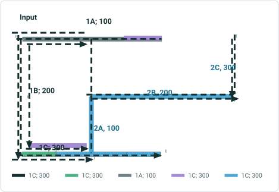

| Route Name | Line Name | Line Order | From Date | To Date | From M | To M |
| --- | --- | --- | --- | --- | --- | --- |
| 1A | L1 | 100 | 1/1/2000 | <Null> | 2 | 4 |
| 1B | L1 | 200 | 1/1/2000 | <Null> | 0 | 2 |
| 1C | L1 | 300 | 1/1/2000 | <Null> | 0 | 4 |
| 2A | L2 | 100 | 1/1/2000 | <Null> | 4 | 5 |
| 2B | L2 | 200 | 1/1/2000 | <Null> | 5 | 8 |
| 2C | L2 | 300 | 1/1/2000 | <Null> | 0 | 1 |

| Route Name | Line Name | Line Order | From Date | To Date | From M | To M |
| --- | --- | --- | --- | --- | --- | --- |
| 1A | L1 | 100 | 1/1/2000 | 1/1/2023 | 2 | 4 |
| 1B | L1 | 200 | 1/1/2000 | 1/1/2023 | 0 | 2 |
| 1C | L1 | 300 | 1/1/2000 | 1/1/2023 | 0 | 4 |
| 2A | L2 | 100 | 1/1/2000 | 1/1/2023 | 3 | 5 |
| 2B | L2 | 200 | 1/1/2000 | 1/1/2023 | 4 | 8 |
| 2C | L2 | 300 | 1/1/2000 | 1/1/2023 | 0 | 2 |
| 1A | L1 | 100 | 1/1/2023 | <Null> | 2 | 3 |
| 1C | L1 | 200 | 1/1/2023 | <Null> | 0 | 2 |
| 1A_New | L2 | 100 | 1/1/2023 | <Null> | 1 | 2 |
| 1B | L2 | 200 | 1/1/2023 | <Null> | 0 | 2 |
| 1C_New | L2 | 300 | 1/1/2023 | <Null> | 5 | 6 |
| 2A | L2 | 400 | 1/1/2023 | <Null> | 4 | 5 |
| 2B | L2 | 500 | 1/1/2023 | <Null> | 5 | 8 |
| 2C | L2 | 600 | 1/1/2023 | <Null> | 0 | 1 |

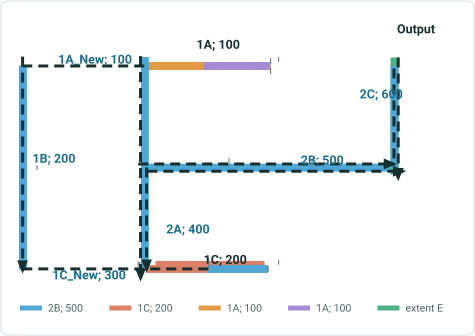

| Effective Date | 1/1/2023 |
| --- | --- |
| Source RD | Yes |

## Slide 20

Reassign 0.5+1+0.5 routes in a line to new line ,1/3 route names and measures maintained. Rest all name and measure are changed. Recalibrate source downstream. Calibrate set to stayput
8-1: Transfer to an existing line – spanning Events – Stayput Behavior


| Event ID | From Date | To Date | From Route ID | From M | To Route ID | To M | Location Error |
| --- | --- | --- | --- | --- | --- | --- | --- |
| S1 | 1/1/2000 | <Null> | 1A | 2 | 1C | 4 | No Error |
| S2 | 1/1/2000 | <Null> | 1A | 2 | 1B | 1 | No Error |
| S3 | 1/1/2000 | <Null> | 1B | 1 | 1C | 4 | No Error |
| S4 | 1/1/2000 | <Null> | 1A | 3 | 1C | 2 | No Error |
| S5 | 1/1/2000 | <Null> | 1C | 0 | 1C | 4 | No Error |
| S6 | 1/1/2000 | <Null> | 1C | 3 | 1C | 4 | No Error |
| S7 | 1/1/2000 | <Null> | 1C | 1 | 1C | 3 | No Error |
| S8 | 1/1/2000 | <Null> | 1C | 0 | 1C | 1 | No Error |
| S9 | 1/1/2000 | <Null> | 1B | 0 | 1B | 2 | No Error |
| S10 | 1/1/2000 | <Null> | 1A | 2 | 1A | 2.5 | No Error |
| S11 | 1/1/2000 | <Null> | 1A | 2.5 | 1A | 3.5 | No Error |
| S12 | 1/1/2000 | <Null> | 1A | 3.5 | 1A | 4 | No Error |
|  |  |  |  |  |  |  |  |
| E1 | 1/1/2000 | <Null> | 2A | 4 | 2C | 1 | No Error |

| Event ID | From Date | To Date | From Route ID | From M | To Route ID | To M | Location Error |
| --- | --- | --- | --- | --- | --- | --- | --- |
| S1 | 1/1/2000 | 1/1/2023 | 1A | 2 | 1C | 4 | No Error |
| S1 | 1/1/2023 | <Null> | 1A | 2 | 1A | 3 | No Error |
| S1 | 1/1/2023 | <Null> | 1C | 0 | 1C | 2 | No Error |
| S2 | 1/1/2000 | 1/1/2023 | 1A | 2 | 1B | 1 | No Error |
| S2 | 1/1/2023 | <Null> | 1A | 2 | 1A | 3 | No Error |
| S3 | 1/1/2000 | 1/1/2023 | 1B | 1 | 1C | 4 | No Error |
| S3 | 1/1/2023 | <Null> | 1C | 0 | 1C | 2 | No Error |
| S4 | 1/1/2000 | 1/1/2023 | 1A | 3 | 1C | 2 | No Error |
| S5 | 1/1/2000 | 1/1/2023 | 1C | 0 | 1C | 4 | No Error |
| S5 | 1/1/2023 | <Null> | 1C | 0 | 1C | 2 | No Error |
| S6 | 1/1/2000 | 1/1/2023 | 1C | 3 | 1C | 4 | No Error |
| S6 | 1/1/2023 | <Null> | 1C | 1 | 1C | 2 | No Error |
| S7 | 1/1/2000 | 1/1/2023 | 1C | 1 | 1C | 3 | No Error |
| S7 | 1/1/2023 | <Null> | 1C | 0 | 1C | 1 | No Error |
| S8 | 1/1/2000 | 1/1/2023 | 1C | 0 | 1C | 1 | No Error |
| S9 | 1/1/2000 | 1/1/2023 | 1B | 0 | 1B | 2 | No Error |
| S10 | 1/1/2000 | <Null> | 1A | 2 | 1A | 2.5 | No Error |
| S11 | 1/1/2000 | 1/1/2023 | 1A | 2.5 | 1A | 3.5 | No Error |
| S11 | 1/1/2023 | <Null> | 1A | 2.5 | 1A | 3 | No Error |
| S12 | 1/1/2000 | 1/1/2023 | 1A | 3.5 | 1A | 4 | No Error |

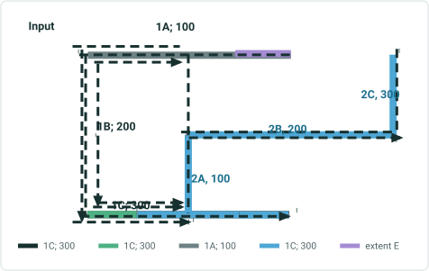

| Effective Date | 1/1/2023 |
| --- | --- |
| Source RD | Yes |

## Slide 21

Reassign 0.5+1+0.5 routes in a line to new line ,1/3 route names and measures maintained. Rest all name and measure are changed. Recalibrate source downstream. Calibrate set to retire
8-2: Transfer to an existing line – spanning Events – Retire Behavior

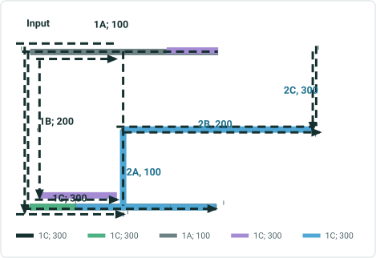

| Event ID | From Date | To Date | From Route ID | From M | To Route ID | To M | Location Error |
| --- | --- | --- | --- | --- | --- | --- | --- |
| S1 | 1/1/2000 | <Null> | 1A | 2 | 1C | 4 | No Error |
| S2 | 1/1/2000 | <Null> | 1A | 2 | 1B | 1 | No Error |
| S3 | 1/1/2000 | <Null> | 1B | 1 | 1C | 4 | No Error |
| S4 | 1/1/2000 | <Null> | 1A | 3 | 1C | 2 | No Error |
| S5 | 1/1/2000 | <Null> | 1C | 0 | 1C | 4 | No Error |
| S6 | 1/1/2000 | <Null> | 1C | 3 | 1C | 4 | No Error |
| S7 | 1/1/2000 | <Null> | 1C | 1 | 1C | 3 | No Error |
| S8 | 1/1/2000 | <Null> | 1C | 0 | 1C | 1 | No Error |
| S9 | 1/1/2000 | <Null> | 1B | 0 | 1B | 2 | No Error |
| S10 | 1/1/2000 | <Null> | 1A | 2 | 1A | 2.5 | No Error |
| S11 | 1/1/2000 | <Null> | 1A | 2.5 | 1A | 3.5 | No Error |
| S12 | 1/1/2000 | <Null> | 1A | 3.5 | 1A | 4 | No Error |
|  |  |  |  |  |  |  |  |
| E1 | 1/1/2000 | <Null> | 2A | 4 | 2C | 1 | No Error |

| Event ID | From Date | To Date | From Route ID | From M | To Route ID | To M | Location Error |
| --- | --- | --- | --- | --- | --- | --- | --- |
| S1 | 1/1/2000 | 1/1/2023 | 1A | 2 | 1C | 4 | No Error |
| S2 | 1/1/2000 | 1/1/2023 | 1A | 2 | 1B | 1 | No Error |
| S3 | 1/1/2000 | 1/1/2023 | 1B | 1 | 1C | 4 | No Error |
| S4 | 1/1/2000 | 1/1/2023 | 1A | 3 | 1C | 2 | No Error |
| S5 | 1/1/2000 | 1/1/2023 | 1C | 0 | 1C | 4 | No Error |
| S6 | 1/1/2000 | 1/1/2023 | 1C | 3 | 1C | 4 | No Error |
| S7 | 1/1/2000 | 1/1/2023 | 1C | 1 | 1C | 3 | No Error |
| S8 | 1/1/2000 | 1/1/2023 | 1C | 0 | 1C | 1 | No Error |
| S9 | 1/1/2000 | 1/1/2023 | 1B | 0 | 1B | 2 | No Error |
| S10 | 1/1/2000 | <Null> | 1A | 2 | 1C | 2.5 | No Error |
| S11 | 1/1/2000 | 1/1/2023 | 1A | 2.5 | 1C | 3.5 | No Error |
| S12 | 1/1/2000 | 1/1/2023 | 1A | 3.5 | 1C | 4 | No Error |

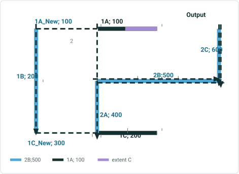

| Effective Date | 1/1/2023 |
| --- | --- |
| Source RD | Yes |

## Slide 22

Reassign 0.5+1+0.5 routes in a line to new line ,1/3 route name and measure maintained. Rest all name and measure are changed. Do not recalibrate source downstream.
9: Transfer to an existing line – spanning Events – only Routes & Route tables shown - StayPut


| Route Name | Line Name | Line Order | From Date | To Date | From M | To M |
| --- | --- | --- | --- | --- | --- | --- |
| 1A | L1 | 100 | 1/1/2000 | <Null> | 2 | 4 |
| 1B | L1 | 200 | 1/1/2000 | <Null> | 0 | 2 |
| 1C | L1 | 300 | 1/1/2000 | <Null> | 0 | 4 |
| 2A | L2 | 100 | 1/1/2000 | <Null> | 4 | 5 |
| 2B | L2 | 200 | 1/1/2000 | <Null> | 5 | 8 |
| 2C | L2 | 300 | 1/1/2000 | <Null> | 0 | 1 |

| Route Name | Line Name | Line Order | From Date | To Date | From M | To M |
| --- | --- | --- | --- | --- | --- | --- |
| 1A | L1 | 100 | 1/1/2000 | <Null> | 2 | 4 |
| 1B | L1 | 200 | 1/1/2000 | 1/1/2023 | 0 | 2 |
| 1C | L1 | 300 | 1/1/2000 | 1/1/2023 | 0 | 4 |
| 2A | L2 | 100 | 1/1/2000 | 1/1/2023 | 3 | 5 |
| 2B | L2 | 200 | 1/1/2000 | 1/1/2023 | 4 | 8 |
| 2C | L2 | 300 | 1/1/2000 | 1/1/2023 | 0 | 2 |
| 1A | L1 | 100 | 1/1/2023 | <Null> | 2 | 3 |
| 1C | L1 | 200 | 1/1/2023 | <Null> | 2 | 4 |
| 1A_New | L2 | 100 | 1/1/2023 | <Null> | 1 | 2 |
| 1B | L2 | 200 | 1/1/2023 | <Null> | 0 | 2 |
| 1C_New | L2 | 300 | 1/1/2023 | <Null> | 5 | 6 |
| 2A | L2 | 400 | 1/1/2023 | <Null> | 4 | 5 |
| 2B | L2 | 500 | 1/1/2023 | <Null> | 5 | 8 |
| 2C | L2 | 600 | 1/1/2023 | <Null> | 0 | 1 |

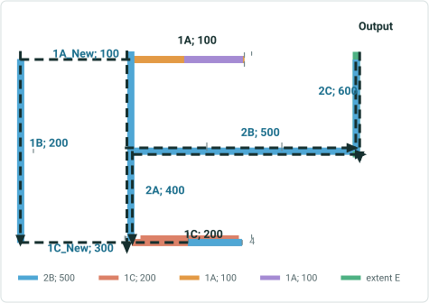

| Effective Date | 1/1/2023 |
| --- | --- |
| Source RD | No |

## Slide 23

Reassign 0.5+1+0.5 routes in a line to new line ,1/3 route names and measures maintained. Rest all name and measure are changed. Do not recalibrate source downstream.
9-1: Transfer to an existing line – spanning Events – Stayput Behavior – cntd….

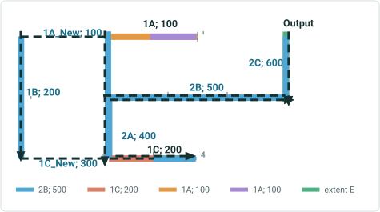

| Event ID | From Date | To Date | From Route ID | From M | To Route ID | To M | Location Error |
| --- | --- | --- | --- | --- | --- | --- | --- |
| S1 | 1/1/2000 | <Null> | 1A | 2 | 1C | 4 | No Error |
| S2 | 1/1/2000 | <Null> | 1A | 2 | 1B | 1 | No Error |
| S3 | 1/1/2000 | <Null> | 1B | 1 | 1C | 4 | No Error |
| S4 | 1/1/2000 | <Null> | 1A | 3 | 1C | 2 | No Error |
| S5 | 1/1/2000 | <Null> | 1C | 0 | 1C | 4 | No Error |
| S6 | 1/1/2000 | <Null> | 1C | 3 | 1C | 4 | No Error |
| S7 | 1/1/2000 | <Null> | 1C | 1 | 1C | 3 | No Error |
| S8 | 1/1/2000 | <Null> | 1C | 0 | 1C | 1 | No Error |
| S9 | 1/1/2000 | <Null> | 1B | 0 | 1B | 2 | No Error |
| S10 | 1/1/2000 | <Null> | 1A | 2 | 1A | 2.5 | No Error |
| S11 | 1/1/2000 | <Null> | 1A | 2.5 | 1A | 3.5 | No Error |
| S12 | 1/1/2000 | <Null> | 1A | 3.5 | 1A | 4 | No Error |
|  |  |  |  |  |  |  |  |
| E1 | 1/1/2000 | <Null> | 2A | 4 | 2C | 1 | No Error |

| Event ID | From Date | To Date | From Route ID | From M | To Route ID | To M | Location Error |
| --- | --- | --- | --- | --- | --- | --- | --- |
| S1 | 1/1/2000 | 1/1/2023 | 1A | 2 | 1C | 4 | No Error |
| S1 | 1/1/2023 | <Null> | 1A | 2 | 1A | 3 | No Error |
| S1 | 1/1/2023 | <Null> | 1C | 2 | 1C | 4 | No Error |
| S2 | 1/1/2000 | 1/1/2023 | 1A | 2 | 1B | 1 | No Error |
| S2 | 1/1/2023 | <Null> | 1A | 2 | 1A | 3 | No Error |
| S3 | 1/1/2000 | 1/1/2023 | 1B | 1 | 1C | 4 | No Error |
| S3 | 1/1/2023 | <Null> | 1C | 2 | 1C | 4 | No Error |
| S4 | 1/1/2000 | 1/1/2023 | 1A | 3 | 1C | 2 | No Error |
| S5 | 1/1/2000 | 1/1/2023 | 1C | 0 | 1C | 4 | No Error |
| S5 | 1/1/2023 | <Null> | 1C | 2 | 1C | 4 | No Error |
| S6 | 1/1/2000 | <Null> | 1C | 3 | 1C | 4 | No Error |
| S7 | 1/1/2000 | 1/1/2023 | 1C | 1 | 1C | 3 | No Error |
| S7 | 1/1/2023 | <Null> | 1C | 2 | 1C | 3 | No Error |
| S8 | 1/1/2000 | 1/1/2023 | 1C | 0 | 1C | 1 | No Error |
| S9 | 1/1/2000 | 1/1/2023 | 1B | 0 | 1B | 2 | No Error |
| S10 | 1/1/2000 | <Null> | 1A | 2 | 1A | 2.5 | No Error |
| S11 | 1/1/2000 | 1/1/2023 | 1A | 2.5 | 1A | 3.5 | No Error |
| S11 | 1/1/2023 | <Null> | 1A | 2.5 | 1A | 3 | No Error |
| S12 | 1/1/2000 | 1/1/2023 | 1A | 3.5 | 1A | 4 | No Error |

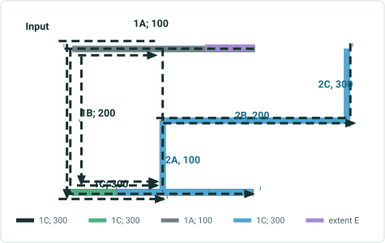

| Effective Date | 1/1/2023 |
| --- | --- |
| Source RD | No |

## Slide 24

Reassign 0.5+1+0.5 routes in a line to new line ,1/3 route names and measures maintained. Rest all name and measure are changed. Do not recalibrate source downstream.
9-2: Transfer to an existing line – spanning Events – Retire Behavior


| Event ID | From Date | To Date | From Route ID | From M | To Route ID | To M | Location Error |
| --- | --- | --- | --- | --- | --- | --- | --- |
| S1 | 1/1/2000 | <Null> | 1A | 2 | 1C | 4 | No Error |
| S2 | 1/1/2000 | <Null> | 1A | 2 | 1B | 1 | No Error |
| S3 | 1/1/2000 | <Null> | 1B | 1 | 1C | 4 | No Error |
| S4 | 1/1/2000 | <Null> | 1A | 3 | 1C | 2 | No Error |
| S5 | 1/1/2000 | <Null> | 1C | 0 | 1C | 4 | No Error |
| S6 | 1/1/2000 | <Null> | 1C | 3 | 1C | 4 | No Error |
| S7 | 1/1/2000 | <Null> | 1C | 1 | 1C | 3 | No Error |
| S8 | 1/1/2000 | <Null> | 1C | 0 | 1C | 1 | No Error |
| S9 | 1/1/2000 | <Null> | 1B | 0 | 1B | 2 | No Error |
| S10 | 1/1/2000 | <Null> | 1A | 2 | 1A | 2.5 | No Error |
| S11 | 1/1/2000 | <Null> | 1A | 2.5 | 1A | 3.5 | No Error |
| S12 | 1/1/2000 | <Null> | 1A | 3.5 | 1A | 4 | No Error |
|  |  |  |  |  |  |  |  |
| E1 | 1/1/2000 | <Null> | 2A | 4 | 2C | 1 | No Error |

| Event ID | From Date | To Date | From Route ID | From M | To Route ID | To M | Location Error |
| --- | --- | --- | --- | --- | --- | --- | --- |
| S1 | 1/1/2000 | 1/1/2023 | 1A | 2 | 1C | 4 | No Error |
| S2 | 1/1/2000 | 1/1/2023 | 1A | 2 | 1B | 1 | No Error |
| S3 | 1/1/2000 | 1/1/2023 | 1B | 1 | 1C | 4 | No Error |
| S4 | 1/1/2000 | 1/1/2023 | 1A | 3 | 1C | 2 | No Error |
| S5 | 1/1/2000 | 1/1/2023 | 1C | 0 | 1C | 4 | No Error |
| S6 | 1/1/2000 | <Null> | 1C | 3 | 1C | 4 | No Error |
| S7 | 1/1/2000 | 1/1/2023 | 1C | 1 | 1C | 3 | No Error |
| S8 | 1/1/2000 | 1/1/2023 | 1C | 0 | 1C | 1 | No Error |
| S9 | 1/1/2000 | 1/1/2023 | 1B | 0 | 1B | 2 | No Error |
| S10 | 1/1/2000 | <Null> | 1A | 2 | 1A | 2.5 | No Error |
| S11 | 1/1/2000 | 1/1/2023 | 1A | 2.5 | 1A | 3.5 | No Error |
| S12 | 1/1/2000 | 1/1/2023 | 1A | 3.5 | 1A | 4 | No Error |

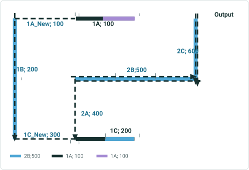

| Effective Date | 1/1/2023 |
| --- | --- |
| Source RD | No |

## Slide 25

Reassign 0.5+1+0.5 routes in a line to new line ,1/3 route name and measure maintained. Rest all name and measure are changed. Do not recalibrate source downstream. Routes have time slices. Effective date : 1/1/2015
10: Transfer to an existing line – spanning Events – only Routes & Route tables shown - StayPut

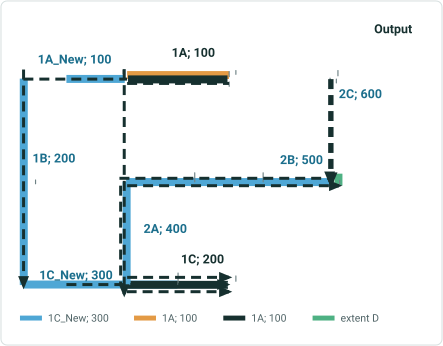

| Route Name | Line Name | Line Order | From Date | To Date | From M | To M |
| --- | --- | --- | --- | --- | --- | --- |
| 1A | L1 | 100 | 1/1/2000 | 1/1/2020 | 2 | 4 |
| 1B | L1 | 200 | 1/1/2005 | 1/1/2020 | 0 | 2 |
| 1C | L1 | 300 | 1/1/2010 | 1/1/2020 | 0 | 4 |
| 2A | L2 | 100 | 1/1/2000 | <Null> | 4 | 5 |
| 2B | L2 | 200 | 1/1/2000 | <Null> | 5 | 8 |
| 2C | L2 | 300 | 1/1/2000 | <Null> | 0 | 1 |

| Route Name | Line Name | Line Order | From Date | To Date | From M | To M |
| --- | --- | --- | --- | --- | --- | --- |
| 1A | L1 | 100 | 1/1/2000 | 1/1/2015 | 2 | 4 |
| 1B | L1 | 200 | 1/1/2005 | 1/1/2015 | 0 | 2 |
| 1C | L1 | 300 | 1/1/2010 | 1/1/2015 | 0 | 4 |
| 2A | L2 | 100 | 1/1/2000 | 1/1/2015 | 4 | 5 |
| 2B | L2 | 200 | 1/1/2000 | 1/1/2015 | 5 | 8 |
| 2C | L2 | 300 | 1/1/2000 | 1/1/2015 | 0 | 1 |
| 1A | L1 | 100 | 1/1/2015 | 1/1/2020 | 2 | 3 |
| 1C | L1 | 200 | 1/1/2015 | 1/1/2020 | 2 | 4 |
| 1A_New | L2 | 100 | 1/1/2015 | 1/1/2020 | 1 | 2 |
| 1B | L2 | 200 | 1/1/2015 | 1/1/2020 | 0 | 2 |
| 1C_New | L2 | 300 | 1/1/2015 | 1/1/2020 | 5 | 6 |
| 2A | L2 | 400 | 1/1/2015 | <Null> | 4 | 5 |
| 2B | L2 | 500 | 1/1/2015 | <Null> | 5 | 8 |
| 2C | L2 | 600 | 1/1/2015 | <Null> | 0 | 1 |

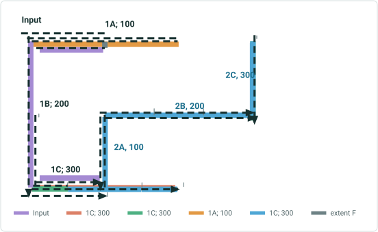

| Effective Date | 1/1/2015 |
| --- | --- |
| Source RD | No |

## Slide 26

Reassign 0.5+1+0.5 routes in a line to new line ,1/3 route name and measure maintained. Rest all name and measure are changed. Do not recalibrate source downstream. Routes have time slices. Effective date : 1/1/2015
10-1: Transfer to an existing line – spanning Events – Stayput Behavior – cntd….

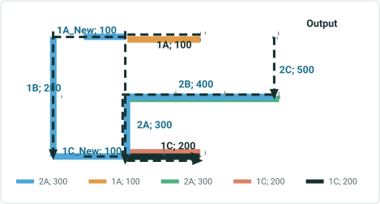

| Event ID | From Date | To Date | From Route ID | From M | To Route ID | To M | Location Error |
| --- | --- | --- | --- | --- | --- | --- | --- |
| S1 | 1/1/2010 | 1/1/2020 | 1A | 2 | 1C | 4 | No Error |
| S2 | 1/1/2005 | 1/1/2020 | 1A | 2 | 1B | 1 | No Error |
| S3 | 1/1/2010 | 1/1/2020 | 1B | 1 | 1C | 4 | No Error |
| S4 | 1/1/2010 | 1/1/2020 | 1A | 2 | 1C | 2 | No Error |
| S5 | 1/1/2010 | 1/1/2020 | 1C | 0 | 1C | 4 | No Error |
| S6 | 1/1/2010 | 1/1/2020 | 1C | 3 | 1C | 4 | No Error |
| S7 | 1/1/2010 | 1/1/2020 | 1C | 1 | 1C | 3 | No Error |
| S8 | 1/1/2010 | 1/1/2020 | 1C | 0 | 1C | 1 | No Error |
| S9 | 1/1/2005 | 1/1/2020 | 1B | 0 | 1B | 2 | No Error |
|  |  |  |  |  |  |  |  |
| E1 | 1/1/2000 | <Null> | 2A | 4 | 2C | 1 | No Error |

| Event ID | From Date | To Date | From Route ID | From M | To Route ID | To M | Location Error |
| --- | --- | --- | --- | --- | --- | --- | --- |
| S1 | 1/1/2010 | 1/1/2015 | 1A | 2 | 1C | 4 | No Error |
| S1 | 1/1/2015 | 1/1/2020 | 1A | 2 | 1A | 3 | No Error |
| S1 | 1/1/2015 | 1/1/2020 | 1C | 2 | 1C | 4 | No Error |
| S2 | 1/1/2005 | 1/1/2015 | 1A | 2 | 1B | 1 | No Error |
| S2 | 1/1/2015 | 1/1/2020 | 1A | 2 | 1A | 3 | No Error |
| S3 | 1/1/2010 | 1/1/2015 | 1B | 1 | 1C | 4 | No Error |
| S3 | 1/1/2015 | 1/1/2020 | 1C | 2 | 1C | 4 | No Error |
| S4 | 1/1/2010 | 1/1/2015 | 1A | 2 | 1C | 2 | No Error |
| S5 | 1/1/2010 | 1/1/2015 | 1C | 0 | 1C | 4 | No Error |
| S5 | 1/1/2015 | 1/1/2020 | 1C | 2 | 1C | 4 | No Error |
| S6 | 1/1/2010 | 1/1/2020 | 1C | 3 | 1C | 4 | No Error |
| S7 | 1/1/2010 | 1/1/2015 | 1C | 1 | 1C | 3 | No Error |
| S7 | 1/1/2015 | 1/1/2020 | 1C | 2 | 1C | 3 | No Error |
| S8 | 1/1/2010 | 1/1/2015 | 1C | 0 | 1C | 1 | No Error |
| S9 | 1/1/2005 | 1/1/2015 | 1B | 0 | 1B | 2 | No Error |

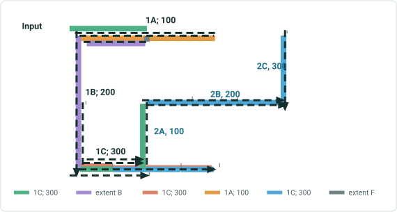

| Effective Date | 1/1/2015 |
| --- | --- |
| Source RD | No |

## Slide 27

Reassign 0.5+1+0.5 routes in a line to new line ,1/3 route name and measure maintained. Rest all name and measure are changed. Do not recalibrate source downstream. Routes have time slices. Effective date : 1/1/2015
10-2: Transfer to an existing line – spanning Events – Retire Behavior

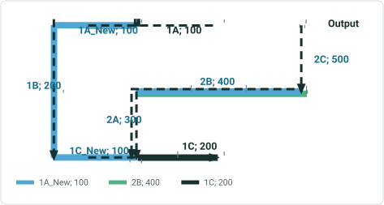

| Event ID | From Date | To Date | From Route ID | From M | To Route ID | To M | Location Error |
| --- | --- | --- | --- | --- | --- | --- | --- |
| S1 | 1/1/2010 | 1/1/2020 | 1A | 2 | 1C | 4 | No Error |
| S2 | 1/1/2005 | 1/1/2020 | 1A | 2 | 1B | 1 | No Error |
| S3 | 1/1/2010 | 1/1/2020 | 1B | 1 | 1C | 2 | No Error |
| S4 | 1/1/2010 | 1/1/2020 | 1A | 2 | 1C | 2 | No Error |
| S5 | 1/1/2010 | 1/1/2020 | 1C | 0 | 1C | 4 | No Error |
| S6 | 1/1/2010 | 1/1/2020 | 1C | 3 | 1C | 4 | No Error |
| S7 | 1/1/2010 | 1/1/2020 | 1C | 1 | 1C | 3 | No Error |
| S8 | 1/1/2010 | 1/1/2020 | 1C | 0 | 1C | 1 | No Error |
| S9 | 1/1/2005 | 1/1/2020 | 1B | 0 | 1B | 2 | No Error |
|  |  |  |  |  |  |  |  |
| E1 | 1/1/2000 | <Null> | 2A | 4 | 2C | 1 | No Error |

| Event ID | From Date | To Date | From Route ID | From M | To Route ID | To M | Location Error |
| --- | --- | --- | --- | --- | --- | --- | --- |
| S1 | 1/1/2010 | 1/1/2015 | 1A | 2 | 1C | 4 | No Error |
| S2 | 1/1/2005 | 1/1/2015 | 1A | 2 | 1B | 1 | No Error |
| S3 | 1/1/2010 | 1/1/2015 | 1B | 1 | 1C | 2 | No Error |
| S4 | 1/1/2010 | 1/1/2015 | 1A | 2 | 1C | 2 | No Error |
| S5 | 1/1/2010 | 1/1/2015 | 1C | 0 | 1C | 4 | No Error |
| S6 | 1/1/2010 | <Null> | 1C | 3 | 1C | 4 | No Error |
| S7 | 1/1/2010 | 1/1/2015 | 1C | 1 | 1C | 3 | No Error |
| S8 | 1/1/2010 | 1/1/2015 | 1C | 0 | 1C | 1 | No Error |
| S9 | 1/1/2005 | 1/1/2015 | 1B | 0 | 1B | 2 | No Error |


| Effective Date | 1/1/2015 |
| --- | --- |
| Source RD | No |

## Slide 28

Reassign 0.5+1+0.5 routes in a line to new line ,1/3 route name and measure maintained. Rest all name and measure are changed. Do not recalibrate source downstream. Route 1B & Route IC  is in opposite direction to Route 1A.
11: Transfer to an existing line – spanning Events – only Routes & Route tables shown – No EB shown in output diagram


| Route Name | Line Name | Line Order | From Date | To Date | From M | To M |
| --- | --- | --- | --- | --- | --- | --- |
| 1A | L1 | 100 | 1/1/2000 | <Null> | 2 | 4 |
| 1B | L1 | 200 | 1/1/2000 | <Null> | 0 | 2 |
| 1C | L1 | 300 | 1/1/2000 | <Null> | 0 | 4 |
| 2A | L2 | 100 | 1/1/2000 | <Null> | 4 | 5 |
| 2B | L2 | 200 | 1/1/2000 | <Null> | 5 | 8 |
| 2C | L2 | 300 | 1/1/2000 | <Null> | 0 | 1 |

| Route Name | Line Name | Line Order | From Date | To Date | From M | To M |
| --- | --- | --- | --- | --- | --- | --- |
| 1A | L1 | 100 | 1/1/2000 | 1/1/2023 | 2 | 4 |
| 1B | L1 | 200 | 1/1/2000 | 1/1/2023 | 0 | 2 |
| 1C | L1 | 300 | 1/1/2000 | 1/1/2023 | 0 | 4 |
| 2A | L2 | 100 | 1/1/2000 | 1/1/2023 | 3 | 5 |
| 2B | L2 | 200 | 1/1/2000 | 1/1/2023 | 4 | 8 |
| 2C | L2 | 300 | 1/1/2000 | 1/1/2023 | 0 | 2 |
| 1A | L1 | 100 | 1/1/2023 | <Null> | 2 | 3 |
| 1C | L1 | 200 | 1/1/2023 | <Null> | 0 | 2 |
| 1A_New | L2 | 100 | 1/1/2023 | <Null> | 1 | 2 |
| 1B | L2 | 200 | 1/1/2023 | <Null> | 0 | 2 |
| 1C_New | L2 | 300 | 1/1/2023 | <Null> | 5 | 6 |
| 2A | L2 | 400 | 1/1/2023 | <Null> | 4 | 5 |
| 2B | L2 | 500 | 1/1/2023 | <Null> | 5 | 8 |
| 2C | L2 | 600 | 1/1/2023 | <Null> | 0 | 1 |


| Effective Date | 1/1/2023 |
| --- | --- |
| Source RD | No |

## Slide 29

Reassign 0.5+1+0.5 routes in a line to new line ,1/3 route name and measure maintained. Rest all name and measure are changed. Do not recalibrate source downstream. Route 1B & Route IC  is in opposite direction to Route 1A.
11-1: Transfer to an existing line – spanning Events – Stayput Behavior


| Event ID | From Date | To Date | From Route ID | From M | To Route ID | To M | Location Error |
| --- | --- | --- | --- | --- | --- | --- | --- |
| S1 | 1/1/2000 | <Null> | 1A | 2 | 1C | 4 | No Error |
| S2 | 1/1/2000 | <Null> | 1A | 2 | 1B | 1 | No Error |
| S3 | 1/1/2000 | <Null> | 1B | 1 | 1C | 4 | No Error |
| S4 | 1/1/2000 | <Null> | 1A | 3 | 1C | 2 | No Error |
| S5 | 1/1/2000 | <Null> | 1C | 0 | 1C | 4 | No Error |
| S6 | 1/1/2000 | <Null> | 1C | 0 | 1C | 1 | No Error |
| S7 | 1/1/2000 | <Null> | 1C | 1 | 1C | 3 | No Error |
| S8 | 1/1/2000 | <Null> | 1C | 3 | 1C | 4 | No Error |
| S9 | 1/1/2000 | <Null> | 1B | 0 | 1B | 2 | No Error |
| S10 | 1/1/2000 | <Null> | 1A | 2 | 1A | 2.5 | No Error |
| S11 | 1/1/2000 | <Null> | 1A | 2.5 | 1A | 3.5 | No Error |
| S12 | 1/1/2000 | <Null> | 1A | 3.5 | 1A | 4 | No Error |

| Event ID | From Date | To Date | From Route ID | From M | To Route ID | To M | Location Error |
| --- | --- | --- | --- | --- | --- | --- | --- |
| S1 | 1/1/2000 | 1/1/2023 | 1A | 2 | 1C | 4 | No Error |
| S1 | 1/1/2023 | <Null> | 1A | 2 | 1A | 3 | No Error |
| S1 | 1/1/2023 | <Null> | 1C | 0 | 1C | 2 | No Error |
| S2 | 1/1/2000 | 1/1/2023 | 1A | 2 | 1B | 1 | No Error |
| S2 | 1/1/2023 | <Null> | 1A | 2 | 1A | 3 | No Error |
| S3 | 1/1/2000 | 1/1/2023 | 1B | 1 | 1C | 4 | No Error |
| S3 | 1/1/2023 | <Null> | 1C | 0 | 1C | 2 | No Error |
| S4 | 1/1/2000 | 1/1/2023 | 1A | 3 | 1C | 2 | No Error |
| S5 | 1/1/2000 | 1/1/2023 | 1C | 0 | 1C | 4 | No Error |
| S5 | 1/1/2023 | <Null> | 1C | 0 | 1C | 2 | No Error |
| S6 | 1/1/2000 | <Null> | 1C | 0 | 1C | 1 | No Error |
| S7 | 1/1/2000 | 1/1/2023 | 1C | 1 | 1C | 3 | No Error |
| S7 | 1/1/2023 | <Null> | 1C | 1 | 1C | 2 | No Error |
| S8 | 1/1/2000 | 1/1/2023 | 1C | 3 | 1C | 4 | No Error |
| S9 | 1/1/2000 | 1/1/2023 | 1B | 0 | 1B | 2 | No Error |
| S10 | 1/1/2000 | <Null> | 1A | 2 | 1A | 2.5 | No Error |
| S11 | 1/1/2000 | 1/1/2023 | 1A | 2.5 | 1A | 3.5 | No Error |
| S11 | 1/1/2023 | <Null> | 1A | 2.5 | 1A | 3 | No Error |
| S12 | 1/1/2000 | 1/1/2023 | 1A | 3.5 | 1A | 4 | No Error |


| Effective Date | 1/1/2023 |
| --- | --- |
| Source RD | No |

| Route Name | Line Name | Line Order | From Date | To Date | From M | To M |
| --- | --- | --- | --- | --- | --- | --- |
| 1A | L1 | 100 | 1/1/2000 | <Null> | 2 | 4 |
| 1B | L1 | 200 | 1/1/2000 | <Null> | 0 | 2 |
| 1C | L1 | 300 | 1/1/2000 | <Null> | 0 | 4 |
| 2A | L2 | 100 | 1/1/2000 | <Null> | 4 | 5 |
| 2B | L2 | 200 | 1/1/2000 | <Null> | 5 | 8 |
| 2C | L2 | 300 | 1/1/2000 | <Null> | 0 | 1 |

## Slide 30

Reassign 0.5+1+0.5 routes in a line to new line ,1/3 route name and measure maintained. Rest all name and measure are changed. Do not recalibrate source downstream. Route 1B & Route IC  is in opposite direction to Route 1A.
11-2: Transfer to an existing line – spanning Events – Retire


| Event ID | From Date | To Date | From Route ID | From M | To Route ID | To M | Location Error |
| --- | --- | --- | --- | --- | --- | --- | --- |
| S1 | 1/1/2000 | <Null> | 1A | 2 | 1C | 4 | No Error |
| S2 | 1/1/2000 | <Null> | 1A | 2 | 1B | 1 | No Error |
| S3 | 1/1/2000 | <Null> | 1B | 1 | 1C | 4 | No Error |
| S4 | 1/1/2000 | <Null> | 1A | 3 | 1C | 2 | No Error |
| S5 | 1/1/2000 | <Null> | 1C | 0 | 1C | 4 | No Error |
| S6 | 1/1/2000 | <Null> | 1C | 0 | 1C | 1 | No Error |
| S7 | 1/1/2000 | <Null> | 1C | 1 | 1C | 3 | No Error |
| S8 | 1/1/2000 | <Null> | 1C | 3 | 1C | 4 | No Error |
| S9 | 1/1/2000 | <Null> | 1B | 0 | 1B | 2 | No Error |
| S10 | 1/1/2000 | <Null> | 1A | 2 | 1A | 2.5 | No Error |
| S11 | 1/1/2000 | <Null> | 1A | 2.5 | 1A | 3.5 | No Error |
| S12 | 1/1/2000 | <Null> | 1A | 3.5 | 1A | 4 | No Error |

| Event ID | From Date | To Date | From Route ID | From M | To Route ID | To M | Location Error |
| --- | --- | --- | --- | --- | --- | --- | --- |
| S1 | 1/1/2000 | 1/1/2023 | 1A | 2 | 1C | 4 | No Error |
| S2 | 1/1/2000 | 1/1/2023 | 1A | 2 | 1B | 1 | No Error |
| S3 | 1/1/2000 | 1/1/2023 | 1B | 1 | 1C | 4 | No Error |
| S4 | 1/1/2000 | 1/1/2023 | 1A | 3 | 1C | 2 | No Error |
| S5 | 1/1/2000 | 1/1/2023 | 1C | 0 | 1C | 4 | No Error |
| S6 | 1/1/2000 | <Null> | 1C | 0 | 1C | 1 | No Error |
| S7 | 1/1/2000 | 1/1/2023 | 1C | 1 | 1C | 3 | No Error |
| S8 | 1/1/2000 | 1/1/2023 | 1C | 0 | 1C | 1 | No Error |
| S9 | 1/1/2000 | 1/1/2023 | 1B | 0 | 1B | 2 | No Error |
| S10 | 1/1/2000 | <Null> | 1A | 2 | 1A | 2.5 | No Error |
| S11 | 1/1/2000 | 1/1/2023 | 1A | 2.5 | 1A | 3.5 | No Error |
| S12 | 1/1/2000 | 1/1/2023 | 1A | 3.5 | 1A | 4 | No Error |


| Effective Date | 1/1/2023 |
| --- | --- |
| Source RD | No |

| Route Name | Line Name | Line Order | From Date | To Date | From M | To M |
| --- | --- | --- | --- | --- | --- | --- |
| 1A | L1 | 100 | 1/1/2000 | <Null> | 2 | 4 |
| 1B | L1 | 200 | 1/1/2000 | <Null> | 0 | 2 |
| 1C | L1 | 300 | 1/1/2000 | <Null> | 0 | 4 |
| 2A | L2 | 100 | 1/1/2000 | <Null> | 4 | 5 |
| 2B | L2 | 200 | 1/1/2000 | <Null> | 5 | 8 |
| 2C | L2 | 300 | 1/1/2000 | <Null> | 0 | 1 |

## Slide 31

Reassign a part of  complex route to adjacent line , transfer CP , change measures. Recalibrate downstream , calibrate to stayput
12-1: Transfer to an existing line – spanning Events – Stayput


| Route Name | Line Name | Line Order | From Date | To Date | From M | To M |
| --- | --- | --- | --- | --- | --- | --- |
| 1A | L1 | 100 | 1/1/2000 | <Null> | 0 | 4 |
| 2A | L2 | 200 | 1/1/2000 | <Null> | 0 | 1 |

| Route Name | Line Name | Line Order | From Date | To Date | From M | To M |
| --- | --- | --- | --- | --- | --- | --- |
| 1A | L1 | 100 | 1/1/2000 | 1/1/2023 | 0 | 4 |
| 2A | L2 | 200 | 1/1/2000 | 1/1/2023 | 0 | 1 |
| 1A | L1 | 100 | 1/1/2023 | <Null> | 0 | 2 |
| 1A_New | L2 | 100 | 1/1/2023 | <Null> | 0 | 4 |
| 2A | L2 | 200 | 1/1/2023 | <Null> | 0 | 1 |


| Effective Date | 1/1/2023 |
| --- | --- |
| Source RD | Yes |
| Transfer CP | Yes |

| Event ID | From Date | To Date | From Route ID | From M | To Route ID | To M | Location Error |
| --- | --- | --- | --- | --- | --- | --- | --- |
| S1 | 1/1/2000 | <Null> | 1A | 0 | 1A | 4 | No Error |
| S2 | 1/1/2000 | <Null> | 1A | 0 | 1A | 1.33 | No Error |
| S3 | 1/1/2000 | <Null> | 1A | 1.33 | 1A | 1.67 | No Error |
| S4 | 1/1/2000 | <Null> | 1A | 0 | 1A | 2 | No Error |
| S5 | 1/1/2000 | <Null> | 1A | 3 | 1A | 4 | No Error |
| S6 | 1/1/2000 | <Null> | 1A | 2.67 | 1A | 3 | No Error |

| Event ID | From Date | To Date | From Route ID | From M | To Route ID | To M | Location Error |
| --- | --- | --- | --- | --- | --- | --- | --- |
| S1 | 1/1/2000 | 1/1/2023 | 1A | 0 | 1A | 4 | No Error |
| S1 | 1/1/2023 | <Null> | 1A | 0 | 1A | 2 | No Error |
| S2 | 1/1/2000 | 1/1/2023 | 1A | 0 | 1A | 1.33 | No Error |
| S3 | 1/1/2000 | 1/1/2023 | 1A | 1.33 | 1A | 1.67 | No Error |
| S3 | 1/1/2023 | <Null> | 1A | 0 | 1A | 0.67 | No Error |
| S4 | 1/1/2000 | 1/1/2023 | 1A | 0 | 1A | 2 | No Error |
| S5 | 1/1/2000 | 1/1/2023 | 1A | 3 | 1A | 4 | No Error |
| S5 | 1/1/2023 | <Null> | 1A | 1 | 1A | 2 | No Error |
| S6 | 1/1/2000 | 1/1/2023 | 1A | 2.67 | 1A | 3 | No Error |
| S6 | 1/1/2023 | <Null | 1A | 0.67 | 1A | 1 | No Error |

## Slide 32

Reassign a part of  complex route to adjacent line , transfer CP , change measures.  Do not Recalibrate downstream, Recalibrate set to retire
12-2: Transfer to an existing line – spanning Events – Retire


| Route Name | Line Name | Line Order | From Date | To Date | From M | To M |
| --- | --- | --- | --- | --- | --- | --- |
| 1A | L1 | 100 | 1/1/2000 | <Null> | 0 | 4 |
| 2A | L2 | 200 | 1/1/2000 | <Null> | 0 | 1 |

| Route Name | Line Name | Line Order | From Date | To Date | From M | To M |
| --- | --- | --- | --- | --- | --- | --- |
| 1A | L1 | 100 | 1/1/2000 | 1/1/2023 | 0 | 4 |
| 2A | L2 | 200 | 1/1/2000 | 1/1/2023 | 0 | 1 |
| 1A | L1 | 100 | 1/1/2023 | <Null> | 2 | 4 |
| 1A_New | L2 | 100 | 1/1/2023 | <Null> | 0 | 4 |
| 2A | L2 | 200 | 1/1/2023 | <Null> | 0 | 1 |


| Effective Date | 1/1/2023 |
| --- | --- |
| Source RD | No |
| Transfer CP | Yes |

| Event ID | From Date | To Date | From Route ID | From M | To Route ID | To M | Location Error |
| --- | --- | --- | --- | --- | --- | --- | --- |
| S1 | 1/1/2000 | <Null> | 1A | 0 | 1A | 4 | No Error |
| S2 | 1/1/2000 | <Null> | 1A | 0 | 1A | 1.33 | No Error |
| S3 | 1/1/2000 | <Null> | 1A | 1.33 | 1A | 1.67 | No Error |
| S4 | 1/1/2000 | <Null> | 1A | 0 | 1A | 2 | No Error |
| S5 | 1/1/2000 | <Null> | 1A | 3 | 1A | 4 | No Error |
| S6 | 1/1/2000 | <Null> | 1A | 2.67 | 1A | 3 | No Error |

| Event ID | From Date | To Date | From Route ID | From M | To Route ID | To M | Location Error |
| --- | --- | --- | --- | --- | --- | --- | --- |
| S1 | 1/1/2000 | 1/1/2023 | 1A | 0 | 1A | 4 | No Error |
| S2 | 1/1/2000 | 1/1/2023 | 1A | 0 | 1A | 1.33 | No Error |
| S3 | 1/1/2000 | 1/1/2023 | 1A | 1.33 | 1A | 1.67 | No Error |
| S4 | 1/1/2000 | 1/1/2023 | 1A | 0 | 1A | 2 | No Error |
| S5 | 1/1/2000 | <Null> | 1A | 3 | 1A | 4 | No Error |
| S6 | 1/1/2000 | <Null> | 1A | 2.67 | 1A | 3 | No Error |

## Slide 33

Reassign to fill the gap in a line by transferring route. No change in Measure, RouteName
.
13-1: Transfer to an existing line – spanning Events – Stayput


| Route Name | Line Name | Line Order | From Date | To Date | From M | To M |
| --- | --- | --- | --- | --- | --- | --- |
| 2A | L2 | 100 | 1/1/2000 | <Null> | 3 | 5 |
| 2B | L2 | 200 | 1/1/2000 | <Null> | 5 | 8 |
| 2C | L2 | 300 | 1/1/2000 | <Null> | 0 | 2 |
| X1 | L3 | 100 | 1/1/2000 | <Null> | 2 | 6 |
| X2 | L3 | 200 | 1/1/2000 | <Null> | 24 | 28 |

| Route Name | Line Name | Line Order | From Date | To Date | From M | To M |
| --- | --- | --- | --- | --- | --- | --- |
| 2A | L2 | 100 | 1/1/2000 | 1/1/2023 | 3 | 5 |
| 2B | L2 | 200 | 1/1/2000 | 1/1/2023 | 5 | 8 |
| 2C | L2 | 300 | 1/1/2000 | 1/1/2023 | 0 | 2 |
| X1 | L3 | 100 | 1/1/2000 | 1/1/2023 | 2 | 6 |
| X2 | L3 | 200 | 1/1/2000 | 1/1/2023 | 24 | 28 |
| 2B | L2 | 100 | 1/1/2023 | <Null> | 5 | 8 |
| 2C | L2 | 200 | 1/1/2023 | <Null> | 0 | 2 |
| X1 | L3 | 100 | 1/1/2023 | <Null> | 2 | 6 |
| 2A | L3 | 200 | 1/1/2023 | <Null> | 3 | 5 |
| X2 | L3 | 300 | 1/1/2023 | <Null> | 24 | 28 |


| Effective Date | 1/1/2023 |
| --- | --- |
| Source RD | No |

| Event ID | From Date | To Date | From Route ID | From M | To Route ID | To M | Location Error |
| --- | --- | --- | --- | --- | --- | --- | --- |
| S1 | 1/1/2000 | <Null> | 2A | 3 | 2C | 2 | No Error |
| S2 | 1/1/2000 | <Null> | 2A | 4 | 2B | 6 | No Error |
| S3 | 1/1/2000 | <Null> | 2B | 7 | 2C | 2 | No Error |
| S4 | 1/1/2000 | <Null> | 1A | 3 | 1A | 4 | No Error |
| S5 | 1/1/2000 | <Null> | 1A | 3 | 1A | 5 | No Error |
|  |  |  |  |  |  |  |  |
| E1 | 1/1/2000 | <Null> | X1 | 2 | X2 | 28 | No Error |

| Event ID | From Date | To Date | From Route ID | From M | To Route ID | To M | Location Error |
| --- | --- | --- | --- | --- | --- | --- | --- |
| S1 | 1/1/2000 | 1/1/2023 | 2A | 3 | 2C | 2 | No Error |
| S1 | 1/1/2023 | <Null> | 2B | 5 | 2C | 2 | No Error |
| S2 | 1/1/2000 | 1/1/2023 | 2A | 4 | 2B | 6 | No Error |
| S2 | 1/1/2000 | <Null> | 2B | 5 | 2B | 6 | NO Error |
| S3 | 1/1/2000 | <Null> | 2B | 7 | 2C | 2 | No Error |
| S4 | 1/1/2000 | 1/1/2023 | 1A | 3 | 1A | 4 | No Error |
| S5 | 1/1/2000 | 1/1/2023 | 1A | 3 | 1A | 5 | No Error |
|  |  |  |  |  |  |  |  |
| E1 | 1/1/2000 | <Null> | X1 | 2 | X2 | 28 | No Error (?) |

## Slide 34

Reassign to fill the gap in a line by transferring route. No change in Measure.
.
13-2: Transfer to an existing line – spanning Events – Retire


| Route Name | Line Name | Line Order | From Date | To Date | From M | To M |
| --- | --- | --- | --- | --- | --- | --- |
| 2A | L2 | 100 | 1/1/2000 | <Null> | 3 | 5 |
| 2B | L2 | 200 | 1/1/2000 | <Null> | 5 | 8 |
| 2C | L2 | 300 | 1/1/2000 | <Null> | 0 | 2 |
| X1 | L3 | 100 | 1/1/2000 | <Null> | 2 | 6 |
| X2 | L3 | 200 | 1/1/2000 | <Null> | 24 | 28 |


| Route Name | Line Name | Line Order | From Date | To Date | From M | To M |
| --- | --- | --- | --- | --- | --- | --- |
| 2A | L2 | 100 | 1/1/2000 | 1/1/2023 | 3 | 5 |
| 2B | L2 | 200 | 1/1/2000 | 1/1/2023 | 5 | 8 |
| 2C | L2 | 300 | 1/1/2000 | 1/1/2023 | 0 | 2 |
| X1 | L3 | 100 | 1/1/2000 | 1/1/2023 | 2 | 6 |
| X2 | L3 | 200 | 1/1/2000 | 1/1/2023 | 24 | 28 |
| 2B | L2 | 100 | 1/1/2023 | <Null> | 5 | 8 |
| 2C | L2 | 200 | 1/1/2023 | <Null> | 0 | 2 |
| X1 | L3 | 100 | 1/1/2023 | <Null> | 2 | 6 |
| 2A | L3 | 200 | 1/1/2023 | <Null> | 3 | 5 |
| X2 | L3 | 300 | 1/1/2023 | <Null> | 24 | 28 |

| Effective Date | 1/1/2023 |
| --- | --- |
| Source RD | No |

| Event ID | From Date | To Date | From Route ID | From M | To Route ID | To M | Location Error |
| --- | --- | --- | --- | --- | --- | --- | --- |
| S1 | 1/1/2000 | <Null> | 2A | 3 | 2C | 2 | No Error |
| S2 | 1/1/2000 | <Null> | 2A | 4 | 2B | 6 | No Error |
| S3 | 1/1/2000 | <Null> | 2B | 7 | 2C | 2 | No Error |
| S4 | 1/1/2000 | <Null> | 1A | 3 | 1A | 4 | No Error |
| S5 | 1/1/2000 | <Null> | 1A | 3 | 1A | 5 | No Error |
|  |  |  |  |  |  |  |  |
| E1 | 1/1/2000 | <Null> | X1 | 2 | X2 | 28 | No Error |

| Event ID | From Date | To Date | From Route ID | From M | To Route ID | To M | Location Error |
| --- | --- | --- | --- | --- | --- | --- | --- |
| S1 | 1/1/2000 | 1/1/2023 | 2A | 3 | 2C | 2 | No Error |
| S2 | 1/1/2000 | 1/1/2023 | 2A | 4 | 2B | 6 | No Error |
| S3 | 1/1/2000 | <Null> | 2B | 7 | 2C | 2 | No Error |
| S4 | 1/1/2000 | 1/1/2023 | 1A | 3 | 1A | 4 | No Error |
| S5 | 1/1/2000 | 1/1/2023 | 1A | 3 | 1A | 5 | No Error |
|  |  |  |  |  |  |  |  |
| E1 | 1/1/2000 | <Null> | X1 | 2 | X2 | 28 | No Error (?) |

## Slide 35 — Non-Spanning Events

## Slide 36

Reassign all the routes in a line to another line transferring routes and measures. ; keep original measures; keep original route name
14: Transfer to an existing line – Non-Spanning Events – Stayput and Retire Behavior


| Route Name | Line Name | Line Order | From Date | To Date | From M | To M |
| --- | --- | --- | --- | --- | --- | --- |
| 1A | L1 | 100 | 1/1/2000 | <Null> | 2 | 4 |
| 1B | L1 | 200 | 1/1/2000 | <Null> | 0 | 2 |
| 1C | L1 | 300 | 1/1/2000 | <Null> | 0 | 4 |
| 2A | L2 | 100 | 1/1/2000 | <Null> | 3 | 5 |
| 2B | L2 | 200 | 1/1/2000 | <Null> | 4 | 8 |
| 2C | L2 | 300 | 1/1/2000 | <Null> | 0 | 2 |

| Event ID | From Date | To Date | From Route ID | From M | To Route ID | To M | Location Error |
| --- | --- | --- | --- | --- | --- | --- | --- |
| N1 | 1/1/2000 | <Null> | 1A | 2 | 1A | 4 | No Error |
| N2 | 1/1/2000 | <Null> | 1A | 2 | 1A | 3 | No Error |
| N3 | 1/1/2000 | <Null> | 1B | 0 | 1B | 2 | No Error |
| N4 | 1/1/2000 | <Null> | 1B | 0.5 | 1B | 1.5 | No Error |
| N5 | 1/1/2000 | <Null> | 1C | 0 | 1C | 4 | No Error |
| N6 | 1/1/2000 | <Null> | 1C | 0 | 1C | 2 | No Error |

| Route Name | Line Name | Line Order | From Date | To Date | From M | To M |
| --- | --- | --- | --- | --- | --- | --- |
| 1A | L1 | 100 | 1/1/2000 | 1/1/2023 | 2 | 4 |
| 1B | L1 | 200 | 1/1/2000 | 1/1/2023 | 0 | 2 |
| 1C | L1 | 300 | 1/1/2000 | 1/1/2023 | 0 | 4 |
| 2A | L2 | 100 | 1/1/2000 | 1/1/2023 | 3 | 5 |
| 2B | L2 | 200 | 1/1/2000 | 1/1/2023 | 4 | 8 |
| 2C | L2 | 300 | 1/1/2000 | 1/1/2023 | 0 | 2 |
| 1A | L2 | 100 | 1/1/2023 | <Null> | 2 | 4 |
| 1B | L2 | 200 | 1/1/2023 | <Null> | 0 | 2 |
| 1C | L2 | 300 | 1/1/2023 | <Null> | 0 | 4 |
| 2A | L2 | 400 | 1/1/2023 | <Null> | 3 | 5 |
| 2B | L2 | 500 | 1/1/2023 | <Null> | 4 | 8 |
| 2C | L2 | 600 | 1/1/2023 | <Null> | 0 | 2 |

| Event ID | From Date | To Date | From Route ID | From M | To Route ID | To M | Location Error |
| --- | --- | --- | --- | --- | --- | --- | --- |
| N1 | 1/1/2000 | 1/1/2023 | 1A | 2 | 1A | 4 | No Error |
| N2 | 1/1/2000 | 1/1/2023 | 1A | 2 | 1A | 3 | No Error |
| N3 | 1/1/2000 | 1/1/2023 | 1B | 0 | 1B | 2 | No Error |
| N4 | 1/1/2000 | 1/1/2023 | 1B | 0.5 | 1B | 1.5 | No Error |
| N5 | 1/1/2000 | 1/1/2023 | 1C | 0 | 1C | 4 | No Error |
| N6 | 1/1/2000 | 1/1/2023 | 1C | 0 | 1C | 2 | No Error |


| Effective Date | 1/1/2023 |
| --- | --- |


## Slide 37

Reassign all the routes in a line to another line on right, transferring routes. Measures changed. Route Name changed.
15: Transfer to an existing line – NonSpanning Events – Stayput and Retire Behavior


| Route Name | Line Name | Line Order | From Date | To Date | From M | To M |
| --- | --- | --- | --- | --- | --- | --- |
| 1A | L1 | 100 | 1/1/2000 | <Null> | 2 | 4 |
| 1B | L1 | 200 | 1/1/2000 | <Null> | 0 | 2 |
| 1C | L1 | 300 | 1/1/2000 | <Null> | 0 | 4 |
| 2A | L2 | 100 | 1/1/2000 | <Null> | 3 | 5 |
| 2B | L2 | 200 | 1/1/2000 | <Null> | 4 | 8 |
| 2C | L2 | 300 | 1/1/2000 | <Null> | 0 | 2 |

| Event ID | From Date | To Date | From Route ID | From M | To Route ID | To M | Location Error |
| --- | --- | --- | --- | --- | --- | --- | --- |
| N1 | 1/1/2000 | <Null> | 1A | 2 | 1A | 4 | No Error |
| N2 | 1/1/2000 | <Null> | 1A | 2 | 1A | 3 | No Error |
| N3 | 1/1/2000 | <Null> | 1B | 0 | 1B | 2 | No Error |
| N4 | 1/1/2000 | <Null> | 1B | 0.5 | 1B | 1.5 | No Error |
| N5 | 1/1/2000 | <Null> | 1C | 0 | 1C | 4 | No Error |
| N6 | 1/1/2000 | <Null> | 1C | 0 | 1C | 2 | No Error |

| Route Name | Line Name | Line Order | From Date | To Date | From M | To M |
| --- | --- | --- | --- | --- | --- | --- |
| 1A | L1 | 100 | 1/1/2000 | 1/1/2023 | 2 | 4 |
| 1B | L1 | 200 | 1/1/2000 | 1/1/2023 | 0 | 2 |
| 1C | L1 | 300 | 1/1/2000 | 1/1/2023 | 0 | 4 |
| 2A | L2 | 100 | 1/1/2000 | 1/1/2023 | 3 | 5 |
| 2B | L2 | 200 | 1/1/2000 | 1/1/2023 | 4 | 8 |
| 2C | L2 | 300 | 1/1/2000 | 1/1/2023 | 0 | 2 |
| 1A_New | L2 | 100 | 1/1/2023 | <Null> | 5 | 8 |
| 1B_New | L2 | 200 | 1/1/2023 | <Null> | 2 | 4 |
| 1C_New | L2 | 300 | 1/1/2023 | <Null> | 4 | 9 |
| 2A | L2 | 400 | 1/1/2023 | <Null> | 3 | 5 |
| 2B | L2 | 500 | 1/1/2023 | <Null> | 4 | 8 |
| 2C | L2 | 600 | 1/1/2023 | <Null> | 0 | 2 |

| Event ID | From Date | To Date | From Route ID | From M | To Route ID | To M | Location Error |
| --- | --- | --- | --- | --- | --- | --- | --- |
| N1 | 1/1/2000 | 1/1/2023 | 1A | 2 | 1A | 4 | No Error |
| N2 | 1/1/2000 | 1/1/2023 | 1A | 2 | 1A | 3 | No Error |
| N3 | 1/1/2000 | 1/1/2023 | 1B | 0 | 1B | 2 | No Error |
| N4 | 1/1/2000 | 1/1/2023 | 1B | 0.5 | 1B | 1.5 | No Error |
| N5 | 1/1/2000 | 1/1/2023 | 1C | 0 | 1C | 4 | No Error |
| N6 | 1/1/2000 | 1/1/2023 | 1C | 0 | 1C | 2 | No Error |


| Effective Date | 1/1/2023 |
| --- | --- |

 

## Slide 38

Reassign all the routes in a line to another line on right, transferring routes and measures. The effective date is same as source route’s From Date. keep original measures; keep original route name
16-1: Transfer to an existing line – Non-spanning Events – Stayput and Retire Behavior.


| Route Name | Line Name | Line Order | From Date | To Date | From M | To M |
| --- | --- | --- | --- | --- | --- | --- |
| 1A | L1 | 100 | 1/1/2000 | <Null> | 2 | 4 |
| 1B | L1 | 200 | 1/1/2000 | <Null> | 0 | 2 |
| 1C | L1 | 300 | 1/1/2000 | <Null> | 0 | 4 |
| 2A | L2 | 100 | 1/1/2000 | <Null> | 3 | 5 |
| 2B | L2 | 200 | 1/1/2000 | <Null> | 4 | 8 |
| 2C | L2 | 300 | 1/1/2000 | <Null> | 0 | 2 |

| Route Name | Line Name | Line Order | From Date | To Date | From M | To M |
| --- | --- | --- | --- | --- | --- | --- |
| 1A | L2 | 100 | 1/1/2000 | <Null> | 2 | 4 |
| 1B | L2 | 200 | 1/1/2000 | <Null> | 0 | 2 |
| 1C | L2 | 300 | 1/1/2000 | <Null> | 0 | 4 |
| 2A | L2 | 400 | 1/1/2000 | <Null> | 3 | 5 |
| 2B | L2 | 500 | 1/1/2000 | <Null> | 4 | 8 |
| 2C | L2 | 600 | 1/1/2000 | <Null> | 0 | 2 |


| Effective Date | 1/1/2000 |
| --- | --- |

| Event ID | From Date | To Date | From Route ID | From M | To Route ID | To M | Location Error |
| --- | --- | --- | --- | --- | --- | --- | --- |
| N1 | 1/1/2000 | <Null> | 1A | 2 | 1A | 4 | No Error |
| N2 | 1/1/2000 | <Null> | 1A | 2 | 1A | 3 | No Error |
| N3 | 1/1/2000 | <Null> | 1B | 0 | 1B | 2 | No Error |
| N4 | 1/1/2000 | <Null> | 1B | 0.5 | 1B | 1.5 | No Error |
| N5 | 1/1/2000 | <Null> | 1C | 0 | 1C | 4 | No Error |
| N6 | 1/1/2000 | <Null> | 1C | 0 | 1C | 2 | No Error |

| Event ID | From Date | To Date | From Route ID | From M | To Route ID | To M | Location Error |
| --- | --- | --- | --- | --- | --- | --- | --- |
| N1 | 1/1/2000 | <Null> | 1A | 2 | 1A | 4 | No Error |
| N2 | 1/1/2000 | <Null> | 1A | 2 | 1A | 3 | No Error |
| N3 | 1/1/2000 | <Null> | 1B | 0 | 1B | 2 | No Error |
| N4 | 1/1/2000 | <Null> | 1B | 0.5 | 1B | 1.5 | No Error |
| N5 | 1/1/2000 | <Null> | 1C | 0 | 1C | 4 | No Error |
| N6 | 1/1/2000 | <Null> | 1C | 0 | 1C | 2 | No Error |

## Slide 39

Reassign all the routes in a line to another line on right, transferring routes and measures. The effective date is same as source route’s From Date. Change Measures; keep original route name
16-2: Transfer to an existing line – Nonspanning Events – Stayput & Retire


| Route Name | Line Name | Line Order | From Date | To Date | From M | To M |
| --- | --- | --- | --- | --- | --- | --- |
| 1A | L1 | 100 | 1/1/2000 | <Null> | 2 | 4 |
| 1B | L1 | 200 | 1/1/2000 | <Null> | 0 | 2 |
| 1C | L1 | 300 | 1/1/2000 | <Null> | 0 | 4 |
| 2A | L2 | 100 | 1/1/2000 | <Null> | 3 | 5 |
| 2B | L2 | 200 | 1/1/2000 | <Null> | 4 | 8 |
| 2C | L2 | 300 | 1/1/2000 | <Null> | 0 | 2 |


| Effective Date | 1/1/2000 |
| --- | --- |

| Route Name | Line Name | Line Order | From Date | To Date | From M | To M |
| --- | --- | --- | --- | --- | --- | --- |
| 1A | L2 | 100 | 1/1/2000 | <Null> | 5 | 8 |
| 1B | L2 | 200 | 1/1/2000 | <Null> | 2 | 4 |
| 1C | L2 | 300 | 1/1/2000 | <Null> | 5 | 9 |
| 2A | L2 | 400 | 1/1/2000 | <Null> | 3 | 5 |
| 2B | L2 | 500 | 1/1/2000 | <Null> | 4 | 8 |
| 2C | L2 | 600 | 1/1/2000 | <Null> | 0 | 2 |

| Event ID | From Date | To Date | From Route ID | From M | To Route ID | To M | Location Error |
| --- | --- | --- | --- | --- | --- | --- | --- |
| N1 | 1/1/2000 | <Null> | 1A | 2 | 1A | 4 | No Error |
| N2 | 1/1/2000 | <Null> | 1A | 2 | 1A | 3 | No Error |
| N3 | 1/1/2000 | <Null> | 1B | 0 | 1B | 2 | No Error |
| N4 | 1/1/2000 | <Null> | 1B | 0.5 | 1B | 1.5 | No Error |
| N5 | 1/1/2000 | <Null> | 1C | 0 | 1C | 4 | No Error |
| N6 | 1/1/2000 | <Null> | 1C | 0 | 1C | 2 | No Error |

| Event ID | From Date | To Date | From Route ID | From M | To Route ID | To M | Location Error |
| --- | --- | --- | --- | --- | --- | --- | --- |
| N1 | 1/1/2000 | <Null> | 1A | 2 | 1A | 4 | Invalid Measure |
| N2 | 1/1/2000 | <Null> | 1A | 2 | 1A | 3 | Invalid Measure |
| N3 | 1/1/2000 | <Null> | 1B | 0 | 1B | 2 | Invalid Measure |
| N4 | 1/1/2000 | <Null> | 1B | 0.5 | 1B | 1.5 | Invalid Measure |
| N5 | 1/1/2000 | <Null> | 1C | 0 | 1C | 4 | Invalid Measure |
| N6 | 1/1/2000 | <Null> | 1C | 0 | 1C | 2 | Invalid Measure |


## Slide 40

Reassign all the routes in a line to another line on right, transferring routes and measures. The effective date is same as source route’s From Date. Change Measures; Change route name
16-3: Transfer to an existing line – Nonspanning Events – Stayput & Retire


| Route Name | Line Name | Line Order | From Date | To Date | From M | To M |
| --- | --- | --- | --- | --- | --- | --- |
| 1A | L1 | 100 | 1/1/2000 | <Null> | 2 | 4 |
| 1B | L1 | 200 | 1/1/2000 | <Null> | 0 | 2 |
| 1C | L1 | 300 | 1/1/2000 | <Null> | 0 | 4 |
| 2A | L2 | 100 | 1/1/2000 | <Null> | 3 | 5 |
| 2B | L2 | 200 | 1/1/2000 | <Null> | 4 | 8 |
| 2C | L2 | 300 | 1/1/2000 | <Null> | 0 | 2 |


| Effective Date | 1/1/2000 |
| --- | --- |

| Route Name | Line Name | Line Order | From Date | To Date | From M | To M |
| --- | --- | --- | --- | --- | --- | --- |
| 1A_New | L2 | 100 | 1/1/2000 | <Null> | 5 | 8 |
| 1B_New | L2 | 200 | 1/1/2000 | <Null> | 2 | 4 |
| 1C_New | L2 | 300 | 1/1/2000 | <Null> | 5 | 9 |
| 2A | L2 | 400 | 1/1/2000 | <Null> | 3 | 5 |
| 2B | L2 | 500 | 1/1/2000 | <Null> | 4 | 8 |
| 2C | L2 | 600 | 1/1/2000 | <Null> | 0 | 2 |

| Event ID | From Date | To Date | From Route ID | From M | To Route ID | To M | Location Error |
| --- | --- | --- | --- | --- | --- | --- | --- |
| N1 | 1/1/2000 | <Null> | 1A | 2 | 1A | 4 | No Error |
| N2 | 1/1/2000 | <Null> | 1A | 2 | 1A | 3 | No Error |
| N3 | 1/1/2000 | <Null> | 1B | 0 | 1B | 2 | No Error |
| N4 | 1/1/2000 | <Null> | 1B | 0.5 | 1B | 1.5 | No Error |
| N5 | 1/1/2000 | <Null> | 1C | 0 | 1C | 4 | No Error |
| N6 | 1/1/2000 | <Null> | 1C | 0 | 1C | 2 | No Error |

| Event ID | From Date | To Date | From Route ID | From M | To Route ID | To M | Location Error |
| --- | --- | --- | --- | --- | --- | --- | --- |
| N1 | 1/1/2000 | <Null> | 1A | 2 | 1A | 4 | Route Not found |
| N2 | 1/1/2000 | <Null> | 1A | 2 | 1A | 3 | Route Not found |
| N3 | 1/1/2000 | <Null> | 1B | 0 | 1B | 2 | Route Not found |
| N4 | 1/1/2000 | <Null> | 1B | 0.5 | 1B | 1.5 | Route Not found |
| N5 | 1/1/2000 | <Null> | 1C | 0 | 1C | 4 | Route Not found |
| N6 | 1/1/2000 | <Null> | 1C | 0 | 1C | 2 | Route Not found |


## Slide 41

Reassign all the routes in a line to another line on right, transferring routes and measures. The effective date is same as source route’s From Date. Keep original route name , changing only the from measure on the first route , only the To Measure of the last route
16-4: Transfer to an existing line – Non spanning Events – StayPut and Retire Behavior.


| Route Name | Line Name | Line Order | From Date | To Date | From M | To M |
| --- | --- | --- | --- | --- | --- | --- |
| 1A | L1 | 100 | 1/1/2000 | <Null> | 2 | 4 |
| 1B | L1 | 200 | 1/1/2000 | <Null> | 0 | 2 |
| 1C | L1 | 300 | 1/1/2000 | <Null> | 0 | 4 |
| 2A | L2 | 100 | 1/1/2000 | <Null> | 3 | 5 |
| 2B | L2 | 200 | 1/1/2000 | <Null> | 4 | 8 |
| 2C | L2 | 300 | 1/1/2000 | <Null> | 0 | 2 |


| Effective Date | 1/1/2000 |
| --- | --- |

| Route Name | Line Name | Line Order | From Date | To Date | From M | To M |
| --- | --- | --- | --- | --- | --- | --- |
| 1A | L2 | 100 | 1/1/2000 | <Null> | 1 | 4 |
| 1B | L2 | 200 | 1/1/2000 | <Null> | 0 | 2 |
| 1C | L2 | 300 | 1/1/2000 | <Null> | 0 | 4 |
| 2A | L2 | 400 | 1/1/2000 | <Null> | 3 | 5 |
| 2B | L2 | 500 | 1/1/2000 | <Null> | 4 | 8 |
| 2C | L2 | 600 | 1/1/2000 | <Null> | 0 | 2 |

| Event ID | From Date | To Date | From Route ID | From M | To Route ID | To M | Location Error |
| --- | --- | --- | --- | --- | --- | --- | --- |
| N1 | 1/1/2000 | <Null> | 1A | 2 | 1A | 4 | No Error |
| N3 | 1/1/2000 | <Null> | 1B | 0 | 1B | 2 | No Error |
| N5 | 1/1/2000 | <Null> | 1C | 0 | 1C | 4 | No Error |

| Event ID | From Date | To Date | From Route ID | From M | To Route ID | To M | Location Error |
| --- | --- | --- | --- | --- | --- | --- | --- |
| N1 | 1/1/2000 | <Null> | 1A | 2 | 1A | 4 | No Error |
| N3 | 1/1/2000 | <Null> | 1B | 0 | 1B | 2 | No Error |
| N5 | 1/1/2000 | <Null> | 1C | 0 | 1C | 4 | No Error |

## Slide 42

Reassign all the routes in a line to another line on right, transferring routes and measures. The effective date is same as source route’s From Date. Keep original route name , changing only the from measure on the first route , only the To Measure of the last route
16-5: Transfer to an existing line – Non spanning Events – StayPut and Retire Behavior.


| Route Name | Line Name | Line Order | From Date | To Date | From M | To M |
| --- | --- | --- | --- | --- | --- | --- |
| 1A | L1 | 100 | 1/1/2000 | <Null> | 2 | 4 |
| 1B | L1 | 200 | 1/1/2000 | <Null> | 0 | 2 |
| 1C | L1 | 300 | 1/1/2000 | <Null> | 0 | 4 |
| 2A | L2 | 100 | 1/1/2000 | <Null> | 3 | 5 |
| 2B | L2 | 200 | 1/1/2000 | <Null> | 4 | 8 |
| 2C | L2 | 300 | 1/1/2000 | <Null> | 0 | 2 |


| Effective Date | 1/1/2000 |
| --- | --- |

| Route Name | Line Name | Line Order | From Date | To Date | From M | To M |
| --- | --- | --- | --- | --- | --- | --- |
| 1A | L2 | 100 | 1/1/2000 | <Null> | 1 | 4 |
| 1B | L2 | 200 | 1/1/2000 | <Null> | 0 | 2 |
| 1C | L2 | 300 | 1/1/2000 | <Null> | 0 | 4 |
| 2A | L2 | 400 | 1/1/2000 | <Null> | 3 | 5 |
| 2B | L2 | 500 | 1/1/2000 | <Null> | 4 | 8 |
| 2C | L2 | 600 | 1/1/2000 | <Null> | 0 | 2 |

| Event ID | From Date | To Date | From Route ID | From M | To Route ID | To M | Location Error |
| --- | --- | --- | --- | --- | --- | --- | --- |
| N1 | 1/1/2000 | <Null> | 1A | 2 | 1A | 4 | No Error |
| N3 | 1/1/2000 | <Null> | 1B | 0 | 1B | 2 | No Error |
| N5 | 1/1/2000 | <Null> | 1C | 0 | 1C | 4 | No Error |

| Event ID | From Date | To Date | From Route ID | From M | To Route ID | To M | Location Error |
| --- | --- | --- | --- | --- | --- | --- | --- |
| N1 | 1/1/2000 | <Null> | 1A | 2 | 1A | 4 | Partial Match Fr M |
| N3 | 1/1/2000 | <Null> | 1B | 0 | 1B | 2 | No Error |
| N5 | 1/1/2000 | <Null> | 1C | 0 | 1C | 4 | Partial Match To M |

## Slide 43

 Reassign all the routes in a line to another line on right, 2/3 route names and measures maintained. The first route in the line has changed name and measure changed.
.
17: Transfer to an existing line – Non-Spanning Events – Stayput and Retire Behavior


| Route Name | Line Name | Line Order | From Date | To Date | From M | To M |
| --- | --- | --- | --- | --- | --- | --- |
| 1A | L1 | 100 | 1/1/2000 | <Null> | 2 | 4 |
| 1B | L1 | 200 | 1/1/2000 | <Null> | 0 | 2 |
| 1C | L1 | 300 | 1/1/2000 | <Null> | 0 | 4 |
| 2A | L2 | 100 | 1/1/2000 | <Null> | 3 | 5 |
| 2B | L2 | 200 | 1/1/2000 | <Null> | 4 | 8 |
| 2C | L2 | 300 | 1/1/2000 | <Null> | 0 | 2 |

| Event ID | From Date | To Date | From Route ID | From M | To Route ID | To M | Location Error |
| --- | --- | --- | --- | --- | --- | --- | --- |
| N1 | 1/1/2000 | <Null> | 1A | 2 | 1A | 4 | No Error |
| N2 | 1/1/2000 | <Null> | 1A | 2 | 1A | 3 | No Error |
| N3 | 1/1/2000 | <Null> | 1B | 0 | 1B | 2 | No Error |
| N4 | 1/1/2000 | <Null> | 1B | 0.5 | 1B | 1.5 | No Error |
| N5 | 1/1/2000 | <Null> | 1C | 0 | 1C | 4 | No Error |
| N6 | 1/1/2000 | <Null> | 1C | 0 | 1C | 2 | No Error |

| Route Name | Line Name | Line Order | From Date | To Date | From M | To M |
| --- | --- | --- | --- | --- | --- | --- |
| 1A | L1 | 100 | 1/1/2000 | 1/1/2023 | 2 | 4 |
| 1B | L1 | 200 | 1/1/2000 | 1/1/2023 | 0 | 2 |
| 1C | L1 | 300 | 1/1/2000 | 1/1/2023 | 0 | 4 |
| 2A | L2 | 100 | 1/1/2000 | 1/1/2023 | 3 | 5 |
| 2B | L2 | 200 | 1/1/2000 | 1/1/2023 | 4 | 8 |
| 2C | L2 | 300 | 1/1/2000 | 1/1/2023 | 0 | 2 |
| 1A_New | L2 | 100 | 1/1/2023 | <Null> | 5 | 8 |
| 1B | L2 | 200 | 1/1/2023 | <Null> | 0 | 2 |
| 1C | L2 | 300 | 1/1/2023 | <Null> | 0 | 4 |
| 2A | L2 | 400 | 1/1/2023 | <Null> | 3 | 5 |
| 2B | L2 | 500 | 1/1/2023 | <Null> | 4 | 8 |
| 2C | L2 | 600 | 1/1/2023 | <Null> | 0 | 2 |

| Event ID | From Date | To Date | From Route ID | From M | To Route ID | To M | Location Error |
| --- | --- | --- | --- | --- | --- | --- | --- |
| N1 | 1/1/2000 | 1/1/2023 | 1A | 2 | 1A | 4 | No Error |
| N2 | 1/1/2000 | 1/1/2023 | 1A | 2 | 1A | 3 | No Error |
| N3 | 1/1/2000 | 1/1/2023 | 1B | 0 | 1B | 2 | No Error |
| N4 | 1/1/2000 | 1/1/2023 | 1B | 0.5 | 1B | 1.5 | No Error |
| N5 | 1/1/2000 | 1/1/2023 | 1C | 0 | 1C | 4 | No Error |
| N6 | 1/1/2000 | 1/1/2023 | 1C | 0 | 1C | 2 | No Error |


| Effective Date | 1/1/2000 |
| --- | --- |

   

## Slide 44

Reassign 1 entire route  and a partial route  in a line to another line transferring routes and measures. ; Keep the same name for the
entire route and partial route (name of a retired route from the line to which route is reassigned), Change measures
18-1: Transfer to an existing line – Non-spanning Events – Stayput Behavior


| Route Name | Line Name | Line Order | From Date | To Date | From M | To M |
| --- | --- | --- | --- | --- | --- | --- |
| 1A | L1 | 100 | 1/1/2000 | <Null> | 2 | 4 |
| 1B | L1 | 200 | 1/1/2000 | <Null> | 0 | 2 |
| 1C | L1 | 300 | 1/1/2000 | <Null> | 0 | 4 |
| 2A | L2 | 100 | 1/1/2000 | <Null> | 3 | 5 |
| 2B | L2 | 200 | 1/1/2000 | <Null> | 4 | 8 |
| 2C | L2 | 300 | 1/1/2000 | <Null> | 0 | 2 |

| Route Name | Line Name | Line Order | From Date | To Date | From M | To M |
| --- | --- | --- | --- | --- | --- | --- |
| 1A | L1 | 100 | 1/1/2000 | <Null> | 2 | 4 |
| 1B | L1 | 200 | 1/1/2000 | 1/1/2023 | 0 | 2 |
| 1C | L1 | 300 | 1/1/2000 | 1/1/2023 | 0 | 4 |
| 2A | L2 | 100 | 1/1/2000 | 1/1/2023 | 3 | 5 |
| 2B | L2 | 200 | 1/1/2000 | 1/1/2023 | 4 | 8 |
| 2C | L2 | 300 | 1/1/2000 | 1/1/2023 | 0 | 2 |
| 1B | L1 | 200 | 1/1/2023 | <Null> | 0 | 1 |
| 1R1 | L2 | 100 | 1/1/2023 | <Null> | 0 | 1 |
| 1C | L2 | 200 | 1/1/2023 | <Null> | 4 | 6 |
| 2A | L2 | 300 | 1/1/2023 | <Null> | 3 | 5 |
| 2B | L2 | 400 | 1/1/2023 | <Null> | 4 | 8 |
| 2C | L2 | 500 | 1/1/2023 | <Null> | 0 | 2 |


| Effective Date | 1/1/2023 |
| --- | --- |

| Event ID | From Date | To Date | From Route ID | From M | To M | Location Error |
| --- | --- | --- | --- | --- | --- | --- |
| N1 | 1/1/2000 | <Null> | 1A | 2 | 4 | No Error |
| N2 | 1/1/2000 | <Null> | 1B | 0 | 2 | No Error |
| N3 | 1/1/2000 | <Null>. | 1C | 2 | 4 | No Error |
| N4 | 1/1/2000 | <Null> | 1B | 0.5 | 1.5 | No Error |
| N5 | 1/1/2000 | <Null> | 1B | 1.5 | 2 | No Error |
| N6 | 1/1/2000 | <Null> | 1B | 0 | 0.5 | No Error |
| N7 | 1/1/2000 | <Null> | 1C | 2 | 4 | No Error |
| N8 | 1/1/2000 | <Null> | 1C | 0 | 4 | No Error |
| N9 | 1/1/2000 | <Null> | 1C | 0 | 2 | No Error |

| Event ID | From Date | To Date | From Route ID | From M | To M | Location Error |
| --- | --- | --- | --- | --- | --- | --- |
| N1 | 1/1/2000 | <Null> | 1A | 2 | 4 | No Error |
| N2 | 1/1/2000 | 1/1/2023 | 1B | 0 | 2 | No Error |
| N2 | 1/1/2023 | <Null> | 1B | 0 |  | No Error |
| N3 | 1/1/2000 | 1/1/2023 | 1C | 2 | 4 | No Error |
| N4 | 1/1/2000 | 1/1/2023 | 1B | 0.5 | 1.5 | No Error |
| N4 | 1/1/2023 | <Null> | 1B | 0.5 | 1 | NO Error |
| N5 | 1/1/2000 | 1/1/2023 | 1B | 1.5 | 2 | No Error |
| N6 | 1/1/2000 | <Null> | 1B | 0 | 0.5 | No Error |
| N7 | 1/1/2000 | 1/1/2023 | 1C | 2 | 4 | No Error |
| N8 | 1/1/2000 | 1/1/2023 | 1C | 0 | 4 | No Error |
| N9 | 1/1/2000 | 1/1/2023 | 1C | 0 | 2 | No Error |

## Slide 45

Reassign 1 entire route  and a partial route  in a line to another line transferring routes and measures. ; Keep the same name for the
entire route and partial route (name of a retired route from the line to which route is reassigned), Change measures
18-2: Transfer to an existing line – Non-spanning Events – Retire Behavior


| Route Name | Line Name | Line Order | From Date | To Date | From M | To M |
| --- | --- | --- | --- | --- | --- | --- |
| 1A | L1 | 100 | 1/1/2000 | <Null> | 2 | 4 |
| 1B | L1 | 200 | 1/1/2000 | <Null> | 0 | 2 |
| 1C | L1 | 300 | 1/1/2000 | <Null> | 0 | 4 |
| 2A | L2 | 100 | 1/1/2000 | <Null> | 3 | 5 |
| 2B | L2 | 200 | 1/1/2000 | <Null> | 4 | 8 |
| 2C | L2 | 300 | 1/1/2000 | <Null> | 0 | 2 |

| Route Name | Line Name | Line Order | From Date | To Date | From M | To M |
| --- | --- | --- | --- | --- | --- | --- |
| 1A | L1 | 100 | 1/1/2000 | <Null> | 2 | 4 |
| 1B | L1 | 200 | 1/1/2000 | 1/1/2023 | 0 | 2 |
| 1C | L1 | 300 | 1/1/2000 | 1/1/2023 | 0 | 4 |
| 2A | L2 | 100 | 1/1/2000 | 1/1/2023 | 3 | 5 |
| 2B | L2 | 200 | 1/1/2000 | 1/1/2023 | 4 | 8 |
| 2C | L2 | 300 | 1/1/2000 | 1/1/2023 | 0 | 2 |
| 1B | L1 | 200 | 1/1/2023 | <Null> | 0 | 1 |
| 1R1 | L2 | 100 | 1/1/2023 | <Null> | 0 | 1 |
| 1C | L2 | 200 | 1/1/2023 | <Null> | 4 | 6 |
| 2A | L2 | 300 | 1/1/2023 | <Null> | 3 | 5 |
| 2B | L2 | 400 | 1/1/2023 | <Null> | 4 | 8 |
| 2C | L2 | 500 | 1/1/2023 | <Null> | 0 | 2 |


| Effective Date | 1/1/2023 |
| --- | --- |

| Event ID | From Date | To Date | From Route ID | From M | To M | Location Error |
| --- | --- | --- | --- | --- | --- | --- |
| N1 | 1/1/2000 | <Null> | 1A | 2 | 4 | No Error |
| N2 | 1/1/2000 | <Null> | 1B | 0 | 2 | No Error |
| N3 | 1/1/2000 | <Null>. | 1C | 2 | 4 | No Error |
| N4 | 1/1/2000 | <Null> | 1B | 0.5 | 1.5 | No Error |
| N5 | 1/1/2000 | <Null> | 1B | 1.5 | 2 | No Error |
| N6 | 1/1/2000 | <Null> | 1B | 0 | 0.5 | No Error |
| N7 | 1/1/2000 | <Null> | 1C | 2 | 4 | No Error |
| N8 | 1/1/2000 | <Null> | 1C | 0 | 4 | No Error |
| N9 | 1/1/2000 | <Null> | 1C | 0 | 2 | No Error |

| Event ID | From Date | To Date | From Route ID | From M | To M | Location Error |
| --- | --- | --- | --- | --- | --- | --- |
| N1 | 1/1/2000 | <Null> | 1A | 2 | 4 | No Error |
| N2 | 1/1/2000 | 1/1/2023 | 1B | 0 | 2 | No Error |
| N3 | 1/1/2000 | 1/1/2023 | 1C | 2 | 4 | No Error |
| N4 | 1/1/2000 | 1/1/2023 | 1B | 0.5 | 1.5 | No Error |
| N5 | 1/1/2000 | 1/1/2023 | 1B | 1.5 | 2 | No Error |
| N6 | 1/1/2000 | <Null> | 1B | 0 | 0.5 | No Error |
| N7 | 1/1/2000 | 1/1/2023 | 1C | 2 | 4 | No Error |
| N8 | 1/1/2000 | 1/1/2023 | 1C | 0 | 4 | No Error |
| N9 | 1/1/2000 | 1/1/2023 | 1C | 0 | 2 | No Error |

## Slide 46

19-1: Transfer to an existing line – Non-Spanning Events – Stayput Behavior

| Event ID | From Date | To Date | From Route ID | From M | To M | Location Error |
| --- | --- | --- | --- | --- | --- | --- |
| N1 | 1/1/2000 | <Null> | 1A | 2 | 4 | No Error |
| N2 | 1/1/2000 | <Null> | 1A | 2 | 3 | No Error |
| N3 | 1/1/2000 | <Null> | 1B | 0 | 2 | No Error |
| N4 | 1/1/2000 | <Null> | 1A | 3 | 4 | No Error |
| N5 | 1/1/2000 | <Null> | 1C | 0 | 4 | No Error |
| N6 | 1/1/2000 | <Null> | 1C | 0 | 2 | No Error |

| Event ID | From Date | To Date | From Route ID | From M | To M | Location Error |
| --- | --- | --- | --- | --- | --- | --- |
| N1 | 1/1/2000 | 1/1/2023 | 1A | 2 | 4 | No Error |
| N1 | 1/1/2023 | <Null> | 1A | 0 | 1 | No Error |
| N2 | 1/1/2000 | 1/1/2023 | 1A | 2 | 3 | No Error |
| N4 | 1/1/2000 | 1/1/2023 | 1A | 3 | 4 | No Error |
| N4 | 1/1/2023 | <Null> | 1A | 0 | 1 | No Error |
| N3 | 1/1/2000 | <Null> | 1B | 0 | 2 | No Error |
| N5 | 1/1/2000 | <Null> | 1C | 0 | 4 | No Error |
| N6 | 1/1/2000 | <Null> | 1C | 0 | 2 | No Error |


| Route Name | Line Name | Line Order | From Date | To Date | From M | To M |
| --- | --- | --- | --- | --- | --- | --- |
| 0A | L0 | 100 | 1/1/2000 | <Null> | 3 | 5 |
| 1A_New | L0 | 200 | 1/1/2023 | <Null> | 2 | 3 |
| 1A | L1 | 100 | 1/1/2023 | <Null> | 0 | 1 |
| 1A | L1 | 100 | 1/1/2000 | 1/1/2023 | 2 | 4 |
| 1B | L1 | 200 | 1/1/2000 | <Null> | 0 | 2 |
| 1C | L1 | 300 | 1/1/2000 | <Null> | 0 | 4 |

| Route Name | Line Name | Line Order | From Date | To Date | From M | To M |
| --- | --- | --- | --- | --- | --- | --- |
| 0A | L0 | 100 | 1/1/2000 | <Null> | 3 | 5 |
| 1A | L1 | 100 | 1/1/2000 | <Null> | 2 | 4 |
| 1B | L1 | 200 | 1/1/2000 | <Null> | 0 | 2 |
| 1C | L1 | 300 | 1/1/2000 | <Null> | 0 | 4 |

 Transfer partial route (1/2 of a route) in a line to adjacent upstream existing line , recalibrate source route downstream, calibrate set to stayput, route name changed , no measure change for the reassigned route portion


| Effective Date | 1/1/2023 |
| --- | --- |
| Source RD | Yes |

## Slide 47

19-2: Transfer to an existing line – Non-Spanning Events – Retire Behavior

| Event ID | From Date | To Date | From Route ID | From M | To M | Location Error |
| --- | --- | --- | --- | --- | --- | --- |
| N1 | 1/1/2000 | <Null> | 1A | 2 | 4 | No Error |
| N2 | 1/1/2000 | <Null> | 1A | 2 | 3 | No Error |
| N3 | 1/1/2000 | <Null> | 1B | 0 | 2 | No Error |
| N4 | 1/1/2000 | <Null> | 1A | 3 | 4 | No Error |
| N5 | 1/1/2000 | <Null> | 1C | 0 | 4 | No Error |
| N6 | 1/1/2000 | <Null> | 1C | 0 | 2 | No Error |

| Event ID | From Date | To Date | From Route ID | From M | To M | Location Error |
| --- | --- | --- | --- | --- | --- | --- |
| N1 | 1/1/2000 | 1/1/2023 | 1A | 2 | 4 | No Error |
| N2 | 1/1/2000 | 1/1/2023 | 1A | 2 | 3 | No Error |
| N4 | 1/1/2000 | 1/1/2023 | 1A | 3 | 4 | No Error |
| N3 | 1/1/2000 | <Null> | 1B | 0 | 2 | No Error |
| N5 | 1/1/2000 | <Null> | 1C | 0 | 4 | No Error |
| N6 | 1/1/2000 | <Null> | 1C | 0 | 2 | No Error |


| Route Name | Line Name | Line Order | From Date | To Date | From M | To M |
| --- | --- | --- | --- | --- | --- | --- |
| 0A | L0 | 100 | 1/1/2000 | <Null> | 3 | 5 |
| 1A_New | L0 | 200 | 1/1/2023 | <Null> | 2 | 3 |
| 1A | L1 | 100 | 1/1/2023 | <Null> | 0 | 1 |
| 1A | L1 | 100 | 1/1/2000 | 1/1/2023 | 2 | 4 |
| 1B | L1 | 200 | 1/1/2000 | <Null> | 0 | 2 |
| 1C | L1 | 300 | 1/1/2000 | <Null> | 0 | 4 |

| Route Name | Line Name | Line Order | From Date | To Date | From M | To M |
| --- | --- | --- | --- | --- | --- | --- |
| 0A | L0 | 100 | 1/1/2000 | <Null> | 3 | 5 |
| 1A | L1 | 100 | 1/1/2000 | <Null> | 2 | 4 |
| 1B | L1 | 200 | 1/1/2000 | <Null> | 0 | 2 |
| 1C | L1 | 300 | 1/1/2000 | <Null> | 0 | 4 |

 Transfer partial route (1/2 of a route) in a line to adjacent upstream existing line , recalibrate source route downstream, calibrate set to retire, route name changed , no measure change for the reassigned route portion


| Effective Date | 1/1/2023 |
| --- | --- |
| Source RD | Yes |

## Slide 48

20-1: Transfer to an existing line – Non-Spanning Events – Stayput Behavior

| Event ID | From Date | To Date | From Route ID | From M | To M | Location Error |
| --- | --- | --- | --- | --- | --- | --- |
| N1 | 1/1/2000 | <Null> | 1A | 2 | 4 | No Error |
| N2 | 1/1/2000 | <Null> | 1A | 2 | 3 | No Error |
| N3 | 1/1/2000 | <Null> | 1B | 0 | 2 | No Error |
| N4 | 1/1/2000 | <Null> | 1A | 3 | 4 | No Error |
| N5 | 1/1/2000 | <Null> | 1C | 0 | 4 | No Error |
| N6 | 1/1/2000 | <Null> | 1C | 0 | 2 | No Error |

| Event ID | From Date | To Date | From Route ID | From M | To M | Location Error |
| --- | --- | --- | --- | --- | --- | --- |
| N1 | 1/1/2000 | 1/1/2023 | 1A | 2 | 4 | No Error |
| N1 | 1/1/2023 | <Null> | 1A | 3 | 4 | No Error |
| N2 | 1/1/2000 | 1/1/2023 | 1A | 2 | 3 | No Error |
| N4 | 1/1/2000 | <Null> | 1A | 3 | 4 | No Error |
| N3 | 1/1/2000 | <Null> | 1B | 0 | 2 | No Error |
| N5 | 1/1/2000 | <Null> | 1C | 0 | 4 | No Error |
| N6 | 1/1/2000 | <Null> | 1C | 0 | 2 | No Error |


| Route Name | Line Name | Line Order | From Date | To Date | From M | To M |
| --- | --- | --- | --- | --- | --- | --- |
| 0A | L0 | 100 | 1/1/2000 | <Null> | 3 | 5 |
| 1A_New | L0 | 200 | 1/1/2023 | <Null> | 2 | 3 |
| 1A | L1 | 100 | 1/1/2023 | <Null> | 3 | 4 |
| 1A | L1 | 100 | 1/1/2000 | 1/1/2023 | 2 | 4 |
| 1B | L1 | 200 | 1/1/2000 | <Null> | 0 | 2 |
| 1C | L1 | 300 | 1/1/2000 | <Null> | 0 | 4 |

| Route Name | Line Name | Line Order | From Date | To Date | From M | To M |
| --- | --- | --- | --- | --- | --- | --- |
| 0A | L0 | 100 | 1/1/2000 | <Null> | 3 | 5 |
| 1A | L1 | 100 | 1/1/2000 | <Null> | 2 | 4 |
| 1B | L1 | 200 | 1/1/2000 | <Null> | 0 | 2 |
| 1C | L1 | 300 | 1/1/2000 | <Null> | 0 | 4 |

 Transfer partial route (1/2 of a route) in a line to adjacent upstream existing line ,  do not recalibrate source route downstream, calibrate set to stayput, route name changed , no measure change for the reassigned route portion


| Effective Date | 1/1/2023 |
| --- | --- |
| Source RD | No |

## Slide 49


20-2: Transfer to an existing line – Non-Spanning Events – Retire Behavior

| Event ID | From Date | To Date | From Route ID | From M | To M | Location Error |
| --- | --- | --- | --- | --- | --- | --- |
| N1 | 1/1/2000 | <Null> | 1A | 2 | 4 | No Error |
| N2 | 1/1/2000 | <Null> | 1A | 2 | 3 | No Error |
| N3 | 1/1/2000 | <Null> | 1B | 0 | 2 | No Error |
| N4 | 1/1/2000 | <Null> | 1A | 3 | 4 | No Error |
| N5 | 1/1/2000 | <Null> | 1C | 0 | 4 | No Error |
| N6 | 1/1/2000 | <Null> | 1C | 0 | 2 | No Error |

| Event ID | From Date | To Date | From Route ID | From M | To M | Location Error |
| --- | --- | --- | --- | --- | --- | --- |
| N1 | 1/1/2000 | 1/1/2023 | 1A | 2 | 4 | No Error |
| N2 | 1/1/2000 | 1/1/2023 | 1A | 2 | 3 | No Error |
| N4 | 1/1/2000 | <Null> | 1A | 3 | 4 | No Error |
| N3 | 1/1/2000 | <Null> | 1B | 0 | 2 | No Error |
| N5 | 1/1/2000 | <Null> | 1C | 0 | 4 | No Error |
| N6 | 1/1/2000 | <Null> | 1C | 0 | 2 | No Error |

{5940675A-B579-460E-94D1-54222C63F5DA}Route Name
Line Name
Line Order
From Date
To Date
From M
To M
0A
L0
100
1/1/2000
<Null>
3
5
1A_New
L0
200
1/1/2023
<Null>
2
3
1A
L1
100
1/1/2023
<Null>
0
1
1A
L1
100
1/1/2000
1/1/2023
2
4
1B
L1
200
1/1/2000
<Null>
0
2
1C
L1
300
1/1/2000
<Null>
0
4
{5940675A-B579-460E-94D1-54222C63F5DA}Route Name
Line Name
Line Order
From Date
To Date
From M
To M
0A
L0
100
1/1/2000
<Null>
3
5
1A
L1
100
1/1/2000
<Null>
2
4
1B
L1
200
1/1/2000
<Null>
0
2
1C
L1
300
1/1/2000
<Null>
0
4
 Transfer partial route (1/2 of a route) in a line to adjacent upstream existing line ,  do not recalibrate source route downstream, calibrate set to retire, route name changed , no measure change for the reassigned route portion

## Slide 50


Reassign 0.5+1+0.5 routes in a line to new line ,1/3 route name and measure maintained. Rest all name and measure are changed. Recalibrate source downstream.
21: Transfer to an existing line – Non spanning Events  - StayPut (only Routes and Route Table shown here)
{5940675A-B579-460E-94D1-54222C63F5DA}Route Name
Line Name
Line Order
From Date
To Date
From M
To M
1A
L1
100
1/1/2000
<Null>
2
4
1B
L1
200
1/1/2000
<Null>
0
2
1C
L1
300
1/1/2000
<Null>
0
4
2A
L2
100
1/1/2000
<Null>
4
5
2B
L2
200
1/1/2000
<Null>
5
8
2C
L2
300
1/1/2000
<Null>
0
1
{5940675A-B579-460E-94D1-54222C63F5DA}Route Name
Line Name
Line Order
From Date
To Date
From M
To M
1A
L1
100
1/1/2000
1/1/2023
2
4
1B
L1
200
1/1/2000
1/1/2023
0
2
1C
L1
300
1/1/2000
1/1/2023
0
4
2A
L2
100
1/1/2000
1/1/2023
3
5
2B
L2
200
1/1/2000
1/1/2023
4
8
2C
L2
300
1/1/2000
1/1/2023
0
2
1A
L1
100
1/1/2023
<Null>
2
3
1C
L1
200
1/1/2023
<Null>
0
2
1A_New
L2
100
1/1/2023
<Null>
1
2
1B
L2
200
1/1/2023
<Null>
0
2
1C_New
L2
300
1/1/2023
<Null>
5
6
2A
L2
400
1/1/2023
<Null>
4
5
2B
L2
500
1/1/2023
<Null>
5
8
2C
L2
600
1/1/2023
<Null>
0
1
{5C22544A-7EE6-4342-B048-85BDC9FD1C3A}Effective Date
1/1/2023
Source RD
Yes

## Slide 51


Reassign 0.5+1+0.5 routes in a line to new line ,1/3 route names and measures maintained. Rest all name and measure are changed. Recalibrate source downstream. Calibrate set to stayput
21-1: Transfer to an existing line – Nonspanning Events – Stayput Behavior
{5C22544A-7EE6-4342-B048-85BDC9FD1C3A}Effective Date
1/1/2023
Source RD
Yes
{912C8C85-51F0-491E-9774-3900AFEF0FD7}Event ID
From Date
To Date
From Route ID
From M
To M
Location Error
N1
1/1/2000
<Null>
1A
2
4
No Error
N2
1/1/2000
<Null>
1A
2
3
No Error
N3
1/1/2000
<Null>
1A
3
4
No Error
N4
1/1/2000
<Null>
1A
2.5
3.5
No Error
N5
1/1/2000
<Null>
1B
0
2
No Error
N6
1/1/2000
<Null>
1C
0
4
No Error
N7
1/1/2000
<Null>
1C
1
3
No Error
N8
1/1/2000
<Null>
1C
0
2
No Error
N9
1/1/2000
<Null>
1C
2
4
No Error

E1
1/1/2000
<Null>
2A
4
5
No Error
E2
1/1/2000
<Null>
2B
5
8
No Error
E3
1/1/2000
<Null>
2C
0
1
No Error
{912C8C85-51F0-491E-9774-3900AFEF0FD7}Event ID
From Date
To Date
From Route ID
From M
To M
Location Error
N1
1/1/2000
1/1/2023
1A
2
4
No Error
N1
1/1/2023
<Null>
1A
2
3
No Error
N2
1/1/2000
<Null>
1A
2
3
No Error
N3
1/1/2000
1/1/2023
1A
3
4
No Error
N4
1/1/2000
1/1/2023
1A
2.5
3.5
No Error
N4
1/1/2023
<Null>
1A
2.5
3
No Error
N5
1/1/2000
1/1/2023
1B
0
2
No Error
N6
1/1/2000
1/1/2023
1C
0
4
No Error
N6
1/1/2023
<Null>
1C
0
2
No Error
N7
1/1/2000
1/1/2023
1C
1
3
No Error
N7
1/1/2023
<Null>
1C
0
1
No Error
N8
1/1/2000
1/1/2023
1C
0
2
No Error
N9
1/1/2000
1/1/2023
1C
2
4
No Error
N9
1/1/2023
<Null
1C
0
2
No Error

E1
1/1/2000
<Null>
2A
4
5
No Error
E2
1/1/2000
<Null>
2B
5
8
No Error
E3
1/1/2000
<Null>
2C
0
1
No Error
{5940675A-B579-460E-94D1-54222C63F5DA}Route Name
Line Name
Line Order
From Date
To Date
From M
To M
1A
L1
100
1/1/2000
<Null>
2
4
1B
L1
200
1/1/2000
<Null>
0
2
1C
L1
300
1/1/2000
<Null>
0
4
2A
L2
100
1/1/2000
<Null>
4
5
2B
L2
200
1/1/2000
<Null>
5
8
2C
L2
300
1/1/2000
<Null>
0
1

## Slide 52


Reassign 0.5+1+0.5 routes in a line to new line ,1/3 route names and measures maintained. Rest all name and measure are changed. Recalibrate source downstream. Calibrate set to retire
21-2: Transfer to an existing line – Non spanning Events – Retire Behavior
{5C22544A-7EE6-4342-B048-85BDC9FD1C3A}Effective Date
1/1/2023
Source RD
Yes
{912C8C85-51F0-491E-9774-3900AFEF0FD7}Event ID
From Date
To Date
From Route ID
From M
To M
Location Error
N1
1/1/2000
<Null>
1A
2
4
No Error
N2
1/1/2000
<Null>
1A
2
3
No Error
N3
1/1/2000
<Null>
1A
3
4
No Error
N4
1/1/2000
<Null>
1A
2.5
3.5
No Error
N5
1/1/2000
<Null>
1B
0
2
No Error
N6
1/1/2000
<Null>
1C
0
4
No Error
N7
1/1/2000
<Null>
1C
1
3
No Error
N8
1/1/2000
<Null>
1C
0
2
No Error
N9
1/1/2000
<Null>
1C
2
4
No Error

E1
1/1/2000
<Null>
2A
4
5
No Error
E2
1/1/2000
<Null>
2B
5
8
No Error
E3
1/1/2000
<Null>
2C
0
1
No Error
{912C8C85-51F0-491E-9774-3900AFEF0FD7}Event ID
From Date
To Date
From Route ID
From M
To M
Location Error
N1
1/1/2000
1/1/2023
1A
2
4
No Error
N2
1/1/2000
<Null>
1A
2
3
No Error
N3
1/1/2000
1/1/2023
1A
3
4
No Error
N4
1/1/2000
1/1/2023
1A
2.5
3.5
No Error
N5
1/1/2000
1/1/2023
1B
0
2
No Error
N6
1/1/2000
1/1/2023
1C
0
4
No Error
N7
1/1/2000
1/1/2023
1C
1
3
No Error
N8
1/1/2000
1/1/2023
1C
0
2
No Error
N9
1/1/2000
1/1/2023
1C
2
4
No Error

E1
1/1/2000
<Null>
2A
4
5
No Error
E2
1/1/2000
<Null>
2B
5
8
No Error
E3
1/1/2000
<Null>
2C
0
1
No Error
{5940675A-B579-460E-94D1-54222C63F5DA}Route Name
Line Name
Line Order
From Date
To Date
From M
To M
1A
L1
100
1/1/2000
<Null>
2
4
1B
L1
200
1/1/2000
<Null>
0
2
1C
L1
300
1/1/2000
<Null>
0
4
2A
L2
100
1/1/2000
<Null>
4
5
2B
L2
200
1/1/2000
<Null>
5
8
2C
L2
300
1/1/2000
<Null>
0
1

## Slide 53

Reassign 0.5+1+0.5 routes in a line to new line ,1/3 route name and measure maintained. Rest all name and measure are changed. Do not Recalibrate source downstream.
22: Transfer to an existing line – Non spanning Events  - StayPut (only Routes and Route Table shown here)
{5940675A-B579-460E-94D1-54222C63F5DA}Route Name
Line Name
Line Order
From Date
To Date
From M
To M
1A
L1
100
1/1/2000
<Null>
2
4
1B
L1
200
1/1/2000
<Null>
0
2
1C
L1
300
1/1/2000
<Null>
0
4
2A
L2
100
1/1/2000
<Null>
4
5
2B
L2
200
1/1/2000
<Null>
5
8
2C
L2
300
1/1/2000
<Null>
0
1
{5940675A-B579-460E-94D1-54222C63F5DA}Route Name
Line Name
Line Order
From Date
To Date
From M
To M
1A
L1
100
1/1/2000
1/1/2023
2
4
1B
L1
200
1/1/2000
1/1/2023
0
2
1C
L1
300
1/1/2000
1/1/2023
0
4
2A
L2
100
1/1/2000
1/1/2023
3
5
2B
L2
200
1/1/2000
1/1/2023
4
8
2C
L2
300
1/1/2000
1/1/2023
0
2
1A
L1
100
1/1/2023
<Null>
2
3
1C
L1
200
1/1/2023
<Null>
2
4
1A_New
L2
100
1/1/2023
<Null>
1
2
1B
L2
200
1/1/2023
<Null>
0
2
1C_New
L2
300
1/1/2023
<Null>
5
6
2A
L2
400
1/1/2023
<Null>
4
5
2B
L2
500
1/1/2023
<Null>
5
8
2C
L2
600
1/1/2023
<Null>
0
1
{5C22544A-7EE6-4342-B048-85BDC9FD1C3A}Effective Date
1/1/2023
Source RD
No

[figure: 1B; 200 · 2A; 400 · 2B; 500 · 2C; 600 · 1A_New; 100 · 1C_New; 300 · 1A; 100 · 1C; 300 · 2A, 100 · 2B, 200 · 2C, 300 · Input · Output]

## Slide 54

Reassign 0.5+1+0.5 routes in a line to new line ,1/3 route names and measures maintained. Rest all name and measure are changed. Do not Recalibrate source downstream. Calibrate set to stayput
22-1: Transfer to an existing line – Nonspanning Events – Stayput Behavior
{5C22544A-7EE6-4342-B048-85BDC9FD1C3A}Effective Date
1/1/2023
Source RD
No
{912C8C85-51F0-491E-9774-3900AFEF0FD7}Event ID
From Date
To Date
From Route ID
From M
To M
Location Error
N1
1/1/2000
<Null>
1A
2
4
No Error
N2
1/1/2000
<Null>
1A
2
3
No Error
N3
1/1/2000
<Null>
1A
3
4
No Error
N4
1/1/2000
<Null>
1A
2.5
3.5
No Error
N5
1/1/2000
<Null>
1B
0
2
No Error
N6
1/1/2000
<Null>
1C
0
4
No Error
N7
1/1/2000
<Null>
1C
1
3
No Error
N8
1/1/2000
<Null>
1C
0
2
No Error
N9
1/1/2000
<Null>
1C
2
4
No Error

E1
1/1/2000
<Null>
2A
4
5
No Error
E2
1/1/2000
<Null>
2B
5
8
No Error
E3
1/1/2000
<Null>
2C
0
1
No Error
{912C8C85-51F0-491E-9774-3900AFEF0FD7}Event ID
From Date
To Date
From Route ID
From M
To M
Location Error
N1
1/1/2000
1/1/2023
1A
2
4
No Error
N1
1/1/2023
<Null>
1A
2
3
No Error
N2
1/1/2000
<Null>
1A
2
3
No Error
N3
1/1/2000
1/1/2023
1A
3
4
No Error
N4
1/1/2000
1/1/2023
1A
2.5
3.5
No Error
N4
1/1/2023
<Null>
1A
2.5
3
No Error
N5
1/1/2000
1/1/2023
1B
0
2
No Error
N6
1/1/2000
1/1/2023
1C
0
4
No Error
N6
1/1/2023
<Null>
1C
2
4
No Error
N7
1/1/2000
1/1/2023
1C
1
3
No Error
N7
1/1/2023
<Null>
1C
2
3
No Error
N8
1/1/2000
1/1/2023
1C
0
2
No Error
N9
1/1/2000
<Null>
1C
2
4
No Error

E1
1/1/2000
<Null>
2A
4
5
No Error
E2
1/1/2000
<Null>
2B
5
8
No Error
E3
1/1/2000
<Null>
2C
0
1
No Error
{5940675A-B579-460E-94D1-54222C63F5DA}Route Name
Line Name
Line Order
From Date
To Date
From M
To M
1A
L1
100
1/1/2000
<Null>
2
4
1B
L1
200
1/1/2000
<Null>
0
2
1C
L1
300
1/1/2000
<Null>
0
4
2A
L2
100
1/1/2000
<Null>
4
5
2B
L2
200
1/1/2000
<Null>
5
8
2C
L2
300
1/1/2000
<Null>
0
1

[figure: 1B; 200 · 2A; 400 · 2B; 500 · 2C; 600 · 1A_New; 100 · 1C_New; 300 · 1A; 100 · 1C; 300 · 2A, 100 · 2B, 200 · 2C, 300 · Input · Output · Not affected]

## Slide 55

Reassign 0.5+1+0.5 routes in a line to new line ,1/3 route names and measures maintained. Rest all name and measure are changed. Do not Recalibrate source downstream. Calibrate set to retire
22-2: Transfer to an existing line – Non spanning Events – Retire Behavior
{5C22544A-7EE6-4342-B048-85BDC9FD1C3A}Effective Date
1/1/2023
Source RD
No
{912C8C85-51F0-491E-9774-3900AFEF0FD7}Event ID
From Date
To Date
From Route ID
From M
To M
Location Error
N1
1/1/2000
<Null>
1A
2
4
No Error
N2
1/1/2000
<Null>
1A
2
3
No Error
N3
1/1/2000
<Null>
1A
3
4
No Error
N4
1/1/2000
<Null>
1A
2.5
3.5
No Error
N5
1/1/2000
<Null>
1B
0
2
No Error
N6
1/1/2000
<Null>
1C
0
4
No Error
N7
1/1/2000
<Null>
1C
1
3
No Error
N8
1/1/2000
<Null>
1C
0
2
No Error
N9
1/1/2000
<Null>
1C
2
4
No Error

E1
1/1/2000
<Null>
2A
4
5
No Error
E2
1/1/2000
<Null>
2B
5
8
No Error
E3
1/1/2000
<Null>
2C
0
1
No Error
{912C8C85-51F0-491E-9774-3900AFEF0FD7}Event ID
From Date
To Date
From Route ID
From M
To M
Location Error
N1
1/1/2000
1/1/2023
1A
2
4
No Error
N2
1/1/2000
<Null>
1A
2
3
No Error
N3
1/1/2000
1/1/2023
1A
3
4
No Error
N4
1/1/2000
1/1/2023
1A
2.5
3.5
No Error
N5
1/1/2000
1/1/2023
1B
0
2
No Error
N6
1/1/2000
1/1/2023
1C
0
4
No Error
N7
1/1/2000
1/1/2023
1C
1
3
No Error
N8
1/1/2000
1/1/2023
1C
0
2
No Error
N9
1/1/2000
<Null>
1C
2
4
No Error

E1
1/1/2000
<Null>
2A
4
5
No Error
E2
1/1/2000
<Null>
2B
5
8
No Error
E3
1/1/2000
<Null>
2C
0
1
No Error
{5940675A-B579-460E-94D1-54222C63F5DA}Route Name
Line Name
Line Order
From Date
To Date
From M
To M
1A
L1
100
1/1/2000
<Null>
2
4
1B
L1
200
1/1/2000
<Null>
0
2
1C
L1
300
1/1/2000
<Null>
0
4
2A
L2
100
1/1/2000
<Null>
4
5
2B
L2
200
1/1/2000
<Null>
5
8
2C
L2
300
1/1/2000
<Null>
0
1

[figure: 1B; 200 · 2A; 400 · 2B; 500 · 2C; 600 · 1A_New; 100 · 1C_New; 300 · 1A; 100 · 1C; 300 · 2A, 100 · 2B, 200 · 2C, 300 · Input · Output · Not affected]

## Slide 56

Reassign 0.5+1+0.5 routes in a line to new line ,1/3 route name and measure maintained. Rest all name and measure are changed. Do not recalibrate source downstream. Routes have time slices. Effective date : 1/1/2015
23: Transfer to an existing line – Nonspanning Events – only Routes & Route tables shown - StayPut
{5940675A-B579-460E-94D1-54222C63F5DA}Route Name
Line Name
Line Order
From Date
To Date
From M
To M
1A
L1
100
1/1/2000
1/1/2020
2
4
1B
L1
200
1/1/2005
1/1/2020
0
2
1C
L1
300
1/1/2010
1/1/2020
0
4
2A
L2
100
1/1/2000
<Null>
4
5
2B
L2
200
1/1/2000
<Null>
5
8
2C
L2
300
1/1/2000
<Null>
0
1
{5940675A-B579-460E-94D1-54222C63F5DA}Route Name
Line Name
Line Order
From Date
To Date
From M
To M
1A
L1
100
1/1/2000
1/1/2015
2
4
1B
L1
200
1/1/2005
1/1/2015
0
2
1C
L1
300
1/1/2010
1/1/2015
0
4
2A
L2
100
1/1/2000
1/1/2015
4
5
2B
L2
200
1/1/2000
1/1/2015
5
8
2C
L2
300
1/1/2000
1/1/2015
0
1
1A
L1
100
1/1/2015
1/1/2020
2
3
1C
L1
200
1/1/2015
1/1/2020
2
4
1A_New
L2
100
1/1/2015
1/1/2020
1
2
1B
L2
200
1/1/2015
1/1/2020
0
2
1C_New
L2
300
1/1/2015
1/1/2020
5
6
2A
L2
400
1/1/2015
<Null>
4
5
2B
L2
500
1/1/2015
<Null>
5
8
2C
L2
600
1/1/2015
<Null>
0
1

{5C22544A-7EE6-4342-B048-85BDC9FD1C3A}Effective Date
1/1/2015
Source RD
No

[figure: 1A; 100 · 1B; 200 · 1C; 200 · 2A; 400 · 2B; 500 · 2C; 600 · 1A_New; 100 · 1C_New; 300 · Input · Output]

## Slide 57

Reassign 0.5+1+0.5 routes in a line to new line ,1/3 route name and measure maintained. Rest all name and measure are changed. Do not recalibrate source downstream. Routes have time slices. Effective date : 1/1/2015
23-1: Transfer to an existing line – Nonspanning Events – Stayput Behavior – cntd….
{5C22544A-7EE6-4342-B048-85BDC9FD1C3A}Effective Date
1/1/2015
Source RD
No
{912C8C85-51F0-491E-9774-3900AFEF0FD7}Event ID
From Date
To Date
From Route ID
From M
To M
Location Error
N1
1/1/2000
1/1/2020
1A
2
4
No Error
N2
1/1/2000
1/1/2020
1A
2
3
No Error
N3
1/1/2000
1/1/2020
1A
3
4
No Error
N4
1/1/2000
1/1/2020
1A
2.5
3.5
No Error
N5
1/1/2005
1/1/2020
1B
0
2
No Error
N6
1/1/2010
1/1/2020
1C
0
4
No Error
N7
1/1/2010
1/1/2020
1C
1
3
No Error
N8
1/1/2010
1/1/2020
1C
0
2
No Error
N9
1/1/2010
1/1/2020
1C
2
4
No Error

E1
1/1/2000
<Null>
2A
4
5
No Error
E2
1/1/2000
<Null>
2B
5
8
No Error
E3
1/1/2000
<Null>
2C
0
1
No Error
{912C8C85-51F0-491E-9774-3900AFEF0FD7}Event ID
From Date
To Date
From Route ID
From M
To M
Location Error
N1
1/1/2000
1/1/2015
1A
2
4
No Error
N1
1/1/2015
1/1/2020
1A
2
3
No Error
N2
1/1/2000
1/1/2020
1A
2
3
No Error
N3
1/1/2000
1/1/2015
1A
3
4
No Error
N4
1/1/2000
1/1/2015
1A
2.5
3.5
No Error
N4
1/1/2015
1/1/2020
1A
2.5
3
No Error
N5
1/1/2005
1/1/2015
1B
0
2
No Error
N6
1/1/2010
1/1/2015
1C
0
4
No Error
N6
1/1/2015
1/1/2020
1C
2
4
No Error
N7
1/1/2010
1/1/2015
1C
1
3
No Error
N7
1/1/2015
1/1/2020
1C
2
3
No Error
N8
1/1/2010
1/1/2015
1C
0
2
No Error
N9
1/1/2010
1/1/2020
1C
2
4
No Error

{5940675A-B579-460E-94D1-54222C63F5DA}Route Name
Line Name
Line Order
From Date
To Date
From M
To M
1A
L1
100
1/1/2000
1/1/2020
2
4
1B
L1
200
1/1/2005
1/1/2020
0
2
1C
L1
300
1/1/2010
1/1/2020
0
4
2A
L2
100
1/1/2000
<Null>
4
5
2B
L2
200
1/1/2000
<Null>
5
8
2C
L2
300
1/1/2000
<Null>
0
1

[figure: 1A; 100 · 1B; 200 · 1C; 200 · 2A; 300 · 2B; 400 · 2C; 500 · 1A_New; 100 · 1C_New; 100 · 1C; 300 · 2A, 100 · 2B, 200 · 2C, 300 · Input · Output · Not affected]

## Slide 58

Reassign 0.5+1+0.5 routes in a line to new line ,1/3 route name and measure maintained. Rest all name and measure are changed. Do not recalibrate source downstream. Routes have time slices. Effective date : 1/1/2015
23-2: Transfer to an existing line – Nonspanning Events – Retire Behavior
{5C22544A-7EE6-4342-B048-85BDC9FD1C3A}Effective Date
1/1/2015
Source RD
No
{912C8C85-51F0-491E-9774-3900AFEF0FD7}Event ID
From Date
To Date
From Route ID
From M
To M
Location Error
N1
1/1/2000
1/1/2020
1A
2
4
No Error
N2
1/1/2000
1/1/2020
1A
2
3
No Error
N3
1/1/2000
1/1/2020
1A
3
4
No Error
N4
1/1/2000
1/1/2020
1A
2.5
3.5
No Error
N5
1/1/2005
1/1/2020
1B
0
2
No Error
N6
1/1/2010
1/1/2020
1C
0
4
No Error
N7
1/1/2010
1/1/2020
1C
1
3
No Error
N8
1/1/2010
1/1/2020
1C
0
2
No Error
N9
1/1/2010
1/1/2020
1C
2
4
No Error

E1
1/1/2000
<Null>
2A
4
5
No Error
E2
1/1/2000
<Null>
2B
5
8
No Error
E3
1/1/2000
<Null>
2C
0
1
No Error
{912C8C85-51F0-491E-9774-3900AFEF0FD7}Event ID
From Date
To Date
From Route ID
From M
To M
Location Error
N1
1/1/2000
1/1/2015
1A
2
4
No Error
N2
1/1/2000
1/1/2020
1A
2
3
No Error
N3
1/1/2000
1/1/2015
1A
3
4
No Error
N4
1/1/2000
1/1/2015
1A
2.5
3.5
No Error
N5
1/1/2005
1/1/2015
1B
0
2
No Error
N6
1/1/2010
1/1/2015
1C
0
4
No Error
N7
1/1/2010
1/1/2015
1C
1
3
No Error
N8
1/1/2010
1/1/2015
1C
0
2
No Error
N9
1/1/2010
1/1/2020
1C
2
4
No Error

{5940675A-B579-460E-94D1-54222C63F5DA}Route Name
Line Name
Line Order
From Date
To Date
From M
To M
1A
L1
100
1/1/2000
1/1/2020
2
4
1B
L1
200
1/1/2005
1/1/2020
0
2
1C
L1
300
1/1/2010
1/1/2020
0
4
2A
L2
100
1/1/2000
<Null>
4
5
2B
L2
200
1/1/2000
<Null>
5
8
2C
L2
300
1/1/2000
<Null>
0
1

[figure: 1A; 100 · 1B; 200 · 1C; 200 · 2A; 300 · 2B; 400 · 2C; 500 · 1A_New; 100 · 1C_New; 100 · 1C; 300 · 2A, 100 · 2B, 200 · 2C, 300 · Input · Output · Not affected]

## Slide 59

Reassign 0.5+1+0.5 routes in a line to new line ,1/3 route name and measure maintained. Rest all name and measure are changed. Do not recalibrate source downstream. Route 1B & Route IC  is in opposite direction to Route 1A.
24: Transfer to an existing line – Nonspanning Events – only Routes & Route tables shown
{5940675A-B579-460E-94D1-54222C63F5DA}Route Name
Line Name
Line Order
From Date
To Date
From M
To M
1A
L1
100
1/1/2000
<Null>
2
4
1B
L1
200
1/1/2000
<Null>
0
2
1C
L1
300
1/1/2000
<Null>
0
4
2A
L2
100
1/1/2000
<Null>
4
5
2B
L2
200
1/1/2000
<Null>
5
8
2C
L2
300
1/1/2000
<Null>
0
1
{5940675A-B579-460E-94D1-54222C63F5DA}Route Name
Line Name
Line Order
From Date
To Date
From M
To M
1A
L1
100
1/1/2000
1/1/2023
2
4
1B
L1
200
1/1/2000
1/1/2023
0
2
1C
L1
300
1/1/2000
1/1/2023
0
4
2A
L2
100
1/1/2000
1/1/2023
3
5
2B
L2
200
1/1/2000
1/1/2023
4
8
2C
L2
300
1/1/2000
1/1/2023
0
2
1A
L1
100
1/1/2023
<Null>
2
3
1C
L1
200
1/1/2023
<Null>
0
2
1A_New
L2
100
1/1/2023
<Null>
1
2
1B
L2
200
1/1/2023
<Null>
0
2
1C_New
L2
300
1/1/2023
<Null>
5
6
2A
L2
400
1/1/2023
<Null>
4
5
2B
L2
500
1/1/2023
<Null>
5
8
2C
L2
600
1/1/2023
<Null>
0
1

{5C22544A-7EE6-4342-B048-85BDC9FD1C3A}Effective Date
1/1/2023
Source RD
No

[figure: 1A; 100 · 1B; 200 · 1C; 300 · 2A, 100 · 2B, 200 · 2C, 300 · 1C; 200 · 2A; 400 · 2B; 500 · 2C; 600 · 1A_New; 100 · 1C_New; 300 · Input · Output]

## Slide 60

Reassign 0.5+1+0.5 routes in a line to new line ,1/3 route name and measure maintained. Rest all name and measure are changed. Do not recalibrate source downstream. Route 1B & Route IC  is in opposite direction to Route 1A.
24-1: Transfer to an existing line – spanning Events – Stayput Behavior

{5C22544A-7EE6-4342-B048-85BDC9FD1C3A}Effective Date
1/1/2023
Source RD
No
{912C8C85-51F0-491E-9774-3900AFEF0FD7}Event ID
From Date
To Date
From Route ID
From M
To M
Location Error
N1
1/1/2000
<Null>
1A
2
4
No Error
N2
1/1/2000
<Null>
1A
2
3
No Error
N3
1/1/2000
<Null>
1A
3
4
No Error
N4
1/1/2000
<Null>
1A
2.5
3.5
No Error
N5
1/1/2000
<Null>
1B
0
2
No Error
N6
1/1/2000
<Null>
1C
0
4
No Error
N7
1/1/2000
<Null>
1C
1
3
No Error
N8
1/1/2000
<Null>
1C
0
2
No Error
N9
1/1/2000
<Null>
1C
2
4
No Error

E1
1/1/2000
<Null>
2A
4
5
No Error
{912C8C85-51F0-491E-9774-3900AFEF0FD7}Event ID
From Date
To Date
From Route ID
From M
To M
Location Error
N1
1/1/2000
1/1/2023
1A
2
4
No Error
N1
1/1/2023
<Null>
1A
2
3
No Error
N2
1/1/2000
<Null>
1A
2
3
No Error
N3
1/1/2000
1/1/2023
1A
3
4
No Error
N4
1/1/2000
1/1/2023
1A
2.5
3.5
No Error
N4
1/1/2023
<Null>
1A
2.5
3
No Error
N5
1/1/2000
1/1/2023
1B
0
2
No Error
N6
1/1/2000
1/1/2023
1C
0
4
No Error
N6
1/1/2023
<Null>
1C
2
4
No Error
N7
1/1/2000
1/1/2023
1C
1
3
No Error
N7
1/1/2023
<Null>
1C
2
3
No Error
N8
1/1/2000
1/1/2023
1C
0
2
No Error
N9
1/1/2000
<Null>
1C
2
4
No Error

E1
1/1/2000
<Null>
2A
4
5
No Error
{5940675A-B579-460E-94D1-54222C63F5DA}Route Name
Line Name
Line Order
From Date
To Date
From M
To M
1A
L1
100
1/1/2000
<Null>
2
4
1B
L1
200
1/1/2000
<Null>
0
2
1C
L1
300
1/1/2000
<Null>
0
4
2A
L2
100
1/1/2000
<Null>
4
5
2B
L2
200
1/1/2000
<Null>
5
8
2C
L2
300
1/1/2000
<Null>
0
1

[figure: Input · Output · 1C; 200 · 1A; 100 · 1B; 200 · 2A; 400 · 2B; 500 · 2C; 600 · 1C_New; 300 · 1A_New; 100 · 1C; 300 · 2A, 100 · 2B, 200 · 2C, 300]

## Slide 61

Reassign 0.5+1+0.5 routes in a line to new line ,1/3 route name and measure maintained. Rest all name and measure are changed. Do not recalibrate source downstream. Route 1B & Route IC  is in opposite direction to Route 1A.
24-2: Transfer to an existing line – spanning Events – Retire Behavior

{5C22544A-7EE6-4342-B048-85BDC9FD1C3A}Effective Date
1/1/2023
Source RD
No
{912C8C85-51F0-491E-9774-3900AFEF0FD7}Event ID
From Date
To Date
From Route ID
From M
To M
Location Error
N1
1/1/2000
<Null>
1A
2
4
No Error
N2
1/1/2000
<Null>
1A
2
3
No Error
N3
1/1/2000
<Null>
1A
3
4
No Error
N4
1/1/2000
<Null>
1A
2.5
3.5
No Error
N5
1/1/2000
<Null>
1B
0
2
No Error
N6
1/1/2000
<Null>
1C
0
4
No Error
N7
1/1/2000
<Null>
1C
1
3
No Error
N8
1/1/2000
<Null>
1C
0
2
No Error
N9
1/1/2000
<Null>
1C
2
4
No Error

E1
1/1/2000
<Null>
2A
4
5
No Error
{912C8C85-51F0-491E-9774-3900AFEF0FD7}Event ID
From Date
To Date
From Route ID
From M
To M
Location Error
N1
1/1/2000
1/1/2023
1A
2
4
No Error
N2
1/1/2000
<Null>
1A
2
3
No Error
N3
1/1/2000
1/1/2023
1A
3
4
No Error
N4
1/1/2000
1/1/2023
1A
2.5
3.5
No Error
N5
1/1/2000
1/1/2023
1B
0
2
No Error
N6
1/1/2000
1/1/2023
1C
0
4
No Error
N7
1/1/2000
1/1/2023
1C
1
3
No Error
N8
1/1/2000
1/1/2023
1C
0
2
No Error
N9
1/1/2000
<Null>
1C
2
4
No Error

E1
1/1/2000
<Null>
2A
4
5
No Error
{5940675A-B579-460E-94D1-54222C63F5DA}Route Name
Line Name
Line Order
From Date
To Date
From M
To M
1A
L1
100
1/1/2000
<Null>
2
4
1B
L1
200
1/1/2000
<Null>
0
2
1C
L1
300
1/1/2000
<Null>
0
4
2A
L2
100
1/1/2000
<Null>
4
5
2B
L2
200
1/1/2000
<Null>
5
8
2C
L2
300
1/1/2000
<Null>
0
1

[figure: Input · Output · 1C; 200 · 1A; 100 · 1B; 200 · 2A; 400 · 2B; 500 · 2C; 600 · 1C_New; 300 · 1A_New; 100 · 1C; 300 · 2A, 100 · 2B, 200 · 2C, 300]

## Slide 62

Reassign a part of  complex route to adjacent line , transfer CP , change measures. Recalibrate source downstream. Calibrate set to stayput
25-1: Transfer to an existing line – Nonspanning Events – Stayput
{5940675A-B579-460E-94D1-54222C63F5DA}Route Name
Line Name
Line Order
From Date
To Date
From M
To M
1A
L1
100
1/1/2000
<Null>
0
4
2A
L2
200
1/1/2000
<Null>
0
1
{5940675A-B579-460E-94D1-54222C63F5DA}Route Name
Line Name
Line Order
From Date
To Date
From M
To M
1A
L1
100
1/1/2000
1/1/2023
0
4
2A
L2
200
1/1/2000
1/1/2023
0
1
1A
L1
100
1/1/2023
<Null>
0
2
1A_New
L2
100
1/1/2023
<Null>
0
4
2A
L2
200
1/1/2023
<Null>
0
1
{5C22544A-7EE6-4342-B048-85BDC9FD1C3A}Effective Date
1/1/2023
Source RD
Yes
Transfer CP
Yes
{912C8C85-51F0-491E-9774-3900AFEF0FD7}Event ID
From Date
To Date
From Route ID
From M
To M
Location Error
N1
1/1/2000
<Null>
1A
0
4
No Error
N2
1/1/2000
<Null>
1A
3.5
4
No Error
N3
1/1/2000
<Null>
1A
0
0.5
No Error
N4
1/1/2000
<Null>
1A
2.67
3.5
No Error
N5
1/1/2000
<Null>
1A
2
2.67
No Error
N8
1/1/2000
<Null>
1A
1
2
No Error
N9
1/1/2000
<Null>
1A
2
2.67
No Error
{912C8C85-51F0-491E-9774-3900AFEF0FD7}Event ID
From Date
To Date
From Route ID
From M
To M
Location Error
N1
1/1/2000
1/1/2023
1A
0
4
No Error
N1
1/1/2023
<Null>
1A
0
2
No Error
N2
1/1/2000
1/1/2023
1A
3.5
4
No Error
N2
1/1/2023
<Null>
1A
1.5
2
No Error
N3
1/1/2000
1/1/2023
1A
0
0.5
No Error
N4
1/1/2000
1/1/2023
1A
2.67
3.5
No Error
N4
1/1/2023
<Null>
1A
0.67
1.5
No Error
N5
1/1/2000
1/1/2023
1A
2
2.67
No Error
N5
1/1/2023
<Null>
1A
0
0.67
No Error
N8
1/1/2000
1/1/2023
1A
1
2
No Error
N9
1/1/2000
1/1/2023
1A
2
2.67
No Error
N9
1/1/2023
<Null>
1A
0
0.67
No Error

[figure: 1A; 100 · 2A; 200 · 1A_New; 100 · Input · Output · 2A; 100]

## Slide 63

Reassign a part of  complex route to adjacent line , transfer CP , change measures. Recalibrate source downstream. Calibrate set to retire
25-2: Transfer to an existing line – Nonspanning Events – Retire
{5940675A-B579-460E-94D1-54222C63F5DA}Route Name
Line Name
Line Order
From Date
To Date
From M
To M
1A
L1
100
1/1/2000
<Null>
0
4
2A
L2
200
1/1/2000
<Null>
0
1
{5940675A-B579-460E-94D1-54222C63F5DA}Route Name
Line Name
Line Order
From Date
To Date
From M
To M
1A
L1
100
1/1/2000
1/1/2023
0
4
2A
L2
200
1/1/2000
1/1/2023
0
1
1A
L1
100
1/1/2023
<Null>
0
2
1A_New
L2
100
1/1/2023
<Null>
0
4
2A
L2
200
1/1/2023
<Null>
0
1
{5C22544A-7EE6-4342-B048-85BDC9FD1C3A}Effective Date
1/1/2023
Source RD
Yes
Transfer CP
Yes
{912C8C85-51F0-491E-9774-3900AFEF0FD7}Event ID
From Date
To Date
From Route ID
From M
To M
Location Error
N1
1/1/2000
<Null>
1A
0
4
No Error
N2
1/1/2000
<Null>
1A
3.5
4
No Error
N3
1/1/2000
<Null>
1A
0
0.5
No Error
N4
1/1/2000
<Null>
1A
2.67
3.5
No Error
N5
1/1/2000
<Null>
1A
2
2.67
No Error
N8
1/1/2000
<Null>
1A
1
2
No Error
N9
1/1/2000
<Null>
1A
2
2.67
No Error
{912C8C85-51F0-491E-9774-3900AFEF0FD7}Event ID
From Date
To Date
From Route ID
From M
To M
Location Error
N1
1/1/2000
1/1/2023
1A
0
4
No Error
N2
1/1/2000
1/1/2023
1A
3.5
4
No Error
N3
1/1/2000
1/1/2023
1A
0
0.5
No Error
N4
1/1/2000
1/1/2023
1A
2.67
3.5
No Error
N5
1/1/2000
1/1/2023
1A
2
2.67
No Error
N8
1/1/2000
1/1/2023
1A
1
2
No Error
N9
1/1/2000
1/1/2023
1A
2
2.67
No Error

[figure: 1A; 100 · 2A; 200 · 1A_New; 100 · Input · Output · 2A; 100]

## Slide 64

Reassign to fill the gap in a line by transferring route. No change in Measure, RouteName
.
26-1&2: Transfer to an existing line – Nonspanning Events – Stayput & Retire
{5940675A-B579-460E-94D1-54222C63F5DA}Route Name
Line Name
Line Order
From Date
To Date
From M
To M
2A
L2
100
1/1/2000
<Null>
3
5
2B
L2
200
1/1/2000
<Null>
5
8
2C
L2
300
1/1/2000
<Null>
0
2
X1
L3
100
1/1/2000
<Null>
2
6
X2
L3
200
1/1/2000
<Null>
24
28
{5940675A-B579-460E-94D1-54222C63F5DA}Route Name
Line Name
Line Order
From Date
To Date
From M
To M
2A
L2
100
1/1/2000
1/1/2023
3
5
2B
L2
200
1/1/2000
1/1/2023
5
8
2C
L2
300
1/1/2000
1/1/2023
0
2
X1
L3
100
1/1/2000
1/1/2023
2
6
X2
L3
200
1/1/2000
1/1/2023
24
28
2B
L2
100
1/1/2023
<Null>
5
8
2C
L2
200
1/1/2023
<Null>
0
2
X1
L3
100
1/1/2023
<Null>
2
6
2A
L3
200
1/1/2023
<Null>
3
5
X2
L3
300
1/1/2023
<Null>
24
28
{5C22544A-7EE6-4342-B048-85BDC9FD1C3A}Effective Date
1/1/2023
Source RD
No
{912C8C85-51F0-491E-9774-3900AFEF0FD7}Event ID
From Date
To Date
From Route ID
From M
To M
Location Error
N1
1/1/2000
<Null>
2A
4
5
No Error
N2
1/1/2000
<Null>
2A
4
5
No Error
N3
1/1/2000
<Null>
2B
5
6.5
No Error
N4
1/1/2000
<Null>
2A
3
4
No Error
N5
1/1/2000
<Null>
2B
5
8
No Error

E1
1/1/2000
<Null>
X1
2
3
No Error
E2
1/1/2000
<Null>
X2
24
28
No Error
{912C8C85-51F0-491E-9774-3900AFEF0FD7}Event ID
From Date
To Date
From Route ID
From M
To M
Location Error
N1
1/1/2000
1/1/2023
2A
4
5
No Error
N2
1/1/2000
1/1/2023
2A
4
5
No Error
N3
1/1/2000
<Null>
2B
5
6.5
No Error
N4
1/1/2000
1/1/2023
2A
3
4
No Error
N5
1/1/2000
<Null>
2B
5
8
No Error

E1
1/1/2000
<Null>
X1
2
3
No Error
E2
1/1/2000
<Null>
X2
24
28
No Error

[figure: Input · Output · 2A; 100 · 1A; 100 · 1B; 200 · 1C; 300 · 2B; 200 · 2C; 300 · X1; 100 · X2; 200 · X2; 300 · 2A; 200 · 2B;100 · 2C; 200]

## Slide 65 — Point Events

## Slide 66

Reassign all the routes in a line to another line transferring routes and measures ; keep original measures; keep original route name
27: Transfer to an existing line – point Events– Stayput and Retire Behavior
{5940675A-B579-460E-94D1-54222C63F5DA}Route Name
Line Name
Line Order
From Date
To Date
From M
To M
1A
L1
100
1/1/2000
<Null>
2
4
1B
L1
200
1/1/2000
<Null>
0
2
1C
L1
300
1/1/2000
<Null>
0
4
2A
L2
100
1/1/2000
<Null>
3
5
2B
L2
200
1/1/2000
<Null>
4
8
2C
L2
300
1/1/2000
<Null>
0
2
{912C8C85-51F0-491E-9774-3900AFEF0FD7}Event ID
From Date
To Date
From Route ID
From M
Location Error
1
1/1/2000
<Null>
1A
2
No Error
2
1/1/2000
<Null>
1B
1
No Error
3
1/1/2000
<Null>
1C
1
No Error
4
1/1/2000
<Null>
1C
4
No Error
5
1/1/2000
<Null>
1A
4
No Error
6
1/1/2000
<Null>
1B
0
No Error
{5940675A-B579-460E-94D1-54222C63F5DA}Route Name
Line Name
Line Order
From Date
To Date
From M
To M
1A
L1
100
1/1/2000
1/1/2023
2
4
1B
L1
200
1/1/2000
1/1/2023
0
2
1C
L1
300
1/1/2000
1/1/2023
0
4
2A
L2
100
1/1/2000
1/1/2023
3
5
2B
L2
200
1/1/2000
1/1/2023
4
8
2C
L2
300
1/1/2000
1/1/2023
0
2
1A
L2
100
1/1/2023
<Null>
2
4
1B
L2
200
1/1/2023
<Null>
0
2
1C
L2
300
1/1/2023
<Null>
0
4
2A
L2
400
1/1/2023
<Null>
3
5
2B
L2
500
1/1/2023
<Null>
4
8
2C
L2
600
1/1/2023
<Null>
0
2
{912C8C85-51F0-491E-9774-3900AFEF0FD7}Event ID
From Date
To Date
From Route ID
From M
Location Error
1
1/1/2000
1/1/2023
1A
2
No Error
2
1/1/2000
1/1/2023
1B
1
No Error
3
1/1/2000
1/1/2023
1C
1
No Error
4
1/1/2000
1/1/2023
1C
4
No Error
4
1/1/2000
1/1/2023
1A
4
No Error
5
1/1/2000
1/1/2023
1B
0
No Error
{5C22544A-7EE6-4342-B048-85BDC9FD1C3A}Effective Date
1/1/2023

[figure: 1A; 100 · 1B; 200 · 1C; 300 · 2A, 100 · 2B, 200 · 2C, 300 · 4 · 3 · 5 · 8 · 0 · 2 · Input · Output · 1 · 2A; 400 · 2B; 500 · 2C; 600]


## Slide 67

Reassign all the routes in a line to another line on right, transferring routes. Measures changed. Route Name changed.
28: Transfer to an existing line – point Events– Stayput and Retire Behavior
{5940675A-B579-460E-94D1-54222C63F5DA}Route Name
Line Name
Line Order
From Date
To Date
From M
To M
1A
L1
100
1/1/2000
<Null>
2
4
1B
L1
200
1/1/2000
<Null>
0
2
1C
L1
300
1/1/2000
<Null>
0
4
2A
L2
100
1/1/2000
<Null>
3
5
2B
L2
200
1/1/2000
<Null>
4
8
2C
L2
300
1/1/2000
<Null>
0
2
{912C8C85-51F0-491E-9774-3900AFEF0FD7}Event ID
From Date
To Date
From Route ID
From M
Location Error
1
1/1/2000
<Null>
1A
2
No Error
2
1/1/2000
<Null>
1B
1
No Error
3
1/1/2000
<Null>
1C
1
No Error
4
1/1/2000
<Null>
1C
4
No Error
{5940675A-B579-460E-94D1-54222C63F5DA}Route Name
Line Name
Line Order
From Date
To Date
From M
To M
1A
L1
100
1/1/2000
1/1/2023
2
4
1B
L1
200
1/1/2000
1/1/2023
0
2
1C
L1
300
1/1/2000
1/1/2023
0
4
2A
L2
100
1/1/2000
1/1/2023
3
5
2B
L2
200
1/1/2000
1/1/2023
4
8
2C
L2
300
1/1/2000
1/1/2023
0
2
1A_New
L2
100
1/1/2023
<Null>
5
8
1B_New
L2
200
1/1/2023
<Null>
2
4
1C_New
L2
300
1/1/2023
<Null>
4
9
2A
L2
400
1/1/2023
<Null>
3
5
2B
L2
500
1/1/2023
<Null>
4
8
2C
L2
600
1/1/2023
<Null>
0
2
{912C8C85-51F0-491E-9774-3900AFEF0FD7}Event ID
From Date
To Date
From Route ID
From M
Location Error
1
1/1/2000
1/1/2023
1A
2
No Error
2
1/1/2000
1/1/2023
1B
1
No Error
3
1/1/2000
1/1/2023
1C
1
No Error
4
1/1/2000
1/1/2023
1C
4
No Error
{5C22544A-7EE6-4342-B048-85BDC9FD1C3A}Effective Date
1/1/2023

[figure: 1A; 100 · 1B; 200 · 1C; 300 · 2A, 100 · 2B, 200 · 2C, 300 · 4 · 3 · 5 · 8 · 0 · 2 · Input · Output · 1 · 1A_new; 100 · 1B_New 200 · 1C_New; 300 · 2A; 400 · 2B; 500 · 2C; 600 · 9]

 

## Slide 68

Reassign all the routes in a line to another line on right, transferring routes and measures. The effective date is same as source route’s From Date. keep original measures; keep original route name
29: Transfer to an existing line – point Events– Stayput and Retire Behavior
{5940675A-B579-460E-94D1-54222C63F5DA}Route Name
Line Name
Line Order
From Date
To Date
From M
To M
1A
L1
100
1/1/2000
<Null>
2
4
1B
L1
200
1/1/2000
<Null>
0
2
1C
L1
300
1/1/2000
<Null>
0
4
2A
L2
100
1/1/2000
<Null>
3
5
2B
L2
200
1/1/2000
<Null>
4
8
2C
L2
300
1/1/2000
<Null>
0
2
{912C8C85-51F0-491E-9774-3900AFEF0FD7}Event ID
From Date
To Date
From Route ID
From M
Location Error
1
1/1/2000
<Null>
1A
2
No Error
2
1/1/2000
<Null>
1B
1
No Error
3
1/1/2000
<Null>
1C
1
No Error
4
1/1/2000
<Null>
1C
4
No Error
{5940675A-B579-460E-94D1-54222C63F5DA}Route Name
Line Name
Line Order
From Date
To Date
From M
To M
1A
L2
100
1/1/2000
<Null>
5
8
1B
L2
200
1/1/2000
<Null>
2
4
1C
L2
300
1/1/2000
<Null>
4
9
2A
L2
400
1/1/2000
<Null>
3
5
2B
L2
500
1/1/2000
<Null>
4
8
2C
L2
600
1/1/2000
<Null>
0
2
{912C8C85-51F0-491E-9774-3900AFEF0FD7}Event ID
From Date
To Date
From Route ID
From M
Location Error
1
1/1/2000
1/1/2023
1A
2
No Error
2
1/1/2000
1/1/2023
1B
1
No Error
3
1/1/2000
1/1/2023
1C
1
No Error
4
1/1/2000
1/1/2023
1C
4
No Error
{5C22544A-7EE6-4342-B048-85BDC9FD1C3A}Effective Date
1/1/2000

[figure: 1A; 100 · 1B; 200 · 1C; 300 · 2A, 100 · 2B, 200 · 2C, 300 · 4 · 3 · 5 · 8 · 0 · 2 · Input · Output · 1 · 2A; 400 · 2B; 500 · 2C; 600 · 9]

 

## Slide 69

Reassign all the routes in a line to another line on right, transferring routes and measures. The effective date is same as source route’s From Date. Change measures; keep original route name
30: Transfer to an existing line – point Events– Stayput and Retire Behavior
{5940675A-B579-460E-94D1-54222C63F5DA}Route Name
Line Name
Line Order
From Date
To Date
From M
To M
1A
L1
100
1/1/2000
<Null>
2
4
1B
L1
200
1/1/2000
<Null>
0
2
1C
L1
300
1/1/2000
<Null>
0
4
2A
L2
100
1/1/2000
<Null>
3
5
2B
L2
200
1/1/2000
<Null>
4
8
2C
L2
300
1/1/2000
<Null>
0
2
{912C8C85-51F0-491E-9774-3900AFEF0FD7}Event ID
From Date
To Date
From Route ID
From M
Location Error
1
1/1/2000
<Null>
1A
2
No Error
2
1/1/2000
<Null>
1B
1
No Error
3
1/1/2000
<Null>
1C
1
No Error
4
1/1/2000
<Null>
1C
4
No Error
{5940675A-B579-460E-94D1-54222C63F5DA}Route Name
Line Name
Line Order
From Date
To Date
From M
To M
1A
L2
100
1/1/2000
<Null>
5
8
1B
L2
200
1/1/2000
<Null>
2
4
1C
L2
300
1/1/2000
<Null>
4
9
2A
L2
400
1/1/2000
<Null>
3
5
2B
L2
500
1/1/2000
<Null>
4
8
2C
L2
600
1/1/2000
<Null>
0
2
{912C8C85-51F0-491E-9774-3900AFEF0FD7}Event ID
From Date
To Date
From Route ID
From M
Location Error
1
1/1/2000
<Null>
1A
2
Measure not found
2
1/1/2000
<Null>
1B
1
Measure not found
3
1/1/2000
<Null>
1C
1
Measure not found
4
1/1/2000
<Null>
1C
4
Measure not found
{5C22544A-7EE6-4342-B048-85BDC9FD1C3A}Effective Date
1/1/2000

[figure: 1A; 100 · 1B; 200 · 1C; 300 · 2A, 100 · 2B, 200 · 2C, 300 · 4 · 3 · 5 · 8 · 0 · 2 · Input · Output · 1 · 2A; 400 · 2B; 500 · 2C; 600 · 9]

 

## Slide 70

Reassign all the routes in a line to another line on right, transferring routes and measures. The effective date is same as source route’s From Date. Change Measures; Change route name
31: Transfer to an existing line – point Events– Stayput and Retire Behavior
{5940675A-B579-460E-94D1-54222C63F5DA}Route Name
Line Name
Line Order
From Date
To Date
From M
To M
1A
L1
100
1/1/2000
<Null>
2
4
1B
L1
200
1/1/2000
<Null>
0
2
1C
L1
300
1/1/2000
<Null>
0
4
2A
L2
100
1/1/2000
<Null>
3
5
2B
L2
200
1/1/2000
<Null>
4
8
2C
L2
300
1/1/2000
<Null>
0
2
{912C8C85-51F0-491E-9774-3900AFEF0FD7}Event ID
From Date
To Date
From Route ID
From M
Location Error
1
1/1/2000
<Null>
1A
2
No Error
2
1/1/2000
<Null>
1B
1
No Error
3
1/1/2000
<Null>
1C
1
No Error
4
1/1/2000
<Null>
1C
4
No Error
{5940675A-B579-460E-94D1-54222C63F5DA}Route Name
Line Name
Line Order
From Date
To Date
From M
To M
1A_New
L2
100
1/1/2000
<Null>
5
8
1B_New
L2
200
1/1/2000
<Null>
2
4
1C_New
L2
300
1/1/2000
<Null>
4
9
2A
L2
400
1/1/2000
<Null>
3
5
2B
L2
500
1/1/2000
<Null>
4
8
2C
L2
600
1/1/2000
<Null>
0
2
{912C8C85-51F0-491E-9774-3900AFEF0FD7}Event ID
From Date
To Date
From Route ID
From M
Location Error
1
1/1/2000
<Null>
1A
2
Route not found
2
1/1/2000
<Null>
1B
1
Route not found
3
1/1/2000
<Null>
1C
1
Route not found
4
1/1/2000
<Null>
1C
4
Route not found
{5C22544A-7EE6-4342-B048-85BDC9FD1C3A}Effective Date
1/1/2000

[figure: 1A; 100 · 1B; 200 · 1C; 300 · 2A, 100 · 2B, 200 · 2C, 300 · 4 · 3 · 5 · 8 · 0 · 2 · Input · Output · 1 · 1A_New; 100 · 1B_New; 200 · 1C_New; 300 · 2A; 400 · 2B; 500 · 2C; 600 · 9]

 

## Slide 71

Reassign all the routes in a line to another line on right, transferring routes and measures. The effective date is same as source route’s From Date. Same route name , changing only the From Measure of the first route and  To Measure of the last route.
32: Transfer to an existing line – point Events– Stayput and Retire Behavior
{5940675A-B579-460E-94D1-54222C63F5DA}Route Name
Line Name
Line Order
From Date
To Date
From M
To M
1A
L1
100
1/1/2000
<Null>
2
4
1B
L1
200
1/1/2000
<Null>
0
2
1C
L1
300
1/1/2000
<Null>
0
4
2A
L2
100
1/1/2000
<Null>
3
5
2B
L2
200
1/1/2000
<Null>
4
8
2C
L2
300
1/1/2000
<Null>
0
2
{912C8C85-51F0-491E-9774-3900AFEF0FD7}Event ID
From Date
To Date
From Route ID
From M
Location Error
1
1/1/2000
<Null>
1A
2
No Error
2
1/1/2000
<Null>
1B
1
No Error
3
1/1/2000
<Null>
1C
1
No Error
4
1/1/2000
<Null>
1C
4
No Error
{5940675A-B579-460E-94D1-54222C63F5DA}Route Name
Line Name
Line Order
From Date
To Date
From M
To M
1A
L2
100
1/1/2000
<Null>
5
8
1B
L2
200
1/1/2000
<Null>
2
4
1C
L2
300
1/1/2000
<Null>
4
9
2A
L2
400
1/1/2000
<Null>
3
5
2B
L2
500
1/1/2000
<Null>
4
8
2C
L2
600
1/1/2000
<Null>
0
2
{912C8C85-51F0-491E-9774-3900AFEF0FD7}Event ID
From Date
To Date
From Route ID
From M
Location Error
1
1/1/2000
<Null>
1A
2
Measure not found
2
1/1/2000
<Null>
1B
1
Route not found
3
1/1/2000
<Null>
1C
1
Route not found
4
1/1/2000
<Null>
1C
4
Route not found
{5C22544A-7EE6-4342-B048-85BDC9FD1C3A}Effective Date
1/1/2000

[figure: 1A; 100 · 1B; 200 · 1C; 300 · 2A, 100 · 2B, 200 · 2C, 300 · 4 · 3 · 5 · 8 · 0 · 2 · Input · Output · 1 · 2A; 400 · 2B; 500 · 2C; 600 · 2–4]

## Slide 72

Reassign all the routes in a line to another line on right, 2/3 route names and measures maintained. The first route in the line has changed name and measure changed.
33: Transfer to an existing line – point Events– Stayput and Retire Behavior
{5940675A-B579-460E-94D1-54222C63F5DA}Route Name
Line Name
Line Order
From Date
To Date
From M
To M
1A
L1
100
1/1/2000
<Null>
2
4
1B
L1
200
1/1/2000
<Null>
0
2
1C
L1
300
1/1/2000
<Null>
0
4
2A
L2
100
1/1/2000
<Null>
3
5
2B
L2
200
1/1/2000
<Null>
4
8
2C
L2
300
1/1/2000
<Null>
0
2
{912C8C85-51F0-491E-9774-3900AFEF0FD7}Event ID
From Date
To Date
From Route ID
From M
Location Error
1
1/1/2000
<Null>
1A
2
No Error
2
1/1/2000
<Null>
1B
1
No Error
3
1/1/2000
<Null>
1C
1
No Error
4
1/1/2000
<Null>
1C
4
No Error
{5940675A-B579-460E-94D1-54222C63F5DA}Route Name
Line Name
Line Order
From Date
To Date
From M
To M
1A
L1
100
1/1/2000
1/1/2023
2
4
1B
L1
200
1/1/2000
1/1/2023
0
2
1C
L1
300
1/1/2000
1/1/2023
0
4
2A
L2
100
1/1/2000
1/1/2023
3
5
2B
L2
200
1/1/2000
1/1/2023
4
8
2C
L2
300
1/1/2000
1/1/2023
0
2
1A_New
L2
100
1/1/2023
<Null>
5
8
1B
L2
200
1/1/2023
<Null>
0
2
1C
L2
300
1/1/2023
<Null>
0
4
2A
L2
400
1/1/2023
<Null>
3
5
2B
L2
500
1/1/2023
<Null>
4
8
2C
L2
600
1/1/2023
<Null>
0
2
{912C8C85-51F0-491E-9774-3900AFEF0FD7}Event ID
From Date
To Date
From Route ID
From M
Location Error
1
1/1/2000
1/1/2023
1A
2
No Error
2
1/1/2000
1/1/2023
1B
1
No Error
3
1/1/2000
1/1/2023
1C
1
No Error
4
1/1/2000
1/1/2023
1C
4
No Error
{5C22544A-7EE6-4342-B048-85BDC9FD1C3A}Effective Date
1/1/2023

[figure: 1A; 100 · 1B; 200 · 1C; 300 · 2A, 100 · 2B, 200 · 2C, 300 · 4 · 3 · 5 · 8 · 0 · 2 · Input · Output · 1 · 1A_New; 100 · 1B_New 200 · 1C_New; 300 · 2A; 400 · 2B; 500 · 2C; 600 · 9]

   

## Slide 73

Reassign 1 entire route  and a partial route  in a line to another line transferring routes and measures. ; Keep the same name for the entire route and partial route (name of a retired route from the line to which route is reassigned), Change measures.
34-1: Transfer to an existing line – point Events– Stayput & Retire Behavior
{5940675A-B579-460E-94D1-54222C63F5DA}Route Name
Line Name
Line Order
From Date
To Date
From M
To M
1A
L1
100
1/1/2000
<Null>
2
4
1B
L1
200
1/1/2000
<Null>
0
2
1C
L1
300
1/1/2000
<Null>
0
4
2A
L2
100
1/1/2000
<Null>
3
5
2B
L2
200
1/1/2000
<Null>
4
8
2C
L2
300
1/1/2000
<Null>
0
2
{912C8C85-51F0-491E-9774-3900AFEF0FD7}Event ID
From Date
To Date
From Route ID
From M
Location Error
1
1/1/2000
<Null>
1A
2
No Error
2
1/1/2000
<Null>
1B
0.5
No Error
3
1/1/2000
<Null>
1B
1
No Error
4
1/1/2000
<Null>
1B
1.5
No Error
5
1/1/2000
<Null>
1C
1
No Error
6
1/1/2000
<Null>
1C
2.5
No Error
7
1/1/2000
<Null>
1C
4
No Error
{5C22544A-7EE6-4342-B048-85BDC9FD1C3A}Effective Date
1/1/2023
{5940675A-B579-460E-94D1-54222C63F5DA}Route Name
Line Name
Line Order
From Date
To Date
From M
To M
1A
L1
100
1/1/2000
1/1/2023
2
4
1B
L1
200
1/1/2000
1/1/2023
0
2
1C
L1
300
1/1/2000
1/1/2023
0
4
2A
L2
100
1/1/2000
1/1/2023
3
5
2B
L2
200
1/1/2000
1/1/2023
4
8
2C
L2
300
1/1/2000
1/1/2023
0
2
1B
L1
200
1/1/2023
<Null>
0
1
1R1
L2
100
1/1/2023
<Null>
0
1
1C
L2
200
1/1/2023
<Null>
4
6
2A
L2
300
1/1/2023
<Null>
3
5
2B
L2
400
1/1/2023
<Null>
4
8
2C
L2
500
1/1/2023
<Null>
0
2
{912C8C85-51F0-491E-9774-3900AFEF0FD7}Event ID
From Date
To Date
From Route ID
From M
Location Error
1
1/1/2000
<Null>
1A
2
No Error
2
1/1/2000
<Null>
1B
0.5
No Error
3
1/1/2000
<Null>
1B
1
No Error
4
1/1/2000
1/1/2023
1B
1.5
No Error
5
1/1/2000
1/1/2023
1C
1
No Error
6
1/1/2000
1/1/2023
1C
2.5
No Error
7
1/1/2000
1/1/2023
1C
4
No Error

[figure: 1A; 100 · 1B; 200 · 1C; 300 · 2A, 100 · 2B, 200 · 2C, 300 · 4 · 3 · 5 · 8 · 0 · 2 · Input · Output · 1 · 7 · 6 · 1C; 200 · 2A; 300 · 2B; 400 · 2C; 500 · 1R1; 100]

## Slide 74

Transfer partial route (1/2 of a route) in a line to adjacent upstream existing line , recalibrate source route downstream ,calibrate set to stayput, route name changed , no measure change for the reassigned route portion
35-1: Transfer to an existing line – point Events– Stayput Behavior
{912C8C85-51F0-491E-9774-3900AFEF0FD7}Event ID
From Date
To Date
From Route ID
From M
Location Error
1
1/1/2000
<Null>
1A
2
No Error
2
1/1/2000
<Null>
1A
2.5
No Error
3
1/1/2000
<Null>
1A
3
No Error
4
1/1/2000
<Null>
1A
3.5
No Error
5
1/1/2000
<Null>
1B
1
No Error
6
1/1/2000
<Null>
1C
2
No Error
{5940675A-B579-460E-94D1-54222C63F5DA}Route Name
Line Name
Line Order
From Date
To Date
From M
To M
0A
L0
100
1/1/2000
<Null>
3
5
1A
L1
100
1/1/2000
<Null>
2
4
1B
L1
200
1/1/2000
<Null>
0
2
1C
L1
300
1/1/2000
<Null>
0
4
{5940675A-B579-460E-94D1-54222C63F5DA}Route Name
Line Name
Line Order
From Date
To Date
From M
To M
0A
L0
100
1/1/2000
<Null>
3
5
1A_New
L0
200
1/1/2023
<Null>
2
3
1A
L1
100
1/1/2023
<Null>
0
1
1A
L1
100
1/1/2000
1/1/2023
2
4
1B
L1
200
1/1/2000
1/1/2023
0
2
1C
L1
300
1/1/2000
1/1/2023
0
4
{912C8C85-51F0-491E-9774-3900AFEF0FD7}Event ID
From Date
To Date
From Route ID
From M
Location Error
1
1/1/2000
1/1/2023
1A
2
No Error
2
1/1/2000
1/1/2023
1A
2.5
No Error
3
1/1/2000
1/1/2023
1A
3
No Error
3
1/1/2023
<Null>
1A
0
No Error
4
1/1/2000
1/1/2023
1A
3.5
No Error
4
1/1/2023
<Null>
1A
1.5
No Error
5
1/1/2000
<Null>
1B
1
No Error
6
1/1/2000
<Null>
1C
2
No Error
{5C22544A-7EE6-4342-B048-85BDC9FD1C3A}Effective Date
1/1/2023
Source RD
Yes

[figure: 1A; 100 · 1B; 200 · 1C; 300 · 0A, 100 · 4 · 0 · 2 · 0–2 · 3 · 5 · 6 · Input · Output · 1 · 1A_New; 200]

## Slide 75

Transfer partial route (1/2 of a route) in a line to adjacent upstream existing line , recalibrate source route downstream, calibrate set to retire, route name changed , no measure change for the reassigned route portion
35-2: Transfer to an existing line – point Events– Retire Behavior
{912C8C85-51F0-491E-9774-3900AFEF0FD7}Event ID
From Date
To Date
From Route ID
From M
Location Error
1
1/1/2000
<Null>
1A
2
No Error
2
1/1/2000
<Null>
1A
2.5
No Error
3
1/1/2000
<Null>
1A
3
No Error
4
1/1/2000
<Null>
1A
3.5
No Error
5
1/1/2000
<Null>
1B
1
No Error
6
1/1/2000
<Null>
1C
2
No Error
{5940675A-B579-460E-94D1-54222C63F5DA}Route Name
Line Name
Line Order
From Date
To Date
From M
To M
0A
L0
100
1/1/2000
<Null>
3
5
1A
L1
100
1/1/2000
<Null>
2
4
1B
L1
200
1/1/2000
<Null>
0
2
1C
L1
300
1/1/2000
<Null>
0
4
{5940675A-B579-460E-94D1-54222C63F5DA}Route Name
Line Name
Line Order
From Date
To Date
From M
To M
0A
L0
100
1/1/2000
<Null>
3
5
1A_New
L0
200
1/1/2023
<Null>
2
3
1A
L1
100
1/1/2023
<Null>
0
1
1A
L1
100
1/1/2000
1/1/2023
2
4
1B
L1
200
1/1/2000
1/1/2023
0
2
1C
L1
300
1/1/2000
1/1/2023
0
4
{912C8C85-51F0-491E-9774-3900AFEF0FD7}Event ID
From Date
To Date
From Route ID
From M
Location Error
1
1/1/2000
1/1/2023
1A
2
No Error
2
1/1/2000
1/1/2023
1A
2.5
No Error
3
1/1/2000
1/1/2023
1A
3
No Error
4
1/1/2000
1/1/2023
1A
3.5
No Error
5
1/1/2000
<Null>
1B
1
No Error
6
1/1/2000
<Null>
1C
2
No Error
{5C22544A-7EE6-4342-B048-85BDC9FD1C3A}Effective Date
1/1/2023
Source RD
Yes

[figure: 1A; 100 · 1B; 200 · 1C; 300 · 0A, 100 · 4 · 0 · 2 · 0–2 · 3 · 5 · 6 · Input · Output · 1]

## Slide 76

Transfer partial route (1/2 of a route) in a line to adjacent upstream existing line ,  do not recalibrate source route downstream ,route name changed , no measure change for the reassigned route portion
36-1 & 2: Transfer to an existing line – point Events– Stayput & Retire Behavior
{912C8C85-51F0-491E-9774-3900AFEF0FD7}Event ID
From Date
To Date
From Route ID
From M
Location Error
1
1/1/2000
<Null>
1A
2
No Error
2
1/1/2000
<Null>
1A
2.5
No Error
3
1/1/2000
<Null>
1A
3
No Error
4
1/1/2000
<Null>
1A
3.5
No Error
5
1/1/2000
<Null>
1B
1
No Error
6
1/1/2000
<Null>
1C
2
No Error
{5940675A-B579-460E-94D1-54222C63F5DA}Route Name
Line Name
Line Order
From Date
To Date
From M
To M
0A
L0
100
1/1/2000
<Null>
3
5
1A
L1
100
1/1/2000
<Null>
2
4
1B
L1
200
1/1/2000
<Null>
0
2
1C
L1
300
1/1/2000
<Null>
0
4
{5940675A-B579-460E-94D1-54222C63F5DA}Route Name
Line Name
Line Order
From Date
To Date
From M
To M
0A
L0
100
1/1/2000
<Null>
3
5
1A_New
L0
200
1/1/2023
<Null>
2
3
1A
L1
100
1/1/2023
<Null>
0
1
1A
L1
100
1/1/2000
1/1/2023
2
4
1B
L1
200
1/1/2000
1/1/2023
0
2
1C
L1
300
1/1/2000
1/1/2023
0
4
{912C8C85-51F0-491E-9774-3900AFEF0FD7}Event ID
From Date
To Date
From Route ID
From M
Location Error
1
1/1/2000
1/1/2023
1A
2
No Error
2
1/1/2000
1/1/2023
1A
2.5
No Error
3
1/1/2000
<Null>
1A
3
No Error
4
1/1/2000
<Null>
1A
3.5
No Error
5
1/1/2000
<Null>
1B
1
No Error
6
1/1/2000
<Null>
1C
2
No Error
{5C22544A-7EE6-4342-B048-85BDC9FD1C3A}Effective Date
1/1/2023
Source RD
No

[figure: 1A; 100 · 1B; 200 · 1C; 300 · 0A, 100 · 4 · 0 · 2 · 0–2 · 3 · 5 · 6 · Input · Output]

## Slide 77

Reassign 0.5+1+0.5 routes in a line to new line ,1/3 route name and measure maintained. Rest all name and measure are changed. Recalibrate source downstream. Calibrate set to stayput
37: Transfer to an existing line – Point Events only Routes and Route Table shown -Stayput
{5940675A-B579-460E-94D1-54222C63F5DA}Route Name
Line Name
Line Order
From Date
To Date
From M
To M
1A
L1
100
1/1/2000
<Null>
2
4
1B
L1
200
1/1/2000
<Null>
0
2
1C
L1
300
1/1/2000
<Null>
0
4
2A
L2
100
1/1/2000
<Null>
4
5
2B
L2
200
1/1/2000
<Null>
5
8
2C
L2
300
1/1/2000
<Null>
0
1
{5940675A-B579-460E-94D1-54222C63F5DA}Route Name
Line Name
Line Order
From Date
To Date
From M
To M
1A
L1
100
1/1/2000
1/1/2023
2
4
1B
L1
200
1/1/2000
1/1/2023
0
2
1C
L1
300
1/1/2000
1/1/2023
0
4
2A
L2
100
1/1/2000
1/1/2023
3
5
2B
L2
200
1/1/2000
1/1/2023
4
8
2C
L2
300
1/1/2000
1/1/2023
0
2
1A
L1
100
1/1/2023
<Null>
2
3
1C
L1
200
1/1/2023
<Null>
0
2
1A_New
L2
100
1/1/2023
<Null>
1
2
1B
L2
200
1/1/2023
<Null>
0
2
1C_New
L2
300
1/1/2023
<Null>
5
6
2A
L2
400
1/1/2023
<Null>
4
5
2B
L2
500
1/1/2023
<Null>
5
8
2C
L2
600
1/1/2023
<Null>
0
1
{5C22544A-7EE6-4342-B048-85BDC9FD1C3A}Effective Date
1/1/2023
Source RD
Yes

[figure: Output · 1B; 200 · 2 · 3 · 7 · 5 · 8 · 9 · 2A, 100 · 1A; 100 · 1C; 300 · 2B, 200 · 2C, 300 · 4 · 6 · 10 · 1 · Input · 2A; 400 · 2B; 500 · 2C; 600 · 1A_New; 100 · 1C_New; 300 · 1C; 200 · …]

## Slide 78

Reassign 0.5+1+0.5 routes in a line to new line ,1/3 route name and measure maintained. Rest all name and measure are changed. Recalibrate source downstream. Calibrate set to stayput
37-1: Transfer to an existing line – Point Events -Stayput
{912C8C85-51F0-491E-9774-3900AFEF0FD7}Event ID
From Date
To Date
From Route ID
From M
Location Error
1
1/1/2000
<Null>
1A
2
No Error
2
1/1/2000
<Null>
1A
2.5
No Error
3
1/1/2000
<Null>
1A
3
No Error
4
1/1/2000
<Null>
1A
4
No Error
5
1/1/2000
<Null>
1B
1
No Error
6
1/1/2000
<Null>
1B
2
No Error
7
1/1/2000
<Null>
1C
1
No Error
8
1/1/2000
<Null>
1C
2
No Error
9
1/1/2000
<Null>
1C
3
No Error
10
1/1/2000
<Null>
1C
4
No Error

1
1/1/2000
<Null>
2A
4.5
No Error
2
1/1/2000
<Null>
2A
5
No Error
{5C22544A-7EE6-4342-B048-85BDC9FD1C3A}Effective Date
1/1/2023
Source RD
Yes
{912C8C85-51F0-491E-9774-3900AFEF0FD7}Event ID
From Date
To Date
From Route ID
From M
Location Error
1
1/1/2000
<Null>
1A
2
No Error
2
1/1/2000
<Null>
1A
2.5
No Error
3
1/1/2000
<Null>
1A
3
No Error
4
1/1/2000
1/1/2023
1A
4
No Error
5
1/1/2000
1/1/2023
1B
1
No Error
6
1/1/2000
1/1/2023
1B
2
No Error
7
1/1/2000
1/1/2023
1C
1
No Error
8
1/1/2000
1/1/2023
1C
2
No Error
8
1/1/2023
<Null>
1C
0
No Error
9
1/1/2000
1/1/2023
1C
3
No Error
9
1/1/2023
<Null>
1C
1
No Error
10
1/1/2000
1/1/2023
1C
4
No Error
10
1/1/2000
<Null>
1C
2
No Error

1
1/1/2000
<Null>
2A
4.5
No Error
2
1/1/2000
<Null>
2A
5
No Error

[figure: Output · 1B; 200 · 2 · 3 · 7 · 5 · 8 · 9 · 2A, 100 · 1A; 100 · 1C; 300 · 2B, 200 · 2C, 300 · 4 · 6 · 10 · 1 · Input · 2A; 400 · 2B; 500 · 2C; 600 · 1A_New; 100 · 1C_New; 300 · 1C; 200 · …]

## Slide 79

Reassign 0.5+1+0.5 routes in a line to new line ,1/3 route name and measure maintained. Rest all name and measure are changed. Recalibrate source downstream. Calibrate set to retire
37-2: Transfer to an existing line – Point Events only Routes and Route Table shown -Retire
{912C8C85-51F0-491E-9774-3900AFEF0FD7}Event ID
From Date
To Date
From Route ID
From M
Location Error
1
1/1/2000
<Null>
1A
2
No Error
2
1/1/2000
<Null>
1A
2.5
No Error
3
1/1/2000
<Null>
1A
3
No Error
4
1/1/2000
<Null>
1A
4
No Error
5
1/1/2000
<Null>
1B
1
No Error
6
1/1/2000
<Null>
1B
2
No Error
7
1/1/2000
<Null>
1C
1
No Error
8
1/1/2000
<Null>
1C
2
No Error
9
1/1/2000
<Null>
1C
3
No Error
10
1/1/2000
<Null>
1C
4
No Error

1
1/1/2000
<Null>
2A
4.5
No Error
2
1/1/2000
<Null>
2A
5
No Error
{5C22544A-7EE6-4342-B048-85BDC9FD1C3A}Effective Date
1/1/2023
Source RD
Yes
{912C8C85-51F0-491E-9774-3900AFEF0FD7}Event ID
From Date
To Date
From Route ID
From M
Location Error
1
1/1/2000
<Null>
1A
2
No Error
2
1/1/2000
<Null>
1A
2.5
No Error
3
1/1/2000
<Null>
1A
3
No Error
4
1/1/2000
1/1/2023
1A
4
No Error
5
1/1/2000
1/1/2023
1B
1
No Error
6
1/1/2000
1/1/2023
1B
2
No Error
7
1/1/2000
1/1/2023
1C
1
No Error
8
1/1/2000
1/1/2023
1C
2
No Error
9
1/1/2000
1/1/2023
1C
3
No Error
10
1/1/2000
1/1/2023
1C
4
No Error

1
1/1/2000
<Null>
2A
4.5
No Error
2
1/1/2000
<Null>
2A
5
No Error

[figure: Output · 1B; 200 · 2 · 3 · 7 · 5 · 8 · 9 · 2A, 100 · 1A; 100 · 1C; 300 · 2B, 200 · 2C, 300 · 4 · 6 · 10 · 1 · Input · 2A; 400 · 2B; 500 · 2C; 600 · 1A_New; 100 · 1C_New; 300 · 1C; 200]

## Slide 80

Reassign 0.5+1+0.5 routes in a line to new line ,1/3 route name and measure maintained. Rest all name and measure are changed. Do not Recalibrate source downstream.
38: Transfer to an existing line – Point Events only Routes and Route Table shown -Stayput
{5940675A-B579-460E-94D1-54222C63F5DA}Route Name
Line Name
Line Order
From Date
To Date
From M
To M
1A
L1
100
1/1/2000
<Null>
2
4
1B
L1
200
1/1/2000
<Null>
0
2
1C
L1
300
1/1/2000
<Null>
0
4
2A
L2
100
1/1/2000
<Null>
4
5
2B
L2
200
1/1/2000
<Null>
5
8
2C
L2
300
1/1/2000
<Null>
0
1
{5940675A-B579-460E-94D1-54222C63F5DA}Route Name
Line Name
Line Order
From Date
To Date
From M
To M
1A
L1
100
1/1/2000
1/1/2023
2
4
1B
L1
200
1/1/2000
1/1/2023
0
2
1C
L1
300
1/1/2000
1/1/2023
0
4
2A
L2
100
1/1/2000
1/1/2023
3
5
2B
L2
200
1/1/2000
1/1/2023
4
8
2C
L2
300
1/1/2000
1/1/2023
0
2
1A
L1
100
1/1/2023
<Null>
2
3
1C
L1
200
1/1/2023
<Null>
2
4
1A_New
L2
100
1/1/2023
<Null>
1
2
1B
L2
200
1/1/2023
<Null>
0
2
1C_New
L2
300
1/1/2023
<Null>
5
6
2A
L2
400
1/1/2023
<Null>
4
5
2B
L2
500
1/1/2023
<Null>
5
8
2C
L2
600
1/1/2023
<Null>
0
1
{5C22544A-7EE6-4342-B048-85BDC9FD1C3A}Effective Date
1/1/2023
Source RD
No

[figure: Output · 1B; 200 · 2 · 3 · 7 · 5 · 8 · 9 · 2A, 100 · 1A; 100 · 1C; 300 · 2B, 200 · 2C, 300 · 4 · 6 · 10 · 1 · Input · 2A; 400 · 2B; 500 · 2C; 600 · 1A_New; 100 · 1C_New; 300 · 1C; 200 · …]

## Slide 81

Reassign 0.5+1+0.5 routes in a line to new line ,1/3 route name and measure maintained. Rest all name and measure are changed. Do not Recalibrate source downstream.
38-1: Transfer to an existing line – Point Events -Stayput
{912C8C85-51F0-491E-9774-3900AFEF0FD7}Event ID
From Date
To Date
From Route ID
From M
Location Error
1
1/1/2000
<Null>
1A
2
No Error
2
1/1/2000
<Null>
1A
2.5
No Error
3
1/1/2000
<Null>
1A
3
No Error
4
1/1/2000
<Null>
1A
4
No Error
5
1/1/2000
<Null>
1B
1
No Error
6
1/1/2000
<Null>
1B
2
No Error
7
1/1/2000
<Null>
1C
1
No Error
8
1/1/2000
<Null>
1C
2
No Error
9
1/1/2000
<Null>
1C
3
No Error
10
1/1/2000
<Null>
1C
4
No Error

1
1/1/2000
<Null>
2A
4.5
No Error
2
1/1/2000
<Null>
2A
5
No Error
{5C22544A-7EE6-4342-B048-85BDC9FD1C3A}Effective Date
1/1/2023
Source RD
No
{912C8C85-51F0-491E-9774-3900AFEF0FD7}Event ID
From Date
To Date
From Route ID
From M
Location Error
1
1/1/2000
<Null>
1A
2
No Error
2
1/1/2000
<Null>
1A
2.5
No Error
3
1/1/2000
<Null>
1A
3
No Error
4
1/1/2000
1/1/2023
1A
4
No Error
5
1/1/2000
1/1/2023
1B
1
No Error
6
1/1/2000
1/1/2023
1B
2
No Error
7
1/1/2000
1/1/2023
1C
1
No Error
8
1/1/2023
<Null>
1C
0
No Error
9
1/1/2023
<Null>
1C
1
No Error
10
1/1/2000
<Null>
1C
2
No Error

1
1/1/2000
<Null>
2A
4.5
No Error
2
1/1/2000
<Null>
2A
5
No Error
{5940675A-B579-460E-94D1-54222C63F5DA}Route Name
Line Name
Line Order
From Date
To Date
From M
To M
1A
L1
100
1/1/2000
<Null>
2
4
1B
L1
200
1/1/2000
<Null>
0
2
1C
L1
300
1/1/2000
<Null>
0
4
2A
L2
100
1/1/2000
<Null>
4
5
2B
L2
200
1/1/2000
<Null>
5
8
2C
L2
300
1/1/2000
<Null>
0
1

[figure: Output · 1B; 200 · 2 · 3 · 7 · 5 · 8 · 9 · 2A, 100 · 1A; 100 · 1C; 300 · 2B, 200 · 2C, 300 · 4 · 6 · 10 · 1 · Input · 2A; 400 · 2B; 500 · 2C; 600 · 1A_New; 100 · 1C_New; 300 · 1C; 200 · …]

## Slide 82

Reassign 0.5+1+0.5 routes in a line to new line ,1/3 route name and measure maintained. Rest all name and measure are changed. Do not Recalibrate source downstream.
38-2: Transfer to an existing line – Point Events -Retire
{912C8C85-51F0-491E-9774-3900AFEF0FD7}Event ID
From Date
To Date
From Route ID
From M
Location Error
1
1/1/2000
<Null>
1A
2
No Error
2
1/1/2000
<Null>
1A
2.5
No Error
3
1/1/2000
<Null>
1A
3
No Error
4
1/1/2000
<Null>
1A
4
No Error
5
1/1/2000
<Null>
1B
1
No Error
6
1/1/2000
<Null>
1B
2
No Error
7
1/1/2000
<Null>
1C
1
No Error
8
1/1/2000
<Null>
1C
2
No Error
9
1/1/2000
<Null>
1C
3
No Error
10
1/1/2000
<Null>
1C
4
No Error

1
1/1/2000
<Null>
2A
4.5
No Error
2
1/1/2000
<Null>
2A
5
No Error
{5C22544A-7EE6-4342-B048-85BDC9FD1C3A}Effective Date
1/1/2023
Source RD
No
{912C8C85-51F0-491E-9774-3900AFEF0FD7}Event ID
From Date
To Date
From Route ID
From M
Location Error
1
1/1/2000
<Null>
1A
2
No Error
2
1/1/2000
<Null>
1A
2.5
No Error
3
1/1/2000
<Null>
1A
3
No Error
4
1/1/2000
1/1/2023
1A
4
No Error
5
1/1/2000
1/1/2023
1B
1
No Error
6
1/1/2000
1/1/2023
1B
2
No Error
7
1/1/2000
1/1/2023
1C
1
No Error
8
1/1/2000
<Null>
1C
0
No Error
9
1/1/2000
<Null>
1C
1
No Error
10
1/1/2000
<Null>
1C
2
No Error

1
1/1/2000
<Null>
2A
4.5
No Error
2
1/1/2000
<Null>
2A
5
No Error
{5940675A-B579-460E-94D1-54222C63F5DA}Route Name
Line Name
Line Order
From Date
To Date
From M
To M
1A
L1
100
1/1/2000
<Null>
2
4
1B
L1
200
1/1/2000
<Null>
0
2
1C
L1
300
1/1/2000
<Null>
0
4
2A
L2
100
1/1/2000
<Null>
4
5
2B
L2
200
1/1/2000
<Null>
5
8
2C
L2
300
1/1/2000
<Null>
0
1

[figure: Output · 1B; 200 · 2 · 3 · 7 · 5 · 8 · 9 · 2A, 100 · 1A; 100 · 1C; 300 · 2B, 200 · 2C, 300 · 4 · 6 · 10 · 1 · Input · 2A; 400 · 2B; 500 · 2C; 600 · 1A_New; 100 · 1C_New; 300 · 1C; 200 · …]

## Slide 83

Reassign 0.5+1+0.5 routes in a line to new line ,1/3 route name and measure maintained. Rest all name and measure are changed. Do not Recalibrate source downstream. Routes have time slices. Effective date : 1/1/2015
39: Transfer to an existing line – Point Events –Route and route tables shown - Stayput
{5C22544A-7EE6-4342-B048-85BDC9FD1C3A}Effective Date
1/1/2015
Source RD
No
{5940675A-B579-460E-94D1-54222C63F5DA}Route Name
Line Name
Line Order
From Date
To Date
From M
To M
1A
L1
100
1/1/2000
1/1/2020
2
4
1B
L1
200
1/1/2005
1/1/2020
0
2
1C
L1
300
1/1/2010
1/1/2020
0
4
2A
L2
100
1/1/2000
<Null>
4
5
2B
L2
200
1/1/2000
<Null>
5
8
2C
L2
300
1/1/2000
<Null>
0
1
{5940675A-B579-460E-94D1-54222C63F5DA}Route Name
Line Name
Line Order
From Date
To Date
From M
To M
1A
L1
100
1/1/2000
1/1/2015
2
4
1B
L1
200
1/1/2005
1/1/2015
0
2
1C
L1
300
1/1/2010
1/1/2015
0
4
2A
L2
100
1/1/2000
1/1/2015
4
5
2B
L2
200
1/1/2000
1/1/2015
5
8
2C
L2
300
1/1/2000
1/1/2015
0
1
1A
L1
100
1/1/2015
1/1/2020
2
3
1C
L1
200
1/1/2015
1/1/2020
2
4
1A_New
L2
100
1/1/2015
1/1/2020
1
2
1B
L2
200
1/1/2015
1/1/2020
0
2
1C_New
L2
300
1/1/2015
1/1/2020
5
6
2A
L2
400
1/1/2015
<Null>
4
5
2B
L2
500
1/1/2015
<Null>
5
8
2C
L2
600
1/1/2015
<Null>
0
1

[figure: Output · 1B; 200 · 2 · 3 · 7 · 5 · 8 · 9 · 2A, 100 · 1A; 100 · 1C; 300 · 2B, 200 · 2C, 300 · 4 · 6 · 10 · 1 · Input · 2A; 400 · 2B; 500 · 2C; 600 · 1A_New; 100 · 1C_New; 300 · 1C; 200 · …]

## Slide 84

Reassign 0.5+1+0.5 routes in a line to new line ,1/3 route name and measure maintained. Rest all name and measure are changed. Do not Recalibrate source downstream. Routes have time slices. Effective date : 1/1/2015
39-1&2: Transfer to an existing line – Point Events –– Stayput & Retire
{5C22544A-7EE6-4342-B048-85BDC9FD1C3A}Effective Date
1/1/2015
Source RD
No
{912C8C85-51F0-491E-9774-3900AFEF0FD7}Event ID
From Date
To Date
From Route ID
From M
Location Error
1
1/1/2000
1/1/2020
1A
2
No Error
2
1/1/2000
1/1/2020
1A
2.5
No Error
3
1/1/2000
1/1/2020
1A
3
No Error
4
1/1/2000
1/1/2020
1A
4
No Error
5
1/1/2005
1/1/2020
1B
1
No Error
6
1/1/2005
1/1/2020
1B
2
No Error
7
1/1/2010
1/1/2020
1C
1
No Error
8
1/1/2010
1/1/2020
1C
2
No Error
9
1/1/2010
1/1/2020
1C
3
No Error
10
1/1/2010
1/1/2020
1C
4
No Error

1
1/1/2000
<Null>
2A
4.5
No Error
2
1/1/2000
<Null>
2A
5
No Error
{912C8C85-51F0-491E-9774-3900AFEF0FD7}Event ID
From Date
To Date
From Route ID
From M
Location Error
1
1/1/2000
1/1/2020
1A
2
No Error
2
1/1/2000
1/1/2020
1A
2.5
No Error
3
1/1/2000
1/1/2020
1A
3
No Error
4
1/1/2000
1/1/2015
1A
4
No Error
5
1/1/2005
1/1/2015
1B
1
No Error
6
1/1/2005
1/1/2015
1B
2
No Error
7
1/1/2010
1/1/2015
1C
1
No Error
8
1/1/2010
<Null>
1C
0
No Error
9
1/1/2010
<Null>
1C
1
No Error
10
1/1/2010
<Null>
1C
2
No Error

1
1/1/2000
<Null>
2A
4.5
No Error
2
1/1/2000
<Null>
2A
5
No Error
{5940675A-B579-460E-94D1-54222C63F5DA}Route Name
Line Name
Line Order
From Date
To Date
From M
To M
1A
L1
100
1/1/2000
1/1/2020
2
4
1B
L1
200
1/1/2005
1/1/2020
0
2
1C
L1
300
1/1/2010
1/1/2020
0
4
2A
L2
100
1/1/2000
<Null>
4
5
2B
L2
200
1/1/2000
<Null>
5
8
2C
L2
300
1/1/2000
<Null>
0
1

[figure: Output · 1B; 200 · 2 · 3 · 7 · 5 · 8 · 9 · 2A, 100 · 1A; 100 · 1C; 300 · 2B, 200 · 2C, 300 · 4 · 6 · 10 · 1 · Input · 2A; 400 · 2B; 500 · 2C; 600 · 1A_New; 100 · 1C_New; 300 · 1C; 200 · …]

## Slide 85

Reassign a part of  complex route to adjacent line , transfer CP , change measures. Recalibrate source downstream. Calibrate
set to stayput
40-1: Transfer to an existing line – Point Events – Stayput
{5C22544A-7EE6-4342-B048-85BDC9FD1C3A}Effective Date
1/1/2023
Source RD
Yes
Transfer CP
Yes
{5940675A-B579-460E-94D1-54222C63F5DA}Route Name
Line Name
Line Order
From Date
To Date
From M
To M
1A
L1
100
1/1/2000
<Null>
0
4
2A
L2
200
1/1/2000
<Null>
0
1
{5940675A-B579-460E-94D1-54222C63F5DA}Route Name
Line Name
Line Order
From Date
To Date
From M
To M
1A
L1
100
1/1/2000
1/1/2023
0
4
2A
L2
200
1/1/2000
1/1/2023
0
1
1A
L1
100
1/1/2023
<Null>
0
2
1A_New
L2
100
1/1/2023
<Null>
0
4
2A
L2
200
1/1/2023
<Null>
0
1
{912C8C85-51F0-491E-9774-3900AFEF0FD7}Event ID
From Date
To Date
From Route ID
From M
Location Error
1
1/1/2000
<Null>
1A
0
No Error
2
1/1/2000
<Null>
1A
0.5
No Error
3
1/1/2000
<Null>
1A
1.33
No Error
4
1/1/2000
<Null>
1A
2
No Error
5
1/1/2000
<Null>
1A
2.67
No Error
6
1/1/2000
<Null>
1A
3
No Error
7
1/1/2000
<Null>
1A
3.5
No Error
8
1/1/2000
<Null>
1A
4
No Error
{912C8C85-51F0-491E-9774-3900AFEF0FD7}Event ID
From Date
To Date
From Route ID
From M
Location Error
1
1/1/2000
1/1/2023
1A
0
No Error
2
1/1/2000
1/1/2023
1A
0.5
No Error
3
1/1/2000
1/1/2023
1A
1.33
No Error
4
1/1/2000
1/1/2023
1A
2
No Error
4
1/1/2023
<Null>
1A
0
No Error
5
1/1/2000
1/1/2023
1A
2.67
No Error
5
1/1/2023
<Null>
1A
0.67
No Error
6
1/1/2000
1/1/2023
1A
3
No Error
6
1/1/2023
<Null>
1A
1
No Error
7
1/1/2000
1/1/2023
1A
3.5
No Error
7
1/1/2023
<Null>
1A
1.5
No Error
8
1/1/2000
1/1/2023
1A
4
No Error
8
1/1/2023
<Null>
1A
2
No Error

[figure: 40-1 : · Output · Input · 1A_New; 100 · 1A; 100 · 2 · 1 · 3 · 8 · 2A; 100 · 4–8 · 2A; 200 · 4–7]

## Slide 86

Reassign a part of  complex route to adjacent line , transfer CP , change measures. Recalibrate source downstream. Calibrate
set to retire
40-2:Transfer to an existing line – Point Events – Retire
{5C22544A-7EE6-4342-B048-85BDC9FD1C3A}Effective Date
1/1/2023
Source RD
Yes
Transfer CP
Yes
{5940675A-B579-460E-94D1-54222C63F5DA}Route Name
Line Name
Line Order
From Date
To Date
From M
To M
1A
L1
100
1/1/2000
<Null>
0
4
2A
L2
200
1/1/2000
<Null>
0
1
{5940675A-B579-460E-94D1-54222C63F5DA}Route Name
Line Name
Line Order
From Date
To Date
From M
To M
1A
L1
100
1/1/2000
1/1/2023
0
4
2A
L2
200
1/1/2000
1/1/2023
0
1
1A
L1
100
1/1/2023
<Null>
0
2
1A_New
L2
100
1/1/2023
<Null>
0
4
2A
L2
200
1/1/2023
<Null>
0
1
{912C8C85-51F0-491E-9774-3900AFEF0FD7}Event ID
From Date
To Date
From Route ID
From M
Location Error
1
1/1/2000
<Null>
1A
0
No Error
2
1/1/2000
<Null>
1A
0.5
No Error
3
1/1/2000
<Null>
1A
1.33
No Error
4
1/1/2000
<Null>
1A
2
No Error
5
1/1/2000
<Null>
1A
2.67
No Error
6
1/1/2000
<Null>
1A
3
No Error
7
1/1/2000
<Null>
1A
3.5
No Error
8
1/1/2000
<Null>
1A
4
No Error
{912C8C85-51F0-491E-9774-3900AFEF0FD7}Event ID
From Date
To Date
From Route ID
From M
Location Error
1
1/1/2000
1/1/2023
1A
0
No Error
2
1/1/2000
1/1/2023
1A
0.5
No Error
3
1/1/2000
1/1/2023
1A
1.33
No Error
4
1/1/2000
1/1/2023
1A
2
No Error
5
1/1/2000
1/1/2023
1A
2.67
No Error
6
1/1/2000
1/1/2023
1A
3
No Error
7
1/1/2000
1/1/2023
1A
3.5
No Error
8
1/1/2000
1/1/2023
1A
4
No Error

[figure: Output · Input · 1A_New; 100 · 1A; 100 · 2 · 1 · 3 · 2A; 100 · 4–8 · 2A; 200]

## Slide 87

Reassign to fill the gap in a line by transferring route. No change in Measure, RouteName
.
41-1&2: Transfer to an existing line – Point Events – Stayput & Retire
{5940675A-B579-460E-94D1-54222C63F5DA}Route Name
Line Name
Line Order
From Date
To Date
From M
To M
2A
L2
100
1/1/2000
<Null>
3
5
2B
L2
200
1/1/2000
<Null>
5
8
2C
L2
300
1/1/2000
<Null>
0
2
X1
L3
100
1/1/2000
<Null>
2
6
X2
L3
200
1/1/2000
<Null>
24
28
{5940675A-B579-460E-94D1-54222C63F5DA}Route Name
Line Name
Line Order
From Date
To Date
From M
To M
2A
L2
100
1/1/2000
1/1/2023
3
5
2B
L2
200
1/1/2000
1/1/2023
5
8
2C
L2
300
1/1/2000
1/1/2023
0
2
X1
L3
100
1/1/2000
1/1/2023
2
6
X2
L3
200
1/1/2000
1/1/2023
24
28
2B
L2
100
1/1/2023
<Null>
5
8
2C
L2
200
1/1/2023
<Null>
0
2
X1
L3
100
1/1/2023
<Null>
2
6
2A
L3
200
1/1/2023
<Null>
3
5
X2
L3
300
1/1/2023
<Null>
24
28
{5C22544A-7EE6-4342-B048-85BDC9FD1C3A}Effective Date
1/1/2023
Source RD
No
{912C8C85-51F0-491E-9774-3900AFEF0FD7}Event ID
From Date
To Date
From Route ID
From M
Location Error
1
1/1/2000
<Null>
2A
3
No Error
2
1/1/2000
<Null>
2A
4
No Error
3
1/1/2000
<Null>
2A
5
No Error

1
1/1/2000
<Null>
X1
6
No Error
1
1/1/2000
<Null>
2B
5
No Error
{912C8C85-51F0-491E-9774-3900AFEF0FD7}Event ID
From Date
To Date
From Route ID
From M
Location Error
1
1/1/2000
1/1/2023
2A
3
No Error
2
1/1/2000
1/1/2023
2A
4
No Error
3
1/1/2000
1/1/2023
2A
5
No Error

1
1/1/2000
<Null>
X1
6
No Error
1
1/1/2000
<Null>
2B
5
No Error

[figure: Input · Output · 2A; 100 · 1A; 100 · 1B; 200 · 1C; 300 · 2B; 200 · 2C; 300 · X1; 100 · X2; 200 · X2; 300 · 2A; 200 · 2B;100 · 2C; 200 · 1–3 · 1]

### Notes

*(tables truncated at 200 — remaining tables render as plain text)*
