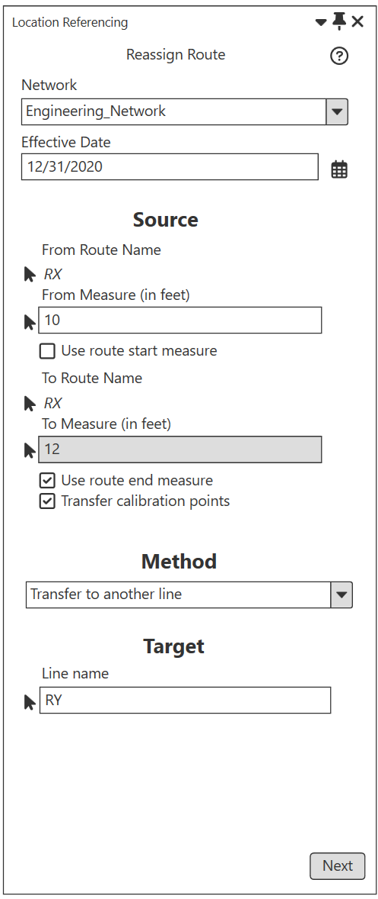
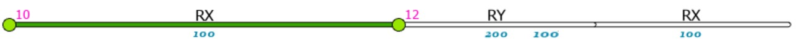
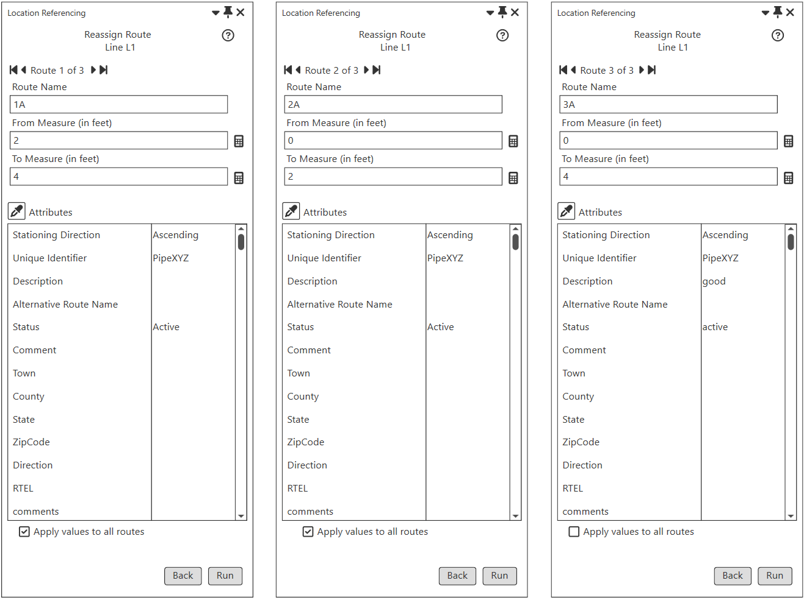
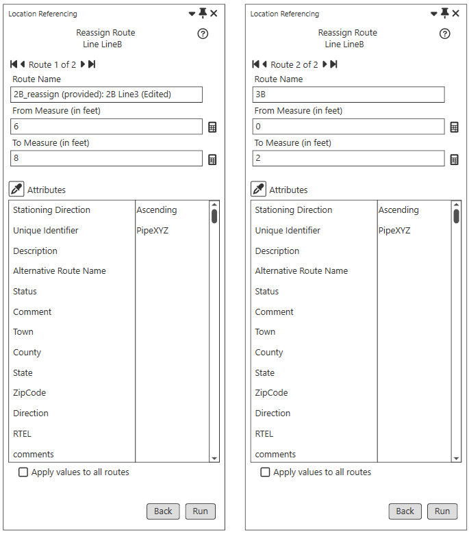
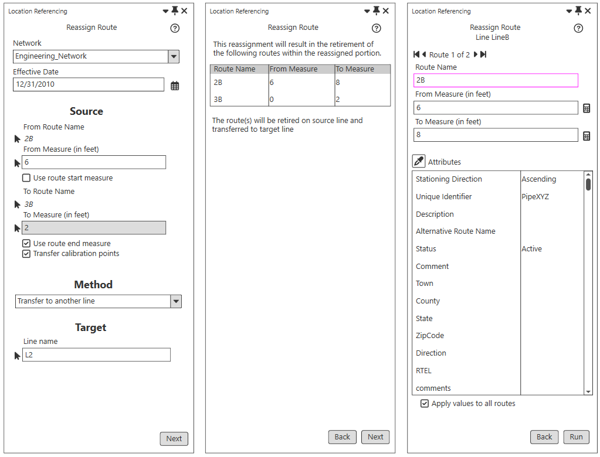
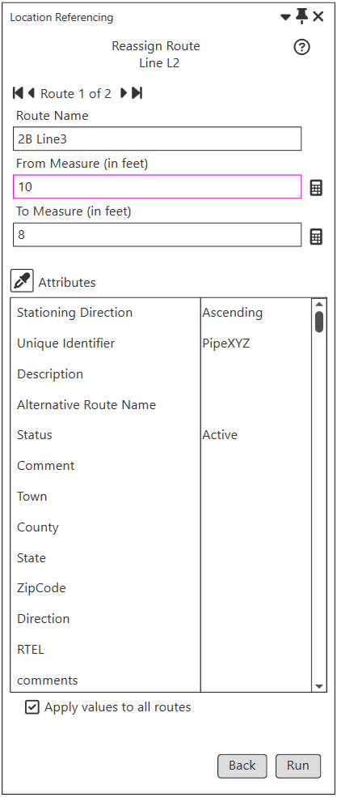
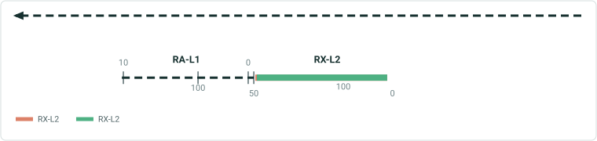
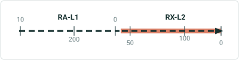

# Reassign UI Existing Line Test Plan

|   |   |
| --- | --- |
| **Kind** | Test Plan · Pro |
| **Release** | — |
| **Source** | [Reassign_UI_ExistingLine_TestPlan.pptx](<https://esriis.sharepoint.com/sites/LocationReferencing/Shared%20Documents/General/Test%20Plans/Reassign_UI_ExistingLine_TestPlan.pptx>) |
| **Edited** | 2023-07-21 19:42 by Rahul Rakshit |
| **Extracted** | 2026-09-04 · lane `xmlstrip` |

<!-- metadata
```yaml
title: "Reassign UI Existing Line Test Plan"
source_file: "Reassign_UI_ExistingLine_TestPlan.pptx"
source_url: "https://esriis.sharepoint.com/sites/LocationReferencing/Shared%20Documents/General/Test%20Plans/Reassign_UI_ExistingLine_TestPlan.pptx"
doc_id: 535
doc_kind: "Test Plan"
surface: "Pro"
doc_revision: ""
target_release: ""
pe: ""
dev: ""
author: "Rahul Rakshit"
last_edited_by: "Rahul Rakshit"
last_edited: "2023-07-21T19:42:59Z"
extracted: 2026-09-04
extraction_lane: xmlstrip
prompt_version: "v2.0.2"
keywords: ["route reassignment", "calibration points", "line order", "time slicing", "error handling", "route attributes", "partial route", "calibration direction", "rest call", "ui validation"]
tools: []
products: []
issues: []
related: [{"doc":538,"file":"reassign-route-supporting-transferring-to-another-line-test-plan__doc538.md","s":6.347},{"doc":542,"file":"reassign-routes-to-another-line-with-original-route-id-name-maintenance-rest__doc542.md","s":4.537},{"doc":533,"file":"reassign-route-transfer-to-another-line-method-support-move-event-behavior-test__doc533.md","s":4.347},{"doc":528,"file":"reassign-transfer-to-another-line-with-stayput-and-retire-event-behavior-test__doc528.md","s":4.176},{"doc":550,"file":"reassign-route-ui-dynamic-support-of-existing-methods-test-plan__doc550.md","s":4.155}]
```
-->

## Summary

Test plan for reassigning routes from one line to another within an engineering network. It covers scenarios including transferring routes and calibration points, handling partial route reassignments, error conditions, and verifying UI and REST call behaviors. The plan includes multiple test cases validating route attributes, line orders, time slicing, error messages, and calibration direction consistency.

## Related documents

<!-- related:begin -->
- [Reassign Route Supporting Transferring to Another Line - Test Plan](<https://esriis.sharepoint.com/sites/lrsworkspace/LRS Doc Index/Test Plans/reassign-route-supporting-transferring-to-another-line-test-plan__doc538.md>) — similar text 0.74 · 2 title words · 2 filename words · same kind/surface/folder <!-- rel:538 -->
- [Reassign Routes to Another Line with Original Route ID/Name Maintenance - REST Test Plan](<https://esriis.sharepoint.com/sites/lrsworkspace/LRS%20Doc%20Index/Test%20Plans/reassign-routes-to-another-line-with-original-route-id-name-maintenance-rest__doc542.md>) — similar text 0.36 · 2 title words · 1 filename word · same kind/folder <!-- rel:542 -->
- [Reassign Route Transfer to Another Line Method: Support Move Event Behavior Test Plan](<https://esriis.sharepoint.com/sites/lrsworkspace/LRS Doc Index/Test Plans/reassign-route-transfer-to-another-line-method-support-move-event-behavior-test__doc533.md>) — similar text 0.29 · 2 title words · 2 filename words · same kind/surface/folder <!-- rel:533 -->
- [Reassign - Transfer to Another Line with StayPut and Retire Event Behavior - Test Plan](<https://esriis.sharepoint.com/sites/lrsworkspace/LRS%20Doc%20Index/Test%20Plans/reassign-transfer-to-another-line-with-stayput-and-retire-event-behavior-test__doc528.md>) — similar text 0.29 · 2 title words · 1 filename word · same kind/surface/folder <!-- rel:528 -->
- [Reassign Route UI: Dynamic Support of Existing Methods Test Plan](<https://esriis.sharepoint.com/sites/lrsworkspace/LRS Doc Index/Test Plans/reassign-route-ui-dynamic-support-of-existing-methods-test-plan__doc550.md>) — similar text 0.29 · 2 title words · 2 filename words · same kind/folder <!-- rel:550 -->
<!-- related:end -->

<!-- docs:begin -->
## Esri documentation

[Route reassignment](https://doc.esri.com/en/arcgis-pro/latest/help/production/location-referencing-pipelines/reassign-routes.html)
<!-- docs:end -->

---

## Slide 1

## Slide 2

Routes’ calibration direction
Each color represents a separate line
Notes:

- Because I took my screenshots several weeks ago, the UI may not be the most updated. The cosmetic adjustments can be ignored for the test plan.
- We’ll show the route number in the error messages NOT the route ID

[figure: Calibration Points · Source Routes (yellow) · Line Order · Route ID]

## Slide 3

| R Name | L NAME | From Date | To Date | Line Order |
| --- | --- | --- | --- | --- |
| 1A | L0 | 1/1/2000 | Null | 100 |
| 2A | L0 | 1/1/2000 | Null | 200 |
| 3A | L0 | 1/1/2000 | Null | 300 |
| 1B | L1 | 1/1/2000 | Null | 100 |
| 2B | L1 | 1/1/2000 | Null | 200 |
| 3B | L1 | 1/1/2000 | Null | 300 |
| 1C | L2 | 1/1/2000 | Null | 100 |
| 2C | L2 | 1/1/2000 | Null | 200 |
| 3C | L2 | 1/1/2000 | Null | 300 |

| Test ID | 1 | Network Type | Engineering |
| --- | --- | --- | --- |
| Test | Reassign all the routes in a line to another line on right, transferring routes |  |  |

## Slide 4


## Slide 5


## Slide 6

| R Name | L NAME | From Date | To Date | Line Order |
| --- | --- | --- | --- | --- |
| 1A | L0 | 1/1/2000 | 12/31/2010 | 100 |
| 2A | L0 | 1/1/2000 | 12/31/2010 | 200 |
| 3A | L0 | 1/1/2000 | 12/31/2010 | 300 |
| 1B | L1 | 1/1/2000 | 12/31/2010 | 100 |
| 2B | L1 | 1/1/2000 | 12/31/2010 | 200 |
| 3B | L1 | 1/1/2000 | 12/31/2010 | 300 |
| 1A | L1 | 12/31/2010 | Null | 100 |
| 2A | L1 | 12/31/2010 | Null | 200 |
| 3A | L1 | 12/31/2010 | Null | 300 |
| 1B | L1 | 12/31/2010 | Null | 400 |
| 2B | L1 | 12/31/2010 | Null | 500 |
| 3B | L1 | 12/31/2010 | Null | 600 |
| 1C | L2 | 1/1/2000 | Null | 100 |
| 2C | L2 | 1/1/2000 | Null | 200 |
| 3C | L2 | 1/1/2000 | Null | 300 |

Verification:

- Each output target route corresponds to the exact input route
- The line orders are updated for the source and target
- The source and target routes are time sliced
- The CPs are time sliced
- The CPs are updated
- The CLS is updated in case a partial route is reassigned
- The CL is split in case a partial route is reassigned
- Edit log entries
- REST call signature
- The non LRS attributes are carried over to the target routes
- REST and UI have same/similar error messages
- The doc link points to the right url
- Dark and light modes work
- I18n compliant
- 508 compliant

## Slide 7


| R Name | L NAME | From Date | To Date | Line Order |
| --- | --- | --- | --- | --- |
| 1A | L0 | 1/1/2000 | Null | 100 |
| 2A | L0 | 1/1/2000 | Null | 200 |
| 3A | L0 | 1/1/2000 | Null | 300 |
| 1B | L1 | 1/1/2000 | Null | 100 |
| 2B | L1 | 1/1/2000 | Null | 200 |
| 3B | L1 | 1/1/2000 | Null | 300 |
| 1C | L2 | 1/1/2000 | Null | 100 |
| 2C | L2 | 1/1/2000 | Null | 200 |
| 3C | L2 | 1/1/2000 | Null | 300 |

| Test ID | 3 | Network Type | Engineering |
| --- | --- | --- | --- |
| Test | Reassign all the routes in a line to an existing line, transferring routes. Clicked on an intersections of two routes belonging to different lines. The input is not next to target line. |  |  |

Modal window with a line selector shows up.

## Slide 8


| R Name | L NAME | From Date | To Date | Line Order |
| --- | --- | --- | --- | --- |
| RD | L1 | 1/1/2020 | Null | 100 |
| RY | L2 | 12/31/2019 | Null | 200 |
| RX | L2 | 12/31/2019 | Null | 100 |


| Test ID | 4 | Network Type | Engineering |
| --- | --- | --- | --- |
| Test | Reassign all the routes in a line to an existing line, transferring routes. Clicked on an intersections of two routes belonging to different lines. The input and target lines coincide. |  |  |

Modal window with a line selector should not show up as selecting  the input line for target is going to error out. Select L2 automatically.

RD

 

## Slide 9


| Test ID | 5 | Network Type | Engineering |
| --- | --- | --- | --- |
| Test | Fill Pane1 and Pane3 go back to Pane1 |  |  |

The inputs in Pane1 should be intact



## Slide 10


| Test ID | 6 | Network Type | Engineering |
| --- | --- | --- | --- |
| Test | Fill Pane1 and Pane3 go back to Pane1 and change the from and to source routes’ name |  |  |

The inputs in Pane3 and the derived info in Pane2 should reflect the changes


## Slide 11


| Test ID | 7 | Network Type | Engineering |
| --- | --- | --- | --- |
| Test | Fill Pane1 and Pane3 go back to Pane1 and change the from and to source routes' measures |  |  |

The inputs in Pane3 and the derived info in Pane2 should reflect the changes


## Slide 12


| Test ID | 8 | Network Type | Engineering |
| --- | --- | --- | --- |
| Test | Fill Pane1 and Edit the Route names and Measures in Pane3 go back to Pane1 and then go to Pane3 |  |  |

The inputs in Pane3 should be intact


## Slide 13


| Test ID | 10 | Network Type | Engineering |
| --- | --- | --- | --- |
| Test | Check the Apply values to all routes box and verify that the same attributes have been updated for all routes |  |  |

By Default
Run the tool to verify that the attribute changes have propagated to all the routes

 

## Slide 14


| Test ID | 11 | Network Type | Engineering |
| --- | --- | --- | --- |
| Test | Error: Partial route in the target is given the same name as the source |  |  |

| R Name | L NAME | From Date | To Date | Line Order |
| --- | --- | --- | --- | --- |
| 1A | L0 | 1/1/2000 | Null | 100 |
| 2A | L0 | 1/1/2000 | Null | 200 |
| 3A | L0 | 1/1/2000 | Null | 300 |
| 1B | L1 | 1/1/2000 | Null | 100 |
| 2B | L1 | 1/1/2000 | Null | 200 |
| 3B | L1 | 1/1/2000 | Null | 300 |
| 1C | L2 | 1/1/2000 | Null | 100 |
| 2C | L2 | 1/1/2000 | Null | 200 |
| 3C | L2 | 1/1/2000 | Null | 300 |

Error message to be provided by the dev prior to testing.

   

## Slide 15


| Test ID | 12 | Network Type | Engineering |
| --- | --- | --- | --- |
| Test | Error: Target From M is > To M |  |  |

| R Name | L NAME | From Date | To Date | Line Order |
| --- | --- | --- | --- | --- |
| 1A | L0 | 1/1/2000 | Null | 100 |
| 2A | L0 | 1/1/2000 | Null | 200 |
| 3A | L0 | 1/1/2000 | Null | 300 |
| 1B | L1 | 1/1/2000 | Null | 100 |
| 2B | L1 | 1/1/2000 | Null | 200 |
| 3B | L1 | 1/1/2000 | Null | 300 |
| 1C | L2 | 1/1/2000 | Null | 100 |
| 2C | L2 | 1/1/2000 | Null | 200 |
| 3C | L2 | 1/1/2000 | Null | 300 |

From Measure of Route 2B Line3 is greater than its To Measure.

   

## Slide 16


| Test ID | 12 | Network Type | Engineering |
| --- | --- | --- | --- |
| Test | Error: Target From M is = To M |  |  |

| R Name | L NAME | From Date | To Date | Line Order |
| --- | --- | --- | --- | --- |
| 1A | L0 | 1/1/2000 | Null | 100 |
| 2A | L0 | 1/1/2000 | Null | 200 |
| 3A | L0 | 1/1/2000 | Null | 300 |
| 1B | L1 | 1/1/2000 | Null | 100 |
| 2B | L1 | 1/1/2000 | Null | 200 |
| 3B | L1 | 1/1/2000 | Null | 300 |
| 1C | L2 | 1/1/2000 | Null | 100 |
| 2C | L2 | 1/1/2000 | Null | 200 |
| 3C | L2 | 1/1/2000 | Null | 300 |

From Measure of Route 2B Line3 is equal to its To Measure.

  

## Slide 17


| Test ID | 13 | Network Type | Engineering |
| --- | --- | --- | --- |
| Test | Error: Target Route Name exceeds 255 characters |  |  |

| R Name | L NAME | From Date | To Date | Line Order |
| --- | --- | --- | --- | --- |
| 1A | L0 | 1/1/2000 | Null | 100 |
| 2A | L0 | 1/1/2000 | Null | 200 |
| 3A | L0 | 1/1/2000 | Null | 300 |
| 1B | L1 | 1/1/2000 | Null | 100 |
| 2B | L1 | 1/1/2000 | Null | 200 |
| 3B | L1 | 1/1/2000 | Null | 300 |
| 1C | L2 | 1/1/2000 | Null | 100 |
| 2C | L2 | 1/1/2000 | Null | 200 |
| 3C | L2 | 1/1/2000 | Null | 300 |

Route Name exceeds 255 characters

 

## Slide 18


| Test ID | 14 | Network Type | Engineering |
| --- | --- | --- | --- |
| Test | Error: More than one error exists in different pages |  |  |

| R Name | L NAME | From Date | To Date | Line Order |
| --- | --- | --- | --- | --- |
| 1A | L0 | 1/1/2000 | Null | 100 |
| 2A | L0 | 1/1/2000 | Null | 200 |
| 3A | L0 | 1/1/2000 | Null | 300 |
| 1B | L1 | 1/1/2000 | Null | 100 |
| 2B | L1 | 1/1/2000 | Null | 200 |
| 3B | L1 | 1/1/2000 | Null | 300 |
| 1C | L2 | 1/1/2000 | Null | 100 |
| 2C | L2 | 1/1/2000 | Null | 200 |
| 3C | L2 | 1/1/2000 | Null | 300 |

Route Name exceeds 255 characters
Route Name not provided

 

## Slide 19


| Test ID | 15 | Network Type | Engineering |
| --- | --- | --- | --- |
| Test | Error: More than one error exists in the same page |  |  |

| R Name | L NAME | From Date | To Date | Line Order |
| --- | --- | --- | --- | --- |
| 1A | L0 | 1/1/2000 | Null | 100 |
| 2A | L0 | 1/1/2000 | Null | 200 |
| 3A | L0 | 1/1/2000 | Null | 300 |
| 1B | L1 | 1/1/2000 | Null | 100 |
| 2B | L1 | 1/1/2000 | Null | 200 |
| 3B | L1 | 1/1/2000 | Null | 300 |
| 1C | L2 | 1/1/2000 | Null | 100 |
| 2C | L2 | 1/1/2000 | Null | 200 |
| 3C | L2 | 1/1/2000 | Null | 300 |

Route Name exceeds 255 characters
From Measure of Route 2B Line3 is equal to its To Measure.

 

## Slide 20


| Test ID | 16 | Network Type | Engineering |
| --- | --- | --- | --- |
| Test | Error: Clicked RUN on Page15 in Pane3 but there exists an error in page 3 |  |  |

| R Name | L NAME | From Date | To Date | Line Order |
| --- | --- | --- | --- | --- |
| 1A | L0 | 1/1/2000 | Null | 100 |
| 2A | L0 | 1/1/2000 | Null | 200 |
| 3A | L0 | 1/1/2000 | Null | 300 |
| 1B | L1 | 1/1/2000 | Null | 100 |
| 2B | L1 | 1/1/2000 | Null | 200 |
| 3B | L1 | 1/1/2000 | Null | 300 |
| 1C | L2 | 1/1/2000 | Null | 100 |
| 2C | L2 | 1/1/2000 | Null | 200 |
| 3C | L2 | 1/1/2000 | Null | 300 |

Need to define the experience.

 

## Slide 21

| Test ID | 17 | Network Type | Engineering |
| --- | --- | --- | --- |
| Test | Error: Several error conditions |  |  |


| R Name | L NAME | From Date | To Date | Line Order |
| --- | --- | --- | --- | --- |
| 1A | L0 | 1/1/2000 | Null | 100 |
| 2A | L0 | 1/1/2000 | Null | 200 |
| 3A | L0 | 1/1/2000 | Null | 300 |
| 1B | L1 | 1/1/2000 | Null | 100 |
| 2B | L1 | 1/1/2000 | Null | 200 |
| 3B | L1 | 1/1/2000 | Null | 300 |
| 1C | L2 | 1/1/2000 | Null | 100 |
| 2C | L2 | 1/1/2000 | Null | 200 |
| 3C | L2 | 1/1/2000 | Null | 300 |

|  | Test | Error Message |
| --- | --- | --- |
| 1 | From Measure not provided | From measure missing |
| 2 | Non-numeric value for the From Measure | Invalid measure |
| 3 | To Measure not provided | To Measure missing |
| 4 | Non-numeric value for the To Measure | Invalid measure |
| 5 | Invalid measure (-) provided | Invalid measure |
| 6 | Same Route Name provided for more than one route | Route <Name> already provided |
| 7 | Two sets of duplicate route names provided | Route <Name> already provided |
| 8 | A route name that already exists in current time slice with another line provided | Route <Name> already exists in Line <Line Name> |
| 9 | The Target route name is a retired route on the same line | Not an error |
| 10 | If an attribute value has an error, then the top RED error message displays the error info with the route number |  |

Test with more than one error condition at a time


## Slide 22

| Test ID | 18 | Network Type | Engineering |
| --- | --- | --- | --- |
| Test | Error: Line Name is the same name as that of the source routes |  |  |


| R Name | L NAME | From Date | To Date | Line Order |
| --- | --- | --- | --- | --- |
| 1A | L0 | 1/1/2000 | Null | 100 |
| 2A | L0 | 1/1/2000 | Null | 200 |
| 3A | L0 | 1/1/2000 | Null | 300 |
| 1B | L1 | 1/1/2000 | Null | 100 |
| 2B | L1 | 1/1/2000 | Null | 200 |
| 3B | L1 | 1/1/2000 | Null | 300 |
| 1C | L2 | 1/1/2000 | Null | 100 |
| 2C | L2 | 1/1/2000 | Null | 200 |
| 3C | L2 | 1/1/2000 | Null | 300 |

Dev to provide the error message prior to testing.

 

## Slide 23

| R Name | L NAME | From Date | To Date | Line Order |
| --- | --- | --- | --- | --- |
| 1A | L0 | 1/1/2000 | Null | 100 |
| 2A | L0 | 1/1/2000 | Null | 200 |
| 3A | L0 | 1/1/2000 | Null | 300 |
| 1B | L1 | 1/1/2000 | Null | 100 |
| 2B | L1 | 1/1/2000 | Null | 200 |
| 3B | L1 | 1/1/2000 | Null | 300 |
| 1C | L2 | 1/1/2000 | Null | 100 |
| 2C | L2 | 1/1/2000 | Null | 200 |
| 3C | L2 | 1/1/2000 | Null | 300 |

| Test ID | 19 | Network Type | Engineering |
| --- | --- | --- | --- |
| Test | Reassign all the routes in a line to another line on right, 2/3 route names and measures maintained. The first route in the line has changed. |  |  |

## Slide 24


| Test ID | 19 | Network Type | Engineering |
| --- | --- | --- | --- |
| Test | Reassign all the routes in a line to another line on right, 2/3 route names and measures maintained. The first route in the line has changed. |  |  |

## Slide 25

| Test ID | 19 | Network Type | Engineering |
| --- | --- | --- | --- |
| Test | Reassign all the routes in a line to another line on right, 2/3 route names and measures maintained. The first route in the line has changed. |  |  |

| R Name | L NAME | From Date | To Date | Line Order |
| --- | --- | --- | --- | --- |
| 1A | L0 | 1/1/2000 | 12/31/2010 | 100 |
| 2A | L0 | 1/1/2000 | 12/31/2010 | 200 |
| 3A | L0 | 1/1/2000 | 12/31/2010 | 300 |
| 1B | L1 | 1/1/2000 | 12/31/2010 | 100 |
| 2B | L1 | 1/1/2000 | 12/31/2010 | 200 |
| 3B | L1 | 1/1/2000 | 12/31/2010 | 300 |
| 1A-Change | L1 | 12/31/2010 | Null | 100 |
| 2A | L1 | 12/31/2010 | Null | 200 |
| 3A | L1 | 12/31/2010 | Null | 300 |
| 1B | L1 | 12/31/2010 | Null | 400 |
| 2B | L1 | 12/31/2010 | Null | 500 |
| 3B | L1 | 12/31/2010 | Null | 600 |
| 1C | L2 | 1/1/2000 | Null | 100 |
| 2C | L2 | 1/1/2000 | Null | 200 |
| 3C | L2 | 1/1/2000 | Null | 300 |

## Slide 26


| R Name | L NAME | From Date | To Date | Line Order |
| --- | --- | --- | --- | --- |
| 1A | L0 | 1/1/2000 | Null | 100 |
| 2A | L0 | 1/1/2000 | Null | 200 |
| 3A | L0 | 1/1/2000 | Null | 300 |
| 1B | L1 | 1/1/2000 | Null | 100 |
| 2B | L1 | 1/1/2000 | Null | 200 |
| 3B | L1 | 1/1/2000 | Null | 300 |
| 1C | L2 | 1/1/2000 | Null | 100 |
| 2C | L2 | 1/1/2000 | Null | 200 |
| 3C | L2 | 1/1/2000 | Null | 300 |

| Test ID | 20 | Network Type | Engineering |
| --- | --- | --- | --- |
| Test | Reassign a middle route to another line on right. Keep Name intact |  |  |

The source route should touch the target line.

Design the error experience


## Slide 27


| R Name | L NAME | From Date | To Date | Line Order |
| --- | --- | --- | --- | --- |
| 1A | L0 | 1/1/2000 | Null | 100 |
| 2A | L0 | 1/1/2000 | Null | 200 |
| 3A | L0 | 1/1/2000 | Null | 300 |
| 1B | L1 | 1/1/2000 | Null | 100 |
| 2B | L1 | 1/1/2000 | Null | 200 |
| 3B | L1 | 1/1/2000 | Null | 300 |
| 1C | L2 | 1/1/2000 | Null | 100 |
| 2C | L2 | 1/1/2000 | Null | 200 |
| 3C | L2 | 1/1/2000 | Null | 300 |

| Test ID | 25 | Network Type | Engineering |
| --- | --- | --- | --- |
| Test | Reassign all the routes in a line to another line on right, transferring routes and measures. The effective date is same as one the source route’s From Date |  |  |

## Slide 28

| Test ID | 25 | Network Type | Engineering |
| --- | --- | --- | --- |
| Test | Reassign all the routes in a line to another line on right, transferring routes and measures. The effective date is same as one the source route’s From Date |  |  |

| R Name | L NAME | From Date | To Date | Line Order |
| --- | --- | --- | --- | --- |
| 1A | L1 | 1/1/2000 | Null | 100 |
| 2A | L1 | 1/1/2000 | Null | 200 |
| 3A | L1 | 1/1/2000 | Null | 300 |
| 1B | L1 | 1/1/2000 | Null | 400 |
| 2B | L1 | 1/1/2000 | Null | 500 |
| 3B | L1 | 1/1/2000 | Null | 600 |
| 1C | L2 | 1/1/2000 | Null | 100 |
| 2C | L2 | 1/1/2000 | Null | 200 |
| 3C | L2 | 1/1/2000 | Null | 300 |

## Slide 29


| R Name | L NAME | From Date | To Date | Line Order |
| --- | --- | --- | --- | --- |
| X1 | L3 | 1/1/2000 | Null | 100 |
| X2 | L3 | 1/1/2000 | Null | 200 |
| 1B | L1 | 1/1/2000 | Null | 100 |
| 2B | L1 | 1/1/2000 | Null | 200 |
| 3B | L1 | 1/1/2000 | Null | 300 |

| Test ID | 26 | Network Type | Engineering |
| --- | --- | --- | --- |
| Test | Reassign to fill the gap in a line by transferring route. |  |  |

## Slide 30

| R Name | L NAME | From Date | To Date | Line Order |
| --- | --- | --- | --- | --- |
| X1 | L3 | 1/1/2000 | Null | 100 |
| X2 | L3 | 1/1/2000 | 12/31/2023 | 200 |
| 1B | L1 | 1/1/2000 | 12/31/2023 | 100 |
| 2B | L1 | 1/1/2000 | 12/31/2023 | 200 |
| 3B | L1 | 1/1/2000 | 12/31/2023 | 300 |
| X2 | L3 | 12/31/2023 | Null | 300 |
| 1B | L3 | 12/31/2023 | Null | 200 |
| 3B | L1 | 12/31/2023 | Null | 200 |
| 2B | L1 | 12/31/2023 | Null | 100 |

| Test ID | 26 | Network Type | Engineering |
| --- | --- | --- | --- |
| Test | Reassign to fill the gap in a line by transferring route. |  |  |

## Slide 31

| R Name | L NAME | From Date | To Date | Line Order |
| --- | --- | --- | --- | --- |
| X1 | L3 | 1/1/2000 | Null | 100 |
| X2 | L3 | 1/1/2000 | Null | 200 |
| 1B | L1 | 1/1/2000 | Null | 100 |
| 2B | L1 | 1/1/2000 | Null | 200 |
| 3B | L1 | 1/1/2000 | Null | 300 |

| Test ID | 27 | Network Type | Engineering |
| --- | --- | --- | --- |
| Test | Reassign part of a route to another existing line. |  |  |

## Slide 32


| Test ID | 27 | Network Type | Engineering |
| --- | --- | --- | --- |
| Test | Reassign part of a route to another existing line. |  |  |

Make sure that _reassign is added as a default Route Name. We can then edit it. Verify that the updated route name is present upon running the tool.

## Slide 33

| R Name | L NAME | From Date | To Date | Line Order |
| --- | --- | --- | --- | --- |
| X1 | L3 | 1/1/2000 | Null | 100 |
| X2 | L3 | 1/1/2000 | 12/31/2023 | 200 |
| 1B | L1 | 1/1/2000 | 12/31/2023 | 100 |
| 2B | L1 | 1/1/2000 | Null | 200 |
| 3B | L1 | 1/1/2000 | Null | 300 |
| X2 | L3 | 12/31/2023 | Null | 300 |
| 1B-New | L3 | 12/31/2023 | Null | 200 |
| 1B | L1 | 12/31/2023 | Null | 100 |

| Test ID | 27 | Network Type | Engineering |
| --- | --- | --- | --- |
| Test | Reassign part of a route to another existing line. |  |  |

## Slide 34

| R Name | L NAME | From Date | To Date | Line Order |
| --- | --- | --- | --- | --- |
| X1 | L3 | 1/1/2000 | Null | 100 |
| X2 | L3 | 1/1/2000 | Null | 200 |
| 1B | L1 | 1/1/2000 | Null | 100 |
| 2B | L1 | 1/1/2000 | Null | 200 |
| 3B | L1 | 1/1/2000 | Null | 300 |

| Test ID | 28 | Network Type | Engineering |
| --- | --- | --- | --- |
| Test | Reassign part of a route to another line - 2. |  |  |

## Slide 35


| Test ID | 28 | Network Type | Engineering |
| --- | --- | --- | --- |
| Test | Reassign part of a route to another line - 2. |  |  |

## Slide 36

| R Name | L NAME | From Date | To Date | Line Order |
| --- | --- | --- | --- | --- |
| X1 | L3 | 1/1/2000 | 12/31/2023 | 100 |
| X2 | L3 | 1/1/2000 | 12/31/2023 | 200 |
| 1B | L1 | 1/1/2000 | 12/31/2023 | 100 |
| 2B | L1 | 1/1/2000 | 12/31/2023 | 200 |
| 3B | L1 | 1/1/2000 | 12/31/2023 | 300 |
| X2 | L3 | 12/31/2023 | Null | 300 |
| X1 | L3 | 12/31/2023 | Null | 100 |
| 1B-New | L3 | 12/31/2023 | Null | 200 |
| 1B | L1 | 12/31/2023 | Null | 100 |
| 3B | L1 | 12/31/2023 | Null | 300 |
| 2B | L1 | 12/31/2023 | Null | 200 |

| Test ID | 28 | Network Type | Engineering |
| --- | --- | --- | --- |
| Test | Reassign part of a route to another line - 2. |  |  |

## Slide 37


| R Name | L NAME | From Date | To Date | Line Order |
| --- | --- | --- | --- | --- |
| X1 | L3 | 1/1/2000 | Null | 100 |
| X2 | L3 | 1/1/2000 | Null | 200 |
| 1B | L1 | 1/1/2000 | Null | 100 |
| 2B | L1 | 1/1/2000 | Null | 200 |
| 3B | L1 | 1/1/2000 | Null | 300 |

| Test ID | 29 | Network Type | Engineering |
| --- | --- | --- | --- |
| Test | Reassign part of a route to another line - 3. |  |  |

Source routes must touch either the start or end of an existing route in the target.


## Slide 38


| R Name | L NAME | From Date | To Date | Line Order |
| --- | --- | --- | --- | --- |
| X1 | L3 | 1/1/2000 | Null | 100 |
| 1A | L0 | 1/1/2000 | Null | 100 |
| 2A | L0 | 1/1/2000 | Null | 200 |

| Test ID | 30 | Network Type | PoM |
| --- | --- | --- | --- |
| Test | Reassign part of a route to another line. |  |  |

Source routes must touch either the start or end of an existing route in the target.

- For all the cases in PoM, Route ID will be used instead of Route Name.
- Show multi-field route id if configured
- Test multi field route ID that contains leading and/or trailing spaces
This should pass


## Slide 39

| R Name | L NAME | From Date | To Date | Line Order |
| --- | --- | --- | --- | --- |
| X1 | L3 | 1/1/2000 | Null | 100 |
| 1A | L0 | 1/1/2000 | Null | 100 |
| 2A | L0 | 1/1/2000 | Null | 200 |

| Test ID | 31 | Network Type | PoM |
| --- | --- | --- | --- |
| Test | Reassign a route to another line. |  |  |

## Slide 40


| Test ID | 31 | Network Type | PoM |
| --- | --- | --- | --- |
| Test | Reassign a route to another line. |  |  |

## Slide 41

| Test ID | 31 | Network Type | PoM |
| --- | --- | --- | --- |
| Test | Reassign a route to another line. |  |  |

| R Name | L NAME | From Date | To Date | Line Order |
| --- | --- | --- | --- | --- |
| X1 | L3 | 1/1/2000 | Null | 100 |
| 1A | L0 | 1/1/2000 | 12/31/2023 | 100 |
| 1A | L0 | 12/31/2023 | Null | 100 |
| 2A | L0 | 1/1/2000 | Null | 200 |
| 1A-New | L3 | 12/31/2023 | Null | 200 |

## Slide 42

| Test ID | 32 | Network Type | PoM |
| --- | --- | --- | --- |
| Test | Reassign a route to another line. |  |  |

Fill in the line order

[figure: 100 · 200]

## Slide 43


| Test ID | 33 | Network Type | PoM |
| --- | --- | --- | --- |
| Test | Reassign part of a route to another line. |  |  |

Fill in the line order

## Slide 44


| Test ID | 34 | Network Type | PoM |
| --- | --- | --- | --- |
| Test | Reassign part of a route to another line. |  |  |

Fill in the line order

## Slide 45


| Test ID | 35 | Network Type | PoM |
| --- | --- | --- | --- |
| Test | Reassign part of a route to another line. |  |  |

Fill in the line order
This may be 100

## Slide 46


| Test ID | 36 | Network Type | PoM |
| --- | --- | --- | --- |
| Test | Reassign part of a route to another line. |  |  |

Fill in the line order

## Slide 47


| Test ID | 37 | Network Type | PoM |
| --- | --- | --- | --- |
| Test | Reassign part of a route to another line. |  |  |

Fill in the line order

## Slide 48


| Test ID | 38 | Network Type | PoM |
| --- | --- | --- | --- |
| Test | Reassign part of a route to another line. |  |  |

Fill in the line order
This will error out in REST. Not possible in UI

## Slide 49


| R Name | L NAME | From Date | To Date | Line Order |
| --- | --- | --- | --- | --- |
| R1 | L0 | 1/1/2000 | Null | 100 |
| T1 | L1 | 1/1/2000 | Null | 300 |

| Test ID | 40 | Network Type | Engineering |
| --- | --- | --- | --- |
| Test | Reassign all the routes in a line to another line on right,transnfer CPs. |  |  |

| R Name | L NAME | From Date | To Date | Line Order |
| --- | --- | --- | --- | --- |
| R1 | L0 | 1/1/2000 | 12/31/2010 | 100 |
| T1 | L1 | 1/1/2000 | 12/31/2010 | 300 |
| R1 | L1 | 12/31/2010 | Null | 100 |
| T1 | L1 | 12/31/2010 | Null | 200 |

## Slide 50


| Test ID | 43 | Network Type | Engineering |
| --- | --- | --- | --- |
| Test | Reassign a route to an existing line. The CL direction for the route is opposite to the calibration direction of the route. |  |  |

Here the arrows show the direction of the CL and the colors show route on the CL. For RA-L1, the direction of the CL is opposite to that of the route’s calibration as the in-memory flip CL tool was used to create that route. When We reassign the complete route RA-L1 to another line (transfer) make sure that the output route is calibrated in the same direction as before



| R Name | L NAME | From Date | To Date | Line Order |
| --- | --- | --- | --- | --- |
| R1 | L0 | 1/1/2000 | Null | 100 |
| RX | L1 | 1/1/2000 | 12/31/2011 | 100 |

## Slide 51

| Test ID | 43 | Network Type | Engineering |
| --- | --- | --- | --- |
| Test | Reassign a route to an existing line. The CL direction for the route is opposite to the calibration direction of the route. |  |  |

Here the arrows show the direction of the CL and the colors show route on the CL. For RA-L1, the direction of the CL is opposite to that of the route’s calibration as the in-memory flip CL tool was used to create that route. When We reassign the complete route RA-L1 to another line (transfer) make sure that the output route is calibrated in the same direction as before



| R Name | L NAME | From Date | To Date | Line Order |
| --- | --- | --- | --- | --- |
| RA-L1 | L0 | 1/1/2000 | 12/31/2010 | 100 |
| RX-L2 | L1 | 1/1/2000 | 12/31/2011 | 100 |
| RA-L1 | L1 | 12/31/2010 | 12/31/2011 | 200 |
| RA-L1 | L1 | 12/31/2011 | Null | 100 |

## Slide 52

| Test ID | 23 | Network Type | Engineering |
| --- | --- | --- | --- |
| Test | Reassign a line to an existing line where there are more than 30 routes in a line |  |  |
