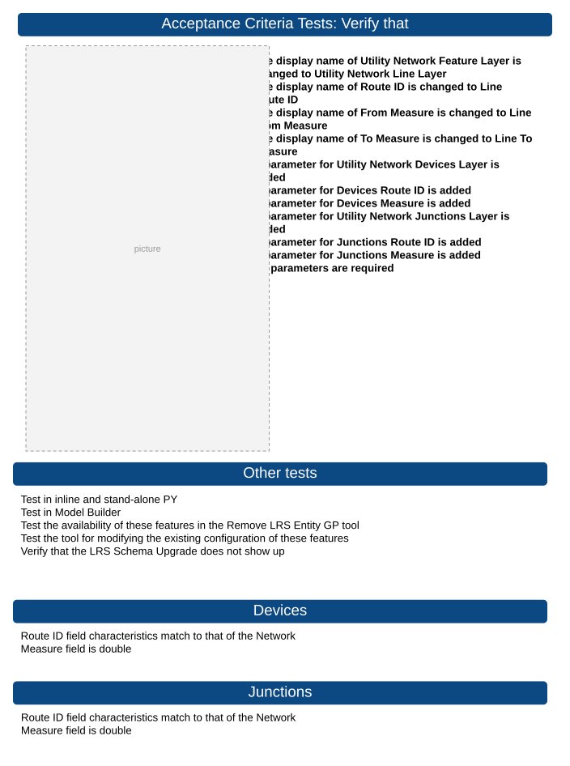

# Test Plan : Registering

| Field | Value |
| --- | --- |
| **Doc** | 89 · Test Plan · Pro |
| **Product** | Utility Network |
| **Release** | — |
| **Issues** | — |
| **Source** | [Register_Devices_Junctions_TestPlan.pptx](<https://esriis.sharepoint.com/sites/LocationReferencing/Shared%20Documents/General/Test%20Plans/Register_Devices_Junctions_TestPlan.pptx>) |
| **People** | author Rahul Rakshit · PE — · dev — |
| **Edited** | 2025-12-26 13:55 by Rahul Rakshit |
| **Extracted** | 2026-09-04 · lane xmlstrip · format 3.0 · prompt v2.0.2 |
| **Keywords** | utility network · devices · junctions · route id · measure field · error handling · configuration · test plan |
| **Tools** | Remove LRS Entity |

## Summary

Test plan for registering utility network devices and junctions in the linear referencing system. Covers acceptance criteria for display name changes, parameter additions, field characteristics, and error cases including mismatched fields and invalid layer inputs. Includes tests for tool availability, configuration modification, schema upgrade absence, and REST layer verification.

## Related documents

<!-- related:begin -->
- [SLD Devices and Junctions Test Plan](<https://esriis.sharepoint.com/sites/lrsworkspace/LRS%20Doc%20Index/Test%20Plans/29867-sld-devices-and-junctions.md>) — similar text 0.41 · 2 filename words · same kind/folder <!-- rel:28 s=4.793 -->
- [Route Log data product template – Test Plan](<https://esriis.sharepoint.com/sites/lrsworkspace/LRS Doc Index/Test Plans/6203-route-log-data-product-template.md>) — similar text 0.13 · same kind/surface/folder <!-- rel:256 s=2.725 -->
- [Configure Addressing Feature Classes GP Tool Test Plan](<https://esriis.sharepoint.com/sites/lrsworkspace/LRS Doc Index/Test Plans/5572-configure-addressing-feature-classes-gp.md>) — similar text 0.19 · same kind/surface/folder <!-- rel:424 s=2.68 -->
- [Modify LRS Intersection Feature Class Geoprocessing Tool](<https://esriis.sharepoint.com/sites/lrsworkspace/LRS Doc Index/Test Plans/modify-lrs-intersection-feature-class-gp.md>) — similar text 0.23 · same kind/surface <!-- rel:878 s=2.602 -->
- [Support a single summary field in LRS Data Template wizard – Test Plan](<https://esriis.sharepoint.com/sites/lrsworkspace/LRS Doc Index/Test Plans/5774-support-a-single-summary-field-in-lrs-data-template-wizard.md>) — similar text 0.16 · same kind/surface/folder <!-- rel:347 s=2.593 -->
<!-- related:end -->

<!-- docs:begin -->
## Esri documentation

[View utility network feature class properties](https://doc.esri.com/en/arcgis-pro/latest/help/production/location-referencing-pipelines/view-utility-network-feature-class-properties.html)

_No page matched:_ [Remove LRS Entity](https://www.google.com/search?q=%22Remove%20LRS%20Entity%22+site%3Adoc.esri.com)
<!-- docs:end -->

---

## Overview

### Slide 1 — Test Plan : Registering <!-- slide 1 -->

Test Plan : Registering

## Test Cases

### TC-U01 — Acceptance Criteria Tests : Verify that <!-- src: LLM · slide 2 · "Acceptance Criteria Tests : Verify that" checklist -->
- **Steps:**
  1. The display name of Utility Network Feature Layer is changed to Utility Network Line Layer
  2. The display name of Route ID is changed to Line Route ID
  3. The display name of From Measure is changed to Line From Measure
  4. The display name of To Measure is changed to Line To Measure
  5. A parameter for Utility Network Devices Layer is added
  6. A parameter for Devices Route ID is added
  7. A parameter for Devices Measure is added
  8. A parameter for Utility Network Junctions Layer is added
  9. A parameter for Junctions Route ID is added
  10. A parameter for Junctions Measure is added
  11. All parameters are required

### TC-U02 — Other tests <!-- src: LLM · slide 2 · "Other tests" checklist -->
- **Steps:**
  1. Test in inline and stand-alone PY
  2. Test in Model Builder
  3. Test the availability of these features in the Remove LRS Entity GP tool
  4. Test the tool for modifying the existing configuration of these features
  5. Verify that the LRS Schema Upgrade does not show up

### TC-U03 — Devices <!-- src: LLM · slide 2 · "Devices" checklist -->
- **Steps:**
  1. Route ID field characteristics match to that of the Network
  2. Measure field is double

### TC-U04 — Junctions <!-- src: LLM · slide 2 · "Junctions" checklist -->
- **Steps:**
  1. Route ID field characteristics match to that of the Network
  2. Measure field is double

### TC-U05 — Error cases <!-- src: LLM · slide 3 · "Error cases" checklist -->
- **Steps:**
  1. Route ID field characteristics do not match to that of the Network for junctions and devices
  2. Measure field is not double
  3. Same layer is provided for junctions and devices
  4. Already registered point event layer is provided
  5. Line layer is provided for junctions and devices
  6. PY: Point layer provided does not exists
  7. PY: RID and measure fields do not exist
  8. PY: Only 1 or 2 or the Line/Device/Junctions is provided
  9. PY: Layer, RID or measure is not provided

### TC-U06 — More cases <!-- src: LLM · slide 3 · "More cases" checklist -->
- **Steps:**
  1. Check the metadata using arcpy.describe
  2. Run the Modify LRS GP tool to check if things still work as designed
  3. Check the UN REST Layer to verify if the devices and junctions are added
