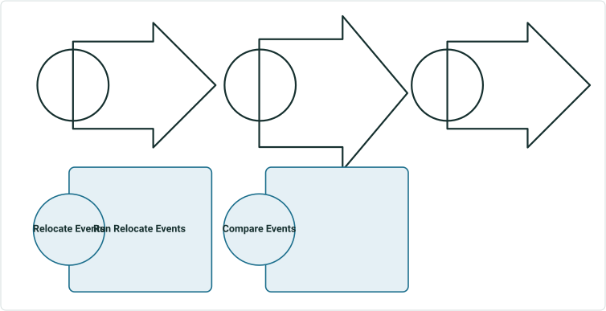
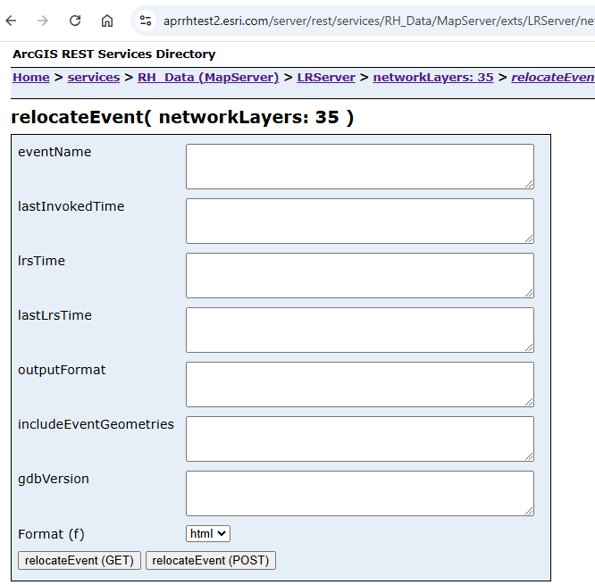

# Relocate Events Support for External Event with No Connection File - Test Plan

|   |   |
| --- | --- |
| **Kind** | Test Plan · Experience Builder |
| **Release** | — |
| **Issue** | [ArcGISPro/ps-location-referencing#5987](https://devtopia.esri.com/ArcGISPro/ps-location-referencing/issues/5987) |
| **Source** | [RelocateEvents_supportExternalEventswithNoconnectionfile_Testplan.pptx](<https://esriis.sharepoint.com/sites/LocationReferencing/Shared%20Documents/General/Test%20Plans/RelocateEvents_supportExternalEventswithNoconnectionfile_Testplan.pptx>) |
| **Edited** | 2024-12-18 19:30 by Lakshmi Ananthanarayanan |
| **Extracted** | 2026-09-04 · lane `xmlstrip` |

<!-- metadata
```yaml
title: "Relocate Events Support for External Event with No Connection File - Test Plan"
source_file: "RelocateEvents_supportExternalEventswithNoconnectionfile_Testplan.pptx"
source_url: "https://esriis.sharepoint.com/sites/LocationReferencing/Shared%20Documents/General/Test%20Plans/RelocateEvents_supportExternalEventswithNoconnectionfile_Testplan.pptx"
doc_id: 264
doc_kind: "Test Plan"
surface: "Experience Builder"
doc_revision: ""
target_release: ""
pe: "Lakshmi"
dev: "Eric"
author: "Lakshmi Ananthanarayanan"
last_edited_by: "Lakshmi Ananthanarayanan"
last_edited: "2024-12-18T19:30:23Z"
extracted: 2026-09-04
extraction_lane: xmlstrip
prompt_version: "v2.0.2"
keywords: ["external event", "event relocation", "event behavior", "event location", "test cases", "dynamic segmentation", "experience builder"]
tools: ["ArcGIS Experience Builder"]
products: []
issues: ["ArcGISPro/ps-location-referencing#5987"]
related: [{"doc":275,"file":"support-external-event-configuration-without-connection-file-test-plan__doc275.md","s":5.942},{"doc":287,"file":"relocate-event-support-for-external-event-with-no-connection-file__doc287.md","s":3.61},{"doc":562,"file":"migrate-attribute-sets-to-map-cim-service-test-plan__doc562.md","s":3.383},{"doc":365,"file":"point-events-dynamic-segmentation-test-plan__doc365.md","s":2.847},{"doc":394,"file":"dynamic-segmentation-table-consider-point-events-in-dynseg-table__doc394.md","s":2.365}]
```
-->

## Summary

Test plan for relocating events supporting external events without a connection file. It includes verification of parameters EventLocation and EventBehavior, various test cases for external events with and without connection files, and expected results for different input scenarios. The document covers syntax details, behavior rules, and output format validations.

## Related documents

<!-- related:begin -->
- [Support External Event Configuration Without Connection File – Test Plan](<https://esriis.sharepoint.com/sites/lrsworkspace/LRS Doc Index/Test Plans/support-external-event-configuration-without-connection-file-test-plan__doc275.md>) — similar text 0.10 · 4 title words · 3 filename words · same kind/dev/folder <!-- rel:275 -->
- [Relocate Event Support for External Event with No Connection File](<https://esriis.sharepoint.com/sites/lrsworkspace/LRS Doc Index/Design Spikes/relocate-event-support-for-external-event-with-no-connection-file__doc287.md>) — similar text 0.16 · 5 title words · 1 filename word <!-- rel:287 -->
- [Migrate Attribute Sets to Map CIM/Service – Test Plan](<https://esriis.sharepoint.com/sites/lrsworkspace/LRS Doc Index/Test Plans/migrate-attribute-sets-to-map-cim-service-test-plan__doc562.md>) — similar text 0.06 · 1 filename word · same kind/dev/folder <!-- rel:562 -->
- [Point Events Dynamic Segmentation Test Plan](<https://esriis.sharepoint.com/sites/lrsworkspace/LRS Doc Index/Test Plans/point-events-dynamic-segmentation-test-plan__doc365.md>) — similar text 0.16 · 1 title word · 1 filename word · same kind/folder <!-- rel:365 -->
- [Dynamic Segmentation Table: Consider Point Events in DynSeg Table](<https://esriis.sharepoint.com/sites/lrsworkspace/LRS Doc Index/User Stories/dynamic-segmentation-table-consider-point-events-in-dynseg-table__doc394.md>) — similar text 0.12 · 1 title word · 2 filename words <!-- rel:394 -->
<!-- related:end -->

<!-- docs:begin -->
## Esri documentation

[External event registration](https://doc.esri.com/en/arcgis-pro/latest/help/production/location-referencing-pipelines/external-event-registration.html) · [Event behavior](https://doc.esri.com/en/arcgis-pro/latest/help/production/location-referencing-pipelines/what-is-event-behavior.html) · [Storing referent and offset information for event location](https://doc.esri.com/en/arcgis-pro/latest/help/production/location-referencing-pipelines/storing-referent-and-offset-information-for-event-location.html) · [Apply dynamic segmentation](https://doc.esri.com/en/arcgis-pro/latest/help/production/location-referencing-pipelines/apply-dynamic-segmentation.html)

_No page matched:_ [ArcGIS Experience Builder](https://www.google.com/search?q=%22ArcGIS%20Experience%20Builder%22+site%3Adoc.esri.com)
<!-- docs:end -->

---

## Slide 1 — Relocate Events support for external event with no connection file - Test Plan

User story: 5987
Developer: Eric
PE : Lakshmi

## - Existing test cases <!-- slide 2 -->



  - Existing Data
  - Existing Test cases
  - Export the existing event layers
  - Register as external events
  - registered events without configuration file
  - Unregistered events
  - Perform Route Edits
  - Run AEB
  - Compare internal and external events

## Case 1 <!-- slide 3 -->

### Verify the Two Parameters EventLocation and EventBehavior(


Data
Include Nonline network and Line network
Include Point Event , Line Event (including spanning event)

Verification
**Verify the two parameters EventLocation and EventBehavior( both optional) are added.**

Syntax for EventLocation:
[

```
  {
    // syntax of a point event to be relocated
```

    "routeId": "<routeId1>",
    "measure": <measure1>,
     "eventId": <eventId1>,           
     "fromDate": <fromDate1>,    // optional date value
     "toDate": <toDate1>                 // optional date value

```
  },
  {
    // syntax of a line event to be relocated
```

    "routeId": "<routeId2>",
    "fromMeasure": <measure2a>,
    "toMeasure": <measure2b>,
     "eventId": <eventId2>,            
     "fromDate": <fromDate2>,    // optional date value
     "toDate": <toDate2>                 // optional date value

```
  },
  {
     // syntax of a line event that spans multiple routes. This is valid only for networks that support lines
```

    "routeId": "<routeId3a>",
    "toRouteId": "<routeId3b>",
    "fromMeasure": <measure3a>,
    "toMeasure": <measure3b>,
    "eventId": <eventId3>,             
    "fromDate": <fromDate3>,     // optional date value
     "toDate": <toDate3>                 // optional date value

```
  },
  ...
]
```

Syntax for EventBehavior:



## Slide 4

Syntax for EventBehavior:
{
     "calibrateRule": "<calibrationRule>",                     // esriStayPut, esriRetire, esriMove
     "retireRule": "<retireRule>",                                        // esriStayPut, esriRetire, esriMove, esriSnap
     "reassignRule": "<reassignRule>",                           // esriStayPut, esriRetire, esriMove, esriSnap
     "extendRule": "<extendRule>",                                  // esriStayPut, esriRetire, esriMove, esriCover
     "realignRule": "<realignRule>",                                   // esriStayPut, esriRetire, esriMove, esriSnap, esriCover
     "reverseRule": "<reverseRule>",                               // esriStayPut, esriRetire, esriMove
     "cartoRealignRule": "<cartoRealignRule>",        // esriHonorRouteMeasure
}


| External event type | Event Name | Event Location | Event behavior |
| --- | --- | --- | --- |
| Event with connection file registered with LRS | Required | Optional | Optional |
| External event with no connection file – registered with LRS | Provided | Required | Optional /ignored |
| External event with no connection file – registered with LRS | Not provided | Required | Required |
| External event with no connection – not registered with LRS | Optional /ignored | Required | Required |

2. Verify the rest end point works with all the following scenarios and verify the results
3. Verify by including and excluding the geometries in the output
4. Verify in both output formats Json, CSV and fgdb
5. Verify the various response formats (html| json | pjson)
6. Verify  by providing lastInvoked time only
7. Verify  by providing lastInvoked time, LRStime and lastLRS time
8. Verify by providing  a specific gdb version to use


## Slide 5

- External Event with connection File

Test Cases


| No | Test Cases | Expected Results |
| --- | --- | --- |
| 1a | Provide only EventName, no EventLocation and EventBehavior | Event location and EB are read from Event name and output is generated |
| 1b | Provide EventName, along with EventLocation and Event behavior parameter | Event location and EB are read from Event name and output is generated, ( Event location and EB parameter are ignored) |
| 1c | Provide Event name (no features ) , along with Event Location parameter. No Event behavior parameter | Empty output will be generated |
| 1d | Provide EventName , EventBehavior parameter and no EventLocation parameter | Event location and EB are read from Event name and output is generated, (EB parameter is ignored) |

2.  External Event without  connection File

| No | Test Cases | Expected Results |
| --- | --- | --- |
| 2a | Provide only EventName, no EventLocation and no EventBehavior | Error out. |
| 2b | Provide Event Name, along with EventLocation and EventBehavior parameter | EB is read from the EventName parameter and Event Location parameter is used to generate output( EventBehavior parameter is ignored) |
| 2c | Provide EventName and EventBehavior, no EventLocation | Error out |

3.    No External event name parameter is provided

| No | Test Cases | Expected Results |
| --- | --- | --- |
| 3a | No EventName , Provide EventLocation parameter and EventBehavior parameter | Event location and EB parameter are utilized for output generation |
| 3b | No EventName, provide only EventLocation and No EventBehavior | Error |
| 3c | No EventName, No EventLocation , Provide only EventBehavior | Error |


## Case 4 <!-- slide 6 -->

### Other Test Cases

Test Cases


| No | Test Cases | Expected Results |
| --- | --- | --- |
| 4a | Provide the syntax for point event and line event in Event Location parameter and provide Event Behavior parameter | point event and line event cannot be combined together and given as an input - Error |
| 4ai) | Provide the syntax for spanning and non spanning line Event Location parameter and provide Event Behavior parameter | Should work together. |
| 4b | Provide point event in the EventLocation parameter and provide cover event behavior in Event Behavior parameter | Error |
| 4c | In the EventLocation parameter do not provide Event ID, Provide Event Behavior parameter | Error |
| 4d | In the EventLocation parameter – provided routeID is not present in the chosen network, Event behavior parameter is provided | Not included in the output |
| 4e | EventLocation parameter is provided, Event behavior parameter is with incorrect values | Error |
| 4f | In the EventLocation parameter From date is not provided and To date is not provided, Event Behavior parameter provided | Events will be relocated considering From Date as null and To date as null. |
| 4g | In the EventLocation parameter provide syntax exceeding the general limit (Get the limit from Eric) | There is no such general limit as such. Provide a large number of events and check the results. Document the result generally to give an idea to users. |
| 4h | In the EventLocation parameter provided measure not in route, EventBehavior parameter provided | Empty output will be generated |
| 4i | No Event Name, In the Event Location parameter provided route is not edited, Event Behavior parameter provided | Empty output will be generated |
| 4j | No Event Name, In the Event Location parameter for a line Event do not provide To Measure | Error |
| 4k | In a nonline network, provide the syntax for spanning line event in EventLocation Parameter | Error |
| 4l | Provide wrong values in the syntax for EventLocation | Error |
| 4m | Provide wrong values in the syntax for EventBehavior | Error |

**Other test cases – No EventName parameter is provided/ External event without connection file is used as EventName.**


