# Relocate Events Test Plan

|   |   |
| --- | --- |
| **Kind** | Test Plan · Experience Builder |
| **Release** | — |
| **Source** | [RelocateEvents_ReassignEB_V1.pptx](<https://esriis.sharepoint.com/sites/LocationReferencing/Shared%20Documents/General/Test%20Plans/RelocateEvents_ReassignEB_V1.pptx>) |
| **Edited** | 2023-08-15 15:20 by Praveen Kumar |
| **Extracted** | 2026-09-04 · lane `xmlstrip` |

<!-- metadata
```yaml
title: "Relocate Events Test Plan"
source_file: "RelocateEvents_ReassignEB_V1.pptx"
source_url: "https://esriis.sharepoint.com/sites/LocationReferencing/Shared%20Documents/General/Test%20Plans/RelocateEvents_ReassignEB_V1.pptx"
doc_id: 521
doc_kind: "Test Plan"
surface: "Experience Builder"
doc_revision: "V1"
target_release: ""
pe: ""
dev: ""
author: "Lakshmi Ananthanarayanan"
last_edited_by: "Praveen Kumar"
last_edited: "2023-08-15T15:20:31Z"
extracted: 2026-09-04
extraction_lane: xmlstrip
prompt_version: "v2.0.2"
keywords: ["relocate events", "event transfer", "route transfer", "calibration point", "measure change", "recalibrate downstream", "simple routes", "concurrent routes", "partial routes", "test case"]
tools: ["ReassignSnapEB_toNewLine", "ReassignSnapEB_toExistingLine", "ReassignStayput_RetireEB_Testplan", "5141-ReassignRoutetoAnotherLineSupportMoveEventBehavior_TestPlan_V6"]
products: []
issues: []
related: [{"doc":527,"file":"transfer-to-another-line-support-snap-event-behavior-test-plan__doc527.md","s":4.182},{"doc":526,"file":"transfer-to-another-line-support-snap-event-behavior-test-plan__doc526.md","s":4.08},{"doc":528,"file":"reassign-transfer-to-another-line-with-stayput-and-retire-event-behavior-test__doc528.md","s":3.669},{"doc":542,"file":"reassign-routes-to-another-line-with-original-route-id-name-maintenance-rest__doc542.md","s":3.517},{"doc":533,"file":"reassign-route-transfer-to-another-line-method-support-move-event-behavior-test__doc533.md","s":3.166}]
```
-->

## Summary

This document contains detailed test plans for relocating events within an Esri Linear Referencing System. It includes multiple test cases for transferring routes and events to existing or new lines, with variations on transferring calibration points, changing measures, and recalibrating downstream routes. The test cases provide route and event data tables, expected results, and diagrams illustrating the scenarios.

## Related documents

<!-- related:begin -->
- [Transfer to Another Line – Support Snap Event Behavior Test Plan](<https://esriis.sharepoint.com/sites/lrsworkspace/LRS Doc Index/Test Plans/transfer-to-another-line-support-snap-event-behavior-test-plan__doc527.md>) — similar text 0.39 · 1 filename word · same kind/surface/folder <!-- rel:527 -->
- [Transfer to Another Line – Support Snap Event Behavior Test Plan](<https://esriis.sharepoint.com/sites/lrsworkspace/LRS Doc Index/Test Plans/transfer-to-another-line-support-snap-event-behavior-test-plan__doc526.md>) — similar text 0.35 · 1 filename word · same kind/surface/folder <!-- rel:526 -->
- [Reassign - Transfer to Another Line with StayPut and Retire Event Behavior - Test Plan](<https://esriis.sharepoint.com/sites/lrsworkspace/LRS%20Doc%20Index/Test%20Plans/reassign-transfer-to-another-line-with-stayput-and-retire-event-behavior-test__doc528.md>) — similar text 0.16 · 1 filename word · same kind/folder <!-- rel:528 -->
- [Reassign Routes to Another Line with Original Route ID/Name Maintenance - REST Test Plan](<https://esriis.sharepoint.com/sites/lrsworkspace/LRS%20Doc%20Index/Test%20Plans/reassign-routes-to-another-line-with-original-route-id-name-maintenance-rest__doc542.md>) — similar text 0.08 · 1 filename word · same kind/folder <!-- rel:542 -->
- [Reassign Route Transfer to Another Line Method: Support Move Event Behavior Test Plan](<https://esriis.sharepoint.com/sites/lrsworkspace/LRS Doc Index/Test Plans/reassign-route-transfer-to-another-line-method-support-move-event-behavior-test__doc533.md>) — similar text 0.18 · 1 filename word · same kind/folder <!-- rel:533 -->
<!-- related:end -->

<!-- docs:begin -->
## Esri documentation

_No page matched:_ [ReassignSnapEB_toNewLine](https://www.google.com/search?q=%22ReassignSnapEB_toNewLine%22+site%3Adoc.esri.com) · [ReassignSnapEB_toExistingLine](https://www.google.com/search?q=%22ReassignSnapEB_toExistingLine%22+site%3Adoc.esri.com) · [ReassignStayput_RetireEB_Testplan](https://www.google.com/search?q=%22ReassignStayput_RetireEB_Testplan%22+site%3Adoc.esri.com) · [5141-ReassignRoutetoAnotherLineSupportMoveEventBehavior_TestPlan_V6](https://www.google.com/search?q=%225141-ReassignRoutetoAnotherLineSupportMoveEventBehavior_TestPlan_V6%22+site%3Adoc.esri.com)
<!-- docs:end -->

---

## Slide 1 — Relocate Events Test Plan

Test cases are from below test plans

- ReassignSnapEB_toNewLine
- ReassignSnapEB_toExistingLine
- ReassignStayput_RetireEB_Testplan
- 5141-ReassignRoutetoAnotherLineSupportMoveEventBehavior_TestPlan_V6

## - Existing test cases <!-- slide 2 -->

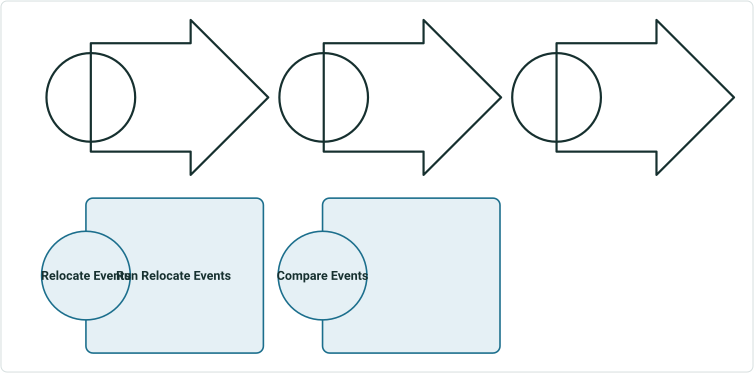

  - Existing Data
  - Existing Test cases
  - Export the existing event layers
  - Register as external events
  - Perform Route Edits
  - Run AEB
  - Compare internal and external events

## Slide 3 — Snap EB- reassign to existing line

## Slide 4 — Test case 1: Transfer to Existing Line – transfer 3 entire simple routes; transfer CP; keep original measures; keep

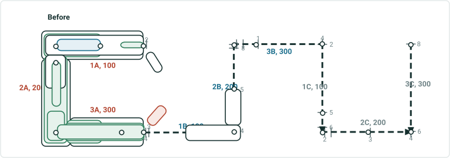

| Rname | Line Name | Line Order | From Date | To Date | From M | To M |
| --- | --- | --- | --- | --- | --- | --- |
| 1A | Red | 100 | 1/1/2000 | null | 2 | 4 |
| 2A | Red | 200 | 1/1/2000 | null | 0 | 2 |
| 3A | Red | 300 | 1/1/2000 | null | 0 | 4 |
| 1B | Blue | 100 | 1/1/2000 | null | 3 | 5 |
| 2B | Blue | 200 | 1/1/2000 | null | 4 | 8 |
| 3B | Blue | 300 | 1/1/2000 | null | 0 | 4 |
| 1C | Gray | 100 | 1/1/2000 | null | 2 | 6 |
| 2C | Gray | 200 | 1/1/2000 | null | 2 | 4 |
| 3C | Gray | 300 | 1/1/2000 | null | 6 | 8 |

| Event ID | From Date | To Date | From Route ID | To Route ID | From M | To M | Location Error |
| --- | --- | --- | --- | --- | --- | --- | --- |
| S_blue | 1/1/2000 | <Null> | 1B | 2B | 4 | 5 | No Error |

Showing this event for once to indicate events on other lines will not be affected

| Event ID | From Date | To Date | From Route ID | To Route ID | From M | To M | Location Error |
| --- | --- | --- | --- | --- | --- | --- | --- |
| S1 | 1/1/2000 | <Null> | 1A | 1A | 2 | 2.5 | No Error |
| S2 | 1/1/2000 | <Null> | 2A | 2A | 1 | 1.5 | No Error |
| S3 | 1/1/2000 | <Null> | 1A | 1A | 3 | 4 | No Error |
| S4 | 1/1/2000 | <Null> | 3A | 3A | 0 | 4 | No Error |
| S5 | 1/1/2000 | <Null> | 2A | 3A | 1.75 | 4 | No Error |
| S6 | 1/1/2000 | <Null> | 1A | 2A | 2 | 1.25 | No Error |
| S7 | 1/1/2000 | <Null> | 1A | 3A | 3 | 2 | No Error |
| S8 | 1/1/2000 | <Null> | 1A | 3A | 2 | 4 | No Error |

Effective date is 1/1/2020
Recal downstream unchecked

## Slide 5 — Test case 1: Transfer to Existing Line – transfer 3 entire simple routes; transfer CP; keep original measures; keep

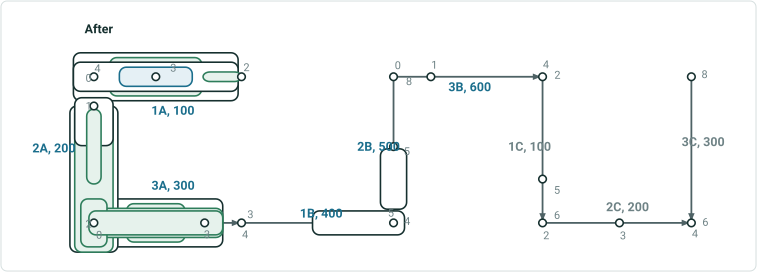

| Rname | Line Name | Line Order | From Date | To Date | From M | To M |
| --- | --- | --- | --- | --- | --- | --- |
| 1A | Red | 100 | 1/1/2000 | 1/1/2020 | 2 | 4 |
| 2A | Red | 200 | 1/1/2000 | 1/1/2020 | 0 | 2 |
| 3A | Red | 300 | 1/1/2000 | 1/1/2020 | 0 | 4 |
| 1B | Blue | 100 | 1/1/2000 | 1/1/2020 | 3 | 5 |
| 2B | Blue | 200 | 1/1/2000 | 1/1/2020 | 4 | 8 |
| 3B | Blue | 300 | 1/1/2000 | 1/1/2020 | 0 | 4 |
| 1A | Blue | 100 | 1/1/2020 | null | 2 | 4 |
| 2A | Blue | 200 | 1/1/2020 | null | 0 | 2 |
| 3A | Blue | 300 | 1/1/2020 | null | 0 | 4 |
| 1B | Blue | 400 | 1/1/2020 | null | 3 | 5 |
| 2B | Blue | 500 | 1/1/2020 | null | 4 | 8 |
| 3B | Blue | 600 | 1/1/2020 | null | 0 | 4 |
| 1C | Gray | 100 | 1/1/2000 | null | 2 | 6 |
| 2C | Gray | 200 | 1/1/2000 | null | 2 | 4 |
| 3C | Gray | 300 | 1/1/2000 | null | 6 | 8 |

| Event ID | From Date | To Date | From Route ID | To Route ID | From M | To M | Location Error |
| --- | --- | --- | --- | --- | --- | --- | --- |
| S_blue | 1/1/2000 | <Null> | 1B | 2B | 4 | 5 | No Error |

| Event ID | From Date | To Date | From Route ID | To Route ID | From M | To M | Location Error |
| --- | --- | --- | --- | --- | --- | --- | --- |
| S1 | 1/1/2000 | 1/1/2020 | 1A | 1A | 2 | 2.5 | No Error |
| S2 | 1/1/2000 | 1/1/2020 | 2A | 2A | 1 | 1.5 | No Error |
| S3 | 1/1/2000 | 1/1/2020 | 1A | 1A | 3 | 4 | No Error |
| S4 | 1/1/2000 | 1/1/2020 | 3A | 3A | 0 | 4 | No Error |
| S5 | 1/1/2000 | 1/1/2020 | 2A | 3A | 1.75 | 4 | No Error |
| S6 | 1/1/2000 | 1/1/2020 | 1A | 2A | 2 | 1.25 | No Error |
| S7 | 1/1/2000 | 1/1/2020 | 1A | 3A | 3 | 2 | No Error |
| S8 | 1/1/2000 | 1/1/2020 | 1A | 3A | 2 | 4 | No Error |
| S1 | 1/1/2020 | <Null> | 1A | 1A | 2 | 2.5 | No Error |
| S2 | 1/1/2020 | <Null> | 2A | 2A | 1 | 1.5 | No Error |
| S3 | 1/1/2020 | <Null> | 1A | 1A | 3 | 4 | No Error |
| S4 | 1/1/2020 | <Null> | 3A | 3A | 0 | 4 | No Error |
| S5 | 1/1/2020 | <Null> | 2A | 3A | 1.75 | 4 | No Error |
| S6 | 1/1/2020 | <Null> | 1A | 2A | 2 | 1.25 | No Error |
| S7 | 1/1/2020 | <Null> | 1A | 3A | 3 | 2 | No Error |
| S8 | 1/1/2020 | <Null> | 1A | 3A | 2 | 4 | No Error |

## Slide 6 — Test case 2: Transfer to Existing Line – transfer 3 entire simple routes; not transfer CP; change measures; change 1

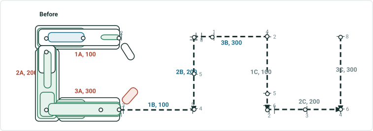

| Rname | Line Name | Line Order | From Date | To Date | From M | To M |
| --- | --- | --- | --- | --- | --- | --- |
| 1A | Red | 100 | 1/1/2000 | null | 2 | 4 |
| 2A | Red | 200 | 1/1/2000 | null | 0 | 2 |
| 3A | Red | 300 | 1/1/2000 | null | 0 | 4 |
| 1B | Blue | 100 | 1/1/2000 | null | 3 | 5 |
| 2B | Blue | 200 | 1/1/2000 | null | 4 | 8 |
| 3B | Blue | 300 | 1/1/2000 | null | 0 | 4 |
| 1C | Gray | 100 | 1/1/2000 | null | 2 | 6 |
| 2C | Gray | 200 | 1/1/2000 | null | 2 | 4 |
| 3C | Gray | 300 | 1/1/2000 | null | 6 | 8 |

| Event ID | From Date | To Date | From Route ID | To Route ID | From M | To M | Location Error |
| --- | --- | --- | --- | --- | --- | --- | --- |
| S1 | 1/1/2000 | <Null> | 1A | 1A | 2 | 2.5 | No Error |
| S2 | 1/1/2000 | <Null> | 2A | 2A | 1 | 1.5 | No Error |
| S3 | 1/1/2000 | <Null> | 1A | 1A | 3 | 4 | No Error |
| S4 | 1/1/2000 | <Null> | 3A | 3A | 0 | 4 | No Error |
| S5 | 1/1/2000 | <Null> | 2A | 3A | 1.75 | 4 | No Error |
| S6 | 1/1/2000 | <Null> | 1A | 2A | 2 | 1.25 | No Error |
| S7 | 1/1/2000 | <Null> | 1A | 3A | 3 | 2 | No Error |
| S8 | 1/1/2000 | <Null> | 1A | 3A | 2 | 4 | No Error |

Effective date is 1/1/2020
Recal downstream unchecked

## Slide 7 — Test case 2: Transfer to Existing Line – transfer 3 entire simple routes; not transfer CP; change measures; change 1

| Event ID | From Date | To Date | From Route ID | To Route ID | From M | To M | Location Error |
| --- | --- | --- | --- | --- | --- | --- | --- |
| S1 | 1/1/2000 | 1/1/2020 | 1A | 1A | 2 | 2.5 | No Error |
| S2 | 1/1/2000 | 1/1/2020 | 2A | 2A | 1 | 1.5 | No Error |
| S3 | 1/1/2000 | 1/1/2020 | 1A | 1A | 3 | 4 | No Error |
| S4 | 1/1/2000 | 1/1/2020 | 3A | 3A | 0 | 4 | No Error |
| S5 | 1/1/2000 | 1/1/2020 | 2A | 3A | 1.75 | 4 | No Error |
| S6 | 1/1/2000 | 1/1/2020 | 1A | 2A | 2 | 1.25 | No Error |
| S7 | 1/1/2000 | 1/1/2020 | 1A | 3A | 3 | 2 | No Error |
| S8 | 1/1/2000 | 1/1/2020 | 1A | 3A | 2 | 4 | No Error |
| S1 | 1/1/2020 | <Null> | 1A | 1A | 2 | 3 | No Error |
| S2 | 1/1/2020 | <Null> | 2A | 2A | 1.5 | 2.5 | No Error |
| S3 | 1/1/2020 | <Null> | 1A | 1A | 4 | 6 | No Error |
| S4 | 1/1/2020 | <Null> | 3A_new | 3A_new | 0 | 8 | No Error |
| S5 | 1/1/2020 | <Null> | 2A | 3A_new | 2.5 | 8 | No Error |
| S6 | 1/1/2020 | <Null> | 1A | 2A | 2 | 2 | No Error |
| S7 | 1/1/2020 | <Null> | 1A | 3A_new | 4 | 4 | No Error |
| S8 | 1/1/2020 | <Null> | 1A | 3A_new | 2 | 8 | No Error |

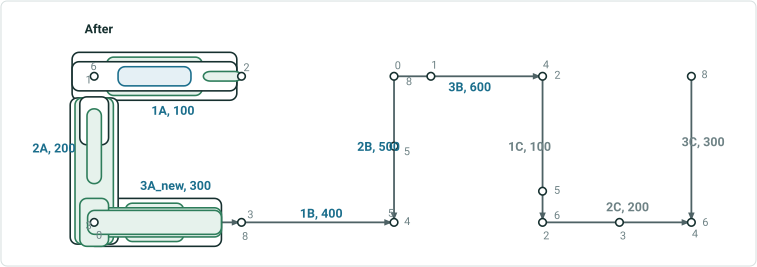

| Rname | Line Name | Line Order | From Date | To Date | From M | To M |
| --- | --- | --- | --- | --- | --- | --- |
| 1A | Red | 100 | 1/1/2000 | 1/1/2020 | 2 | 4 |
| 2A | Red | 200 | 1/1/2000 | 1/1/2020 | 0 | 2 |
| 3A | Red | 300 | 1/1/2000 | 1/1/2020 | 0 | 4 |
| 1B | Blue | 100 | 1/1/2000 | 1/1/2020 | 3 | 5 |
| 2B | Blue | 200 | 1/1/2000 | 1/1/2020 | 4 | 8 |
| 3B | Blue | 300 | 1/1/2000 | 1/1/2020 | 0 | 4 |
| 1A | Blue | 100 | 1/1/2020 | null | 2 | 6 |
| 2A | Blue | 200 | 1/1/2020 | null | 1 | 3 |
| 3A_new | Blue | 300 | 1/1/2020 | null | 0 | 8 |
| 1B | Blue | 400 | 1/1/2020 | null | 3 | 5 |
| 2B | Blue | 500 | 1/1/2020 | null | 4 | 8 |
| 3B | Blue | 600 | 1/1/2020 | null | 0 | 4 |
| 1C | Gray | 100 | 1/1/2000 | null | 2 | 6 |
| 2C | Gray | 200 | 1/1/2000 | null | 2 | 4 |
| 3C | Gray | 300 | 1/1/2000 | null | 6 | 8 |

## Slide 8 — Test case 3: Transfer to Existing Line – transfer 1 entire simple route; transfer CP; keep original measures; keep

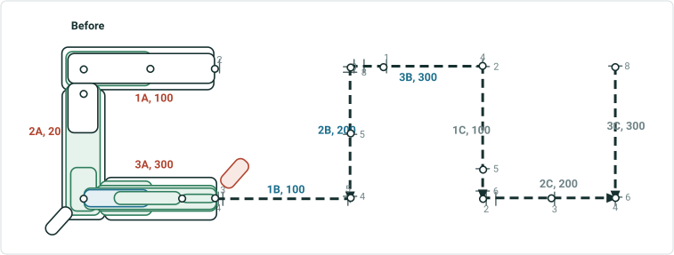

| Rname | Line Name | Line Order | From Date | To Date | From M | To M |
| --- | --- | --- | --- | --- | --- | --- |
| 1A | Red | 100 | 1/1/2000 | null | 2 | 4 |
| 2A | Red | 200 | 1/1/2000 | null | 0 | 2 |
| 3A | Red | 300 | 1/1/2000 | null | 0 | 4 |
| 1B | Blue | 100 | 1/1/2000 | null | 3 | 5 |
| 2B | Blue | 200 | 1/1/2000 | null | 4 | 8 |
| 3B | Blue | 300 | 1/1/2000 | null | 0 | 4 |
| 1C | Gray | 100 | 1/1/2000 | null | 2 | 6 |
| 2C | Gray | 200 | 1/1/2000 | null | 2 | 4 |
| 3C | Gray | 300 | 1/1/2000 | null | 6 | 8 |

| Event ID | From Date | To Date | From Route ID | To Route ID | From M | To M | Location Error |
| --- | --- | --- | --- | --- | --- | --- | --- |
| S1 | 1/1/2000 | <Null> | 3A | 3A | 3 | 4 | No Error |
| S2 | 1/1/2000 | <Null> | 3A | 3A | 1 | 3 | No Error |
| S3 | 1/1/2000 | <Null> | 3A | 3A | 0 | 2 | No Error |
| S4 | 1/1/2000 | <Null> | 3A | 3A | 0 | 4 | No Error |
| S5 | 1/1/2000 | <Null> | 2A | 3A | 1.75 | 4 | No Error |
| S6 | 1/1/2000 | <Null> | 1A | 2A | 2 | 1.25 | No Error |
| S7 | 1/1/2000 | <Null> | 1A | 3A | 3 | 2 | No Error |
| S8 | 1/1/2000 | <Null> | 1A | 3A | 2 | 4 | No Error |

Effective date is 1/1/2020
Recal downstream unchecked

## Slide 9 — Test case 3: Transfer to Existing Line – transfer 1 entire simple route; transfer CP; keep original measures; keep

| Event ID | From Date | To Date | From Route ID | To Route ID | From M | To M | Location Error |
| --- | --- | --- | --- | --- | --- | --- | --- |
| S1 | 1/1/2000 | 1/1/2020 | 3A | 3A | 3 | 4 | No Error |
| S1 | 1/1/2020 | null | 3A | 3A | 3 | 4 | No Error |
| S2 | 1/1/2000 | 1/1/2020 | 3A | 3A | 1 | 3 | No Error |
| S2 | 1/1/2020 | null | 3A | 3A | 1 | 3 | No Error |
| S3 | 1/1/2000 | 1/1/2020 | 3A | 3A | 0 | 2 | No Error |
| S3 | 1/1/2020 | null | 3A | 3A | 0 | 2 | No Error |
| S4 | 1/1/2000 | 1/1/2020 | 3A | 3A | 0 | 4 | No Error |
| S4 | 1/1/2020 | null | 3A | 3A | 0 | 4 | No Error |
| S5 | 1/1/2000 | 1/1/2020 | 2A | 3A | 1.75 | 4 | No Error |
| S5 | 1/1/2020 | null | 2A | 2A | 1.75 | 2 | No Error |
| S5 | 1/1/2020 | null | 3A | 3A | 0 | 4 | No Error |
| S6 | 1/1/2000 | <Null> | 1A | 2A | 2 | 1.25 | No Error |
| S7 | 1/1/2000 | 1/1/2020 | 1A | 3A | 3 | 2 | No Error |
| S7 | 1/1/2020 | null | 1A | 2A | 3 | 2 | No Error |
| S7 | 1/1/2020 | null | 3A | 3A | 0 | 2 | No Error |
| S8 | 1/1/2000 | 1/1/2020 | 1A | 3A | 2 | 4 | No Error |
| S8 | 1/1/2020 | null | 1A | 2A | 2 | 2 | No Error |
| S8 | 1/1/2020 | null | 3A | 3A | 0 | 4 | No Error |

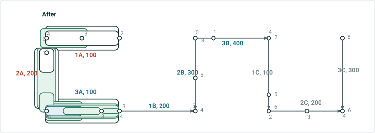

| Rname | Line Name | Line Order | From Date | To Date | From M | To M |
| --- | --- | --- | --- | --- | --- | --- |
| 1A | Red | 100 | 1/1/2000 | null | 2 | 4 |
| 2A | Red | 200 | 1/1/2000 | null | 0 | 2 |
| 3A | Red | 300 | 1/1/2000 | 1/1/2020 | 0 | 4 |
| 1B | Blue | 100 | 1/1/2000 | 1/1/2020 | 3 | 5 |
| 2B | Blue | 200 | 1/1/2000 | 1/1/2020 | 4 | 8 |
| 3B | Blue | 300 | 1/1/2000 | 1/1/2020 | 0 | 4 |
| 3A | Blue | 100 | 1/1/2020 | null | 0 | 4 |
| 1B | Blue | 200 | 1/1/2020 | null | 3 | 5 |
| 2B | Blue | 300 | 1/1/2020 | null | 4 | 8 |
| 3B | Blue | 400 | 1/1/2020 | null | 0 | 4 |
| 1C | Gray | 100 | 1/1/2000 | null | 2 | 6 |
| 2C | Gray | 200 | 1/1/2000 | null | 2 | 4 |
| 3C | Gray | 300 | 1/1/2000 | null | 6 | 8 |

## Slide 10 — Test case 5: Transfer to Existing Line – transfer 0.5+1+0.5 simple routes; transfer CP; keep original measures; partial

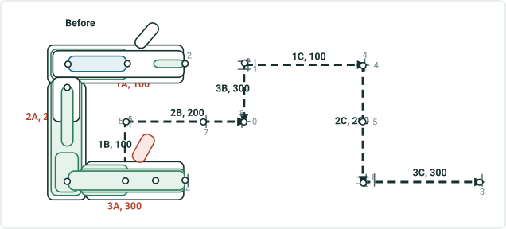

| Rname | Line Name | Line Order | From Date | To Date | From M | To M |
| --- | --- | --- | --- | --- | --- | --- |
| 1A | Red | 100 | 1/1/2000 | null | 2 | 4 |
| 2A | Red | 200 | 1/1/2000 | null | 0 | 2 |
| 3A | Red | 300 | 1/1/2000 | null | 0 | 4 |
| 1B | Blue | 100 | 1/1/2000 | null | 3 | 5 |
| 2B | Blue | 200 | 1/1/2000 | null | 4 | 8 |
| 3B | Blue | 300 | 1/1/2000 | null | 0 | 4 |
| 1C | Gray | 100 | 1/1/2000 | null | 2 | 6 |
| 2C | Gray | 200 | 1/1/2000 | null | 2 | 4 |
| 3C | Gray | 300 | 1/1/2000 | null | 6 | 8 |

| Event ID | From Date | To Date | From Route ID | To Route ID | From M | To M | Location Error |
| --- | --- | --- | --- | --- | --- | --- | --- |
| S1 | 1/1/2000 | <Null> | 1A | 1A | 2 | 2.5 | No Error |
| S2 | 1/1/2000 | <Null> | 2A | 2A | 1 | 1.5 | No Error |
| S3 | 1/1/2000 | <Null> | 1A | 1A | 3 | 4 | No Error |
| S4 | 1/1/2000 | <Null> | 3A | 3A | 0 | 4 | No Error |
| S5 | 1/1/2000 | <Null> | 2A | 3A | 1.75 | 4 | No Error |
| S6 | 1/1/2000 | <Null> | 1A | 2A | 2 | 1.25 | No Error |
| S7 | 1/1/2000 | <Null> | 1A | 3A | 3 | 2 | No Error |
| S8 | 1/1/2000 | <Null> | 1A | 3A | 2 | 4 | No Error |

Effective date is 1/1/2020
This case has 2 variations. Recal downstream unchecked in result1, and checked in result 2

## Slide 11 — Test case 5: Transfer to Existing Line – transfer 0.5+1+0.5 simple routes; transfer CP; keep original measures; partial

| Event ID | From Date | To Date | From Route ID | To Route ID | From M | To M | Location Error |
| --- | --- | --- | --- | --- | --- | --- | --- |
| S1 | 1/1/2000 | <Null> | 1A | 1A | 2 | 2.5 | No Error |
| S2 | 1/1/2000 | 1/1/2020 | 2A | 2A | 1 | 1.5 | No Error |
| S2 | 1/1/2020 | null | 2A | 2A | 1 | 1.5 | No Error |
| S3 | 1/1/2000 | 1/1/2020 | 1A | 1A | 3 | 4 | No Error |
| S3 | 1/1/2020 | null | 1A_reassign | 1A_reassign | 3 | 4 | No Error |
| S4 | 1/1/2000 | 1/1/2020 | 3A | 3A | 0 | 4 | No Error |
| S4 | 1/1/2020 | null | 3A_reassign | 3A_reassign | 0 | 2 | No Error |
| S4 | 1/1/2020 | null | 3A | 3A | 2 | 4 | No Error |
| S5 | 1/1/2000 | 1/1/2020 | 2A | 3A | 1.75 | 4 | No Error |
| S5 | 1/1/2020 | null | 2A | 3A_reassign | 1.75 | 2 | No Error |
| S5 | 1/1/2020 | null | 3A | 3A | 2 | 4 | No Error |
| S6 | 1/1/2000 | 1/1/2020 | 1A | 2A | 2 | 1.25 | No Error |
| S6 | 1/1/2020 | null | 1A | 1A | 2 | 3 | No Error |
| S6 | 1/1/2020 | null | 1A_reassign | 2A | 3 | 1.25 | No Error |
| S7 | 1/1/2000 | 1/1/2020 | 1A | 3A | 3 | 2 | No Error |
| S7 | 1/1/2020 | null | 1A_reassign | 3A_reassign | 3 | 2 | No Error |
| S8 | 1/1/2000 | 1/1/2020 | 1A | 3A | 2 | 4 | No Error |
| S8 | 1/1/2020 | null | 1A | 3A | 2 | 4 | No Error |
| S8 | 1/1/2020 | null | 1A_reassign | 3A_reassign | 3 | 2 | No Error |

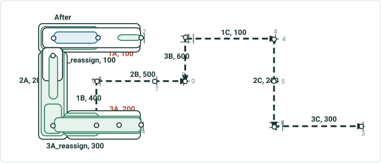

| Rname | Line Name | Line Order | From Date | To Date | From M | To M |
| --- | --- | --- | --- | --- | --- | --- |
| 1A | Red | 100 | 1/1/2000 | 1/1/2020 | 2 | 4 |
| 2A | Red | 200 | 1/1/2000 | 1/1/2020 | 0 | 2 |
| 3A | Red | 300 | 1/1/2000 | 1/1/2020 | 0 | 4 |
| 1A | Red | 100 | 1/1/2020 | null | 2 | 3 |
| 3A | Red | 200 | 1/1/2020 | null | 2 | 4 |
| 1B | Blue | 100 | 1/1/2000 | 1/1/2020 | 3 | 5 |
| 2B | Blue | 200 | 1/1/2000 | 1/1/2020 | 4 | 8 |
| 3B | Blue | 300 | 1/1/2000 | 1/1/2020 | 0 | 4 |
| 1A_reassign | Blue | 100 | 1/1/2020 | null | 3 | 4 |
| 2A | Blue | 200 | 1/1/2020 | null | 0 | 2 |
| 3A_reassign | Blue | 300 | 1/1/2020 | null | 0 | 2 |
| 1B | Blue | 400 | 1/1/2020 | null | 3 | 5 |
| 2B | Blue | 500 | 1/1/2020 | null | 4 | 8 |
| 3B | Blue | 600 | 1/1/2020 | null | 0 | 4 |
| 1C | Gray | 100 | 1/1/2000 | null | 2 | 6 |
| 2C | Gray | 200 | 1/1/2000 | null | 2 | 4 |
| 3C | Gray | 300 | 1/1/2000 | null | 6 | 8 |

## Slide 12 — Test case 5: Transfer to Existing Line – transfer 0.5+1+0.5 simple routes; transfer CP; keep original measures; partial

| Event ID | From Date | To Date | From Route ID | To Route ID | From M | To M | Location Error |
| --- | --- | --- | --- | --- | --- | --- | --- |
| S1 | 1/1/2000 | <Null> | 1A | 1A | 2 | 2.5 | No Error |
| S2 | 1/1/2000 | 1/1/2020 | 2A | 2A | 1 | 1.5 | No Error |
| S2 | 1/1/2020 | null | 2A | 2A | 1 | 1.5 | No Error |
| S3 | 1/1/2000 | 1/1/2020 | 1A | 1A | 3 | 4 | No Error |
| S3 | 1/1/2020 | null | 1A_reassign | 1A_reassign | 3 | 4 | No Error |
| S4 | 1/1/2000 | 1/1/2020 | 3A | 3A | 0 | 4 | No Error |
| S4 | 1/1/2020 | null | 3A_reassign | 3A_reassign | 0 | 2 | No Error |
| S4 | 1/1/2020 | null | 3A | 3A | 0 | 2 | No Error |
| S5 | 1/1/2000 | 1/1/2020 | 2A | 3A | 1.75 | 4 | No Error |
| S5 | 1/1/2020 | null | 2A | 3A_reassign | 1.75 | 2 | No Error |
| S5 | 1/1/2020 | null | 3A | 3A | 0 | 2 | No Error |
| S6 | 1/1/2000 | 1/1/2020 | 1A | 2A | 2 | 1.25 | No Error |
| S6 | 1/1/2020 | null | 1A | 1A | 2 | 3 | No Error |
| S6 | 1/1/2020 | null | 1A_reassign | 2A | 3 | 1.25 | No Error |
| S7 | 1/1/2000 | 1/1/2020 | 1A | 3A | 3 | 2 | No Error |
| S7 | 1/1/2020 | null | 1A_reassign | 3A_reassign | 3 | 2 | No Error |
| S8 | 1/1/2000 | 1/1/2020 | 1A | 3A | 2 | 4 | No Error |
| S8 | 1/1/2020 | null | 1A | 3A | 2 | 2 | No Error |
| S8 | 1/1/2020 | null | 1A_reassign | 3A_reassign | 3 | 2 | No Error |


| Rname | Line Name | Line Order | From Date | To Date | From M | To M |
| --- | --- | --- | --- | --- | --- | --- |
| 1A | Red | 100 | 1/1/2000 | 1/1/2020 | 2 | 4 |
| 2A | Red | 200 | 1/1/2000 | 1/1/2020 | 0 | 2 |
| 3A | Red | 300 | 1/1/2000 | 1/1/2020 | 0 | 4 |
| 1A | Red | 100 | 1/1/2020 | null | 2 | 3 |
| 3A | Red | 200 | 1/1/2020 | null | 2 | 4 |
| 1B | Blue | 100 | 1/1/2000 | 1/1/2020 | 3 | 5 |
| 2B | Blue | 200 | 1/1/2000 | 1/1/2020 | 4 | 8 |
| 3B | Blue | 300 | 1/1/2000 | 1/1/2020 | 0 | 4 |
| 1A_reassign | Blue | 100 | 1/1/2020 | null | 3 | 4 |
| 2A | Blue | 200 | 1/1/2020 | null | 0 | 2 |
| 3A_reassign | Blue | 300 | 1/1/2020 | null | 0 | 2 |
| 1B | Blue | 400 | 1/1/2020 | null | 3 | 5 |
| 2B | Blue | 500 | 1/1/2020 | null | 4 | 8 |
| 3B | Blue | 600 | 1/1/2020 | null | 0 | 4 |
| 1C | Gray | 100 | 1/1/2000 | null | 2 | 6 |
| 2C | Gray | 200 | 1/1/2000 | null | 2 | 4 |
| 3C | Gray | 300 | 1/1/2000 | null | 6 | 8 |

## Slide 13 — Test case 8: Transfer to Existing Line – transfer 1+0.5 simple routes; routes on source line have concurrent routes

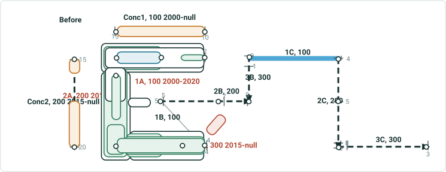

| Rname | Line Name | Line Order | From Date | To Date | From M | To M |
| --- | --- | --- | --- | --- | --- | --- |
| 1A | Red | 100 | 1/1/2000 | 1/1/2020 | 2 | 4 |
| 2A | Red | 200 | 1/1/2010 | 1/1/2020 | 0 | 2 |
| 3A | Red | 300 | 1/1/2015 | 1/1/2020 | 0 | 4 |
| 2A | Red | 100 | 1/1/2020 | null | 0 | 2 |
| 3A | Red | 200 | 1/1/2020 | null | 0 | 4 |
| Conc1 | Orange | 100 | 1/1/2000 | null | 10 | 15 |
| Conc2 | Orange | 200 | 1/1/2015 | null | 15 | 20 |
| 1B | Blue | 100 | 1/1/2000 | null | 3 | 5 |
| 2B | Blue | 200 | 1/1/2000 | null | 4 | 8 |
| 3B | Blue | 300 | 1/1/2000 | null | 0 | 4 |
| 1C | Gray | 100 | 1/1/2000 | null | 2 | 6 |
| 2C | Gray | 200 | 1/1/2000 | null | 2 | 4 |
| 3C | Gray | 300 | 1/1/2000 | null | 6 | 8 |

| Event ID | From Date | To Date | From Route ID | To Route ID | From M | To M | Location Error |
| --- | --- | --- | --- | --- | --- | --- | --- |
| S1 | 1/1/2000 | <Null> | 1A | 1A | 2 | 2.5 | No Error |
| S2 | 1/1/2010 | <Null> | 2A | 2A | 1 | 1.5 | No Error |
| S3 | 1/1/2000 | <Null> | 1A | 1A | 3 | 4 | No Error |
| S4 | 1/1/2015 | <Null> | 3A | 3A | 0 | 4 | No Error |
| S5 | 1/1/2010 | 1/1/2015 | 2A | 2A | 1.75 | 2 | No Error |
| S5 | 1/1/2015 | <Null> | 2A | 3A | 1.75 | 4 | No Error |
| S6 | 1/1/2000 | 1/1/2010 | 1A | 1A | 2 | 4 | No Error |
| S6 | 1/1/2010 | <Null> | 1A | 2A | 2 | 1.25 | No Error |
| S7 | 1/1/2000 | 1/1/2010 | 1A | 1A | 3 | 4 | No Error |
| S7 | 1/1/2010 | 1/1/2015 | 1A | 2A | 3 | 2 | No Error |
| S7 | 1/1/2015 | <Null> | 1A | 3A | 3 | 2 | No Error |
| S8 | 1/1/2000 | 1/1/2010 | 1A | 1A | 2 | 4 | No Error |
| S8 | 1/1/2010 | 1/1/2015 | 1A | 2A | 2 | 2 | No Error |
| S8 | 1/1/2015 | <Null> | 1A | 3A | 2 | 4 | No Error |

| Event ID | From Date | To Date | From Route ID | To Route ID | From M | To M | Location Error |
| --- | --- | --- | --- | --- | --- | --- | --- |
| Sconc1 | 1/1/2000 | 1/1/2015 | Conc1 | Conc1 | 10 | 15 | No Error |
| Sconc1 | 1/1/2015 | <Null> | Conc1 | Conc2 | 10 | 16 | No Error |
| Sconc2 | 1/1/2015 | <Null> | Conc2 | Conc2 | 17.5 | 20 | No Error |

In 2000, create 1A
In 2010, create 2A
In 2015, create 3A and conc1
In 2020, retire1A
In 2025, transfer part 2A & 3A, recal downstream unchecked

## Slide 14 — Test case 8: Transfer to Existing Line – transfer 1+0.5 simple routes; routes on source line have concurrent routes

2A_reassign, 100
2025-null

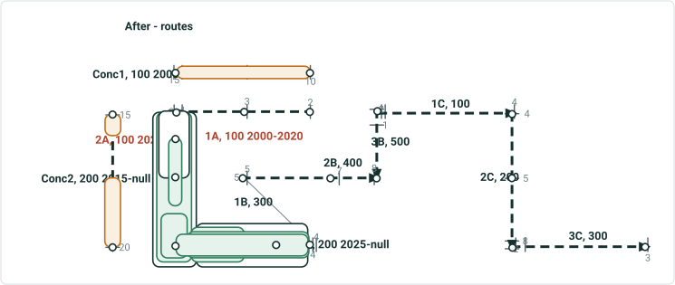

| Rname | Line Name | Line Order | From Date | To Date | From M | To M |
| --- | --- | --- | --- | --- | --- | --- |
| 1A | Red | 100 | 1/1/2000 | 1/1/2020 | 2 | 4 |
| 2A | Red | 200 | 1/1/2010 | 1/1/2015 | 0 | 2 |
| 3A | Red | 300 | 1/1/2015 | 1/1/2020 | 0 | 4 |
| 2A | Red | 100 | 1/1/2020 | 1/1/2025 | 0 | 2 |
| 3A | Red | 200 | 1/1/2020 | 1/1/2025 | 0 | 4 |
| 2A | Red | 100 | 1/1/2025 | null | 0 | 1.25 |
| 1B | Blue | 100 | 1/1/2000 | 1/1/2025 | 3 | 5 |
| 2B | Blue | 200 | 1/1/2000 | 1/1/2025 | 4 | 8 |
| 3B | Blue | 300 | 1/1/2000 | 1/1/2025 | 0 | 4 |
| Conc1 | Orange | 100 | 1/1/2000 | null | 10 | 15 |
| Conc2 | Orange | 200 | 1/1/2015 | null | 15 | 20 |
| 2A_reassign | Blue | 100 | 1/1/2025 | null | 2 | 3 |
| 3A | Blue | 200 | 1/1/2025 | null | 0 | 4 |
| 1B | Blue | 300 | 1/1/2025 | null | 3 | 5 |
| 2B | Blue | 400 | 1/1/2025 | null | 4 | 8 |
| 3B | Blue | 500 | 1/1/2025 | null | 0 | 4 |
| 1C | Gray | 100 | 1/1/2000 | null | 2 | 6 |
| 2C | Gray | 200 | 1/1/2000 | null | 2 | 4 |
| 3C | Gray | 300 | 1/1/2000 | null | 6 | 8 |

In 2000, create 1A
In 2010, create 2A
In 2015, create 3A and conc1
In 2020, retire1A
In 2025, transfer part 2A & 3A, recal downstream unchecked

## Slide 15 — Test case 8: Transfer to Existing Line – transfer 1+0.5 simple routes; routes on source line have concurrent routes

2A_reassign, 100
2025-null

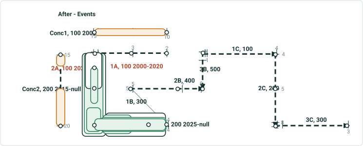

| Event ID | From Date | To Date | From Route ID | To Route ID | From M | To M | Location Error |
| --- | --- | --- | --- | --- | --- | --- | --- |
| S1 | 1/1/2000 | 1/1/2020 | 1A | 1A | 2 | 2.5 | No Error |
| S2 | 1/1/2010 | 1/1/2025 | 2A | 2A | 1 | 1.5 | No Error |
| S2 | 1/1/2025 | <Null> | 2A | 2A | 1 | 1.25 | No Error |
| S2 | 1/1/2025 | <Null> | 2A_reassign | 2A_reassign | 2 | 2.5 | No Error |
| S3 | 1/1/2000 | 1/1/2020 | 1A | 1A | 3 | 4 | No Error |
| S4 | 1/1/2015 | 1/1/2025 | 3A | 3A | 0 | 4 | No Error |
| S4 | 1/1/2025 | <Null> | 3A | 3A | 0 | 4 | No Error |
| S5 | 1/1/2010 | 1/1/2015 | 2A | 2A | 1.75 | 2 | No Error |
| S5 | 1/1/2015 | 1/1/2025 | 2A | 3A | 1.75 | 4 | No Error |
| S5 | 1/1/2025 | <Null> | 2A_reassign | 3A | 2.5 | 4 | No Error |
| S6 | 1/1/2000 | 1/1/2010 | 1A | 1A | 2 | 4 | No Error |
| S6 | 1/1/2010 | 1/1/2020 | 1A | 2A | 2 | 1.25 | No Error |
| S6 | 1/1/2020 | <Null> | 2A | 2A | 0 | 1.25 | No Error |
| S7 | 1/1/2000 | 1/1/2010 | 1A | 1A | 3 | 4 | No Error |
| S7 | 1/1/2010 | 1/1/2015 | 1A | 2A | 3 | 2 | No Error |
| S7 | 1/1/2015 | 1/1/2020 | 1A | 3A | 3 | 2 | No Error |
| S7 | 1/1/2020 | 1/1/2025 | 2A | 3A | 0 | 2 | No Error |
| S7 | 1/1/2025 | <Null> | 2A | 2A | 0 | 1.25 | No Error |
| S7 | 1/1/2025 | <Null> | 2A_reassign | 3A | 2 | 2 | No Error |
| S8 | 1/1/2000 | 1/1/2010 | 1A | 1A | 2 | 4 | No Error |
| S8 | 1/1/2010 | 1/1/2015 | 1A | 2A | 2 | 2 | No Error |
| S8 | 1/1/2015 | 1/1/2020 | 1A | 3A | 2 | 4 | No Error |
| S8 | 1/1/2020 | 1/1/2025 | 2A | 3A | 0 | 4 | No Error |
| S8 | 1/1/2025 | <Null> | 2A | 2A | 0 | 1.25 | No Error |
| S8 | 1/1/2025 | <Null> | 2A_reassign | 3A | 2 | 4 | No Error |

| Event ID | From Date | To Date | From Route ID | To Route ID | From M | To M | Location Error |
| --- | --- | --- | --- | --- | --- | --- | --- |
| Sconc1 | 1/1/2000 | 1/1/2015 | Conc1 | Conc1 | 10 | 15 | No Error |
| Sconc1 | 1/1/2015 | <Null> | Conc1 | Conc2 | 10 | 16 | No Error |
| Sconc2 | 1/1/2015 | <Null> | Conc2 | Conc2 | 17.5 | 20 | No Error |

In 2000, create 1A
In 2010, create 2A
In 2015, create 3A and conc1
In 2020, retire1A
In 2025, transfer part 2A & 3A, recal downstream unchecked

## Slide 16 — Test case 8-b: Transfer to Existing Line – transfer 3 simple routes; routes on source line have multiple time slices;

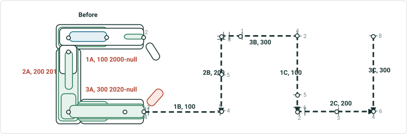

| Rname | Line Name | Line Order | From Date | To Date | From M | To M |
| --- | --- | --- | --- | --- | --- | --- |
| 1A | Red | 100 | 1/1/2000 | null | 2 | 4 |
| 2A | Red | 200 | 1/1/2010 | null | 0 | 2 |
| 3A | Red | 300 | 1/1/2015 | null | 0 | 4 |
| 1B | Blue | 100 | 1/1/2000 | null | 3 | 5 |
| 2B | Blue | 200 | 1/1/2000 | null | 4 | 8 |
| 3B | Blue | 300 | 1/1/2000 | null | 0 | 4 |
| 1C | Gray | 100 | 1/1/2000 | null | 2 | 6 |
| 2C | Gray | 200 | 1/1/2000 | null | 2 | 4 |
| 3C | Gray | 300 | 1/1/2000 | null | 6 | 8 |

| Event ID | From Date | To Date | From Route ID | To Route ID | From M | To M | Location Error |
| --- | --- | --- | --- | --- | --- | --- | --- |
| S1 | 1/1/2000 | <Null> | 1A | 1A | 2 | 2.5 | No Error |
| S2 | 1/1/2010 | <Null> | 2A | 2A | 1 | 1.5 | No Error |
| S3 | 1/1/2000 | <Null> | 1A | 1A | 3 | 4 | No Error |
| S4 | 1/1/2020 | <Null> | 3A | 3A | 0 | 4 | No Error |
| S5 | 1/1/2020 | <Null> | 2A | 3A | 1.75 | 4 | No Error |
| S6 | 1/1/2010 | <Null> | 1A | 2A | 2 | 1.25 | No Error |
| S7 | 1/1/2020 | <Null> | 1A | 3A | 3 | 2 | No Error |
| S8 | 1/1/2020 | <Null> | 1A | 3A | 2 | 4 | No Error |

Effective date is 1/1/2030
Recal downstream unchecked

## Slide 17 — Test case 8-b: Transfer to Existing Line – transfer 3 simple routes; routes on source line have multiple time slices;

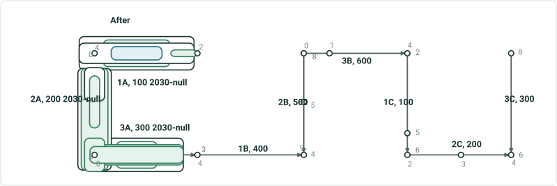

| Rname | Line Name | Line Order | From Date | To Date | From M | To M |
| --- | --- | --- | --- | --- | --- | --- |
| 1A | Red | 100 | 1/1/2000 | 1/1/2030 | 2 | 4 |
| 2A | Red | 200 | 1/1/2010 | 1/1/2030 | 0 | 2 |
| 3A | Red | 300 | 1/1/2015 | 1/1/2030 | 0 | 4 |
| 1B | Blue | 100 | 1/1/2000 | 1/1/2030 | 3 | 5 |
| 2B | Blue | 200 | 1/1/2000 | 1/1/2030 | 4 | 8 |
| 3B | Blue | 300 | 1/1/2000 | 1/1/2030 | 0 | 4 |
| 1B | Blue | 100 | 1/1/2030 | null | 2 | 4 |
| 2B | Blue | 200 | 1/1/2030 | null | 0 | 2 |
| 3B | Blue | 300 | 1/1/2030 | null | 0 | 4 |
| 1B | Blue | 400 | 1/1/2030 | null | 3 | 5 |
| 2B | Blue | 500 | 1/1/2030 | null | 4 | 8 |
| 3B | Blue | 600 | 1/1/2030 | null | 0 | 4 |
| 1C | Gray | 100 | 1/1/2000 | null | 2 | 6 |
| 2C | Gray | 200 | 1/1/2000 | null | 2 | 4 |
| 3C | Gray | 300 | 1/1/2000 | null | 6 | 8 |

| Event ID | From Date | To Date | From Route ID | To Route ID | From M | To M | Location Error |
| --- | --- | --- | --- | --- | --- | --- | --- |
| S1 | 1/1/2000 | 1/1/2030 | 1A | 1A | 2 | 2.5 | No Error |
| S2 | 1/1/2010 | 1/1/2030 | 2A | 2A | 1 | 1.5 | No Error |
| S3 | 1/1/2000 | 1/1/2030 | 1A | 1A | 3 | 4 | No Error |
| S4 | 1/1/2020 | 1/1/2030 | 3A | 3A | 0 | 4 | No Error |
| S5 | 1/1/2020 | 1/1/2030 | 2A | 3A | 1.75 | 4 | No Error |
| S6 | 1/1/2010 | 1/1/2030 | 1A | 2A | 2 | 1.25 | No Error |
| S7 | 1/1/2020 | 1/1/2030 | 1A | 3A | 3 | 2 | No Error |
| S8 | 1/1/2020 | 1/1/2030 | 1A | 3A | 2 | 4 | No Error |

| S1 | 1/1/2030 | <Null> | 1A | 1A | 2 | 2.5 | No Error |
| --- | --- | --- | --- | --- | --- | --- | --- |
| S2 | 1/1/2030 | <Null> | 2A | 2A | 0.5 | 1.25 | No Error |
| S3 | 1/1/2030 | <Null> | 1A | 1A | 3 | 4 | No Error |
| S4 | 1/1/2030 | <Null> | 3A | 3A | 0 | 4 | No Error |
| S5 | 1/1/2030 | <Null> | 2A | 3A | 1.5 | 4 | No Error |
| S6 | 1/1/2030 | <Null> | 1A | 2A | 2 | 1 | No Error |
| S7 | 1/1/2030 | <Null> | 1A | 3A | 3 | 2 | No Error |
| S8 | 1/1/2030 | <Null> | 1A | 3A | 2 | 4 | No Error |

## Slide 18 — Test case 9: Transfer to Existing Line – transfer 3 entire simple routes; transfer CP; keep original measures; keep

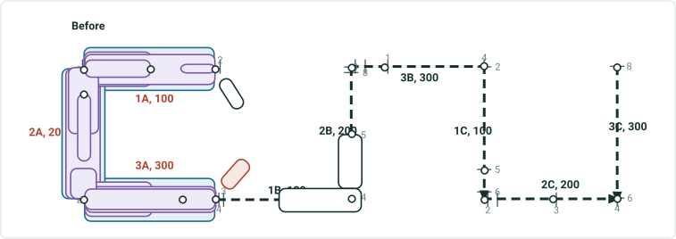

| Rname | Line Name | Line Order | From Date | To Date | From M | To M |
| --- | --- | --- | --- | --- | --- | --- |
| 1A | Red | 100 | 1/1/2000 | null | 2 | 4 |
| 2A | Red | 200 | 1/1/2000 | null | 0 | 2 |
| 3A | Red | 300 | 1/1/2000 | null | 0 | 4 |
| 1B | Blue | 100 | 1/1/2000 | null | 3 | 5 |
| 2B | Blue | 200 | 1/1/2000 | null | 4 | 8 |
| 3B | Blue | 300 | 1/1/2000 | null | 0 | 4 |
| 1C | Gray | 100 | 1/1/2000 | null | 2 | 6 |
| 2C | Gray | 200 | 1/1/2000 | null | 2 | 4 |
| 3C | Gray | 300 | 1/1/2000 | null | 6 | 8 |

| Event ID | From Date | To Date | From Route ID | To Route ID | From M | To M | Location Error |
| --- | --- | --- | --- | --- | --- | --- | --- |
| S_blue | 1/1/2000 | <Null> | 1B | 2B | 4 | 5 | No Error |

Showing this event for once to indicate events on other lines will not be affected

| Event ID | From Date | To Date | Route ID | From M | To M | Location Error |
| --- | --- | --- | --- | --- | --- | --- |
| S1 | 1/1/2000 | <Null> | 1A | 2 | 2.5 | No Error |
| S2 | 1/1/2000 | <Null> | 2A | 1 | 1.5 | No Error |
| S3 | 1/1/2000 | <Null> | 1A | 3 | 4 | No Error |
| S4 | 1/1/2000 | <Null> | 3A | 0 | 4 | No Error |
| S5a | 1/1/2000 | <Null> | 2A | 1.75 | 2 | No Error |
| S5b | 1/1/2000 | <Null> | 3A | 0 | 4 | No Error |
| S6a | 1/1/2000 | <Null> | 1A | 2 | 4 | No Error |
| S6b | 1/1/2000 | <Null> | 2A | 0 | 1.25 | No Error |
| S7a | 1/1/2000 | <Null> | 1A | 3 | 4 | No Error |
| S7b | 1/1/2000 | <Null> | 2A | 0 | 2 | No Error |
| S7c | 1/1/2000 | <Null> | 3A | 0 | 2 | No Error |
| S8a | 1/1/2000 | <Null> | 1A | 2 | 4 | No Error |
| S8b | 1/1/2000 | <Null> | 2A | 0 | 2 | No Error |
| S8c | 1/1/2000 | <Null> | 3A | 0 | 4 | No Error |

Effective date is 1/1/2020
Recal downstream unchecked

## Slide 19 — Test case 9: Transfer to Existing Line – transfer 3 entire simple routes; transfer CP; keep original measures; keep

| Event ID | From Date | To Date | From Route ID | To Route ID | From M | To M | Location Error |
| --- | --- | --- | --- | --- | --- | --- | --- |
| S_blue | 1/1/2000 | <Null> | 1B | 2B | 4 | 5 | No Error |

| Event ID | From Date | To Date | Route ID | From M | To M | Location Error |
| --- | --- | --- | --- | --- | --- | --- |
| S1 | 1/1/2000 | 1/1/2020 | 1A | 2 | 2.5 | No Error |
| S2 | 1/1/2000 | 1/1/2020 | 2A | 1 | 1.5 | No Error |
| S3 | 1/1/2000 | 1/1/2020 | 1A | 3 | 4 | No Error |
| S4 | 1/1/2000 | 1/1/2020 | 3A | 0 | 4 | No Error |
| S5a | 1/1/2000 | 1/1/2020 | 2A | 1.75 | 2 | No Error |
| S5b | 1/1/2000 | 1/1/2020 | 3A | 0 | 4 | No Error |
| S6a | 1/1/2000 | 1/1/2020 | 1A | 2 | 4 | No Error |
| S6b | 1/1/2000 | 1/1/2020 | 2A | 0 | 1.25 | No Error |
| S7a | 1/1/2000 | 1/1/2020 | 1A | 3 | 4 | No Error |
| S7b | 1/1/2000 | 1/1/2020 | 2A | 0 | 2 | No Error |
| S7c | 1/1/2000 | 1/1/2020 | 3A | 0 | 2 | No Error |
| S8a | 1/1/2000 | 1/1/2020 | 1A | 2 | 4 | No Error |
| S8b | 1/1/2000 | 1/1/2020 | 2A | 0 | 2 | No Error |
| S8c | 1/1/2000 | 1/1/2020 | 3A | 0 | 4 | No Error |

| S1 | 1/1/2020 | <Null> | 1A | 2 | 2.5 | No Error |
| --- | --- | --- | --- | --- | --- | --- |
| S2 | 1/1/2020 | <Null> | 2A | 1 | 1.5 | No Error |
| S3 | 1/1/2020 | <Null> | 1A | 3 | 4 | No Error |
| S4 | 1/1/2020 | <Null> | 3A | 0 | 4 | No Error |
| S5a | 1/1/2020 | <Null> | 2A | 1.75 | 2 | No Error |
| S5b | 1/1/2020 | <Null> | 3A | 0 | 4 | No Error |
| S6a | 1/1/2020 | <Null> | 1A | 2 | 4 | No Error |
| S6b | 1/1/2020 | <Null> | 2A | 0 | 1.25 | No Error |
| S7a | 1/1/2020 | <Null> | 1A | 3 | 4 | No Error |
| S7b | 1/1/2020 | <Null> | 2A | 0 | 2 | No Error |
| S7c | 1/1/2020 | <Null> | 3A | 0 | 2 | No Error |
| S8a | 1/1/2020 | <Null> | 1A | 2 | 4 | No Error |
| S8b | 1/1/2020 | <Null> | 2A | 0 | 2 | No Error |
| S8c | 1/1/2020 | <Null> | 3A | 0 | 4 | No Error |

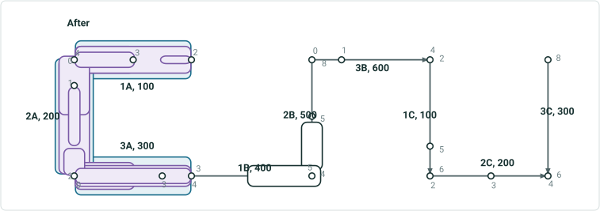

| Rname | Line Name | Line Order | From Date | To Date | From M | To M |
| --- | --- | --- | --- | --- | --- | --- |
| 1A | Red | 100 | 1/1/2000 | 1/1/2020 | 2 | 4 |
| 2A | Red | 200 | 1/1/2000 | 1/1/2020 | 0 | 2 |
| 3A | Red | 300 | 1/1/2000 | 1/1/2020 | 0 | 4 |
| 1B | Blue | 100 | 1/1/2000 | 1/1/2020 | 3 | 5 |
| 2B | Blue | 200 | 1/1/2000 | 1/1/2020 | 4 | 8 |
| 3B | Blue | 300 | 1/1/2000 | 1/1/2020 | 0 | 4 |
| 1A | Blue | 100 | 1/1/2020 | null | 2 | 4 |
| 2A | Blue | 200 | 1/1/2020 | null | 0 | 2 |
| 3A | Blue | 300 | 1/1/2020 | null | 0 | 4 |
| 1B | Blue | 400 | 1/1/2020 | null | 3 | 5 |
| 2B | Blue | 500 | 1/1/2020 | null | 4 | 8 |
| 3B | Blue | 600 | 1/1/2020 | null | 0 | 4 |
| 1C | Gray | 100 | 1/1/2000 | null | 2 | 6 |
| 2C | Gray | 200 | 1/1/2000 | null | 2 | 4 |
| 3C | Gray | 300 | 1/1/2000 | null | 6 | 8 |

## Slide 20 — Test case 10: Transfer to Existing Line – transfer 1 entire simple route; not transfer CP; keep original measures; keep

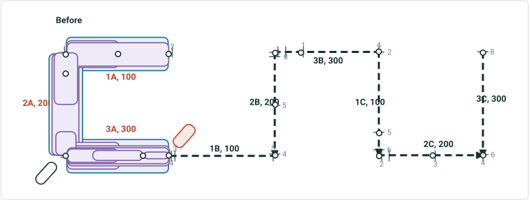

| Rname | Line Name | Line Order | From Date | To Date | From M | To M |
| --- | --- | --- | --- | --- | --- | --- |
| 1A | Red | 100 | 1/1/2000 | null | 2 | 4 |
| 2A | Red | 200 | 1/1/2000 | null | 0 | 2 |
| 3A | Red | 300 | 1/1/2000 | null | 0 | 4 |
| 1B | Blue | 100 | 1/1/2000 | null | 3 | 5 |
| 2B | Blue | 200 | 1/1/2000 | null | 4 | 8 |
| 3B | Blue | 300 | 1/1/2000 | null | 0 | 4 |
| 1C | Gray | 100 | 1/1/2000 | null | 2 | 6 |
| 2C | Gray | 200 | 1/1/2000 | null | 2 | 4 |
| 3C | Gray | 300 | 1/1/2000 | null | 6 | 8 |

| Event ID | From Date | To Date | Route ID | From M | To M | Location Error |
| --- | --- | --- | --- | --- | --- | --- |
| S1 | 1/1/2000 | <Null> | 3A | 3 | 4 | No Error |
| S2 | 1/1/2000 | <Null> | 3A | 1 | 3 | No Error |
| S3 | 1/1/2000 | <Null> | 3A | 0 | 2 | No Error |
| S4 | 1/1/2000 | <Null> | 3A | 0 | 4 | No Error |
| S5a | 1/1/2000 | <Null> | 2A | 1.75 | 2 | No Error |
| S5b | 1/1/2000 | <Null> | 3A | 0 | 4 | No Error |
| S6a | 1/1/2000 | <Null> | 1A | 2 | 4 | No Error |
| S6b | 1/1/2000 | <Null> | 2A | 0 | 1.25 | No Error |
| S7a | 1/1/2000 | <Null> | 1A | 3 | 4 | No Error |
| S7b | 1/1/2000 | <Null> | 2A | 0 | 2 | No Error |
| S7c | 1/1/2000 | <Null> | 3A | 0 | 2 | No Error |
| S8a | 1/1/2000 | <Null> | 1A | 2 | 4 | No Error |
| S8b | 1/1/2000 | <Null> | 2A | 0 | 2 | No Error |
| S8c | 1/1/2000 | <Null> | 3A | 0 | 4 | No Error |

Effective date is 1/1/2020
Recal downstream unchecked

## Slide 21 — Test case 10: Transfer to Existing Line – transfer 1 entire simple route; not transfer CP; keep original measures; keep

| Event ID | From Date | To Date | Route ID | From M | To M | Location Error |
| --- | --- | --- | --- | --- | --- | --- |
| S1 | 1/1/2000 | 1/1/2020 | 3A | 3 | 4 | No Error |
| S1 | 1/1/2020 | <Null> | 3A | 3 | 4 | No Error |
| S2 | 1/1/2000 | 1/1/2020 | 3A | 1 | 3 | No Error |
| S2 | 1/1/2020 | <Null> | 3A | 1 | 3 | No Error |
| S3 | 1/1/2000 | 1/1/2020 | 3A | 0 | 2 | No Error |
| S3 | 1/1/2020 | <Null> | 3A | 0 | 2 | No Error |
| S4 | 1/1/2000 | 1/1/2020 | 3A | 0 | 4 | No Error |
| S4 | 1/1/2020 | <Null> | 3A | 0 | 4 | No Error |
| S5a | 1/1/2000 | <Null> | 2A | 1.75 | 2 | No Error |
| S5b | 1/1/2000 | 1/1/2020 | 3A | 0 | 4 | No Error |
| S5b | 1/1/2020 | <Null> | 3A | 0 | 4 | No Error |
| S6a | 1/1/2000 | <Null> | 1A | 2 | 4 | No Error |
| S6b | 1/1/2000 | <Null> | 2A | 0 | 1.25 | No Error |
| S7a | 1/1/2000 | <Null> | 1A | 3 | 4 | No Error |
| S7b | 1/1/2000 | <Null> | 2A | 0 | 2 | No Error |
| S7c | 1/1/2000 | 1/1/2020 | 3A | 0 | 2 | No Error |
| S7c | 1/1/2020 | <Null> | 3A | 0 | 2 | No Error |
| S8a | 1/1/2000 | <Null> | 1A | 2 | 4 | No Error |
| S8b | 1/1/2000 | <Null> | 2A | 0 | 2 | No Error |
| S8c | 1/1/2000 | 1/1/2020 | 3A | 0 | 4 | No Error |
| S8c | 1/1/2020 | <Null> | 3A | 0 | 4 | No Error |

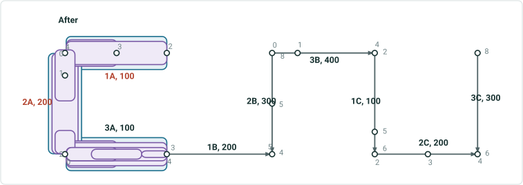

| Rname | Line Name | Line Order | From Date | To Date | From M | To M |
| --- | --- | --- | --- | --- | --- | --- |
| 1A | Red | 100 | 1/1/2000 | null | 2 | 4 |
| 2A | Red | 200 | 1/1/2000 | null | 0 | 2 |
| 3A | Red | 300 | 1/1/2000 | 1/1/2020 | 0 | 4 |
| 1B | Blue | 100 | 1/1/2000 | 1/1/2020 | 3 | 5 |
| 2B | Blue | 200 | 1/1/2000 | 1/1/2020 | 4 | 8 |
| 3B | Blue | 300 | 1/1/2000 | 1/1/2020 | 0 | 4 |
| 3A | Blue | 100 | 1/1/2020 | null | 0 | 4 |
| 1B | Blue | 200 | 1/1/2020 | null | 3 | 5 |
| 2B | Blue | 300 | 1/1/2020 | null | 4 | 8 |
| 3B | Blue | 400 | 1/1/2020 | null | 0 | 4 |
| 1C | Gray | 100 | 1/1/2000 | null | 2 | 6 |
| 2C | Gray | 200 | 1/1/2000 | null | 2 | 4 |
| 3C | Gray | 300 | 1/1/2000 | null | 6 | 8 |

## Slide 22 — Test case 11: Transfer to Existing Line – transfer 0.5+1+0.5 simple routes; transfer CP; keep original measures;

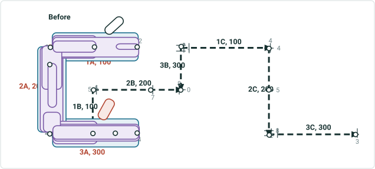

| Rname | Line Name | Line Order | From Date | To Date | From M | To M |
| --- | --- | --- | --- | --- | --- | --- |
| 1A | Red | 100 | 1/1/2000 | null | 2 | 4 |
| 2A | Red | 200 | 1/1/2000 | null | 0 | 2 |
| 3A | Red | 300 | 1/1/2000 | null | 0 | 4 |
| 1B | Blue | 100 | 1/1/2000 | null | 3 | 5 |
| 2B | Blue | 200 | 1/1/2000 | null | 4 | 8 |
| 3B | Blue | 300 | 1/1/2000 | null | 0 | 4 |
| 1C | Gray | 100 | 1/1/2000 | null | 2 | 6 |
| 2C | Gray | 200 | 1/1/2000 | null | 2 | 4 |
| 3C | Gray | 300 | 1/1/2000 | null | 6 | 8 |

| Event ID | From Date | To Date | Route ID | From M | To M | Location Error |
| --- | --- | --- | --- | --- | --- | --- |
| S1 | 1/1/2000 | <Null> | 1A | 2 | 2.5 | No Error |
| S2 | 1/1/2000 | <Null> | 2A | 1 | 1.5 | No Error |
| S3 | 1/1/2000 | <Null> | 1A | 3 | 4 | No Error |
| S4 | 1/1/2000 | <Null> | 3A | 0 | 4 | No Error |
| S5a | 1/1/2000 | <Null> | 2A | 1.75 | 2 | No Error |
| S5b | 1/1/2000 | <Null> | 3A | 0 | 4 | No Error |
| S6a | 1/1/2000 | <Null> | 1A | 2 | 4 | No Error |
| S6b | 1/1/2000 | <Null> | 2A | 0 | 1.25 | No Error |
| S7a | 1/1/2000 | <Null> | 1A | 3 | 4 | No Error |
| S7b | 1/1/2000 | <Null> | 2A | 0 | 2 | No Error |
| S7c | 1/1/2000 | <Null> | 3A | 0 | 2 | No Error |
| S8a | 1/1/2000 | <Null> | 1A | 2 | 4 | No Error |
| S8b | 1/1/2000 | <Null> | 2A | 0 | 2 | No Error |
| S8c | 1/1/2000 | <Null> | 3A | 0 | 4 | No Error |

Effective date is 1/1/2020
This case has 2 variations. Recal downstream unchecked in result1, and checked in result 2

## Slide 23 — Test case 11: Transfer to Existing Line – transfer 0.5+1+0.5 simple routes; transfer CP; keep original measures;

| Event ID | From Date | To Date | Route ID | From M | To M | Location Error |
| --- | --- | --- | --- | --- | --- | --- |
| S1 | 1/1/2000 | <Null> | 1A | 2 | 2.5 | No Error |
| S2 | 1/1/2000 | 1/1/2020 | 2A | 1 | 1.5 | No Error |
| S2 | 1/1/2020 | <Null> | 2A | 1 | 1.5 | No Error |
| S3 | 1/1/2000 | 1/1/2020 | 1A | 3 | 4 | No Error |
| S3 | 1/1/2020 | <Null> | 1A_reassign | 3 | 4 | No Error |
| S4 | 1/1/2000 | 1/1/2020 | 3A | 0 | 4 | No Error |
| S4 | 1/1/2020 | <Null> | 3A_reassign | 0 | 2 | No Error |
| S4 | 1/1/2020 | <Null> | 3A | 2 | 4 | No Error |
| S5a | 1/1/2000 | 1/1/2020 | 2A | 1.75 | 2 | No Error |
| S5a | 1/1/2020 | <Null> | 2A | 1.75 | 2 | No Error |
| S5b | 1/1/2000 | 1/1/2020 | 3A | 0 | 4 | No Error |
| S5b | 1/1/2020 | <Null> | 3A_reassign | 0 | 2 | No Error |
| S5b | 1/1/2020 | <Null> | 3A | 2 | 4 | No Error |
| S6a | 1/1/2000 | 1/1/2020 | 1A | 2 | 4 | No Error |
| S6a | 1/1/2020 | <Null> | 1A | 2 | 3 | No Error |
| S6a | 1/1/2020 | <Null> | 1A_reassign | 3 | 4 | No Error |
| S6b | 1/1/2000 | 1/1/2020 | 2A | 0 | 1.25 | No Error |
| S6b | 1/1/2020 | <Null> | 2A | 0 | 1.25 | No Error |
| S7a | 1/1/2000 | 1/1/2020 | 1A | 3 | 4 | No Error |
| S7a | 1/1/2020 | <Null> | 1A_reassign | 3 | 4 | No Error |
| S7b | 1/1/2000 | 1/1/2020 | 2A | 0 | 2 | No Error |
| S7b | 1/1/2020 | <Null> | 2A | 0 | 2 | No Error |
| S7c | 1/1/2000 | 1/1/2020 | 3A | 0 | 2 | No Error |
| S7c | 1/1/2020 | <Null> | 3A_reassign | 0 | 2 | No Error |
| S8a | 1/1/2000 | 1/1/2020 | 1A | 2 | 4 | No Error |
| S8a | 1/1/2020 | <Null> | 1A | 2 | 3 | No Error |
| S8a | 1/1/2020 | <Null> | 1A_reassign | 3 | 4 | No Error |
| S8b | 1/1/2000 | 1/1/2020 | 2A | 0 | 2 | No Error |
| S8b | 1/1/2020 | <Null> | 2A | 0 | 2 | No Error |
| S8c | 1/1/2000 | 1/1/2020 | 3A | 0 | 4 | No Error |
| S8c | 1/1/2020 | <Null> | 3A_reassign | 0 | 2 | No Error |
| S8c | 1/1/2020 | <Null> | 3A | 2 | 4 | No Error |


| Rname | Line Name | Line Order | From Date | To Date | From M | To M |
| --- | --- | --- | --- | --- | --- | --- |
| 1A | Red | 100 | 1/1/2000 | 1/1/2020 | 2 | 4 |
| 2A | Red | 200 | 1/1/2000 | 1/1/2020 | 0 | 2 |
| 3A | Red | 300 | 1/1/2000 | 1/1/2020 | 0 | 4 |
| 1A | Red | 100 | 1/1/2020 | null | 2 | 3 |
| 3A | Red | 200 | 1/1/2020 | null | 2 | 4 |
| 1B | Blue | 100 | 1/1/2000 | 1/1/2020 | 3 | 5 |
| 2B | Blue | 200 | 1/1/2000 | 1/1/2020 | 4 | 8 |
| 3B | Blue | 300 | 1/1/2000 | 1/1/2020 | 0 | 4 |
| 1A_reassign | Blue | 100 | 1/1/2020 | null | 3 | 4 |
| 2A | Blue | 200 | 1/1/2020 | null | 0 | 2 |
| 3A_reassign | Blue | 300 | 1/1/2020 | null | 0 | 2 |
| 1B | Blue | 400 | 1/1/2020 | null | 3 | 5 |
| 2B | Blue | 500 | 1/1/2020 | null | 4 | 8 |
| 3B | Blue | 600 | 1/1/2020 | null | 0 | 4 |
| 1C | Gray | 100 | 1/1/2000 | null | 2 | 6 |
| 2C | Gray | 200 | 1/1/2000 | null | 2 | 4 |
| 3C | Gray | 300 | 1/1/2000 | null | 6 | 8 |

## Slide 24 — Test case 11: Transfer to Existing Line – transfer 0.5+1+0.5 simple routes; transfer CP; keep original measures;

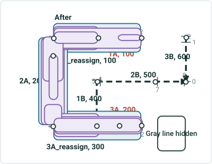

| Rname | Line Name | Line Order | From Date | To Date | From M | To M |
| --- | --- | --- | --- | --- | --- | --- |
| 1A | Red | 100 | 1/1/2000 | 1/1/2020 | 2 | 4 |
| 2A | Red | 200 | 1/1/2000 | 1/1/2020 | 0 | 2 |
| 3A | Red | 300 | 1/1/2000 | 1/1/2020 | 0 | 4 |
| 1A | Red | 100 | 1/1/2020 | null | 2 | 3 |
| 3A | Red | 200 | 1/1/2020 | null | 0 | 2 |
| 1B | Blue | 100 | 1/1/2000 | 1/1/2020 | 3 | 5 |
| 2B | Blue | 200 | 1/1/2000 | 1/1/2020 | 4 | 8 |
| 3B | Blue | 300 | 1/1/2000 | 1/1/2020 | 0 | 4 |
| 1A_reassign | Blue | 100 | 1/1/2020 | null | 3 | 4 |
| 2A | Blue | 200 | 1/1/2020 | null | 0 | 2 |
| 3A_reassign | Blue | 300 | 1/1/2020 | null | 0 | 2 |
| 1B | Blue | 400 | 1/1/2020 | null | 3 | 5 |
| 2B | Blue | 500 | 1/1/2020 | null | 4 | 8 |
| 3B | Blue | 600 | 1/1/2020 | null | 0 | 4 |
| 1C | Gray | 100 | 1/1/2000 | null | 2 | 6 |
| 2C | Gray | 200 | 1/1/2000 | null | 2 | 4 |
| 3C | Gray | 300 | 1/1/2000 | null | 6 | 8 |

| Event ID | From Date | To Date | Route ID | From M | To M | Location Error |
| --- | --- | --- | --- | --- | --- | --- |
| S1 | 1/1/2000 | <Null> | 1A | 2 | 2.5 | No Error |
| S2 | 1/1/2000 | 1/1/2020 | 2A | 1 | 1.5 | No Error |
| S2 | 1/1/2020 | <Null> | 2A | 1 | 1.5 | No Error |
| S3 | 1/1/2000 | 1/1/2020 | 1A | 3 | 4 | No Error |
| S3 | 1/1/2020 | <Null> | 1A_reassign | 3 | 4 | No Error |
| S4 | 1/1/2000 | 1/1/2020 | 3A | 0 | 4 | No Error |
| S4 | 1/1/2020 | <Null> | 3A_reassign | 0 | 2 | No Error |
| S4 | 1/1/2020 | <Null> | 3A | 0 | 2 | No Error |
| S5a | 1/1/2000 | 1/1/2020 | 2A | 1.75 | 2 | No Error |
| S5a | 1/1/2020 | <Null> | 2A | 1.75 | 2 | No Error |
| S5b | 1/1/2000 | 1/1/2020 | 3A | 0 | 4 | No Error |
| S5b | 1/1/2020 | <Null> | 3A_reassign | 0 | 2 | No Error |
| S5b | 1/1/2020 | <Null> | 3A | 0 | 2 | No Error |
| S6a | 1/1/2000 | 1/1/2020 | 1A | 2 | 4 | No Error |
| S6a | 1/1/2020 | <Null> | 1A | 2 | 3 | No Error |
| S6a | 1/1/2020 | <Null> | 1A_reassign | 3 | 4 | No Error |
| S6b | 1/1/2000 | 1/1/2020 | 2A | 0 | 1.25 | No Error |
| S6b | 1/1/2020 | <Null> | 2A | 0 | 1.25 | No Error |
| S7a | 1/1/2000 | 1/1/2020 | 1A | 3 | 4 | No Error |
| S7a | 1/1/2020 | <Null> | 1A_reassign | 3 | 4 | No Error |
| S7b | 1/1/2000 | 1/1/2020 | 2A | 0 | 2 | No Error |
| S7b | 1/1/2020 | <Null> | 2A | 0 | 2 | No Error |
| S7c | 1/1/2000 | 1/1/2020 | 3A | 0 | 2 | No Error |
| S7c | 1/1/2020 | <Null> | 3A_reassign | 0 | 2 | No Error |
| S8a | 1/1/2000 | 1/1/2020 | 1A | 2 | 4 | No Error |
| S8a | 1/1/2020 | <Null> | 1A | 2 | 3 | No Error |
| S8a | 1/1/2020 | <Null> | 1A_reassign | 3 | 4 | No Error |
| S8b | 1/1/2000 | 1/1/2020 | 2A | 0 | 2 | No Error |
| S8b | 1/1/2020 | <Null> | 2A | 0 | 2 | No Error |
| S8c | 1/1/2000 | 1/1/2020 | 3A | 0 | 4 | No Error |
| S8c | 1/1/2020 | <Null> | 3A_reassign | 0 | 2 | No Error |
| S8c | 1/1/2020 | <Null> | 3A | 0 | 2 | No Error |

## Slide 25 — Test case 15: Transfer to Existing Line – transfer 3 entire simple routes; transfer CP; keep original measures; keep

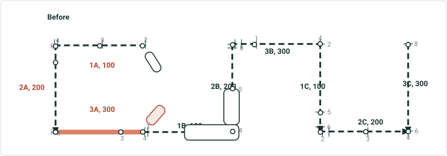

| Rname | Line Name | Line Order | From Date | To Date | From M | To M |
| --- | --- | --- | --- | --- | --- | --- |
| 1A | Red | 100 | 1/1/2000 | null | 2 | 4 |
| 2A | Red | 200 | 1/1/2000 | null | 0 | 2 |
| 3A | Red | 300 | 1/1/2000 | null | 0 | 4 |
| 1B | Blue | 100 | 1/1/2000 | null | 3 | 5 |
| 2B | Blue | 200 | 1/1/2000 | null | 4 | 8 |
| 3B | Blue | 300 | 1/1/2000 | null | 0 | 4 |
| 1C | Gray | 100 | 1/1/2000 | null | 2 | 6 |
| 2C | Gray | 200 | 1/1/2000 | null | 2 | 4 |
| 3C | Gray | 300 | 1/1/2000 | null | 6 | 8 |

| Event ID | From Date | To Date | From Route ID | To Route ID | From M | To M | Location Error |
| --- | --- | --- | --- | --- | --- | --- | --- |
| S_blue | 1/1/2000 | <Null> | 1B | 2B | 4 | 5 | No Error |

Showing these events for once to indicate events on other lines will not be affected

| Event ID | From Date | To Date | Route ID | Measure | Location Error |
| --- | --- | --- | --- | --- | --- |
| Star1 | 1/1/2000 | <Null> | 3A | 2 | No Error |
| Star2 | 1/1/2000 | <Null> | 1A | 2 | No Error |
| Star3 | 1/1/2000 | <Null> | 1A | 2.5 | No Error |
| Star4 | 1/1/2000 | <Null> | 2A | 0 | No Error |
| Star5 | 1/1/2000 | <Null> | 2A | 2 | No Error |

| Event ID | From Date | To Date | Route ID | Measure | Location Error |
| --- | --- | --- | --- | --- | --- |
| Star_blue | 1/1/2000 | <Null> | 2B | 6.5 | No Error |

Effective date is 1/1/2020
Recal downstream unchecked


## Slide 26 — Test case 15: Transfer to Existing Line – transfer 3 entire simple routes; transfer CP; keep original measures; keep

| Event ID | From Date | To Date | From Route ID | To Route ID | From M | To M | Location Error |
| --- | --- | --- | --- | --- | --- | --- | --- |
| S_blue | 1/1/2000 | <Null> | 1B | 2B | 4 | 5 | No Error |

Showing these events for once to indicate events on other lines will not be affected

| Event ID | From Date | To Date | Route ID | Measure | Location Error |
| --- | --- | --- | --- | --- | --- |
| Star1 | 1/1/2000 | 1/1/2020 | 3A | 2 | No Error |
| Star2 | 1/1/2000 | 1/1/2020 | 1A | 2 | No Error |
| Star3 | 1/1/2000 | 1/1/2020 | 1A | 2.5 | No Error |
| Star4 | 1/1/2000 | 1/1/2020 | 2A | 0 | No Error |
| Star5 | 1/1/2000 | 1/1/2020 | 2A | 2 | No Error |

| Event ID | From Date | To Date | Route ID | Measure | Location Error |
| --- | --- | --- | --- | --- | --- |
| Star_blue | 1/1/2000 | <Null> | 2B | 6.5 | No Error |

| Star1 | 1/1/2020 | <Null> | 3A | 2 | No Error |
| --- | --- | --- | --- | --- | --- |
| Star2 | 1/1/2020 | <Null> | 1A | 2 | No Error |
| Star3 | 1/1/2020 | <Null> | 1A | 2.5 | No Error |
| Star4 | 1/1/2020 | <Null> | 2A | 0 | No Error |
| Star5 | 1/1/2020 | <Null> | 2A | 2 | No Error |

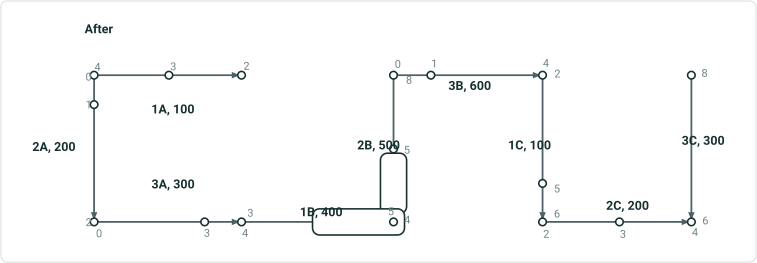

| Rname | Line Name | Line Order | From Date | To Date | From M | To M |
| --- | --- | --- | --- | --- | --- | --- |
| 1A | Red | 100 | 1/1/2000 | 1/1/2020 | 2 | 4 |
| 2A | Red | 200 | 1/1/2000 | 1/1/2020 | 0 | 2 |
| 3A | Red | 300 | 1/1/2000 | 1/1/2020 | 0 | 4 |
| 1B | Blue | 100 | 1/1/2000 | 1/1/2020 | 3 | 5 |
| 2B | Blue | 200 | 1/1/2000 | 1/1/2020 | 4 | 8 |
| 3B | Blue | 300 | 1/1/2000 | 1/1/2020 | 0 | 4 |
| 1A | Blue | 100 | 1/1/2020 | null | 2 | 4 |
| 2A | Blue | 200 | 1/1/2020 | null | 0 | 2 |
| 3A | Blue | 300 | 1/1/2020 | null | 0 | 4 |
| 1B | Blue | 400 | 1/1/2020 | null | 3 | 5 |
| 2B | Blue | 500 | 1/1/2020 | null | 4 | 8 |
| 3B | Blue | 600 | 1/1/2020 | null | 0 | 4 |
| 1C | Gray | 100 | 1/1/2000 | null | 2 | 6 |
| 2C | Gray | 200 | 1/1/2000 | null | 2 | 4 |
| 3C | Gray | 300 | 1/1/2000 | null | 6 | 8 |


## Slide 27 — Test case 16: Transfer to Existing Line – transfer 1 entire simple route; not transfer CP; keep original measures; keep

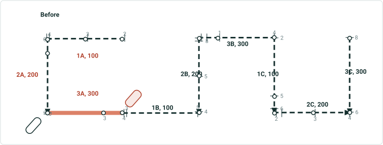

| Rname | Line Name | Line Order | From Date | To Date | From M | To M |
| --- | --- | --- | --- | --- | --- | --- |
| 1A | Red | 100 | 1/1/2000 | null | 2 | 4 |
| 2A | Red | 200 | 1/1/2000 | null | 0 | 2 |
| 3A | Red | 300 | 1/1/2000 | null | 0 | 4 |
| 1B | Blue | 100 | 1/1/2000 | null | 3 | 5 |
| 2B | Blue | 200 | 1/1/2000 | null | 4 | 8 |
| 3B | Blue | 300 | 1/1/2000 | null | 0 | 4 |
| 1C | Gray | 100 | 1/1/2000 | null | 2 | 6 |
| 2C | Gray | 200 | 1/1/2000 | null | 2 | 4 |
| 3C | Gray | 300 | 1/1/2000 | null | 6 | 8 |

| Event ID | From Date | To Date | Route ID | Measure | Location Error |
| --- | --- | --- | --- | --- | --- |
| Star1 | 1/1/2000 | <Null> | 3A | 2 | No Error |
| Star2 | 1/1/2000 | <Null> | 1A | 2 | No Error |
| Star3 | 1/1/2000 | <Null> | 3A | 1 | No Error |
| Star4 | 1/1/2000 | <Null> | 3A | 4 | No Error |
| Star5 | 1/1/2000 | <Null> | 2A | 2 | No Error |

Effective date is 1/1/2020
Recal downstream unchecked


## Slide 28 — Test case 16: Transfer to Existing Line – transfer 1 entire simple route; not transfer CP; keep original measures; keep

| Event ID | From Date | To Date | Route ID | Measure | Location Error |
| --- | --- | --- | --- | --- | --- |
| Star1 | 1/1/2000 | 1/1/2020 | 3A | 2 | No Error |
| Star1 | 1/1/2020 | <Null> | 3A | 2 | No Error |
| Star2 | 1/1/2000 | <Null> | 1A | 2 | No Error |
| Star3 | 1/1/2000 | 1/1/2020 | 3A | 1 | No Error |
| Star3 | 1/1/2020 | <Null> | 3A | 1 | No Error |
| Star4 | 1/1/2000 | 1/1/2020 | 3A | 4 | No Error |
| Star4 | 1/1/2020 | <Null> | 3A | 4 | No Error |
| Star5 | 1/1/2000 | <Null> | 2A | 2 ?? | No Error |

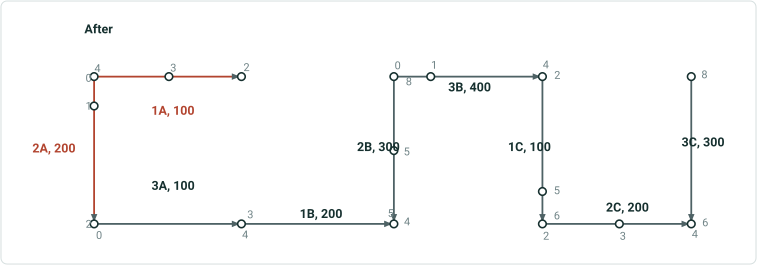

| Rname | Line Name | Line Order | From Date | To Date | From M | To M |
| --- | --- | --- | --- | --- | --- | --- |
| 1A | Red | 100 | 1/1/2000 | null | 2 | 4 |
| 2A | Red | 200 | 1/1/2000 | null | 0 | 2 |
| 3A | Red | 300 | 1/1/2000 | 1/1/2020 | 0 | 4 |
| 1B | Blue | 100 | 1/1/2000 | 1/1/2020 | 3 | 5 |
| 2B | Blue | 200 | 1/1/2000 | 1/1/2020 | 4 | 8 |
| 3B | Blue | 300 | 1/1/2000 | 1/1/2020 | 0 | 4 |
| 3A | Blue | 100 | 1/1/2020 | null | 0 | 4 |
| 1B | Blue | 200 | 1/1/2020 | null | 3 | 5 |
| 2B | Blue | 300 | 1/1/2020 | null | 4 | 8 |
| 3B | Blue | 400 | 1/1/2020 | null | 0 | 4 |
| 1C | Gray | 100 | 1/1/2000 | null | 2 | 6 |
| 2C | Gray | 200 | 1/1/2000 | null | 2 | 4 |
| 3C | Gray | 300 | 1/1/2000 | null | 6 | 8 |


## Slide 29 — Test case 17: Transfer to Existing Line – transfer 0.5+1 simple routes; not transfer CP; change measures; partial route


| Rname | Line Name | Line Order | From Date | To Date | From M | To M |
| --- | --- | --- | --- | --- | --- | --- |
| 1A | Red | 100 | 1/1/2000 | null | 2 | 4 |
| 2A | Red | 200 | 1/1/2000 | null | 0 | 2 |
| 3A | Red | 300 | 1/1/2000 | null | 0 | 4 |
| 1B | Blue | 100 | 1/1/2000 | null | 3 | 5 |
| 2B | Blue | 200 | 1/1/2000 | null | 4 | 8 |
| 3B | Blue | 300 | 1/1/2000 | null | 0 | 4 |
| 1C | Gray | 100 | 1/1/2000 | null | 2 | 6 |
| 2C | Gray | 200 | 1/1/2000 | null | 2 | 4 |
| 3C | Gray | 300 | 1/1/2000 | null | 6 | 8 |

| Event ID | From Date | To Date | Route ID | Measure | Location Error |
| --- | --- | --- | --- | --- | --- |
| Star1 | 1/1/2000 | <Null> | 3A | 2 | No Error |
| Star2 | 1/1/2000 | <Null> | 2A | 1.25 | No Error |
| Star3 | 1/1/2000 | <Null> | 2A | 1.4375 | No Error |
| Star4 | 1/1/2000 | <Null> | 2A | 0 | No Error |
| Star5 | 1/1/2000 | <Null> | 2A | 2 | No Error |

Effective date is 1/1/2020
Recal downstream unchecked


## Slide 30 — Test case 17: Transfer to Existing Line – transfer 0.5+1 simple routes; not transfer CP; change measures; partial route

| Event ID | From Date | To Date | Route ID | Measure | Location Error |
| --- | --- | --- | --- | --- | --- |
| Star1 | 1/1/2000 | 1/1/2020 | 3A | 2 | No Error |
| Star1 | 1/1/2020 | <Null> | 3A | 4 | No Error |
| Star2 | 1/1/2000 | 1/1/2020 | 2A | 1.25 | No Error |
| Star2 | 1/1/2020 | <Null> | 2A_reassign | 2 | No Error |
| Star3 | 1/1/2000 | 1/1/2020 | 2A | 1.4375 | No Error |
| Star3 | 1/1/2020 | <Null> | 2A_reassign | 2.25 | No Error |
| Star4 | 1/1/2000 | <Null> | 2A | 0 | No Error |
| Star5 | 1/1/2000 | 1/1/2020 | 2A | 2 | No Error |
| Star5 | 1/1/2020 | <Null> | 2A_reassign | 3 | No Error |

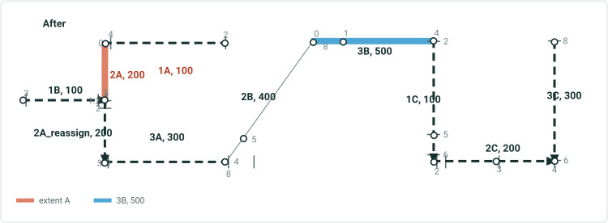

| Rname | Line Name | Line Order | From Date | To Date | From M | To M |
| --- | --- | --- | --- | --- | --- | --- |
| 1A | Red | 100 | 1/1/2000 | null | 2 | 4 |
| 2A | Red | 200 | 1/1/2000 | 1/1/2020 | 0 | 2 |
| 2A | Red | 200 | 1/1/2020 | null | 0 | 1.25 |
| 3A | Red | 300 | 1/1/2000 | 1/1/2020 | 0 | 4 |
| 1B | Blue | 100 | 1/1/2000 | null | 3 | 5 |
| 2B | Blue | 200 | 1/1/2000 | 1/1/2020 | 4 | 8 |
| 3B | Blue | 300 | 1/1/2000 | 1/1/2020 | 0 | 4 |
| 2A_reassign | Blue | 200 | 1/1/2020 | null | 2 | 3 |
| 3A | Blue | 300 | 1/1/2020 | null | 0 | 8 |
| 2B | Blue | 400 | 1/1/2020 | null | 4 | 8 |
| 3B | Blue | 500 | 1/1/2020 | null | 0 | 4 |
| 1C | Gray | 100 | 1/1/2000 | null | 2 | 6 |
| 2C | Gray | 200 | 1/1/2000 | null | 2 | 4 |
| 3C | Gray | 300 | 1/1/2000 | null | 6 | 8 |


## Slide 31 — Snap EB- reassign to new line

## Slide 32 — Test case 1: Transfer to New Line – transfer 3 entire simple routes; transfer CP; keep original measures; keep original

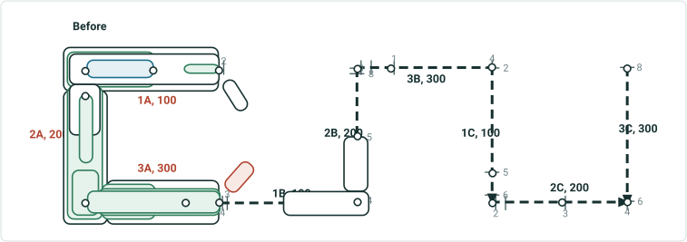

| Rname | Line Name | Line Order | From Date | To Date | From M | To M |
| --- | --- | --- | --- | --- | --- | --- |
| 1A | Red | 100 | 1/1/2000 | null | 2 | 4 |
| 2A | Red | 200 | 1/1/2000 | null | 0 | 2 |
| 3A | Red | 300 | 1/1/2000 | null | 0 | 4 |
| 1B | Blue | 100 | 1/1/2000 | null | 3 | 5 |
| 2B | Blue | 200 | 1/1/2000 | null | 4 | 8 |
| 3B | Blue | 300 | 1/1/2000 | null | 0 | 4 |
| 1C | Gray | 100 | 1/1/2000 | null | 2 | 6 |
| 2C | Gray | 200 | 1/1/2000 | null | 2 | 4 |
| 3C | Gray | 300 | 1/1/2000 | null | 6 | 8 |

| Event ID | From Date | To Date | From Route ID | To Route ID | From M | To M | Location Error |
| --- | --- | --- | --- | --- | --- | --- | --- |
| S_blue | 1/1/2000 | <Null> | 1B | 2B | 4 | 5 | No Error |

Showing this event for once to indicate events on other lines will not be affected

| Event ID | From Date | To Date | From Route ID | To Route ID | From M | To M | Location Error |
| --- | --- | --- | --- | --- | --- | --- | --- |
| S1 | 1/1/2000 | <Null> | 1A | 1A | 2 | 2.5 | No Error |
| S2 | 1/1/2000 | <Null> | 2A | 2A | 1 | 1.5 | No Error |
| S3 | 1/1/2000 | <Null> | 1A | 1A | 3 | 4 | No Error |
| S4 | 1/1/2000 | <Null> | 3A | 3A | 0 | 4 | No Error |
| S5 | 1/1/2000 | <Null> | 2A | 3A | 1.75 | 4 | No Error |
| S6 | 1/1/2000 | <Null> | 1A | 2A | 2 | 1.25 | No Error |
| S7 | 1/1/2000 | <Null> | 1A | 3A | 3 | 2 | No Error |
| S8 | 1/1/2000 | <Null> | 1A | 3A | 2 | 4 | No Error |

Effective date is 1/1/2020
Recal downstream unchecked

## Slide 33 — Test case 1: Transfer to New Line – transfer 3 entire simple routes; transfer CP; keep original measures; keep original

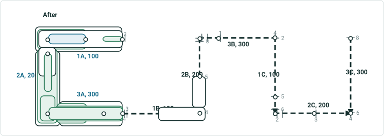

| Rname | Line Name | Line Order | From Date | To Date | From M | To M |
| --- | --- | --- | --- | --- | --- | --- |
| 1A | Red | 100 | 1/1/2000 | 1/1/2020 | 2 | 4 |
| 2A | Red | 200 | 1/1/2000 | 1/1/2020 | 0 | 2 |
| 3A | Red | 300 | 1/1/2000 | 1/1/2020 | 0 | 4 |
| 1A | Teal | 100 | 1/1/2020 | null | 2 | 4 |
| 2A | Teal | 200 | 1/1/2020 | null | 0 | 2 |
| 3A | Teal | 300 | 1/1/2020 | null | 0 | 4 |
| 1B | Blue | 100 | 1/1/2000 | null | 3 | 5 |
| 2B | Blue | 200 | 1/1/2000 | null | 4 | 8 |
| 3B | Blue | 300 | 1/1/2000 | null | 0 | 4 |
| 1C | Gray | 100 | 1/1/2000 | null | 2 | 6 |
| 2C | Gray | 200 | 1/1/2000 | null | 2 | 4 |
| 3C | Gray | 300 | 1/1/2000 | null | 6 | 8 |

| Event ID | From Date | To Date | From Route ID | To Route ID | From M | To M | Location Error |
| --- | --- | --- | --- | --- | --- | --- | --- |
| S_blue | 1/1/2000 | <Null> | 1B | 2B | 4 | 5 | No Error |

| Event ID | From Date | To Date | From Route ID | To Route ID | From M | To M | Location Error |
| --- | --- | --- | --- | --- | --- | --- | --- |
| S1 | 1/1/2000 | 1/1/2020 | 1A | 1A | 2 | 2.5 | No Error |
| S2 | 1/1/2000 | 1/1/2020 | 2A | 2A | 1 | 1.5 | No Error |
| S3 | 1/1/2000 | 1/1/2020 | 1A | 1A | 3 | 4 | No Error |
| S4 | 1/1/2000 | 1/1/2020 | 3A | 3A | 0 | 4 | No Error |
| S5 | 1/1/2000 | 1/1/2020 | 2A | 3A | 1.75 | 4 | No Error |
| S6 | 1/1/2000 | 1/1/2020 | 1A | 2A | 2 | 1.25 | No Error |
| S7 | 1/1/2000 | 1/1/2020 | 1A | 3A | 3 | 2 | No Error |
| S8 | 1/1/2000 | 1/1/2020 | 1A | 3A | 2 | 4 | No Error |
| S1 | 1/1/2020 | <Null> | 1A | 1A | 2 | 2.5 | No Error |
| S2 | 1/1/2020 | <Null> | 2A | 2A | 1 | 1.5 | No Error |
| S3 | 1/1/2020 | <Null> | 1A | 1A | 3 | 4 | No Error |
| S4 | 1/1/2020 | <Null> | 3A | 3A | 0 | 4 | No Error |
| S5 | 1/1/2020 | <Null> | 2A | 3A | 1.75 | 4 | No Error |
| S6 | 1/1/2020 | <Null> | 1A | 2A | 2 | 1.25 | No Error |
| S7 | 1/1/2020 | <Null> | 1A | 3A | 3 | 2 | No Error |
| S8 | 1/1/2020 | <Null> | 1A | 3A | 2 | 4 | No Error |

## Slide 34 — Test case 1- b : Transfer to New Line – 2 separate transfers; transfer CP; keep original measures; partial routes

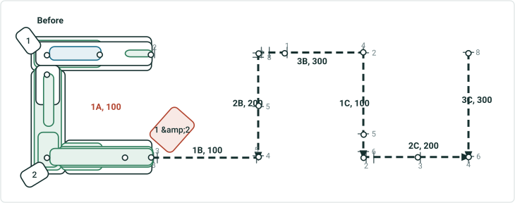

| Rname | Line Name | Line Order | From Date | To Date | From M | To M |
| --- | --- | --- | --- | --- | --- | --- |
| 1A | Red | 100 | 1/1/2000 | null | 2 | 8 |
| 1B | Blue | 100 | 1/1/2000 | null | 3 | 5 |
| 2B | Blue | 200 | 1/1/2000 | null | 4 | 8 |
| 3B | Blue | 300 | 1/1/2000 | null | 0 | 4 |
| 1C | Gray | 100 | 1/1/2000 | null | 2 | 6 |
| 2C | Gray | 200 | 1/1/2000 | null | 2 | 4 |
| 3C | Gray | 300 | 1/1/2000 | null | 6 | 8 |

| Event ID | From Date | To Date | From Route ID | To Route ID | From M | To M | Location Error |
| --- | --- | --- | --- | --- | --- | --- | --- |
| S1 | 1/1/2000 | <Null> | 1A | 1A | 2 | 2.5 | No Error |
| S2 | 1/1/2000 | <Null> | 1A | 1A | 5 | 5.5 | No Error |
| S3 | 1/1/2000 | <Null> | 1A | 1A | 3 | 4 | No Error |
| S4 | 1/1/2000 | <Null> | 1A | 1A | 6 | 8 | No Error |
| S5 | 1/1/2000 | <Null> | 1A | 1A | 5.75 | 8 | No Error |
| S6 | 1/1/2000 | <Null> | 1A | 1A | 2 | 5.25 | No Error |
| S7 | 1/1/2000 | <Null> | 1A | 1A | 3 | 6.5 | No Error |
| S8 | 1/1/2000 | <Null> | 1A | 1A | 2 | 8 | No Error |

First transfer is 1/1/2020
Second transfer is 1/1/2030
Recal downstream unchecked

## Slide 35

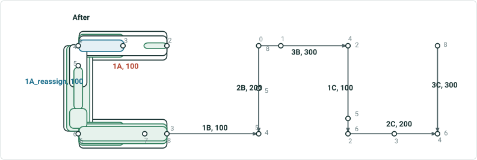

| Rname | Line Name | Line Order | From Date | To Date | From M | To M |
| --- | --- | --- | --- | --- | --- | --- |
| 1A | Red | 100 | 1/1/2000 | 1/1/2020 | 2 | 8 |
| 1A | Red | 100 | 1/1/2020 | null | 2 | 4 |
| 1A_reassign | Teal | 100 | 1/1/2020 | 1/1/2030 | 4 | 8 |
| 1A_reassign | Teal | 100 | 1/1/2030 | null | 4 | 6 |
| 1A_reassign_reassign | Yellow | 100 | 1/1/2030 | null | 6 | 8 |
| 1B | Blue | 100 | 1/1/2000 | null | 3 | 5 |
| 2B | Blue | 200 | 1/1/2000 | null | 4 | 8 |
| 3B | Blue | 300 | 1/1/2000 | null | 0 | 4 |
| 1C | Gray | 100 | 1/1/2000 | null | 2 | 6 |
| 2C | Gray | 200 | 1/1/2000 | null | 2 | 4 |
| 3C | Gray | 300 | 1/1/2000 | null | 6 | 8 |

1A_reassign_reassign, 100

Test case 1-b: Transfer to New Line – 2 separate transfers; transfer CP; keep original measures; partial routes change route name/id

| Event ID | From Date | To Date | From Route ID | To Route ID | From M | To M | Location Error |
| --- | --- | --- | --- | --- | --- | --- | --- |
| S1 | 1/1/2000 | <Null> | 1A | 1A | 2 | 2.5 | No Error |
| S2 | 1/1/2000 | 1/1/2020 | 1A | 1A | 5 | 5.5 | No Error |
| S2 | 1/1/2020 | <Null> | 1A_reassign | 1A_reassign | 5 | 5.5 | No Error |
| S3 | 1/1/2000 | <Null> | 1A | 1A | 3 | 4 | No Error |
| S4 | 1/1/2000 | 1/1/2020 | 1A | 1A | 6 | 8 | No Error |
| S4 | 1/1/2020 | 1/1/2030 | 1A_reassign | 1A_reassign | 6 | 8 | No Error |
| S4 | 1/1/2030 | null | 1A_reassign_reassign | 1A_reassign_reassign | 6 | 8 | No Error |
| S5 | 1/1/2000 | 1/1/2020 | 1A | 1A | 5.75 | 8 | No Error |
| S5 | 1/1/2020 | 1/1/2030 | 1A_reassign | 1A_reassign | 5.75 | 8 | No Error |
| S5 | 1/1/2030 | null | 1A_reassign | 1A_reassign | 5.75 | 6 | No Error |
| S5 | 1/1/2030 | null | 1A_reassign_reassign | 1A_reassign_reassign | 6 | 8 | No Error |
| S6 | 1/1/2000 | 1/1/2020 | 1A | 1A | 2 | 5.25 | No Error |
| S6 | 1/1/2020 | <Null> | 1A | 1A | 2 | 4 | No Error |
| S6 | 1/1/2020 | <Null> | 1A_reassign | 1A_reassign | 4 | 5.25 | No Error |
| S7 | 1/1/2000 | 1/1/2020 | 1A | 1A | 3 | 6.5 | No Error |
| S7 | 1/1/2020 | null | 1A | 1A | 3 | 4 | No Error |
| S7 | 1/1/2020 | 1/1/2030 | 1A_reassign | 1A_reassign | 4 | 6.5 | No Error |
| S7 | 1/1/2030 | null | 1A_reassign | 1A_reassign | 4 | 6 | No Error |
| S7 | 1/1/2030 | null | 1A_reassign_reassign | 1A_reassign_reassign | 6 | 6.5 | No Error |
| S8 | 1/1/2000 | 1/1/2020 | 1A | 1A | 2 | 8 | No Error |
| S8 | 1/1/2020 | null | 1A | 1A | 2 | 4 | No Error |
| S8 | 1/1/2020 | 1/1/2030 | 1A_reassign | 1A_reassign | 4 | 8 | No Error |
| S8 | 1/1/2030 | null | 1A_reassign | 1A_reassign | 4 | 6 | No Error |
| S8 | 1/1/2030 | null | 1A_reassign_reassign | 1A_reassign_reassign | 6 | 8 | No Error |

## Slide 36 — Test case 3: Transfer to New Line – transfer 1 entire simple route; transfer CP; keep original measures; keep original

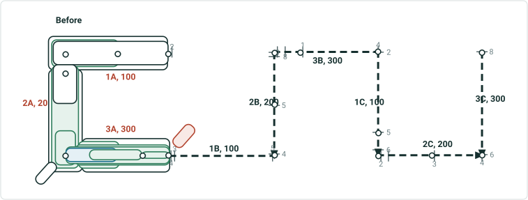

| Rname | Line Name | Line Order | From Date | To Date | From M | To M |
| --- | --- | --- | --- | --- | --- | --- |
| 1A | Red | 100 | 1/1/2000 | null | 2 | 4 |
| 2A | Red | 200 | 1/1/2000 | null | 0 | 2 |
| 3A | Red | 300 | 1/1/2000 | null | 0 | 4 |
| 1B | Blue | 100 | 1/1/2000 | null | 3 | 5 |
| 2B | Blue | 200 | 1/1/2000 | null | 4 | 8 |
| 3B | Blue | 300 | 1/1/2000 | null | 0 | 4 |
| 1C | Gray | 100 | 1/1/2000 | null | 2 | 6 |
| 2C | Gray | 200 | 1/1/2000 | null | 2 | 4 |
| 3C | Gray | 300 | 1/1/2000 | null | 6 | 8 |

| Event ID | From Date | To Date | From Route ID | To Route ID | From M | To M | Location Error |
| --- | --- | --- | --- | --- | --- | --- | --- |
| S1 | 1/1/2000 | <Null> | 3A | 3A | 3 | 4 | No Error |
| S2 | 1/1/2000 | <Null> | 3A | 3A | 1 | 3 | No Error |
| S3 | 1/1/2000 | <Null> | 3A | 3A | 0 | 2 | No Error |
| S4 | 1/1/2000 | <Null> | 3A | 3A | 0 | 4 | No Error |
| S5 | 1/1/2000 | <Null> | 2A | 3A | 1.75 | 4 | No Error |
| S6 | 1/1/2000 | <Null> | 1A | 2A | 2 | 1.25 | No Error |
| S7 | 1/1/2000 | <Null> | 1A | 3A | 3 | 2 | No Error |
| S8 | 1/1/2000 | <Null> | 1A | 3A | 2 | 4 | No Error |

Effective date is 1/1/2020
Recal downstream unchecked

## Slide 37 — Test case 3: Transfer to New Line – transfer 1 entire simple route; transfer CP; keep original measures; keep original

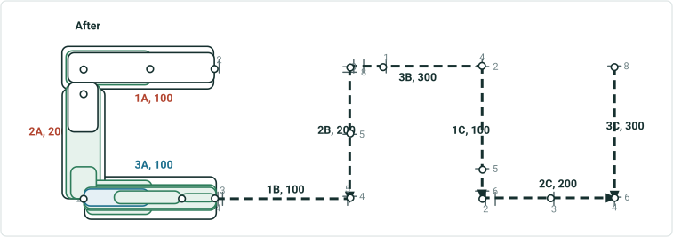

| Rname | Line Name | Line Order | From Date | To Date | From M | To M |
| --- | --- | --- | --- | --- | --- | --- |
| 1A | Red | 100 | 1/1/2000 | null | 2 | 4 |
| 2A | Red | 200 | 1/1/2000 | null | 0 | 2 |
| 3A | Red | 300 | 1/1/2000 | 1/1/2020 | 0 | 4 |
| 3A | Teal | 100 | 1/1/2020 | null | 0 | 4 |
| 1B | Blue | 100 | 1/1/2000 | null | 3 | 5 |
| 2B | Blue | 200 | 1/1/2000 | null | 4 | 8 |
| 3B | Blue | 300 | 1/1/2000 | null | 0 | 4 |
| 1C | Gray | 100 | 1/1/2000 | null | 2 | 6 |
| 2C | Gray | 200 | 1/1/2000 | null | 2 | 4 |
| 3C | Gray | 300 | 1/1/2000 | null | 6 | 8 |

| Event ID | From Date | To Date | From Route ID | To Route ID | From M | To M | Location Error |
| --- | --- | --- | --- | --- | --- | --- | --- |
| S1 | 1/1/2000 | 1/1/2020 | 3A | 3A | 3 | 4 | No Error |
| S1 | 1/1/2020 | null | 3A | 3A | 3 | 4 | No Error |
| S2 | 1/1/2000 | 1/1/2020 | 3A | 3A | 1 | 3 | No Error |
| S2 | 1/1/2020 | null | 3A | 3A | 1 | 3 | No Error |
| S3 | 1/1/2000 | 1/1/2020 | 3A | 3A | 0 | 2 | No Error |
| S3 | 1/1/2020 | null | 3A | 3A | 0 | 2 | No Error |
| S4 | 1/1/2000 | 1/1/2020 | 3A | 3A | 0 | 4 | No Error |
| S4 | 1/1/2020 | null | 3A | 3A | 0 | 4 | No Error |
| S5 | 1/1/2000 | 1/1/2020 | 2A | 3A | 1.75 | 4 | No Error |
| S5 | 1/1/2020 | null | 2A | 2A | 1.75 | 2 | No Error |
| S5 | 1/1/2020 | null | 3A | 3A | 0 | 4 | No Error |
| S6 | 1/1/2000 | <Null> | 1A | 2A | 2 | 1.25 | No Error |
| S7 | 1/1/2000 | 1/1/2020 | 1A | 3A | 3 | 2 | No Error |
| S7 | 1/1/2020 | null | 1A | 2A | 3 | 2 | No Error |
| S7 | 1/1/2020 | null | 3A | 3A | 0 | 2 | No Error |
| S8 | 1/1/2000 | 1/1/2020 | 1A | 3A | 2 | 4 | No Error |
| S8 | 1/1/2020 | null | 1A | 2A | 2 | 2 | No Error |
| S8 | 1/1/2020 | null | 3A | 3A | 0 | 4 | No Error |

## Slide 38 — Test case 5: Transfer to New Line – transfer 0.5+1+0.5 simple routes; transfer CP; keep original measures; partial


| Rname | Line Name | Line Order | From Date | To Date | From M | To M |
| --- | --- | --- | --- | --- | --- | --- |
| 1A | Red | 100 | 1/1/2000 | null | 2 | 4 |
| 2A | Red | 200 | 1/1/2000 | null | 0 | 2 |
| 3A | Red | 300 | 1/1/2000 | null | 0 | 4 |
| 1B | Blue | 100 | 1/1/2000 | null | 3 | 5 |
| 2B | Blue | 200 | 1/1/2000 | null | 4 | 8 |
| 3B | Blue | 300 | 1/1/2000 | null | 0 | 4 |
| 1C | Gray | 100 | 1/1/2000 | null | 2 | 6 |
| 2C | Gray | 200 | 1/1/2000 | null | 2 | 4 |
| 3C | Gray | 300 | 1/1/2000 | null | 6 | 8 |

| Event ID | From Date | To Date | From Route ID | To Route ID | From M | To M | Location Error |
| --- | --- | --- | --- | --- | --- | --- | --- |
| S1 | 1/1/2000 | <Null> | 1A | 1A | 2 | 2.5 | No Error |
| S2 | 1/1/2000 | <Null> | 2A | 2A | 1 | 1.5 | No Error |
| S3 | 1/1/2000 | <Null> | 1A | 1A | 3 | 4 | No Error |
| S4 | 1/1/2000 | <Null> | 3A | 3A | 0 | 4 | No Error |
| S5 | 1/1/2000 | <Null> | 2A | 3A | 1.75 | 4 | No Error |
| S6 | 1/1/2000 | <Null> | 1A | 2A | 2 | 1.25 | No Error |
| S7 | 1/1/2000 | <Null> | 1A | 3A | 3 | 2 | No Error |
| S8 | 1/1/2000 | <Null> | 1A | 3A | 2 | 4 | No Error |

Effective date is 1/1/2020
This case has 2 variations. Recal downstream unchecked in result1, and checked in result 2

## Slide 39 — Test case 5: Transfer to New Line – transfer 0.5+1+0.5 simple routes; transfer CP; keep original measures; partial

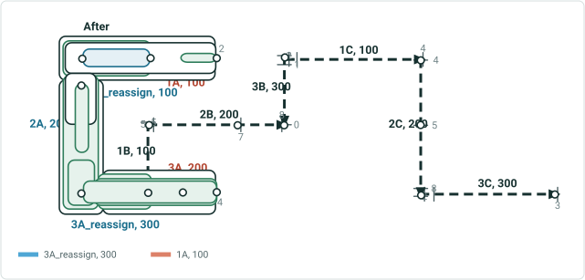

| Rname | Line Name | Line Order | From Date | To Date | From M | To M |
| --- | --- | --- | --- | --- | --- | --- |
| 1A | Red | 100 | 1/1/2000 | 1/1/2020 | 2 | 4 |
| 1A | Red | 100 | 1/1/2020 | null | 2 | 3 |
| 2A | Red | 200 | 1/1/2000 | 1/1/2020 | 0 | 2 |
| 3A | Red | 300 | 1/1/2000 | 1/1/2020 | 0 | 4 |
| 3A | Red | 200 | 1/1/2020 | null | 2 | 4 |
| 1A_reassign | Teal | 100 | 1/1/2020 | null | 3 | 4 |
| 2A | Teal | 200 | 1/1/2020 | null | 0 | 2 |
| 3A_reassign | Teal | 300 | 1/1/2020 | null | 0 | 2 |
| 1B | Blue | 100 | 1/1/2000 | null | 3 | 5 |
| 2B | Blue | 200 | 1/1/2000 | null | 4 | 8 |
| 3B | Blue | 300 | 1/1/2000 | null | 0 | 4 |
| 1C | Gray | 100 | 1/1/2000 | null | 2 | 6 |
| 2C | Gray | 200 | 1/1/2000 | null | 2 | 4 |
| 3C | Gray | 300 | 1/1/2000 | null | 6 | 8 |

| Event ID | From Date | To Date | From Route ID | To Route ID | From M | To M | Location Error |
| --- | --- | --- | --- | --- | --- | --- | --- |
| S1 | 1/1/2000 | <Null> | 1A | 1A | 2 | 2.5 | No Error |
| S2 | 1/1/2000 | 1/1/2020 | 2A | 2A | 1 | 1.5 | No Error |
| S2 | 1/1/2020 | null | 2A | 2A | 1 | 1.5 | No Error |
| S3 | 1/1/2000 | 1/1/2020 | 1A | 1A | 3 | 4 | No Error |
| S3 | 1/1/2020 | null | 1A_reassign | 1A_reassign | 3 | 4 | No Error |
| S4 | 1/1/2000 | 1/1/2020 | 3A | 3A | 0 | 4 | No Error |
| S4 | 1/1/2020 | null | 3A_reassign | 3A_reassign | 0 | 2 | No Error |
| S4 | 1/1/2020 | null | 3A | 3A | 2 | 4 | No Error |
| S5 | 1/1/2000 | 1/1/2020 | 2A | 3A | 1.75 | 4 | No Error |
| S5 | 1/1/2020 | null | 2A | 3A_reassign | 1.75 | 2 | No Error |
| S5 | 1/1/2020 | null | 3A | 3A | 2 | 4 | No Error |
| S6 | 1/1/2000 | 1/1/2020 | 1A | 2A | 2 | 1.25 | No Error |
| S6 | 1/1/2020 | null | 1A | 1A | 2 | 3 | No Error |
| S6 | 1/1/2020 | null | 1A_reassign | 2A | 3 | 1.25 | No Error |
| S7 | 1/1/2000 | 1/1/2020 | 1A | 3A | 3 | 2 | No Error |
| S7 | 1/1/2020 | null | 1A_reassign | 3A_reassign | 3 | 2 | No Error |
| S8 | 1/1/2000 | 1/1/2020 | 1A | 3A | 2 | 4 | No Error |
| S8 | 1/1/2020 | null | 1A | 3A | 2 | 4 | No Error |
| S8 | 1/1/2020 | null | 1A_reassign | 3A_reassign | 3 | 2 | No Error |

## Slide 40


| Rname | Line Name | Line Order | From Date | To Date | From M | To M |
| --- | --- | --- | --- | --- | --- | --- |
| 1A | Red | 100 | 1/1/2000 | 1/1/2020 | 2 | 4 |
| 1A | Red | 100 | 1/1/2020 | null | 2 | 3 |
| 2A | Red | 200 | 1/1/2000 | 1/1/2020 | 0 | 2 |
| 3A | Red | 300 | 1/1/2000 | 1/1/2020 | 0 | 4 |
| 3A | Red | 200 | 1/1/2020 | null | 0 | 2 |
| 1A_reassign | Teal | 100 | 1/1/2020 | null | 3 | 4 |
| 2A | Teal | 200 | 1/1/2020 | null | 0 | 2 |
| 3A_reassign | Teal | 300 | 1/1/2020 | null | 0 | 2 |
| 1B | Blue | 100 | 1/1/2000 | null | 3 | 5 |
| 2B | Blue | 200 | 1/1/2000 | null | 4 | 8 |
| 3B | Blue | 300 | 1/1/2000 | null | 0 | 4 |
| 1C | Gray | 100 | 1/1/2000 | null | 2 | 6 |
| 2C | Gray | 200 | 1/1/2000 | null | 2 | 4 |
| 3C | Gray | 300 | 1/1/2000 | null | 6 | 8 |

| Event ID | From Date | To Date | From Route ID | To Route ID | From M | To M | Location Error |
| --- | --- | --- | --- | --- | --- | --- | --- |
| S1 | 1/1/2000 | <Null> | 1A | 1A | 2 | 2.5 | No Error |
| S2 | 1/1/2000 | 1/1/2020 | 2A | 2A | 1 | 1.5 | No Error |
| S2 | 1/1/2020 | null | 2A | 2A | 1 | 1.5 | No Error |
| S3 | 1/1/2000 | 1/1/2020 | 1A | 1A | 3 | 4 | No Error |
| S3 | 1/1/2020 | null | 1A_reassign | 1A_reassign | 3 | 4 | No Error |
| S4 | 1/1/2000 | 1/1/2020 | 3A | 3A | 0 | 4 | No Error |
| S4 | 1/1/2020 | null | 3A_reassign | 3A_reassign | 0 | 2 | No Error |
| S4 | 1/1/2020 | null | 3A | 3A | 0 | 2 | No Error |
| S5 | 1/1/2000 | 1/1/2020 | 2A | 3A | 1.75 | 4 | No Error |
| S5 | 1/1/2020 | null | 2A | 3A_reassign | 1.75 | 2 | No Error |
| S5 | 1/1/2020 | null | 3A | 3A | 0 | 2 | No Error |
| S6 | 1/1/2000 | 1/1/2020 | 1A | 2A | 2 | 1.25 | No Error |
| S6 | 1/1/2020 | null | 1A | 1A | 2 | 3 | No Error |
| S6 | 1/1/2020 | null | 1A_reassign | 2A | 3 | 1.25 | No Error |
| S7 | 1/1/2000 | 1/1/2020 | 1A | 3A | 3 | 2 | No Error |
| S7 | 1/1/2020 | null | 1A_reassign | 3A_reassign | 3 | 2 | No Error |
| S8 | 1/1/2000 | 1/1/2020 | 1A | 3A | 2 | 4 | No Error |
| S8 | 1/1/2020 | null | 1A | 3A | 2 | 2 | No Error |
| S8 | 1/1/2020 | null | 1A_reassign | 3A_reassign | 3 | 2 | No Error |

Test case 5: Transfer to New Line – transfer 0.5+1+0.5 simple routes; transfer CP; keep original measures; partial routes have to change route name/id –  recalibrate source downstream

## Slide 41 — Test case 6: Transfer to New Line – transfer 0.5+1 simple routes; transfer CP; change measures; partial routes have to

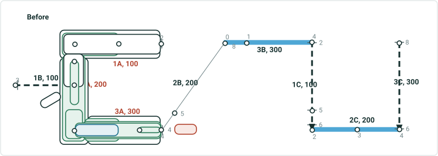

| Rname | Line Name | Line Order | From Date | To Date | From M | To M |
| --- | --- | --- | --- | --- | --- | --- |
| 1A | Red | 100 | 1/1/2000 | null | 2 | 4 |
| 2A | Red | 200 | 1/1/2000 | null | 0 | 2 |
| 3A | Red | 300 | 1/1/2000 | null | 0 | 4 |
| 1B | Blue | 100 | 1/1/2000 | null | 3 | 5 |
| 2B | Blue | 200 | 1/1/2000 | null | 4 | 8 |
| 3B | Blue | 300 | 1/1/2000 | null | 0 | 4 |
| 1C | Gray | 100 | 1/1/2000 | null | 2 | 6 |
| 2C | Gray | 200 | 1/1/2000 | null | 2 | 4 |
| 3C | Gray | 300 | 1/1/2000 | null | 6 | 8 |

| Event ID | From Date | To Date | From Route ID | To Route ID | From M | To M | Location Error |
| --- | --- | --- | --- | --- | --- | --- | --- |
| S1 | 1/1/2000 | <Null> | 3A | 3A | 3 | 4 | No Error |
| S2 | 1/1/2000 | <Null> | 2A | 2A | 1 | 1.5 | No Error |
| S3 | 1/1/2000 | <Null> | 3A | 3A | 0 | 2 | No Error |
| S4 | 1/1/2000 | <Null> | 3A | 3A | 0 | 4 | No Error |
| S5 | 1/1/2000 | <Null> | 2A | 3A | 1.75 | 4 | No Error |
| S6 | 1/1/2000 | <Null> | 1A | 2A | 2 | 1.25 | No Error |
| S7 | 1/1/2000 | <Null> | 1A | 3A | 3 | 2 | No Error |
| S8 | 1/1/2000 | <Null> | 1A | 3A | 2 | 4 | No Error |

Effective date is 1/1/2020
Recal downstream unchecked

## Slide 42 — Test case 6: Transfer to New Line – transfer 0.5+1 simple routes; transfer CP; change measures; partial routes have to

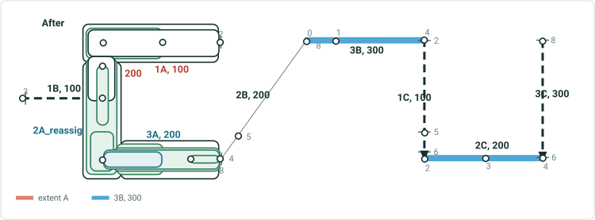

| Rname | Line Name | Line Order | From Date | To Date | From M | To M |
| --- | --- | --- | --- | --- | --- | --- |
| 1A | Red | 100 | 1/1/2000 | null | 2 | 4 |
| 2A | Red | 200 | 1/1/2000 | 1/1/2020 | 0 | 2 |
| 2A | Red | 200 | 1/1/2020 | null | 0 | 1.25 |
| 3A | Red | 300 | 1/1/2000 | 1/1/2020 | 0 | 4 |
| 2A_reassign | Teal | 100 | 1/1/2020 | null | 2 | 3 |
| 3A | Teal | 200 | 1/1/2020 | null | 0 | 8 |
| 1B | Blue | 100 | 1/1/2000 | null | 3 | 5 |
| 2B | Blue | 200 | 1/1/2000 | null | 4 | 8 |
| 3B | Blue | 300 | 1/1/2000 | null | 0 | 4 |
| 1C | Gray | 100 | 1/1/2000 | null | 2 | 6 |
| 2C | Gray | 200 | 1/1/2000 | null | 2 | 4 |
| 3C | Gray | 300 | 1/1/2000 | null | 6 | 8 |

| Event ID | From Date | To Date | From Route ID | To Route ID | From M | To M | Location Error |
| --- | --- | --- | --- | --- | --- | --- | --- |
| S1 | 1/1/2000 | 1/1/2020 | 3A | 3A | 3 | 4 | No Error |
| S1 | 1/1/2020 | null | 3A | 3A | 6 | 8 | No Error |
| S2 | 1/1/2000 | <Null> | 2A | 2A | 1 | 1.5 | No Error |
| S2 | 1/1/2020 | null | 2A | 2A | 1 | 1.25 | No Error |
| S2 | 1/1/2020 | null | 2A_reassign | 2A_reassign | 2 | 2.5 | No Error |
| S3 | 1/1/2000 | 1/1/2020 | 3A | 3A | 0 | 2 | No Error |
| S3 | 1/1/2020 | <Null> | 3A | 3A | 0 | 4 | No Error |
| S4 | 1/1/2000 | 1/1/2020 | 3A | 3A | 0 | 4 | No Error |
| S4 | 1/1/2020 | <Null> | 3A | 3A | 0 | 8 | No Error |
| S5 | 1/1/2000 | 1/1/2020 | 2A | 3A | 1.75 | 4 | No Error |
| S5 | 1/1/2020 | <Null> | 2A_reassign | 3A | 2.75 | 8 | No Error |
| S6 | 1/1/2000 | 1/1/2020 | 1A | 2A | 2 | 1.25 | No Error |
| S6 | 1/1/2020 | <Null> | 1A | 2A | 2 | 1.25 | No Error |
| S7 | 1/1/2000 | 1/1/2020 | 1A | 3A | 3 | 2 | No Error |
| S7 | 1/1/2020 | <Null> | 1A | 2A | 3 | 1.25 | No Error |
| S7 | 1/1/2020 | <Null> | 2A_reassign | 3A | 2 | 4 | No Error |
| S8 | 1/1/2000 | 1/1/2020 | 1A | 3A | 2 | 4 | No Error |
| S8 | 1/1/2020 | <Null> | 1A | 2A | 2 | 1.25 | No Error |
| S8 | 1/1/2020 | <Null> | 2A_reassign | 3A | 2 | 8 | No Error |

## Slide 43 — Test case 8: Transfer to New Line – transfer 1+0.5 simple routes; routes on source line have concurrent routes that

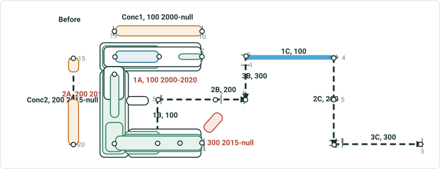

| Rname | Line Name | Line Order | From Date | To Date | From M | To M |
| --- | --- | --- | --- | --- | --- | --- |
| 1A | Red | 100 | 1/1/2000 | 1/1/2020 | 2 | 4 |
| 2A | Red | 200 | 1/1/2010 | 1/1/2020 | 0 | 2 |
| 3A | Red | 300 | 1/1/2015 | 1/1/2020 | 0 | 4 |
| 2A | Red | 100 | 1/1/2020 | null | 0 | 2 |
| 3A | Red | 200 | 1/1/2020 | null | 0 | 4 |
| Conc1 | Orange | 100 | 1/1/2000 | null | 10 | 15 |
| Conc2 | Orange | 200 | 1/1/2015 | null | 15 | 20 |
| 1B | Blue | 100 | 1/1/2000 | null | 3 | 5 |
| 2B | Blue | 200 | 1/1/2000 | null | 4 | 8 |
| 3B | Blue | 300 | 1/1/2000 | null | 0 | 4 |
| 1C | Gray | 100 | 1/1/2000 | null | 2 | 6 |
| 2C | Gray | 200 | 1/1/2000 | null | 2 | 4 |
| 3C | Gray | 300 | 1/1/2000 | null | 6 | 8 |

| Event ID | From Date | To Date | From Route ID | To Route ID | From M | To M | Location Error |
| --- | --- | --- | --- | --- | --- | --- | --- |
| S1 | 1/1/2000 | <Null> | 1A | 1A | 2 | 2.5 | No Error |
| S2 | 1/1/2010 | <Null> | 2A | 2A | 1 | 1.5 | No Error |
| S3 | 1/1/2000 | <Null> | 1A | 1A | 3 | 4 | No Error |
| S4 | 1/1/2015 | <Null> | 3A | 3A | 0 | 4 | No Error |
| S5 | 1/1/2010 | 1/1/2015 | 2A | 2A | 1.75 | 2 | No Error |
| S5 | 1/1/2015 | <Null> | 2A | 3A | 1.75 | 4 | No Error |
| S6 | 1/1/2000 | 1/1/2010 | 1A | 1A | 2 | 4 | No Error |
| S6 | 1/1/2010 | <Null> | 1A | 2A | 2 | 1.25 | No Error |
| S7 | 1/1/2000 | 1/1/2010 | 1A | 1A | 3 | 4 | No Error |
| S7 | 1/1/2010 | 1/1/2015 | 1A | 2A | 3 | 2 | No Error |
| S7 | 1/1/2015 | <Null> | 1A | 3A | 3 | 2 | No Error |
| S8 | 1/1/2000 | 1/1/2010 | 1A | 1A | 2 | 4 | No Error |
| S8 | 1/1/2010 | 1/1/2015 | 1A | 2A | 2 | 2 | No Error |
| S8 | 1/1/2015 | <Null> | 1A | 3A | 2 | 4 | No Error |

| Event ID | From Date | To Date | From Route ID | To Route ID | From M | To M | Location Error |
| --- | --- | --- | --- | --- | --- | --- | --- |
| Sconc1 | 1/1/2000 | 1/1/2015 | Conc1 | Conc1 | 10 | 15 | No Error |
| Sconc1 | 1/1/2015 | <Null> | Conc1 | Conc2 | 10 | 16 | No Error |
| Sconc2 | 1/1/2015 | <Null> | Conc2 | Conc2 | 17.5 | 20 | No Error |

In 2000, create 1A
In 2010, create 2A
In 2015, create 3A and conc1
In 2020, retire1A
In 2025, transfer part 2A & 3A, recal downstream unchecked

| [{"id":19,"retireRoute":{"retireDate":,"routeId":"CW44_2C","toRouteId":"CW44_2C","fromMeasure":0,"toMeasure":2,"recalibrateRouteDownstream":true}}] |
| --- |

## Slide 44 — Test case 8: Transfer to New Line – transfer 1+0.5 simple routes; routes on source line have concurrent routes that

2A_reassign, 100
2025-null

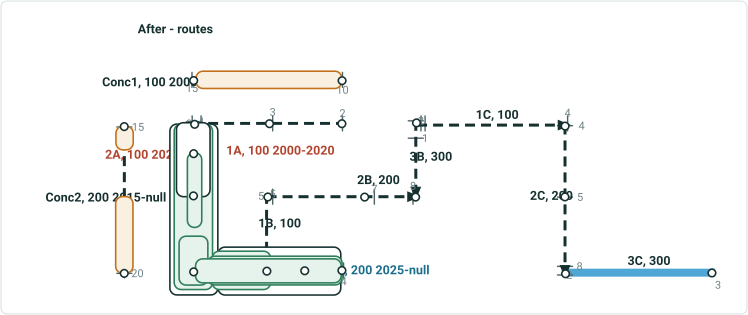

| Rname | Line Name | Line Order | From Date | To Date | From M | To M |
| --- | --- | --- | --- | --- | --- | --- |
| 1A | Red | 100 | 1/1/2000 | 1/1/2020 | 2 | 4 |
| 2A | Red | 200 | 1/1/2010 | 1/1/2015 | 0 | 2 |
| 3A | Red | 300 | 1/1/2015 | 1/1/2020 | 0 | 4 |
| 2A | Red | 100 | 1/1/2020 | 1/1/2025 | 0 | 2 |
| 3A | Red | 200 | 1/1/2020 | 1/1/2025 | 0 | 4 |
| 2A | Red | 100 | 1/1/2025 | null | 0 | 1.25 |
| 2A_reassign | Teal | 100 | 1/1/2025 | null | 2 | 3 |
| 3A | Teal | 200 | 1/1/2025 | null | 0 | 4 |
| Conc1 | Orange | 100 | 1/1/2000 | null | 10 | 15 |
| Conc2 | Orange | 200 | 1/1/2015 | null | 15 | 20 |
| 1B | Blue | 100 | 1/1/2000 | null | 3 | 5 |
| 2B | Blue | 200 | 1/1/2000 | null | 4 | 8 |
| 3B | Blue | 300 | 1/1/2000 | null | 0 | 4 |
| 1C | Gray | 100 | 1/1/2000 | null | 2 | 6 |
| 2C | Gray | 200 | 1/1/2000 | null | 2 | 4 |
| 3C | Gray | 300 | 1/1/2000 | null | 6 | 8 |

In 2000, create 1A
In 2010, create 2A
In 2015, create 3A and conc1
In 2020, retire1A
In 2025, transfer part 2A & 3A, recal downstream unchecked

## Slide 45 — Test case 8: Transfer to New Line – transfer 1+0.5 simple routes; routes on source line have concurrent routes that

2A_reassign, 100
2025-null

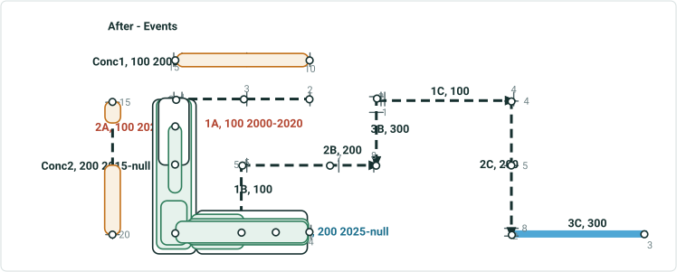

| Event ID | From Date | To Date | From Route ID | To Route ID | From M | To M | Location Error |
| --- | --- | --- | --- | --- | --- | --- | --- |
| S1 | 1/1/2000 | 1/1/2020 | 1A | 1A | 2 | 2.5 | No Error |
| S2 | 1/1/2010 | 1/1/2025 | 2A | 2A | 1 | 1.5 | No Error |
| S2 | 1/1/2025 | <Null> | 2A | 2A | 1 | 1.25 | No Error |
| S2 | 1/1/2025 | <Null> | 2A_reassign | 2A_reassign | 2 | 2.5 | No Error |
| S3 | 1/1/2000 | 1/1/2020 | 1A | 1A | 3 | 4 | No Error |
| S4 | 1/1/2015 | 1/1/2025 | 3A | 3A | 0 | 4 | No Error |
| S4 | 1/1/2025 | <Null> | 3A | 3A | 0 | 4 | No Error |
| S5 | 1/1/2010 | 1/1/2015 | 2A | 2A | 1.75 | 2 | No Error |
| S5 | 1/1/2015 | 1/1/2025 | 2A | 3A | 1.75 | 4 | No Error |
| S5 | 1/1/2025 | <Null> | 2A_reassign | 3A | 2.75 | 4 | No Error |
| S6 | 1/1/2000 | 1/1/2010 | 1A | 1A | 2 | 4 | No Error |
| S6 | 1/1/2010 | 1/1/2020 | 1A | 2A | 2 | 1.25 | No Error |
| S6 | 1/1/2020 | <Null> | 2A | 2A | 0 | 1.25 | No Error |
| S7 | 1/1/2000 | 1/1/2010 | 1A | 1A | 3 | 4 | No Error |
| S7 | 1/1/2010 | 1/1/2015 | 1A | 2A | 3 | 2 | No Error |
| S7 | 1/1/2015 | 1/1/2020 | 1A | 3A | 3 | 2 | No Error |
| S7 | 1/1/2020 | 1/1/2025 | 2A | 3A | 0 | 2 | No Error |
| S7 | 1/1/2025 | <Null> | 2A | 2A | 0 | 1.25 | No Error |
| S7 | 1/1/2025 | <Null> | 2A_reassign | 3A | 2 | 2 | No Error |
| S8 | 1/1/2000 | 1/1/2010 | 1A | 1A | 2 | 4 | No Error |
| S8 | 1/1/2010 | 1/1/2015 | 1A | 2A | 2 | 2 | No Error |
| S8 | 1/1/2015 | 1/1/2020 | 1A | 3A | 2 | 4 | No Error |
| S8 | 1/1/2020 | 1/1/2025 | 2A | 3A | 0 | 4 | No Error |
| S8 | 1/1/2025 | <Null> | 2A | 2A | 0 | 1.25 | No Error |
| S8 | 1/1/2025 | <Null> | 2A_reassign | 3A | 2 | 4 | No Error |

| Event ID | From Date | To Date | From Route ID | To Route ID | From M | To M | Location Error |
| --- | --- | --- | --- | --- | --- | --- | --- |
| Sconc1 | 1/1/2000 | 1/1/2015 | Conc1 | Conc1 | 10 | 15 | No Error |
| Sconc1 | 1/1/2015 | <Null> | Conc1 | Conc2 | 10 | 16 | No Error |
| Sconc2 | 1/1/2015 | <Null> | Conc2 | Conc2 | 17.5 | 20 | No Error |

In 2000, create 1A
In 2010, create 2A
In 2015, create 3A and conc1
In 2020, retire1A
In 2025, transfer part 2A & 3A, recal downstream unchecked

## Slide 46 — Test case 9: Transfer to New Line – transfer 3 entire simple routes; transfer CP; keep original measures; keep original


| Rname | Line Name | Line Order | From Date | To Date | From M | To M |
| --- | --- | --- | --- | --- | --- | --- |
| 1A | Red | 100 | 1/1/2000 | null | 2 | 4 |
| 2A | Red | 200 | 1/1/2000 | null | 0 | 2 |
| 3A | Red | 300 | 1/1/2000 | null | 0 | 4 |
| 1B | Blue | 100 | 1/1/2000 | null | 3 | 5 |
| 2B | Blue | 200 | 1/1/2000 | null | 4 | 8 |
| 3B | Blue | 300 | 1/1/2000 | null | 0 | 4 |
| 1C | Gray | 100 | 1/1/2000 | null | 2 | 6 |
| 2C | Gray | 200 | 1/1/2000 | null | 2 | 4 |
| 3C | Gray | 300 | 1/1/2000 | null | 6 | 8 |

| Event ID | From Date | To Date | From Route ID | To Route ID | From M | To M | Location Error |
| --- | --- | --- | --- | --- | --- | --- | --- |
| S_blue | 1/1/2000 | <Null> | 1B | 2B | 4 | 5 | No Error |

Showing this event for once to indicate events on other lines will not be affected

| Event ID | From Date | To Date | Route ID | From M | To M | Location Error |
| --- | --- | --- | --- | --- | --- | --- |
| S1 | 1/1/2000 | <Null> | 1A | 2 | 2.5 | No Error |
| S2 | 1/1/2000 | <Null> | 2A | 1 | 1.5 | No Error |
| S3 | 1/1/2000 | <Null> | 1A | 3 | 4 | No Error |
| S4 | 1/1/2000 | <Null> | 3A | 0 | 4 | No Error |
| S5a | 1/1/2000 | <Null> | 2A | 1.75 | 2 | No Error |
| S5b | 1/1/2000 | <Null> | 3A | 0 | 4 | No Error |
| S6a | 1/1/2000 | <Null> | 1A | 2 | 4 | No Error |
| S6b | 1/1/2000 | <Null> | 2A | 0 | 1.25 | No Error |
| S7a | 1/1/2000 | <Null> | 1A | 3 | 4 | No Error |
| S7b | 1/1/2000 | <Null> | 2A | 0 | 2 | No Error |
| S7c | 1/1/2000 | <Null> | 3A | 0 | 2 | No Error |
| S8a | 1/1/2000 | <Null> | 1A | 2 | 4 | No Error |
| S8b | 1/1/2000 | <Null> | 2A | 0 | 2 | No Error |
| S8c | 1/1/2000 | <Null> | 3A | 0 | 4 | No Error |

Effective date is 1/1/2020
Recal downstream unchecked

## Slide 47 — Test case 9: Transfer to New Line – transfer 3 entire simple routes; transfer CP; keep original measures; keep original

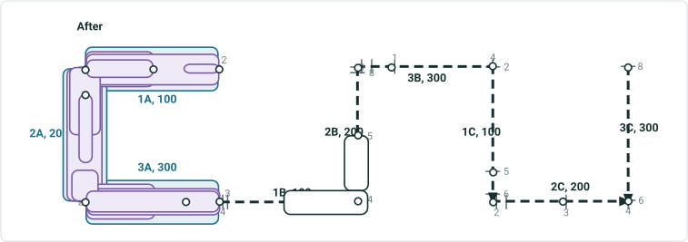

| Rname | Line Name | Line Order | From Date | To Date | From M | To M |
| --- | --- | --- | --- | --- | --- | --- |
| 1A | Red | 100 | 1/1/2000 | 1/1/2020 | 2 | 4 |
| 2A | Red | 200 | 1/1/2000 | 1/1/2020 | 0 | 2 |
| 3A | Red | 300 | 1/1/2000 | 1/1/2020 | 0 | 4 |
| 1A | Teal | 100 | 1/1/2020 | null | 2 | 4 |
| 2A | Teal | 200 | 1/1/2020 | null | 0 | 2 |
| 3A | Teal | 300 | 1/1/2020 | null | 0 | 4 |
| 1B | Blue | 100 | 1/1/2000 | null | 3 | 5 |
| 2B | Blue | 200 | 1/1/2000 | null | 4 | 8 |
| 3B | Blue | 300 | 1/1/2000 | null | 0 | 4 |
| 1C | Gray | 100 | 1/1/2000 | null | 2 | 6 |
| 2C | Gray | 200 | 1/1/2000 | null | 2 | 4 |
| 3C | Gray | 300 | 1/1/2000 | null | 6 | 8 |

| Event ID | From Date | To Date | From Route ID | To Route ID | From M | To M | Location Error |
| --- | --- | --- | --- | --- | --- | --- | --- |
| S_blue | 1/1/2000 | <Null> | 1B | 2B | 4 | 5 | No Error |

| Event ID | From Date | To Date | Route ID | From M | To M | Location Error |
| --- | --- | --- | --- | --- | --- | --- |
| S1 | 1/1/2000 | 1/1/2020 | 1A | 2 | 2.5 | No Error |
| S2 | 1/1/2000 | 1/1/2020 | 2A | 1 | 1.5 | No Error |
| S3 | 1/1/2000 | 1/1/2020 | 1A | 3 | 4 | No Error |
| S4 | 1/1/2000 | 1/1/2020 | 3A | 0 | 4 | No Error |
| S5a | 1/1/2000 | 1/1/2020 | 2A | 1.75 | 2 | No Error |
| S5b | 1/1/2000 | 1/1/2020 | 3A | 0 | 4 | No Error |
| S6a | 1/1/2000 | 1/1/2020 | 1A | 2 | 4 | No Error |
| S6b | 1/1/2000 | 1/1/2020 | 2A | 0 | 1.25 | No Error |
| S7a | 1/1/2000 | 1/1/2020 | 1A | 3 | 4 | No Error |
| S7b | 1/1/2000 | 1/1/2020 | 2A | 0 | 2 | No Error |
| S7c | 1/1/2000 | 1/1/2020 | 3A | 0 | 2 | No Error |
| S8a | 1/1/2000 | 1/1/2020 | 1A | 2 | 4 | No Error |
| S8b | 1/1/2000 | 1/1/2020 | 2A | 0 | 2 | No Error |
| S8c | 1/1/2000 | 1/1/2020 | 3A | 0 | 4 | No Error |

| S1 | 1/1/2020 | <Null> | 1A | 2 | 2.5 | No Error |
| --- | --- | --- | --- | --- | --- | --- |
| S2 | 1/1/2020 | <Null> | 2A | 1 | 1.5 | No Error |
| S3 | 1/1/2020 | <Null> | 1A | 3 | 4 | No Error |
| S4 | 1/1/2020 | <Null> | 3A | 0 | 4 | No Error |
| S5a | 1/1/2020 | <Null> | 2A | 1.75 | 2 | No Error |
| S5b | 1/1/2020 | <Null> | 3A | 0 | 4 | No Error |
| S6a | 1/1/2020 | <Null> | 1A | 2 | 4 | No Error |
| S6b | 1/1/2020 | <Null> | 2A | 0 | 1.25 | No Error |
| S7a | 1/1/2020 | <Null> | 1A | 3 | 4 | No Error |
| S7b | 1/1/2020 | <Null> | 2A | 0 | 2 | No Error |
| S7c | 1/1/2020 | <Null> | 3A | 0 | 2 | No Error |
| S8a | 1/1/2020 | <Null> | 1A | 2 | 4 | No Error |
| S8b | 1/1/2020 | <Null> | 2A | 0 | 2 | No Error |
| S8c | 1/1/2020 | <Null> | 3A | 0 | 4 | No Error |

## Slide 48 — Test case 9-b: Transfer to New Line – 2 separate transfers; transfer CP; keep original measures; partial routes change

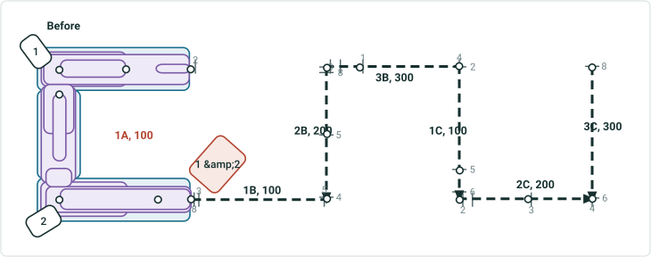

| Rname | Line Name | Line Order | From Date | To Date | From M | To M |
| --- | --- | --- | --- | --- | --- | --- |
| 1A | Red | 100 | 1/1/2000 | null | 2 | 8 |
| 1B | Blue | 100 | 1/1/2000 | null | 3 | 5 |
| 2B | Blue | 200 | 1/1/2000 | null | 4 | 8 |
| 3B | Blue | 300 | 1/1/2000 | null | 0 | 4 |
| 1C | Gray | 100 | 1/1/2000 | null | 2 | 6 |
| 2C | Gray | 200 | 1/1/2000 | null | 2 | 4 |
| 3C | Gray | 300 | 1/1/2000 | null | 6 | 8 |

| Event ID | From Date | To Date | Route ID | From M | To M | Location Error |
| --- | --- | --- | --- | --- | --- | --- |
| S1 | 1/1/2000 | <Null> | 1A | 2 | 2.5 | No Error |
| S2 | 1/1/2000 | <Null> | 1A | 5 | 5.5 | No Error |
| S3 | 1/1/2000 | <Null> | 1A | 3 | 4 | No Error |
| S4 | 1/1/2000 | <Null> | 1A | 6 | 8 | No Error |
| S5 | 1/1/2000 | <Null> | 1A | 5.75 | 8 | No Error |
| S6 | 1/1/2000 | <Null> | 1A | 2 | 5.25 | No Error |
| S7 | 1/1/2000 | <Null> | 1A | 3 | 6.5 | No Error |
| S8 | 1/1/2000 | <Null> | 1A | 2 | 8 | No Error |

First transfer is 1/1/2020
Second transfer is 1/1/2030
Recal downstream unchecked

## Slide 49 — Test case 9-b: Transfer to New Line – 2 separate transfers; transfer CP; keep original measures; partial routes change

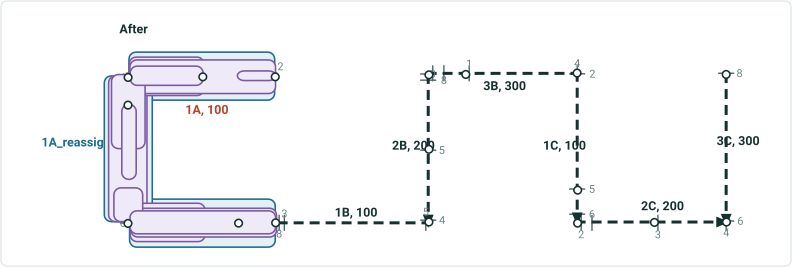

| Rname | Line Name | Line Order | From Date | To Date | From M | To M |
| --- | --- | --- | --- | --- | --- | --- |
| 1A | Red | 100 | 1/1/2000 | 1/1/2020 | 2 | 8 |
| 1A | Red | 100 | 1/1/2020 | null | 2 | 4 |
| 1A_reassign | Teal | 100 | 1/1/2020 | 1/1/2030 | 4 | 8 |
| 1A_reassign | Teal | 100 | 1/1/2030 | null | 4 | 6 |
| 1A_reassign_reassign | Yellow | 100 | 1/1/2030 | null | 6 | 8 |
| 1B | Blue | 100 | 1/1/2000 | null | 3 | 5 |
| 2B | Blue | 200 | 1/1/2000 | null | 4 | 8 |
| 3B | Blue | 300 | 1/1/2000 | null | 0 | 4 |
| 1C | Gray | 100 | 1/1/2000 | null | 2 | 6 |
| 2C | Gray | 200 | 1/1/2000 | null | 2 | 4 |
| 3C | Gray | 300 | 1/1/2000 | null | 6 | 8 |

1A_reassign_reassign, 100

| Event ID | From Date | To Date | Route ID | From M | To M | Location Error |
| --- | --- | --- | --- | --- | --- | --- |
| S1 | 1/1/2000 | <Null> | 1A | 2 | 2.5 | No Error |
| S2 | 1/1/2000 | 1/1/2020 | 1A | 5 | 5.5 | No Error |
| S2 | 1/1/2020 | <Null> | 1A_reassign | 5 | 5.5 | No Error |
| S3 | 1/1/2000 | <Null> | 1A | 3 | 4 | No Error |
| S4 | 1/1/2000 | 1/1/2020 | 1A | 6 | 8 | No Error |
| S4 | 1/1/2020 | 1/1/2030 | 1A_reassign | 6 | 8 | No Error |
| S4 | 1/1/2030 | null | 1A_reassign_reassign | 6 | 8 | No Error |
| S5 | 1/1/2000 | 1/1/2020 | 1A | 5.75 | 8 | No Error |
| S5 | 1/1/2020 | 1/1/2030 | 1A_reassign | 5.75 | 8 | No Error |
| S5 | 1/1/2030 | null | 1A_reassign | 5.75 | 6 | No Error |
| S5 | 1/1/2030 | null | 1A_reassign_reassign | 6 | 8 | No Error |
| S6 | 1/1/2000 | 1/1/2020 | 1A | 2 | 5.25 | No Error |
| S6 | 1/1/2020 | null | 1A | 2 | 4 | No Error |
| S6 | 1/1/2020 | <Null> | 1A_reassign | 4 | 5.25 | No Error |
| S7 | 1/1/2000 | <Null> | 1A | 3 | 6.5 | No Error |
| S7 | 1/1/2020 | null | 1A | 3 | 4 | No Error |
| S7 | 1/1/2020 | 1/1/2030 | 1A_reassign | 4 | 6.5 | No Error |
| S7 | 1/1/2030 | null | 1A_reassign | 4 | 6 | No Error |
| S7 | 1/1/2030 | null | 1A_reassign_reassign | 6 | 6.5 | No Error |
| S8 | 1/1/2000 | 1/1/2020 | 1A | 2 | 8 | No Error |
| S8 | 1/1/2020 | <Null> | 1A | 2 | 4 | No Error |
| S8 | 1/1/2020 | 1/1/2030 | 1A_reassign | 4 | 8 | No Error |
| S8 | 1/1/2030 | null | 1A_reassign | 4 | 6 | No Error |
| S8 | 1/1/2030 | null | 1A_reassign_reassign | 6 | 8 | No Error |

## Slide 50 — Test case 11: Transfer to New Line – transfer 0.5+1+0.5 simple routes; transfer CP; keep original measures; partial


| Rname | Line Name | Line Order | From Date | To Date | From M | To M |
| --- | --- | --- | --- | --- | --- | --- |
| 1A | Red | 100 | 1/1/2000 | null | 2 | 4 |
| 2A | Red | 200 | 1/1/2000 | null | 0 | 2 |
| 3A | Red | 300 | 1/1/2000 | null | 0 | 4 |
| 1B | Blue | 100 | 1/1/2000 | null | 3 | 5 |
| 2B | Blue | 200 | 1/1/2000 | null | 4 | 8 |
| 3B | Blue | 300 | 1/1/2000 | null | 0 | 4 |
| 1C | Gray | 100 | 1/1/2000 | null | 2 | 6 |
| 2C | Gray | 200 | 1/1/2000 | null | 2 | 4 |
| 3C | Gray | 300 | 1/1/2000 | null | 6 | 8 |

| Event ID | From Date | To Date | Route ID | From M | To M | Location Error |
| --- | --- | --- | --- | --- | --- | --- |
| S1 | 1/1/2000 | <Null> | 1A | 2 | 2.5 | No Error |
| S2 | 1/1/2000 | <Null> | 2A | 1 | 1.5 | No Error |
| S3 | 1/1/2000 | <Null> | 1A | 3 | 4 | No Error |
| S4 | 1/1/2000 | <Null> | 3A | 0 | 4 | No Error |
| S5a | 1/1/2000 | <Null> | 2A | 1.75 | 2 | No Error |
| S5b | 1/1/2000 | <Null> | 3A | 0 | 4 | No Error |
| S6a | 1/1/2000 | <Null> | 1A | 2 | 4 | No Error |
| S6b | 1/1/2000 | <Null> | 2A | 0 | 1.25 | No Error |
| S7a | 1/1/2000 | <Null> | 1A | 3 | 4 | No Error |
| S7b | 1/1/2000 | <Null> | 2A | 0 | 2 | No Error |
| S7c | 1/1/2000 | <Null> | 3A | 0 | 2 | No Error |
| S8a | 1/1/2000 | <Null> | 1A | 2 | 4 | No Error |
| S8b | 1/1/2000 | <Null> | 2A | 0 | 2 | No Error |
| S8c | 1/1/2000 | <Null> | 3A | 0 | 4 | No Error |

Effective date is 1/1/2020
This case has 2 variations for recal downstream option.

## Slide 51 — Test case 11: Transfer to New Line – transfer 0.5+1+0.5 simple routes; transfer CP; keep original measures; partial

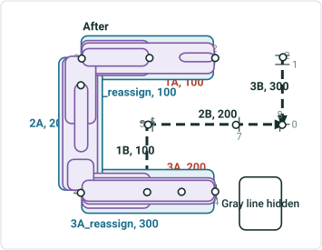

| Rname | Line Name | Line Order | From Date | To Date | From M | To M |
| --- | --- | --- | --- | --- | --- | --- |
| 1A | Red | 100 | 1/1/2000 | 1/1/2020 | 2 | 4 |
| 1A | Red | 100 | 1/1/2020 | null | 2 | 3 |
| 2A | Red | 200 | 1/1/2000 | 1/1/2020 | 0 | 2 |
| 3A | Red | 300 | 1/1/2000 | 1/1/2020 | 0 | 4 |
| 3A | Red | 200 | 1/1/2020 | null | 2 | 4 |
| 1A_reassign | Teal | 100 | 1/1/2020 | null | 3 | 4 |
| 2A | Teal | 200 | 1/1/2020 | null | 0 | 2 |
| 3A_reassign | Teal | 300 | 1/1/2020 | null | 0 | 2 |
| 1B | Blue | 100 | 1/1/2000 | null | 3 | 5 |
| 2B | Blue | 200 | 1/1/2000 | null | 4 | 8 |
| 3B | Blue | 300 | 1/1/2000 | null | 0 | 4 |
| 1C | Gray | 100 | 1/1/2000 | null | 2 | 6 |
| 2C | Gray | 200 | 1/1/2000 | null | 2 | 4 |
| 3C | Gray | 300 | 1/1/2000 | null | 6 | 8 |

| Event ID | From Date | To Date | Route ID | From M | To M | Location Error |
| --- | --- | --- | --- | --- | --- | --- |
| S1 | 1/1/2000 | <Null> | 1A | 2 | 2.5 | No Error |
| S2 | 1/1/2000 | 1/1/2020 | 2A | 1 | 1.5 | No Error |
| S2 | 1/1/2020 | <Null> | 2A | 1 | 1.5 | No Error |
| S3 | 1/1/2000 | 1/1/2020 | 1A | 3 | 4 | No Error |
| S3 | 1/1/2020 | <Null> | 1A_reassign | 3 | 4 | No Error |
| S4 | 1/1/2000 | 1/1/2020 | 3A | 0 | 4 | No Error |
| S4 | 1/1/2020 | <Null> | 3A_reassign | 0 | 2 | No Error |
| S4 | 1/1/2020 | <Null> | 3A | 2 | 4 | No Error |
| S5a | 1/1/2000 | 1/1/2020 | 2A | 1.75 | 2 | No Error |
| S5a | 1/1/2020 | <Null> | 2A | 1.75 | 2 | No Error |
| S5b | 1/1/2000 | 1/1/2020 | 3A | 0 | 4 | No Error |
| S5b | 1/1/2020 | <Null> | 3A_reassign | 0 | 2 | No Error |
| S5b | 1/1/2020 | <Null> | 3A | 2 | 4 | No Error |
| S6a | 1/1/2000 | 1/1/2020 | 1A | 2 | 4 | No Error |
| S6a | 1/1/2020 | <Null> | 1A | 2 | 3 | No Error |
| S6a | 1/1/2020 | <Null> | 1A_reassign | 3 | 4 | No Error |
| S6b | 1/1/2000 | 1/1/2020 | 2A | 0 | 1.25 | No Error |
| S6b | 1/1/2020 | <Null> | 2A | 0 | 1.25 | No Error |
| S7a | 1/1/2000 | 1/1/2020 | 1A | 3 | 4 | No Error |
| S7a | 1/1/2020 | <Null> | 1A_reassign | 3 | 4 | No Error |
| S7b | 1/1/2000 | 1/1/2020 | 2A | 0 | 2 | No Error |
| S7b | 1/1/2020 | <Null> | 2A | 0 | 2 | No Error |
| S7c | 1/1/2000 | 1/1/2020 | 3A | 0 | 2 | No Error |
| S7c | 1/1/2020 | <Null> | 3A_reassign | 0 | 2 | No Error |
| S8a | 1/1/2000 | 1/1/2020 | 1A | 2 | 4 | No Error |
| S8a | 1/1/2020 | <Null> | 1A | 2 | 3 | No Error |
| S8a | 1/1/2020 | <Null> | 1A_reassign | 3 | 4 | No Error |
| S8b | 1/1/2000 | 1/1/2020 | 2A | 0 | 2 | No Error |
| S8b | 1/1/2020 | <Null> | 2A | 0 | 2 | No Error |
| S8c | 1/1/2000 | 1/1/2020 | 3A | 0 | 4 | No Error |
| S8c | 1/1/2020 | <Null> | 3A_reassign | 0 | 2 | No Error |
| S8c | 1/1/2020 | <Null> | 3A | 2 | 4 | No Error |

## Slide 52


| Rname | Line Name | Line Order | From Date | To Date | From M | To M |
| --- | --- | --- | --- | --- | --- | --- |
| 1A | Red | 100 | 1/1/2000 | 1/1/2020 | 2 | 4 |
| 1A | Red | 100 | 1/1/2020 | null | 2 | 3 |
| 2A | Red | 200 | 1/1/2000 | 1/1/2020 | 0 | 2 |
| 3A | Red | 300 | 1/1/2000 | 1/1/2020 | 0 | 4 |
| 3A | Red | 200 | 1/1/2020 | null | 0 | 2 |
| 1A_reassign | Teal | 100 | 1/1/2020 | null | 3 | 4 |
| 2A | Teal | 200 | 1/1/2020 | null | 0 | 2 |
| 3A_reassign | Teal | 300 | 1/1/2020 | null | 0 | 2 |
| 1B | Blue | 100 | 1/1/2000 | null | 3 | 5 |
| 2B | Blue | 200 | 1/1/2000 | null | 4 | 8 |
| 3B | Blue | 300 | 1/1/2000 | null | 0 | 4 |
| 1C | Gray | 100 | 1/1/2000 | null | 2 | 6 |
| 2C | Gray | 200 | 1/1/2000 | null | 2 | 4 |
| 3C | Gray | 300 | 1/1/2000 | null | 6 | 8 |

| Event ID | From Date | To Date | Route ID | From M | To M | Location Error |
| --- | --- | --- | --- | --- | --- | --- |
| S1 | 1/1/2000 | <Null> | 1A | 2 | 2.5 | No Error |
| S2 | 1/1/2000 | 1/1/2020 | 2A | 1 | 1.5 | No Error |
| S2 | 1/1/2020 | <Null> | 2A | 1 | 1.5 | No Error |
| S3 | 1/1/2000 | 1/1/2020 | 1A | 3 | 4 | No Error |
| S3 | 1/1/2020 | <Null> | 1A_reassign | 3 | 4 | No Error |
| S4 | 1/1/2000 | 1/1/2020 | 3A | 0 | 4 | No Error |
| S4 | 1/1/2020 | <Null> | 3A_reassign | 0 | 2 | No Error |
| S4 | 1/1/2020 | <Null> | 3A | 0 | 2 | No Error |
| S5a | 1/1/2000 | 1/1/2020 | 2A | 1.75 | 2 | No Error |
| S5a | 1/1/2020 | <Null> | 2A | 1.75 | 2 | No Error |
| S5b | 1/1/2000 | 1/1/2020 | 3A | 0 | 4 | No Error |
| S5b | 1/1/2020 | <Null> | 3A_reassign | 0 | 2 | No Error |
| S5b | 1/1/2020 | <Null> | 3A | 0 | 2 | No Error |
| S6a | 1/1/2000 | 1/1/2020 | 1A | 2 | 4 | No Error |
| S6a | 1/1/2020 | <Null> | 1A | 2 | 3 | No Error |
| S6a | 1/1/2020 | <Null> | 1A_reassign | 3 | 4 | No Error |
| S6b | 1/1/2000 | 1/1/2020 | 2A | 0 | 1.25 | No Error |
| S6b | 1/1/2020 | <Null> | 2A | 0 | 1.25 | No Error |
| S7a | 1/1/2000 | 1/1/2020 | 1A | 3 | 4 | No Error |
| S7a | 1/1/2020 | <Null> | 1A_reassign | 3 | 4 | No Error |
| S7b | 1/1/2000 | 1/1/2020 | 2A | 0 | 2 | No Error |
| S7b | 1/1/2020 | <Null> | 2A | 0 | 2 | No Error |
| S7c | 1/1/2000 | 1/1/2020 | 3A | 0 | 2 | No Error |
| S7c | 1/1/2020 | <Null> | 3A_reassign | 0 | 2 | No Error |
| S8a | 1/1/2000 | 1/1/2020 | 1A | 2 | 4 | No Error |
| S8a | 1/1/2020 | <Null> | 1A | 2 | 3 | No Error |
| S8a | 1/1/2020 | <Null> | 1A_reassign | 3 | 4 | No Error |
| S8b | 1/1/2000 | 1/1/2020 | 2A | 0 | 2 | No Error |
| S8b | 1/1/2020 | <Null> | 2A | 0 | 2 | No Error |
| S8c | 1/1/2000 | 1/1/2020 | 3A | 0 | 4 | No Error |
| S8c | 1/1/2020 | <Null> | 3A_reassign | 0 | 2 | No Error |
| S8c | 1/1/2020 | <Null> | 3A | 0 | 2 | No Error |

Test case 11: Transfer to New Line – transfer 0.5+1+0.5 simple routes; transfer CP; keep original measures; partial routes have to change route name –  recalibrate source downstream

## Slide 53 — Test case 14-b: Transfer to New Line – transfer 3 simple routes; routes on source line have multiple time slices; not

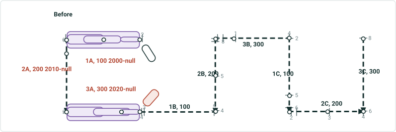

| Rname | Line Name | Line Order | From Date | To Date | From M | To M |
| --- | --- | --- | --- | --- | --- | --- |
| 1A | Red | 100 | 1/1/2000 | null | 2 | 4 |
| 2A | Red | 200 | 1/1/2010 | null | 0 | 2 |
| 3A | Red | 300 | 1/1/2015 | null | 0 | 4 |
| 1B | Blue | 100 | 1/1/2000 | null | 3 | 5 |
| 2B | Blue | 200 | 1/1/2000 | null | 4 | 8 |
| 3B | Blue | 300 | 1/1/2000 | null | 0 | 4 |
| 1C | Gray | 100 | 1/1/2000 | null | 2 | 6 |
| 2C | Gray | 200 | 1/1/2000 | null | 2 | 4 |
| 3C | Gray | 300 | 1/1/2000 | null | 6 | 8 |

| Event ID | From Date | To Date | Route ID | From M | To M | Location Error |
| --- | --- | --- | --- | --- | --- | --- |
| S1a | 1/1/2000 | <Null> | 1A | 2 | 2.5 | No Error |
| S1b | 1/1/2020 | <Null> | 3A | 2 | 4 | No Error |
| S2a | 1/1/2000 | <Null> | 1A | 2.5 | 3.5 | No Error |
| S2b | 1/1/2020 | <Null> | 3A | 1 | 3 | No Error |
| S3a | 1/1/2000 | <Null> | 1A | 3 | 4 | No Error |
| S3b | 1/1/2020 | <Null> | 3A | 0 | 1.2 | No Error |
| S4a | 1/1/2000 | <Null> | 1A | 2 | 4 | No Error |
| S4b | 1/1/2020 | <Null> | 3A | 0 | 4 | No Error |

Effective date is 1/1/2030
Recal downstream unchecked

## Slide 54 — Test case 14-b: Transfer to New Line – transfer 3 simple routes; routes on source line have multiple time slices; not

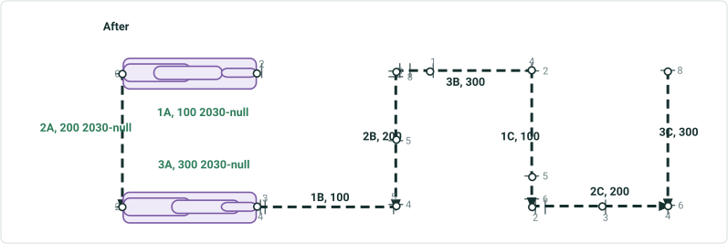

| Rname | Line Name | Line Order | From Date | To Date | From M | To M |
| --- | --- | --- | --- | --- | --- | --- |
| 1A | Red | 100 | 1/1/2000 | 1/1/2030 | 2 | 4 |
| 2A | Red | 200 | 1/1/2010 | 1/1/2030 | 0 | 2 |
| 3A | Red | 300 | 1/1/2015 | 1/1/2030 | 0 | 4 |
| 1A | Teal | 100 | 1/1/2030 | null | 2 | 4 |
| 2A | Teal | 200 | 1/1/2030 | null | 0 | 2 |
| 3A | Teal | 300 | 1/1/2030 | null | 0 | 4 |
| 1B | Blue | 100 | 1/1/2000 | null | 3 | 5 |
| 2B | Blue | 200 | 1/1/2000 | null | 4 | 8 |
| 3B | Blue | 300 | 1/1/2000 | null | 0 | 4 |
| 1C | Gray | 100 | 1/1/2000 | null | 2 | 6 |
| 2C | Gray | 200 | 1/1/2000 | null | 2 | 4 |
| 3C | Gray | 300 | 1/1/2000 | null | 6 | 8 |

| Event ID | From Date | To Date | Route ID | From M | To M | Location Error |
| --- | --- | --- | --- | --- | --- | --- |
| S1a | 1/1/2000 | 1/1/2030 | 1A | 2 | 2.5 | No Error |
| S1b | 1/1/2020 | 1/1/2030 | 3A | 2 | 4 | No Error |
| S2a | 1/1/2000 | 1/1/2030 | 1A | 2.5 | 3.5 | No Error |
| S2b | 1/1/2020 | 1/1/2030 | 3A | 1 | 3 | No Error |
| S3a | 1/1/2000 | 1/1/2030 | 1A | 3 | 4 | No Error |
| S3b | 1/1/2020 | 1/1/2030 | 3A | 0 | 1.2 | No Error |
| S4a | 1/1/2000 | 1/1/2030 | 1A | 2 | 4 | No Error |
| S4b | 1/1/2020 | 1/1/2030 | 3A | 0 | 4 | No Error |

| S1a | 1/1/2030 | <Null> | 1A | 2 | 2.5 | No Error |
| --- | --- | --- | --- | --- | --- | --- |
| S1b | 1/1/2030 | <Null> | 3A | 3 | 4 | No Error |
| S2a | 1/1/2030 | <Null> | 1A | 2.5 | 3.5 | No Error |
| S2b | 1/1/2030 | <Null> | 3A | 1.5 | 3.5 | No Error |
| S3a | 1/1/2030 | <Null> | 1A | 3 | 4 | No Error |
| S3b | 1/1/2030 | <Null> | 3A | 0 | 2 | No Error |
| S4a | 1/1/2030 | <Null> | 1A | 2 | 4 | No Error |
| S4b | 1/1/2030 | <Null> | 3A | 0 | 4 | No Error |

## Slide 55 — Test case 15: Transfer to New Line – transfer 3 entire simple routes; transfer CP; keep original measures; keep


| Rname | Line Name | Line Order | From Date | To Date | From M | To M |
| --- | --- | --- | --- | --- | --- | --- |
| 1A | Red | 100 | 1/1/2000 | null | 2 | 4 |
| 2A | Red | 200 | 1/1/2000 | null | 0 | 2 |
| 3A | Red | 300 | 1/1/2000 | null | 0 | 4 |
| 1B | Blue | 100 | 1/1/2000 | null | 3 | 5 |
| 2B | Blue | 200 | 1/1/2000 | null | 4 | 8 |
| 3B | Blue | 300 | 1/1/2000 | null | 0 | 4 |
| 1C | Gray | 100 | 1/1/2000 | null | 2 | 6 |
| 2C | Gray | 200 | 1/1/2000 | null | 2 | 4 |
| 3C | Gray | 300 | 1/1/2000 | null | 6 | 8 |

| Event ID | From Date | To Date | From Route ID | To Route ID | From M | To M | Location Error |
| --- | --- | --- | --- | --- | --- | --- | --- |
| S_blue | 1/1/2000 | <Null> | 1B | 2B | 4 | 5 | No Error |

Showing these events for once to indicate events on other lines will not be affected

| Event ID | From Date | To Date | Route ID | Measure | Location Error |
| --- | --- | --- | --- | --- | --- |
| Star1 | 1/1/2000 | <Null> | 3A | 2 | No Error |
| Star2 | 1/1/2000 | <Null> | 1A | 2 | No Error |
| Star3 | 1/1/2000 | <Null> | 1A | 2.5 | No Error |
| Star4 | 1/1/2000 | <Null> | 2A | 0 | No Error |
| Star5 | 1/1/2000 | <Null> | 2A | 2 | No Error |

| Event ID | From Date | To Date | Route ID | Measure | Location Error |
| --- | --- | --- | --- | --- | --- |
| Star_blue | 1/1/2000 | <Null> | 2B | 6.5 | No Error |

Effective date is 1/1/2020
Recal downstream unchecked


## Slide 56 — Test case 15: Transfer to New Line – transfer 3 entire simple routes; transfer CP; keep original measures; keep

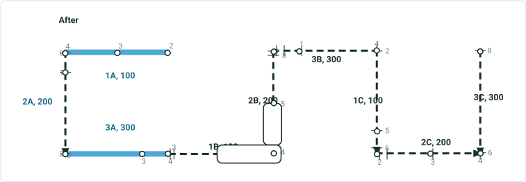

| Rname | Line Name | Line Order | From Date | To Date | From M | To M |
| --- | --- | --- | --- | --- | --- | --- |
| 1A | Red | 100 | 1/1/2000 | 1/1/2020 | 2 | 4 |
| 2A | Red | 200 | 1/1/2000 | 1/1/2020 | 0 | 2 |
| 3A | Red | 300 | 1/1/2000 | 1/1/2020 | 0 | 4 |
| 1A | Teal | 100 | 1/1/2020 | null | 2 | 4 |
| 2A | Teal | 200 | 1/1/2020 | null | 0 | 2 |
| 3A | Teal | 300 | 1/1/2020 | null | 0 | 4 |
| 1B | Blue | 100 | 1/1/2000 | null | 3 | 5 |
| 2B | Blue | 200 | 1/1/2000 | null | 4 | 8 |
| 3B | Blue | 300 | 1/1/2000 | null | 0 | 4 |
| 1C | Gray | 100 | 1/1/2000 | null | 2 | 6 |
| 2C | Gray | 200 | 1/1/2000 | null | 2 | 4 |
| 3C | Gray | 300 | 1/1/2000 | null | 6 | 8 |

| Event ID | From Date | To Date | From Route ID | To Route ID | From M | To M | Location Error |
| --- | --- | --- | --- | --- | --- | --- | --- |
| S_blue | 1/1/2000 | <Null> | 1B | 2B | 4 | 5 | No Error |

Showing these events for once to indicate events on other lines will not be affected

| Event ID | From Date | To Date | Route ID | Measure | Location Error |
| --- | --- | --- | --- | --- | --- |
| Star1 | 1/1/2000 | 1/1/2020 | 3A | 2 | No Error |
| Star2 | 1/1/2000 | 1/1/2020 | 1A | 2 | No Error |
| Star3 | 1/1/2000 | 1/1/2020 | 1A | 2.5 | No Error |
| Star4 | 1/1/2000 | 1/1/2020 | 2A | 0 | No Error |
| Star5 | 1/1/2000 | 1/1/2020 | 2A | 2 | No Error |

| Event ID | From Date | To Date | Route ID | Measure | Location Error |
| --- | --- | --- | --- | --- | --- |
| Star_blue | 1/1/2000 | <Null> | 2B | 6.5 | No Error |

| Star1 | 1/1/2020 | <Null> | 3A | 2 | No Error |
| --- | --- | --- | --- | --- | --- |
| Star2 | 1/1/2020 | <Null> | 1A | 2 | No Error |
| Star3 | 1/1/2020 | <Null> | 1A | 2.5 | No Error |
| Star4 | 1/1/2020 | <Null> | 2A | 0 | No Error |
| Star5 | 1/1/2020 | <Null> | 2A | 2 | No Error |


## Slide 57 — Test case 17: Transfer to New Line – transfer 0.5+1 simple routes; not transfer CP; change measures; partial routes

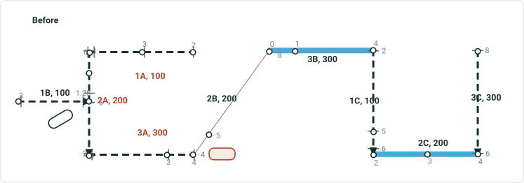

| Rname | Line Name | Line Order | From Date | To Date | From M | To M |
| --- | --- | --- | --- | --- | --- | --- |
| 1A | Red | 100 | 1/1/2000 | null | 2 | 4 |
| 2A | Red | 200 | 1/1/2000 | null | 0 | 2 |
| 3A | Red | 300 | 1/1/2000 | null | 0 | 4 |
| 1B | Blue | 100 | 1/1/2000 | null | 3 | 5 |
| 2B | Blue | 200 | 1/1/2000 | null | 4 | 8 |
| 3B | Blue | 300 | 1/1/2000 | null | 0 | 4 |
| 1C | Gray | 100 | 1/1/2000 | null | 2 | 6 |
| 2C | Gray | 200 | 1/1/2000 | null | 2 | 4 |
| 3C | Gray | 300 | 1/1/2000 | null | 6 | 8 |

| Event ID | From Date | To Date | Route ID | Measure | Location Error |
| --- | --- | --- | --- | --- | --- |
| Star1 | 1/1/2000 | <Null> | 3A | 2 | No Error |
| Star2 | 1/1/2000 | <Null> | 2A | 1.25 | No Error |
| Star3 | 1/1/2000 | <Null> | 2A | 1.4375 | No Error |
| Star4 | 1/1/2000 | <Null> | 2A | 0 | No Error |
| Star5 | 1/1/2000 | <Null> | 2A | 2 | No Error |

Effective date is 1/1/2020
Recal downstream unchecked


## Slide 58 — Test case 17: Transfer to New Line – transfer 0.5+1 simple routes; not transfer CP; change measures; partial routes

| Event ID | From Date | To Date | Route ID | Measure | Location Error |
| --- | --- | --- | --- | --- | --- |
| Star1 | 1/1/2000 | 1/1/2020 | 3A | 2 | No Error |
| Star1 | 1/1/2020 | <Null> | 3A | 4 | No Error |
| Star2 | 1/1/2000 | 1/1/2020 | 2A | 1.25 | No Error |
| Star2 | 1/1/2020 | <Null> | 2A_reassign | 2 | No Error |
| Star3 | 1/1/2000 | 1/1/2020 | 2A | 1.4375 | No Error |
| Star3 | 1/1/2020 | <Null> | 2A_reassign | 2.25 | No Error |
| Star4 | 1/1/2000 | <Null> | 2A | 0 | No Error |
| Star5 | 1/1/2000 | 1/1/2020 | 2A | 2 | No Error |
| Star5 | 1/1/2020 | <Null> | 2A_reassign | 3 | No Error |

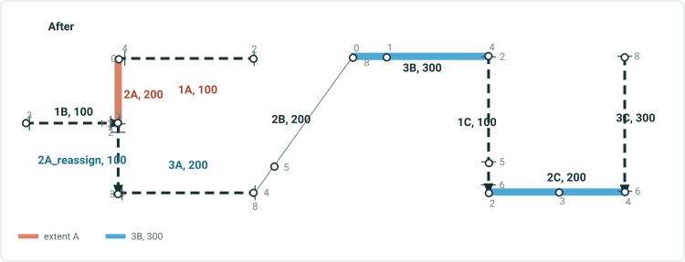

| Rname | Line Name | Line Order | From Date | To Date | From M | To M |
| --- | --- | --- | --- | --- | --- | --- |
| 1A | Red | 100 | 1/1/2000 | null | 2 | 4 |
| 2A | Red | 200 | 1/1/2000 | 1/1/2020 | 0 | 2 |
| 2A | Red | 200 | 1/1/2020 | null | 0 | 1.25 |
| 3A | Red | 300 | 1/1/2000 | 1/1/2020 | 0 | 4 |
| 2A_reassign | Teal | 100 | 1/1/2020 | null | 2 | 3 |
| 3A | Teal | 200 | 1/1/2020 | null | 0 | 8 |
| 1B | Blue | 100 | 1/1/2000 | null | 3 | 5 |
| 2B | Blue | 200 | 1/1/2000 | null | 4 | 8 |
| 3B | Blue | 300 | 1/1/2000 | null | 0 | 4 |
| 1C | Gray | 100 | 1/1/2000 | null | 2 | 6 |
| 2C | Gray | 200 | 1/1/2000 | null | 2 | 4 |
| 3C | Gray | 300 | 1/1/2000 | null | 6 | 8 |


## Slide 59 — Stayput and Retire EB- reassign

## Slide 60

Reassign all the routes in a line to another line transferring routes and measures. ; keep original measures; keep original route name.
1: Transfer to an existing line – spanning Events – Stayput and Retire Behavior.

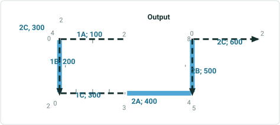

| Route Name | Line Name | Line Order | From Date | To Date | From M | To M |
| --- | --- | --- | --- | --- | --- | --- |
| 1A | L1 | 100 | 1/1/2000 | <Null> | 2 | 4 |
| 1B | L1 | 200 | 1/1/2000 | <Null> | 0 | 2 |
| 1C | L1 | 300 | 1/1/2000 | <Null> | 0 | 4 |
| 2A | L2 | 100 | 1/1/2000 | <Null> | 3 | 5 |
| 2B | L2 | 200 | 1/1/2000 | <Null> | 4 | 8 |
| 2C | L2 | 300 | 1/1/2000 | <Null> | 0 | 2 |

| Event ID | From Date | To Date | From Route ID | From M | To Route ID | To M | Location Error |
| --- | --- | --- | --- | --- | --- | --- | --- |
| S1 | 1/1/2000 | <Null> | 1A | 2 | 1C | 4 | No Error |
| S2 | 1/1/2000 | <Null> | 1A | 2 | 1B | 1 | No Error |
| S3 | 1/1/2000 | <Null> | 1B | 1.5 | 1C | 4 | No Error |
| S4 | 1/1/2000 | <Null> | 1A | 3 | 1C | 1 | No Error |
| S5 | 1/1/2000 | <Null> | 1B | 0 | 1B | 2 | No Error |

| Route Name | Line Name | Line Order | From Date | To Date | From M | To M |
| --- | --- | --- | --- | --- | --- | --- |
| 1A | L1 | 100 | 1/1/2000 | 1/1/2023 | 2 | 4 |
| 1B | L1 | 200 | 1/1/2000 | 1/1/2023 | 0 | 2 |
| 1C | L1 | 300 | 1/1/2000 | 1/1/2023 | 0 | 4 |
| 2A | L2 | 100 | 1/1/2000 | 1/1/2023 | 3 | 5 |
| 2B | L2 | 200 | 1/1/2000 | 1/1/2023 | 4 | 8 |
| 2C | L2 | 300 | 1/1/2000 | 1/1/2023 | 0 | 2 |
| 1A | L2 | 100 | 1/1/2023 | <Null> | 2 | 4 |
| 1B | L2 | 200 | 1/1/2023 | <Null> | 0 | 2 |
| 1C | L2 | 300 | 1/1/2023 | <Null> | 0 | 4 |
| 2A | L2 | 400 | 1/1/2023 | <Null> | 3 | 5 |
| 2B | L2 | 500 | 1/1/2023 | <Null> | 4 | 8 |
| 2C | L2 | 600 | 1/1/2023 | <Null> | 0 | 2 |

| Event ID | From Date | To Date | From Route ID | From M | To Route ID | To M | Location Error |
| --- | --- | --- | --- | --- | --- | --- | --- |
| S1 | 1/1/2000 | 1/1/2023 | 1A | 2 | 1C | 4 | No Error |
| S2 | 1/1/2000 | 1/1/2023 | 1A | 2 | 1B | 1 | No Error |
| S3 | 1/1/2000 | 1/1/2023 | 1B | 1.5 | 1C | 4 | No Error |
| S4 | 1/1/2000 | 1/1/2023 | 1A | 3 | 1C | 1 | No Error |
| S5 | 1/1/2000 | 1/1/2023 | 1B | 0 | 1B | 2 | No Error |

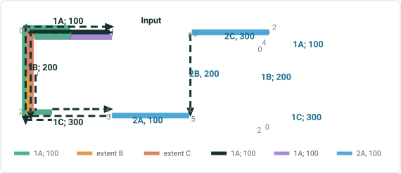

| Effective Date | 1/1/2023 |
| --- | --- |

## Slide 61

Reassign all the routes in a line to another line on right, transferring routes. Measures changed. Route Name changed.
2: Transfer to an existing line – spanning Events – Stayput and Retire Behavior.

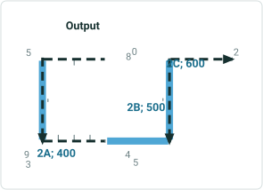

| Route Name | Line Name | Line Order | From Date | To Date | From M | To M |
| --- | --- | --- | --- | --- | --- | --- |
| 1A | L1 | 100 | 1/1/2000 | <Null> | 2 | 4 |
| 1B | L1 | 200 | 1/1/2000 | <Null> | 0 | 2 |
| 1C | L1 | 300 | 1/1/2000 | <Null> | 0 | 4 |
| 2A | L2 | 100 | 1/1/2000 | <Null> | 3 | 5 |
| 2B | L2 | 200 | 1/1/2000 | <Null> | 4 | 8 |
| 2C | L2 | 300 | 1/1/2000 | <Null> | 0 | 2 |

| Event ID | From Date | To Date | From Route ID | From M | To Route ID | To M | Location Error |
| --- | --- | --- | --- | --- | --- | --- | --- |
| S1 | 1/1/2000 | <Null> | 1A | 2 | 1C | 4 | No Error |
| S2 | 1/1/2000 | <Null> | 1A | 2 | 1B | 1 | No Error |
| S3 | 1/1/2000 | <Null> | 1B | 1.5 | 1C | 4 | No Error |
| S4 | 1/1/2000 | <Null> | 1A | 3 | 1C | 1 | No Error |
| S5 | 1/1/2000 | <Null> | 1B | 0 | 1B | 2 | No Error |

| Event ID | From Date | To Date | From Route ID | From M | To Route ID | To M | Location Error |
| --- | --- | --- | --- | --- | --- | --- | --- |
| S1 | 1/1/2000 | 1/1/2023 | 1A | 2 | 1C | 4 | No Error |
| S2 | 1/1/2000 | 1/1/2023 | 1A | 2 | 1B | 1 | No Error |
| S3 | 1/1/2000 | 1/1/2023 | 1B | 1.5 | 1C | 4 | No Error |
| S4 | 1/1/2000 | 1/1/2023 | 1A | 3 | 1C | 1 | No Error |
| S5 | 1/1/2000 | 1/1/2023 | 1B | 0 | 1B | 2 | No Error |

| Route Name | Line Name | Line Order | From Date | To Date | From M | To M |
| --- | --- | --- | --- | --- | --- | --- |
| 1A | L1 | 100 | 1/1/2000 | 1/1/2023 | 2 | 4 |
| 1B | L1 | 200 | 1/1/2000 | 1/1/2023 | 0 | 2 |
| 1C | L1 | 300 | 1/1/2000 | 1/1/2023 | 0 | 4 |
| 2A | L2 | 100 | 1/1/2000 | 1/1/2023 | 3 | 5 |
| 2B | L2 | 200 | 1/1/2000 | 1/1/2023 | 4 | 8 |
| 2C | L2 | 300 | 1/1/2000 | 1/1/2023 | 0 | 2 |
| 1A_New | L2 | 100 | 1/1/2023 | <Null> | 5 | 8 |
| 1B_New | L2 | 200 | 1/1/2023 | <Null> | 2 | 4 |
| 1C_New | L2 | 300 | 1/1/2023 | <Null> | 5 | 9 |
| 2A | L2 | 400 | 1/1/2023 | <Null> | 3 | 5 |
| 2B | L2 | 500 | 1/1/2023 | <Null> | 4 | 8 |
| 2C | L2 | 600 | 1/1/2023 | <Null> | 0 | 2 |

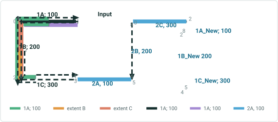

| Effective Date | 1/1/2023 |
| --- | --- |

## Slide 62

Reassign 1 entire route  and a partial route  in a line to another line transferring routes and measures. ; Keep the same name for the
entire route and partial route (name of a retired route from the line to which route is reassigned), Change measures
5-1: Transfer to an existing line – spanning Events – Stayput Behavior


| Route Name | Line Name | Line Order | From Date | To Date | From M | To M |
| --- | --- | --- | --- | --- | --- | --- |
| 1A | L1 | 100 | 1/1/2000 | <Null> | 2 | 4 |
| 1B | L1 | 200 | 1/1/2000 | <Null> | 0 | 2 |
| 1C | L1 | 300 | 1/1/2000 | <Null> | 0 | 4 |
| 2A | L2 | 100 | 1/1/2000 | <Null> | 3 | 5 |
| 2B | L2 | 200 | 1/1/2000 | <Null> | 4 | 8 |
| 2C | L2 | 300 | 1/1/2000 | <Null> | 0 | 2 |

| Event ID | From Date | To Date | From Route ID | From M | To Route ID | To M | Location Error |
| --- | --- | --- | --- | --- | --- | --- | --- |
| S1 | 1/1/2000 | <Null> | 1A | 2 | 1C | 4 | No Error |
| S2 | 1/1/2000 | <Null> | 1A | 2 | 1B | 1 | No Error |
| S3 | 1/1/2000 | <Null> | 1B | 1 | 1C | 4 | No Error |
| S4 | 1/1/2000 | <Null> | 1A | 3 | 1C | 2 | No Error |
| S5 | 1/1/2000 | <Null> | 1C | 0 | 1C | 4 | No Error |

| Route Name | Line Name | Line Order | From Date | To Date | From M | To M |
| --- | --- | --- | --- | --- | --- | --- |
| 1A | L1 | 100 | 1/1/2000 | <Null> | 2 | 4 |
| 1B | L1 | 200 | 1/1/2000 | 1/1/2023 | 0 | 2 |
| 1C | L1 | 300 | 1/1/2000 | 1/1/2023 | 0 | 4 |
| 2A | L2 | 100 | 1/1/2000 | 1/1/2023 | 3 | 5 |
| 2B | L2 | 200 | 1/1/2000 | 1/1/2023 | 4 | 8 |
| 2C | L2 | 300 | 1/1/2000 | 1/1/2023 | 0 | 2 |
| 1B | L1 | 200 | 1/1/2023 | <Null> | 0 | 1 |
| 1R1 | L2 | 100 | 1/1/2023 | <Null> | 0 | 1 |
| 1C | L2 | 200 | 1/1/2023 | <Null> | 4 | 6 |
| 2A | L2 | 300 | 1/1/2023 | <Null> | 3 | 5 |
| 2B | L2 | 400 | 1/1/2023 | <Null> | 4 | 8 |
| 2C | L2 | 500 | 1/1/2023 | <Null> | 0 | 2 |

| Event ID | From Date | To Date | From Route ID | From M | To Route ID | To M | Location Error |
| --- | --- | --- | --- | --- | --- | --- | --- |
| S1 | 1/1/2000 | 1/1/2023 | 1A | 2 | 1C | 4 | No Error |
| S1 | 1/1/2023 | <Null> | 1A | 2 | 1B | 1 | No Error |
| S2 | 1/1/2000 | <Null> | 1A | 2 | 1B | 1 | No Error |
| S3 | 1/1/2000 | 1/1/2023 | 1B | 1 | 1C | 4 | No Error |
| S4 | 1/1/2000 | 1/1/2023 | 1A | 3 | 1C | 2 | No Error |
| S4 | 1/1/2023 | <Null> | 1A | 3 | 1B | 1 | No Error |
| S5 | 1/1/2000 | 1/1/2023 | 1B | 0 | 1B | 2 | No Error |


| Effective Date | 1/1/2023 |
| --- | --- |

## Slide 63

Reassign 1 entire route  and a partial route  in a line to another line transferring routes and measures. ; Keep the same name for the
Entire route and partial route (name of a retired route from the line to which route is reassigned). Change measures
5-2: Transfer to an existing line – spanning Events – Retire Behavior


| Route Name | Line Name | Line Order | From Date | To Date | From M | To M |
| --- | --- | --- | --- | --- | --- | --- |
| 1A | L1 | 100 | 1/1/2000 | <Null> | 2 | 4 |
| 1B | L1 | 200 | 1/1/2000 | <Null> | 0 | 2 |
| 1C | L1 | 300 | 1/1/2000 | <Null> | 0 | 4 |
| 2A | L2 | 100 | 1/1/2000 | <Null> | 3 | 5 |
| 2B | L2 | 200 | 1/1/2000 | <Null> | 4 | 8 |
| 2C | L2 | 300 | 1/1/2000 | <Null> | 0 | 2 |

| Event ID | From Date | To Date | From Route ID | From M | To Route ID | To M | Location Error |
| --- | --- | --- | --- | --- | --- | --- | --- |
| S1 | 1/1/2000 | <Null> | 1A | 2 | 1C | 4 | No Error |
| S2 | 1/1/2000 | <Null> | 1A | 2 | 1B | 1 | No Error |
| S3 | 1/1/2000 | <Null> | 1B | 1 | 1C | 4 | No Error |
| S4 | 1/1/2000 | <Null> | 1A | 3 | 1C | 2 | No Error |
| S5 | 1/1/2000 | <Null> | 1C | 0 | 1C | 4 | No Error |

| Route Name | Line Name | Line Order | From Date | To Date | From M | To M |
| --- | --- | --- | --- | --- | --- | --- |
| 1A | L1 | 100 | 1/1/2000 | <Null> | 2 | 4 |
| 1B | L1 | 200 | 1/1/2000 | 1/1/2023 | 0 | 2 |
| 1C | L1 | 300 | 1/1/2000 | 1/1/2023 | 0 | 4 |
| 2A | L2 | 100 | 1/1/2000 | 1/1/2023 | 3 | 5 |
| 2B | L2 | 200 | 1/1/2000 | 1/1/2023 | 4 | 8 |
| 2C | L2 | 300 | 1/1/2000 | 1/1/2023 | 0 | 2 |
| 1B | L1 | 200 | 1/1/2023 | <Null> | 0 | 1 |
| 1R1 | L2 | 100 | 1/1/2023 | <Null> | 0 | 1 |
| 1C | L2 | 200 | 1/1/2023 | <Null> | 4 | 6 |
| 2A | L2 | 300 | 1/1/2023 | <Null> | 3 | 5 |
| 2B | L2 | 400 | 1/1/2023 | <Null> | 4 | 8 |
| 2C | L2 | 500 | 1/1/2023 | <Null> | 0 | 2 |

| Event ID | From Date | To Date | From Route ID | From M | To Route ID | To M | Location Error |
| --- | --- | --- | --- | --- | --- | --- | --- |
| S1 | 1/1/2000 | 1/1/2023 | 1A | 2 | 1C | 4 | No Error |
| S2 | 1/1/2000 | <Null> | 1A | 2 | 1B | 1 | No Error |
| S3 | 1/1/2000 | 1/1/2023 | 1B | 1 | 1C | 4 | No Error |
| S4 | 1/1/2000 | 1/1/2023 | 1A | 3 | 1C | 2 | No Error |
| S5 | 1/1/2000 | 1/1/2023 | 1B | 0 | 1B | 2 | No Error |


| Effective Date | 1/1/2023 |
| --- | --- |

## Slide 64

Reassign 0.5+1+0.5 routes in a line to new line ,1/3 route name and measure maintained. Rest all name and measure are changed. Recalibrate source downstream. Calibrate set to Stayput
8: Transfer to an existing line – spanning Events only Routes and Route Table shown here - StayPut


| Route Name | Line Name | Line Order | From Date | To Date | From M | To M |
| --- | --- | --- | --- | --- | --- | --- |
| 1A | L1 | 100 | 1/1/2000 | <Null> | 2 | 4 |
| 1B | L1 | 200 | 1/1/2000 | <Null> | 0 | 2 |
| 1C | L1 | 300 | 1/1/2000 | <Null> | 0 | 4 |
| 2A | L2 | 100 | 1/1/2000 | <Null> | 4 | 5 |
| 2B | L2 | 200 | 1/1/2000 | <Null> | 5 | 8 |
| 2C | L2 | 300 | 1/1/2000 | <Null> | 0 | 1 |

| Route Name | Line Name | Line Order | From Date | To Date | From M | To M |
| --- | --- | --- | --- | --- | --- | --- |
| 1A | L1 | 100 | 1/1/2000 | 1/1/2023 | 2 | 4 |
| 1B | L1 | 200 | 1/1/2000 | 1/1/2023 | 0 | 2 |
| 1C | L1 | 300 | 1/1/2000 | 1/1/2023 | 0 | 4 |
| 2A | L2 | 100 | 1/1/2000 | 1/1/2023 | 3 | 5 |
| 2B | L2 | 200 | 1/1/2000 | 1/1/2023 | 4 | 8 |
| 2C | L2 | 300 | 1/1/2000 | 1/1/2023 | 0 | 2 |
| 1A | L1 | 100 | 1/1/2023 | <Null> | 2 | 3 |
| 1C | L1 | 200 | 1/1/2023 | <Null> | 0 | 2 |
| 1A_New | L2 | 100 | 1/1/2023 | <Null> | 1 | 2 |
| 1B | L2 | 200 | 1/1/2023 | <Null> | 0 | 2 |
| 1C_New | L2 | 300 | 1/1/2023 | <Null> | 5 | 6 |
| 2A | L2 | 400 | 1/1/2023 | <Null> | 4 | 5 |
| 2B | L2 | 500 | 1/1/2023 | <Null> | 5 | 8 |
| 2C | L2 | 600 | 1/1/2023 | <Null> | 0 | 1 |


| Effective Date | 1/1/2023 |
| --- | --- |
| Source RD | Yes |

## Slide 65

Reassign 0.5+1+0.5 routes in a line to new line ,1/3 route names and measures maintained. Rest all name and measure are changed. Recalibrate source downstream. Calibrate set to stayput
8-1: Transfer to an existing line – spanning Events – Stayput Behavior


| Event ID | From Date | To Date | From Route ID | From M | To Route ID | To M | Location Error |
| --- | --- | --- | --- | --- | --- | --- | --- |
| S1 | 1/1/2000 | <Null> | 1A | 2 | 1C | 4 | No Error |
| S2 | 1/1/2000 | <Null> | 1A | 2 | 1B | 1 | No Error |
| S3 | 1/1/2000 | <Null> | 1B | 1 | 1C | 4 | No Error |
| S4 | 1/1/2000 | <Null> | 1A | 3 | 1C | 2 | No Error |
| S5 | 1/1/2000 | <Null> | 1C | 0 | 1C | 4 | No Error |
| S6 | 1/1/2000 | <Null> | 1C | 3 | 1C | 4 | No Error |
| S7 | 1/1/2000 | <Null> | 1C | 1 | 1C | 3 | No Error |
| S8 | 1/1/2000 | <Null> | 1C | 0 | 1C | 1 | No Error |
| S9 | 1/1/2000 | <Null> | 1B | 0 | 1B | 2 | No Error |
| S10 | 1/1/2000 | <Null> | 1A | 2 | 1A | 2.5 | No Error |
| S11 | 1/1/2000 | <Null> | 1A | 2.5 | 1A | 3.5 | No Error |
| S12 | 1/1/2000 | <Null> | 1A | 3.5 | 1A | 4 | No Error |
|  |  |  |  |  |  |  |  |
| E1 | 1/1/2000 | <Null> | 2A | 4 | 2C | 1 | No Error |

| Event ID | From Date | To Date | From Route ID | From M | To Route ID | To M | Location Error |
| --- | --- | --- | --- | --- | --- | --- | --- |
| S1 | 1/1/2000 | 1/1/2023 | 1A | 2 | 1C | 4 | No Error |
| S1 | 1/1/2023 | <Null> | 1A | 2 | 1A | 3 | No Error |
| S1 | 1/1/2023 | <Null> | 1C | 0 | 1C | 2 | No Error |
| S2 | 1/1/2000 | 1/1/2023 | 1A | 2 | 1B | 1 | No Error |
| S2 | 1/1/2023 | <Null> | 1A | 2 | 1A | 3 | No Error |
| S3 | 1/1/2000 | 1/1/2023 | 1B | 1 | 1C | 4 | No Error |
| S3 | 1/1/2023 | <Null> | 1C | 0 | 1C | 2 | No Error |
| S4 | 1/1/2000 | 1/1/2023 | 1A | 3 | 1C | 2 | No Error |
| S5 | 1/1/2000 | 1/1/2023 | 1C | 0 | 1C | 4 | No Error |
| S5 | 1/1/2023 | <Null> | 1C | 0 | 1C | 2 | No Error |
| S6 | 1/1/2000 | 1/1/2023 | 1C | 3 | 1C | 4 | No Error |
| S6 | 1/1/2023 | <Null> | 1C | 1 | 1C | 2 | No Error |
| S7 | 1/1/2000 | 1/1/2023 | 1C | 1 | 1C | 3 | No Error |
| S7 | 1/1/2023 | <Null> | 1C | 0 | 1C | 1 | No Error |
| S8 | 1/1/2000 | 1/1/2023 | 1C | 0 | 1C | 1 | No Error |
| S9 | 1/1/2000 | 1/1/2023 | 1B | 0 | 1B | 2 | No Error |
| S10 | 1/1/2000 | <Null> | 1A | 2 | 1A | 2.5 | No Error |
| S11 | 1/1/2000 | 1/1/2023 | 1A | 2.5 | 1A | 3.5 | No Error |
| S11 | 1/1/2023 | <Null> | 1A | 2.5 | 1A | 3 | No Error |
| S12 | 1/1/2000 | 1/1/2023 | 1A | 3.5 | 1A | 4 | No Error |


| Effective Date | 1/1/2023 |
| --- | --- |
| Source RD | Yes |

## Slide 66

Reassign 0.5+1+0.5 routes in a line to new line ,1/3 route names and measures maintained. Rest all name and measure are changed. Recalibrate source downstream. Calibrate set to retire
8-2: Transfer to an existing line – spanning Events – Retire Behavior


| Event ID | From Date | To Date | From Route ID | From M | To Route ID | To M | Location Error |
| --- | --- | --- | --- | --- | --- | --- | --- |
| S1 | 1/1/2000 | <Null> | 1A | 2 | 1C | 4 | No Error |
| S2 | 1/1/2000 | <Null> | 1A | 2 | 1B | 1 | No Error |
| S3 | 1/1/2000 | <Null> | 1B | 1 | 1C | 4 | No Error |
| S4 | 1/1/2000 | <Null> | 1A | 3 | 1C | 2 | No Error |
| S5 | 1/1/2000 | <Null> | 1C | 0 | 1C | 4 | No Error |
| S6 | 1/1/2000 | <Null> | 1C | 3 | 1C | 4 | No Error |
| S7 | 1/1/2000 | <Null> | 1C | 1 | 1C | 3 | No Error |
| S8 | 1/1/2000 | <Null> | 1C | 0 | 1C | 1 | No Error |
| S9 | 1/1/2000 | <Null> | 1B | 0 | 1B | 2 | No Error |
| S10 | 1/1/2000 | <Null> | 1A | 2 | 1A | 2.5 | No Error |
| S11 | 1/1/2000 | <Null> | 1A | 2.5 | 1A | 3.5 | No Error |
| S12 | 1/1/2000 | <Null> | 1A | 3.5 | 1A | 4 | No Error |
|  |  |  |  |  |  |  |  |
| E1 | 1/1/2000 | <Null> | 2A | 4 | 2C | 1 | No Error |

| Event ID | From Date | To Date | From Route ID | From M | To Route ID | To M | Location Error |
| --- | --- | --- | --- | --- | --- | --- | --- |
| S1 | 1/1/2000 | 1/1/2023 | 1A | 2 | 1C | 4 | No Error |
| S2 | 1/1/2000 | 1/1/2023 | 1A | 2 | 1B | 1 | No Error |
| S3 | 1/1/2000 | 1/1/2023 | 1B | 1 | 1C | 4 | No Error |
| S4 | 1/1/2000 | 1/1/2023 | 1A | 3 | 1C | 2 | No Error |
| S5 | 1/1/2000 | 1/1/2023 | 1C | 0 | 1C | 4 | No Error |
| S6 | 1/1/2000 | 1/1/2023 | 1C | 3 | 1C | 4 | No Error |
| S7 | 1/1/2000 | 1/1/2023 | 1C | 1 | 1C | 3 | No Error |
| S8 | 1/1/2000 | 1/1/2023 | 1C | 0 | 1C | 1 | No Error |
| S9 | 1/1/2000 | 1/1/2023 | 1B | 0 | 1B | 2 | No Error |
| S10 | 1/1/2000 | <Null> | 1A | 2 | 1C | 2.5 | No Error |
| S11 | 1/1/2000 | 1/1/2023 | 1A | 2.5 | 1C | 3.5 | No Error |
| S12 | 1/1/2000 | 1/1/2023 | 1A | 3.5 | 1C | 4 | No Error |


| Effective Date | 1/1/2023 |
| --- | --- |
| Source RD | Yes |

## Slide 67

Reassign all the routes in a line to another line transferring routes and measures. ; keep original measures; keep original route name
14: Transfer to an existing line – Non-Spanning Events – Stayput and Retire Behavior


| Route Name | Line Name | Line Order | From Date | To Date | From M | To M |
| --- | --- | --- | --- | --- | --- | --- |
| 1A | L1 | 100 | 1/1/2000 | <Null> | 2 | 4 |
| 1B | L1 | 200 | 1/1/2000 | <Null> | 0 | 2 |
| 1C | L1 | 300 | 1/1/2000 | <Null> | 0 | 4 |
| 2A | L2 | 100 | 1/1/2000 | <Null> | 3 | 5 |
| 2B | L2 | 200 | 1/1/2000 | <Null> | 4 | 8 |
| 2C | L2 | 300 | 1/1/2000 | <Null> | 0 | 2 |

| Event ID | From Date | To Date | From Route ID | From M | To Route ID | To M | Location Error |
| --- | --- | --- | --- | --- | --- | --- | --- |
| N1 | 1/1/2000 | <Null> | 1A | 2 | 1A | 4 | No Error |
| N2 | 1/1/2000 | <Null> | 1A | 2 | 1A | 3 | No Error |
| N3 | 1/1/2000 | <Null> | 1B | 0 | 1B | 2 | No Error |
| N4 | 1/1/2000 | <Null> | 1B | 0.5 | 1B | 1.5 | No Error |
| N5 | 1/1/2000 | <Null> | 1C | 0 | 1C | 4 | No Error |
| N6 | 1/1/2000 | <Null> | 1C | 0 | 1C | 2 | No Error |

| Route Name | Line Name | Line Order | From Date | To Date | From M | To M |
| --- | --- | --- | --- | --- | --- | --- |
| 1A | L1 | 100 | 1/1/2000 | 1/1/2023 | 2 | 4 |
| 1B | L1 | 200 | 1/1/2000 | 1/1/2023 | 0 | 2 |
| 1C | L1 | 300 | 1/1/2000 | 1/1/2023 | 0 | 4 |
| 2A | L2 | 100 | 1/1/2000 | 1/1/2023 | 3 | 5 |
| 2B | L2 | 200 | 1/1/2000 | 1/1/2023 | 4 | 8 |
| 2C | L2 | 300 | 1/1/2000 | 1/1/2023 | 0 | 2 |
| 1A | L2 | 100 | 1/1/2023 | <Null> | 2 | 4 |
| 1B | L2 | 200 | 1/1/2023 | <Null> | 0 | 2 |
| 1C | L2 | 300 | 1/1/2023 | <Null> | 0 | 4 |
| 2A | L2 | 400 | 1/1/2023 | <Null> | 3 | 5 |
| 2B | L2 | 500 | 1/1/2023 | <Null> | 4 | 8 |
| 2C | L2 | 600 | 1/1/2023 | <Null> | 0 | 2 |

| Event ID | From Date | To Date | From Route ID | From M | To Route ID | To M | Location Error |
| --- | --- | --- | --- | --- | --- | --- | --- |
| N1 | 1/1/2000 | 1/1/2023 | 1A | 2 | 1A | 4 | No Error |
| N2 | 1/1/2000 | 1/1/2023 | 1A | 2 | 1A | 3 | No Error |
| N3 | 1/1/2000 | 1/1/2023 | 1B | 0 | 1B | 2 | No Error |
| N4 | 1/1/2000 | 1/1/2023 | 1B | 0.5 | 1B | 1.5 | No Error |
| N5 | 1/1/2000 | 1/1/2023 | 1C | 0 | 1C | 4 | No Error |
| N6 | 1/1/2000 | 1/1/2023 | 1C | 0 | 1C | 2 | No Error |


| Effective Date | 1/1/2023 |
| --- | --- |

## Slide 68

Reassign all the routes in a line to another line on right, transferring routes. Measures changed. Route Name changed.
15: Transfer to an existing line – NonSpanning Events – Stayput and Retire Behavior


| Route Name | Line Name | Line Order | From Date | To Date | From M | To M |
| --- | --- | --- | --- | --- | --- | --- |
| 1A | L1 | 100 | 1/1/2000 | <Null> | 2 | 4 |
| 1B | L1 | 200 | 1/1/2000 | <Null> | 0 | 2 |
| 1C | L1 | 300 | 1/1/2000 | <Null> | 0 | 4 |
| 2A | L2 | 100 | 1/1/2000 | <Null> | 3 | 5 |
| 2B | L2 | 200 | 1/1/2000 | <Null> | 4 | 8 |
| 2C | L2 | 300 | 1/1/2000 | <Null> | 0 | 2 |

| Event ID | From Date | To Date | From Route ID | From M | To Route ID | To M | Location Error |
| --- | --- | --- | --- | --- | --- | --- | --- |
| N1 | 1/1/2000 | <Null> | 1A | 2 | 1A | 4 | No Error |
| N2 | 1/1/2000 | <Null> | 1A | 2 | 1A | 3 | No Error |
| N3 | 1/1/2000 | <Null> | 1B | 0 | 1B | 2 | No Error |
| N4 | 1/1/2000 | <Null> | 1B | 0.5 | 1B | 1.5 | No Error |
| N5 | 1/1/2000 | <Null> | 1C | 0 | 1C | 4 | No Error |
| N6 | 1/1/2000 | <Null> | 1C | 0 | 1C | 2 | No Error |

| Route Name | Line Name | Line Order | From Date | To Date | From M | To M |
| --- | --- | --- | --- | --- | --- | --- |
| 1A | L1 | 100 | 1/1/2000 | 1/1/2023 | 2 | 4 |
| 1B | L1 | 200 | 1/1/2000 | 1/1/2023 | 0 | 2 |
| 1C | L1 | 300 | 1/1/2000 | 1/1/2023 | 0 | 4 |
| 2A | L2 | 100 | 1/1/2000 | 1/1/2023 | 3 | 5 |
| 2B | L2 | 200 | 1/1/2000 | 1/1/2023 | 4 | 8 |
| 2C | L2 | 300 | 1/1/2000 | 1/1/2023 | 0 | 2 |
| 1A_New | L2 | 100 | 1/1/2023 | <Null> | 5 | 8 |
| 1B_New | L2 | 200 | 1/1/2023 | <Null> | 2 | 4 |
| 1C_New | L2 | 300 | 1/1/2023 | <Null> | 4 | 9 |
| 2A | L2 | 400 | 1/1/2023 | <Null> | 3 | 5 |
| 2B | L2 | 500 | 1/1/2023 | <Null> | 4 | 8 |
| 2C | L2 | 600 | 1/1/2023 | <Null> | 0 | 2 |

| Event ID | From Date | To Date | From Route ID | From M | To Route ID | To M | Location Error |
| --- | --- | --- | --- | --- | --- | --- | --- |
| N1 | 1/1/2000 | 1/1/2023 | 1A | 2 | 1A | 4 | No Error |
| N2 | 1/1/2000 | 1/1/2023 | 1A | 2 | 1A | 3 | No Error |
| N3 | 1/1/2000 | 1/1/2023 | 1B | 0 | 1B | 2 | No Error |
| N4 | 1/1/2000 | 1/1/2023 | 1B | 0.5 | 1B | 1.5 | No Error |
| N5 | 1/1/2000 | 1/1/2023 | 1C | 0 | 1C | 4 | No Error |
| N6 | 1/1/2000 | 1/1/2023 | 1C | 0 | 1C | 2 | No Error |


| Effective Date | 1/1/2023 |
| --- | --- |

## Slide 69

Reassign 1 entire route  and a partial route  in a line to another line transferring routes and measures. ; Keep the same name for the
entire route and partial route (name of a retired route from the line to which route is reassigned), Change measures
18-1: Transfer to an existing line – Non-spanning Events – Stayput Behavior


| Route Name | Line Name | Line Order | From Date | To Date | From M | To M |
| --- | --- | --- | --- | --- | --- | --- |
| 1A | L1 | 100 | 1/1/2000 | <Null> | 2 | 4 |
| 1B | L1 | 200 | 1/1/2000 | <Null> | 0 | 2 |
| 1C | L1 | 300 | 1/1/2000 | <Null> | 0 | 4 |
| 2A | L2 | 100 | 1/1/2000 | <Null> | 3 | 5 |
| 2B | L2 | 200 | 1/1/2000 | <Null> | 4 | 8 |
| 2C | L2 | 300 | 1/1/2000 | <Null> | 0 | 2 |

| Route Name | Line Name | Line Order | From Date | To Date | From M | To M |
| --- | --- | --- | --- | --- | --- | --- |
| 1A | L1 | 100 | 1/1/2000 | <Null> | 2 | 4 |
| 1B | L1 | 200 | 1/1/2000 | 1/1/2023 | 0 | 2 |
| 1C | L1 | 300 | 1/1/2000 | 1/1/2023 | 0 | 4 |
| 2A | L2 | 100 | 1/1/2000 | 1/1/2023 | 3 | 5 |
| 2B | L2 | 200 | 1/1/2000 | 1/1/2023 | 4 | 8 |
| 2C | L2 | 300 | 1/1/2000 | 1/1/2023 | 0 | 2 |
| 1B | L1 | 200 | 1/1/2023 | <Null> | 0 | 1 |
| 1R1 | L2 | 100 | 1/1/2023 | <Null> | 0 | 1 |
| 1C | L2 | 200 | 1/1/2023 | <Null> | 4 | 6 |
| 2A | L2 | 300 | 1/1/2023 | <Null> | 3 | 5 |
| 2B | L2 | 400 | 1/1/2023 | <Null> | 4 | 8 |
| 2C | L2 | 500 | 1/1/2023 | <Null> | 0 | 2 |


| Effective Date | 1/1/2023 |
| --- | --- |

| Event ID | From Date | To Date | From Route ID | From M | To M | Location Error |
| --- | --- | --- | --- | --- | --- | --- |
| N1 | 1/1/2000 | <Null> | 1A | 2 | 4 | No Error |
| N2 | 1/1/2000 | <Null> | 1B | 0 | 2 | No Error |
| N3 | 1/1/2000 | <Null>. | 1C | 2 | 4 | No Error |
| N4 | 1/1/2000 | <Null> | 1B | 0.5 | 1.5 | No Error |
| N5 | 1/1/2000 | <Null> | 1B | 1.5 | 2 | No Error |
| N6 | 1/1/2000 | <Null> | 1B | 0 | 0.5 | No Error |
| N7 | 1/1/2000 | <Null> | 1C | 2 | 4 | No Error |
| N8 | 1/1/2000 | <Null> | 1C | 0 | 4 | No Error |
| N9 | 1/1/2000 | <Null> | 1C | 0 | 2 | No Error |

| Event ID | From Date | To Date | From Route ID | From M | To M | Location Error |
| --- | --- | --- | --- | --- | --- | --- |
| N1 | 1/1/2000 | <Null> | 1A | 2 | 4 | No Error |
| N2 | 1/1/2000 | 1/1/2023 | 1B | 0 | 2 | No Error |
| N2 | 1/1/2023 | <Null> | 1B | 0 |  | No Error |
| N3 | 1/1/2000 | 1/1/2023 | 1C | 2 | 4 | No Error |
| N4 | 1/1/2000 | 1/1/2023 | 1B | 0.5 | 1.5 | No Error |
| N4 | 1/1/2023 | <Null> | 1B | 0.5 | 1 | NO Error |
| N5 | 1/1/2000 | 1/1/2023 | 1B | 1.5 | 2 | No Error |
| N6 | 1/1/2000 | <Null> | 1B | 0 | 0.5 | No Error |
| N7 | 1/1/2000 | 1/1/2023 | 1C | 2 | 4 | No Error |
| N8 | 1/1/2000 | 1/1/2023 | 1C | 0 | 4 | No Error |
| N9 | 1/1/2000 | 1/1/2023 | 1C | 0 | 2 | No Error |


## Slide 70

Reassign 1 entire route  and a partial route  in a line to another line transferring routes and measures. ; Keep the same name for the
entire route and partial route (name of a retired route from the line to which route is reassigned), Change measures
18-2: Transfer to an existing line – Non-spanning Events – Retire Behavior


| Route Name | Line Name | Line Order | From Date | To Date | From M | To M |
| --- | --- | --- | --- | --- | --- | --- |
| 1A | L1 | 100 | 1/1/2000 | <Null> | 2 | 4 |
| 1B | L1 | 200 | 1/1/2000 | <Null> | 0 | 2 |
| 1C | L1 | 300 | 1/1/2000 | <Null> | 0 | 4 |
| 2A | L2 | 100 | 1/1/2000 | <Null> | 3 | 5 |
| 2B | L2 | 200 | 1/1/2000 | <Null> | 4 | 8 |
| 2C | L2 | 300 | 1/1/2000 | <Null> | 0 | 2 |

| Route Name | Line Name | Line Order | From Date | To Date | From M | To M |
| --- | --- | --- | --- | --- | --- | --- |
| 1A | L1 | 100 | 1/1/2000 | <Null> | 2 | 4 |
| 1B | L1 | 200 | 1/1/2000 | 1/1/2023 | 0 | 2 |
| 1C | L1 | 300 | 1/1/2000 | 1/1/2023 | 0 | 4 |
| 2A | L2 | 100 | 1/1/2000 | 1/1/2023 | 3 | 5 |
| 2B | L2 | 200 | 1/1/2000 | 1/1/2023 | 4 | 8 |
| 2C | L2 | 300 | 1/1/2000 | 1/1/2023 | 0 | 2 |
| 1B | L1 | 200 | 1/1/2023 | <Null> | 0 | 1 |
| 1R1 | L2 | 100 | 1/1/2023 | <Null> | 0 | 1 |
| 1C | L2 | 200 | 1/1/2023 | <Null> | 4 | 6 |
| 2A | L2 | 300 | 1/1/2023 | <Null> | 3 | 5 |
| 2B | L2 | 400 | 1/1/2023 | <Null> | 4 | 8 |
| 2C | L2 | 500 | 1/1/2023 | <Null> | 0 | 2 |


| Effective Date | 1/1/2023 |
| --- | --- |

| Event ID | From Date | To Date | From Route ID | From M | To M | Location Error |
| --- | --- | --- | --- | --- | --- | --- |
| N1 | 1/1/2000 | <Null> | 1A | 2 | 4 | No Error |
| N2 | 1/1/2000 | <Null> | 1B | 0 | 2 | No Error |
| N3 | 1/1/2000 | <Null>. | 1C | 2 | 4 | No Error |
| N4 | 1/1/2000 | <Null> | 1B | 0.5 | 1.5 | No Error |
| N5 | 1/1/2000 | <Null> | 1B | 1.5 | 2 | No Error |
| N6 | 1/1/2000 | <Null> | 1B | 0 | 0.5 | No Error |
| N7 | 1/1/2000 | <Null> | 1C | 2 | 4 | No Error |
| N8 | 1/1/2000 | <Null> | 1C | 0 | 4 | No Error |
| N9 | 1/1/2000 | <Null> | 1C | 0 | 2 | No Error |

| Event ID | From Date | To Date | From Route ID | From M | To M | Location Error |
| --- | --- | --- | --- | --- | --- | --- |
| N1 | 1/1/2000 | <Null> | 1A | 2 | 4 | No Error |
| N2 | 1/1/2000 | 1/1/2023 | 1B | 0 | 2 | No Error |
| N3 | 1/1/2000 | 1/1/2023 | 1C | 2 | 4 | No Error |
| N4 | 1/1/2000 | 1/1/2023 | 1B | 0.5 | 1.5 | No Error |
| N5 | 1/1/2000 | 1/1/2023 | 1B | 1.5 | 2 | No Error |
| N6 | 1/1/2000 | <Null> | 1B | 0 | 0.5 | No Error |
| N7 | 1/1/2000 | 1/1/2023 | 1C | 2 | 4 | No Error |
| N8 | 1/1/2000 | 1/1/2023 | 1C | 0 | 4 | No Error |
| N9 | 1/1/2000 | 1/1/2023 | 1C | 0 | 2 | No Error |


## Slide 71

Reassign all the routes in a line to another line on right, transferring routes and measures. The effective date is same as source route’s From Date. Change Measures; keep original route name
3-2: Transfer to an existing line – spanning Events – Stayput & Retire – irrespective of behavior


| Route Name | Line Name | Line Order | From Date | To Date | From M | To M |
| --- | --- | --- | --- | --- | --- | --- |
| 1A | L1 | 100 | 1/1/2000 | <Null> | 2 | 4 |
| 1B | L1 | 200 | 1/1/2000 | <Null> | 0 | 2 |
| 1C | L1 | 300 | 1/1/2000 | <Null> | 0 | 4 |
| 2A | L2 | 100 | 1/1/2000 | <Null> | 3 | 5 |
| 2B | L2 | 200 | 1/1/2000 | <Null> | 4 | 8 |
| 2C | L2 | 300 | 1/1/2000 | <Null> | 0 | 2 |

| Event ID | From Date | To Date | From Route ID | From M | To Route ID | To M | Location Error |
| --- | --- | --- | --- | --- | --- | --- | --- |
| S1 | 1/1/2000 | <Null> | 1A | 2 | 1C | 4 | No Error |
| S2 | 1/1/2000 | <Null> | 1A | 2 | 1B | 1 | No Error |
| S3 | 1/1/2000 | <Null> | 1B | 1.5 | 1C | 4 | No Error |
| S4 | 1/1/2000 | <Null> | 1A | 3 | 1C | 1 | No Error |
| S5 | 1/1/2000 | <Null> | 1B | 0 | 1B | 2 | No Error |


| Effective Date | 1/1/2000 |
| --- | --- |

| Route Name | Line Name | Line Order | From Date | To Date | From M | To M |
| --- | --- | --- | --- | --- | --- | --- |
| 1A | L2 | 100 | 1/1/2000 | <Null> | 5 | 8 |
| 1B | L2 | 200 | 1/1/2000 | <Null> | 2 | 4 |
| 1C | L2 | 300 | 1/1/2000 | <Null> | 5 | 9 |
| 2A | L2 | 400 | 1/1/2000 | <Null> | 3 | 5 |
| 2B | L2 | 500 | 1/1/2000 | <Null> | 4 | 8 |
| 2C | L2 | 600 | 1/1/2000 | <Null> | 0 | 2 |

| Event ID | From Date | To Date | From Route ID | From M | To Route ID | To M | Location Error |
| --- | --- | --- | --- | --- | --- | --- | --- |
| S1 | Events get deleted as the from date and to date are same. An enhancement is logged to add a log file to the Apply event behaviors tool to output the list of the events deleted |  |  |  |  |  |  |
| S2 |  |  |  |  |  |  |  |
| S3 |  |  |  |  |  |  |  |
| S4 |  |  |  |  |  |  |  |
| S5 |  |  |  |  |  |  |  |


## Slide 72

Reassign all the routes in a line to another line on right, transferring routes and measures. The effective date is same as source route’s From Date. Keep original route name , changing only the from measure on the first route , only the To Measure of the last route
16-4: Transfer to an existing line – Non spanning Events – StayPut and Retire Behavior.

| Route Name | Line Name | Line Order | From Date | To Date | From M | To M |
| --- | --- | --- | --- | --- | --- | --- |
| 1A | L1 | 100 | 1/1/2000 | <Null> | 2 | 4 |
| 1B | L1 | 200 | 1/1/2000 | <Null> | 0 | 2 |
| 1C | L1 | 300 | 1/1/2000 | <Null> | 0 | 4 |
| 2A | L2 | 100 | 1/1/2000 | <Null> | 3 | 5 |
| 2B | L2 | 200 | 1/1/2000 | <Null> | 4 | 8 |
| 2C | L2 | 300 | 1/1/2000 | <Null> | 0 | 2 |


| Effective Date | 1/1/2000 |
| --- | --- |

| Route Name | Line Name | Line Order | From Date | To Date | From M | To M |
| --- | --- | --- | --- | --- | --- | --- |
| 1A | L2 | 100 | 1/1/2000 | <Null> | 1 | 4 |
| 1B | L2 | 200 | 1/1/2000 | <Null> | 0 | 2 |
| 1C | L2 | 300 | 1/1/2000 | <Null> | 0 | 4 |
| 2A | L2 | 400 | 1/1/2000 | <Null> | 3 | 5 |
| 2B | L2 | 500 | 1/1/2000 | <Null> | 4 | 8 |
| 2C | L2 | 600 | 1/1/2000 | <Null> | 0 | 2 |

| Event ID | From Date | To Date | From Route ID | From M | To Route ID | To M | Location Error |
| --- | --- | --- | --- | --- | --- | --- | --- |
| N1 | 1/1/2000 | <Null> | 1A | 2 | 1A | 4 | No Error |
| N3 | 1/1/2000 | <Null> | 1B | 0 | 1B | 2 | No Error |
| N5 | 1/1/2000 | <Null> | 1C | 0 | 1C | 4 | No Error |

Completed. Events are deleted


## Slide 73

Reassign all the routes in a line to another line transferring routes and measures ; keep original measures; keep original route name
27: Transfer to an existing line – point Events– Stayput and Retire Behavior

| Route Name | Line Name | Line Order | From Date | To Date | From M | To M |
| --- | --- | --- | --- | --- | --- | --- |
| 1A | L1 | 100 | 1/1/2000 | <Null> | 2 | 4 |
| 1B | L1 | 200 | 1/1/2000 | <Null> | 0 | 2 |
| 1C | L1 | 300 | 1/1/2000 | <Null> | 0 | 4 |
| 2A | L2 | 100 | 1/1/2000 | <Null> | 3 | 5 |
| 2B | L2 | 200 | 1/1/2000 | <Null> | 4 | 8 |
| 2C | L2 | 300 | 1/1/2000 | <Null> | 0 | 2 |

| Event ID | From Date | To Date | From Route ID | From M | Location Error |
| --- | --- | --- | --- | --- | --- |
| 1 | 1/1/2000 | <Null> | 1A | 2 | No Error |
| 2 | 1/1/2000 | <Null> | 1B | 1 | No Error |
| 3 | 1/1/2000 | <Null> | 1C | 1 | No Error |
| 4 | 1/1/2000 | <Null> | 1C | 4 | No Error |
| 5 | 1/1/2000 | <Null> | 1A | 4 | No Error |
| 6 | 1/1/2000 | <Null> | 1B | 0 | No Error |

| Route Name | Line Name | Line Order | From Date | To Date | From M | To M |
| --- | --- | --- | --- | --- | --- | --- |
| 1A | L1 | 100 | 1/1/2000 | 1/1/2023 | 2 | 4 |
| 1B | L1 | 200 | 1/1/2000 | 1/1/2023 | 0 | 2 |
| 1C | L1 | 300 | 1/1/2000 | 1/1/2023 | 0 | 4 |
| 2A | L2 | 100 | 1/1/2000 | 1/1/2023 | 3 | 5 |
| 2B | L2 | 200 | 1/1/2000 | 1/1/2023 | 4 | 8 |
| 2C | L2 | 300 | 1/1/2000 | 1/1/2023 | 0 | 2 |
| 1A | L2 | 100 | 1/1/2023 | <Null> | 2 | 4 |
| 1B | L2 | 200 | 1/1/2023 | <Null> | 0 | 2 |
| 1C | L2 | 300 | 1/1/2023 | <Null> | 0 | 4 |
| 2A | L2 | 400 | 1/1/2023 | <Null> | 3 | 5 |
| 2B | L2 | 500 | 1/1/2023 | <Null> | 4 | 8 |
| 2C | L2 | 600 | 1/1/2023 | <Null> | 0 | 2 |

| Event ID | From Date | To Date | From Route ID | From M | Location Error |
| --- | --- | --- | --- | --- | --- |
| 1 | 1/1/2000 | 1/1/2023 | 1A | 2 | No Error |
| 2 | 1/1/2000 | 1/1/2023 | 1B | 1 | No Error |
| 3 | 1/1/2000 | 1/1/2023 | 1C | 1 | No Error |
| 4 | 1/1/2000 | 1/1/2023 | 1C | 4 | No Error |
| 4 | 1/1/2000 | 1/1/2023 | 1A | 4 | No Error |
| 5 | 1/1/2000 | 1/1/2023 | 1B | 0 | No Error |


| Effective Date | 1/1/2023 |
| --- | --- |


## Slide 74

Reassign all the routes in a line to another line on right, transferring routes. Measures changed. Route Name changed.
28: Transfer to an existing line – point Events– Stayput and Retire Behavior

| Route Name | Line Name | Line Order | From Date | To Date | From M | To M |
| --- | --- | --- | --- | --- | --- | --- |
| 1A | L1 | 100 | 1/1/2000 | <Null> | 2 | 4 |
| 1B | L1 | 200 | 1/1/2000 | <Null> | 0 | 2 |
| 1C | L1 | 300 | 1/1/2000 | <Null> | 0 | 4 |
| 2A | L2 | 100 | 1/1/2000 | <Null> | 3 | 5 |
| 2B | L2 | 200 | 1/1/2000 | <Null> | 4 | 8 |
| 2C | L2 | 300 | 1/1/2000 | <Null> | 0 | 2 |

| Event ID | From Date | To Date | From Route ID | From M | Location Error |
| --- | --- | --- | --- | --- | --- |
| 1 | 1/1/2000 | <Null> | 1A | 2 | No Error |
| 2 | 1/1/2000 | <Null> | 1B | 1 | No Error |
| 3 | 1/1/2000 | <Null> | 1C | 1 | No Error |
| 4 | 1/1/2000 | <Null> | 1C | 4 | No Error |

| Route Name | Line Name | Line Order | From Date | To Date | From M | To M |
| --- | --- | --- | --- | --- | --- | --- |
| 1A | L1 | 100 | 1/1/2000 | 1/1/2023 | 2 | 4 |
| 1B | L1 | 200 | 1/1/2000 | 1/1/2023 | 0 | 2 |
| 1C | L1 | 300 | 1/1/2000 | 1/1/2023 | 0 | 4 |
| 2A | L2 | 100 | 1/1/2000 | 1/1/2023 | 3 | 5 |
| 2B | L2 | 200 | 1/1/2000 | 1/1/2023 | 4 | 8 |
| 2C | L2 | 300 | 1/1/2000 | 1/1/2023 | 0 | 2 |
| 1A_New | L2 | 100 | 1/1/2023 | <Null> | 5 | 8 |
| 1B_New | L2 | 200 | 1/1/2023 | <Null> | 2 | 4 |
| 1C_New | L2 | 300 | 1/1/2023 | <Null> | 4 | 9 |
| 2A | L2 | 400 | 1/1/2023 | <Null> | 3 | 5 |
| 2B | L2 | 500 | 1/1/2023 | <Null> | 4 | 8 |
| 2C | L2 | 600 | 1/1/2023 | <Null> | 0 | 2 |

| Event ID | From Date | To Date | From Route ID | From M | Location Error |
| --- | --- | --- | --- | --- | --- |
| 1 | 1/1/2000 | 1/1/2023 | 1A | 2 | No Error |
| 2 | 1/1/2000 | 1/1/2023 | 1B | 1 | No Error |
| 3 | 1/1/2000 | 1/1/2023 | 1C | 1 | No Error |
| 4 | 1/1/2000 | 1/1/2023 | 1C | 4 | No Error |


| Effective Date | 1/1/2023 |
| --- | --- |


## Slide 75


Transfer partial route (1/2 of a route) in a line to adjacent upstream existing line , recalibrate source route downstream ,calibrate set to stayput, route name changed , no measure change for the reassigned route portion
35-1: Transfer to an existing line – point Events– Stayput Behavior

| Event ID | From Date | To Date | From Route ID | From M | Location Error |
| --- | --- | --- | --- | --- | --- |
| 1 | 1/1/2000 | <Null> | 1A | 2 | No Error |
| 2 | 1/1/2000 | <Null> | 1A | 2.5 | No Error |
| 3 | 1/1/2000 | <Null> | 1A | 3 | No Error |
| 4 | 1/1/2000 | <Null> | 1A | 3.5 | No Error |
| 5 | 1/1/2000 | <Null> | 1B | 1 | No Error |
| 6 | 1/1/2000 | <Null> | 1C | 2 | No Error |

{5940675A-B579-460E-94D1-54222C63F5DA}Route Name
Line Name
Line Order
From Date
To Date
From M
To M
0A
L0
100
1/1/2000
<Null>
3
5
1A
L1
100
1/1/2000
<Null>
2
4
1B
L1
200
1/1/2000
<Null>
0
2
1C
L1
300
1/1/2000
<Null>
0
4
{5940675A-B579-460E-94D1-54222C63F5DA}Route Name
Line Name
Line Order
From Date
To Date
From M
To M
0A
L0
100
1/1/2000
<Null>
3
5
1A_New
L0
200
1/1/2023
<Null>
2
3
1A
L1
100
1/1/2023
<Null>
0
1
1A
L1
100
1/1/2000
1/1/2023
2
4
1B
L1
200
1/1/2000
1/1/2023
0
2
1C
L1
300
1/1/2000
1/1/2023
0
4
{912C8C85-51F0-491E-9774-3900AFEF0FD7}Event ID
From Date
To Date
From Route ID
From M
Location Error
1
1/1/2000
1/1/2023
1A
2
No Error
2
1/1/2000
1/1/2023
1A
2.5
No Error
3
1/1/2000
1/1/2023
1A
3
No Error
4
1/1/2000
1/1/2023
1A
3.5
No Error
4
1/1/2023
<Null>
1A
1.5
No Error
5
1/1/2000
<Null>
1B
1
No Error
6
1/1/2000
<Null>
1C
2
No Error
{5C22544A-7EE6-4342-B048-85BDC9FD1C3A}Effective Date
1/1/2023
Source RD
Yes

 

## Slide 76


Transfer partial route (1/2 of a route) in a line to adjacent upstream existing line , recalibrate source route downstream, calibrate set to retire, route name changed , no measure change for the reassigned route portion
35-2: Transfer to an existing line – point Events– Retire Behavior
{912C8C85-51F0-491E-9774-3900AFEF0FD7}Event ID
From Date
To Date
From Route ID
From M
Location Error
1
1/1/2000
<Null>
1A
2
No Error
2
1/1/2000
<Null>
1A
2.5
No Error
3
1/1/2000
<Null>
1A
3
No Error
4
1/1/2000
<Null>
1A
3.5
No Error
5
1/1/2000
<Null>
1B
1
No Error
6
1/1/2000
<Null>
1C
2
No Error
{5940675A-B579-460E-94D1-54222C63F5DA}Route Name
Line Name
Line Order
From Date
To Date
From M
To M
0A
L0
100
1/1/2000
<Null>
3
5
1A
L1
100
1/1/2000
<Null>
2
4
1B
L1
200
1/1/2000
<Null>
0
2
1C
L1
300
1/1/2000
<Null>
0
4
{5940675A-B579-460E-94D1-54222C63F5DA}Route Name
Line Name
Line Order
From Date
To Date
From M
To M
0A
L0
100
1/1/2000
<Null>
3
5
1A_New
L0
200
1/1/2023
<Null>
2
3
1A
L1
100
1/1/2023
<Null>
0
1
1A
L1
100
1/1/2000
1/1/2023
2
4
1B
L1
200
1/1/2000
1/1/2023
0
2
1C
L1
300
1/1/2000
1/1/2023
0
4
{912C8C85-51F0-491E-9774-3900AFEF0FD7}Event ID
From Date
To Date
From Route ID
From M
Location Error
1
1/1/2000
1/1/2023
1A
2
No Error
2
1/1/2000
1/1/2023
1A
2.5
No Error
3
1/1/2000
1/1/2023
1A
3
No Error
4
1/1/2000
1/1/2023
1A
3.5
No Error
4
1/1/2023
<Null>
1A
2.5
No Error
5
1/1/2000
<Null>
1B
1
No Error
6
1/1/2000
<Null>
1C
2
No Error
{5C22544A-7EE6-4342-B048-85BDC9FD1C3A}Effective Date
1/1/2023
Source RD
Yes

 

## Slide 77


Reassign 0.5+1+0.5 routes in a line to new line ,1/3 route name and measure maintained. Rest all name and measure are changed. Do not Recalibrate source downstream.
38: Transfer to an existing line – Point Events only Routes and Route Table shown -Stayput
{5940675A-B579-460E-94D1-54222C63F5DA}Route Name
Line Name
Line Order
From Date
To Date
From M
To M
1A
L1
100
1/1/2000
<Null>
2
4
1B
L1
200
1/1/2000
<Null>
0
2
1C
L1
300
1/1/2000
<Null>
0
4
2A
L2
100
1/1/2000
<Null>
4
5
2B
L2
200
1/1/2000
<Null>
5
8
2C
L2
300
1/1/2000
<Null>
0
1
{5940675A-B579-460E-94D1-54222C63F5DA}Route Name
Line Name
Line Order
From Date
To Date
From M
To M
1A
L1
100
1/1/2000
1/1/2023
2
4
1B
L1
200
1/1/2000
1/1/2023
0
2
1C
L1
300
1/1/2000
1/1/2023
0
4
2A
L2
100
1/1/2000
1/1/2023
3
5
2B
L2
200
1/1/2000
1/1/2023
4
8
2C
L2
300
1/1/2000
1/1/2023
0
2
1A
L1
100
1/1/2023
<Null>
2
3
1C
L1
200
1/1/2023
<Null>
2
4
1A_New
L2
100
1/1/2023
<Null>
1
2
1B
L2
200
1/1/2023
<Null>
0
2
1C_New
L2
300
1/1/2023
<Null>
5
6
2A
L2
400
1/1/2023
<Null>
4
5
2B
L2
500
1/1/2023
<Null>
5
8
2C
L2
600
1/1/2023
<Null>
0
1
{5C22544A-7EE6-4342-B048-85BDC9FD1C3A}Effective Date
1/1/2023
Source RD
No

 

## Slide 78


Reassign 0.5+1+0.5 routes in a line to new line ,1/3 route name and measure maintained. Rest all name and measure are changed. Do not Recalibrate source downstream.
38-1: Transfer to an existing line – Point Events -Stayput
{912C8C85-51F0-491E-9774-3900AFEF0FD7}Event ID
From Date
To Date
From Route ID
From M
Location Error
1
1/1/2000
<Null>
1A
2
No Error
2
1/1/2000
<Null>
1A
2.5
No Error
3
1/1/2000
<Null>
1A
3
No Error
4
1/1/2000
<Null>
1A
4
No Error
5
1/1/2000
<Null>
1B
1
No Error
6
1/1/2000
<Null>
1B
2
No Error
7
1/1/2000
<Null>
1C
1
No Error
8
1/1/2000
<Null>
1C
2
No Error
9
1/1/2000
<Null>
1C
3
No Error
10
1/1/2000
<Null>
1C
4
No Error

1
1/1/2000
<Null>
2A
4.5
No Error
2
1/1/2000
<Null>
2A
5
No Error
{5C22544A-7EE6-4342-B048-85BDC9FD1C3A}Effective Date
1/1/2023
Source RD
No
{912C8C85-51F0-491E-9774-3900AFEF0FD7}Event ID
From Date
To Date
From Route ID
From M
Location Error
1
1/1/2000
<Null>
1A
2
No Error
2
1/1/2000
<Null>
1A
2.5
No Error
3
1/1/2000
1/1/2023
1A
3
No Error
4
1/1/2000
1/1/2023
1A
4
No Error
5
1/1/2000
1/1/2023
1B
1
No Error
6
1/1/2000
1/1/2023
1B
2
No Error
7
1/1/2000
1/1/2023
1C
1
No Error
9
1/1/2023
<Null>
1C
1
No Error
10
1/1/2000
<Null>
1C
2
No Error

1
1/1/2000
<Null>
2A
4.5
No Error
2
1/1/2000
<Null>
2A
5
No Error
{5940675A-B579-460E-94D1-54222C63F5DA}Route Name
Line Name
Line Order
From Date
To Date
From M
To M
1A
L1
100
1/1/2000
<Null>
2
4
1B
L1
200
1/1/2000
<Null>
0
2
1C
L1
300
1/1/2000
<Null>
0
4
2A
L2
100
1/1/2000
<Null>
4
5
2B
L2
200
1/1/2000
<Null>
5
8
2C
L2
300
1/1/2000
<Null>
0
1

 

## Slide 79


Reassign 0.5+1+0.5 routes in a line to new line ,1/3 route name and measure maintained. Rest all name and measure are changed. Do not Recalibrate source downstream.
38-2: Transfer to an existing line – Point Events -Retire
{912C8C85-51F0-491E-9774-3900AFEF0FD7}Event ID
From Date
To Date
From Route ID
From M
Location Error
1
1/1/2000
<Null>
1A
2
No Error
2
1/1/2000
<Null>
1A
2.5
No Error
3
1/1/2000
<Null>
1A
3
No Error
4
1/1/2000
<Null>
1A
4
No Error
5
1/1/2000
<Null>
1B
1
No Error
6
1/1/2000
<Null>
1B
2
No Error
7
1/1/2000
<Null>
1C
1
No Error
8
1/1/2000
<Null>
1C
2
No Error
9
1/1/2000
<Null>
1C
3
No Error
10
1/1/2000
<Null>
1C
4
No Error

1
1/1/2000
<Null>
2A
4.5
No Error
2
1/1/2000
<Null>
2A
5
No Error
{5C22544A-7EE6-4342-B048-85BDC9FD1C3A}Effective Date
1/1/2023
Source RD
No
{912C8C85-51F0-491E-9774-3900AFEF0FD7}Event ID
From Date
To Date
From Route ID
From M
Location Error
1
1/1/2000
<Null>
1A
2
No Error
2
1/1/2000
<Null>
1A
2.5
No Error
3
1/1/2000
1/1/2023
1A
3
No Error
4
1/1/2000
1/1/2023
1A
4
No Error
5
1/1/2000
1/1/2023
1B
1
No Error
6
1/1/2000
1/1/2023
1B
2
No Error
7
1/1/2000
1/1/2023
1C
1
No Error
8
1/1/2000
1/1/2023
1C
0
No Error
9
1/1/2000
<Null>
1C
1
No Error
10
1/1/2000
<Null>
1C
2
No Error

1
1/1/2000
<Null>
2A
4.5
No Error
2
1/1/2000
<Null>
2A
5
No Error
{5940675A-B579-460E-94D1-54222C63F5DA}Route Name
Line Name
Line Order
From Date
To Date
From M
To M
1A
L1
100
1/1/2000
<Null>
2
4
1B
L1
200
1/1/2000
<Null>
0
2
1C
L1
300
1/1/2000
<Null>
0
4
2A
L2
100
1/1/2000
<Null>
4
5
2B
L2
200
1/1/2000
<Null>
5
8
2C
L2
300
1/1/2000
<Null>
0
1

 

## Slide 80 — Move EB- reassign to new line

## Slide 81


{5940675A-B579-460E-94D1-54222C63F5DA}R Name
L NAME
From  Date
To Date
Line Order
From
Measure
To
Measure
1A
L0
1/1/2000
Null
100
2
4
2A
L0
1/1/2000
Null
200
0
2
3A
L0
1/1/2000
Null
300
0
4
1B
L1
1/1/2000
Null
100
3
5
2B
L1
1/1/2000
Null
200
4
8
3B
L1
1/1/2000
Null
300
0
2
1C
L2
1/1/2000
Null
100
4
6
2C
L2
1/1/2000
Null
200
2
6
3C
L2
1/1/2000
Null
300
4
8
{5940675A-B579-460E-94D1-54222C63F5DA}Test ID
1
Network Type
Engineering (Spanning Line Events)
Test
Reassign all the routes in a line to another line on right, transferring routes and measures.

{5940675A-B579-460E-94D1-54222C63F5DA}EventID
From
Date
To
Date
From
RouteID
To
RouteID
From
Measure
To
Measure
Loc
Error
001
1/1/2000
Null
1A
2A
2
1
No Error
002
1/1/2000
Null
1A
3A
2
4
No Error
003
1/1/2000
Null
1A
2A
3
1
No Error
004
1/1/2000
Null
2A
3A
1
2
No Error
005
1/1/2000
Null
1A
3A
3
2
No Error
006
1/1/2000
Null
2A
3A
1
4
No Error
007
1/1/2000
Null
1A
2A
2
2
No Error
008
1/1/2000
Null
2A
3A
0
4
No Error
009
1/1/2000
Null
2A
3A
0
2
No Error
010
1/1/2000
Null
1A
2A
3
2
No Error
011
1/1/2000
Null
3A
3A
0
4
No Error

{5940675A-B579-460E-94D1-54222C63F5DA}Recalibrate Source
Yes
Recalibrate Target
Yes
Date
12/31/2020


## Slide 82


{5940675A-B579-460E-94D1-54222C63F5DA}R Name
L NAME
From  Date
To Date
Line Order
From
Measure
To
Measure
1A
L0
1/1/2000
12/31/2010
100
2
4
2A
L0
1/1/2000
12/31/2010
200
0
2
3A
L0
1/1/2000
12/31/2010
300
0
4
1B
L1
1/1/2000
12/31/2010
100
3
5
2B
L1
1/1/2000
12/31/2010
200
4
8
3B
L1
1/1/2000
12/31/2010
300
0
2
1A
L1
12/31/2010
Null
100
2
4
2A
L1
12/31/2010
Null
200
0
2
3A
L1
12/31/2010
Null
300
0
4
1B
L1
12/31/2010
Null
400
3
5
2B
L1
12/31/2010
Null
500
4
8
3B
L1
12/31/2010
Null
600
0
2
1C
L2
1/1/2000
Null
100
4
6
2C
L2
1/1/2000
Null
200
2
6
3C
L2
1/1/2000
Null
300
4
8
{5940675A-B579-460E-94D1-54222C63F5DA}Test ID
1
Network Type
Engineering (Spanning Line Events)
Test
Reassign all the routes in a line to another line on right, transferring routes and measures.

{5940675A-B579-460E-94D1-54222C63F5DA}EventID
From
Date
To
Date
From
RouteID
To
RouteID
From
Measure
To
Measure
Loc
Error
001
1/1/2000
12/31/2010
1A
2A
2
1
No Error
002
1/1/2000
12/31/2010
1A
3A
2
4
No Error
003
1/1/2000
12/31/2010
1A
2A
3
1
No Error
004
1/1/2000
12/31/2010
2A
3A
1
2
No Error
005
1/1/2000
12/31/2010
1A
3A
3
2
No Error
006
1/1/2000
12/31/2010
2A
3A
1
4
No Error
007
1/1/2000
12/31/2010
1A
2A
2
2
No Error
008
1/1/2000
12/31/2010
2A
3A
0
4
No Error
009
1/1/2000
12/31/2010
2A
3A
0
2
No Error
010
1/1/2000
12/31/2010
1A
2A
3
2
No Error
011
1/1/2000
12/31/2010
3A
3A
0
4
No Error
001
12/31/2010
Null
1A
2A
2
1
No Error
002
12/31/2010
Null
1A
3A
2
4
No Error
003
12/31/2010
Null
1A
2A
3
1
No Error
004
12/31/2010
Null
2A
3A
1
2
No Error
005
12/31/2010
Null
1A
3A
3
2
No Error
006
12/31/2010
Null
2A
3A
1
4
No Error
007
12/31/2010
Null
1A
2A
2
2
No Error
008
12/31/2010
Null
2A
3A
0
4
No Error
009
12/31/2010
Null
2A
3A
0
2
No Error
010
12/31/2010
Null
1A
2A
3
2
No Error
011
12/31/2010
Null
3A
3A
0
4
No Error


## Slide 83


{5940675A-B579-460E-94D1-54222C63F5DA}Recalibrate Source
Yes
Recalibrate Target
Yes
Date
12/31/2010

{5940675A-B579-460E-94D1-54222C63F5DA}Test ID
3
Network Type
Engineering (Spanning Line Events)
Test
Reassign in the middle spanning routes to the line on the right.  Rename one route

{5940675A-B579-460E-94D1-54222C63F5DA}EventID
From
Date
To
Date
From
RouteID
To
RouteID
From
Measure
To
Measure
Loc
Error
001
1/1/2000
Null
1A
2A
2
1
No Error
002
1/1/2000
Null
1A
3A
2
4
No Error
003
1/1/2000
Null
1A
2A
3
1
No Error
004
1/1/2000
Null
2A
3A
1
2
No Error
005
1/1/2000
Null
1A
3A
3
2
No Error
006
1/1/2000
Null
2A
3A
1
4
No Error
007
1/1/2000
Null
1A
2A
2
2
No Error
008
1/1/2000
Null
2A
3A
0
4
No Error
009
1/1/2000
Null
2A
3A
0
2
No Error
010
1/1/2000
Null
1A
2A
3
2
No Error
011
1/1/2000
Null
3A
3A
0
4
No Error

{5940675A-B579-460E-94D1-54222C63F5DA}R Name
L NAME
From  Date
To Date
Line Order
From
Measure
To
Measure
1A
L0
1/1/2000
Null
100
2
4
2A
L0
1/1/2000
Null
200
0
2
3A
L0
1/1/2000
Null
300
0
4
1B
L1
1/1/2000
Null
100
3
5
2B
L1
1/1/2000
Null
200
4
8
3B
L1
1/1/2000
Null
300
0
2
1C
L2
1/1/2000
Null
100
4
6
2C
L2
1/1/2000
Null
200
2
6
3C
L2
1/1/2000
Null
300
4
8

## Slide 84


{5940675A-B579-460E-94D1-54222C63F5DA}R Name
L NAME
From  Date
To Date
Line
Order
From
Measure
To
Measure
1A
L0
1/1/2000
Null
100
2
4
2A
L0
1/1/2000
12/31/2010
200
0
2
3A
L0
1/1/2000
12/31/2010
300
0
4
2A
L0
12/31/2010
Null
200
0
1
2A Line1
L1
12/31/2010
Null
100
1
2
3A
L1
12/31/2010
Null
200
0
4
1B
L1
1/1/2000
12/31/2010
100
3
5
1B
L1
12/31/2010
Null
300
3
5
2B
L1
1/1/2000
12/31/2010
200
4
8
2B
L1
12/31/2010
Null
400
4
8
3B
L1
1/1/2000
12/31/2010
300
0
2
3B
L1
12/31/2010
Null
500
0
2
1C
L2
1/1/2000
Null
100
4
6
2C
L2
1/1/2000
Null
200
2
6
3C
L2
1/1/2000
Null
300
4
8

{5940675A-B579-460E-94D1-54222C63F5DA}EventID
From
Date
To
Date
From
RouteID
To
RouteID
From
Measure
To
Measure
Loc
Error
001
1/1/2000
12/31/2010
1A
2A
2
1
No Error
002
1/1/2000
12/31/2010
1A
3A
2
4
No Error
003
1/1/2000
12/31/2010
1A
2A
3
1
No Error
004
1/1/2000
12/31/2010
2A
3A
1
2
No Error
005
1/1/2000
12/31/2010
1A
3A
3
2
No Error
006
1/1/2000
12/31/2010
2A
3A
1
4
No Error
007
1/1/2000
12/31/2010
1A
2A
2
2
No Error
008
1/1/2000
12/31/2010
2A
3A
0
4
No Error
009
1/1/2000
12/31/2010
2A
3A
0
2
No Error
010
1/1/2000
12/31/2010
1A
2A
3
2
No Error
011
1/1/2000
12/31/2010
3A
3A
0
4
No Error
001
12/31/2010
Null
1A
2A
2
1
No Error
002
12/31/2010
Null
1A
3A
2
4
Different From Route And To Route Line IDs
003
12/31/2010
Null
1A
2A
3
1
No Error
004
12/31/2010
Null
2A
3A
1
2
Different From Route And To Route Line IDs
005
12/31/2010
Null
1A
3A
3
2
Different From Route And To Route Line IDs
006
12/31/2010
Null
2A
3A
1
4
Different From Route And To Route Line IDs
007
12/31/2010
Null
1A
2A
2
2
Partial Match for the To Measure
008
12/31/2010
Null
2A
3A
0
4
Different From Route And To Route Line IDs
009
12/31/2010
Null
2A
3A
0
2
Different From Route And To Route Line IDs
010
12/31/2010
Null
1A
2A
3
2
Partial Match for the To Measure
011
12/31/2010
Null
3A
3A
0
4
No Error
{5940675A-B579-460E-94D1-54222C63F5DA}Test ID
3
Network Type
Engineering (Spanning Line Events)
Test
Reassign in the middle spanning routes to the line on the right.  Rename one route

## Slide 85


{5940675A-B579-460E-94D1-54222C63F5DA}Recalibrate Source
Yes
Recalibrate Target
Yes
Date
12/31/2020

{5940675A-B579-460E-94D1-54222C63F5DA}Test ID
4
Network Type
Engineering (Spanning Line Events)
Test
Reassign to a new line. No Change.

New Line

{5940675A-B579-460E-94D1-54222C63F5DA}EventID
From
Date
To
Date
From
RouteID
To
RouteID
From
Measure
To
Measure
Loc
Error
001
1/1/2000
Null
1A
2A
2
1
No Error
002
1/1/2000
Null
1A
3A
2
4
No Error
003
1/1/2000
Null
1A
2A
3
1
No Error
004
1/1/2000
Null
2A
3A
1
2
No Error
005
1/1/2000
Null
1A
3A
3
2
No Error
006
1/1/2000
Null
2A
3A
1
4
No Error
007
1/1/2000
Null
1A
2A
2
2
No Error
008
1/1/2000
Null
2A
3A
0
4
No Error
009
1/1/2000
Null
2A
3A
0
2
No Error
010
1/1/2000
Null
1A
2A
3
2
No Error
011
1/1/2000
Null
3A
3A
0
4
No Error
{5940675A-B579-460E-94D1-54222C63F5DA}R Name
L NAME
From  Date
To Date
Line Order
From
Measure
To
Measure
1A
L0
1/1/2000
Null
100
2
4
2A
L0
1/1/2000
Null
200
0
2
3A
L0
1/1/2000
Null
300
0
4
1B
L1
1/1/2000
Null
100
3
5
2B
L1
1/1/2000
Null
200
4
8
3B
L1
1/1/2000
Null
300
0
2
1C
L2
1/1/2000
Null
100
4
6
2C
L2
1/1/2000
Null
200
2
6
3C
L2
1/1/2000
Null
300
4
8


## Slide 86


{5940675A-B579-460E-94D1-54222C63F5DA}R Name
L NAME
From  Date
To Date
Line Order
From
Measure
To
Measure
1A
L0
1/1/2000
12/31/2020
100
2
4
2A
L0
1/1/2010
12/31/2020
200
0
2
3A
L0
1/1/2020
12/31/2020
300
0
4
1A
LX
12/31/2020
Null
100
2
4
2A
LX
12/31/2020
Null
200
0
2
3A
LX
12/31/2020
Null
300
0
4
1B
L1
1/1/2002
Null
100
3
5
2B
L1
1/1/2005
Null
200
4
8
3B
L1
1/1/2010
Null
300
0
2
1C
L2
1/1/2020
Null
100
4
6
2C
L2
1/1/2020
Null
200
2
6
3C
L2
1/1/2020
Null
300
4
8

{5940675A-B579-460E-94D1-54222C63F5DA}EventID
From
Date
To
Date
From
RouteID
To
RouteID
From
Measure
To
Measure
Loc
Error
001
1/1/2000
12/31/2010
1A
2A
2
1
No Error
002
1/1/2000
12/31/2010
1A
3A
2
4
No Error
003
1/1/2000
12/31/2010
1A
2A
3
1
No Error
004
1/1/2000
12/31/2010
2A
3A
1
2
No Error
005
1/1/2000
12/31/2010
1A
3A
3
2
No Error
006
1/1/2000
12/31/2010
2A
3A
1
4
No Error
007
1/1/2000
12/31/2010
1A
2A
2
2
No Error
008
1/1/2000
12/31/2010
2A
3A
0
4
No Error
009
1/1/2000
12/31/2010
2A
3A
0
2
No Error
010
1/1/2000
12/31/2010
1A
2A
3
2
No Error
011
1/1/2000
12/31/2010
3A
3A
0
4
No Error
001
12/31/2010
Null
1A
2A
2
1
No Error
002
12/31/2010
Null
1A
3A
2
4
No Error
003
12/31/2010
Null
1A
2A
3
1
No Error
004
12/31/2010
Null
2A
3A
1
2
No Error
005
12/31/2010
Null
1A
3A
3
2
No Error
006
12/31/2010
Null
2A
3A
1
4
No Error
007
12/31/2010
Null
1A
2A
2
2
No Error
008
12/31/2010
Null
2A
3A
0
4
No Error
009
12/31/2010
Null
2A
3A
0
2
No Error
010
12/31/2010
Null
1A
2A
3
2
No Error
011
12/31/2010
Null
3A
3A
0
4
No Error
{5940675A-B579-460E-94D1-54222C63F5DA}Test ID
4
Network Type
Engineering (Spanning Line Events)
Test
Reassign to a new line. No Change.

## Slide 87


{5940675A-B579-460E-94D1-54222C63F5DA}Recalibrate Source
Yes
Recalibrate Target
Yes
Date
12/31/2030

{5940675A-B579-460E-94D1-54222C63F5DA}Test ID
6
Network Type
Engineering (Spanning Line Events)
Test
Reassign partial routes in a line to a new line. Change names of partial routes.

{5940675A-B579-460E-94D1-54222C63F5DA}EventID
From
Date
To
Date
From
RouteID
To
RouteID
From
Measure
To
Measure
Loc
Error
001
1/1/2000
Null
1A
2A
2
1
No Error
002
1/1/2000
Null
1A
3A
2
4
No Error
003
1/1/2000
Null
1A
2A
3
1
No Error
004
1/1/2000
Null
2A
3A
1
2
No Error
005
1/1/2000
Null
1A
3A
3
2
No Error
006
1/1/2000
Null
2A
3A
1
4
No Error
007
1/1/2000
Null
1A
2A
2
2
No Error
008
1/1/2000
Null
2A
3A
0
4
No Error
009
1/1/2000
Null
2A
3A
0
2
No Error
010
1/1/2000
Null
1A
2A
3
2
No Error
011
1/1/2000
Null
3A
3A
0
4
No Error
{5940675A-B579-460E-94D1-54222C63F5DA}R Name
L NAME
From  Date
To Date
Line Order
From
Measure
To
Measure
1A
L0
1/1/2000
Null
100
2
4
2A
L0
1/1/2000
Null
200
0
2
3A
L0
1/1/2000
Null
300
0
4
1B
L1
1/1/2000
Null
100
3
5
2B
L1
1/1/2000
Null
200
4
8
3B
L1
1/1/2000
Null
300
0
2
1C
L2
1/1/2000
Null
100
4
6
2C
L2
1/1/2000
Null
200
2
6
3C
L2
1/1/2000
Null
300
4
8

## Slide 88


{5940675A-B579-460E-94D1-54222C63F5DA}Test ID
6
Network Type
Engineering (Spanning Line Events)
Test
Reassign partial routes in a line to a new line. Change names of partial routes.

{5940675A-B579-460E-94D1-54222C63F5DA}R Name
L NAME
From  Date
To Date
Line Order
From
Measure
To
Measure
1A
L0
1/1/2000
12/31/2030
100
2
4
2A
L0
1/1/2010
12/31/2030
200
0
2
3A
L0
1/1/2020
12/31/2030
300
0
4
1A
LX
12/31/2030
Null
100
2
4
2A
LX
12/31/2030
Null
200
0
2
3A LineX
LX
12/31/2030
Null
300
0
2
3A
L0
12/31/2030
Null
100
2
4
1B
L1
1/1/2002
Null
100
3
5
2B
L1
1/1/2005
Null
200
4
8
3B
L1
1/1/2010
Null
300
0
2
1C
L2
1/1/2020
12/31/2030
100
4
6
2C
L2
1/1/2020
12/31/2030
200
2
6
3C
L2
1/1/2020
12/31/2030
300
4
8

3A LineX, 300

{5940675A-B579-460E-94D1-54222C63F5DA}EventID
From
Date
To
Date
From
RouteID
To
RouteID
From
Measure
To
Measure
Loc
Error
001
1/1/2000
12/31/2010
1A
2A
2
1
No Error
002
1/1/2000
12/31/2010
1A
3A
2
4
No Error
003
1/1/2000
12/31/2010
1A
2A
3
1
No Error
004
1/1/2000
12/31/2010
2A
3A
1
2
No Error
005
1/1/2000
12/31/2010
1A
3A
3
2
No Error
006
1/1/2000
12/31/2010
2A
3A
1
4
No Error
007
1/1/2000
12/31/2010
1A
2A
2
2
No Error
008
1/1/2000
12/31/2010
2A
3A
0
4
No Error
009
1/1/2000
12/31/2010
2A
3A
0
2
No Error
010
1/1/2000
12/31/2010
1A
2A
3
2
No Error
011
1/1/2000
12/31/2010
3A
3A
0
4
No Error
001
12/31/2030
Null
1A
2A
2
1
No Error
002
12/31/2030
Null
1A
3A
2
4
Different From Route And To Route Line IDs
003
12/31/2030
Null
1A
2A
3
1
No Error
004
12/31/2030
Null
2A
3A
1
2
Different From Route And To Route Line IDs
005
12/31/2030
Null
1A
3A
3
2
Different From Route And To Route Line IDs
006
12/31/2030
Null
2A
3A
1
4
Different From Route And To Route Line IDs
007
12/31/2030
Null
1A
2A
2
2
No Error
008
12/31/2030
Null
2A
3A
0
4
Different From Route And To Route Line IDs
009
12/31/2030
Null
2A
3A
0
2
Different From Route And To Route Line IDs
010
12/31/2030
Null
1A
2A
3
2
No Error
011
12/31/2030
Null
3A
3A
0
4
Partial Match for the From Measure

## Slide 89


{5940675A-B579-460E-94D1-54222C63F5DA}R Name
L NAME
From  Date
To Date
Line Order
From
Measure
To
Measure
X1
L3
1/1/2000
Null
100
2
6
X2
L3
1/1/2000
Null
200
24
28
1B
L1
1/1/2000
Null
100
3
5
2B
L1
1/1/2000
Null
200
4
8
3B
L1
1/1/2000
Null
300
0
2
{5940675A-B579-460E-94D1-54222C63F5DA}Test ID
8
Network Type
Engineering (Spanning Line Events)
Test
Reassign to fill the gap in a line by transferring route.

{5940675A-B579-460E-94D1-54222C63F5DA}Recalibrate Source
Yes
Recalibrate Target
Yes
Date
12/31/2023
{5940675A-B579-460E-94D1-54222C63F5DA}EventID
From
Date
To
Date
From
RouteID
To
RouteID
From
Measure
To
Measure
Loc
Error
001
1/1/2000
Null
X1
X2
2
28
No Error
002
1/1/2000
Null
X1
X2
2
26
No Error
003
1/1/2000
Null
X1
X2
4
26
No Error
004
1/1/2000
Null
X1
X2
4
28
No Error
005
1/1/2000
Null
1B
3B
3
2
No Error
006
1/1/2000
Null
1B
3B
4
2
No Error
007
1/1/2000
Null
1B
3B
4
1
No Error

## Slide 90

{5940675A-B579-460E-94D1-54222C63F5DA}R Name
L NAME
From  Date
To Date
Line Order
From
Measure
To
Measure
X1
L3
1/1/2000
Null
100
2
6
X2
L3
1/1/2000
12/31/2023
100
24
28
1B
L1
1/1/2000
12/31/2023
100
3
5
2B
L1
1/1/2000
12/31/2023
200
4
8
3B
L1
1/1/2000
12/31/2023
300
0
2
X2
L3
12/31/2023
Null
300
24
28
1B
L3
12/31/2023
Null
200
4
5
3B
L1
12/31/2023
Null
200
0
2
2B
L1
12/31/2023
Null
100
4
8
{5940675A-B579-460E-94D1-54222C63F5DA}Test ID
8
Network Type
Engineering (Spanning Line Events)
Test
Reassign to fill the gap in a line by transferring route.

{5940675A-B579-460E-94D1-54222C63F5DA}EventID
From
Date
To
Date
From
RouteID
To
RouteID
From
Measure
To
Measure
Loc
Error
001
1/1/2000
12/31/2023
X1
X2
2
28
No Error
002
1/1/2000
12/31/2023
X1
X2
2
26
No Error
003
1/1/2000
12/31/2023
X1
X2
4
26
No Error
004
1/1/2000
12/31/2023
X1
X2
4
28
No Error
005
1/1/2000
12/31/2023
1B
3B
3
2
No Error
006
1/1/2000
12/31/2023
1B
3B
4
2
No Error
007
1/1/2000
12/31/2023
1B
3B
4
1
No Error
001
12/31/2023
Null
X1
X2
2
28
No Error
002
12/31/2023
Null
X1
X2
2
26
No Error
003
12/31/2023
Null
X1
X2
4
26
No Error
004
12/31/2023
Null
X1
X2
4
28
No Error
005
12/31/2023
Null
1B
3B
3
2
Different From Route and To Route LineIDs
006
12/31/2023
Null
1B
3B
4
2
Different From Route and To Route LineIDs
007
12/31/2023
Null
1B
3B
4
1
Different From Route and To Route LineIDs

[figure: 100 · 300 · X1 · X2]

## Slide 91

{5940675A-B579-460E-94D1-54222C63F5DA}Recalibrate Source
Yes
Recalibrate Target
Yes
Date
12/31/2010

{5940675A-B579-460E-94D1-54222C63F5DA}Test ID
12
Network Type
Engineering (Spanning Line Events)
Test
Reassign last route to adjacent line. Change measures

{5940675A-B579-460E-94D1-54222C63F5DA}EventID
From
Date
To
Date
From
RouteID
To
RouteID
From
Measure
To
Measure
Loc
Error
001
1/1/2000
Null
1A
2A
2
1
No Error
002
1/1/2000
Null
1A
3A
2
4
No Error
003
1/1/2000
Null
1A
2A
3
1
No Error
004
1/1/2000
Null
2A
3A
1
2
No Error
005
1/1/2000
Null
1A
3A
3
2
No Error
006
1/1/2000
Null
2A
3A
1
4
No Error
007
1/1/2000
Null
1A
2A
2
2
No Error
008
1/1/2000
Null
2A
3A
0
4
No Error
009
1/1/2000
Null
2A
3A
0
2
No Error
010
1/1/2000
Null
1A
2A
3
2
No Error
011
1/1/2000
Null
3A
3A
0
4
No Error
012
1/1/2000
Null
3A
3A
0
2
No Error
013
1/1/2000
Null
3A
3A
2
4
No Error
014
1/1/2000
Null
3A
3A
1
3
No Error

{5940675A-B579-460E-94D1-54222C63F5DA}R Name
L NAME
From  Date
To Date
Line Order
From
Measure
To
Measure
1A
L0
1/1/2000
Null
100
2
4
2A
L0
1/1/2000
Null
200
0
2
3A
L0
1/1/2000
Null
300
0
4
1B
L1
1/1/2000
Null
100
3
5
2B
L1
1/1/2000
Null
200
4
8
3B
L1
1/1/2000
Null
300
0
2
1C
L2
1/1/2000
Null
100
4
6
2C
L2
1/1/2000
Null
200
2
6
3C
L2
1/1/2000
Null
300
4
8

[figure: 1A, 100 · 2A, 200 · 3A, 300 · 1B, 100 · 2B, 200 · 3B, 300 · 2C, 200 · 1C, 100 · 3C, 300 · 4 · 2 · 0 · 3 · 1 · 5 · 8 · 6]

## Slide 92

{5940675A-B579-460E-94D1-54222C63F5DA}R Name
L NAME
From  Date
To Date
Line Order
From
Measure
To
Measure
1A
L0
1/1/2000
12/31/2010
100
2
4
2A
L0
1/1/2000
12/31/2010
200
0
2
1A
L0
12/31/2010
Null
100
2
3
2A
L0
12/31/2010
Null
200
10
20
3A
L0
1/1/2000
12/31/2010
300
0
4
3A
L1
12/31/2010
Null
100
1
4
1B
L1
1/1/2000
12/31/2010
100
3
5
1B
L1
12/31/2010
Null
200
3
5
2B
L1
1/1/2000
12/31/2010
200
4
8
2B
L1
12/31/2010
Null
300
4
8
3B
L1
1/1/2000
12/31/2010
300
0
2
3B
L1
12/31/2010
Null
400
0
2
1C
L2
1/1/2000
Null
100
4
6
2C
L2
1/1/2000
Null
200
2
6
3C
L2
1/1/2000
Null
300
4
8

{5940675A-B579-460E-94D1-54222C63F5DA}EventID
From
Date
To
Date
From
RouteID
To
RouteID
From
Measure
To
Measure
Loc
Error
001
1/1/2000
12/31/2010
1A
2A
2
1
No Error
002
1/1/2000
12/31/2010
1A
3A
2
4
No Error
003
1/1/2000
12/31/2010
1A
2A
3
1
No Error
004
1/1/2000
12/31/2010
2A
3A
1
2
No Error
005
1/1/2000
12/31/2010
1A
3A
3
2
No Error
006
1/1/2000
12/31/2010
2A
3A
1
4
No Error
007
1/1/2000
12/31/2010
1A
2A
2
2
No Error
008
1/1/2000
12/31/2010
2A
3A
0
4
No Error
009
1/1/2000
12/31/2010
2A
3A
0
2
No Error
010
1/1/2000
12/31/2010
1A
2A
3
2
No Error
011
1/1/2000
12/31/2010
3A
3A
0
4
No Error
012
1/1/2000
12/31/2010
3A
3A
0
2
No Error
013
1/1/2000
12/31/2010
3A
3A
2
4
No Error
014
1/1/2000
12/31/2010
3A
3A
1
3
No Error
001
12/31/2010
Null
1A
2A
2
1
Partial Match for the To Measure
002
12/31/2010
Null
1A
3A
2
4
Different From and To Route Line IDs
003
12/31/2010
Null
1A
2A
3
1
Partial Match for the To Measure
004
12/31/2010
Null
2A
3A
1
2
Different From and To Route Line IDs
005
12/31/2010
Null
1A
3A
3
2
Different From and To Route Line IDs
006
12/31/2010
Null
2A
3A
1
4
Different From and To Route Line IDs
007
12/31/2010
Null
1A
2A
2
2
Partial Match for the To Measure
008
12/31/2010
Null
2A
3A
0
4
Different From and To Route Line IDs
009
12/31/2010
Null
2A
3A
0
2
Different From and To Route Line IDs
010
12/31/2010
Null
1A
2A
3
2
Partial Match for the To Measure
011
12/31/2010
Null
3A
3A
0
4
Partial Match for the From Measure
012
12/31/2010
Null
3A
3A
0
2
Partial Match for the From Measure
013
12/31/2010
Null
3A
3A
2
4
No Error
014
12/31/2010
Null
3A
3A
1
3
No Error
{5940675A-B579-460E-94D1-54222C63F5DA}Test ID
12
Network Type
Engineering (Spanning Line Events)
Test
Reassign last route to adjacent line. Change measures

[figure: 1A, 100 · 2A, 200 · 3A, 100 · 1B, 200 · 2B, 300 · 3B, 400 · 2C, 200 · 1C, 100 · 3C, 300 · 3 · 2 · 20 · 10 · 1 · 4 · 5 · 8 · 0 · 6]

## Slide 93

{5940675A-B579-460E-94D1-54222C63F5DA}Recalibrate Source
Yes
Recalibrate Target
Yes
Date
12/31/2010

{5940675A-B579-460E-94D1-54222C63F5DA}Test ID
3
Network Type
Engineering (Non-spanning Line Events)
Test
Reassign in the middle spanning routes to the line on the right.  Rename one route

{5940675A-B579-460E-94D1-54222C63F5DA}EventID
From
Date
To
Date
RouteID
From
Measure
To
Measure
Loc
Error
001
1/1/2000
Null
1A
2
4
No Error
002
1/1/2000
Null
1A
2
3
No Error
003
1/1/2000
Null
1A
3
4
No Error
004
1/1/2000
Null
2A
0
2
No Error
005
1/1/2000
Null
2A
0
1
No Error
006
1/1/2000
Null
2A
1
2
No Error
007
1/1/2000
Null
3A
0
4
No Error
008
1/1/2000
Null
3A
0
2
No Error
009
1/1/2000
Null
3A
2
4
No Error
{5940675A-B579-460E-94D1-54222C63F5DA}R Name
L NAME
From  Date
To Date
Line Order
From
Measure
To
Measure
1A
L0
1/1/2000
Null
100
2
4
2A
L0
1/1/2000
Null
200
0
2
3A
L0
1/1/2000
Null
300
0
4
1B
L1
1/1/2000
Null
100
3
5
2B
L1
1/1/2000
Null
200
4
8
3B
L1
1/1/2000
Null
300
0
2
1C
L2
1/1/2000
Null
100
4
6
2C
L2
1/1/2000
Null
200
2
6
3C
L2
1/1/2000
Null
300
4
8

[figure: 1A, 100 · 2A, 200 · 3A, 300 · 1B, 100 · 2B, 200 · 3B, 300 · 2C, 200 · 1C, 100 · 3C, 300 · 4 · 2 · 0 · 3 · 1 · 5 · 8 · 6]

## Slide 94

{5940675A-B579-460E-94D1-54222C63F5DA}Test ID
3
Network Type
Engineering (Non-spanning Line Events)
Test
Reassign in the middle spanning routes to the line on the right

{5940675A-B579-460E-94D1-54222C63F5DA}EventID
From
Date
To
Date
RouteID
From
Measure
To
Measure
Loc
Error
001
1/1/2000
Null
1A
2
4
No Error
002
1/1/2000
Null
1A
2
3
No Error
003
1/1/2000
Null
1A
3
4
No Error
004
1/1/2000
12/31/2010
2A
0
2
No Error
005
1/1/2000
Null
2A
0
1
No Error
006
1/1/2000
12/31/2010
2A
1
2
No Error
007
1/1/2000
12/31/2010
3A
0
4
No Error
008
1/1/2000
12/31/2010
3A
0
2
No Error
009
1/1/2000
12/31/2010
3A
2
4
No Error
004
12/31/2010
Null
2A
0
2
Partial Match for the To Measure
006
12/31/2010
Null
2A
1
2
Partial Match for the To Measure
007
12/31/2010
Null
3A
0
4
No Error
008
12/31/2010
Null
3A
0
2
No Error
009
12/31/2010
Null
3A
2
4
No Error
{5940675A-B579-460E-94D1-54222C63F5DA}R Name
L NAME
From  Date
To Date
Line
Order
From
Measure
To
Measure
1A
L0
1/1/2000
Null
100
2
4
2A
L0
1/1/2000
12/31/2010
200
0
2
3A
L0
1/1/2000
12/31/2010
300
0
4
2A
L0
12/31/2010
Null
200
0
1
2A Line1
L1
12/31/2010
Null
100
1
2
3A
L1
12/31/2010
Null
200
0
4
1B
L1
1/1/2000
12/31/2010
100
3
5
1B
L1
12/31/2010
Null
300
3
5
2B
L1
1/1/2000
12/31/2010
200
4
8
2B
L1
12/31/2010
Null
400
4
8
3B
L1
1/1/2000
12/31/2010
300
0
2
3B
L1
12/31/2010
Null
500
0
2
1C
L2
1/1/2000
Null
100
4
6
2C
L2
1/1/2000
Null
200
2
6
3C
L2
1/1/2000
Null
300
4
8

[figure: 1A, 100 · 2A, 200 · 3A, 200 · 1B, 300 · 2B, 400 · 3B, 500 · 2C, 200 · 1C, 100 · 3C, 300 · 4 · 2 · 0 · 3 · 5 · 8 · 1 · 6 · 2A Line1, 100]

## Slide 95

{5940675A-B579-460E-94D1-54222C63F5DA}Test ID
6
Network Type
Engineering (Non-spanning Line Events)
Test
Reassign partial routes in a line to a new line. Change names of partial routes.

3A LineX, 300

{5940675A-B579-460E-94D1-54222C63F5DA}EventID
From
Date
To
Date
RouteID
From
Measure
To
Measure
Loc
Error
001
1/1/2000
12/31/2010
1A
2
4
No Error
002
1/1/2000
12/31/2010
1A
2
3
No Error
003
1/1/2000
12/31/2010
1A
3
4
No Error
004
1/1/2000
12/31/2010
2A
0
2
No Error
005
1/1/2000
12/31/2010
2A
0
1
No Error
006
1/1/2000
12/31/2010
2A
1
2
No Error
007
1/1/2000
12/31/2010
3A
0
4
No Error
008
1/1/2000
12/31/2010
3A
0
2
No Error
009
1/1/2000
Null
3A
2
4
No Error
001
12/31/2030
Null
1A
2
4
No Error
002
12/31/2030
Null
1A
2
3
No Error
003
12/31/2030
Null
1A
3
4
No Error
004
12/31/2030
Null
2A
0
2
No Error
005
12/31/2030
Null
2A
0
1
No Error
006
12/31/2030
Null
2A
1
2
No Error
007
12/31/2030
Null
3A
0
4
Partial Match for the From Measure
008
12/31/2030
Null
3A
0
2
Partial Match for the From Measure
{5940675A-B579-460E-94D1-54222C63F5DA}R Name
L NAME
From  Date
To Date
Line Order
From
Measure
To
Measure
1A
L0
1/1/2000
12/31/2030
100
2
4
2A
L0
1/1/2010
12/31/2030
200
0
2
3A
L0
1/1/2020
12/31/2030
300
0
4
1A
LX
12/31/2030
Null
100
2
4
2A
LX
12/31/2030
Null
200
0
2
3A LineX
LX
12/31/2030
Null
300
0
2
3A
L0
12/31/2030
Null
100
2
4
1B
L1
1/1/2002
Null
100
3
5
2B
L1
1/1/2005
Null
200
4
8
3B
L1
1/1/2010
Null
300
0
2
1C
L2
1/1/2020
12/31/2030
100
4
6
2C
L2
1/1/2020
12/31/2030
200
2
6
3C
L2
1/1/2020
12/31/2030
300
4
8

[figure: 1A, 100 · 2A, 200 · 1B, 100 · 2B, 200 · 3B, 300 · 2C, 200 · 1C, 100 · 3C, 300 · 4 · 2 · 0 · 3 · 1 · 5 · 8 · 6 · 3A, 100]

## Slide 96

{5940675A-B579-460E-94D1-54222C63F5DA}Test ID
7
Network Type
Engineering (Non-spanning Line Events)
Test
Reassign all the routes in a line to another line on right, transferring routes and measures. The effective date is same as one the source route’s From Date

{5940675A-B579-460E-94D1-54222C63F5DA}Recalibrate Source
Yes
Recalibrate Target
Yes
Date
1/1/2000

{5940675A-B579-460E-94D1-54222C63F5DA}EventID
From
Date
To
Date
RouteID
From
Measure
To
Measure
Loc
Error
001
1/1/2000
Null
1A
2
4
No Error
002
1/1/2000
Null
1A
2
3
No Error
003
1/1/2000
Null
1A
3
4
No Error
004
1/1/2000
Null
2A
0
2
No Error
005
1/1/2000
Null
2A
0
1
No Error
006
1/1/2000
Null
2A
1
2
No Error
007
1/1/2000
Null
3A
0
4
No Error
008
1/1/2000
Null
3A
0
2
No Error
009
1/1/2000
Null
3A
2
4
No Error
{5940675A-B579-460E-94D1-54222C63F5DA}R Name
L NAME
From  Date
To Date
Line Order
From
Measure
To
Measure
1A
L0
1/1/2000
Null
100
2
4
2A
L0
1/1/2000
Null
200
0
2
3A
L0
1/1/2000
Null
300
0
4
1B
L1
1/1/2000
Null
100
3
5
2B
L1
1/1/2000
Null
200
4
8
3B
L1
1/1/2000
Null
300
0
2
1C
L2
1/1/2000
Null
100
4
6
2C
L2
1/1/2000
Null
200
2
6
3C
L2
1/1/2000
Null
300
4
8


## Slide 97

{5940675A-B579-460E-94D1-54222C63F5DA}Test ID
1
Network Type
Engineering (Point Events)
Test
Reassign all the routes in a line to another line on right, transferring routes and measures.

{5940675A-B579-460E-94D1-54222C63F5DA}EventID
From
Date
To
Date
RouteID
Measure
Loc
Error
001
1/1/2000
Null
1A
2
No Error
002
1/1/2000
Null
1A
3
No Error
003
1/1/2000
Null
1A
4
No Error
004
1/1/2000
Null
2A
0
No Error
005
1/1/2000
Null
2A
1
No Error
006
1/1/2000
Null
2A
2
No Error
007
1/1/2000
Null
3A
0
No Error
008
1/1/2000
Null
3A
2
No Error
009
1/1/2000
Null
3A
4
No Error

{5940675A-B579-460E-94D1-54222C63F5DA}R Name
L NAME
From  Date
To Date
Line Order
From
Measure
To
Measure
1A
L0
1/1/2000
Null
100
2
4
2A
L0
1/1/2000
Null
200
0
2
3A
L0
1/1/2000
Null
300
0
4
1B
L1
1/1/2000
Null
100
3
5
2B
L1
1/1/2000
Null
200
4
8
3B
L1
1/1/2000
Null
300
0
2
1C
L2
1/1/2000
Null
100
4
6
2C
L2
1/1/2000
Null
200
2
6
3C
L2
1/1/2000
Null
300
4
8
{5940675A-B579-460E-94D1-54222C63F5DA}Recalibrate Source
Yes
Recalibrate Target
Yes
Date
12/31/2010


## Slide 98

{5940675A-B579-460E-94D1-54222C63F5DA}Test ID
1
Network Type
Engineering (Point Events)
Test
Reassign all the routes in a line to another line on right, transferring routes and measures.

{5940675A-B579-460E-94D1-54222C63F5DA}EventID
From
Date
To
Date
RouteID
Measure
Loc
Error
001
1/1/2000
12/31/2010
1A
2
No Error
002
1/1/2000
12/31/2010
1A
3
No Error
003
1/1/2000
12/31/2010
1A
4
No Error
004
1/1/2000
12/31/2010
2A
0
No Error
005
1/1/2000
12/31/2010
2A
1
No Error
006
1/1/2000
12/31/2010
2A
2
No Error
007
1/1/2000
12/31/2010
3A
0
No Error
008
1/1/2000
12/31/2010
3A
2
No Error
009
1/1/2000
12/31/2010
3A
4
No Error
001
12/31/2010
Null
1A
2
No Error
002
12/31/2010
Null
1A
3
No Error
003
12/31/2010
Null
1A
4
No Error
004
12/31/2010
Null
2A
0
No Error
005
12/31/2010
Null
2A
1
No Error
006
12/31/2010
Null
2A
2
No Error
007
12/31/2010
Null
3A
0
No Error
008
12/31/2010
Null
3A
2
No Error
009
12/31/2010
Null
3A
4
No Error

{5940675A-B579-460E-94D1-54222C63F5DA}R Name
L NAME
From  Date
To Date
Line Order
From
Measure
To
Measure
1A
L0
1/1/2000
12/31/2010
100
2
4
2A
L0
1/1/2000
12/31/2010
200
0
2
3A
L0
1/1/2000
12/31/2010
300
0
4
1B
L1
1/1/2000
12/31/2010
100
3
5
2B
L1
1/1/2000
12/31/2010
200
4
8
3B
L1
1/1/2000
12/31/2010
300
0
2
1A
L1
12/31/2010
Null
100
2
4
2A
L1
12/31/2010
Null
200
0
2
3A
L1
12/31/2010
Null
300
0
4
1B
L1
12/31/2010
Null
400
3
5
2B
L1
12/31/2010
Null
500
4
8
3B
L1
12/31/2010
Null
600
0
2
1C
L2
1/1/2000
Null
100
4
6
2C
L2
1/1/2000
Null
200
2
6
3C
L2
1/1/2000
Null
300
4
8


## Slide 99

{5940675A-B579-460E-94D1-54222C63F5DA}Recalibrate Source
Yes
Recalibrate Target
Yes
Date
12/31/2010

{5940675A-B579-460E-94D1-54222C63F5DA}Test ID
3
Network Type
Engineering (Point Events)
Test
Reassign in the middle spanning routes to the line on the right.  Rename one route

{5940675A-B579-460E-94D1-54222C63F5DA}EventID
From
Date
To
Date
RouteID
Measure
Loc
Error
001
1/1/2000
Null
1A
2
No Error
002
1/1/2000
Null
1A
3
No Error
003
1/1/2000
Null
1A
4
No Error
004
1/1/2000
Null
2A
0
No Error
005
1/1/2000
Null
2A
1
No Error
006
1/1/2000
Null
2A
2
No Error
007
1/1/2000
Null
3A
0
No Error
008
1/1/2000
Null
3A
2
No Error
009
1/1/2000
Null
3A
4
No Error
{5940675A-B579-460E-94D1-54222C63F5DA}R Name
L NAME
From  Date
To Date
Line Order
From
Measure
To
Measure
1A
L0
1/1/2000
Null
100
2
4
2A
L0
1/1/2000
Null
200
0
2
3A
L0
1/1/2000
Null
300
0
4
1B
L1
1/1/2000
Null
100
3
5
2B
L1
1/1/2000
Null
200
4
8
3B
L1
1/1/2000
Null
300
0
2
1C
L2
1/1/2000
Null
100
4
6
2C
L2
1/1/2000
Null
200
2
6
3C
L2
1/1/2000
Null
300
4
8

[figure: 1A, 100 · 2A, 200 · 3A, 300 · 1B, 100 · 2B, 200 · 3B, 300 · 2C, 200 · 1C, 100 · 3C, 300 · 4 · 2 · 0 · 3 · 1 · 5 · 8 · 6]

## Slide 100

{5940675A-B579-460E-94D1-54222C63F5DA}Test ID
3
Network Type
Engineering (Point Events)
Test
Reassign in the middle spanning routes to the line on the right

{5940675A-B579-460E-94D1-54222C63F5DA}EventID
From
Date
To
Date
RouteID
Measure
Loc
Error
001
1/1/2000
Null
1A
2
No Error
002
1/1/2000
Null
1A
3
No Error
003
1/1/2000
Null
1A
4
No Error
004
1/1/2000
Null
2A
0
No Error
005
1/1/2000
Null
2A
1
No Error
006
1/1/2000
12/31/2010
2A
2
No Error
007
1/1/2000
12/31/2010
3A
0
No Error
008
1/1/2000
12/31/2010
3A
2
No Error
009
1/1/2000
12/31/2010
3A
4
No Error
006
12/31/2010
Null
2A
2
Route Location not Found
007
12/31/2010
Null
3A
0
No Error
008
12/31/2010
Null
3A
2
No Error
009
12/31/2010
Null
3A
4
No Error
{5940675A-B579-460E-94D1-54222C63F5DA}R Name
L NAME
From  Date
To Date
Line
Order
From
Measure
To
Measure
1A
L0
1/1/2000
Null
2
4
2A
L0
1/1/2000
12/31/2010
200
0
2
3A
L0
1/1/2000
12/31/2010
300
0
4
2A
L0
12/31/2010
Null
200
0
1
2A Line1
L1
12/31/2010
Null
1
2
3A
L1
12/31/2010
Null
200
0
4
1B
L1
1/1/2000
12/31/2010
3
5
1B
L1
12/31/2010
Null
300
3
5
2B
L1
1/1/2000
12/31/2010
200
4
8
2B
L1
12/31/2010
Null
400
4
8
3B
L1
1/1/2000
12/31/2010
300
0
2
3B
L1
12/31/2010
Null
500
0
2
1C
L2
1/1/2000
Null
4
6
2C
L2
1/1/2000
Null
200
2
6
3C
L2
1/1/2000
Null
300
4
8

[figure: 1A, 100 · 2A, 200 · 3A, 200 · 1B, 300 · 2B, 400 · 3B, 500 · 2C, 200 · 1C, 100 · 3C, 300 · 4 · 2 · 0 · 3 · 5 · 8 · 1 · 6 · 2A Line1, 100]

*(tables truncated at 200 — remaining tables render as plain text)*
