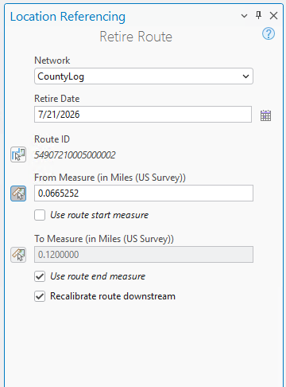
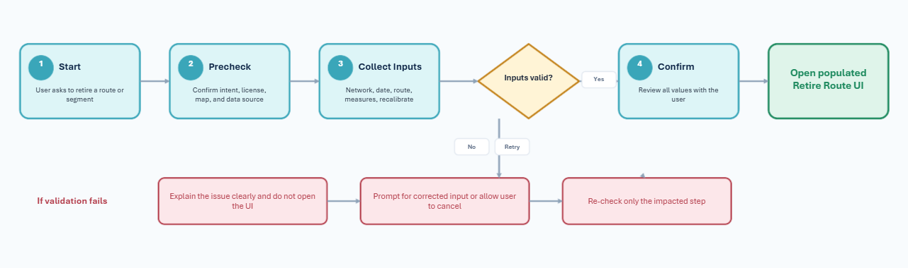
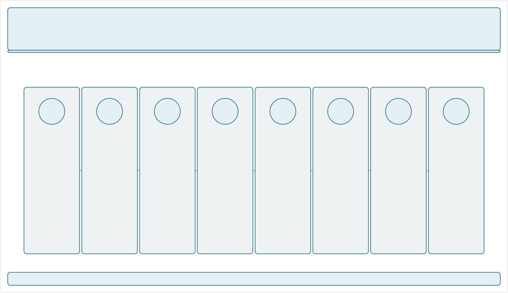

# Retire Route – Pro AI Assistant Test Plan

|   |   |
| --- | --- |
| **Kind** | Test Plan · Pro |
| **Release** | 3.8 / 12.2 |
| **Product** | Roads & Highways · Pipeline Referencing · Utility Network |
| **Issue** | [ArcGISPro/ps-location-referencing#7066](https://devtopia.esri.com/ArcGISPro/ps-location-referencing/issues/7066) |
| **Source** | [RetireRouteAIAssistant_TestPlan.pptx](<https://esriis.sharepoint.com/sites/LocationReferencing/Shared%20Documents/General/Test%20Plans/RetireRouteAIAssistant_TestPlan.pptx>) |
| **Edited** | 2026-08-05 15:50 by Karlie Murray |
| **Extracted** | 2026-09-04 · lane `xmlstrip` |

<!-- metadata
```yaml
title: "Retire Route – Pro AI Assistant Test Plan"
source_file: "RetireRouteAIAssistant_TestPlan.pptx"
source_url: "https://esriis.sharepoint.com/sites/LocationReferencing/Shared%20Documents/General/Test%20Plans/RetireRouteAIAssistant_TestPlan.pptx"
doc_id: 4
doc_kind: "Test Plan"
surface: "Pro"
doc_revision: ""
target_release: "3.8 / 12.2"
pe: "Karlie Murray"
dev: "Sharon Lai"
author: "Karlie Murray"
last_edited_by: "Karlie Murray"
last_edited: "2026-08-05T15:50:06Z"
extracted: 2026-09-04
extraction_lane: xmlstrip
prompt_version: "v2.0.2"
keywords: ["retire route", "intent recognition", "parameter validation", "date validation", "route identification", "measure validation", "recalibrate downstream", "error handling"]
tools: ["Retire Route"]
products: ["Roads & Highways", "Pipeline Referencing", "Utility Network"]
issues: ["ArcGISPro/ps-location-referencing#7066"]
related: [{"doc":2,"file":"iteration-planning-and-issue-tracking-for-location-referencing-3-8-12-2__doc2.md","s":1002.792},{"doc":51,"file":"realign-route-ai-assistant-test-plan__doc51.md","s":5.588},{"doc":11,"file":"reassign-route-subsequent-pane-ai-assistant-test-plan__doc11.md","s":5.144},{"doc":34,"file":"reassign-route-ai-assistant-test-plan__doc34.md","s":5.097},{"doc":80,"file":"realign-route-ai-assistant-test-plan__doc80.md","s":5.03}]
```
-->

## Summary

This test plan verifies the ArcGIS Pro AI Assistant's Retire Route skill, covering intent recognition, parameter collection, validation, UI handoff, and error handling. It includes test cases for licensing, network parameters, date validation, route identification, measure validation, recalibration preferences, and route-specific scenarios. The plan ensures the assistant handles positive and negative paths with clear messages and proper UI behavior.

## Related documents

<!-- related:begin -->
- [Iteration Planning and Issue Tracking for Location Referencing 3.8/12.2](<https://esriis.sharepoint.com/sites/lrsworkspace/LRS Doc Index/Schedules/iteration-planning-and-issue-tracking-for-location-referencing-3-8-12-2__doc2.md>) — shared issue ArcGISPro/ps-location-referencing#7066 · similar text 0.05 · same surface/release 3.8 / 12.2 <!-- rel:2 -->
- [Realign Route AI Assistant Test Plan](<https://esriis.sharepoint.com/sites/lrsworkspace/LRS Doc Index/Test Plans/realign-route-ai-assistant-test-plan__doc51.md>) — similar text 0.23 · 2 title words · 2 filename words · same kind/surface/folder <!-- rel:51 -->
- [Reassign Route Subsequent Pane AI Assistant Test Plan](<https://esriis.sharepoint.com/sites/lrsworkspace/LRS Doc Index/Test Plans/reassign-route-subsequent-pane-ai-assistant-test-plan__doc11.md>) — similar text 0.23 · 2 title words · 2 filename words · same kind/surface/folder <!-- rel:11 -->
- [Reassign Route AI Assistant Test Plan](<https://esriis.sharepoint.com/sites/lrsworkspace/LRS Doc Index/Test Plans/reassign-route-ai-assistant-test-plan__doc34.md>) — similar text 0.30 · 2 title words · 2 filename words · same kind/surface/folder <!-- rel:34 -->
- [Realign Route AI Assistant Test Plan](<https://esriis.sharepoint.com/sites/lrsworkspace/LRS Doc Index/Test Plans/realign-route-ai-assistant-test-plan__doc80.md>) — similar text 0.24 · 2 title words · 2 filename words · same kind/surface/folder <!-- rel:80 -->
<!-- related:end -->

<!-- docs:begin -->
## Esri documentation

[Retire routes](https://doc.esri.com/en/arcgis-pro/latest/help/production/roads-highways/retire-routes.html)
<!-- docs:end -->

---

## Slide 1

Retire Route – Pro AI Assistant
End-to-end verification of the ArcGIS Pro AI Assistant
Retire Route skill — prompt recognition, parameter
collection, validation, UI handoff, and negative paths.

Retire Route
AI Assistant Skill

ps-location-referencing #7066

Karlie Murray (PE)
Sharon Lai (Dev)

ArcGIS Pro 3.8
Enterprise 12.2

[figure: USER STORY · STORY / DEVTOPIA · OWNER · TARGET RELEASE]

## Slide 2


- Recognize retire intent from a flexible set of prompts (e.g., "retire a route", "retire the beginning of a road", "retire a pipeline segment").
- Verify Location Referencing licensing before proceeding.
- Walk the user through: Network → Retire Date → Route ID(s) → From/To Measures → Recalibrate Downstream.
- Confirm all inputs, then open a fully-populated Retire Route UI for the user to click Run.
- Provide clear error / cannot-complete messages on every failure path. Verify Retire Route only opens when no errors exist with the input parameters.

Test environment + Test data
ArcGIS Pro 3.8 with Pro AI Assistant add-on
ArcGIS Enterprise 12.2, Location Referencing configured

Simple & Complex routes: lollipop, loop, alpha, branch, infinity
Gapped & Multi-gapped routes

LRS Retire Route  ·  AI Assistant Test Plan
Feature Service Only

- RH Network with multi-field route Ids
- RH PostMile Network
- ADM RH Network
- APR Line Network
- UNAPR Line Network
- Network with z-values on 3D route
- Projected and unprojected data
- Spelling mistakes
- Different sentence structures and synonyms of retire
- I18n/L10n + A11y

 

## Slide 3


Flowchart Diagram

LRS Retire Route  ·  AI Assistant Test Plan
3 / 21



## Slide 4



Each stage below is a discrete checkpoint for testing. The assistant must confirm any values supplied in the initial prompt, gather anything missing, and produce a clear error when a stage fails.

Recognize retire intent; ask user to confirm before proceeding.

Verify Location Referencing license; link to docs on failure.

Confirm single network or prompt selection when multiple exist.

Validate against the route's valid time slice.

Verify route exists; ask for To route if line network.

Validate range and route extent; accept "entire route"/"all".

Capture user preference for downstream recalibration.

Confirm & hand off

Review all inputs; open populated Retire Route pane.

LRS Retire Route  ·  AI Assistant Test Plan
Assistant will be able to handle when a sentence has been structured with the above checkpoints (1, 3-7) out of order.

## Intent recognition test cases <!-- slide 5 -->

Intent recognition test cases
Verify the assistant selects Retire Route for expected phrasings and does not steal traffic from adjacent skills.

| ID | Prompt | Expected result | Notes |
| --- | --- | --- | --- |
| 01-A | "I want to retire a route" | Retire skill is recognized; asks for network, route, measures | Positive |
| 02-A | "Retire the beginning of Road R1 from 0 to 3" | Retire skill is recognized; pre-fills route + measures; asks to confirm. | Positive · initial prompt supplies params (RH data) |
| 03-A | "Retire a pipeline segment on line network A" | Retire skill is recognized; pre-fills network; asks for measures | Positive · (APR data) |
| 04-A | “Retire a segment of route R1 " | Retire skill is recognized; pre-fills route (if one network) | Positive |
| 05-A | "Retire a section of a route" | Retire skill is recognized; asks for network, route, measures | Positive |
| 06-A | “Retire a portion of the pipeline" | Retire skill is recognized; asks for network, route, measures | Positive · (APR data) |
| 07-A | “Discontinue a route" | Retire skill is recognized; asks for network, route, measures | Positive |
| 08-A | "Decommission this section of pipe" | Retire skill is recognized; asks for network, route, measures | Positive · (APR data) |
| 09-A | “Remove a route" | Calls the delete route skill | Negative (calls delete route) |
| 10-A | “Deactivate route R1” | Retire skill is recognized; pre-fills route (if one network) | Positive |
| 11-A | “Terminate this pipeline segment" | Retire skill is recognized; asks for network, route, measures | Positive · (APR data) |
| 12-A | “Eliminate route R1” | Calls the delete route skill | Negative |

LRS Retire Route  ·  AI Assistant Test Plan
5 / 21

## Intent recognition test cases <!-- slide 6 -->

Intent recognition test cases (Continued)

| ID | Prompt | Expected result | Notes |
| --- | --- | --- | --- |
| 13-A | “I want to take route R1 out of service" | Retire skill is recognized; pre-fills route (if one network) | Positive |
| 14-A | “End roadway section on route R1.1" | Retire skill is recognized; asks for network, route, measures | Positive · (RH data) |
| 15-A | “I want to perform a retirement on route R1” | Retire skill is recognized; asks for network, route, measures | Positive |
| 16-A | "Delete route R1" | Calls the delete route skill | Negative. Ambiguity handling |
| 17-A | “Abandon a route" | Calls realign skill | Negative. Ambiguity handling |
| 18-A | Same prompt entered 3× in a row | Skill selection is stable across repeated attempts. | Model determinism |

LRS Retire Route  ·  AI Assistant Test Plan
6 / 21

## Intent recognition test cases <!-- slide 7 -->

Intent recognition test cases

LRS Retire Route  ·  AI Assistant Test Plan
Take out of service
Section of a route
Portion of a route
Blue: Accepted
Red: Not accepted
Retire skill is recognized; asks for network, route, measures

[figure: Retire · Discontinue · Decommission · Remove · Deactivate · Eliminate · Terminate · Delete · Abandon · End · a/the/this/(blank) · Route · Pipeline · Road · Roadway · Pipe · Highway · Route segment · Pipeline segment · Section of pipeline · Portion of pipeline · Road segment · Section of road · Portion of road · …]

## Licensing & environment test cases <!-- slide 8 -->

Licensing & environment test cases
Every negative path must return a clear, actionable message. No silent failures, no UI hand-off.

| ID | Setup | Expected result | Notes |
| --- | --- | --- | --- |
| 01-B | LR license disabled | Assistant informs user LR license is required; does NOT open UI. | Negative |
| 02-B | LR license enabled, no LRS network in map | Assistant informs user an LRS Network is required in the map; does NOT open UI. | Negative |
| 03-B | Local scene with LRS network | Retire skill works identically to Pro map view. | Positive |
| 04-B | Non-feature-service source (e.g., FGDB) | Out of scope | Negative · out of scope for MVP |
| 05-B | User does not have edit privileges | Assistant will not notify user. Error will occur in UI. | Negative |
| 06-B | Signed-out portal | Assistant reports no LRS Networks found in the map | Negative |
| 07-B | AI Assistant is not set to Complex option | Assistant does not recognize retire skill | Negative |

LRS Retire Route  ·  AI Assistant Test Plan
8 / 21

## Network parameter test cases <!-- slide 9 -->

Network parameter test cases

| ID | Setup | Expected result | Notes |
| --- | --- | --- | --- |
| 01-C | One network in map, no network in prompt | Assistant confirms the single network; does not ask to pick. | Positive |
| 02-C | Multiple networks in map, no network in prompt | Assistant lists networks and prompts the user to choose. | Positive |
| 03-C | Network specified in initial prompt (valid) | Assistant confirms specified network; no picker shown. | Positive · confirmation |
| 04-C | Network specified in initial prompt (invalid name) | Assistant reports the network is not found and asks the user to pick from available. | Negative (invalid name must be not related to any data in map) |
| 05-C | No LRS network in map | Same message as 02-B (precondition failure). | Cross-check |
| 06-C | APR Line Network | Assistant handles APR-specific fields correctly. | Positive |
| 07-C | Post Mile network | Retire completes with post-mile values. | Positive |
| 08-C | Non-line network | Assistant handles Non-line network fields correctly | Positive |
| 09-C | Derived network | Assistant reports network not available with this tool | Negative |

LRS Retire Route  ·  AI Assistant Test Plan
9 / 21

## Intent Recognition test cases <!-- slide 10 -->

Intent Recognition Test Cases

LRS Retire Route  ·  AI Assistant Test Plan
Blue: Accepted
Red: Not accepted
Network parameter test cases

<Network does not exist>

[figure: In/within · Network · <Network Name> · Line Network · Road Network · APR Network · Pipeline Network · LRS Network · 10 / 21 · Derived Network · Engineering Network]

## Date validation test cases <!-- slide 11 -->

Date validation test cases

| ID | Setup | Expected result | Notes |
| --- | --- | --- | --- |
| 01-D | Valid retire date within route's time slice | Date accepted; assistant confirms and moves on. | Positive |
| 02-D | Line Network: Retire From Route = R1 (1/1/2026-Null), To Route = R2 (7/1/2026-Null) with Retire date = 8/1/2026 | Date accepted; assistant confirms and moves on. UI has correct from and to routes. | Positive - retire date is within both routes’ time slice |
| 03-D | Line Network: Retire From Route = R1 (1/1/2026-Null), To Route = R2 (7/1/2026-Null) with Retire date = 4/1/2026 | Assistant reports the date is outside valid time slice | Negative – retire date is only within one route’s time slice |
| 04-D | Date supplied in initial prompt | Assistant confirms the date and does not ask again. | Positive |
| 05-D | Date precedes the route start date | Assistant reports invalid date and requests a valid one. | Negative |
| 06-D | Date after the current route end date | Assistant reports the date is outside valid time slice | Negative |
| 07-D | Line Network: Retire From Route = R1 (1/1/2026-Null), To Route = R3 (7/1/2026 - Null) with Retire date = 5/1/2026 when R2 is (4/1/2026 - Null) | Assistant reports the date is outside valid time slice. | Negative |
| 08-D | Line Network: Retire From Route = R1 (1/1/2026-Null), To Route = R3 (7/1/2026-Null) with Retire date = 8/1/2026 when R2 is (4/1/2026 - Null) | Date accepted; assistant confirms and moves on. UI has correct from and to routes. | Positive |
| 09-D | Ambiguous natural-language date like today, tomorrow, yesterday | Correct date is entered when UI opens | Positive - Ambiguity handling |
| 10-D | Ambiguous natural-language date like next Friday, last Tuesday | Assistant will not accept dates like next Friday or last Tuesday | Negative |
| 11-D | Locale-specific date format (DD/MM/YYYY vs MM/DD/YYYY) | Assistant honors user locale and confirms explicit date. | I18n |
| 12-D | Empty / "no date" response | Date defaults to today |  |
| 13-D | Date is given but year not specified | Assistant prompts for year specification | Negative |
| 14-D | Invalid date (e.g., “7/34/25”) | Assistant re-prompts | Negative |
| 15-D | Specified route is already retired and the retire date is not within route’s time slice | Assistant reports the date is outside valid time slice. | Negative |
| 16-D | Specified route is already retired and the retire date is within route’s time slice | Date accepted; assistant confirms and moves on. | Positive |

LRS Retire Route  ·  AI Assistant Test Plan
11/ 21

## Intent Recognition test cases <!-- slide 12 -->

Intent Recognition Test Cases

LRS Retire Route  ·  AI Assistant Test Plan
Blue: Accepted
Red: Not accepted
Date validation test cases

January 1st, 2000
Network Parameter Test Cases
Retire Date = 01/01/2000
<date outside temporal range of route>

[figure: In/within · Date 01/01/2000 · 01/01/2000 · 01-01-2000 · January 1st · Today · Next Friday · On/with · 12 / 21 · 7/34/25]

## Route identification test cases <!-- slide 13 -->

Route identification test cases

| ID | Setup | Expected result | Notes |
| --- | --- | --- | --- |
| 01-E | Existing route ID supplied in prompt | Assistant confirms; does not re-prompt. | Positive |
| 02-E | Route ID not found in selected network | Assistant reports route not found and requests a valid one. | Negative |
| 03-E | Route name used when RouteID is the route identifier | Assistant reports route not found and requests a valid one. | Negative |
| 04-E | Multi-field route ID — all fields supplied | Assistant confirms all field values and proceeds. | Positive · multi-field |
| 05-E | Multi-field route ID — one field missing | Assistant reports route not found and requests a valid one. | Negative · multi-field |
| 06-E | Multi-field route ID — extra unrelated field | Assistant reports route not found and requests a valid one. | Negative · multi-field |
| 07-E | Line network: From route only supplied | Assistant prompts for the To route. | Positive · line network |
| 08-E | Line network: From and To routes are not on same line | Assistant prompts for valid routes | Negative · line network |
| 09-E | Line network: From and To routes are on same line but not in increasing Line Order | Assistant accepts and in UI the route order is corrected | Positive · line network |
| 10-E | Line network: From and To routes are not adjacent but on same line and in increasing Line Order | Assistant confirms; does not re-prompt. | Positive |
| 11-E | Route ID with special characters /spaces (valid route id/name) | Assistant confirms; does not re-prompt. | Positive - Robustness |
| 12-E | Specified route has multiple time-slices | Assistant selects the active time-slice | Positive (CDOT) |
| 13-E | Specified route is locked | Not in scope of this user story | Will be part of Conflict Prevention user story |

LRS Retire Route  ·  AI Assistant Test Plan
13 / 21

## Intent Recognition test cases <!-- slide 14 -->

Intent Recognition Test Cases

LRS Retire Route  ·  AI Assistant Test Plan
Blue: Accepted
Red: Not accepted
Route identification test cases

Network Parameter Test Cases
Date Validation Test Cases
<route does not exist in network>
Route name/route id used interchangeably
From RouteName R1 and To RouteName R2
From Route R1 to Route R2
Between R1 and R2
Spanning routes R1 to R2

[figure: In/within · RouteName R1 · RouteName = R1 · R1 · This route · <route not given> · On/with · For/on/with · 14/ 21 · Road R1 · Pipe R1]

## From / To measure validation test cases <!-- slide 15 -->

From / To measure validation test cases

| ID | Setup | Expected result | Notes |
| --- | --- | --- | --- |
| 01-F | From Measure and To Measure supplied, valid range within route extent | Assistant confirms measures and proceeds. | Positive |
| 02-F | "Entire route" / "all of the route" / "the whole route”/ “full length of route” | Assistant maps to full route extent and confirms From/To. | Positive · terminology |
| 03-F | From Measure > To Measure | Assistant confirms measures and proceeds | Positive |
| 04-F | From Measure = To Measure (unless spanning multiple routes in line network) | Assistant reports measures cannot be the same | Negative |
| 05-F | From Measure is less than route's minimum measure | Assistant reports out-of-extent and re-prompts. | Negative |
| 06-F | To Measure is greater than route's maximum measure | Assistant reports out-of-extent and re-prompts. | Negative |
| 07-F | Only From Measure provided | Assistant asks for To and confirms both. | Positive · partial |
| 08-F | Only To Measure provided | Assistant asks for From and confirms both. | Positive · partial |
| 09-F | Non-numeric measure input | Assistant asks for a numeric value. | Negative |
| 10-F | Post-mile network with non-decimal measures | Assistant handles post-mile format correctly. | Negative · APR/Post Mile |

LRS Retire Route  ·  AI Assistant Test Plan
15 / 21

## Intent Recognition test cases <!-- slide 16 -->

Intent Recognition Test Cases

LRS Retire Route  ·  AI Assistant Test Plan
Blue: Accepted
Red: Not accepted
From/To measure validation test cases

From Measure 0 To Measure 10
From Measure zero To Measure ten
Spanning measures 0 to 10
<measure not given>
Network Parameter Test Cases
Date Validation Test Cases
<measure does not exist on route>
Route IdentificationTest Cases
Measures 0 - 10
Spanning measures 0 through 10
Beginning/end/middle of route
The start to the end
Between measures 0 and 10
From Measure = 0 and To Measure = 10
Full length of route

[figure: In/within · Measure 10 · On/with · For/on/with · With/at · 0 -10 · Entire route · 16 / 21]

## Slide 17

Recalibrate downstream and confirmation cases

| ID | Setup | Expected result | Notes |
| --- | --- | --- | --- |
| 01-G | User answers Yes to recalibrate downstream | Preference captured and reflected on confirmation & UI. | Positive |
| 02-G | User answers No to recalibrate downstream (line network) | Preference captured; UI checkbox unchecked. | Positive (line network only) |
| 03-G | User answers No to recalibrate downstream (non-line network) | Preference captured; UI checkbox unchecked | Positive |
| 04-G | User supplies preference in initial prompt | Assistant confirms; does not ask again. | Positive · confirmation |
| 05-G | User asks a clarifying question | Out of scope for MVP — assistant informs the user and asks again. | Out of Scope |
| 06-G | User edits one value after UI opens | Assistant updates that value and re-confirms without restart. | Positive |
| 07-G | User cancels at any time | Assistant closes gracefully; no partial changes; UI not opened. | Positive |
| 08-G | UI hand-off populated exactly with confirmed values | Retire Route pane opens on pane 1 with all values pre-filled; user clicks Run. | Positive · critical |
| 09-G | Assistant recovery mid-conversation (user rephrases) | Assistant preserves already-confirmed values. | Non-functional |

LRS Retire Route  ·  AI Assistant Test Plan
17/ 21

## Intent Recognition test cases <!-- slide 18 -->

Intent Recognition Test Cases

LRS Retire Route  ·  AI Assistant Test Plan
Blue: Accepted
Red: Not accepted
Recalibrate downstream and confirmation cases

Network Parameter Test Cases
Date Validation Test Cases
Route IdentificationTest Cases
Update measures downstream
Measure Validation Test Cases
And do/and do not

[figure: In/within · Recalibrate downstream · Update downstream · Refresh downstream · On/with · For/on/with · With/at · Calibrate downstream · 18 / 21 · Perform recalibration]

## Route specific test cases <!-- slide 19 -->

Route specific test cases

| ID | Test Case | Expected Result | Notes |
| --- | --- | --- | --- |
| 01-H | Retire the full length of a simple route | Assistant sends correct route & measures to UI | Positive |
| 02-H | Retire the beginning portion of a simple route | Assistant sends correct route & measures to UI | Positive |
| 03-H | Retire the middle portion of a simple route | Assistant sends correct route & measures to UI | Positive |
| 04-H | Retire the end portion of a simple route | Assistant sends correct route & measures to UI | Positive |
| 05-H | Retire a portion of a gapped route | Assistant sends correct route & measures to UI | Positive |
| 06-H | Retire the full length of a multi-gapped route | Assistant sends correct route & measures to UI | Positive |
| 07-H | Retire the full length of a branch route | Assistant sends correct route & measures to UI | Positive |
| 08-H | Retire a portion of a lollipop route in the middle of the route | Out of scope – Assistant will not catch retiring self-intersecting routes in the middle. Only UI will catch this. | Out of scope |
| 09-H | Retire the full length of a loop route | Assistant sends correct route & measures to UI | Positive |
| 10-H | Retire a portion of an alpha route | Assistant sends correct route & measures to UI | Positive |
| 11-H | Retire the beginning or ending portion of an infinity route | Assistant sends correct route & measures to UI | Positive |
| 12-H | Retire a route with a concurrent route present | Assistant sends correct route & measures to UI | Positive |
| 13-H | Retire route that has multiple time-slices | Assistant sends correct route, time-slice, & measures to UI | Positive |

LRS Retire Route  ·  AI Assistant Test Plan
19/ 21

## Full prompt test cases <!-- slide 20 -->

Full prompt test cases

| ID | Test Case | Expected Result | Notes |
| --- | --- | --- | --- |
| 01-I | “I want to perform a retirement on route R1 to route R2 in the Engineering Network between measures 0 and 10 and recalibrate downstream with retire date 01/01/2000.” | Accepted and sent to UI | Positive |
| 02-I | “On 01/01/2000, retire the beginning of Road R1 from 0 to 3 in county log network and recalibrate downstream." | Accepted and sent to UI | Positive |
| 03-I | "Decommission a section of pipe as of January 1 st 2000 between R1 to R2 s panning measures 0 to 10 and don’t update downstream in the engineering network. " | Accepted and sent to UI | Positive |
| 04-I | “In the engineering network, retire a portion of the pipeline spanning routes R1 to R2 with retire date = 01/01/2000 and From Measure = 0 To Measure = 10 do not refresh downstream." | Accepted and sent to UI | Positive |
| 05-I | “I want to take the full length of route R1 in county log network out of service and recalibrate downstream today." | Accepted and sent to UI | Positive |
| 06-I | “Without calibrating downstream, retire pipeline segment 0-10 on pipe R1 to R2 in the engineering line network as of today." | Accepted and sent to UI | Positive |
| 07-I | “As of date 01-01-2000, I want to end the roadway section on routeid = R1 at measures 0-10 in the road network with the option to update measures downstream." | Accepted and sent to UI | Positive |
| 08-I | “At measures 0 through 10 on R1 in the LRS Network, deactivate the route R1 as of 01/01/2000 and recalibrate downstream.” | Accepted and sent to UI | Positive |
| 09-I | “From route R1 to route R2 in the engineering network, discontinue the pipeline from measure 0 to 10 at date 01-01-2000 and don’t recalibrate downstream.” | Accepted and sent to UI | Positive |
| 10-I | “Retire a segment of pipe in the engineering network for pipe R1 at measures 0 through 10 on January 1st, 2000 and recalibrate the downstream measures” | Accepted and sent to UI | Positive |
| 11-I | “I want to decommission the entire route R1 in county log on 01-01-2000 and perform recalibration.” | Accepted and sent to UI | Positive |
| 12-I | “Retire pipe R1 to R2 at measures 0 – 10 within the APR engineering network at date 01/01/2000 without recalibrating downstream” | Accepted and sent to UI | Positive |
| 13-I | “Retire the start to the end of route = R1 in county log and recalibrate downstream on date = 01/01/2000” | Accepted and sent to UI | Positive |
| 14-I | “I’d like to take the entire pipeline R1 out of service and retire it today while not recalibrating downstream in the engineering network” | Accepted and sent to UI | Positive |
| 15-I | “On January 1 st, 2000, deactivate road R1 between measures 0 and 10 in the network and update measures downstream.” | Accepted and sent to UI | Positive |

LRS Retire Route  ·  AI Assistant Test Plan
20/ 21

## Slide 21

Every failure below must return a clear, actionable message and must not open the Retire Route pane.

- No LRS license
- No LRS network in map
- Non-feature-service source
- No editing privileges
- Unknown network name in prompt
- Multi-network with no selection
- Line network without To route
- Before route start
- After route end
- Ambiguous natural-language
- Empty date
- Route ID not found
- Missing multi-field ID field
- Line-network endpoints not adjacent
- From > To
- From = To
- Out of route extent
- Non-numeric input
- AI service unavailable
- Skill selection instability
- Assistant timeout / no response

LRS Retire Route  ·  AI Assistant Test Plan

[figure: Error-handling matrix · PRECONDITIONS · NETWORK · DATE · ROUTE · MEASURES · SERVICE · 21/ 21]
