# Retire Routes: Snap Event Behavior Test Plan

|   |   |
| --- | --- |
| **Kind** | Test Plan · Experience Builder |
| **Release** | — |
| **Product** | Roads & Highways · Pipeline Referencing |
| **Issue** | [ArcGISPro/ps-location-referencing#3780](https://devtopia.esri.com/ArcGISPro/ps-location-referencing/issues/3780) |
| **Source** | [3780-RetireRoutesSnapEB_TestPlanV3.pptx](<https://esriis.sharepoint.com/sites/LocationReferencing/Shared%20Documents/General/Test%20Plans/3780-RetireRoutesSnapEB_TestPlanV3.pptx>) |
| **Edited** | 2023-12-04 18:55 by Mac Christmas |
| **Extracted** | 2026-09-04 · lane `xmlstrip` |

<!-- metadata
```yaml
title: "Retire Routes: Snap Event Behavior Test Plan"
source_file: "3780-RetireRoutesSnapEB_TestPlanV3.pptx"
source_url: "https://esriis.sharepoint.com/sites/LocationReferencing/Shared%20Documents/General/Test%20Plans/3780-RetireRoutesSnapEB_TestPlanV3.pptx"
doc_id: 454
doc_kind: "Test Plan"
surface: "Experience Builder"
doc_revision: "V3"
target_release: ""
pe: ""
dev: ""
author: "Mac Christmas"
last_edited_by: "Mac Christmas"
last_edited: "2023-12-04T18:55:38Z"
extracted: 2026-09-04
extraction_lane: xmlstrip
prompt_version: "v2.0.2"
keywords: ["retire route", "snap event behavior", "event behavior", "concurrent routes", "route retirement", "recalibrate downstream", "line event", "point event", "route dominance"]
tools: ["Retire Routes"]
products: ["Roads & Highways", "Pipeline Referencing"]
issues: ["ArcGISPro/ps-location-referencing#3780"]
related: [{"doc":478,"file":"support-snap-event-behavior-in-retire-routes__doc478.md","s":1007.294},{"doc":479,"file":"support-snap-event-behavior-in-retire-routes__doc479.md","s":1007.164},{"doc":527,"file":"transfer-to-another-line-support-snap-event-behavior-test-plan__doc527.md","s":4.357},{"doc":528,"file":"reassign-transfer-to-another-line-with-stayput-and-retire-event-behavior-test__doc528.md","s":4.215},{"doc":533,"file":"reassign-route-transfer-to-another-line-method-support-move-event-behavior-test__doc533.md","s":2.899}]
```
-->

## Summary

This test plan covers the Snap Event Behavior functionality in the Retire Routes process, ensuring compatibility with ArcMap and ArcGIS Pro. It includes positive test cases for various scenarios such as retiring whole, partial, middle sections, and multiple routes with events configured for Snap Event Behavior, concurrent routes, recalibration downstream, and different network types. The document also provides detailed event and route data tables illustrating test scenarios and expected behaviors.

## Related documents

<!-- related:begin -->
- [Support Snap Event Behavior in Retire Routes](<https://esriis.sharepoint.com/sites/lrsworkspace/LRS Doc Index/User Stories/support-snap-event-behavior-in-retire-routes__doc478.md>) — shared issue ArcGISPro/ps-location-referencing#3780 · similar text 0.72 · 5 title words · 2 filename words · same surface <!-- rel:478 -->
- [Support Snap Event Behavior in Retire Routes](<https://esriis.sharepoint.com/sites/lrsworkspace/LRS Doc Index/User Stories/support-snap-event-behavior-in-retire-routes__doc479.md>) — shared issue ArcGISPro/ps-location-referencing#3780 · similar text 0.72 · 5 title words · 2 filename words · same surface <!-- rel:479 -->
- [Transfer to Another Line – Support Snap Event Behavior Test Plan](<https://esriis.sharepoint.com/sites/lrsworkspace/LRS Doc Index/Test Plans/transfer-to-another-line-support-snap-event-behavior-test-plan__doc527.md>) — similar text 0.12 · 3 title words · 1 filename word · same kind/surface/folder <!-- rel:527 -->
- [Reassign - Transfer to Another Line with StayPut and Retire Event Behavior - Test Plan](<https://esriis.sharepoint.com/sites/lrsworkspace/LRS%20Doc%20Index/Test%20Plans/reassign-transfer-to-another-line-with-stayput-and-retire-event-behavior-test__doc528.md>) — similar text 0.15 · 3 title words · 1 filename word · same kind/folder <!-- rel:528 -->
- [Reassign Route Transfer to Another Line Method: Support Move Event Behavior Test Plan](<https://esriis.sharepoint.com/sites/lrsworkspace/LRS Doc Index/Test Plans/reassign-route-transfer-to-another-line-method-support-move-event-behavior-test__doc533.md>) — similar text 0.22 · 2 title words · same kind/folder <!-- rel:533 -->
<!-- related:end -->

<!-- docs:begin -->
## Esri documentation

[Retire routes](https://doc.esri.com/en/arcgis-pro/latest/help/production/roads-highways/retire-routes.html) · [Event behavior](https://doc.esri.com/en/arcgis-pro/latest/help/production/roads-highways/what-is-event-behavior.html)
<!-- docs:end -->

---

## Slide 1

Retire Routes: Snap Event Behavior

| Notes |
| --- |
| Need to support Snap Event Behavior in Retire Routes, following ArcMap functionality This is one of the last functionalities left to bring forward to Pro from ArcMap Test with RH and APR datasets Test in FGDB and FS Test on projected and unprojected data Test with spanning/non-spanning line events and point events Test retiring whole, partial, middle sections, and multiple routes with events that have Snap EB configured Test with multiple concurrent routes to ensure route dominance rules are honored Test with recalibrate downstream enabled/disabled and ensure configured downstream EB executes as expected Ensure other areas where EBs are exposed properly show Snap for Retire |

Devtopia Issue

| Positive Tests: GP Tools |
| --- |
| Snap EB configuration for Retire can be chosen in Modify Event Behavior Rules Snap EB configuration for Retire can be chosen in Configure External Events Snap EB configuration for Retire will carry over when migrating an ArcMap dataset to Pro |

| Positive Tests: Other |
| --- |
| Arcpy.Describe will show Snap EB for Retire in metadata In Layer Properties, the Location Referencing section will show the Retire EB as Snap |

| Positive Tests: Nonline Network |
| --- |
| Retire whole route with concurrent route present, events snap to concurrent route Retire first half of route with concurrent route present, events in retired portion split and snap to concurrent route Retire middle portion of route with concurrent route present, events in retired portion split and snap to concurrent route Retire second half of route with concurrent route present, events in retired portion split and snap to concurrent route Retire whole route with partially concurrent route present, events in concurrent section split and snap to concurrent route Retire whole route with multiple concurrent routes present, events snap to dominant concurrent route Retire whole route with gapped concurrent route present, events split and snap to concurrent route Retire whole route with no concurrent route present, events will stay put and retire Retire whole route with multiple partial concurrencies present, events snap to concurrent routes Retire partial route with concurrent route present, point event is on cusp of retirement on source route Retired route is gapped with a concurrent route present Retire route with non-proportional concurrent route present Retire complex route with concurrent route present Retire vertical route with concurrent route present Retire partial route with concurrent route present and recalibrate downstream is checked with events having Stay Put Calibrate EB Retire partial route with concurrent route present and recalibrate downstream is checked with events having Move Calibrate EB Retire partial route with concurrent route present and recalibrate downstream is checked with events having Retire Calibrate EB Retire whole route with time sliced concurrent route present. |

## Slide 2

| Positive Tests: Line Network |
| --- |
| Retire all routes on a line with concurrent route present, events snap to concurrent route Retire first half of routes on a line with concurrent route present, events in retired portion split and snap to concurrent route Retire middle route on a line with concurrent route present, events in retired portion split and snap to concurrent route Retire last half of routes on a line with concurrent route present, events in retired portion split and snap to concurrent route Retire whole route on a line with partially concurrent route present, events in concurrent section split and snap to concurrent route Retire whole route on a line with multiple concurrent routes present, events snap to dominant concurrent route Retire all routs on a line with concurrent gapped route, events split and snap to concurrent route Retire all routes on a line with no concurrent route present, events will stay put and retire Retired route is gapped with a concurrent route present Retire route with non-proportional concurrent route present Retire complex route with concurrent route present Retire vertical route with concurrent route present Retire partial route with concurrent route present and recalibrate downstream is checked with events having Stay Put Calibrate EB Retire partial route with concurrent route present and recalibrate downstream is checked with events having Move Calibrate EB Retire partial route with concurrent route present and recalibrate downstream is checked with events having Retire Calibrate EB Retire whole route with time sliced concurrent route present. |

## Case 1 <!-- slide 3 -->

### Retire Whole Route

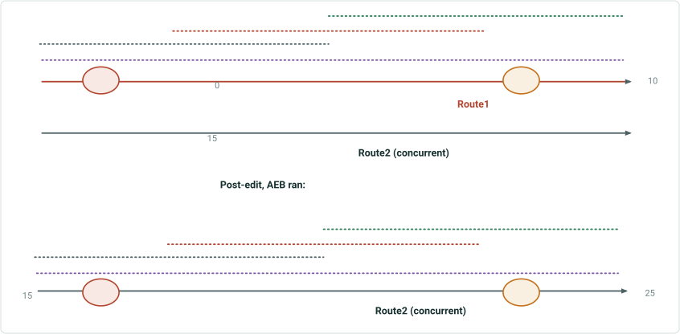

| RouteID | FromDate | ToDate |
| --- | --- | --- |
| Route1 | 1/1/2000 | NULL |
| Route2 | 1/1/2000 | NULL |

| RouteID | FromDate | ToDate |
| --- | --- | --- |
| Route1 | 1/1/2000 | 1/1/2005 |
| Route2 | 1/1/2000 | NULL |

| Event Layer | EventID | RouteID | From Date | To Date | From Measure | To Measure |
| --- | --- | --- | --- | --- | --- | --- |
| Point | Pt1 | Route1 | 1/1/2000 | NULL | 2 | N/A |
| Point | Pt2 | Route1 | 1/1/2000 | NULL | 8 | N/A |
| Line | Line1 | Route1 | 1/1/2000 | NULL | 0 | 10 |
| Line | Line2 | Route1 | 1/1/2000 | NULL | 0 | 5 |
| Line | Line3 | Route1 | 1/1/2000 | NULL | 3 | 7 |
| Line | Line4 | Route1 | 1/1/2000 | NULL | 5 | 10 |

| Event Layer | EventID | RouteID | From Date | To Date | From Measure | To Measure |
| --- | --- | --- | --- | --- | --- | --- |
| Point | Pt1 | Route1 | 1/1/2000 | 1/1/2005 | 2 | N/A |
| Point | Pt2 | Route1 | 1/1/2000 | 1/1/2005 | 8 | N/A |
| Line | Line1 | Route1 | 1/1/2000 | 1/1/2005 | 0 | 10 |
| Line | Line2 | Route1 | 1/1/2000 | 1/1/2005 | 0 | 5 |
| Line | Line3 | Route1 | 1/1/2000 | 1/1/2005 | 3 | 7 |
| Line | Line4 | Route1 | 1/1/2000 | 1/1/2005 | 5 | 10 |
| Point | Pt1 | Route2 | 1/1/2005 | NULL | 17 | N/A |
| Point | Pt2 | Route2 | 1/1/2005 | NULL | 23 | N/A |
| Line | Line1 | Route2 | 1/1/2005 | NULL | 15 | 25 |
| Line | Line2 | Route2 | 1/1/2005 | NULL | 15 | 20 |
| Line | Line3 | Route2 | 1/1/2005 | NULL | 18 | 22 |
| Line | Line4 | Route2 | 1/1/2005 | NULL | 20 | 25 |

## Case 2 <!-- slide 4 -->

### Retire First Half of Route


| RouteID | FromDate | ToDate |
| --- | --- | --- |
| Route1 | 1/1/2000 | NULL |
| Route2 | 1/1/2000 | NULL |

| RouteID | FromDate | ToDate |
| --- | --- | --- |
| Route1 | 1/1/2000 | 1/1/2005 |
| Route1 | 1/1/2005 | NULL |
| Route2 | 1/1/2000 | NULL |

| Event Layer | EventID | RouteID | From Date | To Date | From Measure | To Measure |
| --- | --- | --- | --- | --- | --- | --- |
| Point | Pt1 | Route1 | 1/1/2000 | NULL | 2 | N/A |
| Point | Pt2 | Route1 | 1/1/2000 | NULL | 8 | N/A |
| Line | Line1 | Route1 | 1/1/2000 | NULL | 0 | 10 |
| Line | Line2 | Route1 | 1/1/2000 | NULL | 0 | 5 |
| Line | Line3 | Route1 | 1/1/2000 | NULL | 3 | 7 |
| Line | Line4 | Route1 | 1/1/2000 | NULL | 5 | 10 |

| Event Layer | EventID | RouteID | From Date | To Date | From Measure | To Measure |
| --- | --- | --- | --- | --- | --- | --- |
| Point | Pt1 | Route1 | 1/1/2000 | 1/1/2005 | 2 | N/A |
| Point | Pt2 | Route1 | 1/1/2000 | NULL | 8 | N/A |
| Line | Line1 | Route1 | 1/1/2000 | 1/1/2005 | 0 | 10 |
| Line | Line2 | Route1 | 1/1/2000 | 1/1/2005 | 0 | 5 |
| Line | Line3 | Route1 | 1/1/2000 | 1/1/2005 | 3 | 7 |
| Line | Line4 | Route1 | 1/1/2000 | NULL | 5 | 10 |
| Point | Pt1 | Route2 | 1/1/2005 | NULL | 2 | N/A |
| Line | Line1 | Route2 | 1/1/2005 | NULL | 15 | 20 |
| Line | Line1 | Route1 | 1/1/2005 | NULL | 5 | 10 |
| Line | Line2 | Route2 | 1/1/2005 | NULL | 15 | 20 |
| Line | Line3 | Route2 | 1/1/2005 | NULL | 18 | 20 |
| Line | Line3 | Route1 | 1/1/2005 | NULL | 5 | 7 |

## Case 3 <!-- slide 5 -->

### Retire Middle Section of Route

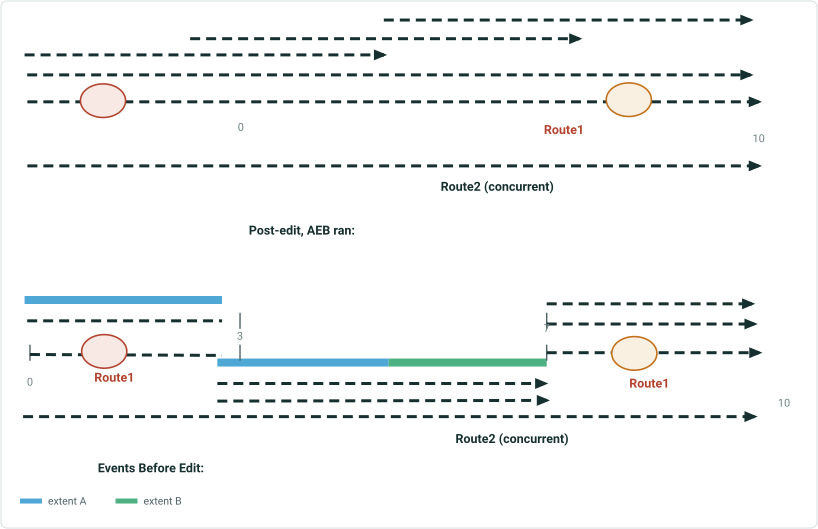

| RouteID | FromDate | ToDate |
| --- | --- | --- |
| Route1 | 1/1/2000 | NULL |
| Route2 | 1/1/2000 | NULL |

| RouteID | FromDate | ToDate |
| --- | --- | --- |
| Route1 | 1/1/2000 | 1/1/2005 |
| Route1 | 1/1/2005 | NULL |
| Route2 | 1/1/2000 | NULL |

| Event Layer | EventID | RouteID | From Date | To Date | From Measure | To Measure |
| --- | --- | --- | --- | --- | --- | --- |
| Point | Pt1 | Route1 | 1/1/2000 | NULL | 2 | N/A |
| Point | Pt2 | Route1 | 1/1/2000 | NULL | 8 | N/A |
| Line | Line1 | Route1 | 1/1/2000 | NULL | 0 | 10 |
| Line | Line2 | Route1 | 1/1/2000 | NULL | 0 | 5 |
| Line | Line3 | Route1 | 1/1/2000 | NULL | 3 | 7 |
| Line | Line4 | Route1 | 1/1/2000 | NULL | 5 | 10 |

| Event Layer | EventID | RouteID | From Date | To Date | From Measure | To Measure |
| --- | --- | --- | --- | --- | --- | --- |
| Point | Pt1 | Route1 | 1/1/2000 | NULL | 2 | N/A |
| Point | Pt2 | Route1 | 1/1/2000 | NULL | 8 | N/A |
| Line | Line1 | Route1 | 1/1/2000 | 1/1/2005 | 0 | 10 |
| Line | Line2 | Route1 | 1/1/2000 | 1/1/2005 | 0 | 5 |
| Line | Line3 | Route1 | 1/1/2000 | 1/1/2005 | 3 | 7 |
| Line | Line4 | Route1 | 1/1/2000 | 1/1/2005 | 5 | 10 |
| Line | Line1 | Route1 | 1/1/2005 | NULL | 0 | 3 |
| Line | Line1 | Route2 | 1/1/2005 | NULL | 3 | 7 |
| Line | Line1 | Route1 | 1/1/2005 | NULL | 7 | 10 |
| Line | Line2 | Route1 | 1/1/2005 | NULL | 0 | 3 |
| Line | Line2 | Route2 | 1/1/2005 | NULL | 3 | 5 |
| Line | Line3 | Route2 | 1/1/2005 | NULL | 3 | 7 |
| Line | Line4 | Route2 | 1/1/2005 | NULL | 5 | 7 |
| Line | Line4 | Route1 | 1/1/2005 | NULL | 7 | 10 |

## Case 4 <!-- slide 6 -->

### Retire Second Half of Route

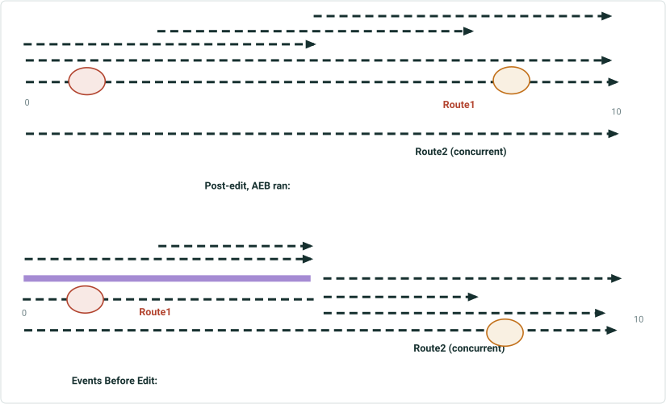

| RouteID | FromDate | ToDate |
| --- | --- | --- |
| Route1 | 1/1/2000 | NULL |
| Route2 | 1/1/2000 | NULL |

| RouteID | FromDate | ToDate |
| --- | --- | --- |
| Route1 | 1/1/2000 | 1/1/2005 |
| Route1 | 1/1/2005 | NULL |
| Route2 | 1/1/2000 | NULL |

| Event Layer | EventID | RouteID | From Date | To Date | From Measure | To Measure |
| --- | --- | --- | --- | --- | --- | --- |
| Point | Pt1 | Route1 | 1/1/2000 | NULL | 2 | N/A |
| Point | Pt2 | Route1 | 1/1/2000 | NULL | 8 | N/A |
| Line | Line1 | Route1 | 1/1/2000 | NULL | 0 | 10 |
| Line | Line2 | Route1 | 1/1/2000 | NULL | 0 | 5 |
| Line | Line3 | Route1 | 1/1/2000 | NULL | 3 | 7 |
| Line | Line4 | Route1 | 1/1/2000 | NULL | 5 | 10 |

| Event Layer | EventID | RouteID | From Date | To Date | From Measure | To Measure |
| --- | --- | --- | --- | --- | --- | --- |
| Point | Pt1 | Route1 | 1/1/2000 | NULL | 2 | N/A |
| Point | Pt2 | Route1 | 1/1/2000 | 1/1/2005 | 8 | N/A |
| Line | Line1 | Route1 | 1/1/2000 | 1/1/2005 | 0 | 10 |
| Line | Line2 | Route1 | 1/1/2000 | NULL | 0 | 5 |
| Line | Line3 | Route1 | 1/1/2000 | 1/1/2005 | 3 | 7 |
| Line | Line4 | Route1 | 1/1/2000 | 1/1/2005 | 5 | 10 |
| Point | Pt2 | Route2 | 1/1/2005 | NULL | 8 | N/A |
| Line | Line1 | Route1 | 1/1/2005 | NULL | 0 | 5 |
| Line | Line1 | Route2 | 1/1/2005 | NULL | 5 | 10 |
| Line | Line3 | Route1 | 1/1/2005 | NULL | 3 | 5 |
| Line | Line3 | Route2 | 1/1/2005 | NULL | 5 | 7 |
| Line | Line4 | Route2 | 1/1/2005 | NULL | 5 | 10 |

## Case 5 <!-- slide 7 -->

### Retire Whole Route, Partial Concurrency

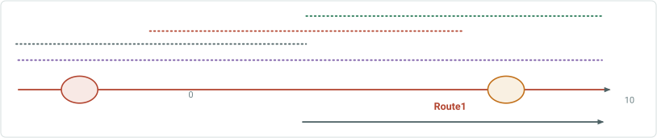

| RouteID | FromDate | ToDate |
| --- | --- | --- |
| Route1 | 1/1/2000 | NULL |
| Route2 | 1/1/2000 | NULL |

| RouteID | FromDate | ToDate |
| --- | --- | --- |
| Route1 | 1/1/2000 | 1/1/2005 |
| Route2 | 1/1/2000 | NULL |

Route2 ( partially concurrent)

| Event Layer | EventID | RouteID | From Date | To Date | From Measure | To Measure |
| --- | --- | --- | --- | --- | --- | --- |
| Point | Pt1 | Route1 | 1/1/2000 | NULL | 2 | N/A |
| Point | Pt2 | Route1 | 1/1/2000 | NULL | 8 | N/A |
| Line | Line1 | Route1 | 1/1/2000 | NULL | 0 | 10 |
| Line | Line2 | Route1 | 1/1/2000 | NULL | 0 | 5 |
| Line | Line3 | Route1 | 1/1/2000 | NULL | 3 | 7 |
| Line | Line4 | Route1 | 1/1/2000 | NULL | 5 | 10 |

| Event Layer | EventID | RouteID | From Date | To Date | From Measure | To Measure |
| --- | --- | --- | --- | --- | --- | --- |
| Point | Pt1 | Route1 | 1/1/2000 | 1/1/2005 | 2 | N/A |
| Point | Pt2 | Route1 | 1/1/2000 | 1/1/2005 | 8 | N/A |
| Line | Line1 | Route1 | 1/1/2000 | 1/1/2005 | 0 | 10 |
| Line | Line2 | Route1 | 1/1/2000 | 1/1/2005 | 0 | 5 |
| Line | Line3 | Route1 | 1/1/2000 | 1/1/2005 | 3 | 7 |
| Line | Line4 | Route1 | 1/1/2000 | 1/1/2005 | 5 | 10 |
| Point | Pt2 | Route2 | 1/1/2005 | NULL | 8 | N/A |
| Line | Line1 | Route2 | 1/1/2005 | NULL | 5 | 10 |
| Line | Line3 | Route2 | 1/1/2005 | NULL | 5 | 7 |
| Line | Line4 | Route2 | 1/1/2005 | NULL | 5 | 10 |

Route2 ( partially concurrent)

## Case 6 <!-- slide 8 -->

### Retire Whole Route with Multiple Concurrencies

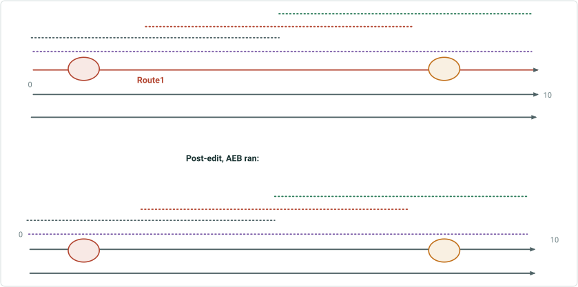

| RouteID | FromDate | ToDate |
| --- | --- | --- |
| Route1 | 1/1/2000 | NULL |
| Route2 | 1/1/2000 | NULL |
| Route3 | 1/1/2000 | NULL |

| RouteID | FromDate | ToDate |
| --- | --- | --- |
| Route1 | 1/1/2000 | 1/1/2005 |
| Route2 | 1/1/2000 | NULL |
| Route3 | 1/1/2000 | NULL |

| Event Layer | EventID | RouteID | From Date | To Date | From Measure | To Measure |
| --- | --- | --- | --- | --- | --- | --- |
| Point | Pt1 | Route1 | 1/1/2000 | NULL | 2 | N/A |
| Point | Pt2 | Route1 | 1/1/2000 | NULL | 8 | N/A |
| Line | Line1 | Route1 | 1/1/2000 | NULL | 0 | 10 |
| Line | Line2 | Route1 | 1/1/2000 | NULL | 0 | 5 |
| Line | Line3 | Route1 | 1/1/2000 | NULL | 3 | 7 |
| Line | Line4 | Route1 | 1/1/2000 | NULL | 5 | 10 |

| Event Layer | EventID | RouteID | From Date | To Date | From Measure | To Measure |
| --- | --- | --- | --- | --- | --- | --- |
| Point | Pt1 | Route1 | 1/1/2000 | 1/1/2005 | 2 | N/A |
| Point | Pt2 | Route1 | 1/1/2000 | 1/1/2005 | 8 | N/A |
| Line | Line1 | Route1 | 1/1/2000 | 1/1/2005 | 0 | 10 |
| Line | Line2 | Route1 | 1/1/2000 | 1/1/2005 | 0 | 5 |
| Line | Line3 | Route1 | 1/1/2000 | 1/1/2005 | 3 | 7 |
| Line | Line4 | Route1 | 1/1/2000 | 1/1/2005 | 5 | 10 |
| Point | Pt1 | Route2 | 1/1/2005 | NULL | 2 | N/A |
| Point | Pt2 | Route2 | 1/1/2005 | NULL | 8 | N/A |
| Line | Line1 | Route2 | 1/1/2005 | NULL | 0 | 10 |
| Line | Line2 | Route2 | 1/1/2005 | NULL | 0 | 5 |
| Line | Line3 | Route2 | 1/1/2005 | NULL | 3 | 7 |
| Line | Line4 | Route2 | 1/1/2005 | NULL | 5 | 10 |

Route2 (concurrent, dominant)

Route2 (concurrent, dominant)

Route3 (concurrent, non-dominant)
Route3 (concurrent, non-dominant)

## Case 7 <!-- slide 9 -->

### Retire Whole Route, Concurrent Route Has Gap

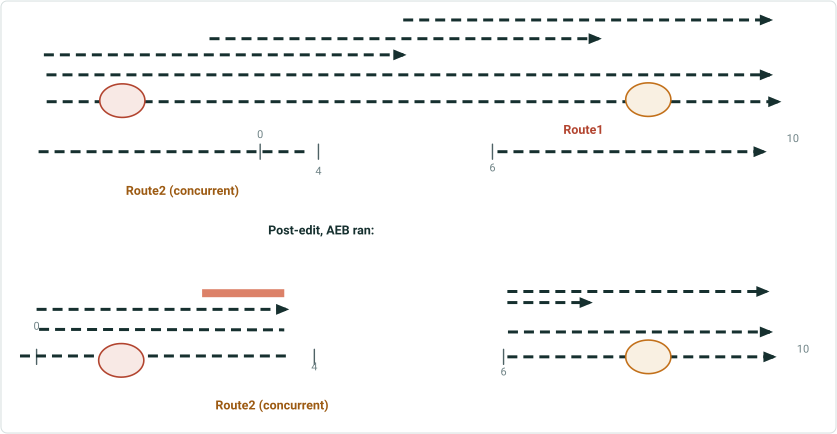

| RouteID | FromDate | ToDate |
| --- | --- | --- |
| Route1 | 1/1/2000 | NULL |
| Route2 | 1/1/2000 | NULL |

| RouteID | FromDate | ToDate |
| --- | --- | --- |
| Route1 | 1/1/2000 | 1/1/2005 |
| Route2 | 1/1/2000 | NULL |

| Event Layer | EventID | RouteID | From Date | To Date | From Measure | To Measure |
| --- | --- | --- | --- | --- | --- | --- |
| Point | Pt1 | Route1 | 1/1/2000 | NULL | 2 | N/A |
| Point | Pt2 | Route1 | 1/1/2000 | NULL | 8 | N/A |
| Line | Line1 | Route1 | 1/1/2000 | NULL | 0 | 10 |
| Line | Line2 | Route1 | 1/1/2000 | NULL | 0 | 5 |
| Line | Line3 | Route1 | 1/1/2000 | NULL | 3 | 7 |
| Line | Line4 | Route1 | 1/1/2000 | NULL | 5 | 10 |

| Event Layer | EventID | RouteID | From Date | To Date | From Measure | To Measure |
| --- | --- | --- | --- | --- | --- | --- |
| Point | Pt1 | Route1 | 1/1/2000 | 1/1/2005 | 2 | N/A |
| Point | Pt2 | Route1 | 1/1/2000 | 1/1/2005 | 8 | N/A |
| Line | Line1 | Route1 | 1/1/2000 | 1/1/2005 | 0 | 10 |
| Line | Line2 | Route1 | 1/1/2000 | 1/1/2005 | 0 | 5 |
| Line | Line3 | Route1 | 1/1/2000 | 1/1/2005 | 3 | 7 |
| Line | Line4 | Route1 | 1/1/2000 | 1/1/2005 | 5 | 10 |
| Point | Pt1 | Route2 | 1/1/2005 | NULL | 2 | N/A |
| Point | Pt2 | Route2 | 1/1/2005 | NULL | 8 | N/A |
| Line | Line1 | Route2 | 1/1/2005 | NULL | 0 | 4 |
| Line | Line1 | Route2 | 1/1/2005 | NULL | 6 | 10 |
| Line | Line2 | Route2 | 1/1/2005 | NULL | 0 | 4 |
| Line | Line3 | Route2 | 1/1/2005 | NULL | 3 | 4 |
| Line | Line3 | Route2 | 1/1/2005 | NULL | 6 | 7 |
| Line | Line4 | Route2 | 1/1/2005 | NULL | 6 | 10 |

## Case 8 <!-- slide 10 -->

### Retire Whole Route, No Concurrent Route Present

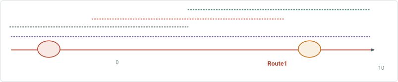

| RouteID | FromDate | ToDate |
| --- | --- | --- |
| Route1 | 1/1/2000 | NULL |

| RouteID | FromDate | ToDate |
| --- | --- | --- |
| Route1 | 1/1/2000 | 1/1/2005 |

| Event Layer | EventID | RouteID | From Date | To Date | From Measure | To Measure |
| --- | --- | --- | --- | --- | --- | --- |
| Point | Pt1 | Route1 | 1/1/2000 | NULL | 2 | N/A |
| Point | Pt2 | Route1 | 1/1/2000 | NULL | 8 | N/A |
| Line | Line1 | Route1 | 1/1/2000 | NULL | 0 | 10 |
| Line | Line2 | Route1 | 1/1/2000 | NULL | 0 | 5 |
| Line | Line3 | Route1 | 1/1/2000 | NULL | 3 | 7 |
| Line | Line4 | Route1 | 1/1/2000 | NULL | 5 | 10 |

| Event Layer | EventID | RouteID | From Date | To Date | From Measure | To Measure |
| --- | --- | --- | --- | --- | --- | --- |
| Point | Pt1 | Route1 | 1/1/2000 | 1/1/2005 | 2 | N/A |
| Point | Pt2 | Route1 | 1/1/2000 | 1/1/2005 | 8 | N/A |
| Line | Line1 | Route1 | 1/1/2000 | 1/1/2005 | 0 | 10 |
| Line | Line2 | Route1 | 1/1/2000 | 1/1/2005 | 0 | 5 |
| Line | Line3 | Route1 | 1/1/2000 | 1/1/2005 | 3 | 7 |
| Line | Line4 | Route1 | 1/1/2000 | 1/1/2005 | 5 | 10 |

## Case 9 <!-- slide 11 -->

### Retire Whole Route with Multiple Partial Concurrencies

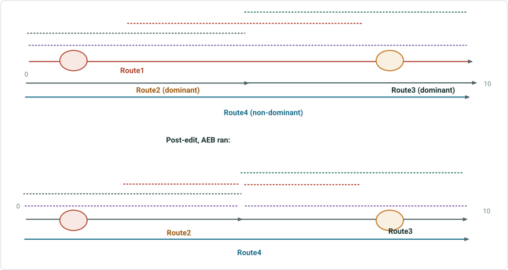

| RouteID | FromDate | ToDate |
| --- | --- | --- |
| Route1 | 1/1/2000 | NULL |
| Route2 | 1/1/2000 | NULL |
| Route3 | 1/1/2000 | NULL |
| Route4 | 1/1/2000 | NULLL |

| RouteID | FromDate | ToDate |
| --- | --- | --- |
| Route1 | 1/1/2000 | 1/1/2005 |
| Route2 | 1/1/2000 | NULL |
| Route3 | 1/1/2000 | NULL |
| Route4 | 1/1/2000 | NULL |

| Event Layer | EventID | RouteID | From Date | To Date | From Measure | To Measure |
| --- | --- | --- | --- | --- | --- | --- |
| Point | Pt1 | Route1 | 1/1/2000 | NULL | 2 | N/A |
| Point | Pt2 | Route1 | 1/1/2000 | NULL | 8 | N/A |
| Line | Line1 | Route1 | 1/1/2000 | NULL | 0 | 10 |
| Line | Line2 | Route1 | 1/1/2000 | NULL | 0 | 5 |
| Line | Line3 | Route1 | 1/1/2000 | NULL | 3 | 7 |
| Line | Line4 | Route1 | 1/1/2000 | NULL | 5 | 10 |

| Event Layer | EventID | RouteID | From Date | To Date | From Measure | To Measure |
| --- | --- | --- | --- | --- | --- | --- |
| Point | Pt1 | Route1 | 1/1/2000 | 1/1/2005 | 2 | N/A |
| Point | Pt2 | Route1 | 1/1/2000 | 1/1/2005 | 8 | N/A |
| Line | Line1 | Route1 | 1/1/2000 | 1/1/2005 | 0 | 10 |
| Line | Line2 | Route1 | 1/1/2000 | 1/1/2005 | 0 | 5 |
| Line | Line3 | Route1 | 1/1/2000 | 1/1/2005 | 3 | 7 |
| Line | Line4 | Route1 | 1/1/2000 | 1/1/2005 | 5 | 10 |
| Point | Pt1 | Route2 | 1/1/2005 | NULL | 2 | N/A |
| Point | Pt2 | Route3 | 1/1/2005 | NULL | 8 | N/A |
| Line | Line1 | Route2 | 1/1/2005 | NULL | 0 | 5 |
| Line | Line1 | Route3 | 1/1/2005 | NULL | 5 | 10 |
| Line | Line2 | Route2 | 1/1/2005 | NULL | 0 | 5 |
| Line | Line3 | Route2 | 1/1/2005 | NULL | 3 | 5 |
| Line | Line3 | Route3 | 1/1/2005 | NULL | 5 | 7 |
| Line | Line4 | Route3 | 1/1/2005 | NULL | 5 | 10 |

## Case 10 <!-- slide 12 -->

### Retire First Half of Route

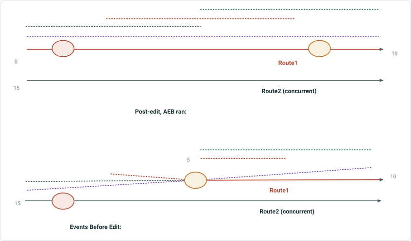

| RouteID | FromDate | ToDate |
| --- | --- | --- |
| Route1 | 1/1/2000 | NULL |
| Route2 | 1/1/2000 | NULL |

| RouteID | FromDate | ToDate |
| --- | --- | --- |
| Route1 | 1/1/2000 | 1/1/2005 |
| Route1 | 1/1/2005 | NULL |
| Route2 | 1/1/2000 | NULL |

| Event Layer | EventID | RouteID | From Date | To Date | From Measure | To Measure |
| --- | --- | --- | --- | --- | --- | --- |
| Point | Pt1 | Route1 | 1/1/2000 | NULL | 2 | N/A |
| Point | Pt2 | Route1 | 1/1/2000 | NULL | 5 | N/A |
| Line | Line1 | Route1 | 1/1/2000 | NULL | 0 | 10 |
| Line | Line2 | Route1 | 1/1/2000 | NULL | 0 | 5 |
| Line | Line3 | Route1 | 1/1/2000 | NULL | 3 | 7 |
| Line | Line4 | Route1 | 1/1/2000 | NULL | 5 | 10 |

| Event Layer | EventID | RouteID | From Date | To Date | From Measure | To Measure |
| --- | --- | --- | --- | --- | --- | --- |
| Point | Pt1 | Route1 | 1/1/2000 | 1/1/2005 | 2 | N/A |
| Point | Pt2 | Route1 | 1/1/2000 | NULL | 5 | N/A |
| Line | Line1 | Route1 | 1/1/2000 | 1/1/2005 | 0 | 10 |
| Line | Line2 | Route1 | 1/1/2000 | 1/1/2005 | 0 | 5 |
| Line | Line3 | Route1 | 1/1/2000 | 1/1/2005 | 3 | 7 |
| Line | Line4 | Route1 | 1/1/2000 | NULL | 5 | 10 |
| Point | Pt1 | Route2 | 1/1/2005 | NULL | 2 | N/A |
| Line | Line1 | Route2 | 1/1/2005 | NULL | 15 | 20 |
| Line | Line1 | Route1 | 1/1/2005 | NULL | 5 | 10 |
| Line | Line2 | Route2 | 1/1/2005 | NULL | 15 | 20 |
| Line | Line3 | Route2 | 1/1/2005 | NULL | 18 | 20 |
| Line | Line3 | Route1 | 1/1/2005 | NULL | 5 | 7 |

**Retire first half of route, point event is on cusp of retirement**

## Case 11 <!-- slide 13 -->

### Retire Whole Gapped Route

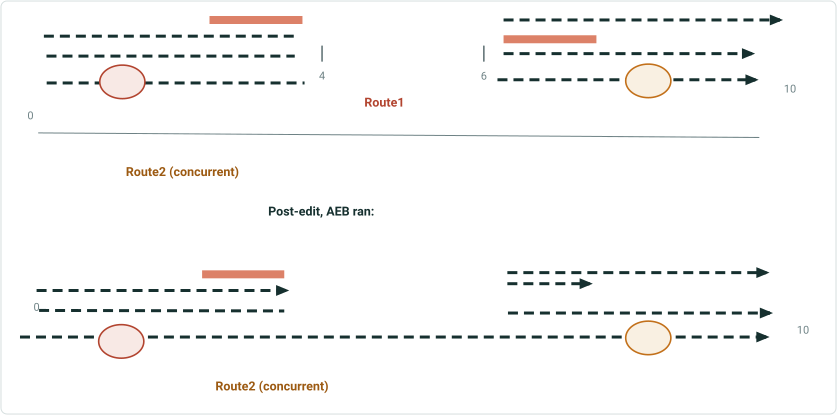

| RouteID | FromDate | ToDate |
| --- | --- | --- |
| Route1 | 1/1/2000 | NULL |
| Route2 | 1/1/2000 | NULL |

| RouteID | FromDate | ToDate |
| --- | --- | --- |
| Route1 | 1/1/2000 | 1/1/2005 |
| Route2 | 1/1/2000 | NULL |

| Event Layer | EventID | RouteID | From Date | To Date | From Measure | To Measure |
| --- | --- | --- | --- | --- | --- | --- |
| Point | Pt1 | Route1 | 1/1/2000 | NULL | 2 | N/A |
| Point | Pt2 | Route1 | 1/1/2000 | NULL | 8 | N/A |
| Line | Line1 | Route1 | 1/1/2000 | NULL | 0 | 4 |
| Line | Line1A | Route1 | 1/1/2000 | NULL | 6 | 10 |
| Line | Line2 | Route1 | 1/1/2000 | NULL | 0 | 5 |
| Line | Line3 | Route1 | 1/1/2000 | NULL | 3 | 4 |
| Line | Line3A | Route1 | 1/1/2000 | NULL | 6 | 7 |
| Line | Line4 | Route1 | 1/1/2000 | NULL | 5 | 10 |

| Event Layer | EventID | RouteID | From Date | To Date | From Measure | To Measure |
| --- | --- | --- | --- | --- | --- | --- |
| Point | Pt1 | Route1 | 1/1/2000 | 1/1/2005 | 2 | N/A |
| Point | Pt2 | Route1 | 1/1/2000 | 1/1/2005 | 8 | N/A |
| Line | Line1 | Route1 | 1/1/2000 | 1/1/2005 | 0 | 10 |
| Line | Line2 | Route1 | 1/1/2000 | 1/1/2005 | 0 | 5 |
| Line | Line3 | Route1 | 1/1/2000 | 1/1/2005 | 3 | 7 |
| Line | Line4 | Route1 | 1/1/2000 | 1/1/2005 | 5 | 10 |
| Point | Pt1 | Route2 | 1/1/2005 | NULL | 2 | N/A |
| Point | Pt2 | Route2 | 1/1/2005 | NULL | 8 | N/A |
| Line | Line1 | Route2 | 1/1/2005 | NULL | 0 | 4 |
| Line | Line1A | Route2 | 1/1/2005 | NULL | 6 | 10 |
| Line | Line2 | Route2 | 1/1/2005 | NULL | 0 | 4 |
| Line | Line3 | Route2 | 1/1/2005 | NULL | 3 | 4 |
| Line | Line3A | Route2 | 1/1/2005 | NULL | 6 | 7 |
| Line | Line4 | Route2 | 1/1/2005 | NULL | 6 | 10 |

## Case 12 <!-- slide 14 -->

### Retire Whole Route, Unproportional Concurrent Route

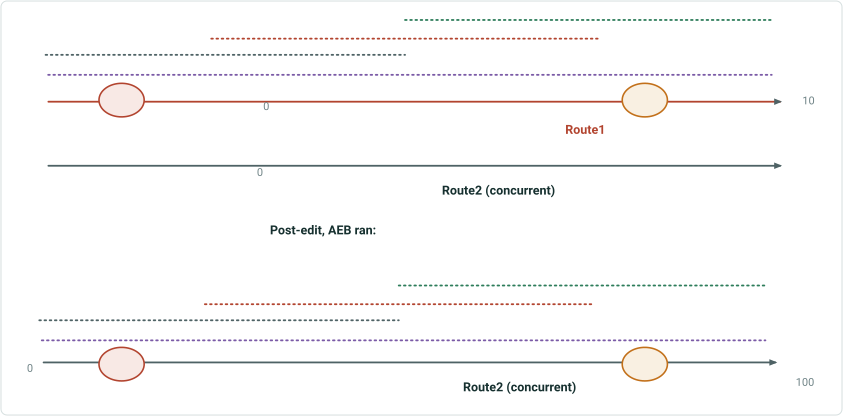

| RouteID | FromDate | ToDate |
| --- | --- | --- |
| Route1 | 1/1/2000 | NULL |
| Route2 | 1/1/2000 | NULL |

| RouteID | FromDate | ToDate |
| --- | --- | --- |
| Route1 | 1/1/2000 | 1/1/2005 |
| Route2 | 1/1/2000 | NULL |

| Event Layer | EventID | RouteID | From Date | To Date | From Measure | To Measure |
| --- | --- | --- | --- | --- | --- | --- |
| Point | Pt1 | Route1 | 1/1/2000 | NULL | 2 | N/A |
| Point | Pt2 | Route1 | 1/1/2000 | NULL | 8 | N/A |
| Line | Line1 | Route1 | 1/1/2000 | NULL | 0 | 10 |
| Line | Line2 | Route1 | 1/1/2000 | NULL | 0 | 5 |
| Line | Line3 | Route1 | 1/1/2000 | NULL | 3 | 7 |
| Line | Line4 | Route1 | 1/1/2000 | NULL | 5 | 10 |

| Event Layer | EventID | RouteID | From Date | To Date | From Measure | To Measure |
| --- | --- | --- | --- | --- | --- | --- |
| Point | Pt1 | Route1 | 1/1/2000 | 1/1/2005 | 2 | N/A |
| Point | Pt2 | Route1 | 1/1/2000 | 1/1/2005 | 8 | N/A |
| Line | Line1 | Route1 | 1/1/2000 | 1/1/2005 | 0 | 10 |
| Line | Line2 | Route1 | 1/1/2000 | 1/1/2005 | 0 | 5 |
| Line | Line3 | Route1 | 1/1/2000 | 1/1/2005 | 3 | 7 |
| Line | Line4 | Route1 | 1/1/2000 | 1/1/2005 | 5 | 10 |
| Point | Pt1 | Route2 | 1/1/2005 | NULL | 20 | N/A |
| Point | Pt2 | Route2 | 1/1/2005 | NULL | 80 | N/A |
| Line | Line1 | Route2 | 1/1/2005 | NULL | 0 | 100 |
| Line | Line2 | Route2 | 1/1/2005 | NULL | 0 | 50 |
| Line | Line3 | Route2 | 1/1/2005 | NULL | 30 | 70 |
| Line | Line4 | Route2 | 1/1/2005 | NULL | 50 | 10 |

## Case 13 <!-- slide 15 -->

### Retire Whole Complex Route

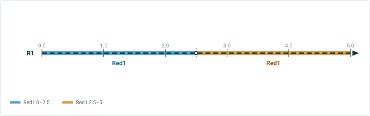

| RouteID | FromDate | ToDate |
| --- | --- | --- |
| Route2 | 1/1/2000 | NULL |
| Route1 | 1/1/2000 | NULL |

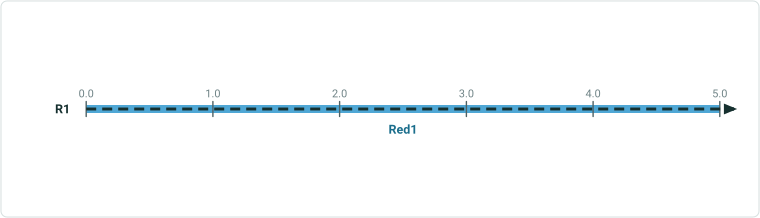

| Input Layer | Event ID |  | From Date | To Date | From Measure | To Measure |
| --- | --- | --- | --- | --- | --- | --- |
| Red Event | Red1 | Route1 | 1/1/2000 | <Null> | 0 | 5 |
| Red Event | Red2 | Route1 | 1/1/2000 | <Null> | 5 | 10 |
| Blue Event | Blue1 | Route1 | 1/1/2000 | <Null> | 0 | 10 |
| Green Event | Green1 | Route1 | 1/1/2000 | <Null> | 0 | 10 |

| RouteID | FromDate | ToDate |
| --- | --- | --- |
| Route2 | 1/1/2000 | NULL |
| Route1 | 1/1/2000 | 1/1/2005 |

| Input Layer | Event ID | RouteID | From Date | To Date | From Measure | To Measure |
| --- | --- | --- | --- | --- | --- | --- |
| Red Event | Red1 | Route1 | 1/1/2000 | 1/1/2005 | 0 | 5 |
| Red Event | Red2 | Route1 | 1/1/2000 | 1/1/2005 | 5 | 10 |
| Blue Event | Blue1 | Route1 | 1/1/2000 | 1/1/2005 | 0 | 10 |
| Green Event | Green1 | Route1 | 1/1/2000 | 1/1/2005 | 0 | 10 |
| Red Event | Red1 | Route2 | 1/1/2005 | <Null> | 0 | 5 |
| Red Event | Red2 | Route2 | 1/1/2005 | <Null> | 5 | 10 |
| Blue Event | Blue1 | Route2 | 1/1/2005 | <Null> | 0 | 10 |
| Green Event | Green1 | Route2 | 1/1/2005 | <Null> | 0 | 10 |

## Case 13 <!-- slide 16 -->

### Retire Whole Vertical Route

| RouteID | FromDate | ToDate |
| --- | --- | --- |
| Route2 | 1/1/2000 | NULL |
| Route1 | 1/1/2000 | NULL |

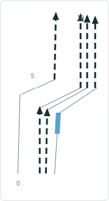

| Input Layer | Event ID | RouteID | From Date | To Date | From Measure | To Measure |
| --- | --- | --- | --- | --- | --- | --- |
| Red Event | Red1 | Route1 | 1/1/2000 | <Null> | 0 | 2.5 |
| Red Event | Red2 | Route1 | 1/1/2000 | <Null> | 2.5 | 10 |
| Blue Event | Blue1 | Route1 | 1/1/2000 | <Null> | 0 | 10 |
| Green Event | Green1 | Route1 | 1/1/2000 | <Null> | 0 | 10 |

| RouteID | FromDate | ToDate |
| --- | --- | --- |
| Route2 | 1/1/2000 | NULL |
| Route1 | 1/1/2000 | 1/1/2005 |

| Input Layer | Event ID | RouteID | From Date | To Date | From Measure | To Measure |
| --- | --- | --- | --- | --- | --- | --- |
| Red Event | Red1 | Route1 | 1/1/2000 | 1/1/2005 | 0 | 2.5 |
| Red Event | Red2 | Route1 | 1/1/2000 | 1/1/2005 | 2.5 | 10 |
| Blue Event | Blue1 | Route1 | 1/1/2000 | 1/1/2005 | 0 | 10 |
| Green Event | Green1 | Route1 | 1/1/2000 | 1/1/2005 | 0 | 10 |
| Red Event | Red1 | Route2 | 1/1/2005 | <Null> | 0 | 2.5 |
| Red Event | Red2 | Route2 | 1/1/2005 | <Null> | 2.5 | 10 |
| Blue Event | Blue1 | Route2 | 1/1/2005 | <Null> | 0 | 10 |
| Green Event | Green1 | Route2 | 1/1/2005 | <Null> | 0 | 10 |

## Case 14 <!-- slide 17 -->

### Retire First Half of Route, Recalibrate Downstream

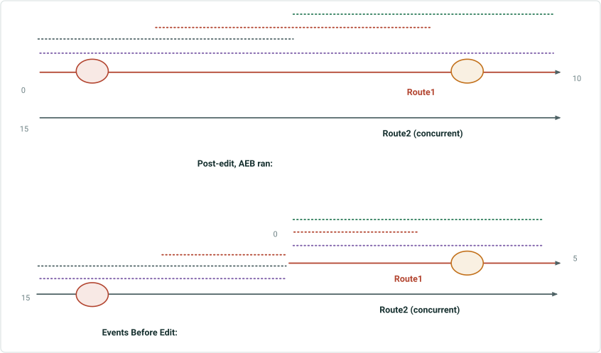

| RouteID | FromDate | ToDate |
| --- | --- | --- |
| Route1 | 1/1/2000 | NULL |
| Route2 | 1/1/2000 | NULL |

| RouteID | FromDate | ToDate |
| --- | --- | --- |
| Route1 | 1/1/2000 | 1/1/2005 |
| Route1 | 1/1/2005 | NULL |
| Route2 | 1/1/2000 | NULL |

| Event Layer | EventID | RouteID | From Date | To Date | From Measure | To Measure |
| --- | --- | --- | --- | --- | --- | --- |
| Point | Pt1 | Route1 | 1/1/2000 | NULL | 2 | N/A |
| Point | Pt2 | Route1 | 1/1/2000 | NULL | 8 | N/A |
| Line | Line1 | Route1 | 1/1/2000 | NULL | 0 | 10 |
| Line | Line2 | Route1 | 1/1/2000 | NULL | 0 | 5 |
| Line | Line3 | Route1 | 1/1/2000 | NULL | 3 | 7 |
| Line | Line4 | Route1 | 1/1/2000 | NULL | 5 | 10 |

| Event Layer | EventID | RouteID | From Date | To Date | From Measure | To Measure |
| --- | --- | --- | --- | --- | --- | --- |
| Point | Pt1 | Route1 | 1/1/2000 | 1/1/2005 | 2 | N/A |
| Point | Pt2 | Route1 | 1/1/2000 | 1/1/2005 | 8 | N/A |
| Line | Line1 | Route1 | 1/1/2000 | 1/1/2005 | 0 | 10 |
| Line | Line2 | Route1 | 1/1/2000 | 1/1/2005 | 0 | 5 |
| Line | Line3 | Route1 | 1/1/2000 | 1/1/2005 | 3 | 7 |
| Line | Line4 | Route1 | 1/1/2000 | 1/1/2005 | 5 | 10 |
| Point | Pt1 | Route2 | 1/1/2005 | NULL | 2 | N/A |
| Point | Pt2 | Route1 | 1/1/2005 | NULL | 3 | N/A |
| Line | Line1 | Route2 | 1/1/2005 | NULL | 15 | 20 |
| Line | Line1 | Route1 | 1/1/2005 | NULL | 0 | 5 |
| Line | Line2 | Route2 | 1/1/2005 | NULL | 15 | 20 |
| Line | Line3 | Route2 | 1/1/2005 | NULL | 18 | 20 |
| Line | Line3 | Route1 | 1/1/2005 | NULL | 0 | 2 |
| Line | Line4 | Route1 | 1/1/2005 | NULL | 0 | 5 |

(Stay Put)

## Case 15 <!-- slide 18 -->

### Retire First Half of Route, Recalibrate Downstream (Move)

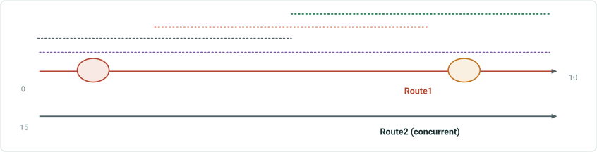

| RouteID | FromDate | ToDate |
| --- | --- | --- |
| Route1 | 1/1/2000 | NULL |
| Route2 | 1/1/2000 | NULL |

| RouteID | FromDate | ToDate |
| --- | --- | --- |
| Route1 | 1/1/2000 | 1/1/2005 |
| Route1 | 1/1/2005 | NULL |
| Route2 | 1/1/2000 | NULL |

| Event Layer | EventID | RouteID | From Date | To Date | From Measure | To Measure |
| --- | --- | --- | --- | --- | --- | --- |
| Point | Pt1 | Route1 | 1/1/2000 | NULL | 2 | N/A |
| Point | Pt2 | Route1 | 1/1/2000 | NULL | 8 | N/A |
| Line | Line1 | Route1 | 1/1/2000 | NULL | 0 | 10 |
| Line | Line2 | Route1 | 1/1/2000 | NULL | 0 | 5 |
| Line | Line3 | Route1 | 1/1/2000 | NULL | 3 | 7 |
| Line | Line4 | Route1 | 1/1/2000 | NULL | 5 | 10 |

| Event Layer | EventID | RouteID | From Date | To Date | From Measure | To Measure | LocError |
| --- | --- | --- | --- | --- | --- | --- | --- |
| Point | Pt1 | Route1 | 1/1/2000 | 1/1/2005 | 2 | N/A | No Error |
| Point | Pt2 | Route1 | 1/1/2000 | 1/1/2005 | 8 | N/A | No Error |
| Line | Line1 | Route1 | 1/1/2000 | 1/1/2005 | 0 | 10 | No Error |
| Line | Line2 | Route1 | 1/1/2000 | 1/1/2005 | 0 | 5 | No Error |
| Line | Line3 | Route1 | 1/1/2000 | 1/1/2005 | 3 | 7 | No Error |
| Line | Line4 | Route1 | 1/1/2000 | 1/1/2005 | 5 | 10 | No Error |
| Point | Pt1 | Route2 | 1/1/2005 | NULL | 2 | N/A | No Error |
| Point | Pt2 | Route1 | 1/1/2005 | NULL | 8 | N/A | Route Location Not Found |
| Line | Line1 | Route2 | 1/1/2005 | NULL | 15 | 20 | No Error |
| Line | Line1 | Route1 | 1/1/2005 | NULL | 5 | 10 | Partial Match for the From Measure |
| Line | Line2 | Route2 | 1/1/2005 | NULL | 15 | 20 | No Error |
| Line | Line3 | Route2 | 1/1/2005 | NULL | 18 | 20 | No Error |
| Line | Line3 | Route1 | 1/1/2005 | NULL | 3 | 7 | Partial Match for the From Measure |
| Line | Line4 | Route1 | 1/1/2005 | NULL | 5 | 10 | Partial Match for the From Measure |

## Case 14 <!-- slide 19 -->

### Retire First Half of Route, Recalibrate Downstream


| RouteID | FromDate | ToDate |
| --- | --- | --- |
| Route1 | 1/1/2000 | NULL |
| Route2 | 1/1/2000 | NULL |

| RouteID | FromDate | ToDate |
| --- | --- | --- |
| Route1 | 1/1/2000 | 1/1/2005 |
| Route1 | 1/1/2005 | NULL |
| Route2 | 1/1/2000 | NULL |

| Event Layer | EventID | RouteID | From Date | To Date | From Measure | To Measure |
| --- | --- | --- | --- | --- | --- | --- |
| Point | Pt1 | Route1 | 1/1/2000 | NULL | 2 | N/A |
| Point | Pt2 | Route1 | 1/1/2000 | NULL | 8 | N/A |
| Line | Line1 | Route1 | 1/1/2000 | NULL | 0 | 10 |
| Line | Line2 | Route1 | 1/1/2000 | NULL | 0 | 5 |
| Line | Line3 | Route1 | 1/1/2000 | NULL | 3 | 7 |
| Line | Line4 | Route1 | 1/1/2000 | NULL | 5 | 10 |

| Event Layer | EventID | RouteID | From Date | To Date | From Measure | To Measure |
| --- | --- | --- | --- | --- | --- | --- |
| Point | Pt1 | Route1 | 1/1/2000 | 1/1/2005 | 2 | N/A |
| Point | Pt2 | Route1 | 1/1/2000 | 1/1/2005 | 8 | N/A |
| Line | Line1 | Route1 | 1/1/2000 | 1/1/2005 | 0 | 10 |
| Line | Line2 | Route1 | 1/1/2000 | 1/1/2005 | 0 | 5 |
| Line | Line3 | Route1 | 1/1/2000 | 1/1/2005 | 3 | 7 |
| Line | Line4 | Route1 | 1/1/2000 | 1/1/2005 | 5 | 10 |
| Point | Pt1 | Route2 | 1/1/2005 | NULL | 2 | N/A |
| Line | Line1 | Route2 | 1/1/2005 | NULL | 15 | 20 |
| Line | Line2 | Route2 | 1/1/2005 | NULL | 15 | 20 |
| Line | Line3 | Route2 | 1/1/2005 | NULL | 18 | 20 |

(Retire)

## Case 18 <!-- slide 20 -->

### Retire Whole Route

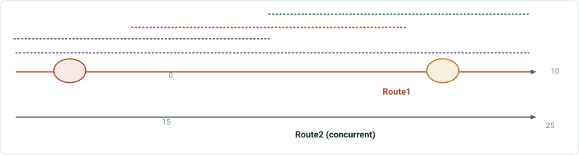

| RouteID | FromDate | ToDate |
| --- | --- | --- |
| Route1 | 1/1/2000 | NULL |
| Route2 | 1/1/2000 | 1/1/2005 |
| Route2 | 1/1/2005 | 1/1/2010 |
| Route2 | 1/1/2010 | NULL |

| RouteID | FromDate | ToDate |
| --- | --- | --- |
| Route1 | 1/1/2000 | 1/1/2004 |
| Route2 | 1/1/2000 | 1/1/2005 |
| Route2 | 1/1/2005 | 1/1/2010 |
| Route2 | 1/1/2010 | NULL |

| Event Layer | EventID | RouteID | From Date | To Date | From Measure | To Measure |
| --- | --- | --- | --- | --- | --- | --- |
| Point | Pt1 | Route1 | 1/1/2000 | NULL | 2 | N/A |
| Point | Pt2 | Route1 | 1/1/2000 | NULL | 8 | N/A |
| Line | Line1 | Route1 | 1/1/2000 | NULL | 0 | 10 |
| Line | Line2 | Route1 | 1/1/2000 | NULL | 0 | 5 |
| Line | Line3 | Route1 | 1/1/2000 | NULL | 3 | 7 |
| Line | Line4 | Route1 | 1/1/2000 | NULL | 5 | 10 |

**Retire whole route, concurrent route has multiple time slices**

## Case 18 <!-- slide 21 -->

### Retire Whole Route

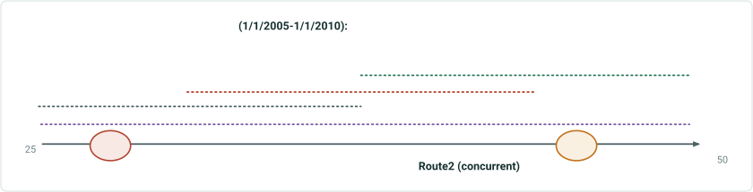
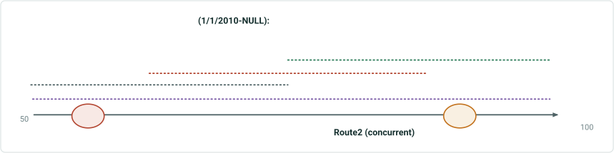

Post-edit, AEB ran (1/1/2004-1/1/2005):

**Retire whole route, concurrent route has multiple time slices (Continued)**

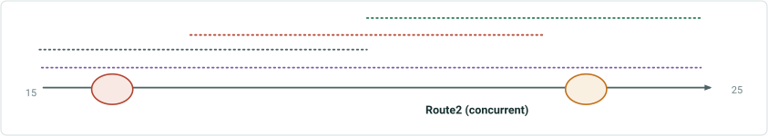

| Event Layer | EventID | RouteID | From Date | To Date | From Measure | To Measure |
| --- | --- | --- | --- | --- | --- | --- |
| Point | Pt1 | Route1 | 1/1/2000 | 1/1/2004 | 2 | N/A |
| Point | Pt2 | Route1 | 1/1/2000 | 1/1/2004 | 8 | N/A |
| Line | Line1 | Route1 | 1/1/2000 | 1/1/2004 | 0 | 10 |
| Line | Line2 | Route1 | 1/1/2000 | 1/1/2004 | 0 | 5 |
| Line | Line3 | Route1 | 1/1/2000 | 1/1/2004 | 3 | 7 |
| Line | Line4 | Route1 | 1/1/2000 | 1/1/2004 | 5 | 10 |
| Point | Pt1 | Route2 | 1/1/2004 | 1/1/2005 | 17 | N/A |
| Point | Pt2 | Route2 | 1/1/2004 | 1/1/2005 | 23 | N/A |
| Line | Line1 | Route2 | 1/1/2004 | 1/1/2005 | 15 | 25 |
| Line | Line2 | Route2 | 1/1/2004 | 1/1/2005 | 15 | 20 |
| Line | Line3 | Route2 | 1/1/2004 | 1/1/2005 | 18 | 22 |
| Line | Line4 | Route2 | 1/1/2004 | 1/1/2005 | 20 | 25 |
| Point | Pt1 | Route2 | 1/1/2005 | 1/1/2010 | 34 | N/A |
| Point | Pt2 | Route2 | 1/1/2005 | 1/1/2010 | 46 | N/A |
| Line | Line1 | Route2 | 1/1/2005 | 1/1/2010 | 30 | 50 |
| Line | Line2 | Route2 | 1/1/2005 | 1/1/2010 | 30 | 40 |
| Line | Line3 | Route2 | 1/1/2005 | 1/1/2010 | 36 | 44 |
| Line | Line4 | Route2 | 1/1/2005 | 1/1/2010 | 40 | 50 |
| Point | Pt1 | Route2 | 1/1/2010 | NULL | 68 | N/A |
| Point | Pt2 | Route2 | 1/1/2010 | NULL | 92 | N/A |
| Line | Line1 | Route2 | 1/1/2010 | NULL | 60 | 100 |
| Line | Line2 | Route2 | 1/1/2010 | NULL | 60 | 80 |
| Line | Line3 | Route2 | 1/1/2010 | NULL | 72 | 88 |
| Line | Line4 | Route2 | 1/1/2010 | NULL | 80 | 100 |

## Case 1 <!-- slide 22 -->

### Retire All Routes on Line

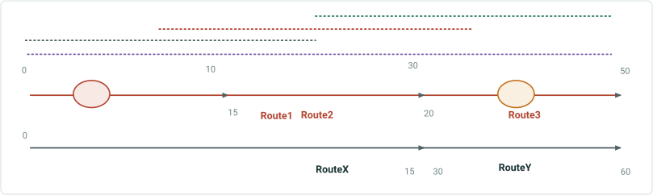

| Line ID | Route ID | From Date | ToDate |
| --- | --- | --- | --- |
| Line1 | Route1 | 1/1/2000 | NULL |
| Line1 | Route2 | 1/1/2000 | NULL |
| Line1 | Route3 | 1/1/2000 | NULL |
| Line2 | RouteX | 1/1/2000 | NULL |
| Line2 | RouteY | 1/1/2000 | NULL |

| Line ID | RouteID | From Date | ToDate |
| --- | --- | --- | --- |
| Line1 | Route1 | 1/1/2000 | 1/1/2005 |
| Line1 | Route2 | 1/1/2000 | 1/1/2005 |
| Line1 | Route3 | 1/1/2000 | 1/1/2005 |
| Line2 | RouteX | 1/1/2000 | NULL |
| Line2 | RouteY | 1/1/2000 | NULL |

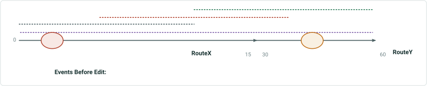

| Event Layer | Event ID | From RouteID | To RouteID | From Date | To Date | From Measure | To Measure |
| --- | --- | --- | --- | --- | --- | --- | --- |
| Point | Pt1 | Route1 | N/A | 1/1/2000 | NULL | 2 | N/A |
| Point | Pt2 | Route3 | N/A | 1/1/2000 | NULL | 40 | N/A |
| Line | Line1 | Route1 | Route3 | 1/1/2000 | NULL | 0 | 50 |
| Line | Line2 | Route1 | Route2 | 1/1/2000 | NULL | 0 | 17.5 |
| Line | Line3 | Route1 | Route3 | 1/1/2000 | NULL | 7 | 35 |
| Line | Line4 | Route2 | Route3 | 1/1/2000 | NULL | 17.5 | 50 |

| Event Layer | Event ID | From RouteID | To RouteID | From Date | To Date | From Measure | To Measure |
| --- | --- | --- | --- | --- | --- | --- | --- |
| Point | Pt1 | Route1 | N/A | 1/1/2000 | 1/1/2005 | 2 | N/A |
| Point | Pt2 | Route3 | N/A | 1/1/2000 | 1/1/2005 | 40 | N/A |
| Line | Line1 | Route1 | Route3 | 1/1/2000 | 1/1/2005 | 0 | 50 |
| Line | Line2 | Route1 | Route2 | 1/1/2000 | 1/1/2005 | 0 | 17.5 |
| Line | Line3 | Route1 | Route3 | 1/1/2000 | 1/1/2005 | 7 | 35 |
| Line | Line4 | Route2 | Route3 | 1/1/2000 | 1/1/2005 | 17.5 | 50 |
| Point | Pt1 | RouteX | N/A | 1/1/2005 | NULL | 2 | N/A |
| Point | Pt2 | RouteY | N/A | 1/1/2005 | NULL | 45 | N/A |
| Line | Line1 | RouteX | RouteY | 1/1/2005 | NULL | 0 | 60 |
| Line | Line2 | RouteX | RouteX | 1/1/2005 | NULL | 0 | 12.5 |
| Line | Line3 | RouteX | RouteY | 1/1/2005 | NULL | 7 | 40 |
| Line | Line4 | RouteX | RouteY | 1/1/2005 | NULL | 12.5 | 60 |

## Case 2 <!-- slide 23 -->

### Retire First Half of Routes on Line

| Line ID | Route ID | From Date | ToDate |
| --- | --- | --- | --- |
| Line1 | Route1 | 1/1/2000 | NULL |
| Line1 | Route2 | 1/1/2000 | NULL |
| Line1 | Route3 | 1/1/2000 | NULL |
| Line2 | RouteX | 1/1/2000 | NULL |
| Line2 | RouteY | 1/1/2000 | NULL |

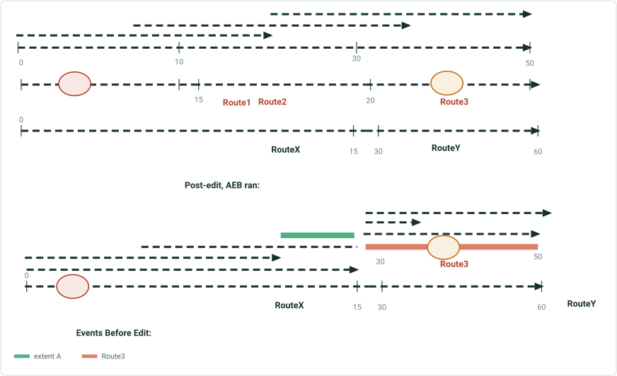

| Line ID | RouteID | From Date | ToDate |
| --- | --- | --- | --- |
| Line1 | Route1 | 1/1/2000 | 1/1/2005 |
| Line1 | Route2 | 1/1/2000 | 1/1/2005 |
| Line1 | Route3 | 1/1/2000 | 1/1/2005 |
| Line1 | Route3 | 1/1/2005 | NULL |
| Line2 | RouteX | 1/1/2000 | NULL |
| Line2 | RouteY | 1/1/2000 | NULL |

| Event Layer | Event ID | From RouteID | To RouteID | From Date | To Date | From Measure | To Measure |
| --- | --- | --- | --- | --- | --- | --- | --- |
| Point | Pt1 | Route1 | N/A | 1/1/2000 | NULL | 2 | N/A |
| Point | Pt2 | Route3 | N/A | 1/1/2000 | NULL | 40 | N/A |
| Line | Line1 | Route1 | Route3 | 1/1/2000 | NULL | 0 | 50 |
| Line | Line2 | Route1 | Route2 | 1/1/2000 | NULL | 0 | 17.5 |
| Line | Line3 | Route1 | Route3 | 1/1/2000 | NULL | 7 | 35 |
| Line | Line4 | Route2 | Route3 | 1/1/2000 | NULL | 17.5 | 50 |

| Event Layer | Event ID | From RouteID | To RouteID | From Date | To Date | From Measure | To Measure |
| --- | --- | --- | --- | --- | --- | --- | --- |
| Point | Pt1 | Route1 | N/A | 1/1/2000 | 1/1/2005 | 2 | N/A |
| Point | Pt2 | Route3 | N/A | 1/1/2000 | NULL | 40 | N/A |
| Line | Line1 | Route1 | Route3 | 1/1/2000 | 1/1/2005 | 0 | 50 |
| Line | Line2 | Route1 | Route2 | 1/1/2000 | 1/1/2005 | 0 | 17.5 |
| Line | Line3 | Route1 | Route3 | 1/1/2000 | 1/1/2005 | 7 | 35 |
| Line | Line4 | Route2 | Route3 | 1/1/2000 | 1/1/2005 | 17.5 | 50 |
| Point | Pt1 | RouteX | N/A | 1/1/2005 | NULL | 2 | N/A |
| Line | Line1 | RouteX | RouteX | 1/1/2005 | NULL | 0 | 15 |
| Line | Line1 | Route3 | Route3 | 1/1/2005 | NULL | 30 | 50 |
| Line | Line2 | RouteX | RouteX | 1/1/2005 | NULL | 0 | 12.5 |
| Line | Line3 | RouteX | RouteX | 1/1/2005 | NULL | 7 | 15 |
| Line | Line3 | Route3 | Route3 | 1/1/2005 | NULL | 30 | 40 |
| Line | Line4 | RouteX | RouteX | 1/1/2005 | NULL | 12.5 | 15 |
| Line | Line4 | Route3 | Route3 | 1/1/2005 | NULL | 30 | 50 |

## Case 3 <!-- slide 24 -->

### Retire Middle Route on Line

| Line ID | Route ID | From Date | ToDate |
| --- | --- | --- | --- |
| Line1 | Route1 | 1/1/2000 | NULL |
| Line1 | Route2 | 1/1/2000 | NULL |
| Line1 | Route3 | 1/1/2000 | NULL |
| Line2 | RouteX | 1/1/2000 | NULL |
| Line2 | RouteY | 1/1/2000 | NULL |

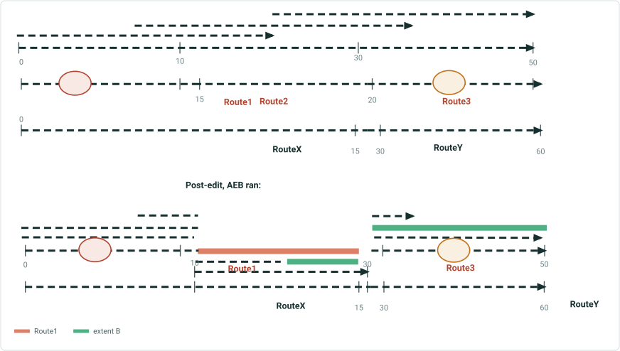

| Line ID | RouteID | From Date | ToDate |
| --- | --- | --- | --- |
| Line1 | Route1 | 1/1/2000 | NULL |
| Line1 | Route2 | 1/1/2000 | 1/1/2005 |
| Line1 | Route3 | 1/1/2000 | 1/1/2005 |
| Line1 | Route3 | 1/1/2005 | NULL |
| Line2 | RouteX | 1/1/2000 | NULL |
| Line2 | RouteY | 1/1/2000 | NULL |

| Event Layer | Event ID | From RouteID | To RouteID | From Date | To Date | From Measure | To Measure |
| --- | --- | --- | --- | --- | --- | --- | --- |
| Point | Pt1 | Route1 | N/A | 1/1/2000 | NULL | 2 | N/A |
| Point | Pt2 | Route3 | N/A | 1/1/2000 | NULL | 40 | N/A |
| Line | Line1 | Route1 | Route3 | 1/1/2000 | NULL | 0 | 50 |
| Line | Line2 | Route1 | Route2 | 1/1/2000 | NULL | 0 | 17.5 |
| Line | Line3 | Route1 | Route3 | 1/1/2000 | NULL | 7 | 35 |
| Line | Line4 | Route2 | Route3 | 1/1/2000 | NULL | 17.5 | 50 |

| Event Layer | Event ID | From RouteID | To RouteID | From Date | To Date | From Measure | To Measure |
| --- | --- | --- | --- | --- | --- | --- | --- |
| Point | Pt1 | Route1 | N/A | 1/1/2000 | NULL | 2 | N/A |
| Point | Pt2 | Route3 | N/A | 1/1/2000 | NULL | 40 | N/A |
| Line | Line1 | Route1 | Route3 | 1/1/2000 | 1/1/2005 | 0 | 50 |
| Line | Line2 | Route1 | Route2 | 1/1/2000 | 1/1/2005 | 0 | 17.5 |
| Line | Line3 | Route1 | Route3 | 1/1/2000 | 1/1/2005 | 7 | 35 |
| Line | Line4 | Route2 | Route3 | 1/1/2000 | 1/1/2005 | 17.5 | 50 |
| Line | Line1 | Route1 | Route1 | 1/1/2005 | NULL | 0 | 10 |
| Line | Line1 | RouteX | RouteX | 1/1/2005 | NULL | 10 | 15 |
| Line | Line1 | Route3 | Route3 | 1/1/2005 | NULL | 30 | 50 |
| Line | Line2 | Route1 | Route1 | 1/1/2005 | NULL | 0 | 10 |
| Line | Line2 | RouteX | RouteX | 1/1/2005 | NULL | 10 | 12.5 |
| Line | Line3 | Route1 | Route1 | 1/1/2005 | NULL | 7 | 10 |
| Line | Line3 | RouteX | RouteX | 1/1/2005 | NULL | 10 | 15 |
| Line | Line3 | Route3 | Route3 | 1/1/2005 | NULL | 30 | 40 |
| Line | Line4 | RouteX | RouteX | 1/1/2005 | NULL | 12.5 | 15 |
| Line | Line4 | Route3 | Route3 | 1/1/2005 | NULL | 30 | 60 |

## Case 4 <!-- slide 25 -->

### Retire Second Half of Routes on Line

| Line ID | Route ID | From Date | ToDate |
| --- | --- | --- | --- |
| Line1 | Route1 | 1/1/2000 | NULL |
| Line1 | Route2 | 1/1/2000 | NULL |
| Line1 | Route3 | 1/1/2000 | NULL |
| Line2 | RouteX | 1/1/2000 | NULL |
| Line2 | RouteY | 1/1/2000 | NULL |

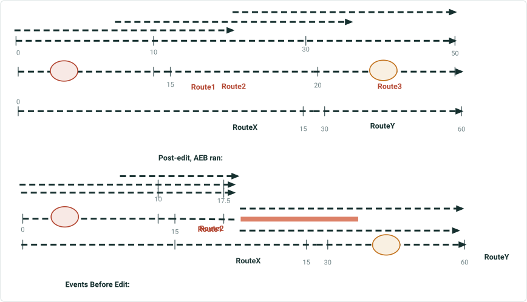

| Line ID | RouteID | From Date | ToDate |
| --- | --- | --- | --- |
| Line1 | Route1 | 1/1/2000 | 1/1/2005 |
| Line1 | Route2 | 1/1/2000 | 1/1/2005 |
| Line1 | Route3 | 1/1/2000 | 1/1/2005 |
| Line1 | Route1 | 1/1/2000 | NULL |
| Line1 | Route2 | 1/1/2000 | NULL |
| Line2 | RouteX | 1/1/2000 | NULL |
| Line2 | RouteY | 1/1/2000 | NULL |

| Event Layer | Event ID | From RouteID | To RouteID | From Date | To Date | From Measure | To Measure |
| --- | --- | --- | --- | --- | --- | --- | --- |
| Point | Pt1 | Route1 | N/A | 1/1/2000 | NULL | 2 | N/A |
| Point | Pt2 | Route3 | N/A | 1/1/2000 | NULL | 40 | N/A |
| Line | Line1 | Route1 | Route3 | 1/1/2000 | NULL | 0 | 50 |
| Line | Line2 | Route1 | Route2 | 1/1/2000 | NULL | 0 | 17.5 |
| Line | Line3 | Route1 | Route3 | 1/1/2000 | NULL | 7 | 35 |
| Line | Line4 | Route2 | Route3 | 1/1/2000 | NULL | 17.5 | 50 |

| Event Layer | Event ID | From RouteID | To RouteID | From Date | To Date | From Measure | To Measure |
| --- | --- | --- | --- | --- | --- | --- | --- |
| Point | Pt1 | Route1 | N/A | 1/1/2000 | NULL | 2 | N/A |
| Point | Pt2 | Route3 | N/A | 1/1/2000 | 1/1/2005 | 40 | N/A |
| Line | Line1 | Route1 | Route3 | 1/1/2000 | 1/1/2005 | 0 | 50 |
| Line | Line2 | Route1 | Route2 | 1/1/2000 | NULL | 0 | 17.5 |
| Line | Line3 | Route1 | Route3 | 1/1/2000 | 1/1/2005 | 7 | 35 |
| Line | Line4 | Route2 | Route3 | 1/1/2000 | 1/1/2005 | 17.5 | 50 |
| Point | Pt2 | RouteY | N/A | 1/1/2005 | NULL | 45 | N/A |
| Line | Line1 | Route1 | Route2 | 1/1/2005 | NULL | 0 | 17.5 |
| Line | Line1 | RouteX | RouteY | 1/1/2005 | NULL | 12.5 | 60 |
| Line | Line3 | Route1 | Route2 | 1/1/2005 | NULL | 7 | 17.5 |
| Line | Line3 | RouteX | RouteY | 1/1/2005 | NULL | 12.5 | 40 |
| Line | Line4 | RouteX | RouteY | 1/1/2005 | NULL | 12.5 | 60 |

## Case 5 <!-- slide 26 -->

### Retire All Routes on Line, Partial Concurrency

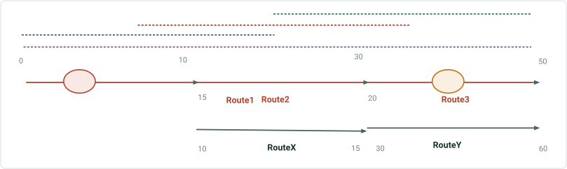

| Line ID | Route ID | From Date | ToDate |
| --- | --- | --- | --- |
| Line1 | Route1 | 1/1/2000 | NULL |
| Line1 | Route2 | 1/1/2000 | NULL |
| Line1 | Route3 | 1/1/2000 | NULL |
| Line2 | RouteX | 1/1/2000 | NULL |
| Line2 | RouteY | 1/1/2000 | NULL |

| Line ID | RouteID | From Date | ToDate |
| --- | --- | --- | --- |
| Line1 | Route1 | 1/1/2000 | 1/1/2005 |
| Line1 | Route2 | 1/1/2000 | 1/1/2005 |
| Line1 | Route3 | 1/1/2000 | 1/1/2005 |
| Line2 | RouteX | 1/1/2000 | NULL |
| Line2 | RouteY | 1/1/2000 | NULL |

| Event Layer | Event ID | From RouteID | To RouteID | From Date | To Date | From Measure | To Measure |
| --- | --- | --- | --- | --- | --- | --- | --- |
| Point | Pt1 | Route1 | N/A | 1/1/2000 | NULL | 2 | N/A |
| Point | Pt2 | Route3 | N/A | 1/1/2000 | NULL | 40 | N/A |
| Line | Line1 | Route1 | Route3 | 1/1/2000 | NULL | 0 | 50 |
| Line | Line2 | Route1 | Route2 | 1/1/2000 | NULL | 0 | 17.5 |
| Line | Line3 | Route1 | Route3 | 1/1/2000 | NULL | 7 | 35 |
| Line | Line4 | Route2 | Route3 | 1/1/2000 | NULL | 17.5 | 50 |

| Event Layer | Event ID | From RouteID | To RouteID | From Date | To Date | From Measure | To Measure |
| --- | --- | --- | --- | --- | --- | --- | --- |
| Point | Pt1 | Route1 | N/A | 1/1/2000 | 1/1/2005 | 2 | N/A |
| Point | Pt2 | Route3 | N/A | 1/1/2000 | 1/1/2005 | 40 | N/A |
| Line | Line1 | Route1 | Route3 | 1/1/2000 | 1/1/2005 | 0 | 50 |
| Line | Line2 | Route1 | Route2 | 1/1/2000 | 1/1/2005 | 0 | 17.5 |
| Line | Line3 | Route1 | Route3 | 1/1/2000 | 1/1/2005 | 7 | 35 |
| Line | Line4 | Route2 | Route3 | 1/1/2000 | 1/1/2005 | 17.5 | 50 |
| Point | Pt2 | RouteY | N/A | 1/1/2005 | NULL | 45 | N/A |
| Line | Line1 | RouteX | RouteY | 1/1/2005 | NULL | 10 | 60 |
| Line | Line2 | RouteX | RouteX | 1/1/2005 | NULL | 10 | 12.5 |
| Line | Line3 | RouteX | RouteY | 1/1/2005 | NULL | 10 | 40 |
| Line | Line4 | RouteX | RouteY | 1/1/2005 | NULL | 12.5 | 60 |

## Case 6 <!-- slide 27 -->

### Retire All Routes on Line

**Retire all routes on line, multiple concurrencies (Routes X and Y are dominant)**

| Line ID | Route ID | From Date | ToDate |
| --- | --- | --- | --- |
| Line1 | Route1 | 1/1/2000 | NULL |
| Line1 | Route2 | 1/1/2000 | NULL |
| Line1 | Route3 | 1/1/2000 | NULL |
| Line2 | RouteX | 1/1/2000 | NULL |
| Line2 | RouteY | 1/1/2000 | NULL |
| Line3 | RouteA | 1/1/2000 | NULL |

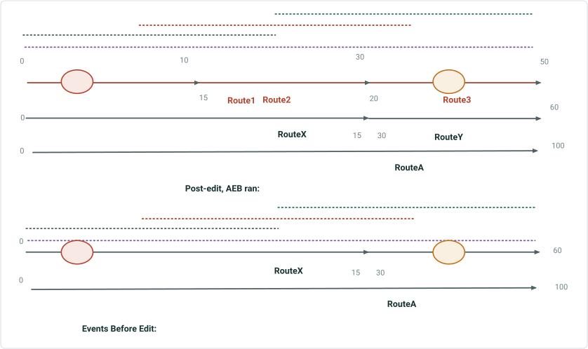

| Line ID | RouteID | From Date | ToDate |
| --- | --- | --- | --- |
| Line1 | Route1 | 1/1/2000 | 1/1/2005 |
| Line1 | Route2 | 1/1/2000 | 1/1/2005 |
| Line1 | Route3 | 1/1/2000 | 1/1/2005 |
| Line2 | RouteX | 1/1/2000 | NULL |
| Line2 | RouteY | 1/1/2000 | NULL |
| Line3 | RouteA | 1/1/2000 | NULL |

| Event Layer | Event ID | From RouteID | To RouteID | From Date | To Date | From Measure | To Measure |
| --- | --- | --- | --- | --- | --- | --- | --- |
| Point | Pt1 | Route1 | N/A | 1/1/2000 | NULL | 2 | N/A |
| Point | Pt2 | Route3 | N/A | 1/1/2000 | NULL | 40 | N/A |
| Line | Line1 | Route1 | Route3 | 1/1/2000 | NULL | 0 | 50 |
| Line | Line2 | Route1 | Route2 | 1/1/2000 | NULL | 0 | 17.5 |
| Line | Line3 | Route1 | Route3 | 1/1/2000 | NULL | 7 | 35 |
| Line | Line4 | Route2 | Route3 | 1/1/2000 | NULL | 17.5 | 50 |

| Event Layer | Event ID | From RouteID | To RouteID | From Date | To Date | From Measure | To Measure |
| --- | --- | --- | --- | --- | --- | --- | --- |
| Point | Pt1 | Route1 | N/A | 1/1/2000 | 1/1/2005 | 2 | N/A |
| Point | Pt2 | Route3 | N/A | 1/1/2000 | 1/1/2005 | 40 | N/A |
| Line | Line1 | Route1 | Route3 | 1/1/2000 | 1/1/2005 | 0 | 50 |
| Line | Line2 | Route1 | Route2 | 1/1/2000 | 1/1/2005 | 0 | 17.5 |
| Line | Line3 | Route1 | Route3 | 1/1/2000 | 1/1/2005 | 7 | 35 |
| Line | Line4 | Route2 | Route3 | 1/1/2000 | 1/1/2005 | 17.5 | 50 |
| Point | Pt1 | RouteX | N/A | 1/1/2005 | NULL | 2 | N/A |
| Point | Pt2 | RouteY | N/A | 1/1/2005 | NULL | 45 | N/A |
| Line | Line1 | RouteX | RouteY | 1/1/2005 | NULL | 0 | 60 |
| Line | Line2 | RouteX | RouteX | 1/1/2005 | NULL | 0 | 12.5 |
| Line | Line3 | RouteX | RouteY | 1/1/2005 | NULL | 7 | 40 |
| Line | Line4 | RouteX | RouteY | 1/1/2005 | NULL | 12.5 | 60 |

## Case 7 <!-- slide 28 -->

### Retire Whole Route, Concurrent Route Has Gap

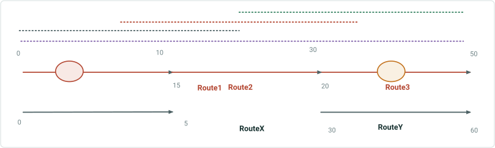

| Line ID | Route ID | From Date | ToDate |
| --- | --- | --- | --- |
| Line1 | Route1 | 1/1/2000 | NULL |
| Line1 | Route2 | 1/1/2000 | NULL |
| Line1 | Route3 | 1/1/2000 | NULL |
| Line2 | RouteX | 1/1/2000 | NULL |
| Line2 | RouteY | 1/1/2000 | NULL |

| Line ID | RouteID | From Date | ToDate |
| --- | --- | --- | --- |
| Line1 | Route1 | 1/1/2000 | 1/1/2005 |
| Line1 | Route2 | 1/1/2000 | 1/1/2005 |
| Line1 | Route3 | 1/1/2000 | 1/1/2005 |
| Line2 | RouteX | 1/1/2000 | NULL |
| Line2 | RouteY | 1/1/2000 | NULL |

| Event Layer | Event ID | From RouteID | To RouteID | From Date | To Date | From Measure | To Measure |
| --- | --- | --- | --- | --- | --- | --- | --- |
| Point | Pt1 | Route1 | N/A | 1/1/2000 | NULL | 2 | N/A |
| Point | Pt2 | Route3 | N/A | 1/1/2000 | NULL | 40 | N/A |
| Line | Line1 | Route1 | Route3 | 1/1/2000 | NULL | 0 | 50 |
| Line | Line2 | Route1 | Route2 | 1/1/2000 | NULL | 0 | 17.5 |
| Line | Line3 | Route1 | Route3 | 1/1/2000 | NULL | 7 | 35 |
| Line | Line4 | Route2 | Route3 | 1/1/2000 | NULL | 17.5 | 50 |

| Event Layer | Event ID | From RouteID | To RouteID | From Date | To Date | From Measure | To Measure |
| --- | --- | --- | --- | --- | --- | --- | --- |
| Point | Pt1 | Route1 | N/A | 1/1/2000 | 1/1/2005 | 2 | N/A |
| Point | Pt2 | Route3 | N/A | 1/1/2000 | 1/1/2005 | 40 | N/A |
| Line | Line1 | Route1 | Route3 | 1/1/2000 | 1/1/2005 | 0 | 50 |
| Line | Line2 | Route1 | Route2 | 1/1/2000 | 1/1/2005 | 0 | 17.5 |
| Line | Line3 | Route1 | Route3 | 1/1/2000 | 1/1/2005 | 7 | 35 |
| Line | Line4 | Route2 | Route3 | 1/1/2000 | 1/1/2005 | 17.5 | 50 |
| Point | Pt1 | RouteX | N/A | 1/1/2005 | NULL | 2 | N/A |
| Point | Pt2 | RouteY | N/A | 1/1/2005 | NULL | 45 | N/A |
| Line | Line1 | RouteX | RouteX | 1/1/2005 | NULL | 0 | 5 |
| Line | Line1 | RouteY | RouteY | 1/1/2005 | NULL | 30 | 60 |
| Line | Line2 | RouteX | RouteX | 1/1/2005 | NULL | 0 | 5 |
| Line | Line3 | RouteX | RouteX | 1/1/2005 | NULL | 4 | 5 |
| Line | Line3 | RouteX | RouteX | 1/1/2005 | NULL | 30 | 40 |
| Line | Line4 | RouteY | RouteY | 1/1/2005 | NULL | 30 | 60 |

## Case 8 <!-- slide 29 -->

### Retire All Routes on a Line, No Concurrencies

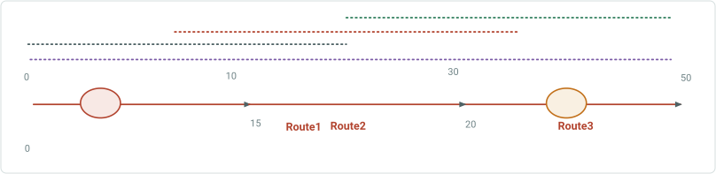

| Line ID | Route ID | From Date | ToDate |
| --- | --- | --- | --- |
| Line1 | Route1 | 1/1/2000 | NULL |
| Line1 | Route2 | 1/1/2000 | NULL |
| Line1 | Route3 | 1/1/2000 | NULL |

| Line ID | RouteID | From Date | ToDate |
| --- | --- | --- | --- |
| Line1 | Route1 | 1/1/2000 | 1/1/2005 |
| Line1 | Route2 | 1/1/2000 | 1/1/2005 |
| Line1 | Route3 | 1/1/2000 | 1/1/2005 |

| Event Layer | Event ID | From RouteID | To RouteID | From Date | To Date | From Measure | To Measure |
| --- | --- | --- | --- | --- | --- | --- | --- |
| Point | Pt1 | Route1 | N/A | 1/1/2000 | NULL | 2 | N/A |
| Point | Pt2 | Route3 | N/A | 1/1/2000 | NULL | 40 | N/A |
| Line | Line1 | Route1 | Route3 | 1/1/2000 | NULL | 0 | 50 |
| Line | Line2 | Route1 | Route2 | 1/1/2000 | NULL | 0 | 17.5 |
| Line | Line3 | Route1 | Route3 | 1/1/2000 | NULL | 7 | 35 |
| Line | Line4 | Route2 | Route3 | 1/1/2000 | NULL | 17.5 | 50 |

| Event Layer | Event ID | From RouteID | To RouteID | From Date | To Date | From Measure | To Measure |
| --- | --- | --- | --- | --- | --- | --- | --- |
| Point | Pt1 | Route1 | N/A | 1/1/2000 | 1/1/2005 | 2 | N/A |
| Point | Pt2 | Route3 | N/A | 1/1/2000 | 1/1/2005 | 40 | N/A |
| Line | Line1 | Route1 | Route3 | 1/1/2000 | 1/1/2005 | 0 | 50 |
| Line | Line2 | Route1 | Route2 | 1/1/2000 | 1/1/2005 | 0 | 17.5 |
| Line | Line3 | Route1 | Route3 | 1/1/2000 | 1/1/2005 | 7 | 35 |
| Line | Line4 | Route2 | Route3 | 1/1/2000 | 1/1/2005 | 17.5 | 50 |

## Case 9 <!-- slide 30 -->

### Retire Whole Route with Multiple Partial Concurrencies

| Line ID | Route ID | From Date | ToDate |
| --- | --- | --- | --- |
| Line1 | Route1 | 1/1/2000 | NULL |
| Line1 | Route2 | 1/1/2000 | NULL |
| Line1 | Route3 | 1/1/2000 | NULL |
| Line2 | RouteX | 1/1/2000 | NULL |
| Line2A | RouteY | 1/1/2000 | NULL |
| Line3 | RouteA | 1/1/2000 | NULL |

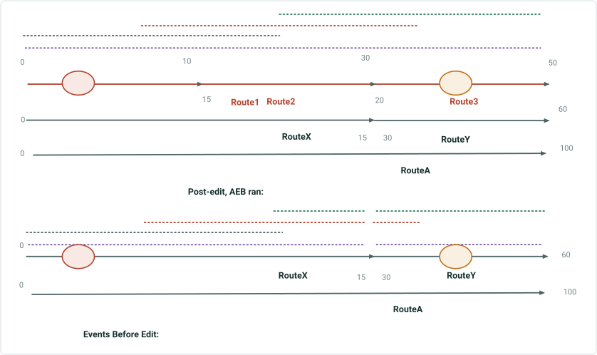

| Line ID | RouteID | From Date | ToDate |
| --- | --- | --- | --- |
| Line1 | Route1 | 1/1/2000 | 1/1/2005 |
| Line1 | Route2 | 1/1/2000 | 1/1/2005 |
| Line1 | Route3 | 1/1/2000 | 1/1/2005 |
| Line2 | RouteX | 1/1/2000 | NULL |
| Line2A | RouteY | 1/1/2000 | NULL |
| Line3 | RouteA | 1/1/2000 | NULL |

| Event Layer | Event ID | From RouteID | To RouteID | From Date | To Date | From Measure | To Measure |
| --- | --- | --- | --- | --- | --- | --- | --- |
| Point | Pt1 | Route1 | N/A | 1/1/2000 | NULL | 2 | N/A |
| Point | Pt2 | Route3 | N/A | 1/1/2000 | NULL | 40 | N/A |
| Line | Line1 | Route1 | Route3 | 1/1/2000 | NULL | 0 | 50 |
| Line | Line2 | Route1 | Route2 | 1/1/2000 | NULL | 0 | 17.5 |
| Line | Line3 | Route1 | Route3 | 1/1/2000 | NULL | 7 | 35 |
| Line | Line4 | Route2 | Route3 | 1/1/2000 | NULL | 17.5 | 50 |

| Event Layer | Event ID | From RouteID | To RouteID | From Date | To Date | From Measure | To Measure |
| --- | --- | --- | --- | --- | --- | --- | --- |
| Point | Pt1 | Route1 | N/A | 1/1/2000 | 1/1/2005 | 2 | N/A |
| Point | Pt2 | Route3 | N/A | 1/1/2000 | 1/1/2005 | 40 | N/A |
| Line | Line1 | Route1 | Route3 | 1/1/2000 | 1/1/2005 | 0 | 50 |
| Line | Line2 | Route1 | Route2 | 1/1/2000 | 1/1/2005 | 0 | 17.5 |
| Line | Line3 | Route1 | Route3 | 1/1/2000 | 1/1/2005 | 7 | 35 |
| Line | Line4 | Route2 | Route3 | 1/1/2000 | 1/1/2005 | 17.5 | 50 |
| Point | Pt1 | RouteX | N/A | 1/1/2005 | NULL | 2 | N/A |
| Point | Pt2 | RouteY | N/A | 1/1/2005 | NULL | 45 | N/A |
| Line | Line1 | RouteX | RouteX | 1/1/2005 | NULL | 0 | 15 |
| Line | Line1 | RouteY | RouteY | 1/1/2005 | NULL | 30 | 60 |
| Line | Line2 | RouteX | RouteX | 1/1/2005 | NULL | 0 | 12.5 |
| Line | Line3 | RouteX | RouteX | 1/1/2005 | NULL | 7 | 15 |
| Line | Line3 | RouteY | RouteY | 1/1/2005 | NULL | 30 | 40 |
| Line | Line4 | RouteX | RouteY | 1/1/2005 | NULL | 12.5 | 15 |
| Line | Line4 | RouteY | RouteY | 1/1/2005 | NULL | 30 | 60 |

## Case 10 <!-- slide 31 -->

### Retire Second Half of Routes on Line

**Retire second half of routes on line, point event is on cusp of retirement**

| Line ID | Route ID | From Date | ToDate |
| --- | --- | --- | --- |
| Line1 | Route1 | 1/1/2000 | NULL |
| Line1 | Route2 | 1/1/2000 | NULL |
| Line1 | Route3 | 1/1/2000 | NULL |
| Line2 | RouteX | 1/1/2000 | NULL |
| Line2 | RouteY | 1/1/2000 | NULL |

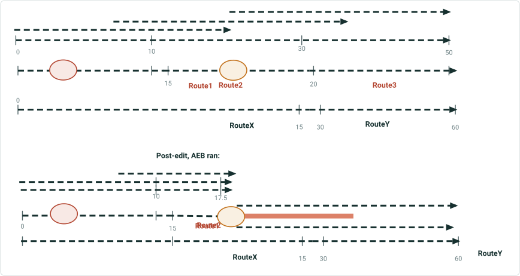

| Line ID | RouteID | From Date | ToDate |
| --- | --- | --- | --- |
| Line1 | Route1 | 1/1/2000 | 1/1/2005 |
| Line1 | Route2 | 1/1/2000 | 1/1/2005 |
| Line1 | Route3 | 1/1/2000 | 1/1/2005 |
| Line1 | Route1 | 1/1/2000 | NULL |
| Line1 | Route2 | 1/1/2000 | NULL |
| Line2 | RouteX | 1/1/2000 | NULL |
| Line2 | RouteY | 1/1/2000 | NULL |

| Event Layer | Event ID | From RouteID | To RouteID | From Date | To Date | From Measure | To Measure |
| --- | --- | --- | --- | --- | --- | --- | --- |
| Point | Pt1 | Route1 | N/A | 1/1/2000 | NULL | 2 | N/A |
| Point | Pt2 | Route3 | N/A | 1/1/2000 | NULL | 40 | N/A |
| Line | Line1 | Route1 | Route3 | 1/1/2000 | NULL | 0 | 50 |
| Line | Line2 | Route1 | Route2 | 1/1/2000 | NULL | 0 | 17.5 |
| Line | Line3 | Route1 | Route3 | 1/1/2000 | NULL | 7 | 35 |
| Line | Line4 | Route2 | Route3 | 1/1/2000 | NULL | 17.5 | 50 |

| Event Layer | Event ID | From RouteID | To RouteID | From Date | To Date | From Measure | To Measure |
| --- | --- | --- | --- | --- | --- | --- | --- |
| Point | Pt1 | Route1 | N/A | 1/1/2000 | NULL | 2 | N/A |
| Point | Pt2 | Route2 | N/A | 1/1/2000 | 1/1/2005 | 17.5 | N/A |
| Line | Line1 | Route1 | Route3 | 1/1/2000 | 1/1/2005 | 0 | 50 |
| Line | Line2 | Route1 | Route2 | 1/1/2000 | NULL | 0 | 17.5 |
| Line | Line3 | Route1 | Route3 | 1/1/2000 | 1/1/2005 | 7 | 35 |
| Line | Line4 | Route2 | Route3 | 1/1/2000 | 1/1/2005 | 17.5 | 50 |
| Point | Pt2 | RouteX | N/A | 1/1/2005 | NULL | 17.5 | N/A |
| Line | Line1 | Route1 | Route2 | 1/1/2005 | NULL | 0 | 17.5 |
| Line | Line1 | RouteX | RouteY | 1/1/2005 | NULL | 12.5 | 60 |
| Line | Line3 | Route1 | Route2 | 1/1/2005 | NULL | 7 | 17.5 |
| Line | Line3 | RouteX | RouteY | 1/1/2005 | NULL | 12.5 | 40 |
| Line | Line4 | RouteX | RouteY | 1/1/2005 | NULL | 12.5 | 60 |

## Case 11 <!-- slide 32 -->

### Retire All Routes on Line, Source Routes Have Gap

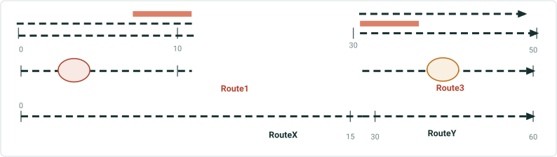

| Line ID | Route ID | From Date | ToDate |
| --- | --- | --- | --- |
| Line1 | Route1 | 1/1/2000 | NULL |
| Line1 | Route3 | 1/1/2000 | NULL |
| Line2 | RouteX | 1/1/2000 | NULL |
| Line2 | RouteY | 1/1/2000 | NULL |

| Line ID | RouteID | From Date | ToDate |
| --- | --- | --- | --- |
| Line1 | Route1 | 1/1/2000 | 1/1/2005 |
| Line1 | Route3 | 1/1/2000 | 1/1/2005 |
| Line2 | RouteX | 1/1/2000 | NULL |
| Line2 | RouteY | 1/1/2000 | NULL |

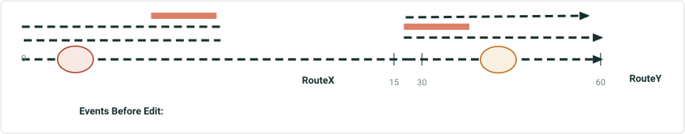

| Event Layer | Event ID | From RouteID | To RouteID | From Date | To Date | From Measure | To Measure |
| --- | --- | --- | --- | --- | --- | --- | --- |
| Point | Pt1 | Route1 | N/A | 1/1/2000 | NULL | 2 | N/A |
| Point | Pt2 | Route3 | N/A | 1/1/2000 | NULL | 40 | N/A |
| Line | Line1 | Route1 | Route1 | 1/1/2000 | NULL | 0 | 10 |
| Line | Line1A | Route3 | Route3 | 1/1/2000 | NULL | 30 | 50 |
| Line | Line2 | Route1 | Route1 | 1/1/2000 | NULL | 0 | 10 |
| Line | Line3 | Route1 | Route1 | 1/1/2000 | NULL | 7 | 10 |
| Line | Line3A | Route3 | Route3 | 1/1/2000 | NULL | 30 | 35 |
| Line | Line4 | Route2 | Route3 | 1/1/2000 | NULL | 17.5 | 50 |

| Event Layer | Event ID | From RouteID | To RouteID | From Date | To Date | From Measure | To Measure |
| --- | --- | --- | --- | --- | --- | --- | --- |
| Point | Pt1 | Route1 | N/A | 1/1/2000 | 1/1/2005 | 2 | N/A |
| Point | Pt2 | Route3 | N/A | 1/1/2000 | 1/1/2005 | 40 | N/A |
| Line | Line1 | Route1 | Route1 | 1/1/2000 | 1/1/2005 | 0 | 10 |
| Line | Line1A | Route3 | Route3 | 1/1/2000 | 1/1/2005 | 30 | 50 |
| Line | Line2 | Route1 | Route1 | 1/1/2000 | 1/1/2005 | 0 | 10 |
| Line | Line3 | Route1 | Route1 | 1/1/2000 | 1/1/2005 | 7 | 10 |
| Line | Line3A | Route3 | Route3 | 1/1/2000 | 1/1/2005 | 30 | 35 |
| Line | Line4 | Route2 | Route3 | 1/1/2000 | 1/1/2005 | 17.5 | 50 |
| Point | Pt1 | RouteX | N/A | 1/1/2005 | NULL | 2 | N/A |
| Point | Pt2 | RouteY | N/A | 1/1/2005 | NULL | 40 | N/A |
| Line | Line1 | RouteX | RouteX | 1/1/2005 | NULL | 0 | 10 |
| Line | Line1A | RouteY | RouteY | 1/1/2005 | NULL | 30 | 60 |
| Line | Line2 | RouteX | RouteX | 1/1/2005 | NULL | 0 | 10 |
| Line | Line3 | RouteX | RouteX | 1/1/2005 | NULL | 7 | 10 |
| Line | Line3A | RouteY | RouteY | 1/1/2005 | NULL | 30 | 40 |
| Line | Line4 | RouteY | RouteY | 1/1/2005 | NULL | 30 | 60 |

## Case 12 <!-- slide 33 -->

### Retire All Routes on Line

**Retire all routes on line, non-proportional concurrent routes**

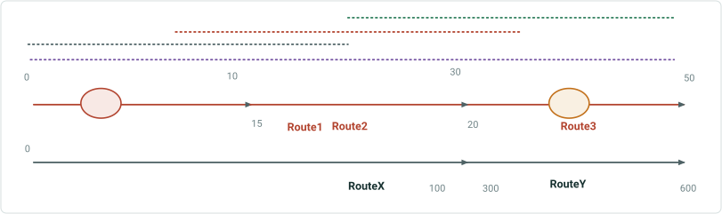

| Line ID | Route ID | From Date | ToDate |
| --- | --- | --- | --- |
| Line1 | Route1 | 1/1/2000 | NULL |
| Line1 | Route2 | 1/1/2000 | NULL |
| Line1 | Route3 | 1/1/2000 | NULL |
| Line2 | RouteX | 1/1/2000 | NULL |
| Line2 | RouteY | 1/1/2000 | NULL |

| Line ID | RouteID | From Date | ToDate |
| --- | --- | --- | --- |
| Line1 | Route1 | 1/1/2000 | 1/1/2005 |
| Line1 | Route2 | 1/1/2000 | 1/1/2005 |
| Line1 | Route3 | 1/1/2000 | 1/1/2005 |
| Line2 | RouteX | 1/1/2000 | NULL |
| Line2 | RouteY | 1/1/2000 | NULL |

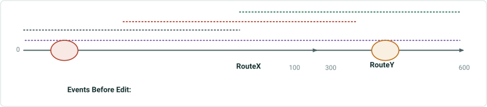

| Event Layer | Event ID | From RouteID | To RouteID | From Date | To Date | From Measure | To Measure |
| --- | --- | --- | --- | --- | --- | --- | --- |
| Point | Pt1 | Route1 | N/A | 1/1/2000 | NULL | 2 | N/A |
| Point | Pt2 | Route3 | N/A | 1/1/2000 | NULL | 40 | N/A |
| Line | Line1 | Route1 | Route3 | 1/1/2000 | NULL | 0 | 50 |
| Line | Line2 | Route1 | Route2 | 1/1/2000 | NULL | 0 | 17.5 |
| Line | Line3 | Route1 | Route3 | 1/1/2000 | NULL | 7 | 35 |
| Line | Line4 | Route2 | Route3 | 1/1/2000 | NULL | 17.5 | 50 |

| Event Layer | Event ID | From RouteID | To RouteID | From Date | To Date | From Measure | To Measure |
| --- | --- | --- | --- | --- | --- | --- | --- |
| Point | Pt1 | Route1 | N/A | 1/1/2000 | 1/1/2005 | 2 | N/A |
| Point | Pt2 | Route3 | N/A | 1/1/2000 | 1/1/2005 | 40 | N/A |
| Line | Line1 | Route1 | Route3 | 1/1/2000 | 1/1/2005 | 0 | 50 |
| Line | Line2 | Route1 | Route2 | 1/1/2000 | 1/1/2005 | 0 | 17.5 |
| Line | Line3 | Route1 | Route3 | 1/1/2000 | 1/1/2005 | 7 | 35 |
| Line | Line4 | Route2 | Route3 | 1/1/2000 | 1/1/2005 | 17.5 | 50 |
| Point | Pt1 | RouteX | N/A | 1/1/2005 | NULL | 10 | N/A |
| Point | Pt2 | RouteY | N/A | 1/1/2005 | NULL | 450 | N/A |
| Line | Line1 | RouteX | RouteY | 1/1/2005 | NULL | 0 | 600 |
| Line | Line2 | RouteX | RouteX | 1/1/2005 | NULL | 0 | 75 |
| Line | Line3 | RouteX | RouteY | 1/1/2005 | NULL | 35 | 400 |
| Line | Line4 | RouteX | RouteY | 1/1/2005 | NULL | 62.5 | 600 |

## Case 13 <!-- slide 34 -->

### Retire All Routes on Complex Line


| RouteID | From Date | To Date |
| --- | --- | --- |
| Route1 | 1/1/2000 | NULL |
| Route2 | 1/1/2000 | NULL |
| RouteX | 1/1/2000 | NULL |
| RouteY | 1/1/2000 | NULL |


| Layer | Event ID | From Date | To Date | From RouteID | To RouteID | From Measure | To Measure |
| --- | --- | --- | --- | --- | --- | --- | --- |
| Red Event | Red1 | 1/1/2000 | NULL | Route1 | Route1 | 0 | 5 |
| Red Event | Red2 | 1/1/2000 | NULL | Route1 | Route2 | 5 | 20 |
| Blue Event | Blue1 | 1/1/2000 | NULL | Route1 | Route2 | 0 | 20 |
| Green Event | Green1 | 1/1/2000 | NULL | Route1 | Route2 | 0 | 20 |

| RouteID | From Date | To Date |
| --- | --- | --- |
| Route1 | 1/1/2000 | 1/1/2005 |
| Route2 | 1/1/2000 | 1/1/2005 |
| RouteX | 1/1/2000 | 1/1/2005 |
| RouteY | 1/1/2000 | 1/1/2005 |

| Layer | Event ID | From Date | To Date | From RouteID | To RouteID | From Measure | To Measure |
| --- | --- | --- | --- | --- | --- | --- | --- |
| Red Event | Red1 | 1/1/2000 | 1/1/2005 | Route1 | Route1 | 0 | 5 |
| Red Event | Red2 | 1/1/2000 | 1/1/2005 | Route1 | Route2 | 5 | 20 |
| Blue Event | Blue1 | 1/1/2000 | 1/1/2005 | Route1 | Route2 | 0 | 20 |
| Green Event | Green1 | 1/1/2000 | 1/1/2005 | Route1 | Route2 | 0 | 20 |
| Red Event | Red1 | 1/1/2005 | NULL | RouteX | RouteY | 0 | 5 |
| Red Event | Red2 | 1/1/2005 | NULL | RouteX | RouteY | 5 | 20 |
| Blue Event | Blue1 | 1/1/2005 | NULL | RouteX | RouteY | 0 | 20 |
| Green Event | Green1 | 1/1/2005 | NULL | RouteX | RouteY | 0 | 20 |

## Case 14 <!-- slide 35 -->

### Retire Whole Vertical Route

| RouteID | FromDate | ToDate |
| --- | --- | --- |
| Route2 | 1/1/2000 | NULL |
| Route2A | 1/1/2000 | NULL |
| Route1 | 1/1/2000 | NULL |
| Route1A | 1/1/2000 | NULL |


| Input Layer | Event ID | From RouteID | To RouteID | From Date | To Date | From Measure | To Measure |
| --- | --- | --- | --- | --- | --- | --- | --- |
| Red Event | Red1 | Route1 | Route1 | 1/1/2000 | <Null> | 0 | 2.5 |
| Red Event | Red2 | Route1 | Route1A | 1/1/2000 | <Null> | 2.5 | 10 |
| Blue Event | Blue1 | Route1 | Route1A | 1/1/2000 | <Null> | 0 | 10 |
| Green Event | Green1 | Route1 | Route1A | 1/1/2000 | <Null> | 0 | 10 |

| Input Layer | Event ID | From RouteID | To RouteID | From Date | To Date | From Measure | To Measure |
| --- | --- | --- | --- | --- | --- | --- | --- |
| Red Event | Red1 | Route1 | Route1 | 1/1/2000 | 1/1/2005 | 0 | 2.5 |
| Red Event | Red2 | Route1 | Route1A | 1/1/2000 | 1/1/2005 | 2.5 | 10 |
| Blue Event | Blue1 | Route1 | Route1A | 1/1/2000 | 1/1/2005 | 0 | 10 |
| Green Event | Green1 | Route1 | Route1A | 1/1/2000 | 1/1/2005 | 0 | 10 |
| Red Event | Red1 | Route2 | Route2 | 1/1/2005 | <Null> | 0 | 2.5 |
| Red Event | Red2 | Route2 | Route2A | 1/1/2005 | <Null> | 2.5 | 10 |
| Blue Event | Blue1 | Route2 | Route2A | 1/1/2005 | <Null> | 0 | 10 |
| Green Event | Green1 | Route2 | Route2A | 1/1/2005 | <Null> | 0 | 10 |

| RouteID | FromDate | ToDate |
| --- | --- | --- |
| Route2 | 1/1/2000 | NULL |
| Route2A | 1/1/2000 | NULL |
| Route1 | 1/1/2000 | 1/1/2005 |
| Route1A | 1/1/2000 | 1/1/2005 |

## Case 15 <!-- slide 36 -->

### Retire First Half of Routes on a Line

**Retire first half of routes on a line, recalibrate downstream (Stay Put)**

| Line ID | Route ID | From Date | ToDate |
| --- | --- | --- | --- |
| Line1 | Route1 | 1/1/2000 | NULL |
| Line1 | Route2 | 1/1/2000 | NULL |
| Line1 | Route3 | 1/1/2000 | NULL |
| Line2 | RouteX | 1/1/2000 | NULL |
| Line2 | RouteY | 1/1/2000 | NULL |

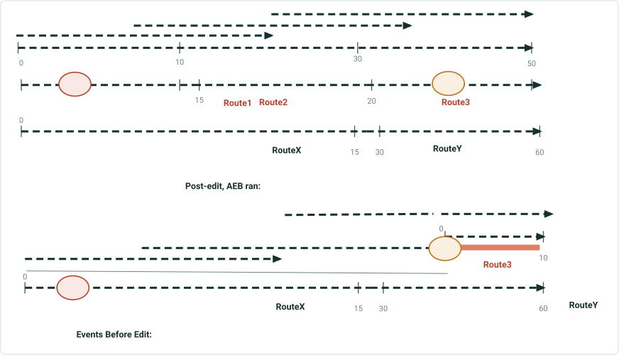

| Line ID | RouteID | From Date | ToDate |
| --- | --- | --- | --- |
| Line1 | Route1 | 1/1/2000 | 1/1/2005 |
| Line1 | Route2 | 1/1/2000 | 1/1/2005 |
| Line1 | Route3 | 1/1/2000 | 1/1/2005 |
| Line1 | Route3 | 1/1/2005 | NULL |
| Line2 | RouteX | 1/1/2000 | NULL |
| Line2 | RouteY | 1/1/2000 | NULL |

| Event Layer | Event ID | From RouteID | To RouteID | From Date | To Date | From Measure | To Measure |
| --- | --- | --- | --- | --- | --- | --- | --- |
| Point | Pt1 | Route1 | N/A | 1/1/2000 | NULL | 2 | N/A |
| Point | Pt2 | Route3 | N/A | 1/1/2000 | NULL | 40 | N/A |
| Line | Line1 | Route1 | Route3 | 1/1/2000 | NULL | 0 | 50 |
| Line | Line2 | Route1 | Route2 | 1/1/2000 | NULL | 0 | 17.5 |
| Line | Line3 | Route1 | Route3 | 1/1/2000 | NULL | 7 | 35 |
| Line | Line4 | Route2 | Route3 | 1/1/2000 | NULL | 17.5 | 50 |

| Event Layer | Event ID | From RouteID | To RouteID | From Date | To Date | From Measure | To Measure |
| --- | --- | --- | --- | --- | --- | --- | --- |
| Point | Pt1 | Route1 | N/A | 1/1/2000 | 1/1/2005 | 2 | N/A |
| Point | Pt2 | Route3 | N/A | 1/1/2000 | 1/1/2005 | 40 | N/A |
| Line | Line1 | Route1 | Route3 | 1/1/2000 | 1/1/2005 | 0 | 50 |
| Line | Line2 | Route1 | Route2 | 1/1/2000 | 1/1/2005 | 0 | 17.5 |
| Line | Line3 | Route1 | Route3 | 1/1/2000 | 1/1/2005 | 7 | 35 |
| Line | Line4 | Route2 | Route3 | 1/1/2000 | 1/1/2005 | 17.5 | 50 |
| Point | Pt1 | RouteX | N/A | 1/1/2005 | NULL | 2 | N/A |
| Point | Pt2 | Route3 | N/A | 1/1/2005 | NULL | 40 | N/A |
| Line | Line1 | RouteX | RouteY | 1/1/2005 | NULL | 0 | 45 |
| Line | Line1 | Route3 | Route3 | 1/1/2005 | NULL | 0 | 10 |
| Line | Line2 | RouteX | RouteX | 1/1/2005 | NULL | 0 | 12.5 |
| Line | Line3 | RouteX | RouteY | 1/1/2005 | NULL | 7 | 45 |
| Line | Line3 | Route3 | Route3 | 1/1/2005 | NULL | 0 | 10 |
| Line | Line4 | RouteX | RouteY | 1/1/2005 | NULL | 12.5 | 45 |
| Line | Line4 | Route3 | Route3 | 1/1/2005 | NULL | 0 | 10 |

## Slide 37

16 . Retire first half of routes on a line, recalibrate downstream (Stay Put)

| Line ID | Route ID | From Date | ToDate |
| --- | --- | --- | --- |
| Line1 | Route1 | 1/1/2000 | NULL |
| Line1 | Route2 | 1/1/2000 | NULL |
| Line1 | Route3 | 1/1/2000 | NULL |
| Line2 | RouteX | 1/1/2000 | NULL |
| Line2 | RouteY | 1/1/2000 | NULL |


| Line ID | RouteID | From Date | ToDate |
| --- | --- | --- | --- |
| Line1 | Route1 | 1/1/2000 | 1/1/2005 |
| Line1 | Route2 | 1/1/2000 | 1/1/2005 |
| Line1 | Route3 | 1/1/2000 | 1/1/2005 |
| Line1 | Route3 | 1/1/2005 | NULL |
| Line2 | RouteX | 1/1/2000 | NULL |
| Line2 | RouteY | 1/1/2000 | NULL |

| Event Layer | Event ID | From RouteID | To RouteID | From Date | To Date | From Measure | To Measure |
| --- | --- | --- | --- | --- | --- | --- | --- |
| Point | Pt1 | Route1 | N/A | 1/1/2000 | NULL | 2 | N/A |
| Point | Pt2 | Route3 | N/A | 1/1/2000 | NULL | 40 | N/A |
| Line | Line1 | Route1 | Route3 | 1/1/2000 | NULL | 0 | 50 |
| Line | Line2 | Route1 | Route2 | 1/1/2000 | NULL | 0 | 17.5 |
| Line | Line3 | Route1 | Route3 | 1/1/2000 | NULL | 7 | 35 |
| Line | Line4 | Route2 | Route3 | 1/1/2000 | NULL | 17.5 | 50 |

| Event Layer | Event ID | From RouteID | To RouteID | From Date | To Date | From Measure | To Measure | Loc Error |
| --- | --- | --- | --- | --- | --- | --- | --- | --- |
| Point | Pt1 | Route1 | N/A | 1/1/2000 | 1/1/2005 | 2 | N/A | No Error |
| Point | Pt2 | Route3 | N/A | 1/1/2000 | 1/1/2005 | 40 | N/A | No Error |
| Line | Line1 | Route1 | Route3 | 1/1/2000 | 1/1/2005 | 0 | 50 | No Error |
| Line | Line2 | Route1 | Route2 | 1/1/2000 | 1/1/2005 | 0 | 17.5 | No Error |
| Line | Line3 | Route1 | Route3 | 1/1/2000 | 1/1/2005 | 7 | 35 | No Error |
| Line | Line4 | Route2 | Route3 | 1/1/2000 | 1/1/2005 | 17.5 | 50 | No Error |
| Point | Pt1 | RouteX | N/A | 1/1/2005 | NULL | 2 | N/A | No Error |
| Point | Pt2 | Route3 | N/A | 1/1/2005 | NULL | 40 | N/A | Route Location Not Found |
| Line | Line1 | RouteX | RouteY | 1/1/2005 | NULL | 0 | 45 | No Error |
| Line | Line1 | Route3 | Route3 | 1/1/2005 | NULL | 0 | 10 | Route Location not Found |
| Line | Line2 | RouteX | RouteX | 1/1/2005 | NULL | 0 | 12.5 | No Error |
| Line | Line3 | RouteX | RouteY | 1/1/2005 | NULL | 7 | 45 | No Error |
| Line | Line3 | Route3 | Route3 | 1/1/2005 | NULL | 0 | 10 | Route Location Not Found |
| Line | Line4 | RouteX | RouteY | 1/1/2005 | NULL | 12.5 | 45 | No Error |
| Line | Line4 | Route3 | Route3 | 1/1/2005 | NULL | 0 | 10 | Route Location Not Found |

## Case 17 <!-- slide 38 -->

### Retire First Half of Routes on a Line

**Retire first half of routes on a line, recalibrate downstream (Retire)**

| Line ID | Route ID | From Date | ToDate |
| --- | --- | --- | --- |
| Line1 | Route1 | 1/1/2000 | NULL |
| Line1 | Route2 | 1/1/2000 | NULL |
| Line1 | Route3 | 1/1/2000 | NULL |
| Line2 | RouteX | 1/1/2000 | NULL |
| Line2 | RouteY | 1/1/2000 | NULL |

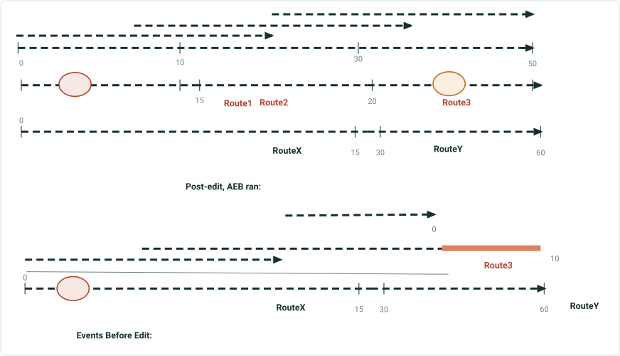

| Line ID | RouteID | From Date | ToDate |
| --- | --- | --- | --- |
| Line1 | Route1 | 1/1/2000 | 1/1/2005 |
| Line1 | Route2 | 1/1/2000 | 1/1/2005 |
| Line1 | Route3 | 1/1/2000 | 1/1/2005 |
| Line1 | Route3 | 1/1/2005 | NULL |
| Line2 | RouteX | 1/1/2000 | NULL |
| Line2 | RouteY | 1/1/2000 | NULL |

| Event Layer | Event ID | From RouteID | To RouteID | From Date | To Date | From Measure | To Measure |
| --- | --- | --- | --- | --- | --- | --- | --- |
| Point | Pt1 | Route1 | N/A | 1/1/2000 | NULL | 2 | N/A |
| Point | Pt2 | Route3 | N/A | 1/1/2000 | NULL | 40 | N/A |
| Line | Line1 | Route1 | Route3 | 1/1/2000 | NULL | 0 | 50 |
| Line | Line2 | Route1 | Route2 | 1/1/2000 | NULL | 0 | 17.5 |
| Line | Line3 | Route1 | Route3 | 1/1/2000 | NULL | 7 | 35 |
| Line | Line4 | Route2 | Route3 | 1/1/2000 | NULL | 17.5 | 50 |

| Event Layer | Event ID | From RouteID | To RouteID | From Date | To Date | From Measure | To Measure |
| --- | --- | --- | --- | --- | --- | --- | --- |
| Point | Pt1 | Route1 | N/A | 1/1/2000 | 1/1/2005 | 2 | N/A |
| Point | Pt2 | Route3 | N/A | 1/1/2000 | 1/1/2005 | 40 | N/A |
| Line | Line1 | Route1 | Route3 | 1/1/2000 | 1/1/2005 | 0 | 50 |
| Line | Line2 | Route1 | Route2 | 1/1/2000 | 1/1/2005 | 0 | 17.5 |
| Line | Line3 | Route1 | Route3 | 1/1/2000 | 1/1/2005 | 7 | 35 |
| Line | Line4 | Route2 | Route3 | 1/1/2000 | 1/1/2005 | 17.5 | 50 |
| Point | Pt1 | RouteX | N/A | 1/1/2005 | NULL | 2 | N/A |
| Line | Line1 | RouteX | RouteY | 1/1/2005 | NULL | 0 | 45 |
| Line | Line2 | RouteX | RouteX | 1/1/2005 | NULL | 0 | 12.5 |
| Line | Line3 | RouteX | RouteY | 1/1/2005 | NULL | 7 | 45 |
| Line | Line4 | RouteX | RouteY | 1/1/2005 | NULL | 12.5 | 45 |

## Case 18 <!-- slide 39 -->

### Retire All Routes on Line

**Retire all routes on line, concurrent route has multiple time slices**


| Line ID | Route ID | From Date | ToDate |
| --- | --- | --- | --- |
| Line1 | Route1 | 1/1/2000 | NULL |
| Line1 | Route2 | 1/1/2000 | NULL |
| Line1 | Route3 | 1/1/2000 | NULL |
| Line2 | RouteX | 1/1/2000 | 1/1/2005 |
| Line2 | RouteY | 1/1/2000 | 1/1/2005 |
| Line2 | RouteX | 1/1/2005 | 1/1/2010 |
| Line2 | RouteY | 1/1/2005 | 1/1/2010 |
| Line2 | RouteX | 1/1/2010 | NULL |
| Line2 | RouteY | 1/1/2010 | NULL |

| Event Layer | Event ID | From RouteID | To RouteID | From Date | To Date | From Measure | To Measure |
| --- | --- | --- | --- | --- | --- | --- | --- |
| Point | Pt1 | Route1 | N/A | 1/1/2000 | NULL | 2 | N/A |
| Point | Pt2 | Route3 | N/A | 1/1/2000 | NULL | 40 | N/A |
| Line | Line1 | Route1 | Route3 | 1/1/2000 | NULL | 0 | 50 |
| Line | Line2 | Route1 | Route2 | 1/1/2000 | NULL | 0 | 17.5 |
| Line | Line3 | Route1 | Route3 | 1/1/2000 | NULL | 7 | 35 |
| Line | Line4 | Route2 | Route3 | 1/1/2000 | NULL | 17.5 | 50 |

| Line ID | Route ID | From Date | ToDate |
| --- | --- | --- | --- |
| Line1 | Route1 | 1/1/2000 | 1/1/2004 |
| Line1 | Route2 | 1/1/2000 | 1/1/2004 |
| Line1 | Route3 | 1/1/2000 | 1/1/2004 |
| Line2 | RouteX | 1/1/2000 | 1/1/2005 |
| Line2 | RouteY | 1/1/2000 | 1/1/2005 |
| Line2 | RouteX | 1/1/2005 | 1/1/2010 |
| Line2 | RouteY | 1/1/2005 | 1/1/2010 |
| Line2 | RouteX | 1/1/2010 | NULL |
| Line2 | RouteY | 1/1/2010 | NULL |

## Case 18 <!-- slide 40 -->

### Retire All Routes on Line

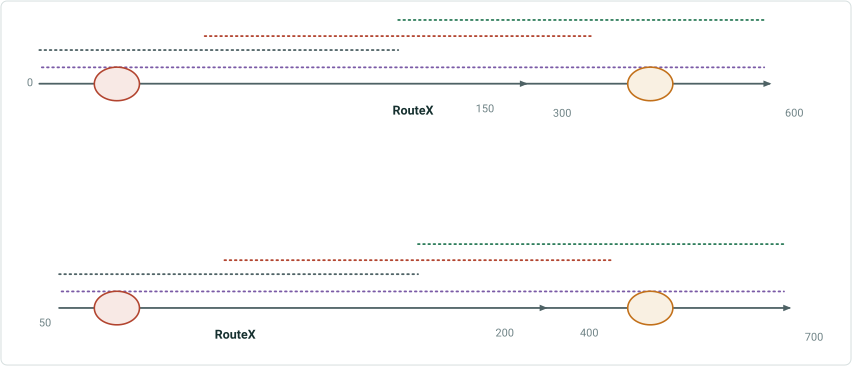

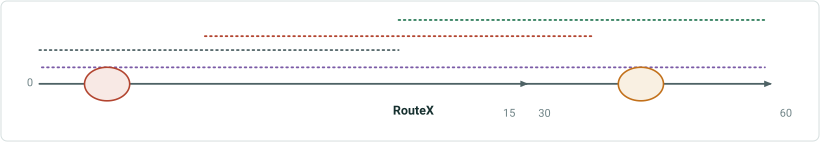

| Event Layer | Event ID | From RouteID | To RouteID | From Date | To Date | From Measure | To Measure |
| --- | --- | --- | --- | --- | --- | --- | --- |
| Point | Pt1 | Route1 | N/A | 1/1/2000 | 1/1/2004 | 2 | N/A |
| Point | Pt2 | Route3 | N/A | 1/1/2000 | 1/1/2004 | 40 | N/A |
| Line | Line1 | Route1 | Route3 | 1/1/2000 | 1/1/2004 | 0 | 50 |
| Line | Line2 | Route1 | Route2 | 1/1/2000 | 1/1/2004 | 0 | 17.5 |
| Line | Line3 | Route1 | Route3 | 1/1/2000 | 1/1/2004 | 7 | 35 |
| Line | Line4 | Route2 | Route3 | 1/1/2000 | 1/1/2004 | 17.5 | 50 |
| Point | Pt1 | RouteX | N/A | 1/1/2004 | 1/1/2005 | 2 | N/A |
| Point | Pt2 | RouteY | N/A | 1/1/2004 | 1/1/2005 | 45 | N/A |
| Line | Line1 | RouteX | RouteY | 1/1/2004 | 1/1/2005 | 0 | 60 |
| Line | Line2 | RouteX | RouteX | 1/1/2004 | 1/1/2005 | 0 | 12.5 |
| Line | Line3 | RouteX | RouteY | 1/1/2004 | 1/1/2005 | 7 | 40 |
| Line | Line4 | RouteX | RouteY | 1/1/2004 | 1/1/2005 | 12.5 | 60 |
| Point | Pt1 | RouteX | N/A | 1/1/2005 | 1/1/2010 | 20 | N/A |
| Point | Pt2 | RouteY | N/A | 1/1/2005 | 1/1/2010 | 450 | N/A |
| Line | Line1 | RouteX | RouteY | 1/1/2005 | 1/1/2010 | 0 | 600 |
| Line | Line2 | RouteX | RouteX | 1/1/2005 | 1/1/2010 | 0 | 125 |
| Line | Line3 | RouteX | RouteY | 1/1/2005 | 1/1/2010 | 70 | 400 |
| Line | Line4 | RouteX | RouteY | 1/1/2005 | 1/1/2010 | 125 | 600 |
| Point | Pt1 | RouteX | N/A | 1/1/2010 | NULL | 70 | N/A |
| Point | Pt2 | RouteY | N/A | 1/1/2010 | NULL | 550 | N/A |
| Line | Line1 | RouteX | RouteY | 1/1/2010 | NULL | 50 | 700 |
| Line | Line2 | RouteX | RouteX | 1/1/2010 | NULL | 50 | 175 |
| Line | Line3 | RouteX | RouteY | 1/1/2010 | NULL | 120 | 500 |
| Line | Line4 | RouteX | RouteY | 1/1/2010 | NULL | 175 | 700 |

Post-edit, AEB ran (1/1/2004-1/1/2005):

**Retire all routes on line, concurrent route has multiple time slices (Continued)**
