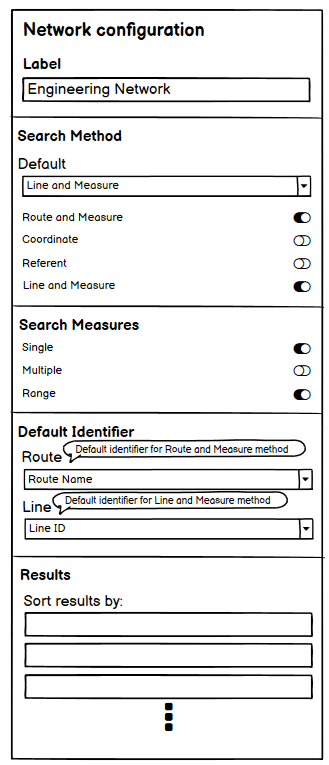
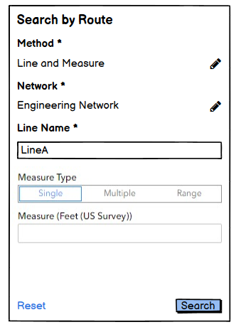
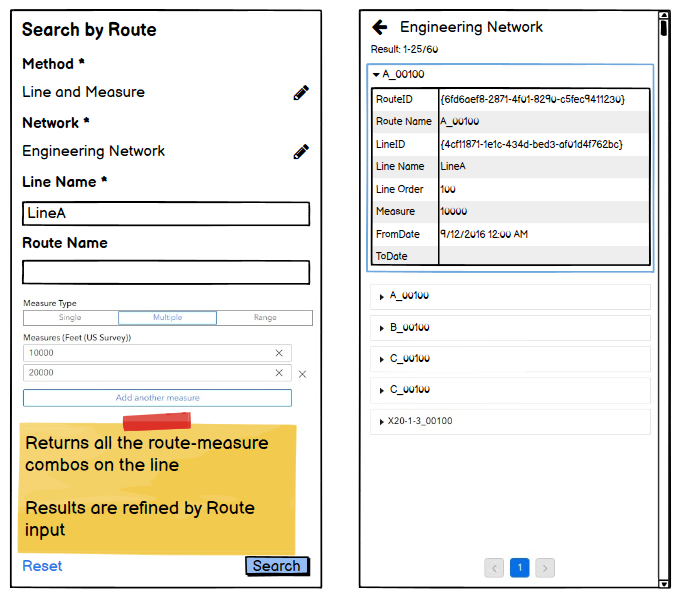

# Search by Line Test Plan

|   |   |
| --- | --- |
| **Kind** | Test Plan · Experience Builder |
| **Release** | — |
| **Product** | Roads & Highways · Pipeline Referencing |
| **Source** | [ExB_SearchbyLine_Testplan.docx](<https://esriis.sharepoint.com/sites/LocationReferencing/Shared%20Documents/General/Test%20Plans/ExB_SearchbyLine_Testplan.docx>) |
| **Edited** | 2024-05-23 21:10 by Praveen Kumar |
| **Extracted** | 2026-09-04 · lane `xmlstrip` |

<!-- metadata
```yaml
title: "Search by Line Test Plan"
source_file: "ExB_SearchbyLine_Testplan.docx"
source_url: "https://esriis.sharepoint.com/sites/LocationReferencing/Shared%20Documents/General/Test%20Plans/ExB_SearchbyLine_Testplan.docx"
doc_id: 363
doc_kind: "Test Plan"
surface: "Experience Builder"
doc_revision: ""
target_release: ""
pe: ""
dev: ""
author: "Praveen Kumar"
last_edited_by: "Praveen Kumar"
last_edited: "2024-05-23T21:10:00Z"
extracted: 2026-09-04
extraction_lane: xmlstrip
prompt_version: "v2.0.2"
keywords: ["search by line", "line network", "line identifier", "measure range", "route identifier", "search measures", "experience builder"]
tools: ["Search by Route widget", "Experience Builder widget"]
products: ["Roads & Highways", "Pipeline Referencing"]
issues: []
related: [{"doc":423,"file":"search-by-route-and-station-test-plan__doc423.md","s":4.679},{"doc":380,"file":"search-by-line-and-measure-user-story__doc380.md","s":4.625},{"doc":473,"file":"search-by-route-experience-builder-widget-test-plan__doc473.md","s":4.379},{"doc":462,"file":"search-route-exb-widget-search-by-station-method-test-plan__doc462.md","s":3.781},{"doc":464,"file":"search-by-line-experience-builder-widget__doc464.md","s":3.719}]
```
-->

## Summary

This test plan covers the verification of the Search by Line functionality in the Experience Builder widget. It includes tests for layer configuration, search methods, UI behavior, sorting, measure formats, and various search scenarios including single, multiple, and range measures. Negative test cases for invalid inputs and edge cases are also included.

## Related documents

<!-- related:begin -->
- [Search by Route and Station Test Plan](<https://esriis.sharepoint.com/sites/lrsworkspace/LRS%20Doc%20Index/Test%20Plans/search-by-route-and-station-test-plan__doc423.md>) — similar text 0.50 · 1 title word · 1 filename word · same kind/surface/folder <!-- rel:423 -->
- [Search by Line and Measure User Story](<https://esriis.sharepoint.com/sites/lrsworkspace/LRS%20Doc%20Index/User%20Stories/search-by-line-and-measure-user-story__doc380.md>) — similar text 0.35 · 2 title words · 1 filename word · same surface <!-- rel:380 -->
- [Search by Route Experience Builder Widget Test Plan](<https://esriis.sharepoint.com/sites/lrsworkspace/LRS%20Doc%20Index/Test%20Plans/search-by-route-experience-builder-widget-test-plan__doc473.md>) — similar text 0.34 · 1 title word · 1 filename word · same kind/surface/folder <!-- rel:473 -->
- [Search Route ExB Widget - Search by Station Method Test Plan](<https://esriis.sharepoint.com/sites/lrsworkspace/LRS%20Doc%20Index/Test%20Plans/search-route-exb-widget-search-by-station-method-test-plan__doc462.md>) — similar text 0.34 · 1 title word · same kind/surface/folder <!-- rel:462 -->
- [Search by Line Experience Builder widget](<https://esriis.sharepoint.com/sites/lrsworkspace/LRS Doc Index/User Stories/search-by-line-experience-builder-widget__doc464.md>) — similar text 0.18 · 2 title words · 2 filename words · same surface <!-- rel:464 -->
<!-- related:end -->

<!-- docs:begin -->
## Esri documentation

_No page matched:_ [Search by Route widget](https://www.google.com/search?q=%22Search%20by%20Route%20widget%22+site%3Adoc.esri.com) · [Experience Builder widget](https://www.google.com/search?q=%22Experience%20Builder%20widget%22+site%3Adoc.esri.com)
<!-- docs:end -->

---

00Layer Configuration:

- Verify that the layer configuration is displayed when a Line Network layer is selected.
- Verify that the Search method has ‘Line and Measure’.
- Verify that the ‘Line and Measure’ option can be enabled / disabled.
- Verify all the options for search measures are enabled by default.
- Verify that the Search measures can be enabled / disabled.
- Enable only one search measure type and verify that the UI is changed accordingly.
- Verify that Identifier section is renamed as Default Identifier.
- Verify that the ‘Line’ identifier is added for the line networks.
- In the Line identifier, verify that both LineID and LineName are available.
- In the Line identifier, verify that only LineID is available for Postmile networks.
- Verify the tool tips for all the newly added items.
- Test with different identifier (LineID/ LineName).
- Test different result sorting fields (RouteID/ RouteName/LineID/LineName…..).
- Verify that the results can be sorted using multiple fields.
- Test ascending and descending sorting.
- LineName should be default identifier for line identifier.
- Verify that the field alias is used in the configuration.

Configuration
Content page:

- Hide Route in Search by Line is added in the Display settings.
- Enable it and verify that the route identifier is not visible in the widget.
- Verify the tooltip.
- Verify that the route search is available for non line network, if the toggle is enabled for ‘Hide route in search by line’

Search

00Verify that the Line and Measure Method is available in the dropdown.

- Verify that the search button is disabled until a valid RouteName \ RouteID \LineID or LineName is provided.
- Verify when Hide route search is turned on, there is no Route Name/ID box in UI
- Verify if no line network exists or line network has Line and Measure turned off in configuration, Line and Measure does not appear in Method dropdown.
- Verify that the hide route search will work only when the search line and measure method is enabled for line network.
- Verify that the RouteName / RouteID is optional for line network, when route search is not hidden.
- Choose Single and search using the LineName / LineID and Measure value.

00Choose Multiple and search using the LineName / LineID and multiple measure values.

- Choose Range and search using the LineName / LineID and From and To Measure values.
- Choose Range and search only using the LineName / LineID and From Measure value.
- Choose Range and search only using the LineName / LineID and To Measure value.
- Verify that the route identifier is used to refine search results when route is searched along with line.
- Provide measures in stationing format and search.
- Verify that the intellisense experience is shown for LineName / LineID field after 3 characters are entered.
- Switch to a version and verify that the search results are honoring the version.
- Set time and verify that the search results are honoring the time frame.
- Test in Chrome, Firefox.
- Test in varied sizes (web, tab and mobile).
- Verify that the search results show only the measure range when searched with from and to measures.
- When a record is selected from search result, verify that the selected record can be viewed in table (through actions).
- Ensure that the field alias is used in the widget.
- Perform search using some wild cards like (_,%).
- Verify that the all the required parameters are marked with *.
- If there are multiple networks, verify that the network can be changed using the pencil button.
- If there are multiple methods, verify that the method can be changed using the pencil button.
- Verify that the field alias is used in the widget.
- If the Method is configured to hide, verify it is not shown in the UI and it is using the default method set for the Network.
- If the Network is configured to hide, verify it is not shown in the UI and it is using the default Network for search.
- If the Method and Network are configured to hide, verify it is not shown in the UI and using the default method set for the Network and default network.
- Verify the results are displayed as per the page size settings.
- For single and multiple measures, verify that when a record is selected from the results:
- Zoom to that route and measure on the map.
- Highlight the route and the measure location.
- Display route and measure label.
- For Range measures, verify that when a record is selected from the results:
- Zoom to that route and measure range on the map.
- Highlight the route and the measure range.
- Display route and measure label.
- Display an arrow at the end to denote the direction.
- Verify that the results Include from and to dates along with routeid and measures.
- Verify that the results also Include Line ID; Line Name; Line Order.
- Test with Postmile, APR and RH data.
- Test on projected and unprojected data.
- Test with different themes.
- Test on a variety of route shapes to ensure the stations are found at the correct location.
- Verify that measures can be provided in US (0+00.00) stationing format.
- Verify that measures can be provided in Metric (0+000.00) stationing format.

Negative:

- Provide invalid route id / routename / LineName / LineID and verify the error message.
- Provide route which is not in the line and verify the results.

Test1 : Search by Line
Search with only Line name

Return all the routes in the line.

Test2 : Search by Line and single measure
Search with Line name and a single measure 2000

Return all the routes in the line which have measures 2000.

Test3 : Search by Line and multiple measures
Search with Line name and measures 20000 and 10000

Return all the route and measure combos.

Test4 : Search by Line and measure range
Search with Line name and measure range 10000 and 100000

Return all the possible combination of routes that have measures in the provided range.

  - For a single route that has the range, return everything like in Search by Route plus Line information. The title is the route.
  - For a range that involves 2 routes, return From Route, To Route, and Line information. The title is “FromR – ToR”.
  - If only From or To is populated, treat as searching a single measure.

Test5 : Search by Line and measure range

Search Range: 10000 to 20000

[figure: Search Results: · From A 10000 To A 15000 · From A 10000 To B 20000 · From A 10000 To D 20000 · From A 10000 To C 12000 · From B 10000 To B 20000 · From B 10000 To D 20000 · From B 10000 To D 12000 · From C 10000 To C 12000 · From C 10000 To D 20000]

Note: Test with same measures in Range (eg 1000 and 1000)
Test with larger from measure.

Test6 : Search by Line and only from measure.

Search Range: 10000 to null

[figure: Search Results: · A 10000 · B 10000 · C 10000]

Test7 : Search by Line and only to measure.
Search Range: null to 20000

[figure: Search Results: · B 20000 · D 20000]

Test8 : Search by Line and refine by route. (Focus on Range measures )

Search : LineA and with route with Y_0%

Search Results : Return all the routes whose route name starts with ‘Y_0’ in LineA.

Test8 : Search by Line and range measures (with same from and to measure)

Search Range: 11000 to 11000

[figure: Search Results: · A 1 · 1 · 000 · From A 1 · 1 · 000 To B · 11 · 000 · From A 1 · 1 · 000 To C 1 · 1 · 000 · B 1 · 1 · 000 · From B 1 · 1 · 000 To · C · 1 · 1 · 000 · C 1 · 1 · 000]

Test9 : Search by Line and range measures (routes with opposite direction in a line)

Search Range: 10000 to 15000

[figure: Search Results: · From A 10000 To A 15000 · From A 10000 To B · 15 · 000 · From A 10000 To C 12000 · From B 10000 To B · 15 · 000 · From B 10000 To · C · 12000 · From C 10000 To C 12000]

           
