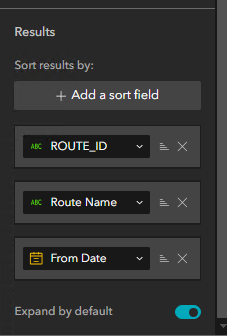
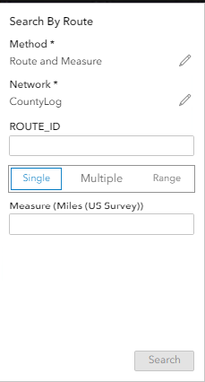
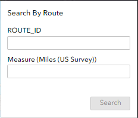
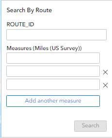
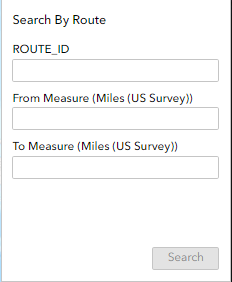

# Search by Route and Station Test Plan

|   |   |
| --- | --- |
| **Kind** | Test Plan · Experience Builder |
| **Release** | — |
| **Product** | Roads & Highways · Pipeline Referencing |
| **Source** | [ExB_Searchbyroute_station_Testplan.docx](<https://esriis.sharepoint.com/sites/LocationReferencing/Shared%20Documents/General/Test%20Plans/ExB_Searchbyroute_station_Testplan.docx>) |
| **Edited** | 2024-02-20 21:38 by Praveen Kumar |
| **Extracted** | 2026-09-04 · lane `xmlstrip` |

<!-- metadata
```yaml
title: "Search by Route and Station Test Plan"
source_file: "ExB_Searchbyroute_station_Testplan.docx"
source_url: "https://esriis.sharepoint.com/sites/LocationReferencing/Shared%20Documents/General/Test%20Plans/ExB_Searchbyroute_station_Testplan.docx"
doc_id: 423
doc_kind: "Test Plan"
surface: "Experience Builder"
doc_revision: ""
target_release: ""
pe: ""
dev: ""
author: "Praveen Kumar"
last_edited_by: "Praveen Kumar"
last_edited: "2024-02-20T21:38:00Z"
extracted: 2026-09-04
extraction_lane: xmlstrip
prompt_version: "v2.0.2"
keywords: ["search by route", "station", "experience builder", "widget testing", "layer configuration", "route identification", "measure validation"]
tools: ["Search by Route"]
products: ["Roads & Highways", "Pipeline Referencing"]
issues: []
related: [{"doc":473,"file":"search-by-route-experience-builder-widget-test-plan__doc473.md","s":7.28},{"doc":462,"file":"search-route-exb-widget-search-by-station-method-test-plan__doc462.md","s":6.082},{"doc":363,"file":"search-by-line-test-plan__doc363.md","s":4.425},{"doc":458,"file":"search-by-coordinate-method-in-route-search-widget-test-plan__doc458.md","s":3.835},{"doc":438,"file":"search-by-route__doc438.md","s":3.628}]
```
-->

## Summary

This document outlines test cases for the Search by Route and Station widget in Experience Builder. It covers configuration, style, layer setup, search functionality, and negative test scenarios to verify correct behavior and error handling. The tests ensure proper UI behavior, data actions, search methods, and measure handling across different network types and data formats.

## Related documents

<!-- related:begin -->
- [Search by Route Experience Builder Widget Test Plan](<https://esriis.sharepoint.com/sites/lrsworkspace/LRS Doc Index/Test Plans/search-by-route-experience-builder-widget-test-plan__doc473.md>) — similar text 0.75 · 2 title words · 2 filename words · same kind/surface/folder <!-- rel:473 -->
- [Search Route ExB Widget - Search by Station Method Test Plan](<https://esriis.sharepoint.com/sites/lrsworkspace/LRS Doc Index/Test Plans/search-route-exb-widget-search-by-station-method-test-plan__doc462.md>) — similar text 0.35 · 3 title words · 1 filename word · same kind/surface/folder <!-- rel:462 -->
- [Search by Line Test Plan](<https://esriis.sharepoint.com/sites/lrsworkspace/LRS Doc Index/Test Plans/search-by-line-test-plan__doc363.md>) — similar text 0.49 · 1 title word · 1 filename word · same kind/surface/folder <!-- rel:363 -->
- [Search by Coordinate Method in Route Search Widget Test Plan](<https://esriis.sharepoint.com/sites/lrsworkspace/LRS Doc Index/Test Plans/search-by-coordinate-method-in-route-search-widget-test-plan__doc458.md>) — similar text 0.13 · 2 title words · same kind/surface/folder <!-- rel:458 -->
- [Search by Route](<https://esriis.sharepoint.com/sites/lrsworkspace/LRS Doc Index/User Stories/search-by-route__doc438.md>) — similar text 0.36 · 2 title words · 1 filename word · same surface <!-- rel:438 -->
<!-- related:end -->

<!-- docs:begin -->
## Esri documentation

_No page matched:_ [Search by Route](https://www.google.com/search?q=%22Search%20by%20Route%22+site%3Adoc.esri.com)
<!-- docs:end -->

---

00Configuration
Content page:

- Verify the map dropdown lists all the maps from all the pages.
- Verify any map can be selected from the list.
- Click Load Layers and verify all the layers from the selected map are imported.
- Verify the reordering of the imported layers.
- Verify the layer is removable using ‘x’ of the respective layer.
- Changing map and loading again should clear present list of layers and import the layers from the new map.
- Verify the default selection highlight color is cyan.
- Change the highlight color and verify the set color is reflected when we select a record in the results pane.
- Change the width for the selected features and verify it is reflected when we select a record in the results pane.
- Change the label color and verify the set color is reflected when we select a record in the results pane.
- Change the label size for the selected features and verify it is reflected when we select a record in the results pane.
- Set the page size for the results pane and verify the results are displayed as per the settings.
- Set the default network and verify it is honored while launching the widget (if only one network available verify that it is chosen by default).
- Hide method and verify that the method is not visible in the widget.
- Hide network and verify that the network is not visible in the widget.
- Test Importing Nonline, line and postmile networks.
Negative:

- Click on Import all button without selecting a map and verify an error message is displayed.
- Choose a map which does not have any layers and verify an error message is displayed.
- Choose a map which does not have any LRS Network layers and verify an error message is displayed.
- Choose a map which has multiple services and verify an error message is displayed.
- Enter 0 and negative values for the width and verify that it does not accept.
- Enter negative values for the label size and verify that it does not accept.

00Action

- Test all the Data Actions
- Verify that only the selected data actions are visible in the results pane when a record is selected.
- Disable data action and verify that the actions are not shown when a record is selected from results pane.

00
Style page

- Test all the align options.
- Test all the arrange options.
- Test changing the width and height of the widget.
- Test with different rotation angles (positive and negative).
- Test all the animation options.
- Test all borders.
- Test all box shadows.
- Test the margin settings.

Negative :

- Negative values should not be accepted for width and height.
- Test that the values more than 360 deg is not accepted for rotation.

00Layer Configuration:

- Verify that the layer configuration is displayed when a Network layer is selected.
- Change the label for the layer and verify if in the widget.
- Verify ‘Route and Measure’ is default for the search methods.
- Verify that the Search methods can be enabled / disabled.
- Verify all the options for search measures are enabled by default.
- Verify that the Search measures can be enabled / disabled.
- Enable only one search measure type and verify that the UI is changed accordingly.
- Test with different identifier (RouteID/ RouteName).
- Test different result sorting fields (RouteID/ RouteName).
- Verify that the results can be sorted using multiple fields.
- Test ascending and descending sorting.
- RouteID should be default identifier for nonline network.
- RouteName should be default identifier for line network.

00Verify that the ‘Expand by default’ is enabled and the results are shown in expanded format.

- Disable the ‘Expand by default’ and verify that the results are not shown in expanded format.
- Multifield should be default identifier for multifield routeid network.
- Verify that the identifier fields can be reordered.
- Verify that the identifier fields can be selected / deselected to show in the UI.
- Verify that the field alias is used in the configuration.
- Verify that the search measures are not shown if the Route and Measure is disabled in the methods.

Search

00Verify that the Method is as per the settings in the configuration.

- Verify the values in the Network drop down is as per the layer order in the configuration.
- Verify the RouteName / RouteId or multi fields are shown as per the configuration for the respective network.
- Verify that the measure units are as per the network m unit.
- Verify that the search button is disabled until a valid RouteName or RouteID is provided.
- Search only using the RouteName / RouteID value for all the search measure types.

00Choose Single and search using the RouteName / RouteID and Measure value.

- Choose Multiple and search using the RouteName / RouteID and multiple measure values.

00Choose Range and search using the RouteName / RouteID and From and To Measure values.

- Choose Range and search only using the RouteName / RouteID and From Measure value.
- Choose Range and search only using the RouteName / RouteID and To Measure value.
- Verify that the search fields for multi filed route id network is as per the configuration.
- Provide measures in stationing format and search.

00Verify that the intellisense experience is shown for RouteName / RouteID field after 3 characters are entered.

- Switch to a version and verify that the search results are honoring the version.
- Set time and verify that the search results are honoring the time frame.
- Test in Chrome, Firefox.
- Test in varied sizes (web, tab and mobile).
- Verify that the search results show only the measure range when searched with from and to measures.
- When a record is selected from search result, verify that the selected record can be viewed in table (through actions).
- Ensure that the field alias is used in the widget.
- Perform search using some wild cards like (_,%).
- Verify that the all the required parameters are marked with *.
- If there are multiple networks, verify that the network can be changed using the pencil button.
- If there are multiple methods, verify that the method can be changed using the pencil button.
- Verify that the field alias is used in the widget.
- If the Method is configured to hide, verify it is not shown in the UI and it is using the default method set for the Network.
- If the Network is configured to hide, verify it is not shown in the UI and it is using the default Network for search.
- If the Method and Network are configured to hide, verify it is not shown in the UI and using the default method set for the Network and default network.
- Verify the results are displayed as per the page size settings.
- For single and multiple measures, verify that when a record is selected from the results:
- Zoom to that route and measure on the map.
- Highlight the route and the measure location.
- Display route and measure label.
- For Range measures, verify that when a record is selected from the results:
- Zoom to that route and measure range on the map.
- Highlight the route and the measure range.
- Display route and measure label.
- Display an arrow at the end to denote the direction.
- Verify that the results Include from and to dates along with routeid and measures.
- Test with Postmile, APR and RH data.
- Test on projected and unprojected data.
- Test with different themes.
- Test on a variety of route shapes to ensure the stations are found at the correct location.
- Verify that measures can be provided in US (0+00.00) stationing format.
- Verify that measures can be provided in Metric (0+000.00) stationing format.

Negative:

- Provide invalid route id / routename and verify the error message.
- Provide invalid from measure and verify the error message (like text, special characters).
- Provide invalid to measure and verify the error message (like text, special characters).
- For multi filed search provide invalid data type and verify the error message for each field.
Note:

- Max selection width is limited to 15.
- Labels won’t be visible if the label size is set to 0.
- Page size cannot be less than 5.

           
