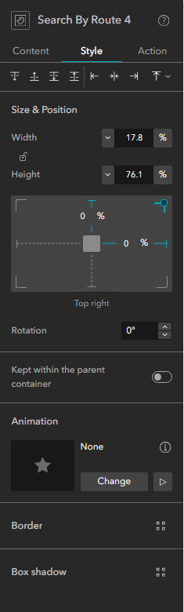
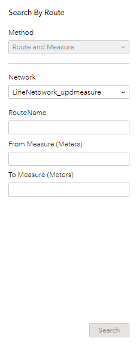

# Search by Route Experience Builder Widget Test Plan

| Field | Value |
| --- | --- |
| **Doc** | 473 · Test Plan · Experience Builder |
| **Product** | — |
| **Release** | — |
| **Issues** | — |
| **Source** | [ExB_Searchbyroute_Testplan.docx](<https://esriis.sharepoint.com/sites/LocationReferencing/Shared%20Documents/General/Test%20Plans/ExB_Searchbyroute_Testplan.docx>) |
| **People** | author Praveen Kumar · PE — · dev — |
| **Edited** | 2023-10-27 21:41 by Praveen Kumar |
| **Extracted** | 2026-09-04 · lane xmlstrip · format 3.0 · prompt v2.0.2 |
| **Keywords** | search by route · experience builder widget · network layers · layer configuration · route id · route name · measure · data actions · widget style |
| **Tools** | Search by Route |

## Summary

Test plan for the Search by Route widget in Experience Builder covering configuration, style, layer setup, and search functionality. Includes verification of map and network layer imports, data actions, style options, layer configuration, and search behavior with positive and negative test cases. Cross-browser and device size compatibility are also tested.

## Related documents

<!-- related:begin -->
- [Search by Route and Station Test Plan](<https://esriis.sharepoint.com/sites/lrsworkspace/LRS Doc Index/Test Plans/search-by-route-and-station.md>) — similar text 0.75 · 2 title words · 2 filename words · same kind/surface/folder <!-- rel:423 s=7.28 -->
- [Search Route ExB Widget - Search by Station Method Test Plan](<https://esriis.sharepoint.com/sites/lrsworkspace/LRS Doc Index/Test Plans/15947-search-route-exb-widget-search-by-station-method.md>) — similar text 0.31 · 3 title words · same kind/surface/folder <!-- rel:462 s=5.937 -->
- [Search by Line Test Plan](<https://esriis.sharepoint.com/sites/lrsworkspace/LRS Doc Index/Test Plans/search-by-line.md>) — similar text 0.34 · 1 title word · 1 filename word · same kind/surface/folder <!-- rel:363 s=4.52 -->
- [Search by Route and Measure Experience Builder widget](<https://esriis.sharepoint.com/sites/lrsworkspace/LRS Doc Index/User Stories/search-by-route-and-measure-exb-widget.md>) — similar text 0.15 · 5 title words · same surface <!-- rel:529 s=4.269 -->
- [Experience Builder: Add Single Point Event Widget](<https://esriis.sharepoint.com/sites/lrsworkspace/LRS Doc Index/Test Plans/exb-add-single-point-event-widget.md>) — similar text 0.21 · 3 title words · same kind/surface/folder <!-- rel:463 s=3.624 -->
<!-- related:end -->

<!-- docs:begin -->
## Esri documentation

[Split a centerline by measure](https://doc.esri.com/en/arcgis-pro/latest/help/production/location-referencing-pipelines/split-a-centerline-by-measure.html)

_No page matched:_ [Search by Route](https://www.google.com/search?q=%22Search%20by%20Route%22+site%3Adoc.esri.com)
<!-- docs:end -->

---

## Overview
00Configuration

### Content page:

1. Verify the map dropdown lists all the maps from all the pages.

1. Verify any map can be selected from the list.

1. Click import all and verify all the Network layers from the selected map are imported.

1. Verify the reordering of the imported layers.

1. Verify the layer is removable using ‘x’ of the respective layer.

1. Changing map and importing again should clear present list of layers and import the Network layers from the new map.

1. Verify the default selection highlight color is cyan.

1. Change the color and verify the set color is reflected when we select a record in the results pane.

1. Change the width for the selected features and verify it is reflected when we select a record in the results pane.

1. Set the page size for the results pane and verify the results are displayed as per the settings.

1. Test Importing Nonline, line and postmile networks.

## Test Cases

### TC-N01 — Click on Import All Button Without Selecting a Map and Verify an Error Message <!-- src: S6 · case 1 -->

- **Case:** Click on Import all button without selecting a map and verify an error message is displayed.

### TC-N02 — Choose a Map Which Does Not Have Any Layers and Verify an Error Message <!-- src: S6 · case 1 -->

- **Case:** Choose a map which does not have any layers and verify an error message is displayed.

### TC-N03 — Choose a Map Which Does Not Have Any LRS Network Layers and Verify an Error <!-- src: S6 · case 1 -->

- **Case:** Choose a map which does not have any LRS Network layers and verify an error message is displayed.

### TC-N04 — Enter 0 and Negative Values for the Width and Verify That It Does Not Accept. <!-- src: S6 · case 1 -->

### TC-N05 — Enter Less Than 5 for the Page Size and Ensure That the Values Are Not Accepted. <!-- src: S6 · case 1 -->

00Action

1. Test all the Data actions

1. Verify that only the selected data actions are visible in the results pane when a record is selected.

### TC-N06 — Disable Data Action and Verify That the Actions Are Not Shown When a Record <!-- src: S6 · case 1 -->

- **Case:** Disable data action and verify that the actions are not shown when a record is selected from results pane.

00
Style page

1. Test all the align options.

1. Test all the arrange options.

1. Test changing the width and height of the widget.

1. Test with different rotation angles (positive and negative).

1. Test all the animation options.

1. Test all borders.

1. Test all box shadows.

1. Test the margin settings.

### TC-N07 — Change the Label for the Layer and Verify If in the Widget. <!-- src: S6 · case 1 -->

1. Verify ‘Route and Measure’ is default for the search methods.

1. Verify that the Search methods is disabled (until other methods are supported)

1. Test with different identifier (RouteID/ RouteName).

1. Test different result sorting fields (RouteID/ RouteName).

1. Test ascending and descending sorting.

### TC-N08 — RouteID Should Be Default Identifier for Nonline Network. <!-- src: S6 · case 1 -->

### TC-N09 — RouteName Should Be Default Identifier for Line Network. <!-- src: S6 · case 1 -->

### TC-N10 — Multifield Should Be Default Identifier for Multifield Routeid Network. <!-- src: S6 · case 1 -->

Search

1.
00Verify that the Method is disabled (until other methods are supported)

1. Verify the values in the Network drop down is as per the layer order in the configuration

1. Verify the RouteName / RouteId or multi fields are shown as per the configuration for the respective network

1. Verify that the measure units are as per the network m unit.

1. Verify that the search button is disabled until a valid RouteName or RouteID is provided.

### TC-N11 — Search Only Using the RouteName / RouteID Value. <!-- src: S6 · case 1 -->

### TC-N12 — Search Only Using the RouteName / RouteID and From Measure Value. <!-- src: S6 · case 1 -->

### TC-N13 — Search Only Using the RouteName / RouteID and To Measure Value. <!-- src: S6 · case 1 -->

1. Verify that the search fields for multi filed route id network is as per the configuration.

### TC-N14 — Provide Measures in Stationing Format and Search. <!-- src: S6 · case 1 -->

1. Verify that the intellisense experience is shown for RouteName / RouteID  field after 3 characters are entered.

### TC-N15 — Switch To a Version and Verify That the Search Results Are Honoring the Version. <!-- src: S6 · case 1 -->

### TC-N16 — Set Time and Verify That the Search Results Are Honoring the Time Frame. <!-- src: S6 · case 1 -->

1. Test in Chrome, Edge, Firefox.

1. Test in different sizes (web, tab and mobile).

1. Verify that the search results show only the measure range when searched with from and to measures.

### TC-N17 — When a Record Is Selected From Search Result <!-- src: S6 · case 1 -->

- **Case:** When a record is selected from search result, verify that the selected record can be viewed in table (through actions).

1. Ensure that the field alias is used in the widget.

### TC-N18 — Provide Invalid Route Id / Routename and Verify the Error Message. <!-- src: S6 · case 1 -->

### TC-N19 — Provide Invalid From Measure and Verify the Error Message (like Text <!-- src: S6 · case 1 -->

- **Case:** Provide invalid from measure and verify the error message (like text, special characters).

### TC-N20 — Provide Invalid To Measure and Verify the Error Message (like Text <!-- src: S6 · case 1 -->

- **Case:** Provide invalid to measure and verify the error message (like text, special characters).

### TC-N21 — For Multi Filed Search Provide Invalid Data Type and Verify the Error Message <!-- src: S6 · case 1 -->

- **Case:** For multi filed search provide invalid data type and verify the error message for each field.

### TC-N22 — Integration with Add Point Event and Add Line Event Will Be Tested After the Add <!-- src: S6 · case 1 -->

- **Case:** Integration with Add point event and Add line event will be tested after the add events are implemented.

### TC-N23 — Look Out for Errors in Console of Developer Tools. <!-- src: S6 · case 1 -->

### TC-N24 — Max Selection Width Is Limited To 15. <!-- src: S6 · case 1 -->

## Other content

### Negative :

1. Negative values should not be accepted for width and height.

1. Test that the values more than 360 deg is not accepted for rotation.

### Layer Configuration:

1.
001.Verify that the layer configuration is displayed when a layer is selected.
