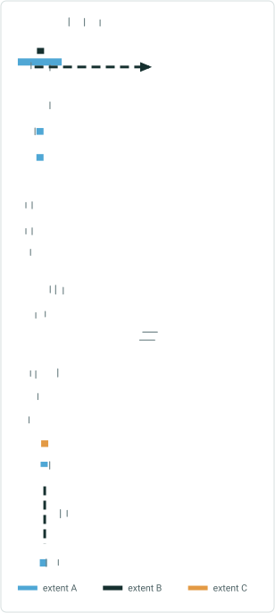
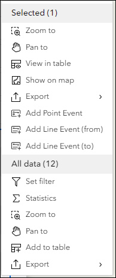

# Search by Route Results Table Test Plan

|   |   |
| --- | --- |
| **Kind** | Test Plan · Experience Builder |
| **Release** | — |
| **Source** | [ExB_SearchResults_Table_TestPlan1.pptx](<https://esriis.sharepoint.com/sites/LocationReferencing/Shared%20Documents/General/Test%20Plans/ExB_SearchResults_Table_TestPlan1.pptx>) |
| **Edited** | 2024-07-16 16:17 by Rahul Rakshit |
| **Extracted** | 2026-09-04 · lane `xmlstrip` |

<!-- metadata
```yaml
title: "Search by Route Results Table Test Plan"
source_file: "ExB_SearchResults_Table_TestPlan1.pptx"
source_url: "https://esriis.sharepoint.com/sites/LocationReferencing/Shared%20Documents/General/Test%20Plans/ExB_SearchResults_Table_TestPlan1.pptx"
doc_id: 350
doc_kind: "Test Plan"
surface: "Experience Builder"
doc_revision: ""
target_release: ""
pe: ""
dev: ""
author: "Rahul Rakshit"
last_edited_by: "Rahul Rakshit"
last_edited: "2024-07-16T16:17:54Z"
extracted: 2026-09-04
extraction_lane: xmlstrip
prompt_version: "v2.0.2"
keywords: ["search by route", "results table", "table widget", "tab management", "data actions", "experience builder"]
tools: []
products: []
issues: []
related: [{"doc":378,"file":"search-by-route-widget-results-flow-into-table__doc378.md","s":6.8},{"doc":462,"file":"search-route-exb-widget-search-by-station-method-test-plan__doc462.md","s":4.12},{"doc":859,"file":"lrs-identify-show-coordinates-in-results-experience-builder-widget-test-plan__doc859.md","s":3.713},{"doc":423,"file":"search-by-route-widget-test-plan__doc423.md","s":3.471},{"doc":473,"file":"search-by-route-widget-test-plan__doc473.md","s":3.421}]
```
-->

## Summary

Test plan for the Search by Route results table toggle option in Experience Builder. Covers acceptance and functionality testing of displaying search results in a table widget, tab management, data consistency, sorting, filtering, and data actions.

## Related documents

<!-- related:begin -->
- [Search by Route widget – results flow into table](<https://esriis.sharepoint.com/sites/lrsworkspace/LRS Doc Index/User Stories/search-by-route-widget-results-flow-into-table__doc378.md>) — similar text 0.36 · 4 title words · 2 filename words · same surface <!-- rel:378 -->
- [Search Route ExB Widget - Search by Station Method Test Plan](<https://esriis.sharepoint.com/sites/lrsworkspace/LRS Doc Index/Test Plans/search-route-exb-widget-search-by-station-method-test-plan__doc462.md>) — similar text 0.20 · 2 title words · 1 filename word · same kind/surface/folder <!-- rel:462 -->
- [LRS Identify: Show Coordinates in Results Experience Builder Widget Test Plan](<https://esriis.sharepoint.com/sites/lrsworkspace/LRS Doc Index/Test Plans/lrs-identify-show-coordinates-in-results-experience-builder-widget-test-plan__doc859.md>) — similar text 0.16 · 1 title word · same kind/surface/folder <!-- rel:859 -->
- [Search by Route Widget Test Plan](<https://esriis.sharepoint.com/sites/lrsworkspace/LRS%20Doc%20Index/Test%20Plans/search-by-route-widget-test-plan__doc423.md>) — similar text 0.16 · 2 title words · same kind/surface/folder <!-- rel:423 -->
- [Search by Route Widget Test Plan](<https://esriis.sharepoint.com/sites/lrsworkspace/LRS Doc Index/Test Plans/search-by-route-widget-test-plan__doc473.md>) — similar text 0.14 · 2 title words · same kind/surface/folder <!-- rel:473 -->
<!-- related:end -->

<!-- docs:begin -->
## Esri documentation

[Release locks through the LRS Locks table](https://doc.esri.com/en/arcgis-pro/latest/help/production/location-referencing-pipelines/lrs-locks-table.html)

_No page matched:_ [experience builder](https://www.google.com/search?q=%22experience%20builder%22+site%3Adoc.esri.com) · [search by line](https://www.google.com/search?q=%22search%20by%20line%22+site%3Adoc.esri.com)
<!-- docs:end -->

---

## Slide 1


## Slide 2



Acceptance Testing

- Show results in table toggle option is provided with off as default.
- Hover tooltip is present for the option.

Configuration
When the option is ON

- The Search by Route results show up as a table and the form does not get cleared.
- The Search by Route does not transit to the second (Search Results) pane.
- The table widget needs to be configured for the results to be shown in the table. If it’s not configured, then the results will show up in the results pane.
- If no table is already open:
  - Open the results as a new tab
- If another table is already open:
  - Open the results as a new tab as the last tab in the table widget
- The total number of rows and the number of selected rows are shown (Core issue logged to enable this).
- The name of the tab should be <Network Name>& “ “ & “line result” when no measure or a range of measure is searched
- The name of the tab should be <Network Name>& “ “ & “point result” when single or multiple results are searched.
- The results are labeled with Route ID/Name and measure
- Ability to zoom to and highlight the routes from the selected rows.
- Show the table results even if the table is in a widget controller.


## Slide 3


Functionality Testing

- Verify that the data matches between the search table results table and search results pane.
- The number of rows in the search results table with this option matches the number of search results without it.
- If a search results table already exists, then performing a new search will result in opening a new tab with the latest search results. The previous tab/s will:
  - Be emptied out if the tab name is different
  - Show the same results as the latest tab if the tab names are same
- In case the tabs are configured to be shown as a drop-down the search results are added as the last item in the drop-down list and opened immediately.
- The fields are sortable.
- Only the selected row can be shown.
- Columns can be hidden/shown.
- Data actions such as Add Line and Add Point show up only when a single row is highlighted.
- If multiple table widgets exists, then the results are shown in the first table widget.
- No table opens if the number of search results is zero.
- Open another search results tab if a previous search results tab still exists even with the same name.
- The Data Actions for the search results table are identical to those found in the search results pane (as shown in the left image).

Acceptance Testing


