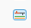
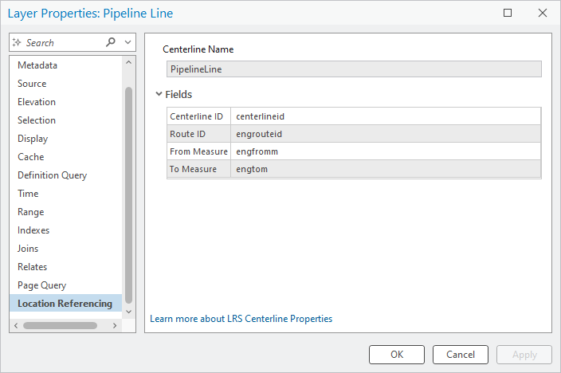

# Show ADM and UN in LRS hierarchy and properties – Test Plan

|   |   |
| --- | --- |
| **Kind** | Test Plan · Pro |
| **Release** | — |
| **Product** | Roads & Highways · Pipeline Referencing · Utility Network |
| **Issue** | [ArcGISPro/ps-location-referencing#6383](https://devtopia.esri.com/ArcGISPro/ps-location-referencing/issues/6383) |
| **Source** | [ShowUN_ADM_Hierarchy_Properties_testplan.pptx](<https://esriis.sharepoint.com/sites/LocationReferencing/Shared%20Documents/General/Test%20Plans/ShowUN_ADM_Hierarchy_Properties_testplan.pptx>) |
| **Edited** | 2025-06-03 18:06 by Claire Wang |
| **Extracted** | 2026-09-04 · lane `xmlstrip` |

<!-- metadata
```yaml
title: "Show ADM and UN in LRS hierarchy and properties – Test Plan"
source_file: "ShowUN_ADM_Hierarchy_Properties_testplan.pptx"
source_url: "https://esriis.sharepoint.com/sites/LocationReferencing/Shared%20Documents/General/Test%20Plans/ShowUN_ADM_Hierarchy_Properties_testplan.pptx"
doc_id: 159
doc_kind: "Test Plan"
surface: "Pro"
doc_revision: ""
target_release: ""
pe: ""
dev: "Sharon"
author: "Lakshmi Ananthanarayanan"
last_edited_by: "Claire Wang"
last_edited: "2025-06-03T18:06:53Z"
extracted: 2026-09-04
extraction_lane: xmlstrip
prompt_version: "v2.0.2"
keywords: ["addressing", "utility network", "hierarchy", "properties", "address range", "site address", "centerline", "event"]
tools: []
products: ["Roads & Highways", "Pipeline Referencing", "Utility Network"]
issues: ["ArcGISPro/ps-location-referencing#6383"]
related: [{"doc":190,"file":"lrs-addressing-and-utility-network-properties-user-story__doc190.md","s":5.484},{"doc":424,"file":"configure-addressing-feature-classes-gp-tool-test-plan__doc424.md","s":3.08},{"doc":843,"file":"lrs-intersection-properties-user-story__doc843.md","s":2.824},{"doc":65,"file":"view-the-lrs-hierarchy__doc65.md","s":2.801},{"doc":699,"file":"route-dominance-properties-user-story__doc699.md","s":2.767}]
```
-->

## Summary

Test plan for verifying the display and properties of Addressing (ADM) and Utility Network (UN) sections within the LRS hierarchy and properties tab. Includes hierarchy verification, properties verification, testing with various geodatabases and data types, accessibility and internationalization compliance, and documentation updates.

## Related documents

<!-- related:begin -->
- [LRS Addressing and Utility Network Properties User Story](<https://esriis.sharepoint.com/sites/lrsworkspace/LRS Doc Index/User Stories/lrs-addressing-and-utility-network-properties-user-story__doc190.md>) — similar text 0.55 · 1 title word · 1 filename word · same surface <!-- rel:190 -->
- [Configure Addressing Feature Classes GP Tool Test Plan](<https://esriis.sharepoint.com/sites/lrsworkspace/LRS Doc Index/Test Plans/configure-addressing-feature-classes-gp-tool-test-plan__doc424.md>) — similar text 0.26 · same kind/surface/folder <!-- rel:424 -->
- [LRS Intersection Properties User Story](<https://esriis.sharepoint.com/sites/lrsworkspace/LRS Doc Index/User Stories/lrs-intersection-properties-user-story__doc843.md>) — similar text 0.27 · 1 title word · 1 filename word · same surface <!-- rel:843 -->
- [View the LRS hierarchy](<https://esriis.sharepoint.com/sites/lrsworkspace/LRS Doc Index/Other/view-the-lrs-hierarchy__doc65.md>) — similar text 0.21 · 1 title word · 1 filename word · same surface <!-- rel:65 -->
- [Route Dominance Properties User Story](<https://esriis.sharepoint.com/sites/lrsworkspace/LRS Doc Index/User Stories/route-dominance-properties-user-story__doc699.md>) — similar text 0.25 · 1 title word · 1 filename word · same surface <!-- rel:699 -->
<!-- related:end -->

<!-- docs:begin -->
## Esri documentation

[View site address point properties](https://doc.esri.com/en/arcgis-pro/latest/help/production/roads-highways/view-site-address-point-properties.html) · [View utility network feature class properties](https://doc.esri.com/en/arcgis-pro/latest/help/production/location-referencing-pipelines/view-utility-network-feature-class-properties.html) · [View the LRS hierarchy](https://doc.esri.com/en/arcgis-pro/latest/help/production/roads-highways/view-the-lrs-hierarchy.html)

_No page matched:_ [adm](https://www.google.com/search?q=%22adm%22+site%3Adoc.esri.com)
<!-- docs:end -->

---

## Slide 1 — Show ADM and UN in LRS hierarchy and properties – Test Plan

https://devtopia.esri.com/ArcGISPro/ps-location-referencing/issues/6383

PE:
Dev: Sharon

## Slide 2

Hierarchy Verification
ADM

- Create a section called “Addressing” in LRS Hierarchy for ADM, in LRS schema, below Redline and make it the same level as schema elements – this needs a new icon.
  - Do not show this new section if ADM is not configured
- In the section, show Site Address (this needs a new icon) and Address Range layers
  - The Address Range layer is either a centerline or an event. Use corresponding icon
  - This Address Range layer continues to show in both the new ADM section, and its own section (schema for centerline; event under network)
- Allow the user to right click and open properties like with other LRS schema items
- Allow the user to add each layer to the map like with other LRS schema items
UN

- No need to create a new section. If UN is configured, show text “Utility Network” next to the LRS Schema in the LRS Hierarchy
General
Verify the Upgrade near LRS (if LRS is older than current version) is still available with this implementation
508 compliant – accessibility, Dark Mode, Tabbing
Should be I18n ready
LRS Schema
	Calibration Point
	Centerline
	Centerline Sequence
	Redline
	Addressing
		Address Range
		Site Address
or

     

## Slide 3

Properties Verification
ADM

- In the LR properties tab of the centerline/event. Add a section called Addressing
  - Do not show this new section if ADM is not configured
- Make the section an accordion that can expand/contract
- Show the following fields within the section (just the field name, not db or user)
  - Left From Address
  - Left To Address
  - Right From Address
  - Right To Address
  - Road Name Field
- If the value or field name is very long, size it according to the window and provide hover content
- Support hovering over any long field names to see the full value
UN

- The UN properties in the Location Referencing section of the Centerline layer/fc should be moved out to a separate section called “Utility Network”
  - Fields: Centerline ID only. Utility Network: has the other 3 fields from the original Fields section
General
508 compliant – accessibility, Dark Mode
Should be I18n ready

Address Range Road Name

[figure: Left_first_Address_num · Left_last_Address_num · Right_first_Address_num · Right_last_Address_num · Full_Road_Name · Utility Network]

  

## Slide 4

Test

- Test with fgdb, egdb (traditional and branch versioned) and fs
  - Layers and feature classes
- Test hierarchy
  - Icons
  - Add layer(s) into map in hierarchy
- Test properties
  - ADM/UN fields are in a separate section now
  - Long fields and hovering over long fields
  - Select and copy in properties
- Test with an ADM, APRUN, the UPDM data, and PODS if possible (public for downloading)
- For ADM, test when the address range layer is a centerline or event
- Switch maps – hierarchy won’t automatically refresh, but make sure after 1.going to another map and 2. relaunch hierarchy, it shows the correct map
- Click the “learn more about LRS centerline/event properties” in LR properties for UN centerline and ADM address range layer, and verify doc is correct
- Do a sanity check on metadata and verify it works/is not breaking anything
- Verify the Upgrade near LRS (if LRS is older than current version) is still available with this implementation
- Dark and light theme
- Test a11y and i18n

## Slide 5

Automation
n/a

Documentation
Update the View Centerline Properties topic and the UN/Addressing fields that can be present in the Fields section
	UN already exists but needs update
	ADM doesn’t exist yet
Also add this to the View Event Properties topic since the Address Range can be stored there (RH only)

## Slide 6

  - Test cases (mix and match in fgdb, egdb (traditional and branch versioned) and fs)
  - Test hierarchy for ADM data when address range layer is centerline. Add centerline and site addresses to map from ADM section
  - Test hierarchy for ADM data when address range layer is event. Add site addresses to map from ADM section and add address range event to map from event section
  - Test properties for ADM data when address range layer is centerline with long fields. Copy and paste field values
  - Test properties for ADM data when address range layer is event
  - View centerline/event properties from address range layer’s properties
  - Test hierarchy and properties for ADM data when it hasn’t been configured with LRS yet – there should not show any ADM in hierarchy, and no LR tab in properties for any ADM layer
  - Test hierarchy for UNAPR data. Add centerline to map from LRS schema section
  - Test properties for UNAPR data with long fields. Copy and paste field values
  - View centerline properties doc from properties
  - Sanity test a normal RH/APR data. Make sure there is no mention of ADM/UN in hierarchy or LR properties.
  - Test switching between an ADM, UN, and regular RH maps and make sure hierarchy reflects current map when it’s reopened
