# SLD Support for Centerline in UN and ADM LRS Datasets Test Plan

|   |   |
| --- | --- |
| **Kind** | Test Plan · Experience Builder |
| **Release** | — |
| **Product** | Roads & Highways · Pipeline Referencing · Utility Network |
| **Issue** | [Beijing-R-D-Center/ExperienceBuilder-Web-Extensions#26161](https://devtopia.esri.com/Beijing-R-D-Center/ExperienceBuilder-Web-Extensions/issues/26161) |
| **Source** | [26161-CenterlineinSLDforADMUNAPR_TestPlan1.pptx](<https://esriis.sharepoint.com/sites/LocationReferencing/Shared%20Documents/General/Test%20Plans/26161-CenterlineinSLDforADMUNAPR_TestPlan1.pptx>) |
| **Edited** | 2026-05-08 18:54 by Mac Christmas |
| **Extracted** | 2026-09-04 · lane `xmlstrip` |

<!-- metadata
```yaml
title: "SLD Support for Centerline in UN and ADM LRS Datasets Test Plan"
source_file: "26161-CenterlineinSLDforADMUNAPR_TestPlan1.pptx"
source_url: "https://esriis.sharepoint.com/sites/LocationReferencing/Shared%20Documents/General/Test%20Plans/26161-CenterlineinSLDforADMUNAPR_TestPlan1.pptx"
doc_id: 38
doc_kind: "Test Plan"
surface: "Experience Builder"
doc_revision: ""
target_release: ""
pe: ""
dev: ""
author: "Mac Christmas"
last_edited_by: "Mac Christmas"
last_edited: "2026-05-08T18:54:26Z"
extracted: 2026-09-04
extraction_lane: xmlstrip
prompt_version: "v2.0.2"
keywords: ["centerline", "admrh", "unapr", "dynamic segmentation", "straight line diagram", "route", "pipeline line", "testing"]
tools: ["Dynamic Segmentation", "Straight Line Diagram"]
products: ["Roads & Highways", "Pipeline Referencing", "Utility Network"]
issues: ["Beijing-R-D-Center/ExperienceBuilder-Web-Extensions#26161"]
related: [{"doc":2,"file":"iteration-planning-and-issue-tracking-for-location-referencing-3-8-12-2__doc2.md","s":1001.23},{"doc":28,"file":"sld-devices-and-junctions-test-plan__doc28.md","s":4.493},{"doc":115,"file":"regression-testing-task-list-for-lrs-releases__doc115.md","s":3.183},{"doc":103,"file":"merge-centerlines-test-plan__doc103.md","s":2.876},{"doc":79,"file":"overlay-events-and-queryattributeset-support-for-un-pipeline-devices-and__doc79.md","s":2.649}]
```
-->

## Summary

Test plan for adding support to the Dynamic Segmentation's Straight Line Diagram (SLD) component to include configured ADMRH and UNAPR centerlines. Covers configuration options, UI behavior, and positive and negative test cases for various route complexities and scenarios including gapped and flipped centerlines.

## Related documents

<!-- related:begin -->
- [Iteration Planning and Issue Tracking for Location Referencing 3.8/12.2](<https://esriis.sharepoint.com/sites/lrsworkspace/LRS Doc Index/Schedules/iteration-planning-and-issue-tracking-for-location-referencing-3-8-12-2__doc2.md>) — shared issue Beijing-R-D-Center/ExperienceBuilder-Web-Extensions#26161 · similar text 0.03 <!-- rel:2 -->
- [SLD Devices and Junctions Test Plan](<https://esriis.sharepoint.com/sites/lrsworkspace/LRS Doc Index/Test Plans/sld-devices-and-junctions-test-plan__doc28.md>) — similar text 0.16 · 1 title word · same kind/surface/folder <!-- rel:28 -->
- [Regression Testing Task List V1.docx](<https://esriis.sharepoint.com/sites/lrsworkspace/LRS Doc Index/Test Plans/regression-testing-task-list-for-lrs-releases__doc115.md>) — similar text 0.10 · same kind <!-- rel:115 -->
- [Merge Centerlines Test Plan](<https://esriis.sharepoint.com/sites/lrsworkspace/LRS Doc Index/Test Plans/merge-centerlines-test-plan__doc103.md>) — similar text 0.14 · same kind/folder <!-- rel:103 -->
- [Overlay Events and queryAttributeSet Support for UN Pipeline Devices and Junctions](<https://esriis.sharepoint.com/sites/lrsworkspace/LRS Doc Index/Test Plans/overlay-events-and-queryattributeset-support-for-un-pipeline-devices-and__doc79.md>) — similar text 0.17 · 1 title word · same kind/folder <!-- rel:79 -->
<!-- related:end -->

<!-- docs:begin -->
## Esri documentation

[Apply dynamic segmentation](https://doc.esri.com/en/arcgis-pro/latest/help/production/roads-highways/apply-dynamic-segmentation.html)

_No page matched:_ [Straight Line Diagram](https://www.google.com/search?q=%22Straight%20Line%20Diagram%22+site%3Adoc.esri.com)
<!-- docs:end -->

---

## Slide 1

SLD: Support centerline in UN and ADM

| Positive Tests: Configuration |
| --- |
| New configuration option appears when input LRS dataset is ADMRH or UNAPR New configuration option does not appear when input LRS dataset is not ADMRH or UNAPR New configuration option is unchecked by default Included centerline layer appears in the list of layers Included centerline layer’s Display field can be changed |

| Notes |
| --- |
| Add functionality to the Dynamic Segmentation’s SLD component to allow configured ADMRH centerlines and UNAPR centerlines (Pipeline Line) to be included in the SLD Included centerline layer will not be included in the Table view Included centerline layer will be uneditable but attributes will appear in non-editable section of editing pop-up Included centerline layer will display as the first line layer Included centerline layer will inherit symbology/labelling properties from the layer (same way as other input line events) Add new configuration option to allow users to select whether the configured centerline layer will be included in the SLD output Included centerline layer’s feature direction will be preserved Test with only ADMRH and UNAPR data A11y and 508 (Run Allyhawk for Web tests against widget to ensure a11y issues are not introduced) |

Devtopia Issue

| Positive Tests: UI |
| --- |
| Included centerline layer’s row can be minimized Included centerline layer’s row can be restored once minimized Included centerline layer cannot be edited in SLD pop-up Included centerline layer can show statistics (when enabled) Included centerline layer in ruler drill down Included centerline layer’s fields are in non-editable section in editing pop-up |

| Positive Tests |
| --- |
| Simple ADMRH route Simple UNAPR route Complex ADMRH route Complex UNAPR route Vertical ADMRH route Vertical UNAPR route |

| Negative Tests |
| --- |
| Input Attribute Set does not have any valid events for the input ADMRH LRS Network Input Attribute Set does not have any valid events for the input UNAPR LRS Network |

| Positive Tests (Continued) |
| --- |
| Gapped ADMRH route Gapped UNAPR route ADMRH route with flipped centerlines UNAPR route with flipped centerlines ADMRH route made of hundreds of small centerlines UNAPR route made of hundreds of small centerlines |

## Case 1 <!-- slide 2 -->

### Simple ADMRH Route

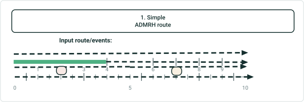

| RouteID: | 0 | 1 | 2 | 3 | 4 | 5 | 6 | 7 | 8 | 9 | 10 |
| --- | --- | --- | --- | --- | --- | --- | --- | --- | --- | --- | --- |
| Road Centerlines | NEW ALBANY |  |  |  |  | COLUMBUS |  |  |  |  |  |
| Signs |  |  | STOP |  |  |  |  | YIELD |  |  |  |
| Speed | 45 MPH |  |  |  | 50 MPH |  |  |  |  |  |  |
| Functional Class | MINOR |  |  |  |  |  |  |  |  |  |  |

| RouteID | From Date | To Date |
| --- | --- | --- |
| 001 | 1/1/2000 | <Null> |

| Input Event Layer | RouteID | From Date | To Date | From Measure | To Measure | Attribute |
| --- | --- | --- | --- | --- | --- | --- |
| Road Centerlines | N/A | N/A | N/A | N/A | N/A | NEW ALBANY |
| Road Centerlines | N/A | N/A | N/A | N/A | N/A | COLUMBUS |
| Signs | 001 | 1/1/2000 | <NULL> | 2 | N/A | STOP |
| Signs | 001 | 1/1/2000 | <NULL> | 7 | N/A | YIELD |
| Speed | 001 | 1/1/2000 | <NULL> | 0 | 4 | 45 MPH |
| Speed | 001 | 1/1/2000 | <NULL> | 4 | 10 | 50 MPH |
| Functional Class | 001 | 1/1/2000 | <NULL> | 0 | 10 | MINOR |

## Case 2 <!-- slide 3 -->

### Simple UNAPR Route

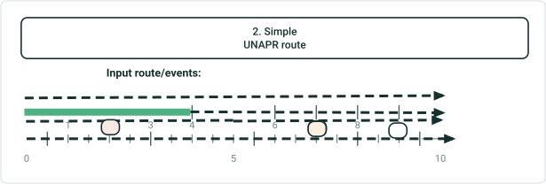

| RouteName: | 0 | 1 | 2 | 3 | 4 | 5 | 6 | 7 | 8 | 9 | 10 |
| --- | --- | --- | --- | --- | --- | --- | --- | --- | --- | --- | --- |
| Pipeline Line | TRANSMISSION |  |  |  |  | DISTRIBUTION |  |  |  |  |  |
| Anomaly |  |  | DENT |  |  |  |  |  |  |  |  |
| Pipeline Device |  |  |  |  |  |  |  | METER |  |  |  |
| Pipeline Junction |  |  |  |  |  |  |  |  |  | ELBOW |  |
| Operating Pressure | 350 PSI |  |  |  | 400 PSI |  |  |  |  |  |  |
| DOT Class | CLASS 1 |  |  |  |  |  |  |  |  |  |  |

| Input Event Layer | Route Name | From Date | To Date | From Measure | To Measure | Attribute |
| --- | --- | --- | --- | --- | --- | --- |
| Pipeline Line | N/A | N/A | N/A | N/A | N/A | TRANSMISSION |
| Pipeline Line | N/A | N/A | N/A | N/A | N/A | DISTRIBUTION |
| Anomaly | 001 | 1/1/2000 | <NULL> | 2 | N/A | DENT |
| Pipeline Device | 001 | N/A | N/A | 7 | N/A | METER |
| Pipeline Junction | 001 | N/A | N/A | 9 | N/A | ELBOW |
| Operating Pressure | 001 | 1/1/2000 | <NULL> | 0 | 4 | 350 PSI |
| Operating Pressure | 001 | 1/1/2000 | <NULL> | 4 | 10 | 400 PSI |
| DOT Class | 001 | 1/1/2000 | <NULL> | 0 | 10 | CLASS 1 |

| Route Name | From Date | To Date |
| --- | --- | --- |
| Route001 | 1/1/2000 | <Null> |

## Case 3 <!-- slide 4 -->

### Complex ADMRH Route

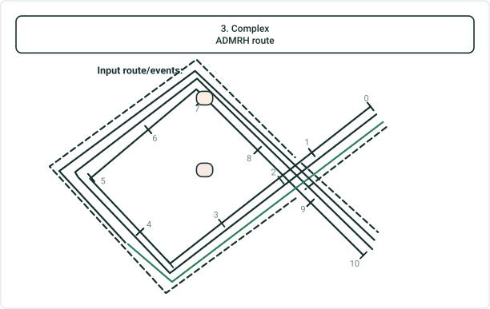

| RouteID | From Date | To Date |
| --- | --- | --- |
| 001 | 1/1/2000 | <Null> |

| Input Event Layer | RouteID | From Date | To Date | From Measure | To Measure | Attribute |
| --- | --- | --- | --- | --- | --- | --- |
| Road Centerlines | N/A | N/A | N/A | N/A | N/A | NEW ALBANY |
| Road Centerlines | N/A | N/A | N/A | N/A | N/A | NEW ALBANY |
| Road Centerlines | N/A | N/A | N/A | N/A | N/A | COLUMBUS |
| Signs | 001 | 1/1/2000 | <NULL> | 2 | N/A | STOP |
| Signs | 001 | 1/1/2000 | <NULL> | 7 | N/A | YIELD |
| Speed | 001 | 1/1/2000 | <NULL> | 0 | 4 | 45 MPH |
| Speed | 001 | 1/1/2000 | <NULL> | 4 | 10 | 50 MPH |
| Functional Class | 001 | 1/1/2000 | <NULL> | 0 | 10 | MINOR |

| RouteID: | 0 | 1 | 2 | 3 | 4 | 5 | 6 | 7 | 8 | 9 | 10 |
| --- | --- | --- | --- | --- | --- | --- | --- | --- | --- | --- | --- |
| Road Centerlines | NEW ALBANY |  | NEW ALBANY |  |  | COLUMBUS |  |  |  |  |  |
| Signs |  |  | STOP |  |  |  |  | YIELD |  |  |  |
| Speed | 45 MPH |  |  |  | 50 MPH |  |  |  |  |  |  |
| Functional Class | MINOR |  |  |  |  |  |  |  |  |  |  |

## Case 4 <!-- slide 5 -->

### Complex UNAPR Route

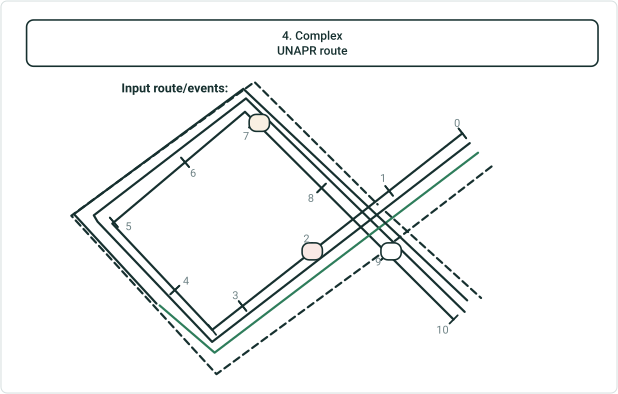

| RouteID | From Date | To Date |
| --- | --- | --- |
| 001 | 1/1/2000 | <Null> |

| RouteName: | 0 | 1 | 2 | 3 | 4 | 5 | 6 | 7 | 8 | 9 | 10 |
| --- | --- | --- | --- | --- | --- | --- | --- | --- | --- | --- | --- |
| Pipeline Line | TRANSMISSION |  | TRANSMISSION |  |  | DISTRIBUTION |  |  |  |  |  |
| Anomaly |  |  | DENT |  |  |  |  |  |  |  |  |
| Pipeline Device |  |  |  |  |  |  |  | METER |  |  |  |
| Pipeline Junction |  |  |  |  |  |  |  |  |  | ELBOW |  |
| Operating Pressure | 350 PSI |  |  |  | 400 PSI |  |  |  |  |  |  |
| DOT Class | CLASS 1 |  |  |  |  |  |  |  |  |  |  |

| Input Event Layer | Route Name | From Date | To Date | From Measure | To Measure | Attribute |
| --- | --- | --- | --- | --- | --- | --- |
| Pipeline Line | N/A | N/A | N/A | N/A | N/A | TRANSMISSION |
| Pipeline Line | N/A | N/A | N/A | N/A | N/A | TRANSMISSION |
| Pipeline Line | N/A | N/A | N/A | N/A | N/A | DISTRIBUTION |
| Anomaly | 001 | 1/1/2000 | <NULL> | 2 | N/A | DENT |
| Pipeline Device | 001 | N/A | N/A | 7 | N/A | METER |
| Pipeline Junction | 001 | N/A | N/A | 9 | N/A | ELBOW |
| Operating Pressure | 001 | 1/1/2000 | <NULL> | 0 | 4 | 350 PSI |
| Operating Pressure | 001 | 1/1/2000 | <NULL> | 4 | 10 | 400 PSI |
| DOT Class | 001 | 1/1/2000 | <NULL> | 0 | 10 | CLASS 1 |

## Case 5 <!-- slide 6 -->

### Vertical ADMRH Route

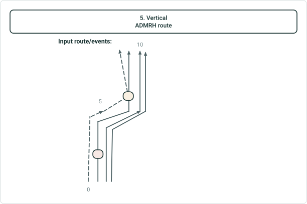

| RouteID: | 0 | 1 | 2 | 3 | 4 | 5 | 6 | 7 | 8 | 9 | 10 |
| --- | --- | --- | --- | --- | --- | --- | --- | --- | --- | --- | --- |
| Road Centerlines | NEW ALBANY |  |  |  |  | COLUMBUS |  |  |  |  |  |
| Signs |  |  | STOP |  |  |  |  | YIELD |  |  |  |
| Speed | 45 MPH |  |  |  |  |  | 50 MPH |  |  |  |  |
| Functional Class | MINOR |  |  |  |  |  |  |  |  |  |  |

| RouteID | From Date | To Date |
| --- | --- | --- |
| 001 | 1/1/2000 | <Null> |

| Input Event Layer | RouteID | From Date | To Date | From Measure | To Measure | Attribute |
| --- | --- | --- | --- | --- | --- | --- |
| Road Centerlines | N/A | N/A | N/A | N/A | N/A | NEW ALBANY |
| Road Centerlines | N/A | N/A | N/A | N/A | N/A | COLUMBUS |
| Signs | 001 | 1/1/2000 | <NULL> | 2 | N/A | STOP |
| Signs | 001 | 1/1/2000 | <NULL> | 7 | N/A | YIELD |
| Speed | 001 | 1/1/2000 | <NULL> | 0 | 6 | 45 MPH |
| Speed | 001 | 1/1/2000 | <NULL> | 6 | 10 | 50 MPH |
| Functional Class | 001 | 1/1/2000 | <NULL> | 0 | 10 | MINOR |

## Case 6 <!-- slide 7 -->

### Vertical UNAPR Route

| RouteID | From Date | To Date |
| --- | --- | --- |
| 001 | 1/1/2000 | <Null> |

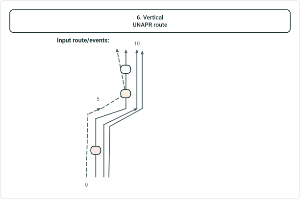

| RouteName: | 0 | 1 | 2 | 3 | 4 | 5 | 6 | 7 | 8 | 9 | 10 |
| --- | --- | --- | --- | --- | --- | --- | --- | --- | --- | --- | --- |
| Pipeline Line | TRANSMISSION |  |  |  |  | DISTRIBUTION |  |  |  |  |  |
| Anomaly |  |  | DENT |  |  |  |  |  |  |  |  |
| Pipeline Device |  |  |  |  |  |  |  | METER |  |  |  |
| Pipeline Junction |  |  |  |  |  |  |  |  |  | ELBOW |  |
| Operating Pressure | 350 PSI |  |  |  | 400 PSI |  |  |  |  |  |  |
| DOT Class | CLASS 1 |  |  |  |  |  |  |  |  |  |  |

| Input Event Layer | Route Name | From Date | To Date | From Measure | To Measure | Attribute |
| --- | --- | --- | --- | --- | --- | --- |
| Pipeline Line | N/A | N/A | N/A | N/A | N/A | TRANSMISSION |
| Pipeline Line | N/A | N/A | N/A | N/A | N/A | DISTRIBUTION |
| Anomaly | 001 | 1/1/2000 | <NULL> | 2 | N/A | DENT |
| Pipeline Device | 001 | N/A | N/A | 7 | N/A | METER |
| Pipeline Junction | 001 | N/A | N/A | 9 | N/A | ELBOW |
| Operating Pressure | 001 | 1/1/2000 | <NULL> | 0 | 4 | 350 PSI |
| Operating Pressure | 001 | 1/1/2000 | <NULL> | 4 | 10 | 400 PSI |
| DOT Class | 001 | 1/1/2000 | <NULL> | 0 | 10 | CLASS 1 |

## Case 7 <!-- slide 8 -->

### Gapped ADMRH Route

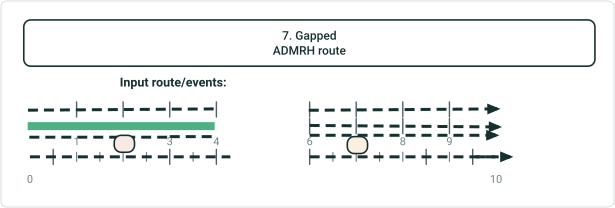

| RouteID: | 0 | 1 | 2 | 3 | 4 | 5 | 6 | 7 | 8 | 9 | 10 |
| --- | --- | --- | --- | --- | --- | --- | --- | --- | --- | --- | --- |
| Road Centerlines | NEW ALBANY |  |  | COLUMBUS |  |  | COLUMBUS |  |  |  |  |
| Signs |  |  | STOP |  |  |  |  | YIELD |  |  |  |
| Speed | 45 MPH |  |  |  |  |  | 50 MPH |  |  |  |  |
| Functional Class | MINOR |  |  |  |  |  | MINOR |  |  |  |  |

| RouteID | From Date | To Date |
| --- | --- | --- |
| 001 | 1/1/2000 | <Null> |

| Input Event Layer | RouteID | From Date | To Date | From Measure | To Measure | Attribute |
| --- | --- | --- | --- | --- | --- | --- |
| Road Centerlines | N/A | N/A | N/A | N/A | N/A | NEW ALBANY |
| Road Centerlines | N/A | N/A | N/A | N/A | N/A | COLUMBUS |
| Road Centerlines | N/A | N/A | N/A | N/A | N/A | COLUMBUS |
| Signs | 001 | 1/1/2000 | <NULL> | 2 | N/A | STOP |
| Signs | 001 | 1/1/2000 | <NULL> | 7 | N/A | YIELD |
| Speed | 001 | 1/1/2000 | <NULL> | 0 | 4 | 45 MPH |
| Speed | 001 | 1/1/2000 | <NULL> | 4 | 10 | 50 MPH |
| Functional Class | 001 | 1/1/2000 | <NULL> | 0 | 4 | MINOR |
| Functional Class | 001 | 1/1/2000 | <NULL> | 6 | 10 | MAJOR |

## Case 8 <!-- slide 9 -->

### Gapped UNAPR Route

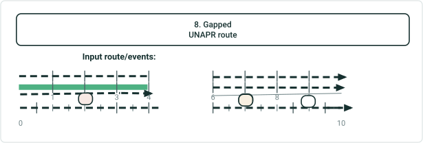

| RouteName: | 0 | 1 | 2 | 3 | 4 | 5 | 6 | 7 | 8 | 9 | 10 |
| --- | --- | --- | --- | --- | --- | --- | --- | --- | --- | --- | --- |
| Pipeline Line | TRANSMISSION |  |  |  |  |  | DISTRIBUTION |  |  |  |  |
| Anomaly |  |  | DENT |  |  |  |  |  |  |  |  |
| Pipeline Device |  |  |  |  |  |  |  | METER |  |  |  |
| Pipeline Junction |  |  |  |  |  |  |  |  |  | ELBOW |  |
| Operating Pressure | 350 PSI |  |  |  |  |  | 400 PSI |  |  |  |  |
| DOT Class | CLASS 1 |  |  |  |  |  | CLASS 1 |  |  |  |  |

| Input Event Layer | Route Name | From Date | To Date | From Measure | To Measure | Attribute |
| --- | --- | --- | --- | --- | --- | --- |
| Pipeline Line | N/A | N/A | N/A | N/A | N/A | TRANSMISSION |
| Pipeline Line | N/A | N/A | N/A | N/A | N/A | DISTRIBUTION |
| Anomaly | 001 | 1/1/2000 | <NULL> | 2 | N/A | DENT |
| Pipeline Device | 001 | N/A | N/A | 7 | N/A | METER |
| Pipeline Junction | 001 | N/A | N/A | 9 | N/A | ELBOW |
| Operating Pressure | 001 | 1/1/2000 | <NULL> | 0 | 4 | 350 PSI |
| Operating Pressure | 001 | 1/1/2000 | <NULL> | 4 | 10 | 400 PSI |
| DOT Class | 001 | 1/1/2000 | <NULL> | 0 | 4 | CLASS 1 |
| DOT Class | 001 | 1/1/2000 | <NULL> | 6 | 10 | Class1 |

| Route Name | From Date | To Date |
| --- | --- | --- |
| Route001 | 1/1/2000 | <Null> |

## Case 9 <!-- slide 10 -->

### ADMRH Route with Flipped Centerlines

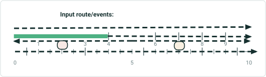

| RouteID: | 0 | 1 | 2 | 3 | 4 | 5 | 6 | 7 | 8 | 9 | 10 |
| --- | --- | --- | --- | --- | --- | --- | --- | --- | --- | --- | --- |
| Road Centerlines | NEW ALBANY |  |  |  |  | COLUMBUS |  |  |  |  |  |
| Signs |  |  | STOP |  |  |  |  | YIELD |  |  |  |
| Speed | 45 MPH |  |  |  | 50 MPH |  |  |  |  |  |  |
| Functional Class | MINOR |  |  |  |  |  |  |  |  |  |  |

| RouteID | From Date | To Date |
| --- | --- | --- |
| 001 | 1/1/2000 | <Null> |

| Input Event Layer | RouteID | From Date | To Date | From Measure | To Measure | Attribute |
| --- | --- | --- | --- | --- | --- | --- |
| Road Centerlines | N/A | N/A | N/A | N/A | N/A | NEW ALBANY |
| Road Centerlines | N/A | N/A | N/A | N/A | N/A | COLUMBUS |
| Signs | 001 | 1/1/2000 | <NULL> | 2 | N/A | STOP |
| Signs | 001 | 1/1/2000 | <NULL> | 7 | N/A | YIELD |
| Speed | 001 | 1/1/2000 | <NULL> | 0 | 4 | 45 MPH |
| Speed | 001 | 1/1/2000 | <NULL> | 4 | 10 | 50 MPH |
| Functional Class | 001 | 1/1/2000 | <NULL> | 0 | 10 | MINOR |

## Case 10 <!-- slide 11 -->

### UNAPR Route with Flipped Centerlines

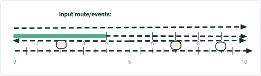

| RouteName: | 0 | 1 | 2 | 3 | 4 | 5 | 6 | 7 | 8 | 9 | 10 |
| --- | --- | --- | --- | --- | --- | --- | --- | --- | --- | --- | --- |
| Pipeline Line | TRANSMISSION |  |  |  |  | DISTRIBUTION |  |  |  |  |  |
| Anomaly |  |  | DENT |  |  |  |  |  |  |  |  |
| Pipeline Device |  |  |  |  |  |  |  | METER |  |  |  |
| Pipeline Junction |  |  |  |  |  |  |  |  |  | ELBOW |  |
| Operating Pressure | 350 PSI |  |  |  | 400 PSI |  |  |  |  |  |  |
| DOT Class | CLASS 1 |  |  |  |  |  |  |  |  |  |  |

| Input Event Layer | Route Name | From Date | To Date | From Measure | To Measure | Attribute |
| --- | --- | --- | --- | --- | --- | --- |
| Pipeline Line | N/A | N/A | N/A | N/A | N/A | TRANSMISSION |
| Pipeline Line | N/A | N/A | N/A | N/A | N/A | DISTRIBUTION |
| Anomaly | 001 | 1/1/2000 | <NULL> | 2 | N/A | DENT |
| Pipeline Device | 001 | N/A | N/A | 7 | N/A | METER |
| Pipeline Junction | 001 | N/A | N/A | 9 | N/A | ELBOW |
| Operating Pressure | 001 | 1/1/2000 | <NULL> | 0 | 4 | 350 PSI |
| Operating Pressure | 001 | 1/1/2000 | <NULL> | 4 | 10 | 400 PSI |
| DOT Class | 001 | 1/1/2000 | <NULL> | 0 | 10 | CLASS 1 |

| Route Name | From Date | To Date |
| --- | --- | --- |
| Route001 | 1/1/2000 | <Null> |

## Case 11 <!-- slide 12 -->

### ADMRH Route Made of Hundreds of Small Centerlines

| RouteID: | 0 | 1 | 2 | 3 | 4 | 5 | 6 | 7 | 8 | 9 | 10… |
| --- | --- | --- | --- | --- | --- | --- | --- | --- | --- | --- | --- |
| Road Centerlines | NEW ALBANY | COLUMBUS | BRICE | DARBYDALE | GROVE CITY | HILLIARD | BEXLEY | RIVERLEA | WHITEHALL | WESTERVILLE | DUBLIN |
| Signs |  |  | STOP |  |  |  |  | YIELD |  |  |  |
| Speed | 45 MPH |  |  |  | 50 MPH |  |  |  |  |  |  |
| Functional Class | MINOR |  |  |  |  |  |  |  |  |  |  |

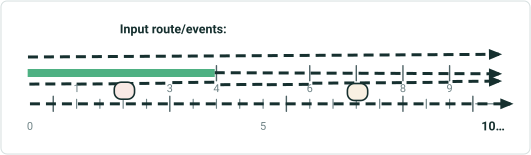

| RouteID | From Date | To Date |
| --- | --- | --- |
| 001 | 1/1/2000 | <Null> |

| Input Event Layer | RouteID | From Date | To Date | From Measure | To Measure | Attribute |
| --- | --- | --- | --- | --- | --- | --- |
| Road Centerlines | N/A | N/A | N/A | N/A | N/A | NEW ALBANY |
| Road Centerlines | N/A | N/A | N/A | N/A | N/A | COLUMBUS |
| Road Centerlines | N/A | N/A | N/A | N/A | N/A | BRICE |
| Road Centerlines | N/A | N/A | N/A | N/A | N/A | DARBYDALE |
| Road Centerlines | N/A | N/A | N/A | N/A | N/A | GROVE CITY |
| Road Centerlines | N/A | N/A | N/A | N/A | N/A | HILLIARD |
| Road Centerlines | N/A | N/A | N/A | N/A | N/A | BEXLEY |
| Road Centerlines | N/A | N/A | N/A | N/A | N/A | RIVERLEA |
| Road Centerlines | N/A | N/A | N/A | N/A | N/A | WHITEHALL |
| Road Centerlines | N/A | N/A | N/A | N/A | N/A | WESTERVILLE |
| Road Centerlines | N/A | N/A | N/A | N/A | N/A | DUBLIN |
| Road Centerlines | … | … | … | … | … | … |
| Signs | 001 | 1/1/2000 | <NULL> | 2 | N/A | STOP |
| Signs | 001 | 1/1/2000 | <NULL> | 7 | N/A | YIELD |
| Speed | 001 | 1/1/2000 | <NULL> | 0 | 4 | 45 MPH |
| Speed | 001 | 1/1/2000 | <NULL> | 4 | 10 | 50 MPH |
| Functional Class | 001 | 1/1/2000 | <NULL> | 0 | 10 | MINOR |

## Case 2 <!-- slide 13 -->

### Simple UNAPR Route

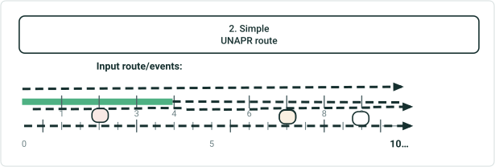

| RouteName: | 0 | 1 | 2 | 3 | 4 | 5 | 6 | 7 | 8 | 9 | 10 |
| --- | --- | --- | --- | --- | --- | --- | --- | --- | --- | --- | --- |
| Pipeline Line | TRANSMISSION | DISTRIBUTION | STATION | STORAGE | TRANSMISSION | DISTRIBUTION | STATION | STORAGE | TRANSMISSION | DISTRIBUTION | STATION |
| Anomaly |  |  | DENT |  |  |  |  |  |  |  |  |
| Pipeline Device |  |  |  |  |  |  |  | METER |  |  |  |
| Pipeline Junction |  |  |  |  |  |  |  |  |  | ELBOW |  |
| Operating Pressure | 350 PSI |  |  |  | 400 PSI |  |  |  |  |  |  |
| DOT Class | CLASS 1 |  |  |  |  |  |  |  |  |  |  |

| Input Event Layer | Route Name | From Date | To Date | From Measure | To Measure | Attribute |
| --- | --- | --- | --- | --- | --- | --- |
| Pipeline Line | N/A | N/A | N/A | N/A | N/A | TRANSMISSION |
| Pipeline Line | N/A | N/A | N/A | N/A | N/A | DISTRIBUTION |
| Pipeline Line | N/A | N/A | N/A | N/A | N/A | STATION |
| Pipeline Line | N/A | N/A | N/A | N/A | N/A | STORAGE |
| Pipeline Line | N/A | N/A | N/A | N/A | N/A | TRANSMISSION |
| Pipeline Line | N/A | N/A | N/A | N/A | N/A | DISTRIBUTION |
| Pipeline Line | N/A | N/A | N/A | N/A | N/A | STATION |
| Pipeline Line | N/A | N/A | N/A | N/A | N/A | STORAGE |
| Pipeline Line | N/A | N/A | N/A | N/A | N/A | TRANSMISSION |
| Pipeline Line | N/A | N/A | N/A | N/A | N/A | DISTRIBUTION |
| Pipeline Line | … | … | … | … | … | … |
| Anomaly | 001 | 1/1/2000 | <NULL> | 2 | N/A | DENT |
| Pipeline Device | 001 | N/A | N/A | 7 | N/A | METER |
| Pipeline Junction | 001 | N/A | N/A | 9 | N/A | ELBOW |
| Operating Pressure | 001 | 1/1/2000 | <NULL> | 0 | 4 | 350 PSI |
| Operating Pressure | 001 | 1/1/2000 | <NULL> | 4 | 10 | 400 PSI |
| DOT Class | 001 | 1/1/2000 | <NULL> | 0 | 10 | CLASS 1 |

| Route Name | From Date | To Date |
| --- | --- | --- |
| Route001 | 1/1/2000 | <Null> |
