# Split Event Widget Test Plan

|   |   |
| --- | --- |
| **Kind** | Test Plan · Experience Builder |
| **Release** | — |
| **Issue** | [Beijing-R-D-Center/ExperienceBuilder-Web-Extensions#16461](https://devtopia.esri.com/Beijing-R-D-Center/ExperienceBuilder-Web-Extensions/issues/16461) |
| **Source** | [16461-SplitEvent_TestPlanV1.pptx](<https://esriis.sharepoint.com/sites/LocationReferencing/Shared%20Documents/General/Test%20Plans/16461-SplitEvent_TestPlanV1.pptx>) |
| **Edited** | 2023-11-27 18:36 by Mac Christmas |
| **Extracted** | 2026-09-04 · lane `xmlstrip` |

<!-- metadata
```yaml
title: "Split Event Widget Test Plan"
source_file: "16461-SplitEvent_TestPlanV1.pptx"
source_url: "https://esriis.sharepoint.com/sites/LocationReferencing/Shared%20Documents/General/Test%20Plans/16461-SplitEvent_TestPlanV1.pptx"
doc_id: 459
doc_kind: "Test Plan"
surface: "Experience Builder"
doc_revision: "V1"
target_release: ""
pe: ""
dev: ""
author: "Mac Christmas"
last_edited_by: "Mac Christmas"
last_edited: "2023-11-27T18:36:08Z"
extracted: 2026-09-04
extraction_lane: xmlstrip
prompt_version: "v2.0.2"
keywords: ["split event", "event splitting", "route", "line event", "spanning event", "non spanning event", "route id", "route name", "measure", "event attributes", "experience builder"]
tools: ["Split Event"]
products: []
issues: ["Beijing-R-D-Center/ExperienceBuilder-Web-Extensions#16461"]
related: [{"doc":437,"file":"merge-events-widget-test-plan__doc437.md","s":5.581},{"doc":491,"file":"splitting-events-in-arcgis-pro-test-plan__doc491.md","s":4.06},{"doc":472,"file":"split-event-in-experience-builder__doc472.md","s":3.578},{"doc":452,"file":"lrs-identify-widget-test-plan__doc452.md","s":3.394},{"doc":528,"file":"reassign-transfer-to-another-line-with-stayput-and-retire-event-behavior-test__doc528.md","s":2.735}]
```
-->

## Summary

Test plan for the Split Event widget in Experience Builder covering configuration, UI, and other positive and negative test cases. Includes tests for line and non-line networks, spanning and non-spanning line events, RouteID configurations, route shapes, spatial references, themes, browsers, and device configurations. Detailed test cases from ArcGIS Pro Split Events test plan are included, demonstrating event splitting scenarios on various route types and conditions.

## Related documents

<!-- related:begin -->
- [Merge Events Widget Test Plan](<https://esriis.sharepoint.com/sites/lrsworkspace/LRS Doc Index/Test Plans/merge-events-widget-test-plan__doc437.md>) — similar text 0.32 · 1 title word · same kind/surface/folder <!-- rel:437 -->
- [Splitting Events in ArcGIS Pro - Test Plan](<https://esriis.sharepoint.com/sites/lrsworkspace/LRS Doc Index/Test Plans/splitting-events-in-arcgis-pro-test-plan__doc491.md>) — similar text 0.71 · same kind/folder <!-- rel:491 -->
- [Split Event in Experience Builder](<https://esriis.sharepoint.com/sites/lrsworkspace/LRS Doc Index/User Stories/split-event-in-experience-builder__doc472.md>) — similar text 0.27 · 2 title words · 1 filename word · same surface <!-- rel:472 -->
- [LRS Identify Widget Test Plan](<https://esriis.sharepoint.com/sites/lrsworkspace/LRS Doc Index/Test Plans/lrs-identify-widget-test-plan__doc452.md>) — similar text 0.18 · 1 title word · same kind/surface/folder <!-- rel:452 -->
- [Reassign - Transfer to Another Line with StayPut and Retire Event Behavior - Test Plan](<https://esriis.sharepoint.com/sites/lrsworkspace/LRS%20Doc%20Index/Test%20Plans/reassign-transfer-to-another-line-with-stayput-and-retire-event-behavior-test__doc528.md>) — similar text 0.15 · 1 title word · same kind/folder <!-- rel:528 -->
<!-- related:end -->

<!-- docs:begin -->
## Esri documentation

[Split a centerline by measure](https://doc.esri.com/en/arcgis-pro/latest/help/production/location-referencing-pipelines/split-a-centerline-by-measure.html) · [Event editing using the attribute table](https://doc.esri.com/en/arcgis-pro/latest/help/production/location-referencing-pipelines/event-editing-using-the-attribute-table.html)

_No page matched:_ [Split Event](https://www.google.com/search?q=%22Split%20Event%22+site%3Adoc.esri.com)
<!-- docs:end -->

---

## Slide 1


Split Event Widget

| Notes |
| --- |
| Add Split Event widget to Experience Builder Test with line and non-line networks (excluding PoM) Test with spanning and non-spanning line events Test with auto-generated, single-field, and multi-field RouteID configurations Test with events with RouteName vs. RouteID configured Test on simple and complex route shapes Test with projected and unprojected data, including a variety of spatial references Test with different themes Test in Chrome and Edge (other browsers will be covered in automation) Test based on the Pro Split Events test plan test cases (cases are attached at end of test plan) Test i18m and accessibility testing Test in Web, Tablet, and Mobile configurations |

Devtopia Issue

## Slide 2


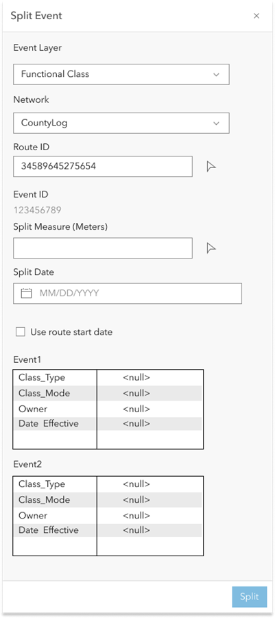

## Slide 3

| Positive Tests: Configuration |
| --- |
| A map can be chosen If more than one map exists within the app, list all maps in the Select a map dropdown Line event and network layers can be imported from the map Missing layers can be added using the New Editable Layer option Layers can be reordered Layers can be removed by clicking the X button Clicking on Clear layers will remove all the imported layers If some layers are removed, clicking on Load layers will only import the missing layers Only line event layers should appear in the Event dropdown When another web map is chosen, clear the layers from the list A default event layer can be chosen The event layer’s label can be edited Attribute fields can be configured and show only business fields. No LRS or system fields should appear Attribute fields can be selected/unselected to show in the UI Attribute fields an be enabled/disabled for editing Use field alias should be enabled by default A field description can be added for each field |

| Negative Tests: Configuration |
| --- |
| Show error if no LRS enabled layers in the chosen web map when attempting to import layer No line event layers are imported from the map LRS parent network is not within the web map Chosen web map has more than one service |

| Positive Tests: UI |
| --- |
| Configured default event layer appears as the chosen event when the UI is launched A different event layer can be chosen The parent LRS network for the event appears in the Network dropdown The parent LRS network updates when an event with a different parent LRS network is chosen The Network dropdown is grayed out and cannot be changed (once measure translation between LRS networks is supported, this dropdown will become interactive) Once an event is chosen, update the units for the measure label based on the parent LRS network If the selected event’s parent LRS network is configured with RouteName and the event stores the RouteName, display RouteName instead of RouteID If the selected event’s parent LRS network is configured only with RouteID, display RouteID If the selected event’s parent LRS network is configured with RouteName but the event does not store the RouteName, display RouteID |

## Slide 4

| Positive Tests: UI (Continued) |
| --- |
| RouteName/RouteID can be typed RouteName/RouteID can be selected using the Route picker Multi-field RouteID networks will only show the concatenated RouteID field. The fields that make up the concatenated RouteID will not appear The split location measure can be typed The split location measure can be selected using the measure picker If a valid event exists at the measure location, populate the EventID, measure, configured business attributes, and the OID of the event at the measure location Flash the event three times in the map Provide a marker at the split location on the route If more than one route exists at the location, show a table pop-up with the RouteID/RouteName, measure, and FromDate/ToDate of the routes at the location If more than one time slice of a route exists at the location, show a table pop-up with the RouteID/RouteName, measure, and FromDate/ToDate of the time sliced route at the location If more than one measure on the same route exists at the location, show a table pop-up with the RouteID/RouteName, measure, and FromDate/ToDate of the multiple measures on the route at this location The Split date defaults to the current date Checking the Use route start date box populates the Split date with the Route start date Business fields can be edited in the Attributes section Configured default values for attributes are populated Editable/uneditable business fields are editable/uneditable Selected/unselected business fields are displayed correctly Upon successful execution, sequentially flash the two resultant split events in the map Upon successful execution, clear out all parameters except for the input Event Layer Upon successful execution, display a confirmation message that the input event was split successfully If no route exists within the parent LRS network at the clicked location, do not populate any fields and continue to keep the route picker active If input Event Layer is spanning line event, the Route start date checkbox will not appear. If input Event layer has a large number of attribute fields, a scroll bar will appear |

## Slide 5

| Positive Tests: Other |
| --- |
| Split an event that spans a gapped route (route has same measure on each side of the gap) at either side of the gap |

| Negative Tests: Other |
| --- |
| Attempt to split an event that spans a gapped route (route has different measures on each side of the gap) at either side of the gap |

| Negative Tests: UI |
| --- |
| Type RouteID/RouteName does not exist within the LRS network The split measure location does not exist on the input route Input date is outside of the route’s time slice Input date is outside of the event’s time slice Input date is not a valid date (example: 13/45/0185) Input measure is the start measure of a route Input measure is the end measure of a route Input measure is not a number More than one event within the event layer exists at the split location Attribute Rules, contingent values, coded value/range domains, subtypes, and non-nullable fields are violated, do not execute and display errors for the violated field(s) If a route is chosen but no events exist at the clicked measure location, display an error that no events exists at the input location |

## Slide 6 — Test Cases from Pro Test Plan:

## Positive - Nonline Network – Non Spanning Line Event <!-- slide 7 -->

### Normal Route

**Normal route - Split measure: 16**
Current date: 3/29/2022

| Route ID | From Date | To Date |
| --- | --- | --- |
| R1 | 1/1/2000 | Null |

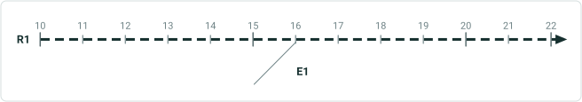

| Event ID | E1 |
| --- | --- |
| Route ID | R1 |
| Measure | 10 |
| To Measure | 22 |
| From Date | 1/1/2000 |
| To Date | Null |
| Attribute 1 | split |
| Attribute2 | event |

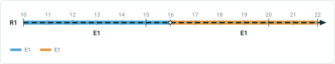

| Event ID | E1 | E1 | E1 |
| --- | --- | --- | --- |
| Route ID | R1 | R1 | R1 |
| Measure | 10 | 10 | 16 |
| To Measure | 22 | 16 | 22 |
| From Date | 1/1/2000 | 3/29/2022 | 3/29/2022 |
| To Date | 3/29/2022 | Null | Null |
| Attribute 1 | split | split1 | split |
| Attribute2 | event | event1 | event |

Test case for UI automation

## Case 2: Positive - Nonline Network – Non Spanning Line Event <!-- slide 8 -->

### Loop

**Loop – Split measure: 20**
current date: 3/29/2022

| Route ID | From Date | To Date |
| --- | --- | --- |
| R1 | 1/1/2000 | Null |

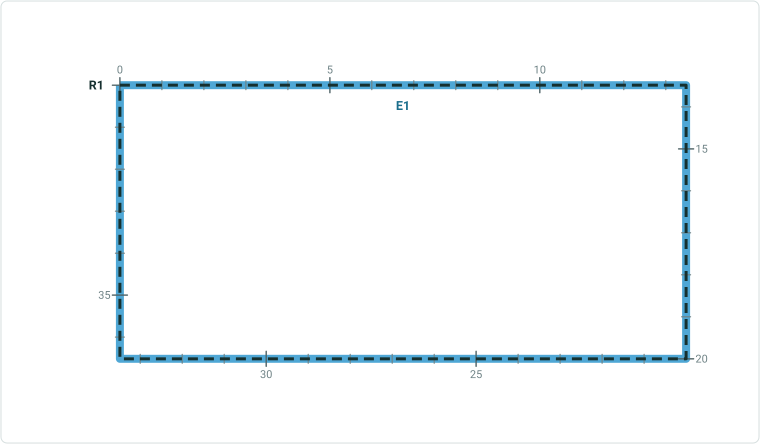

| Event ID | E1 |
| --- | --- |
| Route ID | R1 |
| Measure | 0 |
| To Measure | 40 |
| From Date | 1/1/2000 |
| To Date | Null |
| Attribute 1 | split |
| Attribute2 | event |

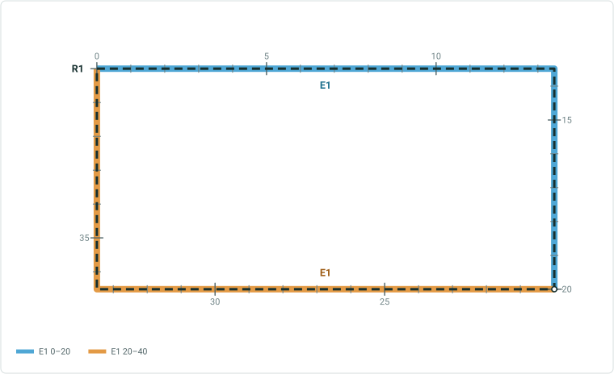

| Event ID | E1 | E1 | E1 |
| --- | --- | --- | --- |
| Route ID | R1 | R1 | R1 |
| Measure | 0 | 0 | 20 |
| To Measure | 40 | 20 | 40 |
| From Date | 1/1/2000 | 3/29/2022 | 3/29/2022 |
| To Date | 3/29/2022 | Null | Null |
| Attribute 1 | split | split1 | split |
| Attribute2 | event | event1 | event |

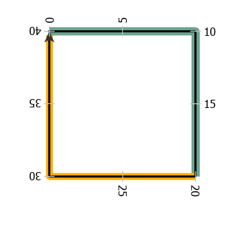 

## Case 3: Positive - Nonline Network – Non Spanning Line Event <!-- slide 9 -->

### Lollipop

**Lollipop – Split measure: 30**
current date: 3/29/2022

| Route ID | From Date | To Date |
| --- | --- | --- |
| R1 | 1/1/2000 | Null |

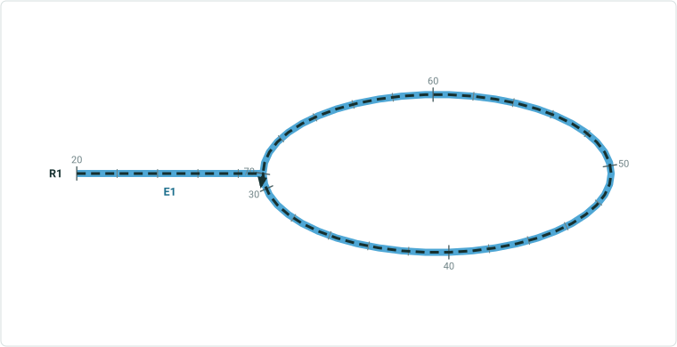

| Event ID | E1 |
| --- | --- |
| Route ID | R1 |
| Measure | 20 |
| To Measure | 70 |
| From Date | 1/1/2000 |
| To Date | Null |
| Attribute 1 | Split |
| Attribute2 | Event |

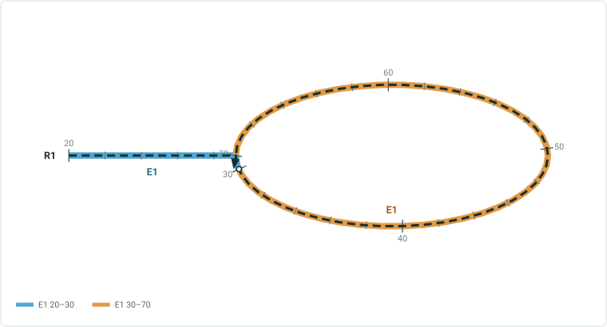

| Event ID | E1 | E1 | E1 |
| --- | --- | --- | --- |
| Route ID | R1 | R1 | R1 |
| Measure | 20 | 20 | 30 |
| To Measure | 70 | 30 | 70 |
| From Date | 1/1/2000 | 3/29/2022 | 3/29/2022 |
| To Date | 3/29/2022 | Null | Null |
| Attribute 1 | Split | Split1 | Split |
| Attribute2 | Event | Event1 | Event |


## Case 4: Positive - Nonline Network – Non Spanning Line Event <!-- slide 10 -->

### Branch

**Branch – Split measure: 28**
current date: 3/29/2022

| Route ID | From Date | To Date |
| --- | --- | --- |
| R1 | 1/1/2000 | Null |


| Event ID | E1 |
| --- | --- |
| Route ID | R1 |
| Measure | 0 |
| To Measure | 48 |
| From Date | 1/1/2000 |
| To Date | Null |
| Attribute 1 | Split |
| Attribute2 | Event |

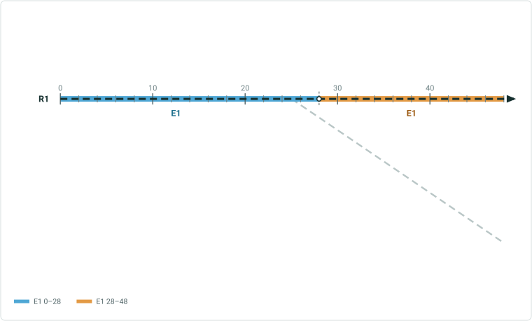

| Event ID | E1 | E1 | E1 |
| --- | --- | --- | --- |
| Route ID | R1 | R1 | R1 |
| Measure | 0 | 0 | 28 |
| To Measure | 48 | 28 | 48 |
| From Date | 1/1/2000 | 3/29/2022 | 3/29/2022 |
| To Date | 3/29/2022 | Null | Null |
| Attribute 1 | Split | Split1 | Split |
| Attribute2 | Event | Event1 | Event |

 

## Case 5: Positive - Nonline Network – Non Spanning Line Event <!-- slide 11 -->

### Branch

**Branch – Split measure: 25**
current date: 3/29/2022

| Route ID | From Date | To Date |
| --- | --- | --- |
| R1 | 1/1/2000 | Null |

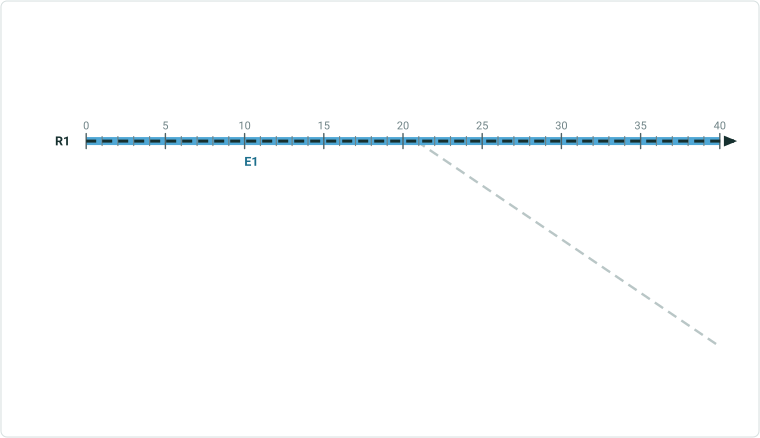

| Event ID | E1 |
| --- | --- |
| Route ID | R1 |
| Measure | 0 |
| To Measure | 40 |
| From Date | 1/1/2000 |
| To Date | Null |
| Attribute 1 | Split |
| Attribute2 | Event |

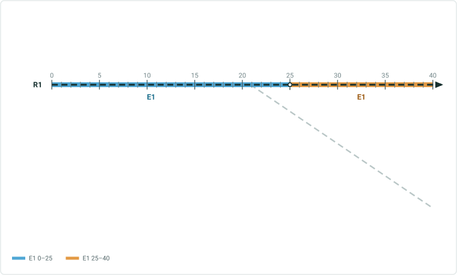

| Event ID | E1 | E1 | E1 |
| --- | --- | --- | --- |
| Route ID | R1 | R1 | R1 |
| Measure | 0 | 0 | 25 |
| To Measure | 40 | 25 | 40 |
| From Date | 1/1/2000 | 3/29/2022 | 3/29/2022 |
| To Date | 3/29/2022 | Null | Null |
| Attribute 1 | Split | Split1 | Split |
| Attribute2 | Event | Event1 | Event |

Modify this test case to have the event is from measure 5 to measure 35.

 

## Case 6: Positive - Nonline Network – Non Spanning Line Event <!-- slide 12 -->

### Alpha

**Alpha– Split measure: 40**
current date: 3/29/2022

| Route ID | From Date | To Date |
| --- | --- | --- |
| R1 | 1/1/2000 | Null |

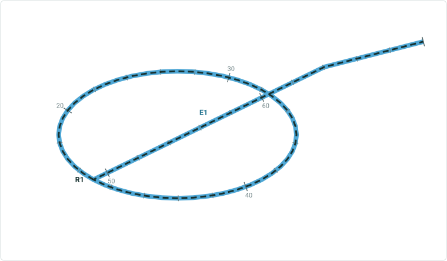

| Event ID | E1 |
| --- | --- |
| Route ID | R1 |
| Measure | 15 |
| To Measure | 70 |
| From Date | 1/1/2000 |
| To Date | Null |
| Attribute 1 | Split |
| Attribute2 | Event |

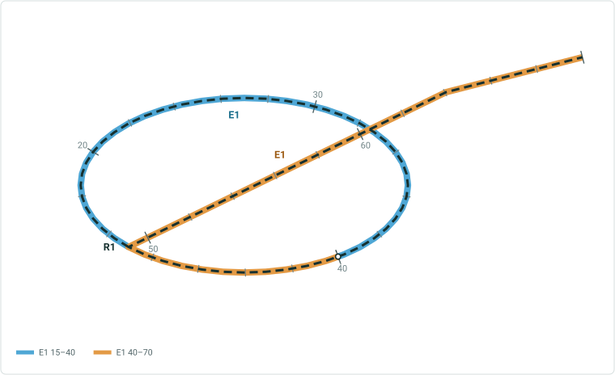

| Event ID | E1 | E1 | E1 |
| --- | --- | --- | --- |
| Route ID | R1 | R1 | R1 |
| Measure | 15 | 15 | 40 |
| To Measure | 70 | 40 | 70 |
| From Date | 1/1/2000 | 3/29/2022 | 3/29/2022 |
| To Date | 3/29/2022 | Null | Null |
| Attribute 1 | Split | Split1 | Split |
| Attribute2 | Event | Event1 | Event |

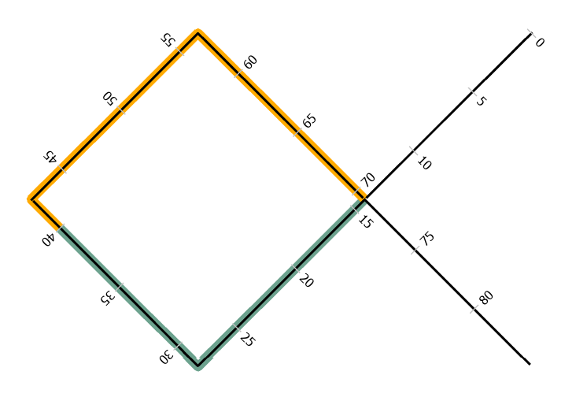

## Case 7: Positive - Nonline Network – Non Spanning Line Event <!-- slide 13 -->

### Infinity

**Infinity– Split measure: 40**
Current date: 3/29/2022

current date: 3/29/2022

| Route ID | From Date | To Date |
| --- | --- | --- |
| R1 | 1/1/2000 | Null |

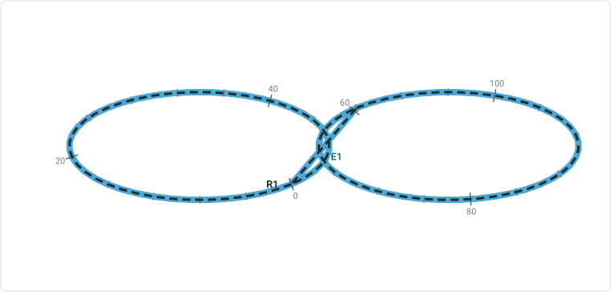

| Event ID | E1 |
| --- | --- |
| Route ID | R1 |
| Measure | 0 |
| To Measure | 112 |
| From Date | 1/1/2000 |
| To Date | Null |
| Attribute 1 | Split |
| Attribute2 | Event |

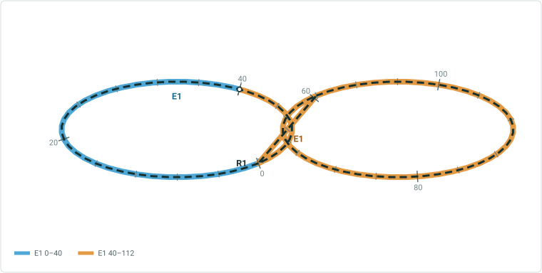

| Event ID | E1 | E1 | E1 |
| --- | --- | --- | --- |
| Route ID | R1 | R1 | R1 |
| Measure | 0 | 0 | 40 |
| To Measure | 112 | 40 | 112 |
| From Date | 1/1/2000 | 3/29/2022 | 3/29/2022 |
| To Date | 3/29/2022 | Null | Null |
| Attribute 1 | Split | Split1 | Split |
| Attribute2 | Event | Event1 | Event |

## Case 8: Positive - Nonline Network – Non Spanning Line Event <!-- slide 14 -->

### Gap

**Gap– Split measure: 10**
Current date: 3/29/2022

| Route ID | From Date | To Date |
| --- | --- | --- |
| R1 | 1/1/2000 | Null |

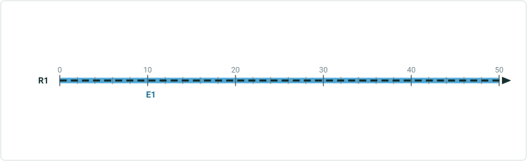

| Event ID | E1 |
| --- | --- |
| Route ID | R1 |
| Measure | 0 |
| To Measure | 50 |
| From Date | 1/1/2000 |
| To Date | Null |
| Attribute 1 | Split |
| Attribute2 | Event |

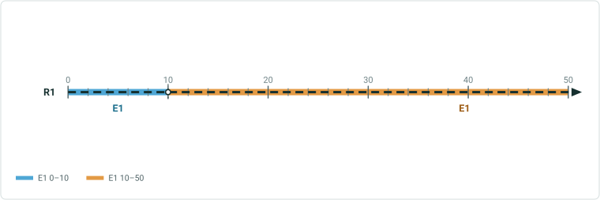

| Event ID | E1 | E1 | E1 |
| --- | --- | --- | --- |
| Route ID | R1 | R1 | R1 |
| Measure | 0 | 0 | 20 |
| To Measure | 50 | 10 | 50 |
| From Date | 1/1/2000 | 3/29/2022 | 3/29/2022 |
| To Date | 3/29/2022 | Null | Null |
| Attribute 1 | Split | Split1 | Split |
| Attribute2 | Event | Event1 | Event |

Modify this test case to have the event only in one part of the gapped event and split that event

## Case 9: Positive - Nonline Network – Non Spanning Line Event <!-- slide 15 -->

### Changing the From and To Date

Split measure: 25
From date: 1/1/2010
To date: 1/1/2020

| Route ID | From Date | To Date |
| --- | --- | --- |
| R1 | 1/1/2000 | Null |

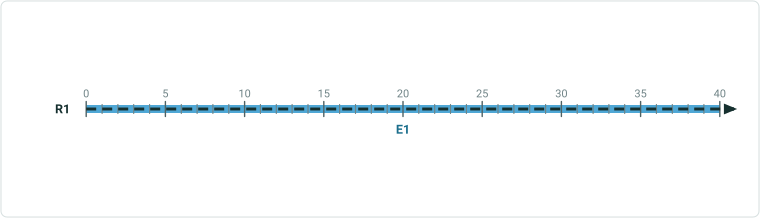

| Event ID | E1 |
| --- | --- |
| Route ID | R1 |
| Measure | 0 |
| To Measure | 40 |
| From Date | 1/1/2000 |
| To Date | Null |
| Attribute 1 | Split |
| Attribute2 | Event |

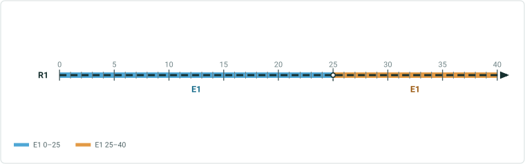

| Event ID | E1 | E1 | E1 |
| --- | --- | --- | --- |
| Route ID | R1 | R1 | R1 |
| Measure | 0 | 0 | 25 |
| To Measure | 40 | 25 | 40 |
| From Date | 1/1/2000 | 1/1/2010 | 1/1/2010 |
| To Date | 1/1/2010 | 1/1/2020 | 1/1/2020 |
| Attribute 1 | Split | Split1 | Split2 |
| Attribute2 | Event | Event1 | Event2 |

Modify this test case to have the event is from measure 5 to measure 35.

## Case 10: Positive - Nonline Network – Non Spanning Line Event <!-- slide 16 -->

### Vertical Route

Split measure: 4.5
Current date : 3/29/2022

| Route ID | From Date | To Date |
| --- | --- | --- |
| R1 | 1/1/2000 | Null |

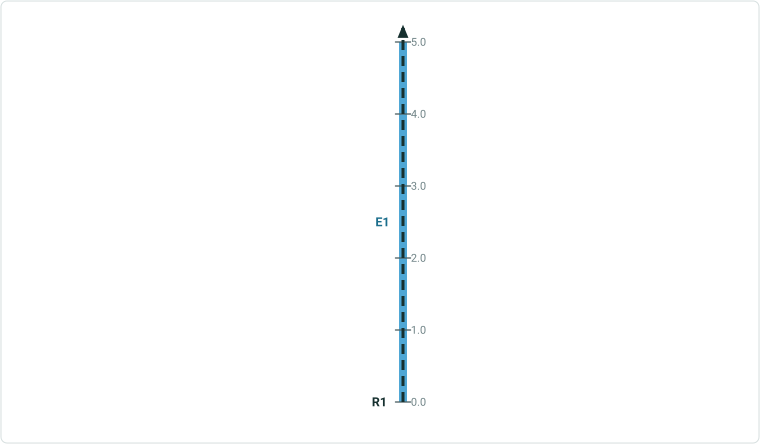

| Event ID | E1 |
| --- | --- |
| Route ID | R1 |
| Measure | 0 |
| To Measure | 5 |
| From Date | 1/1/2000 |
| To Date | Null |
| Attribute 1 | Split |
| Attribute2 | Event |

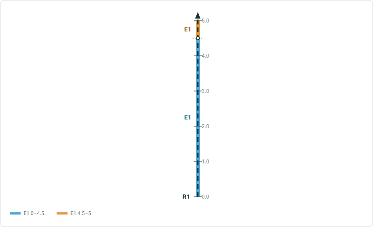

| Event ID | E1 | E1 | E1 |
| --- | --- | --- | --- |
| Route ID | R1 | R1 | R1 |
| Measure | 0 | 0 | 4.5 |
| To Measure | 5 | 4.5 | 5 |
| From Date | 1/1/2000 | 3/29/2022 | 3/29/2022 |
| To Date | 3/29/2022 | null | null |
| Attribute 1 | Split | Split1 | Split2 |
| Attribute2 | Event | Event1 | Event2 |

## Case 11: Positive - Line Network – Spanning Line Event <!-- slide 17 -->

### Normal Route

**Normal route - Split measure: 52.5**
Current date: 3/29/2022

| Route ID | From Date | To Date |
| --- | --- | --- |
| R1L3 | 1/1/2000 | Null |
| R2L3 | 1/1/2000 | Null |
| R3L3 | 1/1/2000 | Null |

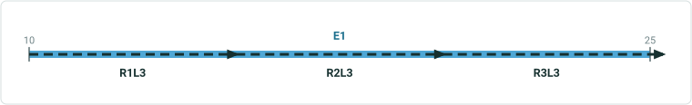

| Event ID | E1 |
| --- | --- |
| From RID | R1L3 |
| From Measure | 10 |
| To RouteID | R3L3 |
| To Measure | 25 |
| From Date | 1/1/2000 |
| To Date | Null |
| Attribute 1 | split |
| Attribute2 | event |

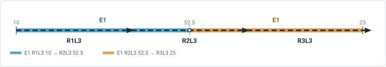

| Event ID | E1 | E1 | E1 |
| --- | --- | --- | --- |
| From RID | R1L3 | R1L3 | R2L3 |
| From Measure | 10 | 10 | 52.5 |
| To RouteID | R3L3 | R2L3 | R3L3 |
| To Measure | 25 | 52.5 | 25 |
| From Date | 1/1/2000 | 3/29/2022 | 3/29/2022 |
| To Date | 3/29/2022 | Null | Null |
| Attribute 1 | split | split1 | split |
| Attribute2 | event | event1 | event |

Test case for UI automation

## Case 12: Positive - Line Network – Spanning Line Event <!-- slide 18 -->

### Routes in Loop

**Routes in loop - Split measure: 20/50**
Current date: 3/29/2022
Route Picker should show up.

| Route ID | From Date | To Date |
| --- | --- | --- |
| R1L1 | 1/1/2000 | Null |
| R2L1 | 1/1/2000 | Null |


| Event ID | E1 |
| --- | --- |
| From RID | R1L1 |
| From Measure | 0 |
| To RouteID | R2L1 |
| To Measure | 70 |
| From Date | 1/1/2000 |
| To Date | Null |
| Attribute 1 | split |
| Attribute2 | event |

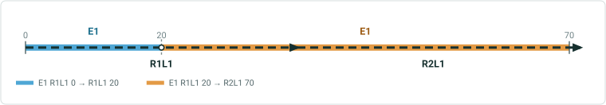

| Event ID | E1 | E1 | E1 |
| --- | --- | --- | --- |
| From RID | R1L1 | R1L1 | R2L1 |
| From Measure | 0 | 0 | 50 |
| To RouteID | R2L1 | R1L1 | R2L1 |
| To Measure | 70 | 20 | 70 |
| From Date | 1/1/2000 | 3/29/2022 | 3/29/2022 |
| To Date | 3/29/2022 | Null | Null |
| Attribute 1 | split | split1 | split |
| Attribute2 | event | event1 | event |

## Case 13: Positive - Line Network – Spanning Line Event <!-- slide 19 -->

### Routes in Lollipop

**Routes in lollipop - Split measure: 10**
Current date: 3/29/2022
Measure picker should show up.

| Route ID | From Date | To Date |
| --- | --- | --- |
| R1L1 | 1/1/2000 | Null |
| R2L1 | 1/1/2000 | Null |
| R3L1 | 1/1/2000 | Null |

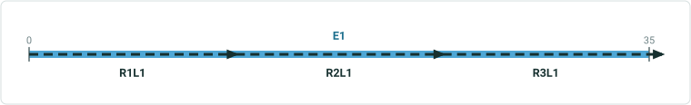

| Event ID | E1 |
| --- | --- |
| From RID | R1L1 |
| From Measure | 0 |
| To RouteID | R3L1 |
| To Measure | 35 |
| From Date | 1/1/2000 |
| To Date | Null |
| Attribute 1 | split |
| Attribute2 | event |

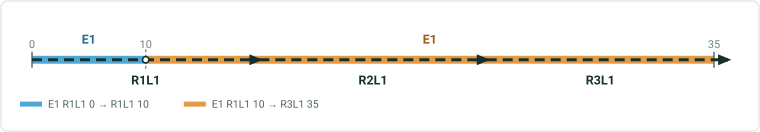

| Event ID | E1 | E1 | E1 |
| --- | --- | --- | --- |
| From RID | R1L1 | R1L1 | R1L1 |
| From Measure | 0 | 0 | 10 |
| To RouteID | R3L1 | R1L1 | R3L1 |
| To Measure | 35 | 10 | 35 |
| From Date | 1/1/2000 | 3/29/2022 | 3/29/2022 |
| To Date | 3/29/2022 | Null | Null |
| Attribute 1 | split | split1 | split |
| Attribute2 | event | event1 | event |

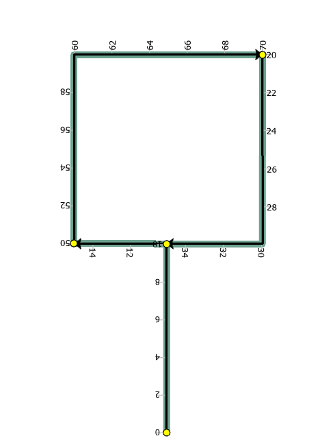

## Case 14: Positive - Line Network – Spanning Line Event <!-- slide 20 -->

### Routes in Infinity

**Routes in infinity - Split measure: 10 (R2L1)**
Current date: 3/29/2022

| Route ID | From Date | To Date |
| --- | --- | --- |
| R1L1 | 1/1/2000 | Null |
| R2L1 | 1/1/2000 | Null |
| R3L1 | 1/1/2000 | Null |

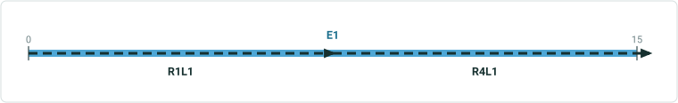

| Event ID | E1 |
| --- | --- |
| From RID | R1L1 |
| From Measure | 0 |
| To RouteID | R4L1 |
| To Measure | 15 |
| From Date | 1/1/2000 |
| To Date | Null |
| Attribute 1 | split |
| Attribute2 | event |

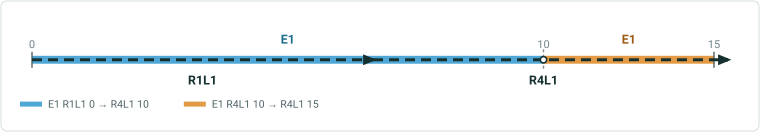

| Event ID | E1 | E1 | E1 |
| --- | --- | --- | --- |
| From RID | R1L1 | R1L1 | R2L1 |
| From Measure | 0 | 0 | 10 |
| To RouteID | R4L1 | R2L1 | R4L1 |
| To Measure | 15 | 10 | 15 |
| From Date | 1/1/2000 | 3/29/2022 | 3/29/2022 |
| To Date | 3/29/2022 | Null | Null |
| Attribute 1 | split | split1 | split |
| Attribute2 | event | event1 | event |

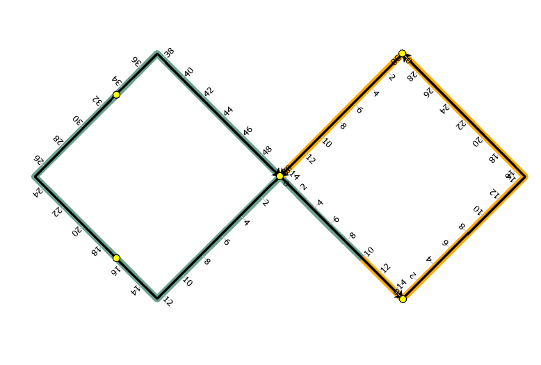 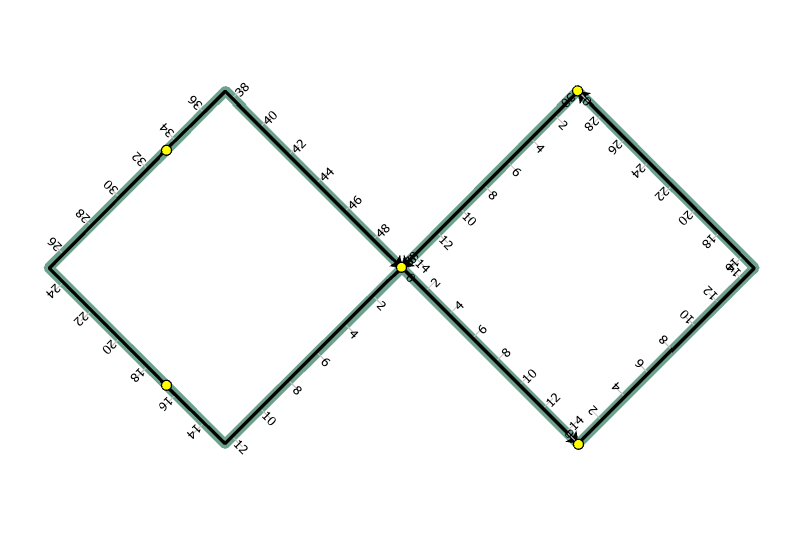

## Case 15: Positive - Line Network – Spanning Line Event <!-- slide 21 -->

### Reverse Routes

**Reverse routes - Split measure: 10 (R1L1)**
Current date: 3/29/2022
Route picker will show up ?
output event after split will follow the route direction.

| Route ID | From Date | To Date |
| --- | --- | --- |
| R1L1 | 1/1/2000 | Null |
| R2L1 | 1/1/2000 | Null |

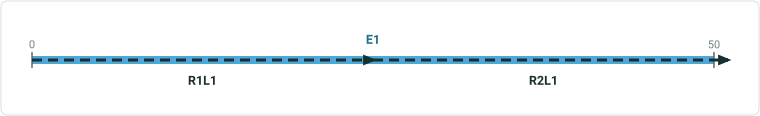

| Event ID | E1 |
| --- | --- |
| From RID | R1L1 |
| From Measure | 0 |
| To RouteID | R2L1 |
| To Measure | 50 |
| From Date | 1/1/2000 |
| To Date | Null |
| Attribute 1 | split |
| Attribute2 | event |


| Event ID | E1 | E1 | E1 |
| --- | --- | --- | --- |
| From RID | R1L1 | R1L1 | R2L1 |
| From Measure | 0 | 0 | 50 |
| To RouteID | R2L1 | R1L1 | R2L1 |
| To Measure | 50 | 10 | 60 |
| From Date | 1/1/2000 | 3/29/2022 | 3/29/2022 |
| To Date | 3/29/2022 | Null | Null |
| Attribute 1 | split | split1 | split |
| Attribute2 | event | event1 | event |

## Case 16: Positive - Line Network – Spanning Line Event <!-- slide 22 -->

### Gapped Routes

**Gapped routes - Split measure: 120 (R2L1)**
Current date: 3/29/2022

| Route ID | From Date | To Date |
| --- | --- | --- |
| R1L1 | 1/1/2000 | Null |
| R2L1 | 1/1/2000 | Null |

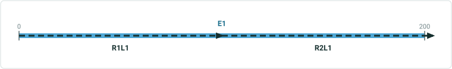

| Event ID | E1 |
| --- | --- |
| From RID | R1L1 |
| From Measure | 0 |
| To RouteID | R2L1 |
| To Measure | 200 |
| From Date | 1/1/2000 |
| To Date | Null |
| Attribute 1 | split |
| Attribute2 | event |

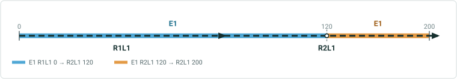

| Event ID | E1 | E1 | E1 |
| --- | --- | --- | --- |
| From RID | R1L1 | R1L1 | R2L1 |
| From Measure | 0 | 0 | 120 |
| To RouteID | R2L1 | R2L1 | R2L1 |
| To Measure | 200 | 120 | 200 |
| From Date | 1/1/2000 | 3/29/2022 | 3/29/2022 |
| To Date | 3/29/2022 | Null | Null |
| Attribute 1 | split | split1 | split |
| Attribute2 | event | event1 | event |

## Case 17: Positive - Line Network – Spanning Line Event <!-- slide 23 -->

### Reverse Route

**Reverse Route- Splitting measure 0(R3L1) or 100 (R4L1)**
Current date: 3/29/2022

| Route ID | From Date | To Date |
| --- | --- | --- |
| R1L1 | 1/1/2000 | Null |
| R2L1 | 1/1/2000 | Null |
| R3L1 | 1/1/2000 | Null |
| R4L1 | 1/1/2000 | Null |
| R5L1 | 1/1/2000 | Null |

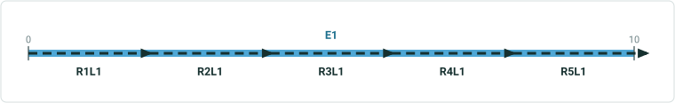

| Event ID | E1 |
| --- | --- |
| From RID | R1L1 |
| From Measure | 0 |
| To RouteID | R5L1 |
| To Measure | 10 |
| From Date | 1/1/2000 |
| To Date | Null |
| Attribute 1 | split |
| Attribute2 | event |

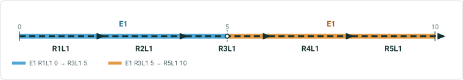

| Event ID | E1 | E1 | E1 |
| --- | --- | --- | --- |
| From RID | R1L1 | R1L1 | R3L1 |
| From Measure | 0 | 0 | 0 |
| To RouteID | R5L1 | R3L1 | R5L1 |
| To Measure | 10 | 0 | 10 |
| From Date | 1/1/2000 | 3/29/2022 | 3/29/2022 |
| To Date | 3/29/2022 | Null | Null |
| Attribute 1 | split | split1 | split |
| Attribute2 | event | event1 | event |

## Case 18: Positive - Line Network – Spanning Line Event <!-- slide 24 -->

### Branch Route

**Branch Route – split measure 20 of R1L1**
Current date : 03/29/2022

| Route ID | From Date | To Date |
| --- | --- | --- |
| R1L1 | 1/1/2000 | Null |
| R2L1 | 1/1/2000 | Null |

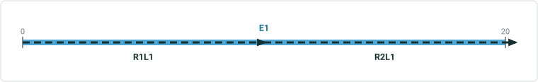

| Event ID | E1 |
| --- | --- |
| From RID | R1L1 |
| From Measure | 0 |
| To RouteID | R2L1 |
| To Measure | 20 |
| From Date | 1/1/2000 |
| To Date | Null |
| Attribute 1 | split |
| Attribute2 | event |

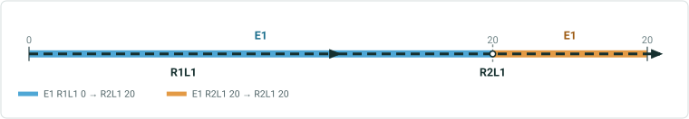

| Event ID | E1 | E1 | E1 |
| --- | --- | --- | --- |
| From RID | R1L1 | R1L1 | R1L1 |
| From Measure | 0 | 0 | 20 |
| To RouteID | R2L1 | R1L1 | R2L1 |
| To Measure | 20 | 20 | 20 |
| From Date | 1/1/2000 | 3/29/2022 | 3/29/2022 |
| To Date | 3/29/2022 | Null | Null |
| Attribute 1 | split | split1 | split |
| Attribute2 | event | event1 | event |

Modify this test case to have the event is from measure 5 of R1L1 to measure 10 of R2L1.

## Case 20: Positive - Line Network – Spanning Line Event <!-- slide 25 -->

### Changing From / To Date

**Route – Changing from/ To date Split measure: 105(R2L1)**
From date: 1/1/2010
To date: 1/1/2020

| Route ID | From Date | To Date |
| --- | --- | --- |
| R1L1 | 1/1/2000 | Null |
| R2L1 | 1/1/2000 | Null |


| Event ID | E1 |
| --- | --- |
| From RID | R1L1 |
| From Measure | 0 |
| To RouteID | R2L1 |
| To Measure | 110 |
| From Date | 1/1/2000 |
| To Date | Null |
| Attribute 1 | split |
| Attribute2 | event |

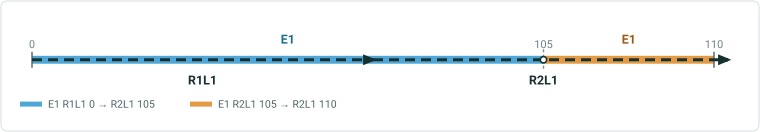

| Event ID | E1 | E1 | E1 |
| --- | --- | --- | --- |
| From RID | R1L1 | R1L1 | R2L1 |
| From Measure | 0 | 0 | 105 |
| To RouteID | R2L1 | R2L1 | R2L1 |
| To Measure | 110 | 105 | 110 |
| From Date | 1/1/2000 | 1/1/2010 | 1/1/2010 |
| To Date | 1/1/2010 | 1/1/2020 | 1/1/2020 |
| Attribute 1 | split | split1 | Split2 |
| Attribute2 | event | event1 | event2 |

Modify this test case to have the event is from measure 5  in R1L1 to measure  108. Of R2L1
