# Splitting Events in ArcGIS Pro - Test Plan

|   |   |
| --- | --- |
| **Kind** | Test Plan · Pro |
| **Release** | — |
| **Issue** | [ArcGISPro/ps-location-referencing#3920](https://devtopia.esri.com/ArcGISPro/ps-location-referencing/issues/3920) |
| **Source** | [SplittingEventsinPro_Testplan.pptx](<https://esriis.sharepoint.com/sites/LocationReferencing/Shared%20Documents/General/Test%20Plans/SplittingEventsinPro_Testplan.pptx>) |
| **Edited** | 2023-09-26 21:42 by unknown |
| **Extracted** | 2026-09-04 · lane `xmlstrip` |

<!-- metadata
```yaml
title: "Splitting Events in ArcGIS Pro - Test Plan"
source_file: "SplittingEventsinPro_Testplan.pptx"
source_url: "https://esriis.sharepoint.com/sites/LocationReferencing/Shared%20Documents/General/Test%20Plans/SplittingEventsinPro_Testplan.pptx"
doc_id: 491
doc_kind: "Test Plan"
surface: "Pro"
doc_revision: ""
target_release: ""
pe: ""
dev: ""
author: "Lakshmi Ananthanarayanan"
last_edited_by: ""
last_edited: "2023-09-26T21:42:02Z"
extracted: 2026-09-04
extraction_lane: xmlstrip
prompt_version: "v2.0.2"
keywords: ["event splitting", "spanning event", "non spanning event", "route picker", "measure picker", "attribute validation", "conflict prevention", "error handling"]
tools: ["Core Split", "Divide", "Clip"]
products: []
issues: ["ArcGISPro/ps-location-referencing#3920"]
related: [{"doc":459,"file":"split-event-widget-test-plan__doc459.md","s":4.06},{"doc":672,"file":"add-multiple-point-events__doc672.md","s":3.99},{"doc":647,"file":"merge-events-pro-test-plan__doc647.md","s":3.881},{"doc":669,"file":"create-multiple-line-events-test-plan__doc669.md","s":3.539},{"doc":365,"file":"point-events-dynamic-segmentation-test-plan__doc365.md","s":3.438}]
```
-->

## Summary

Test plan for splitting events in ArcGIS Pro covering feature service testing on line and non-line networks with projected and unprojected data. Includes verification of UI elements such as event layer dropdown, route selector, measure picker, and validation of attributes and date fields. Contains positive and negative test cases for spanning and non-spanning events, conflict prevention, and error handling.

## Related documents

<!-- related:begin -->
- [Split Event Widget Test Plan](<https://esriis.sharepoint.com/sites/lrsworkspace/LRS Doc Index/Test Plans/split-event-widget-test-plan__doc459.md>) — similar text 0.71 · same kind/folder <!-- rel:459 -->
- [Add Multiple Point Events](<https://esriis.sharepoint.com/sites/lrsworkspace/LRS%20Doc%20Index/Test%20Plans/add-multiple-point-events__doc672.md>) — similar text 0.14 · 1 title word · 1 filename word · same kind/surface/folder <!-- rel:672 -->
- [Merge Events Pro Test Plan](<https://esriis.sharepoint.com/sites/lrsworkspace/LRS Doc Index/Test Plans/merge-events-pro-test-plan__doc647.md>) — similar text 0.19 · 2 title words · 1 filename word · same kind/surface/folder <!-- rel:647 -->
- [Create multiple line events: Test Plan](<https://esriis.sharepoint.com/sites/lrsworkspace/LRS Doc Index/Test Plans/create-multiple-line-events-test-plan__doc669.md>) — similar text 0.22 · 1 title word · same kind/surface/folder <!-- rel:669 -->
- [Point Events Dynamic Segmentation Test Plan](<https://esriis.sharepoint.com/sites/lrsworkspace/LRS Doc Index/Test Plans/point-events-dynamic-segmentation-test-plan__doc365.md>) — similar text 0.26 · 1 title word · same kind/surface/folder <!-- rel:365 -->
<!-- related:end -->

<!-- docs:begin -->
## Esri documentation

[Conflict prevention](https://doc.esri.com/en/arcgis-pro/latest/help/production/location-referencing-pipelines/conflict-prevention.html)

_No page matched:_ [Core Split](https://www.google.com/search?q=%22Core%20Split%22+site%3Adoc.esri.com) · [Divide](https://www.google.com/search?q=%22Divide%22+site%3Adoc.esri.com) · [Clip](https://www.google.com/search?q=%22Clip%22+site%3Adoc.esri.com)
<!-- docs:end -->

---

## Slide 1 — Splitting Events in Pro – Test Plan

https://devtopia.esri.com/ArcGISPro/ps-location-referencing/issues/3920

## Slide 2

- Test in Feature Service only
- Test in Line and Non-line Network
- Test in projected and unprojected data
- Test with spanning and non-spanning events
- Verify that the default for ‘Event Layer’ is the first line event layer in the map. The dropdown should include all the line events from the LRS enabled service in the map
- Verify once clicked on an event layer in a location, the routeID/route name, the measure, and the OID of the event are populated
- RouteID and Measure should be empty until the user types or select using the picker tools
- Verify the ‘Route Name” is displayed instead of route id for the events configured with route name including in the event attributes displayed in the bottom of the pane.
- Verify that the route selector UI is shown when the user clicks a location with the route picker that has more than one route at that location
- Verify that the route selector UI is shown when the user types in a RouteId/Name which has more than one timeslices
- Verify that the measure picker is shown when the user picks a location where we have multiple measures
- Verify the route  flashes 3 times, Once it is chosen on the map using the route picker
- Verify the marker is shown at the split location
- Verify that measure can be typed in
- Provide a measure with 20 decimal places where only 7 decimal places are allowed and verify that the measure is truncated properly


## Slide 3


17. Verify that the Effective Date text box is populated with the current date
18. Verify that Route/Measure information is shown  as the user moves the cursor along the route in the map
19. By default, End Date should be empty
20.For spanning events , check box for Route From date and Route To Date should not be displayed
21. 508 / i18n testing
22. Make sure coded value domains, range domains, subtypes, required fields, contingent values and default values for any fields where applicable are honored
23. Add 15 additional attributes  and ensure  scroll bar shows up
24. When an event is split, both the events after split will be highlighted in different colors.
25. Verify that the attributes of the events after split are editable.
26 Verify the RouteID/name or measure in the  event attributes table in the bottom of the pane  is read only.  Currently we are going to hide the LRS attribute fields
27. Hovering in the pane should show the information related to the fields.
28. The events after split will be shown in tables one below another with accordion

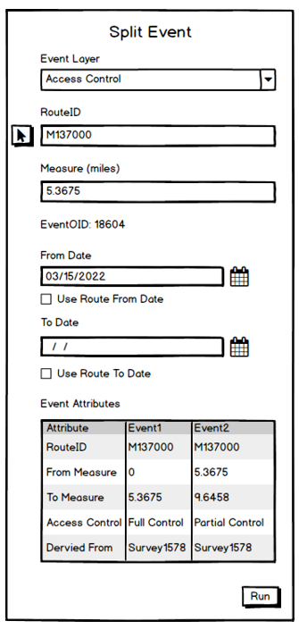

## Positive - Nonline Network – Non Spanning Line Event <!-- slide 4 -->

### Normal Route

**Normal route - Split measure: 16**
Current date: 3/29/2022

| Route ID | From Date | To Date |
| --- | --- | --- |
| R1 | 1/1/2000 | Null |

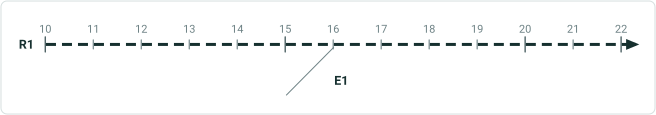

| Event ID | E1 |
| --- | --- |
| Route ID | R1 |
| Measure | 10 |
| To Measure | 22 |
| From Date | 1/1/2000 |
| To Date | Null |
| Attribute 1 | split |
| Attribute2 | event |

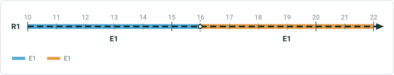

| Event ID | E1 | E1 | E1 |
| --- | --- | --- | --- |
| Route ID | R1 | R1 | R1 |
| Measure | 10 | 10 | 16 |
| To Measure | 22 | 16 | 22 |
| From Date | 1/1/2000 | 3/29/2022 | 3/29/2022 |
| To Date | 3/29/2022 | Null | Null |
| Attribute 1 | split | split1 | split |
| Attribute2 | event | event1 | event |

Test case for UI automation

## Case 2: Positive - Nonline Network – Non Spanning Line Event <!-- slide 5 -->

### Loop

**Loop – Split measure: 20**
current date: 3/29/2022

| Route ID | From Date | To Date |
| --- | --- | --- |
| R1 | 1/1/2000 | Null |

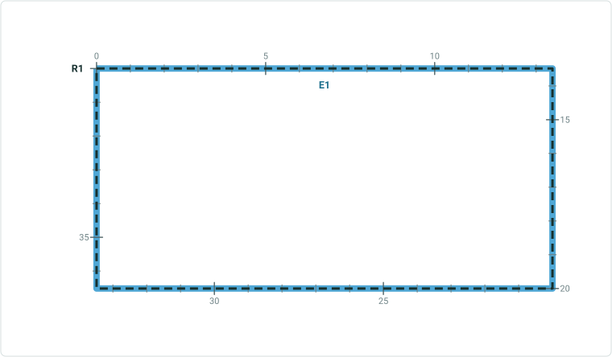

| Event ID | E1 |
| --- | --- |
| Route ID | R1 |
| Measure | 0 |
| To Measure | 40 |
| From Date | 1/1/2000 |
| To Date | Null |
| Attribute 1 | split |
| Attribute2 | event |

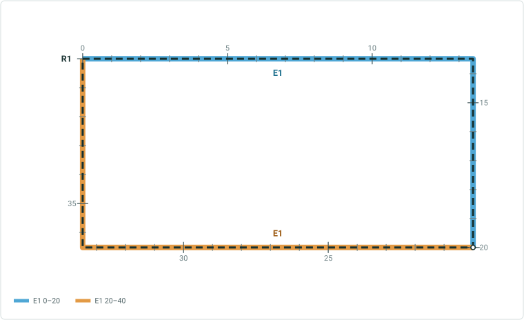

| Event ID | E1 | E1 | E1 |
| --- | --- | --- | --- |
| Route ID | R1 | R1 | R1 |
| Measure | 0 | 0 | 20 |
| To Measure | 40 | 20 | 40 |
| From Date | 1/1/2000 | 3/29/2022 | 3/29/2022 |
| To Date | 3/29/2022 | Null | Null |
| Attribute 1 | split | split1 | split |
| Attribute2 | event | event1 | event |

 

## Case 3: Positive - Nonline Network – Non Spanning Line Event <!-- slide 6 -->

### Lollipop

**Lollipop – Split measure: 30**
current date: 3/29/2022

| Route ID | From Date | To Date |
| --- | --- | --- |
| R1 | 1/1/2000 | Null |

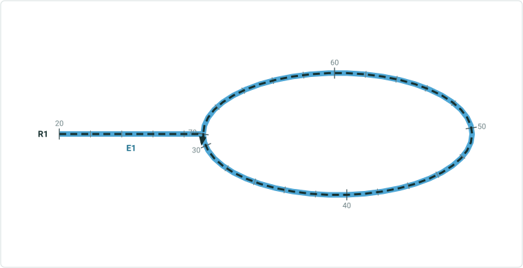

| Event ID | E1 |
| --- | --- |
| Route ID | R1 |
| Measure | 20 |
| To Measure | 70 |
| From Date | 1/1/2000 |
| To Date | Null |
| Attribute 1 | Split |
| Attribute2 | Event |

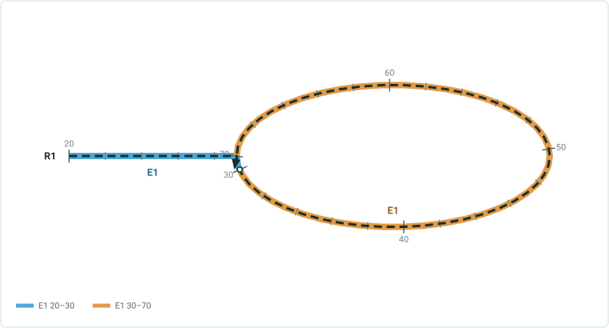

| Event ID | E1 | E1 | E1 |
| --- | --- | --- | --- |
| Route ID | R1 | R1 | R1 |
| Measure | 20 | 20 | 30 |
| To Measure | 70 | 30 | 70 |
| From Date | 1/1/2000 | 3/29/2022 | 3/29/2022 |
| To Date | 3/29/2022 | Null | Null |
| Attribute 1 | Split | Split1 | Split |
| Attribute2 | Event | Event1 | Event |

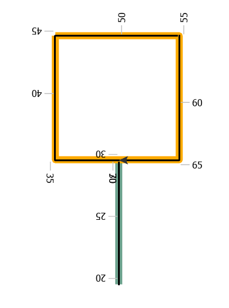 

## Case 4: Positive - Nonline Network – Non Spanning Line Event <!-- slide 7 -->

### Branch

**Branch – Split measure: 28**
current date: 3/29/2022

| Route ID | From Date | To Date |
| --- | --- | --- |
| R1 | 1/1/2000 | Null |


| Event ID | E1 |
| --- | --- |
| Route ID | R1 |
| Measure | 0 |
| To Measure | 48 |
| From Date | 1/1/2000 |
| To Date | Null |
| Attribute 1 | Split |
| Attribute2 | Event |

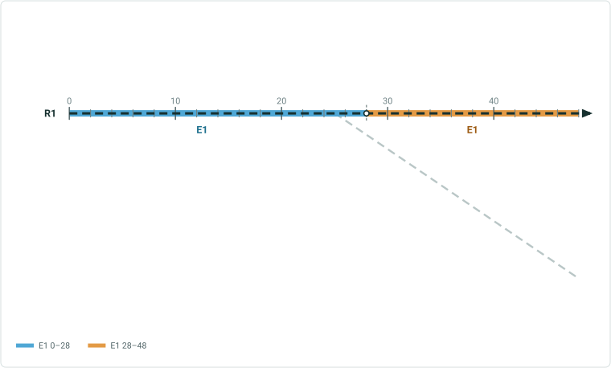

| Event ID | E1 | E1 | E1 |
| --- | --- | --- | --- |
| Route ID | R1 | R1 | R1 |
| Measure | 0 | 0 | 28 |
| To Measure | 48 | 28 | 48 |
| From Date | 1/1/2000 | 3/29/2022 | 3/29/2022 |
| To Date | 3/29/2022 | Null | Null |
| Attribute 1 | Split | Split1 | Split |
| Attribute2 | Event | Event1 | Event |

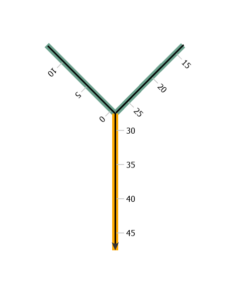 

## Case 5: Positive - Nonline Network – Non Spanning Line Event <!-- slide 8 -->

### Branch

**Branch – Split measure: 25**
current date: 3/29/2022

| Route ID | From Date | To Date |
| --- | --- | --- |
| R1 | 1/1/2000 | Null |

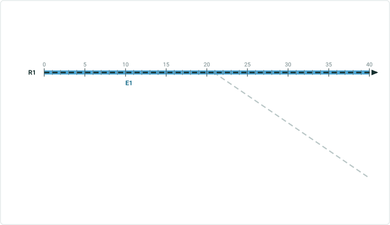

| Event ID | E1 |
| --- | --- |
| Route ID | R1 |
| Measure | 0 |
| To Measure | 40 |
| From Date | 1/1/2000 |
| To Date | Null |
| Attribute 1 | Split |
| Attribute2 | Event |

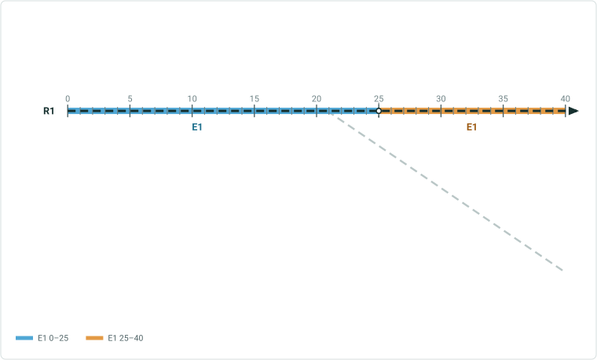

| Event ID | E1 | E1 | E1 |
| --- | --- | --- | --- |
| Route ID | R1 | R1 | R1 |
| Measure | 0 | 0 | 25 |
| To Measure | 40 | 25 | 40 |
| From Date | 1/1/2000 | 3/29/2022 | 3/29/2022 |
| To Date | 3/29/2022 | Null | Null |
| Attribute 1 | Split | Split1 | Split |
| Attribute2 | Event | Event1 | Event |

Modify this test case to have the event is from measure 5 to measure 35.

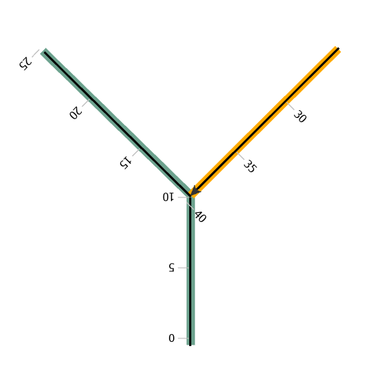 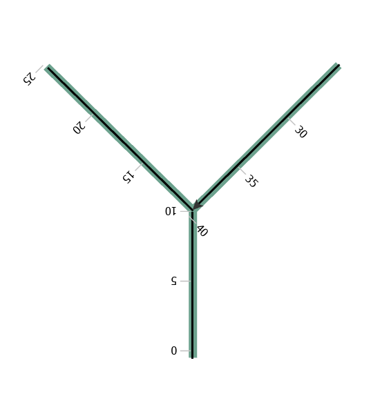

## Case 6: Positive - Nonline Network – Non Spanning Line Event <!-- slide 9 -->

### Alpha

**Alpha– Split measure: 40**
current date: 3/29/2022

| Route ID | From Date | To Date |
| --- | --- | --- |
| R1 | 1/1/2000 | Null |

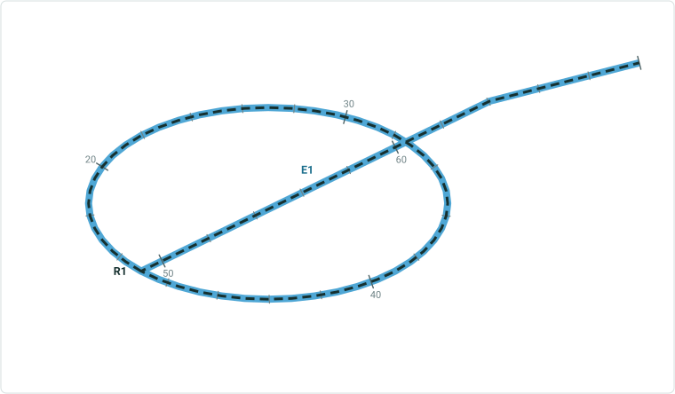

| Event ID | E1 |
| --- | --- |
| Route ID | R1 |
| Measure | 15 |
| To Measure | 70 |
| From Date | 1/1/2000 |
| To Date | Null |
| Attribute 1 | Split |
| Attribute2 | Event |

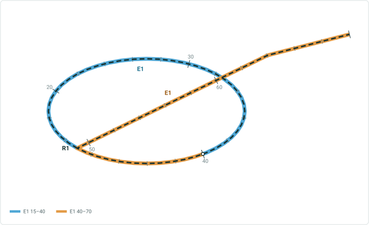

| Event ID | E1 | E1 | E1 |
| --- | --- | --- | --- |
| Route ID | R1 | R1 | R1 |
| Measure | 15 | 15 | 40 |
| To Measure | 70 | 40 | 70 |
| From Date | 1/1/2000 | 3/29/2022 | 3/29/2022 |
| To Date | 3/29/2022 | Null | Null |
| Attribute 1 | Split | Split1 | Split |
| Attribute2 | Event | Event1 | Event |

 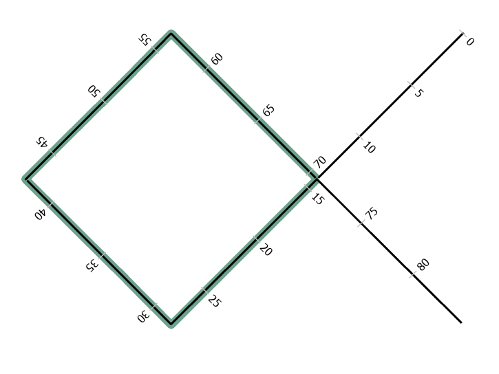

## Case 8: Positive - Nonline Network – Non Spanning Line Event <!-- slide 10 -->

### Gap

**Gap– Split measure: 10**
Current date: 3/29/2022

| Route ID | From Date | To Date |
| --- | --- | --- |
| R1 | 1/1/2000 | Null |

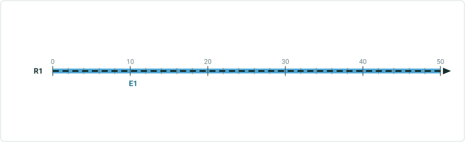

| Event ID | E1 |
| --- | --- |
| Route ID | R1 |
| Measure | 0 |
| To Measure | 50 |
| From Date | 1/1/2000 |
| To Date | Null |
| Attribute 1 | Split |
| Attribute2 | Event |

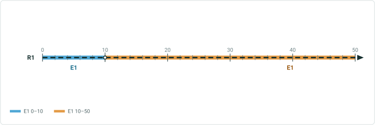

| Event ID | E1 | E1 | E1 |
| --- | --- | --- | --- |
| Route ID | R1 | R1 | R1 |
| Measure | 0 | 0 | 20 |
| To Measure | 50 | 10 | 50 |
| From Date | 1/1/2000 | 3/29/2022 | 3/29/2022 |
| To Date | 3/29/2022 | Null | Null |
| Attribute 1 | Split | Split1 | Split |
| Attribute2 | Event | Event1 | Event |

Modify this test case to have the event only in one part of the gapped event and split that event

## Case 7: Positive - Nonline Network – Non Spanning Line Event <!-- slide 11 -->

### Infinity

**Infinity– Split measure: 40**
Current date: 3/29/2022

current date: 3/29/2022

| Route ID | From Date | To Date |
| --- | --- | --- |
| R1 | 1/1/2000 | Null |

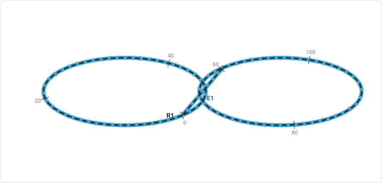

| Event ID | E1 |
| --- | --- |
| Route ID | R1 |
| Measure | 0 |
| To Measure | 112 |
| From Date | 1/1/2000 |
| To Date | Null |
| Attribute 1 | Split |
| Attribute2 | Event |

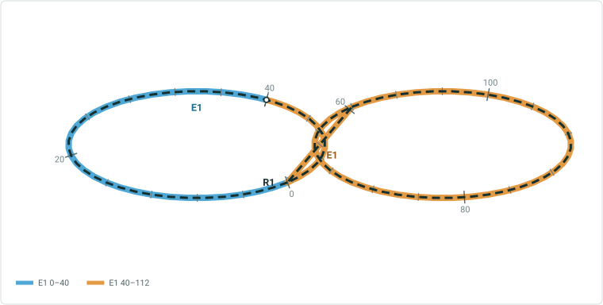

| Event ID | E1 | E1 | E1 |
| --- | --- | --- | --- |
| Route ID | R1 | R1 | R1 |
| Measure | 0 | 0 | 40 |
| To Measure | 112 | 40 | 112 |
| From Date | 1/1/2000 | 3/29/2022 | 3/29/2022 |
| To Date | 3/29/2022 | Null | Null |
| Attribute 1 | Split | Split1 | Split |
| Attribute2 | Event | Event1 | Event |

## Case 9: Positive - Nonline Network – Non Spanning Line Event <!-- slide 12 -->

### Changing the From and To Date

Split measure: 25
From date: 1/1/2010
To date: 1/1/2020

| Route ID | From Date | To Date |
| --- | --- | --- |
| R1 | 1/1/2000 | Null |

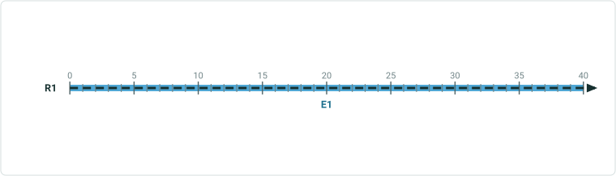

| Event ID | E1 |
| --- | --- |
| Route ID | R1 |
| Measure | 0 |
| To Measure | 40 |
| From Date | 1/1/2000 |
| To Date | Null |
| Attribute 1 | Split |
| Attribute2 | Event |

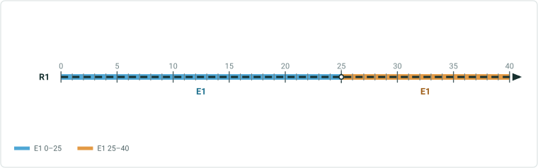

| Event ID | E1 | E1 | E1 |
| --- | --- | --- | --- |
| Route ID | R1 | R1 | R1 |
| Measure | 0 | 0 | 25 |
| To Measure | 40 | 25 | 40 |
| From Date | 1/1/2000 | 1/1/2010 | 1/1/2010 |
| To Date | 1/1/2010 | 1/1/2020 | 1/1/2020 |
| Attribute 1 | Split | Split1 | Split2 |
| Attribute2 | Event | Event1 | Event2 |

Modify this test case to have the event is from measure 5 to measure 35.

## Case 10: Positive - Nonline Network – Non Spanning Line Event <!-- slide 13 -->

### Vertical Route

Split measure: 4.5
Current date : 3/29/2022

| Route ID | From Date | To Date |
| --- | --- | --- |
| R1 | 1/1/2000 | Null |

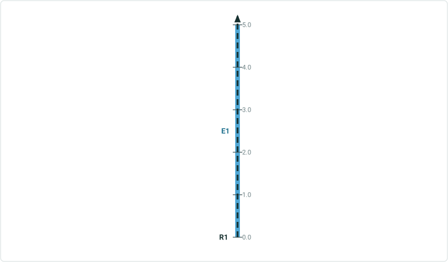

| Event ID | E1 |
| --- | --- |
| Route ID | R1 |
| Measure | 0 |
| To Measure | 5 |
| From Date | 1/1/2000 |
| To Date | Null |
| Attribute 1 | Split |
| Attribute2 | Event |

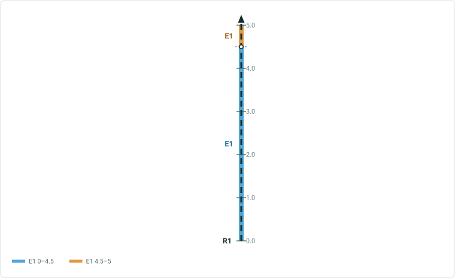

| Event ID | E1 | E1 | E1 |
| --- | --- | --- | --- |
| Route ID | R1 | R1 | R1 |
| Measure | 0 | 0 | 4.5 |
| To Measure | 5 | 4.5 | 5 |
| From Date | 1/1/2000 | 3/29/2022 | 3/29/2022 |
| To Date | 3/29/2022 | null | null |
| Attribute 1 | Split | Split1 | Split2 |
| Attribute2 | Event | Event1 | Event2 |

## Case 11: Positive - Line Network – Spanning Line Event <!-- slide 14 -->

### Normal Route

**Normal route - Split measure: 52.5**
Current date: 3/29/2022

| Route ID | From Date | To Date |
| --- | --- | --- |
| R1L3 | 1/1/2000 | Null |
| R2L3 | 1/1/2000 | Null |
| R3L3 | 1/1/2000 | Null |

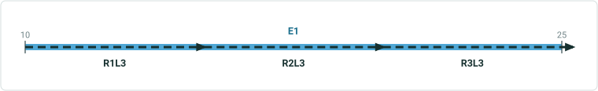

| Event ID | E1 |
| --- | --- |
| From RID | R1L3 |
| From Measure | 10 |
| To RouteID | R3L3 |
| To Measure | 25 |
| From Date | 1/1/2000 |
| To Date | Null |
| Attribute 1 | split |
| Attribute2 | event |

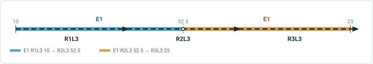

| Event ID | E1 | E1 | E1 |
| --- | --- | --- | --- |
| From RID | R1L3 | R1L3 | R2L3 |
| From Measure | 10 | 10 | 52.5 |
| To RouteID | R3L3 | R2L3 | R3L3 |
| To Measure | 25 | 52.5 | 25 |
| From Date | 1/1/2000 | 3/29/2022 | 3/29/2022 |
| To Date | 3/29/2022 | Null | Null |
| Attribute 1 | split | split1 | split |
| Attribute2 | event | event1 | event |

Test case for UI automation

## Case 12: Positive - Line Network – Spanning Line Event <!-- slide 15 -->

### Routes in Loop

**Routes in loop - Split measure: 20/50**
Current date: 3/29/2022
Route Picker should show up.

| Route ID | From Date | To Date |
| --- | --- | --- |
| R1L1 | 1/1/2000 | Null |
| R2L1 | 1/1/2000 | Null |


| Event ID | E1 |
| --- | --- |
| From RID | R1L1 |
| From Measure | 0 |
| To RouteID | R2L1 |
| To Measure | 70 |
| From Date | 1/1/2000 |
| To Date | Null |
| Attribute 1 | split |
| Attribute2 | event |

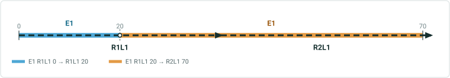

| Event ID | E1 | E1 | E1 |
| --- | --- | --- | --- |
| From RID | R1L1 | R1L1 | R2L1 |
| From Measure | 0 | 0 | 50 |
| To RouteID | R2L1 | R1L1 | R2L1 |
| To Measure | 70 | 20 | 70 |
| From Date | 1/1/2000 | 3/29/2022 | 3/29/2022 |
| To Date | 3/29/2022 | Null | Null |
| Attribute 1 | split | split1 | split |
| Attribute2 | event | event1 | event |

## Case 13: Positive - Line Network – Spanning Line Event <!-- slide 16 -->

### Routes in Lollipop

**Routes in lollipop - Split measure: 10**
Current date: 3/29/2022
Measure picker should show up.

| Route ID | From Date | To Date |
| --- | --- | --- |
| R1L1 | 1/1/2000 | Null |
| R2L1 | 1/1/2000 | Null |
| R3L1 | 1/1/2000 | Null |

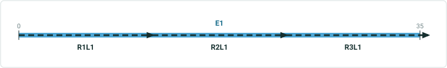

| Event ID | E1 |
| --- | --- |
| From RID | R1L1 |
| From Measure | 0 |
| To RouteID | R3L1 |
| To Measure | 35 |
| From Date | 1/1/2000 |
| To Date | Null |
| Attribute 1 | split |
| Attribute2 | event |

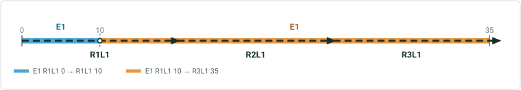

| Event ID | E1 | E1 | E1 |
| --- | --- | --- | --- |
| From RID | R1L1 | R1L1 | R1L1 |
| From Measure | 0 | 0 | 10 |
| To RouteID | R3L1 | R1L1 | R3L1 |
| To Measure | 35 | 10 | 35 |
| From Date | 1/1/2000 | 3/29/2022 | 3/29/2022 |
| To Date | 3/29/2022 | Null | Null |
| Attribute 1 | split | split1 | split |
| Attribute2 | event | event1 | event |

## Case 14: Positive - Line Network – Spanning Line Event <!-- slide 17 -->

### Routes in Infinity

**Routes in infinity - Split measure: 10 (R2L1)**
Current date: 3/29/2022

| Route ID | From Date | To Date |
| --- | --- | --- |
| R1L1 | 1/1/2000 | Null |
| R2L1 | 1/1/2000 | Null |
| R3L1 | 1/1/2000 | Null |

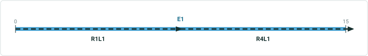

| Event ID | E1 |
| --- | --- |
| From RID | R1L1 |
| From Measure | 0 |
| To RouteID | R4L1 |
| To Measure | 15 |
| From Date | 1/1/2000 |
| To Date | Null |
| Attribute 1 | split |
| Attribute2 | event |

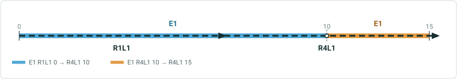

| Event ID | E1 | E1 | E1 |
| --- | --- | --- | --- |
| From RID | R1L1 | R1L1 | R2L1 |
| From Measure | 0 | 0 | 10 |
| To RouteID | R4L1 | R2L1 | R4L1 |
| To Measure | 15 | 10 | 15 |
| From Date | 1/1/2000 | 3/29/2022 | 3/29/2022 |
| To Date | 3/29/2022 | Null | Null |
| Attribute 1 | split | split1 | split |
| Attribute2 | event | event1 | event |

## Case 15: Positive - Line Network – Spanning Line Event <!-- slide 18 -->

### Reverse Routes

**Reverse routes - Split measure: 10 (R1L1)**
Current date: 3/29/2022
Route picker will show up ?
output event after split will follow the route direction.

| Route ID | From Date | To Date |
| --- | --- | --- |
| R1L1 | 1/1/2000 | Null |
| R2L1 | 1/1/2000 | Null |

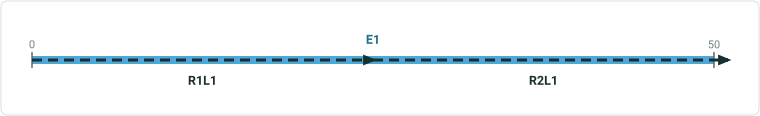

| Event ID | E1 |
| --- | --- |
| From RID | R1L1 |
| From Measure | 0 |
| To RouteID | R2L1 |
| To Measure | 50 |
| From Date | 1/1/2000 |
| To Date | Null |
| Attribute 1 | split |
| Attribute2 | event |


| Event ID | E1 | E1 | E1 |
| --- | --- | --- | --- |
| From RID | R1L1 | R1L1 | R2L1 |
| From Measure | 0 | 0 | 50 |
| To RouteID | R2L1 | R1L1 | R2L1 |
| To Measure | 50 | 10 | 60 |
| From Date | 1/1/2000 | 3/29/2022 | 3/29/2022 |
| To Date | 3/29/2022 | Null | Null |
| Attribute 1 | split | split1 | split |
| Attribute2 | event | event1 | event |

## Case 16: Positive - Line Network – Spanning Line Event <!-- slide 19 -->

### Gapped Routes

**Gapped routes - Split measure: 120 (R2L1)**
Current date: 3/29/2022

| Route ID | From Date | To Date |
| --- | --- | --- |
| R1L1 | 1/1/2000 | Null |
| R2L1 | 1/1/2000 | Null |

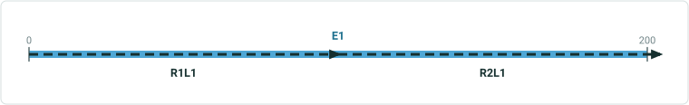

| Event ID | E1 |
| --- | --- |
| From RID | R1L1 |
| From Measure | 0 |
| To RouteID | R2L1 |
| To Measure | 200 |
| From Date | 1/1/2000 |
| To Date | Null |
| Attribute 1 | split |
| Attribute2 | event |

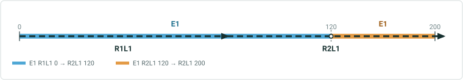

| Event ID | E1 | E1 | E1 |
| --- | --- | --- | --- |
| From RID | R1L1 | R1L1 | R2L1 |
| From Measure | 0 | 0 | 120 |
| To RouteID | R2L1 | R2L1 | R2L1 |
| To Measure | 200 | 120 | 200 |
| From Date | 1/1/2000 | 3/29/2022 | 3/29/2022 |
| To Date | 3/29/2022 | Null | Null |
| Attribute 1 | split | split1 | split |
| Attribute2 | event | event1 | event |

## Case 17: Positive - Line Network – Spanning Line Event <!-- slide 20 -->

### Reverse Route

**Reverse Route- Splitting measure 0(R3L1) or 100 (R4L1)**
Current date: 3/29/2022

| Route ID | From Date | To Date |
| --- | --- | --- |
| R1L1 | 1/1/2000 | Null |
| R2L1 | 1/1/2000 | Null |
| R3L1 | 1/1/2000 | Null |
| R4L1 | 1/1/2000 | Null |
| R5L1 | 1/1/2000 | Null |

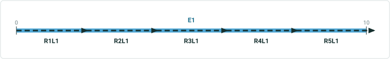

| Event ID | E1 |
| --- | --- |
| From RID | R1L1 |
| From Measure | 0 |
| To RouteID | R5L1 |
| To Measure | 10 |
| From Date | 1/1/2000 |
| To Date | Null |
| Attribute 1 | split |
| Attribute2 | event |

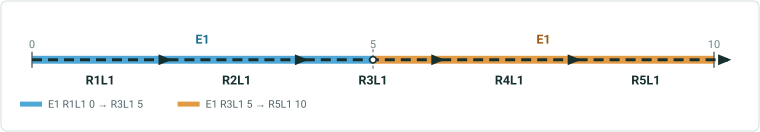

| Event ID | E1 | E1 | E1 |
| --- | --- | --- | --- |
| From RID | R1L1 | R1L1 | R3L1 |
| From Measure | 0 | 0 | 0 |
| To RouteID | R5L1 | R3L1 | R5L1 |
| To Measure | 10 | 0 | 10 |
| From Date | 1/1/2000 | 3/29/2022 | 3/29/2022 |
| To Date | 3/29/2022 | Null | Null |
| Attribute 1 | split | split1 | split |
| Attribute2 | event | event1 | event |

## Case 18: Positive - Line Network – Spanning Line Event <!-- slide 21 -->

### Branch Route

**Branch Route – split measure 20 of R1L1**
Current date : 03/29/2022

| Route ID | From Date | To Date |
| --- | --- | --- |
| R1L1 | 1/1/2000 | Null |
| R2L1 | 1/1/2000 | Null |

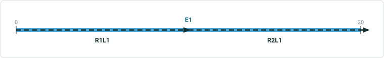

| Event ID | E1 |
| --- | --- |
| From RID | R1L1 |
| From Measure | 0 |
| To RouteID | R2L1 |
| To Measure | 20 |
| From Date | 1/1/2000 |
| To Date | Null |
| Attribute 1 | split |
| Attribute2 | event |

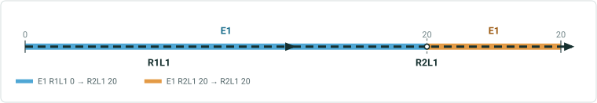

| Event ID | E1 | E1 | E1 |
| --- | --- | --- | --- |
| From RID | R1L1 | R1L1 | R1L1 |
| From Measure | 0 | 0 | 20 |
| To RouteID | R2L1 | R1L1 | R2L1 |
| To Measure | 20 | 20 | 20 |
| From Date | 1/1/2000 | 3/29/2022 | 3/29/2022 |
| To Date | 3/29/2022 | Null | Null |
| Attribute 1 | split | split1 | split |
| Attribute2 | event | event1 | event |

Modify this test case to have the event is from measure 5 of R1L1 to measure 10 of R2L1.

## Case 19: Positive - Line Network – Spanning Line Event <!-- slide 22 -->

### Vertical Route

**Vertical route – splitting measure 11.5 (R2L1)**
 Current date : 03/29/2022

| Route ID | From Date | To Date |
| --- | --- | --- |
| R1L1 | 1/1/2000 | Null |
| R2L1 | 1/1/2000 | Null |
| R3L1 | 1/1/2000 | Null |
| R4L1 | 1/1/2000 | Null |

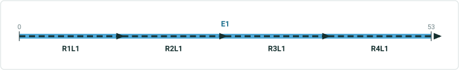

| Event ID | E1 |
| --- | --- |
| From RID | R1L1 |
| From Measure | 0 |
| To RouteID | R4L1 |
| To Measure | 53 |
| From Date | 1/1/2000 |
| To Date | Null |
| Attribute 1 | split |
| Attribute2 | event |

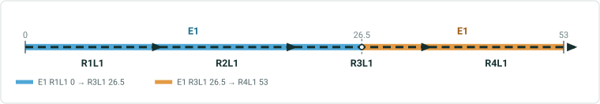

| Event ID | E1 | E1 | E1 |
| --- | --- | --- | --- |
| From RID | R1L1 | R1L1 | R2L1 |
| From Measure | 0 | 0 | 11.5 |
| To RouteID | R4L1 | R2L1 | R4L1 |
| To Measure | 53 | 11.5 | 53 |
| From Date | 1/1/2000 | 3/29/2022 | 3/29/2022 |
| To Date | 3/29/2022 | Null | Null |
| Attribute 1 | split | split1 | split |
| Attribute2 | event | event1 | event |

## Case 20: Positive - Line Network – Spanning Line Event <!-- slide 23 -->

### Changing From / To Date

**Route – Changing from/ To date Split measure: 105(R2L1)**
From date: 1/1/2010
To date: 1/1/2020

| Route ID | From Date | To Date |
| --- | --- | --- |
| R1L1 | 1/1/2000 | Null |
| R2L1 | 1/1/2000 | Null |


| Event ID | E1 |
| --- | --- |
| From RID | R1L1 |
| From Measure | 0 |
| To RouteID | R2L1 |
| To Measure | 110 |
| From Date | 1/1/2000 |
| To Date | Null |
| Attribute 1 | split |
| Attribute2 | event |

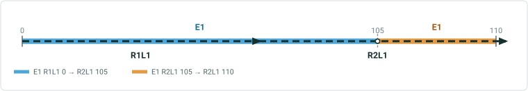

| Event ID | E1 | E1 | E1 |
| --- | --- | --- | --- |
| From RID | R1L1 | R1L1 | R2L1 |
| From Measure | 0 | 0 | 105 |
| To RouteID | R2L1 | R2L1 | R2L1 |
| To Measure | 110 | 105 | 110 |
| From Date | 1/1/2000 | 1/1/2010 | 1/1/2010 |
| To Date | 1/1/2010 | 1/1/2020 | 1/1/2020 |
| Attribute 1 | split | split1 | Split2 |
| Attribute2 | event | event1 | event2 |

Modify this test case to have the event is from measure 5  in R1L1 to measure  108. Of R2L1

## Conflict Prevention test cases <!-- slide 24 -->

| User1 is in Version1 and splitting events in Event1 layer |  |  |  |  |
| --- | --- | --- | --- | --- |
|  | User 1 Version1 | User1 Version2 | User2 VersionA | Result |
| Event1 |  |  |  | Lock acquired and split events |
| Route/Line lock |  |  |  | Lock acquired and split events |
| Event1 |  | Locked |  | Lock cannot be acquired |
| Route/Line lock |  |  | Locked and version in use | Lock cannot be acquired |
| Event1 |  |  | Locked and version not in use | Transfer lock and split events |
| Event1 |  | Locked event2 |  | Lock for event1 acquired and split events |
| Event1 |  | Locked event1 and version not in use |  | Transfer lock and split events |

Conflict Prevention test cases
User1 is editing event in Version1

Check with one or two cases with Reconcile required options. If reconcile is required then message should be displayed and should not allow the user to acquire lock without reconciling displaying error message.

Other test cases

- Editing attributes
- Range domain values, coded domain values and subtypes, contingent values and attribute rules should be honoured.

## Negative test cases <!-- slide 25 -->

Negative test cases will be tested for both spanning and non-spanning events.

| Test Case | Expected Result | Error message |
| --- | --- | --- |
| Split at a location where more than one line event exist – Test case for UI automation | Show error message |  |
| Selected measure is the endpoint/beginning point of an event |  |  |
| Split using core split, divide, clip tools |  | Can be edited only using LR tools |
| Route ID does not exist |  | Route ID cannot be validated |
| Changing From Date/ To date out of the route range |  |  |
| RouteID is null |  |  |
| Measure is null |  |  |
| Measure is out of range of route |  |  |
| From Date is null |  | Please enter a valid From date |
| In the attributes, enter a value not in range /coded domain |  |  |
| In the attributes make null for a non- nullable field |  |  |
| In the attributes, enter a value overruling attribute rule |  |  |
| In the attributes with contigent values enter a value which does not fall under the restricted value |  |  |
