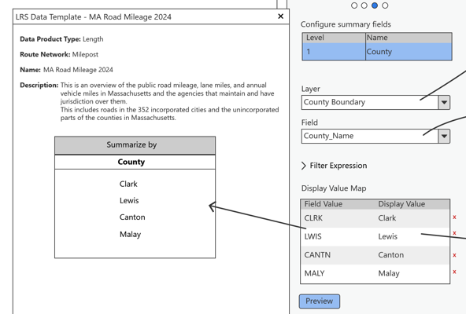

# Support a single summary field in LRS Data Template wizard – Test Plan

|   |   |
| --- | --- |
| **Kind** | Test Plan · Pro |
| **Release** | — |
| **Product** | Roads & Highways · Pipeline Referencing |
| **Issue** | [ArcGISPro/ps-location-referencing#5774](https://devtopia.esri.com/ArcGISPro/ps-location-referencing/issues/5774) |
| **Source** | [SingleSummaryField_Testplan2.pptx](<https://esriis.sharepoint.com/sites/LocationReferencing/Shared%20Documents/General/Test%20Plans/SingleSummaryField_Testplan2.pptx>) |
| **Edited** | 2024-07-24 22:01 by Claire Wang |
| **Extracted** | 2026-09-04 · lane `xmlstrip` |

<!-- metadata
```yaml
title: "Support a single summary field in LRS Data Template wizard – Test Plan"
source_file: "SingleSummaryField_Testplan2.pptx"
source_url: "https://esriis.sharepoint.com/sites/LocationReferencing/Shared%20Documents/General/Test%20Plans/SingleSummaryField_Testplan2.pptx"
doc_id: 347
doc_kind: "Test Plan"
surface: "Pro"
doc_revision: ""
target_release: ""
pe: "Claire"
dev: "Sharon"
author: "Lakshmi Ananthanarayanan"
last_edited_by: "Claire Wang"
last_edited: "2024-07-24T22:01:23Z"
extracted: 2026-09-04
extraction_lane: xmlstrip
prompt_version: "v2.0.2"
keywords: ["summary field", "data template", "test plan", "template wizard", "field validation", "display value map", "filter expression"]
tools: ["LRS Data Template wizard"]
products: ["Roads & Highways", "Pipeline Referencing"]
issues: ["ArcGISPro/ps-location-referencing#5774"]
related: [{"doc":323,"file":"support-multiple-summary-fields-in-lrs-data-template-wizard-test-plan__doc323.md","s":12.438},{"doc":354,"file":"lrs-data-template-wizard-test-plan__doc354.md","s":6.302},{"doc":256,"file":"route-log-data-product-template-test-plan__doc256.md","s":6.094},{"doc":355,"file":"lrs-data-template-preview-test-plan__doc355.md","s":5.917},{"doc":322,"file":"support-length-fields-using-unique-values-in-lrs-data-template-wizard-test-plan__doc322.md","s":5.804}]
```
-->

## Summary

Test plan for adding and verifying a single summary field feature in the LRS Data Template wizard. Covers UI and functionality verification, error handling, template loading and saving, and testing across various geodatabases and network types. Includes positive and negative test cases to validate expected behavior and error messages.

## Related documents

<!-- related:begin -->
- [Support multiple summary fields in LRS Data Template wizard – Test Plan](<https://esriis.sharepoint.com/sites/lrsworkspace/LRS Doc Index/Test Plans/support-multiple-summary-fields-in-lrs-data-template-wizard-test-plan__doc323.md>) — similar text 0.79 · 3 title words · 2 filename words · same kind/surface/pe/dev/folder <!-- rel:323 -->
- [LRS Data Template wizard – Test Plan](<https://esriis.sharepoint.com/sites/lrsworkspace/LRS Doc Index/Test Plans/lrs-data-template-wizard-test-plan__doc354.md>) — similar text 0.50 · 1 title word · 1 filename word · same kind/surface/pe/dev/folder <!-- rel:354 -->
- [Route Log data product template – Test Plan](<https://esriis.sharepoint.com/sites/lrsworkspace/LRS Doc Index/Test Plans/route-log-data-product-template-test-plan__doc256.md>) — similar text 0.43 · 1 filename word · same kind/surface/pe/dev/folder <!-- rel:256 -->
- [LRS Data Template Preview – Test Plan](<https://esriis.sharepoint.com/sites/lrsworkspace/LRS Doc Index/Test Plans/lrs-data-template-preview-test-plan__doc355.md>) — similar text 0.42 · 1 filename word · same kind/surface/pe/dev/folder <!-- rel:355 -->
- [Support length fields using unique values in LRS Data Template wizard – Test Plan](<https://esriis.sharepoint.com/sites/lrsworkspace/LRS Doc Index/Test Plans/support-length-fields-using-unique-values-in-lrs-data-template-wizard-test-plan__doc322.md>) — similar text 0.48 · 2 title words · 1 filename word · same kind/surface/dev/folder <!-- rel:322 -->
<!-- related:end -->

<!-- docs:begin -->
## Esri documentation

[Create a template for an LRS length data product](https://doc.esri.com/en/arcgis-pro/latest/help/production/roads-highways/create-a-template-for-an-lrs-length-data-product.html)

_No page matched:_ [LRS Data Template wizard](https://www.google.com/search?q=%22LRS%20Data%20Template%20wizard%22+site%3Adoc.esri.com)
<!-- docs:end -->

---

## Slide 1 — Support a single summary field in LRS Data Template wizard – Test Plan

https://devtopia.esri.com/ArcGISPro/ps-location-referencing/issues/5774

PE: Claire
Dev: Sharon

## Slide 2

UI verification

- Add a third pane in LRS Data Template wizard
  - When Network and Name from the 2nd page are missing, users cannot enter this pane (disable Next button)
- Verify parameters and texts are aligned


## Slide 3


Functionality Verification

- When users first enter the 3rd pane, show a table with Level 1 and an empty, grey, non-editable Name. Layer, Field, Filter, and Display Field Map are also empty.
  - In Layer and Field dropdowns, there is also an empty option.
- After selecting Layer, Field is still empty.
- Once Field is selected, the Name in step 1 is populated as the field alias and it becomes a white editable field. Field Map is also populated.
  - Preview canvas shows Name under “Summarize by” once Layer, Field, and Name are populated
  - User can change the Name. Preview canvas reflects Name change
    - Only 1 summary field is supported in this user story
    - Use a counter for level 1. The level # is not editable
    - Name is limited to 50 characters
    - If the user deletes the entire Name, Name errors out and Next and Finish buttons become grey disabled. (aka Name cannot be empty once a Field has been chosen and Name becomes editable. It can be empty as a non-editable box if Field is empty)



## Slide 4


Functionality Verification

- Select summary layer.
  - The dropdown lists the contents in TOC’s order and show the name listed in the TOC + an empty option
  - In Layer dropdown, we only show polygon layers, Line Events that are registered with the network in the 2nd pane, and only one Network that is chosen in the 2nd page. Polygon and events should be in the same gdb and in the same projection as the network in the 2nd pane. Layers that do not meet these criteria are not shown
  - If the bullet above is not doable (cannot filter layers in dropdown), we should validate the layer at some point
- Select Field
  - The dropdown list the fields from the Layer selected above, except system fields + an empty option
- Once Layer and Fields are selected, Display Value Map table is automatically populated with Field Values and Display Values, and the canvas lists Display Values in the box
  - The Display Value Map table shows the unique values from the Field selected above
  - By default, Field Value = Display Value. Field Value is not editable. Display Value is editable. Use Delete button to remove a field.
    - Display value cannot exceed 50 characters (cannot type after 50)
    - Display value cannot be empty. If user manually deletes it, once they lose focus, the Display value shows Field vale
    - If null is one of the unique values, show null in both cells. The null in Displayed value can be changed
    - The canvas reflects changes in Display Value
  - Show a vertical scroll bar after the first 10 rows for display value map.
    - Keep the canvas in-sync with the scrolling experience
- When everything is populated and user changes the Layer or choose the empty option for Field, Field, Filter (if populated), Field map, and Name will reset to empty.


## Slide 5


Functionality Verification

- By default, Filter Expression is collapsed. When expanded –
  - Show the filtering functionalities
  - Once Apply, the filter is sent to Display Value Map and the Canvas
- Updating Display Value Map
  - Without Filter, all unique values are present and user uses Delete button to remove a value
  - With Filter, when users want to add a Field Value, they should add it in Filter and Apply.
  - With Filter, when users want to remove a Field Value, they can either remove it in Filter and Apply (so Filter and Display Field Map sync), or simply remove from Field Map. For the latter, the change does not go back to Filter, so Filter and Display Field Map do not sync, but it's fine since we save both info. But if they Apply again in Filter, it does update the Field Map.


## Slide 6

Functionality Verification

- If the user reloads an existing Json file, then the summary info parameters should be filled
  - When Layer/Field in the existing json is missing from the map, show an error for the Layer/Field and provide a dropdown for the user to choose a valid value (use same behavior in page 2 – Network)
  - If Name or Display Value is over 50 characters, only the first 50 characters are brought into wizard
- User can save a template with nothing in display field map (e.g. they use a filter that returns 0 result or delete everything in field map), save a template with a Layer and an empty Field (this saves the layer in json but it technically does not do anything in GP), or simple not enter anything in the 3rd pane. In this case, the summary field is RID or Rname.
- Click Finish to save/overwrite json. json is saved with Field, Layer, Filter, and Display Field Map information.
- The canvas should continue to –
  - If the Canvas is open and a change is made, update the canvas upon losing focus from the updated parameter
  - If the Canvas is not open and a change is made, show the updated the canvas upon clicking the preview button.

## Slide 7

Testing

- Test in fgdb, egdb (oracle + sql), fs - default and child versions
- Test with nonline, Line, Derived network, PoM, and Addressing (sanity)
- Test with different type of summary layers such as single part polygon, multi part polygon, line events and networks.
- Test creating new template and opening and overwriting existing template
- The tool should recognize summary layer when it is checked off (invisible) in map
- Test when Layer does not exist in TOC or Field does not exist for Layer (by removing the Layer from map and importing an existing json that has wrong information)
- Test filter expression – load/save/remove/etc
- Test many Display fields as well as less than 10 display fields
- Test canvas behavior
- Test with dark and light theme
- 508 and i18n compliance
Automation: not yet
Doc: not yet

## Slide 8

| No | Test | Expected Result | Error Message |
| --- | --- | --- | --- |
| 1 | User provides invalid Description that exceeds 50 characters | Cannot type after 50 |  |
| 2 | Summary Name is deleted when a Field is chosen and Name is editable | Red box + Disabled Next and Finish + Hover an error message |  |
| 3 | User selects an existing template json with a missing Layer/Field | Red box + Disabled Next and Finish + Hover an error message + provide options in dropdown |  |
|  |  |  |  |
|  |  |  |  |
|  |  |  |  |

– Developer provides error messages
Negative cases/Error message verification

## Slide 9

| No. | Test case | Expected |
| --- | --- | --- |
| 1 | RH – summarize by boundary polygon | Template generated with correct fields. Canvas shows correct information. |
| 2 | RH – summarize by boundary polygon with changed display value, filter expression, and removed display value. | Template generated with correct fields. Canvas shows correct information. |
| 3 | RH – summarize by Route ID | Template generated with correct fields. Canvas shows correct information. |
| 4 | RH – summarize by a non-RID field with changed display value, filter expression, and modified display value. | Template generated with correct fields. Canvas shows correct information. |
| 5 | RH – summarize by a line event | Template generated with correct fields. Canvas shows correct information. |
| 6 | APR Engineering – summarize by boundary polygon | Template generated with correct fields. Canvas shows correct information. |
| 7 | APR Derived – summarize by boundary polygon with changed display value, filter expression, and modified display value. | Template generated with correct fields. Canvas shows correct information. |
| 8 | APR Engineering – summarize by Route Name | Template generated with correct fields. Canvas shows correct information. |
| 9 | APR Engineering – summarize by Line ID | Template generated with correct fields. Canvas shows correct information. |
| 10 | APR Derived – summarize by a non- Rname field with changed display value, filter expression, and modified display value. | Template generated with correct fields. Canvas shows correct information. |
| 11 | APR Engineering – summarize by a spanning line event | Template generated with correct fields. Canvas shows correct information. |
| 12 | APR Engineering – summarize by a non- spanning line event | Template generated with correct fields. Canvas shows correct information. |

Positive cases (test various dbs/FSs)

## Slide 10

| No. | Test case | Expected |
| --- | --- | --- |
| 13 | PoM – summarize by boundary polygon | Template generated with correct fields. Canvas shows correct information. |
| 14 | PoM – summarize by Route ID with changed display value, filter expression, and modified display value. | Template generated with correct fields. Canvas shows correct information. |
| 15 | PoM – summarize by a non-RID field with changed display value, filter expression, and modified display value. | Template generated with correct fields. Canvas shows correct information. |
| 16 | Open a template for RH and overwrite Name/Layer/Field/Filter/Displayed Values | Template is overwritten with changed inputs. Canvas shows correct information. |
| 17 | Open a template for APR-Engineering and overwrite Name/Layer/Field/Filter/Displayed Values | Template is overwritten with changed inputs. Canvas shows correct information. |
| 18 | Open a template for APR-Derived and overwrite Name/Layer/Field/Filter/Displayed Values | Template is overwritten with changed inputs. Canvas shows correct information. |
| 19 | Open a template for PoM and overwrite Name/Layer/Field/Filter/Displayed Values | Template is overwritten with changed inputs. Canvas shows correct information. |
| 20 | Switch map | Wizard verifies if populated contents are still valid for the current map. If not, error out corresponding fields |
| 21 | Close map before saving anything | Wizard is not closed but emptied. Nothing is saved or overwritten |
| 22 | Bring in existing file, Name exceeds 50 characters | No error. Description shows the first 50 characters. Save will overwrite and save only these 50 characters |

Positive cases (test various dbs/FSs)
