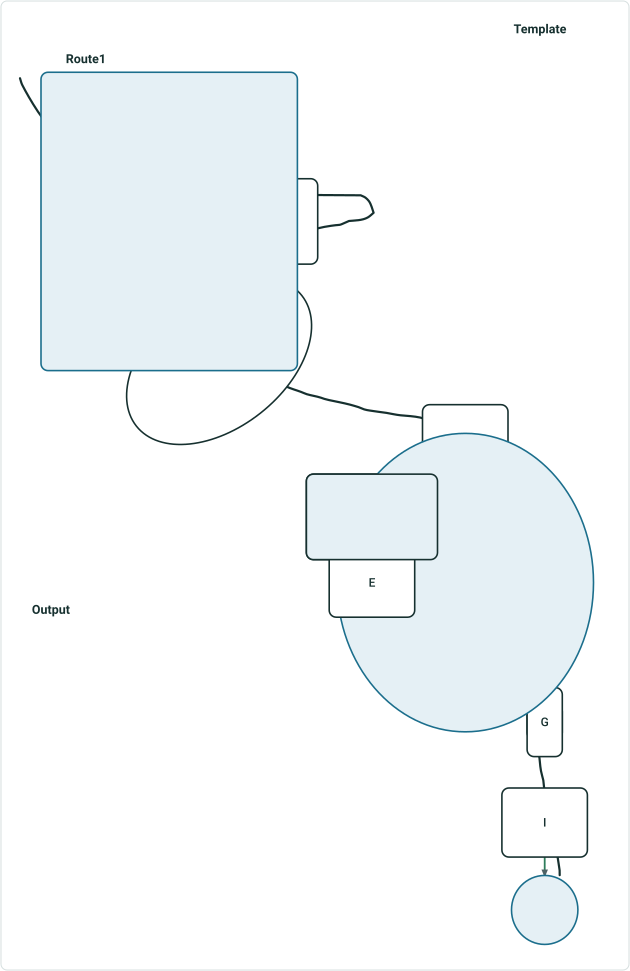
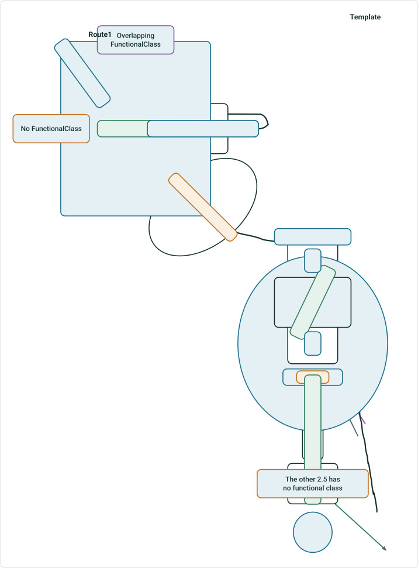

# Support multiple summary fields in Generate LRS Data Product – Test Plan

|   |   |
| --- | --- |
| **Kind** | Test Plan · Pro |
| **Release** | — |
| **Product** | Roads & Highways · Pipeline Referencing |
| **Issue** | [ArcGISPro/ps-location-referencing#5773](https://devtopia.esri.com/ArcGISPro/ps-location-referencing/issues/5773) |
| **Source** | [5773_GP_MultipleSummaryFields_Testplan.pptx](<https://esriis.sharepoint.com/sites/LocationReferencing/Shared%20Documents/General/Test%20Plans/5773_GP_MultipleSummaryFields_Testplan.pptx>) |
| **Edited** | 2024-08-29 22:55 by Claire Wang |
| **Extracted** | 2026-09-04 · lane `xmlstrip` |

<!-- metadata
```yaml
title: "Support multiple summary fields in Generate LRS Data Product – Test Plan"
source_file: "5773_GP_MultipleSummaryFields_Testplan.pptx"
source_url: "https://esriis.sharepoint.com/sites/LocationReferencing/Shared%20Documents/General/Test%20Plans/5773_GP_MultipleSummaryFields_Testplan.pptx"
doc_id: 321
doc_kind: "Test Plan"
surface: "Pro"
doc_revision: ""
target_release: ""
pe: ""
dev: "Michael"
author: "Lakshmi Ananthanarayanan"
last_edited_by: "Claire Wang"
last_edited: "2024-08-29T22:55:16Z"
extracted: 2026-09-04
extraction_lane: xmlstrip
prompt_version: "v2.0.2"
keywords: ["summary fields", "length fields", "generate lrs data product", "test plan", "nested summary", "route length calculation", "functional class", "polygon summary"]
tools: ["Generate LRS Data Product"]
products: ["Roads & Highways", "Pipeline Referencing"]
issues: ["ArcGISPro/ps-location-referencing#5773"]
related: [{"doc":323,"file":"support-multiple-summary-fields-in-lrs-data-template-wizard-test-plan__doc323.md","s":6.587},{"doc":339,"file":"generate-lr-data-product-support-summary-and-length-fields-from-the-template__doc339.md","s":6.404},{"doc":353,"file":"user-story-support-multiple-summary-fields-in-generate-lrs-data-product__doc353.md","s":5.127},{"doc":232,"file":"support-table-output-with-the-length-product-template-test-plan__doc232.md","s":5.114},{"doc":260,"file":"generate-a-route-log-using-the-glrsdp-gp-tool-test-plan__doc260.md","s":4.841}]
```
-->

## Summary

Test plan for verifying the Generate LRS Data Product tool's support for multiple summary fields combined with multiple length fields. Includes functionality verification, testing across various geodatabases and scenarios, and positive and negative test cases to ensure correct summary nesting, length calculations, and error handling.

## Related documents

<!-- related:begin -->
- [Support multiple summary fields in LRS Data Template wizard – Test Plan](<https://esriis.sharepoint.com/sites/lrsworkspace/LRS Doc Index/Test Plans/support-multiple-summary-fields-in-lrs-data-template-wizard-test-plan__doc323.md>) — similar text 0.33 · 4 title words · 4 filename words · same kind/surface/folder <!-- rel:323 -->
- [Generate LR Data Product: Support summary and length fields from the template – Test Plan](<https://esriis.sharepoint.com/sites/lrsworkspace/LRS Doc Index/Test Plans/generate-lr-data-product-support-summary-and-length-fields-from-the-template__doc339.md>) — similar text 0.27 · 5 title words · same kind/surface/dev/folder <!-- rel:339 -->
- [User Story: Support Multiple Summary Fields in Generate LRS Data Product](<https://esriis.sharepoint.com/sites/lrsworkspace/LRS Doc Index/User Stories/user-story-support-multiple-summary-fields-in-generate-lrs-data-product__doc353.md>) — similar text 0.17 · 6 title words · 2 filename words · same surface <!-- rel:353 -->
- [Support table output with the length product template – Test Plan](<https://esriis.sharepoint.com/sites/lrsworkspace/LRS Doc Index/Test Plans/support-table-output-with-the-length-product-template-test-plan__doc232.md>) — similar text 0.23 · 2 title words · 1 filename word · same kind/surface/dev <!-- rel:232 -->
- [Generate a Route Log using the GLRSDP GP Tool – Test Plan](<https://esriis.sharepoint.com/sites/lrsworkspace/LRS Doc Index/Test Plans/generate-a-route-log-using-the-glrsdp-gp-tool-test-plan__doc260.md>) — similar text 0.21 · 1 title word · 1 filename word · same kind/surface/dev/folder <!-- rel:260 -->
<!-- related:end -->

<!-- docs:begin -->
## Esri documentation

_No page matched:_ [Generate LRS Data Product](https://www.google.com/search?q=%22Generate%20LRS%20Data%20Product%22+site%3Adoc.esri.com)
<!-- docs:end -->

---

## Slide 1 — Support multiple summary fields in Generate LRS Data Product – Test Plan

https://devtopia.esri.com/ArcGISPro/ps-location-referencing/issues/5773

Test plan writer: Claire
PE: ?
Dev: Michael

## Slide 2

There should be No UI Change
Functionality Verification

- Verify the tool supports multiple summary fields combined or not combined with multiple length fields
- Verify in the final data product, the summary fields are nested based on level
- Length is calculated as To measure – From Measure for each length field’s segment on selected routes

  

## Slide 3

Testing

- Test in fgdb, egdb (oracle + sql), fs - default and child versions
- Test with nonline, Line with derived routes, PoM and Addressing
- Test a combination of multiple summary fields with and without length fields
  - Test polygons, network and events being summary fields
  - Test events and network fields being length fields
- Test with summary layers that form complex nesting scenarios (see last slide)
- Test with and without route selection and definition query (they are honored)
- Test running against thousands of routes
- Test running against 0 route e.g. an effective date that no route exists – output should not contain any route
- Test simple, gapped routes, multi-gapped routes, complex shapes, and z values
- Test with different gap calibration rules
- Test with overlapping routes (concurrency is not supported)
- Test with routes with time slices at different locations – only the time slice that exists in Effective Date is returned
- Test with routes that have measures different from geographic length
- Test with uncalibrated routes – they will not be included in the output csv
- Test few other effective dates
- Test with m, km, mi, us ft and ft
- Test python inline and stand alone
- Test chained model builder
Automation:
Doc:

  

## Slide 4

| No | Test | Expected Result | Error Message |
| --- | --- | --- | --- |
| 1 | Some/all Summary layer(s) does not exist in db (when testing dc) or fs (when testing fs) – they can be removed from the map and GP still works | GP error |  |
| 2 | Some/all Length layer(s) does not exist in map | GP error |  |
| 3 | Some/all Summary field(s) does not exist in db or fs | GP error |  |
| 4 | Some/all Value in filter is an invalid code (e.g. DOTclass = aaa ) | GP error |  |
|  | *When value in filter is valid but it does not exist in map, it’s not an error but output will be 0 length |  |  |
| 5 |  |  |  |
| 6 |  |  |  |
| 7 |  |  |  |
| 8 |  |  |  |
| 9 |  |  |  |
| 10 |  |  |  |
|  |  |  |  |
|  |  |  |  |

Error message verification – Developer provides error messages
Negative cases

## Positive Cases (test Various Dbs / FSs) <!-- slide 5 -->

### Get Json From Claire (5770)

| No. | Test case | Expected |
| --- | --- | --- |
| 1 | RH – summarize by county, city, and paved/unpaved roads | LRS Data product has correct summary fields and length fields, and the calculation is correct. |
| 2 | RH – summarize by county, and functional class with changed display value, filter expression, and removed display value; length fields are speed limit and access control | As above |
| 3 | RH – summarize by city and a network-jurisdiction with changed display value, filter expression, and modified display value; length fields are functional class | As above |
| 4 | APR Engineering – summarize by material and inline inspection; length fields are DOTclass | As above |
| 5 | APR Derived – summarize by county, and LineName with changed display value, filter expression, and removed display value | As above |
| 6 | APR Engineering – summarize by county and Line ID; length fields are centerline accuracy and DOTclass | As above |
| 7 | APR Engineering – summarize by installation year, material and inline inspection with filters | As above |
| 8 | PoM – summarize by summarize by polygon and line ID with changed display value, filter expression, and modified display value. | As above |
| 9 | Summary levels are not nested (e.g. first layer is county boundary and the second is also county boundary) | 0 length |
| 10 | Change the order of summary field levels for some cases above (e.g. county – city – functional class vs. city – county – functional class) | Length results should be the same. Columns switch |
| 11 |  |  |

## Slide 6



| County | City | Length |
| --- | --- | --- |
| 1 | A | 20 |
| 1 | B | 20 (2 segments) |
| 1 | C | 10 (2 segments) |
| 1 | D | 5 |
| 2 | D | 20 |
| 2 | E | 10 |
| 2 | F | 10 |
| 2 | G | 7 |
| 2 | H | 5 |

| County | City |
| --- | --- |
| 1 | A |
| 2 | B |
| 3 | C |
|  | D |
|  | E |
|  | F |
|  | G |
|  | H |
|  | I |

  

## Slide 7

| County | City | Functional class | Length |
| --- | --- | --- | --- |
| 1 | A | Interstate | 10 |
| 1 | A | Minor Arterial | 15 |
| 1 | B | Interstate | 20 (2 segments) |
| 1 | D | Interstate | 2.5 |
| 2 | D | Interstate | 5 |
| 2 | D | Minor Arterial | 15 |
| 2 | E | Interstate | 5 |
| 2 | E | Minor Arterial | 5 |
| 2 | F | Interstate | 5 |
| 2 | G | Minor Arterial | 7 |
| 2 | H | Minor Arterial | 5 |

| County | City | FunctionalClass |
| --- | --- | --- |
| 1 | A | Interstate |
| 2 | B | Minor Arterial |
| 3 | C |  |
|  | D |  |
|  | E |  |
|  | F |  |
|  | G |  |
|  | H |  |
|  | I |  |

Overlapping
FunctionalClass
5 is the length of the overlap
so 10+15=25 is 5 longer than the length 20 in A
The other 2.5 has no functional class
Other classes are excluded



| Functional class | City | County | Length |
| --- | --- | --- | --- |
| Interstate | A | 1 | 10 |
| Minor Arterial | A | 1 | 15 |
| Interstate | B | 1 | 20 (2 segments) |
| Interstate | D | 1 | 2.5 |
| Interstate | D | 2 | 5 |
| Minor Arterial | D | 2 | 15 |
| Interstate | E | 2 | 5 |
| Minor Arterial | E | 2 | 5 |
| Interstate | F | 2 | 5 |
| Minor Arterial | G | 2 | 7 |
| Minor Arterial | H | 2 | 5 |

Output with reversed summary levels
Length results do not change. Because technically, we just calculate length within valid intersections

  
