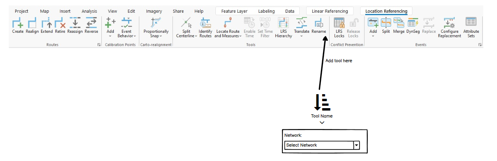

# Support Running AEB, Generate Routes, and Derive Event Measures as a Single Operation via the LR Pro Ribbon – Test Plan

|   |   |
| --- | --- |
| **Kind** | Test Plan · Pro |
| **Release** | — |
| **Product** | Roads & Highways · Pipeline Referencing |
| **Issue** | [ArcGISPro/ps-location-referencing#5198](https://devtopia.esri.com/ArcGISPro/ps-location-referencing/issues/5198) |
| **Source** | [ProcessEdits_tool_testplan.pptx](<https://esriis.sharepoint.com/sites/LocationReferencing/Shared%20Documents/General/Test%20Plans/ProcessEdits_tool_testplan.pptx>) |
| **Edited** | 2023-12-08 20:45 by Claire Wang |
| **Extracted** | 2026-09-04 · lane `xmlstrip` |

<!-- metadata
```yaml
title: "Support Running AEB, Generate Routes, and Derive Event Measures as a Single Operation via the LR Pro Ribbon – Test Plan"
source_file: "ProcessEdits_tool_testplan.pptx"
source_url: "https://esriis.sharepoint.com/sites/LocationReferencing/Shared%20Documents/General/Test%20Plans/ProcessEdits_tool_testplan.pptx"
doc_id: 453
doc_kind: "Test Plan"
surface: "Pro"
doc_revision: ""
target_release: ""
pe: "Claire Wang"
dev: "1"
author: "Lakshmi Ananthanarayanan"
last_edited_by: "Claire Wang"
last_edited: "2023-12-08T20:45:01Z"
extracted: 2026-09-04
extraction_lane: xmlstrip
prompt_version: "v2.0.2"
keywords: ["process edits", "generate routes", "derive event measures", "apply event behaviors", "cartorealign", "edit session", "conflict prevention", "route editing"]
tools: ["Process Edits", "Generate Intersections", "Apply Event Behaviors", "Generate Routes", "Derive Event Measures"]
products: ["Roads & Highways", "Pipeline Referencing"]
issues: ["ArcGISPro/ps-location-referencing#5198"]
related: [{"doc":506,"file":"support-running-aeb-generate-routes-and-derive-event-measures-as-a-single__doc506.md","s":1004.685},{"doc":467,"file":"64-bit-oid-gp-tools-test-plan__doc467.md","s":4.18},{"doc":468,"file":"densify-and-regenerate-lrs-routes-tool-test-plan__doc468.md","s":4.113},{"doc":306,"file":"process-route-edits__doc306.md","s":3.915},{"doc":499,"file":"bug-verification-and-regression-testing-for-append-routes-append-events-and__doc499.md","s":3.496}]
```
-->

## Summary

Test plan for the Process Edits tool on the Location Referencing ribbon in ArcGIS Pro. It covers the tool's UI, functionality, and behavior including running Generate Intersections, Apply Event Behaviors, Generate Routes, and Derive Event Measures sequentially. The plan includes positive and negative test cases across different datasets and network types, with focus on edit session handling, cancellation, failure, undo, and progress tracking.

## Related documents

<!-- related:begin -->
- [Support Running AEB, Generate Routes, and Derive Event Measures as a Single Operation via the LR Pro Ribbon](<https://esriis.sharepoint.com/sites/lrsworkspace/LRS Doc Index/User Stories/support-running-aeb-generate-routes-and-derive-event-measures-as-a-single__doc506.md>) — shared issue ArcGISPro/ps-location-referencing#5198 · similar text 0.37 · 6 title words · same surface <!-- rel:506 -->
- [64 bit OID GP Tools – Test Plan](<https://esriis.sharepoint.com/sites/lrsworkspace/LRS Doc Index/Test Plans/64-bit-oid-gp-tools-test-plan__doc467.md>) — similar text 0.18 · 1 filename word · same kind/surface/pe/folder <!-- rel:467 -->
- [Densify and Regenerate LRS Routes Tool – Test Plan](<https://esriis.sharepoint.com/sites/lrsworkspace/LRS Doc Index/Test Plans/densify-and-regenerate-lrs-routes-tool-test-plan__doc468.md>) — similar text 0.15 · 1 title word · 1 filename word · same kind/surface/pe/folder <!-- rel:468 -->
- [Process Route Edits](<https://esriis.sharepoint.com/sites/lrsworkspace/LRS Doc Index/Other/process-route-edits__doc306.md>) — similar text 0.22 · 2 filename words · same surface <!-- rel:306 -->
- [Bug Verification and Regression Testing for Append Routes, Append Events, and Generate Intersections Tools](<https://esriis.sharepoint.com/sites/lrsworkspace/LRS Doc Index/Test Plans/bug-verification-and-regression-testing-for-append-routes-append-events-and__doc499.md>) — similar text 0.13 · 2 title words · same kind/surface/pe <!-- rel:499 -->
<!-- related:end -->

<!-- docs:begin -->
## Esri documentation

[Conflict prevention](https://doc.esri.com/en/arcgis-pro/latest/help/production/roads-highways/conflict-prevention.html)

_No page matched:_ [Process Edits](https://www.google.com/search?q=%22Process%20Edits%22+site%3Adoc.esri.com) · [Generate Intersections](https://www.google.com/search?q=%22Generate%20Intersections%22+site%3Adoc.esri.com) · [Apply Event Behaviors](https://www.google.com/search?q=%22Apply%20Event%20Behaviors%22+site%3Adoc.esri.com) · [Generate Routes](https://www.google.com/search?q=%22Generate%20Routes%22+site%3Adoc.esri.com) · [Derive Event Measures](https://www.google.com/search?q=%22Derive%20Event%20Measures%22+site%3Adoc.esri.com)
<!-- docs:end -->

---

## Slide 1 — Support Running AEB, Generate Routes, and Derive Event Measures as a single operation via the LR Pro Ribbon – Test Plan

https://devtopia.esri.com/ArcGISPro/ps-location-referencing/issues/5198

PE: Claire Wang
Dev:

### Notes

Does the tool open an edit session or not? If not how can we revert back by undo. If yes, if Pro is closed before saving edits what do we do.
e.g. edit a route, save edits, close Pro, reopen Pro. Run tool. Does tool recognize edits made?
2. edit a route, save edits, run tool, need to save edits again before closing Pro?

## Slide 2

Data

- Add a tool in LR ribbon that runs Generate Intersections (conditions apply), AEB, Generate Routes, Generate Events (conditions apply), and Derive Event Measures (conditions apply) in sequence
- Test in FS (default and child versions), and FGDB
- Test in RH, APR (with derived network), and few cases in APRUN data
  - Derive event measures is not applicable in RH
- Test CartoRealign with events with honor referent location for the Generate Intersections step
- Test with point and spanning and nonspanning line events
  - that have different event behaviors
  - that have and do not have derived measure fields configured for line network
- Ensure route in each test case has multiple events with different event behaviors
- Test with selection and definition query
- Test conflict prevention
- Test few complex shapes in RH
- Test with tool cancellation, tool fail conditions, and undo
- 508 and i18n

## Slide 3

Verification – Tool UI

- Tool is called Process Edits (Tool button shows Process Edits. Add more details in the tool hover (e.g. Process LRS Edits that  updates routes and events in a route edit) and the dialogue window’s tool name is Process LRS Edits)
- Dev works with Graphic team to design an icon
- The tool sits in Tools group, after Rename
- The tool itself is clickable and it also has a dropdown to select network
  - If there is only 1 network with event, don’t even show the caret (Dev checks if it’s possible. If not, show a disabled caret)
  - If  multiple networks with events, upon opening Pro, tool will default to the first network with events in alphabetical order
  - Clicking the tool icon will run the tool
  - Clicking the dropdown arrow will open network selector. Only network with events are shown in dropdown.
  - Tool will remember network choice for Pro session, when icon is clicked it will run against the previously chosen network
- If no network or no network with events in the map, tool greys out
- When tool is running, pop up a window similar to changing versions in Pro that will show a progress bar and also the specific GP Tool that is running
  - Popup window shows what steps completed and any additional messages (e.g. 512/520 routes generated in Line, 50/51 routes generated in Derived, see output .txt, etc)
  - Popup window has buttons: Minimize Maximize/Restore Close
  - Tool run can be canceled in window like how cancellation works in GP
- When the tool fails, pop up another window that shows the failing step and the error message. Click OK to close.



## Slide 4

Verification – Tool functionality

- Verify when clicked, the tool will run the followings in sequential order. a, b, and c are universal; d is for line network only. The tool only updates routes that show unprocessed in Edit log and their events, aka AEB determines what to run for the other steps
  - If user has intersections, run Generate Intersections only if cartorealignment has occurred and honor referent location is configured
    - Dev will look into time difference between running “all intersections” or “only honor referent location intersections with events that have intersections as a referent”, and decide if we can only have honor referent location intersections updated
  - Apply Event Behaviors on events on the input network
  - Generate Routes (this will update the line and its derived network or a nonline network if the input network is not a line network with events)
  - Derive Event Measures on all applicable events on the generated routes
- Verify the pop up window shows applicable steps only (mention in doc that unnecessary steps are not run and do not show in window)
  - E.g. pop up window shows b and c if input network is nonline and no cartorealign has occurred; pop up window shows progresses for a b and c if input network is line, intersection exists, and cartorealign with honor referent location configured has occurred but no event has derived fields
- Verify step b still run even if no route edits have occurred, other steps do not run

## Automate a few UI test cases <!-- slide 5 -->

Verification – Tool functionality

- The tool only updates routes that show unprocessed in Edit log and their events and any subset selection or definition query will be ignored just like how AEB is run
  - If there is no unprocessed edit in Edit log, the popup window indicates nothing is updated with an OK button at the button and a close button at top right corner. Clicking any of these buttons closes window
- Verify tool behaviors for cancellation, fail, and undo
  - cancel in middle - roll everything back
  - undo when finished within an editing session – honor the edit session and roll everything back
    - If no existing edit session, there is no Undo option to revert tool run. (If edits are saved before running this tool, undo the tool run is not possible because the tool does not open an edit session for itself
  - fail in middle - do not roll previous steps back
- Verify results are correct by comparing to running tools manually
Automation
Automate a few UI test cases (only with editing already completed)
Documentation
Add new doc topic for the tool in the Prepare the LRS for editing section after the Rename a route topic

  - Include use cases, workflows, screenshots of tool UI, and graphics/tables
  - Provide links to the specific GP tools that are ran when the tool is executed for more info about what each individual GP tool does
  - mention unnecessary steps are not run and do not show in progress tracking window

## Slide 6 — Positive cases

  - RH
  - Extend a normal route at the end
  - Realign a gapped route to fill in gap
  - Realign a lollipop
  - Reassign a loop to a normal route by merging to adjacent route
  - Reassign a normal route by forming a new route
  - Recalibrate a normal route
  - Reverse a gapped route
  - Retire half of a normal route and calibrate downstream
  - Carto-realign a normal route with events with honor referent location configured
  - APR (* if nothing is specified, test with all of point, non-spanning and spanning events with some event with derived measures and some not)
  - Extend a normal route being the first route in a line at the beginning, no spanning event *
  - Realign a gapped route to fill in gap, no event with derived fields *
  - Reassign-merge a normal route to adjacent route on the same line
  - Reassign-form (rename) a normal route
  - Reassign-transfer the first half of a normal route to another existing line and calibrate downstream
  - Recalibrate a vertical route, no spanning event *
  - Reverse a gapped route
  - Retire the non-vertical portion of a vertical route without calibrating downstream
  - Carto-realign a normal route with events with honor referent location configured

## Slide 7 — Positive cases

  - APRUN (* if nothing is specified, test with all of point, non-spanning and spanning events with some event with derived measures and some not)
  - Extend a normal route being the last route in a line at the beginning, no spanning event *
  - Realign a normal route without calibrating downstream, no event with derived fields *
  - Reassign-transfer the second half of a normal route to another existing line
  - Retire the non-vertical portion of a vertical route without calibrating downstream
  - Other
  - Undo a case and verify all changes are rolled back
Negative cases

  - Cancel tool in middle of tool run
  - Let the tool fail due to conflict prevention error
