# Support Search Tolerance Parameter in Update Measures from LRS Tool – Test Plan

|   |   |
| --- | --- |
| **Kind** | Test Plan · Pro |
| **Release** | — |
| **Product** | Roads & Highways · Pipeline Referencing |
| **Issue** | [ArcGISPro/ps-location-referencing#4100](https://devtopia.esri.com/ArcGISPro/ps-location-referencing/issues/4100) |
| **Source** | [UpdateMeasuresfromLRS_SearchToleranceTestPlan.pptx](<https://esriis.sharepoint.com/sites/LocationReferencing/Shared%20Documents/General/Test%20Plans/UpdateMeasuresfromLRS_SearchToleranceTestPlan.pptx>) |
| **Edited** | 2025-02-19 19:43 by Lakshmi Ananthanarayanan |
| **Extracted** | 2026-09-04 · lane `xmlstrip` |

<!-- metadata
```yaml
title: "Support Search Tolerance Parameter in Update Measures from LRS Tool – Test Plan"
source_file: "UpdateMeasuresfromLRS_SearchToleranceTestPlan.pptx"
source_url: "https://esriis.sharepoint.com/sites/LocationReferencing/Shared%20Documents/General/Test%20Plans/UpdateMeasuresfromLRS_SearchToleranceTestPlan.pptx"
doc_id: 229
doc_kind: "Test Plan"
surface: "Pro"
doc_revision: ""
target_release: ""
pe: "Lakshmi"
dev: "Eric"
author: "Lakshmi Ananthanarayanan"
last_edited_by: "Lakshmi Ananthanarayanan"
last_edited: "2025-02-19T19:43:32Z"
extracted: 2026-09-04
extraction_lane: xmlstrip
prompt_version: "v2.0.2"
keywords: ["search tolerance", "update measures", "route", "measure", "point event", "line event", "calibration", "network", "rest"]
tools: ["Update Measures from LRS"]
products: ["Roads & Highways", "Pipeline Referencing"]
issues: ["ArcGISPro/ps-location-referencing#4100"]
related: [{"doc":273,"file":"support-search-tolerance-parameter-in-update-measures-from-lrs-tool__doc273.md","s":5.516},{"doc":277,"file":"update-measures-from-lrs-support-events-and-intersections__doc277.md","s":3.833},{"doc":339,"file":"generate-lr-data-product-support-summary-and-length-fields-from-the-template__doc339.md","s":3.801},{"doc":230,"file":"update-measures-from-lrs-support-spanning-events-test-plan__doc230.md","s":3.527},{"doc":364,"file":"overlay-events-and-queryattributeset-point-event-support-test-cases__doc364.md","s":3.042}]
```
-->

## Summary

Test plan for the Update Measures from LRS tool focusing on the support and verification of the search tolerance parameter. Includes testing across various networks, feature types, and environments such as ArcGIS Pro, Python, Model Builder, and REST. Covers positive, negative, and edge cases to ensure correct behavior of the search tolerance parameter in measure updates.

## Related documents

<!-- related:begin -->
- [Support Search Tolerance Parameter in Update Measures from LRS Tool](<https://esriis.sharepoint.com/sites/lrsworkspace/LRS Doc Index/User Stories/support-search-tolerance-parameter-in-update-measures-from-lrs-tool__doc273.md>) — similar text 0.25 · 6 title words · 2 filename words · same surface <!-- rel:273 -->
- [Update Measures From LRS: Support Events and Intersections](<https://esriis.sharepoint.com/sites/lrsworkspace/LRS Doc Index/Test Plans/update-measures-from-lrs-support-events-and-intersections__doc277.md>) — similar text 0.10 · 2 title words · same kind/surface/folder <!-- rel:277 -->
- [Generate LR Data Product: Support summary and length fields from the template – Test Plan](<https://esriis.sharepoint.com/sites/lrsworkspace/LRS Doc Index/Test Plans/generate-lr-data-product-support-summary-and-length-fields-from-the-template__doc339.md>) — similar text 0.09 · 1 title word · same kind/surface/pe/folder <!-- rel:339 -->
- [Update Measures From LRS: Support Spanning Events Test Plan](<https://esriis.sharepoint.com/sites/lrsworkspace/LRS%20Doc%20Index/Test%20Plans/update-measures-from-lrs-support-spanning-events-test-plan__doc230.md>) — similar text 0.09 · 2 title words · same kind/surface/folder <!-- rel:230 -->
- [Overlay Events and queryAttributeSet Point Event Support Test Cases](<https://esriis.sharepoint.com/sites/lrsworkspace/LRS Doc Index/Test Plans/overlay-events-and-queryattributeset-point-event-support-test-cases__doc364.md>) — similar text 0.10 · 1 title word · same kind/surface/folder <!-- rel:364 -->
<!-- related:end -->

<!-- docs:begin -->
## Esri documentation

[Configure continuous measure networks and events to update with an engineering network](https://doc.esri.com/en/arcgis-pro/latest/help/production/location-referencing-pipelines/configure-continuous-measure-networks-and-events-to-update-with-an-engineering-network.html) · [Split a centerline by measure](https://doc.esri.com/en/arcgis-pro/latest/help/production/roads-highways/split-a-centerline-by-measure.html) · [LRS network](https://doc.esri.com/en/arcgis-pro/latest/help/production/location-referencing-pipelines/what-is-an-lrs-network.html)

_No page matched:_ [Update Measures from LRS](https://www.google.com/search?q=%22Update%20Measures%20from%20LRS%22+site%3Adoc.esri.com)
<!-- docs:end -->

---

## Slide 1 — Support search tolerance parameter in Update Measures from LRS tool – Test Plan

https://devtopia.esri.com/ArcGISPro/ps-location-referencing/issues/4100

PE: Lakshmi
Dev: Eric

## - Add test cases <!-- slide 2 -->

 Test Data

- Test with RH and APR(GCS) , APRUNdata.
- Test in Pro, Python inline, Python Standalone and Model builder
- Test in REST ( one case for sanity)
- Test for all networks (line, nonline and postmile)
- Test for point and line features. Test with point events , Line events , intersection points ,Centerline , nonLRS point features, nonLRS line features
- Add test cases which are close to tolerance, exactly on tolerance and slightly outside the tolerance value.

Verification

- Verify an optional parameter Search Tolerance is added to the tool
- Verify this parameter is available on the REST version of the tool
- Verify this parameter is available for all the networks
- Verify the unit of tolerance is same as the  xy units of the network
- Verify if more than one route/measure location falls within the search radius populate with the closest value. If two measure location/route are at equidistant choose anyone.
- Verify for the line features both from and to measure are populated from the same route and they should be within the search radius of the same route

Automation
	Update the existing python automation for the new parameter. Fix if any test cases break and add new test cases.
 Documentation
	Update the documentation for the gp tool for the new parameter.( update that feature can be within search tolerance , not necessarily exactly coincident on route)
	Update the REST topic
Negative Test case
	Test a case with uncalibrated route , negative value as a search tolerance and non numeric  value as a search tolerance.

## Slide 3 — 1. Nearest one route and one measure – Normal Route

| Feature | RID | M |
| --- | --- | --- |
| P1 | R1 | 0 |
| P2 | R1 | 5 |
| P3 | Null | Null |

| Feature | RID | M | ToM |
| --- | --- | --- | --- |
| L1 | Null | Null | Null |
| L2 | R1 | 6 | 8 |
| L3 | Null | Null | Null |
| L4 | Null | Null | Null |
| L5 | Null | Null | Null |
| L6 | Null | Null | Null |
| L7 | R1 | 1 | 7 |

[figure: 1 · 2 · R1 · 0 · 10 · L1 · L2 · L3 · L4 · L5 · 3 · L6 · L7]

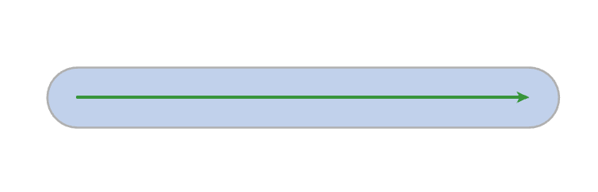 

## Slide 4

| Feature | RID | M |
| --- | --- | --- |
| P1 | R1 | 0 |
| P5 | Null | Null |

2. Nearest one route and more than one measure on the same route/same location – Complex route

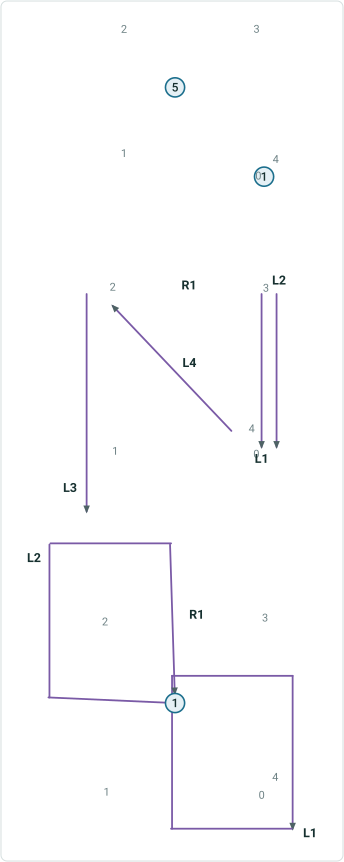

| Feature | RID | M | ToM |
| --- | --- | --- | --- |
| L1 | R1 | 3 | 4 |
| L2 | R1 | 4 | 3 |
| L3 | Null | Null | Null |
| L4 | R1 | 0 | 2 |

3. Nearest one route and more than one measure on the same route – event is at equidistant from multiple measures

| Feature | RID | M |
| --- | --- | --- |
| P1 | R1 | 1.5 |

| Feature | RID | M | ToM |
| --- | --- | --- | --- |
| L1 | Null | Null | Null |
| L2 | R1 | 1.5 | 1.5 |

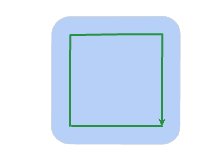 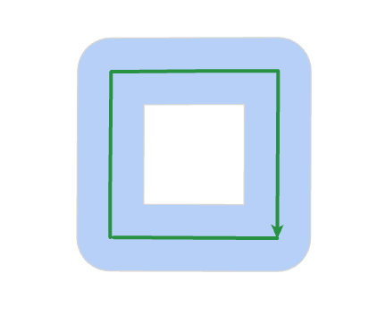

## Slide 5 — 4. Nearest one route and one measure – Gapped route

5. Nearest one route and more than one  measure – Gapped route – Equidistant from more than one measure

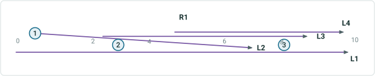

| Feature | RID | M | ToM |
| --- | --- | --- | --- |
| L1 | R1 | 0 | 10 |
| L2 | Null | Null | Null |
| L3 | Null | Null | Null |
| L4 | R1 | 10 | 5 |

| Feature | RID | M |
| --- | --- | --- |
| P1 | R1 | 0.5 |
| P2 | Null | Null |
| P3 | R1 | 8 |

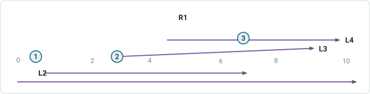

| Feature | RID | M | ToM |
| --- | --- | --- | --- |
| L1 | R1 | 0 | 10 |
| L2 | R1 | 1 | 6 |
| L3 | R1 | 2 | 9 |
| L4 | R1 | 10 | 5 |

| Feature | RID | M |
| --- | --- | --- |
| P1 | R1 | 0.5 |
| P2 | R1 | 2 |
| P3 | R1 | 6 |

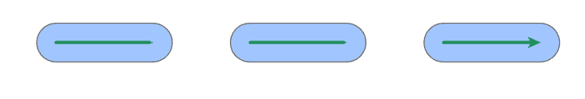 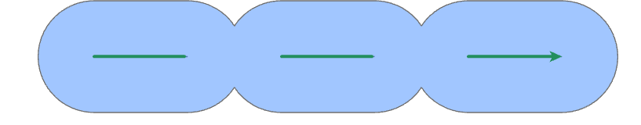

## Slide 6 — 6. Nearest one route and one measure – Concurrent Routes updated from any one of the routes

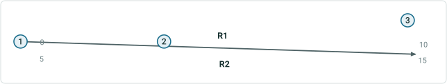

| Feature | RID | M |
| --- | --- | --- |
| P1 | R1 | 0 |
| P2 | R1 | 4 |
| P3(right on tolerance) | R1 | 10 |

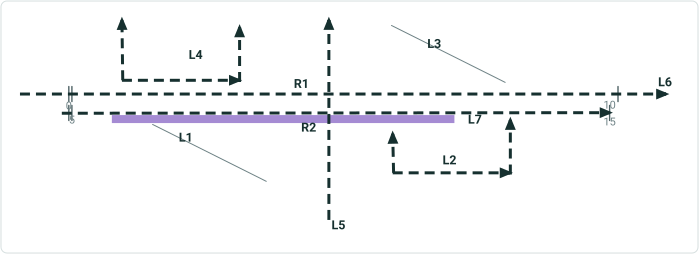

| Feature | RID | M | ToM |
| --- | --- | --- | --- |
| L1 | Null | Null | Null |
| L2 | R1 | 6 | 8 |
| L3 | Null | Null | Null |
| L4 | Null | Null | Null |
| L5 | Null | Null | Null |
| L6 | Null | Null | Null |
| L7 | R1 | 1 | 7 |

 

## Slide 7 — 7. Nearest one route and one measure – Same route with different time slices and updated measures. TVD : 1/1/2021 R1 -

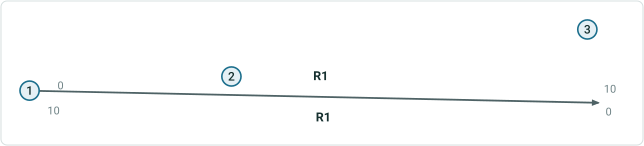

| Feature | RID | M |
| --- | --- | --- |
| P1 | R1 | 10 |
| P2 | R1 | 6 |
| P3 | Null | Null |

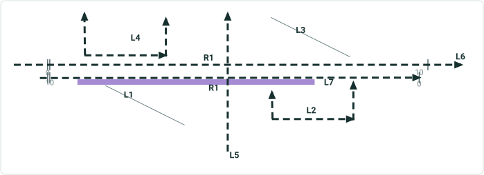

| Feature | RID | M | ToM |
| --- | --- | --- | --- |
| L1 | Null | Null | Null |
| L2 | R1 | 4 | 2 |
| L3 | Null | Null | Null |
| L4 | Null | Null | Null |
| L5 | Null | Null | Null |
| L6 | Null | Null | Null |
| L7 | R1 | 9 | 7 |

 

## Slide 8 — 8. Measures of more than one route within the search tolerance

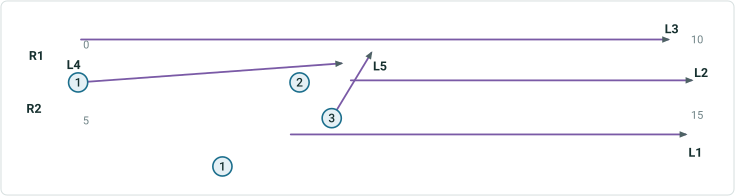

| Feature | RID | M |
| --- | --- | --- |
| P1 | R1 | 0 |
| P2 | R1 | 5 |
| P3 | R2 | 10 |

| Feature | RID | M | ToM |
| --- | --- | --- | --- |
| L1 | R2 | 9 | 15 |
| L2 | R1 | 5 | 10 |
| L3 | R1 | 0 | 10 |
| L4 | R1 | 0 | 5 |
| L5 | R3 | 19 | 20 |

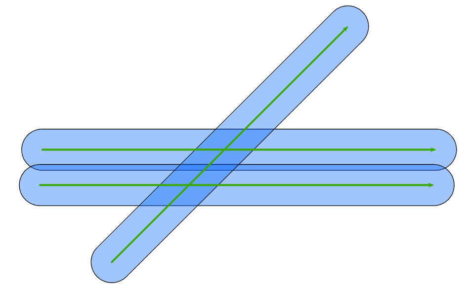

## Slide 9 — 9. Nearest two or more routes – one of the route is complex route

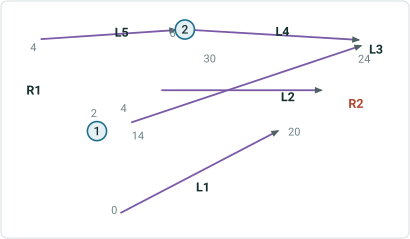

| Feature | RID | M |
| --- | --- | --- |
| P1 | R1 or R2 | 2 or 4 or 14 |
| P2 | R1 or R2 | 6 or 30 |

| Feature | RID | M | ToM |
| --- | --- | --- | --- |
| L1 | Null | Null | Null |
| L2 | Null | Null | Null |
| L3 | R2 | 14 | 24 |
| L4 | R2 | 30 | 24 |
| L5 | R1 | 4 | 6 |

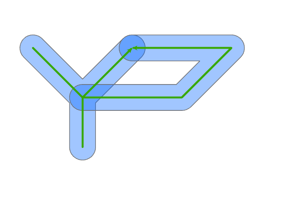

## Slide 10

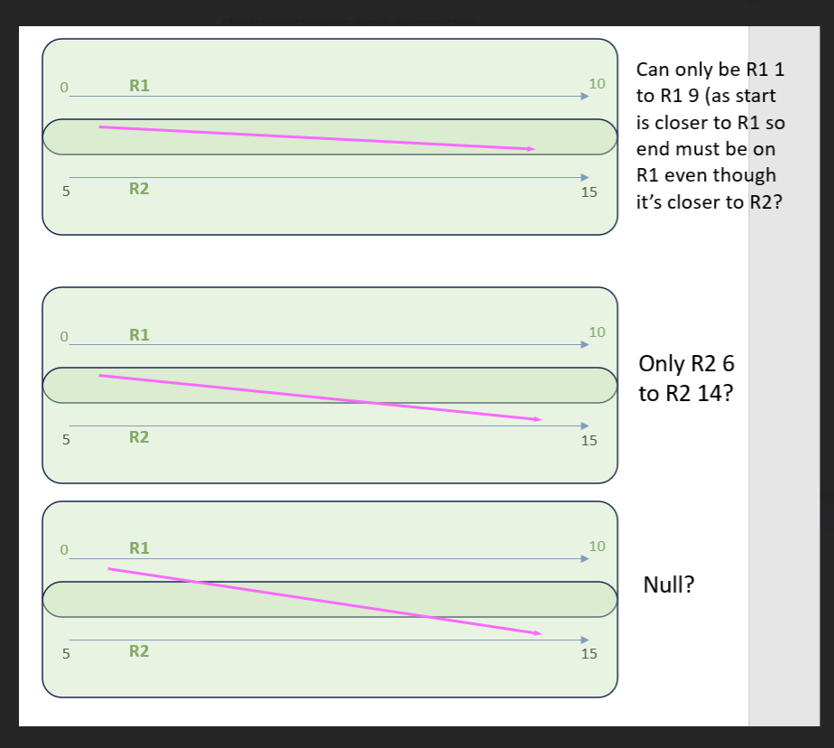
