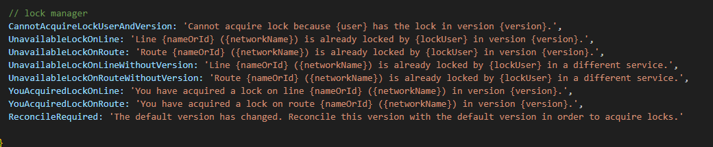
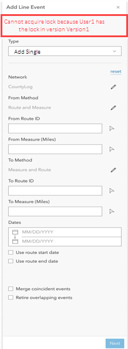
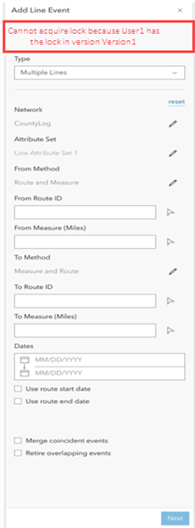
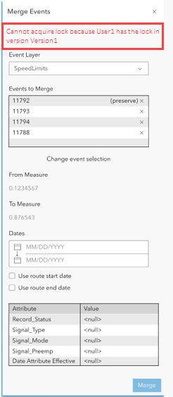
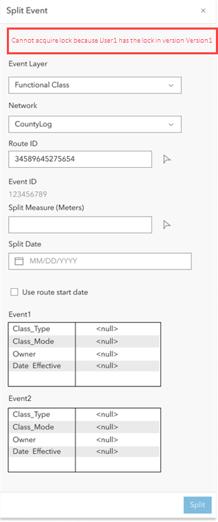

# Test Plan: Conflict Prevention for LRS Widgets

|   |   |
| --- | --- |
| **Kind** | Test Plan · Experience Builder |
| **Release** | 11.3 |
| **Issue** | [Beijing-R-D-Center/ExperienceBuilder-Web-Extensions#17309](https://devtopia.esri.com/Beijing-R-D-Center/ExperienceBuilder-Web-Extensions/issues/17309) · [ArcGISPro/ps-location-referencing#489](https://devtopia.esri.com/ArcGISPro/ps-location-referencing/issues/489) |
| **Source** | [17309-ConflictPreventionforLRSWidgets_V2.docx](<https://esriis.sharepoint.com/sites/LocationReferencing/Shared%20Documents/General/Test%20Plans/17309-ConflictPreventionforLRSWidgets_V2.docx>) |
| **Edited** | 2024-02-29 19:42 by Mac Christmas |
| **Extracted** | 2026-09-04 · lane `xmlstrip` |

<!-- metadata
```yaml
title: "Test Plan: Conflict Prevention for LRS Widgets"
source_file: "17309-ConflictPreventionforLRSWidgets_V2.docx"
source_url: "https://esriis.sharepoint.com/sites/LocationReferencing/Shared%20Documents/General/Test%20Plans/17309-ConflictPreventionforLRSWidgets_V2.docx"
doc_id: 415
doc_kind: "Test Plan"
surface: "Experience Builder"
doc_revision: "V2"
target_release: "11.3"
pe: ""
dev: ""
author: "Mac Christmas"
last_edited_by: "Mac Christmas"
last_edited: "2024-02-29T19:42:00Z"
extracted: 2026-09-04
extraction_lane: xmlstrip
prompt_version: "v2.0.2"
keywords: ["conflict prevention", "event lock", "route lock", "lock transfer", "event editing", "multiple event", "single event", "experience builder widget"]
tools: ["Add Point Event", "Add Line Event", "Split Event", "Merge Events"]
products: []
issues: ["Beijing-R-D-Center/ExperienceBuilder-Web-Extensions#17309", "ArcGISPro/ps-location-referencing#489"]
related: [{"doc":668,"file":"test-plan-for-conflict-prevention-for-add-multiple-line-events-tool-in-arcgis__doc668.md","s":5.644},{"doc":666,"file":"conflict-prevention-for-event-editing-in-pro-lr-event-tools__doc666.md","s":5.323},{"doc":667,"file":"conflict-prevention-for-event-editing-in-pro-add-multiple-point-events-tool__doc667.md","s":5.139},{"doc":670,"file":"conflict-prevention-for-event-editing-in-pro-core-tools__doc670.md","s":4.762},{"doc":671,"file":"conflict-prevention-for-event-editing-in-pro-core-tools__doc671.md","s":4.634}]
```
-->

## Summary

This test plan covers conflict prevention mechanisms for LRS widgets including Add Point Event, Add Line Event, Split Event, and Merge Events. It details scenarios for acquiring, transferring, and releasing event and route locks across different users, versions, and networks. The plan includes expected behaviors, error messages, and lock handling for single and multiple event editing workflows.

## Related documents

<!-- related:begin -->
- [Test Plan for Conflict Prevention for Add Multiple Line Events Tool in ArcGIS Pro](<https://esriis.sharepoint.com/sites/lrsworkspace/LRS Doc Index/Test Plans/test-plan-for-conflict-prevention-for-add-multiple-line-events-tool-in-arcgis__doc668.md>) — similar text 0.73 · 2 title words · 1 filename word · same kind/folder <!-- rel:668 -->
- [Conflict Prevention for Event Editing in Pro – LR Event Tools](<https://esriis.sharepoint.com/sites/lrsworkspace/LRS Doc Index/Test Plans/conflict-prevention-for-event-editing-in-pro-lr-event-tools__doc666.md>) — similar text 0.59 · 2 title words · 1 filename word · same kind/folder <!-- rel:666 -->
- [Conflict Prevention for Event Editing in Pro – Add Multiple Point Events Tool Test Plan](<https://esriis.sharepoint.com/sites/lrsworkspace/LRS Doc Index/Test Plans/conflict-prevention-for-event-editing-in-pro-add-multiple-point-events-tool__doc667.md>) — similar text 0.66 · 2 title words · 1 filename word · same kind/folder <!-- rel:667 -->
- [Conflict Prevention for Event Editing in Pro – Core Tools](<https://esriis.sharepoint.com/sites/lrsworkspace/LRS Doc Index/Test Plans/conflict-prevention-for-event-editing-in-pro-core-tools__doc670.md>) — similar text 0.53 · 2 title words · 1 filename word · same kind/folder <!-- rel:670 -->
- [Conflict Prevention for Event Editing in Pro – Core Tools](<https://esriis.sharepoint.com/sites/lrsworkspace/LRS Doc Index/Test Plans/conflict-prevention-for-event-editing-in-pro-core-tools__doc671.md>) — similar text 0.54 · 2 title words · 1 filename word · same kind/folder <!-- rel:671 -->
<!-- related:end -->

<!-- docs:begin -->
## Esri documentation

[Merge events](https://doc.esri.com/en/arcgis-pro/latest/help/production/roads-highways/merge-events.html) · [Conflict prevention](https://doc.esri.com/en/arcgis-pro/latest/help/production/location-referencing-pipelines/conflict-prevention.html) · [Event editing using the attribute table](https://doc.esri.com/en/arcgis-pro/latest/help/production/location-referencing-pipelines/event-editing-using-the-attribute-table.html)

_No page matched:_ [Add Point Event](https://www.google.com/search?q=%22Add%20Point%20Event%22+site%3Adoc.esri.com) · [Add Line Event](https://www.google.com/search?q=%22Add%20Line%20Event%22+site%3Adoc.esri.com) · [Split Event](https://www.google.com/search?q=%22Split%20Event%22+site%3Adoc.esri.com)
<!-- docs:end -->

---

[figure: Devtopia Issue]
Test Plan: Conflict Prevention for LRS Widgets

### General:

- Test ONLY Add Point Event, Add Line Event, Split Event, and Merge Events widgets.
  - NonLRS widgets are part of a separate user story not in the 11.3 release.
- In each of these widgets, we will be checking/acquiring Event Locks for any events that are being edited.
- If route lock exists for another user, attempt to transfer but if transfer fails error out the tool.
- Test with line and non-line networks.
- Test with point, non-spanning, and spanning events.
- Test situations where locks are acquired, transferred, and/or released.
  - We can only delete versions in ExB. We cannot post.
- Ensure lock related messages in widgets are valid and understandable.
  - Ensure existing messages are unaffected.
- Briefly test when conflict prevention is disabled, ensure no issues arise.
- If edit takes place in Default version, release the lock upon operation completion.
- Follow a similar pattern for lock acquisition in the single event tools (the pattern, not the lock type) as we do for single events in Event Editor and ArcGIS Pro.
  - Check if a lock already exists once the routeID is populated and focus changes, then try to acquire a lock when the user clicks run; if a conflicting lock already exists then have the tool/operation fail, if a lock already exists for that user/version/route/layer or no lock exists, then acquire, and let the operation succeed.
- For the multiple event tools, we’ll need to check for the locks for the selected routeID and attribute set on the first pane of the UI when the populates the routeID and changes focus, but only acquire the lock once the user selects the event layers and clicks run on the second pane.
  - Only lock the events that are being added in multiple. For unchecked events, do not lock or attempt to lock.
- If a route lock already exists for a route with events being added/edited, ensure no event lock is created.
- Auto-reconcile when necessary to acquire lock(s).
  - To verify this, open Chrome DevTools and choose Network. Looks for startReading and startEditing. These records in the network traffic will show whether or not auto-reconcile was successful.
- Support lock transfers in the same manner we support it in ArcGIS Pro and Event Editor
- 508/i18n
- Test with various themes.
Error messages:

| Event on Route | Event Layer | User | Version | Existing Lock? | Result |
| --- | --- | --- | --- | --- | --- |
| Route1 | Event1 | User1 | User1.Version1 | No | Acquire event lock and allow edit to proceed |
| Route1 | Event1 | User1 | User1.Version1 | Yes, route lock on Route1 by User1 in version User1.Version1 | Route lock supersedes event lock so no action and allow edit to proceed |
| Route1 | Event1 | User1 | User1.Version1 | Yes, Event1 locked by User1 on User1.Version2 | Do not acquire lock, provide error message about event being locked in another version |
| Route1 | Event1 | User1 | User1.Version1 | Yes, Event1 locked by User2 on User2.Version1 | Attempt to transfer the lock, if the lock it not able to be transferred, provide error message about event being locked by another user |
| Route1 | Event1 | User1 | User1.Version1 | Yes, Event2 locked by User1 on User1.Version1 | Acquire event lock on Event1 and allow edit to procced |

[figure: Note: This diagram is relevant for only Add Single, Merge, and Split widgets. For Add Multiple widgets, the event locks will prompt on the second pane where events from Attribute Set can be un/selected.]

### Add Line/Point Event Widgets (Single):

| Event Type | Test Case | L1 |  |  | RX |  |  | E1 |  |  | E2 |  | E3 |  | Reconcile needed | Result | Message/s |
| --- | --- | --- | --- | --- | --- | --- | --- | --- | --- | --- | --- | --- | --- | --- | --- | --- | --- |
| Point event, Spanning, non- spanning event | 1.No locks exist |  |  |  |  |  |  |  |  |  |  |  |  |  | No | Event l ock can be acquired | Message for acquiring locks at the top of pane. |
|  | 2 . No locks exist |  |  |  |  |  |  |  |  |  |  |  |  |  | Yes | auto reconcile and lock acquired | Auto reconcile not selected: Reconcile this version with Default to acquire locks. |
| 2.1. Workflow Test s : - If the reconcile is required, verify the prompt: "A reconcile with default is required before acquiring a lock . Please reconcile and try again." - I f user is unable to reconcile, display an error message in LR tool pane. - If the user selects different line/route on map, the lock of first route / line still exist s with release abl e status yes above logic should be reapplied . 2 . 2 . Switch RouteID / line after lock acquired – validate again if lock can be acquired. 2 . 3 . Switch event after lock acquired – validate again if lock can be acquired. 2.4 Event lock already acquired on R1 and switch the event layer, same network 2.5 Event lock already acquired on R1 and switch the event layer, different network |  |  |  |  |  |  |  |  |  |  |  |  |  |  |  |  |  |
| Point event, Spanning, non- spanning event | 3 . Line / Route already locked by the same user in the same version | Locked | UserA in VersionA1 |  |  |  |  |  |  |  |  |  |  |  | No | No additional lock needed | No Messages |
| Point event, non- spanning event , For spanning events that user is going to add: - From route locked - To route locked - Both from / to routes are locked | 4 . Line / route already locked by another user in another version | Locked | UserB in VersionB1 |  |  |  |  |  |  |  |  |  |  |  | No | Cannot acquire locks | Error message in middle of screen: Unable to add event. The Line /route L1 is already locked by UserB in VersionB1 > click ok > Edit Failed message on tool pane in upper right corner |
| Point event, Spanning, non- spanning event | 4 . 1 Line / route already locked by another user B in another version . Version not being used. User A transfers the lock and try to make an edit | Locked | UserB in VersionB1 |  |  |  |  |  |  |  |  |  |  |  | No | Locks can be acquired | Message for acquiring locks at the upper right corner of pane. |
|  | 4 . 2 Line / route already locked by another user B in same version . Version not being used. User A transfers the lock and try to make an edit |  |  |  |  |  |  |  |  |  |  |  |  |  |  | Locks can be acquired | Locks can be acquired |
|  | 4 . 3 Line / route already locked by another user B in same version . Version being used and edit has taken place. User A tries to transfer the lock – unable to transfer lock. |  |  |  |  |  |  |  |  |  |  |  |  |  |  |  |  |
| Point event, Spanning, non- spanning event | 5 . Concurrent route on another network is locked by the same user in the same version – verify this case with another user |  |  | Locked |  | UserA in VersionA1 |  |  |  |  |  |  |  |  | No | Lock can be acquired | Message for acquiring locks at the upper right corner of pane. |
| Point event, non- spanning event , For spanning events that user is going to add: - From route locked - To route locked - Both from / to routes are locked | 6 . Same user has a line / route lock in another version | Locked | UserA in VersionA2 |  |  |  |  |  |  |  |  |  |  |  | No | Cannot acquire locks | Error message in middle of screen: Unable to add event. The Line/route L1 is already locked by UserA in VersionA2 > click ok > Edit Failed message on tool pane in upper right corner |
| Point event, Spanning, non- spanning event | 7 . Another user has a lock (for that line / route ) on another event layer on the same route in another version | Locked | UserB in VersionB1 |  |  |  |  |  |  | Locked |  | UserB in VersionB1 |  |  | No | Lock /s can be acquired | Message for acquiring locks at the upper right corner of pane. |
|  | 7.1 Another user B has a lock (for that line / route ) on another event layer on the same route in another version . Version not being used. User A transfers the lock and try to make an edit | Locked | UserB in VersionB1 |  |  |  |  |  |  | Locked |  | UserB in VersionB1 |  |  | No | Lock /s can be acquired | Message for acquiring locks at the upper right corner of pane. |
|  | 8. Same user has a lock (for that line / route ) on another event layer on the same route in another version | Locked | UserA in VersionA2 |  |  |  |  |  |  | Locked |  | UserA in VersionA2 |  |  | No | Lock /s can be acquired | Message for acquiring locks at the upper right corner of pane. |
| Point event, non- spanning event , For spanning events that user is going to add: - From route locked - To route locked - Both from / to routes are locked | 9. Event layer already locked (for that line /route ) by the same user in another version | Locked | UserA in Version A2 |  |  |  | Locked |  | UserA in Version A2 |  |  |  |  |  | No | Cannot acquire locks | Error message in middle of screen: Cannot acquire locks because UserA has the lock in version UserA.VersionA1 > click ok > Edit Failed message on tool pane in upper right corner |
|  | 10. Event layer already locked (for that line / route ) by another user in another version | Locked | UserB in Version B1 |  |  |  | Locked |  | UserB in Version B1 |  |  |  |  |  | No | Cannot acquire locks | Error message in middle of screen: Cannot acquire locks because UserB has the lock in version UserB.VersionB1 Edit Failed message on tool pane in upper right corner |
|  | 1 1. User has lock on all the event layers for that line /route in another version | Locked | UserA in VersionA2 |  |  |  | Locked |  | UserA in VersionA2 | Locked |  | UserA in VersionA2 |  |  | Yes | Reconcile but cannot acquire locks | Auto reconcile not selected: Reconcile this version with Default to acquire locks. Error message in middle of screen: Cannot acquire locks because UserA has the lock in version UserA.VersionA2 > click ok > Edit Failed message on tool pane in upper right corner |
| Point event, non- spanning event , For spanning events that user is going to add: - From route locked - To route locked - Both from / to routes are locked | 1 2 . User has lock on some events, another user has lock on other events | Locked | UserB in VersionB1 |  |  |  | Locked |  | UserB in VersionB1 | Locked |  | UserA in VersionA1 |  |  | No | Cannot acquire locks | Error message in middle of screen: Cannot acquire locks because UserA has the lock in version UserA.VersionA1 +Text file enlisting all events that are locked by other user/s with the version/s info. Edit Failed message on tool pane in upper right corner |
|  | 1 3 . User has lock on some events, another user has lock on other events . Try to edit all the events. | Locked | UserA in VersionA2 |  |  |  | Locked |  | UserA in VersionA2 | Locked |  | UserB in VersionB1 |  |  | No | Cannot acquire locks | Error message in middle of screen: Cannot acquire locks because UserA has the lock in version UserA.VersionA1 +Text file enlisting all events that are locked by other user/s with the version/s info. Edit Failed message on tool pane in upper right corner |
|  | 14 . Same user has a route / line lock and a lock (for that line /route ) on another event layer in the same version | Locked | UserA in VersionA1 |  |  |  |  |  |  | Locked |  | UserA in VersionA1 |  |  | No | Lock can be acquired | Message for acquiring locks at the upper right corner of pane. |
| Point event, Spanning, non- spanning event | 1 5 . Concurrent route on another network and another event of that route are locked by the same user in the same version |  |  | Locked |  | UserA in VersionA1 |  |  |  |  |  |  | Locked | UserA in VersionA1 | No | Lock can be acquired | Message for acquiring locks at the upper right corner of pane. |
|  | 1 6 . Line /route and another event layer on that line / route are locked by the same user in the same version | Locked | UserA in VersionA1 |  |  |  | Locked |  | UserA in VersionA1 |  |  |  |  |  | No | Lock can be acquired | Message for acquiring locks at the upper right corner of pane. |

- Lock acquired; lock removed (using locks table in db) before clicking Run – should re acquire a lock
- No lock present and unable to auto reconcile - No locks will be acquired
- Acquire the lock using the REST service and then use the add line / point event tool to add an event
- Verify lock can be acquired with protected version
- Verify lock can be acquired with private version
- Locks are taken in private versions and no edit has taken place. These locks cannot be transferred to another user and should not be able to acquire locks.
- Locks are taken in protected versions and no edit has taken place. These locks cannot be transferred to another user and should not be able to acquire locks.
- Try to acquire a lock without being logged in - should not be able to acquire a lock
- Try to acquire an event lock as a data viewer – should  not be able to acquire a lock
- Try to acquire a lock as portal user who does not have access to the service - should not be able to acquire a lock
- Add cases where locks are taken in private or protected versions and no edit has taken place. These locks cannot be transferred to another user. 2 cases
- Where locks are acquired make sure lock is displayed in locks table and identify
- Verify release locks only when using default version - should release automatically
- If the user changes the event layer in the drop down (and Route is selected / typed in pane),, make sure locks are checked again in that case.
- If locks can be acquired, then lock will be added to locks table and user can add event. If locks cannot be acquired, then no lock will be added to locks table and user can not add event

### Add Line Event Widget (Multiple):

| TC No | Test case | Locked by | Locked in | Expected result |
| --- | --- | --- | --- | --- |
| 1 | No route/line lock exists | None | None | Move to the next pane for acquiring event lock |
| 2 | Route/line locked by same user in the same editing version | User A | Version A1 | Move to the next pane for acquiring event lock |
| 3 | Concurrent Route/line locked by another user in different version | User B | Version A2 | Move to the next pane for acquiring event lock |
|  |  | Concurrent Route |  |  |
| 4 | Route/line of different network locked by the same user in different version | User A | Version B1 | Move to the next pane for acquiring event lock |
|  |  | Route of different network |  |  |
| 5 | Route locked by another user in same editing version and not edited in that version& version not in use. | User B | Version A1 | Release the route lock and move to the next pane for acquiring event lock This should fail because on the 2 nd pane “We are trying to release lock” if releasable status is YES. T he releasable status is “ no ” for this case – the status is coming from the REST end point developed in 2018 |
| 6 | Route/line locked by current user in different version and not edited in that version | User A | Version A2 | Cannot release event lock. Show error message – This is happening in pro as written. |
| 7 | Route/line locked by another user in same editing version. Edited in that version | User B | Version A1 | Cannot release event lock. Show error message This should fail because on second pane w e only are trying to release lock” if releasable status is YES. No lock transfer will happen on 2 nd pane. |
| 8 | Route/line locked by the current user in different version and has edits in the version | User A | Version A2 | Cannot release event lock. Show error message |

#### Scenario 1:
Current user is User A, adding multiple line events in version A1 using default attribute set.  UserA has two versions A1 and A2 and UserB has a version B1. For both User A and User B use editor / GIS professional privileges.

| TC No. | Events added | Test Case | Nonline Network1 |  |  | Nonline Network2 | LineNetwork1 |  |  | LineNetwork2 |  | Message | Result |
| --- | --- | --- | --- | --- | --- | --- | --- | --- | --- | --- | --- | --- | --- |
|  |  |  | E1 | E2 | E3 | E_N2 | E1_L1 | ES1_L1 | ES2_L1 | E1_L2 | ES1_L2 |  |  |
| 9 | Default Attribute Set (all line events) | No lock exists and choosing any of the networks in the network pane will result in changes in acquiring locks in the events pane. |  |  |  |  |  |  |  |  |  |  |  |
|  |  | Choosing Nonline N1 |  |  |  |  |  |  |  |  |  | Event lock acquired for the events E1, E2 & E3 of the Network1 | Message for acquiring locks at the top of pane – for all events |
|  |  | Choosing Nonline N2 |  |  |  |  |  |  |  |  |  | Event lock acquired for the events E_N2, of the Network2 |  |
|  |  | Choosing Line L1 |  |  |  |  |  |  |  |  |  | Event lock acquired for the events E1_L1, ES1_L1 & ES2_L1 of the line Network1 |  |
|  |  | Choosing Line L2 |  |  |  |  |  |  |  |  |  | Event lock acquired for the events E1_L2 &ES1_L2 for the line Network2 |  |
| 10 | Default Attribute set (all line events) | Event locked by another user in a same version with releasable status yes for event E2 of N1 and ES1_L1 of Linenetwork1 |  |  |  |  |  |  |  |  |  |  |  |
|  |  | Choosing Nonline N1 |  | Lock transfer from UserB to User A inUserA.A1 |  |  |  |  |  |  |  | Event lock acquired for the events E1, E2 & E3 of the Network1 | Message for acquiring locks at the top of pane – for all events |
|  |  | Choosing Nonline N2 |  |  |  |  |  |  |  |  |  | Event lock acquired for the events E_N2, of the Network2 |  |
|  |  | Choosing Line L1 |  |  |  |  |  | Lock transfer from UserB to User A inUserA.A1 |  |  |  | Event lock acquired for the events E1_L1, ES1_L1 & ES2_L1 of the line Network1 |  |
|  |  | Choosing Line L2 |  |  |  |  |  |  |  |  |  | Event lock acquired for the events E1_L2 &ES1_L2 for the line Network2 |  |

| TC No. | Events added | Test Case | Nonline Network1 |  |  | Nonline Network2 | LineNetwork1 |  |  | LineNetwork2 |  | Message | Result |
| --- | --- | --- | --- | --- | --- | --- | --- | --- | --- | --- | --- | --- | --- |
|  |  |  | E1 | E2 | E3 | E_N2 | E1_L1 | ES1_L1 | ES2_L1 | E1_L2 | ES1_L2 |  |  |
| 11 | Default Attribute Set (all line events) All events are checked and edited in that selected Network | Lock exists on one of the events - locked by different user in the same version . Event E2 of N1 is locked by User B in Version A1. |  |  |  |  |  |  |  |  |  |  |  |
|  |  | Choosing Nonline N1 |  | Locked by User B in A1 |  |  |  |  |  |  |  | No Event lock acquired | Error Message |
|  |  | Choosing Nonline N2 |  |  |  |  |  |  |  |  |  | Event lock acquired for the events E_N2, of the Network2 | Message for acquiring locks at the top of pane – for all events |
|  |  | Choosing Line L1 |  |  |  |  |  |  |  |  |  | Event lock acquired for the events E1_L1, ES1_L1 & ES2_L1 of the line Network1 |  |
|  |  | Choosing Line L2 |  |  |  |  |  |  |  |  |  | Event lock acquired for the events E1_L2 &ES1_L2 for the line Network2 |  |
| 12 | Default Attribute set (all line events) | Some of the events are already locked by current user in the current editing version. Event E3 in N1, Event Es1_L2 in line network2. |  |  |  |  |  |  |  |  |  |  |  |
|  |  | Choosing Nonline N1 |  |  | UserA in A1 |  |  |  |  |  |  | Event lock acquired for the events E1 & E2 . E3 already locked by User A for the Network1 | Message for acquiring locks at the top of pane – for all events |
|  |  | Choosing Nonline N2 |  |  |  |  |  |  |  |  |  | Event lock acquired for the events E_N2, of the Network2 |  |
|  |  | Choosing Line L1 |  |  |  |  |  |  |  |  |  | Event lock acquired for the events E1_L1, ES1_L1 & ES2_L1 of the line Network1 |  |
|  |  | Choosing Line L2 |  |  |  |  |  |  |  |  | UserA in A1 | Event lock acquired for the events E1_L2 & ES1_L2 already locked by User A for the line Network2 |  |

| TC No. | Events added | Test Case | Nonline Network1 |  |  | Nonline Network2 | LineNetwork1 |  |  | LineNetwork2 |  | Message | Result |
| --- | --- | --- | --- | --- | --- | --- | --- | --- | --- | --- | --- | --- | --- |
|  |  |  | E1 | E2 | E3 | E_N2 | E1_L1 | ES1_L1 | ES2_L1 | E1_L2 | ES1_L2 |  |  |
| 13 | Default Attribute Set (all line events) All events are checked and edited in that selected Network | Some of the events are already locked by same user in another version - Event E1 of Network1, ES1_L1 of line network1 and E1_L2 of linenetwork2 are locked by User A in version A2 |  |  |  |  |  |  |  |  |  |  |  |
|  |  | Choosing Nonline N1 | Locked by User A in A 2 |  |  |  |  |  |  |  |  | No Event lock acquired | Error Message |
|  |  | Choosing Nonline N2 |  |  |  |  |  |  |  |  |  | Event lock acquired for the events E_N2, of the Network2 | Message for acquiring locks at the top of pane |
|  |  | Choosing Line L1 |  |  |  |  |  | Locked by User A in A 2 |  |  |  | No Event lock acquired | Error Message |
|  |  | Choosing Line L2 |  |  |  |  |  |  |  | Locked by User A in A 2 |  | No Event lock acquired | Error Message |
| 14 | Default Attribute set (all line events) | Some of the events are already locked by another user in another version - E1 of network1, E_N2 of N2, E1_L1 of L1, ES1_L2 are locked by User B in version B1 |  |  |  |  |  |  |  |  |  |  |  |
|  |  | Choosing Nonline N1 and adding only event E3 | Locked by User B in B1 X | x (unchecked) |  |  |  |  |  |  |  | Event lock acquired for the events E3 of for the Network1 | Message for acquiring locks at the top of pane – for all events |
|  |  | Choosing Nonline N2 |  |  |  | Locked by User B in B1 |  |  |  |  |  | No Event lock acquired | Error Message |
|  |  | Choosing Line L1 and adding only event ES2_L1 |  |  |  |  | Locked by User B in B1 X | X (unchecked) |  |  |  | Event lock acquired for the events ES2_L1 of the line Network1 | Message for acquiring locks at the top of pane |
|  |  | Choosing Line L2, adding all events |  |  |  |  |  |  |  |  | Locked by User B in B1 | No Event lock acquired | Error Message |

#### Scenario 2:
Current user is User A, adding multiple line events in version A1 using attribute set AttributesetN1 (Containing E1, E2, E3).  UserA has two versions A1 and A2 and UserB has a version B1.

| TC No. | Events added | Test Case | Nonline Network1 |  |  | Nonline Network2 | LineNetwork1 |  |  | LineNetwork2 |  | Message | Result |
| --- | --- | --- | --- | --- | --- | --- | --- | --- | --- | --- | --- | --- | --- |
|  |  |  | E1 | E2 | E3 | E_N2 | E1_L1 | ES1_L1 | ES2_L1 | E1_L2 | ES1_L2 |  |  |
| 15 | AttributesetN1 (Containing E1, E2, E3) | No lock exists and choosing anyone of the networks in the network pane will result in changes in acquiring locks in the events pane. |  |  |  |  |  |  |  |  |  |  |  |
|  |  | Choosing Nonline N1 |  |  |  |  |  |  |  |  |  | Event lock acquired for the events E1, E2 & E3 of the Network1 | Message for acquiring locks at the top of pane – for all events |
|  |  | Choosing Nonline N2 |  |  |  |  |  |  |  |  |  | No Event lock acquired | Error message "No attributes are selected." |
|  |  | Choosing Line L1 |  |  |  |  |  |  |  |  |  | No Event lock acquired | Error message "No attributes are selected." |
|  |  | Choosing Line L2 |  |  |  |  |  |  |  |  |  | No Event lock acquired | Error message "No attributes are selected." |
| 16 | AttributesetN1 (Containing E1, E2, E3) | Event locked by another user in a same version with releasable status yes for event E2 of N1 and ES1_L1 of Linenetwork1 |  |  |  |  |  |  |  |  |  |  |  |
|  |  | Choosing Nonline N1 |  | Lock transfer from UserB to User A inUserA.A1 |  |  |  |  |  |  |  | Event lock acquired for the events E1, E2 & E3 of the Network1 | Message for acquiring locks at the top of pane – for all events |
|  |  | Choosing Nonline N2 |  |  |  |  |  |  |  |  |  | No Event lock acquired | Error message "No attributes are selected." |
|  |  | Choosing Line L1 |  |  |  |  |  | Lock available for transfer. (From User B) |  |  |  | No Event lock acquired . | Error message "No attributes are selected." |
|  |  | Choosing Line L2 |  |  |  |  |  |  |  |  |  | No Event lock acquired. | Error message "No attributes are selected." |

| TC No. | Events added | Test Case | Nonline Network1 |  |  | Nonline Network2 | LineNetwork1 |  |  | LineNetwork2 |  | Message | Result |
| --- | --- | --- | --- | --- | --- | --- | --- | --- | --- | --- | --- | --- | --- |
|  |  |  | E1 | E2 | E3 | E_N2 | E1_L1 | ES1_L1 | ES2_L1 | E1_L2 | ES1_L2 |  |  |
| 17 | AttributesetN1 (Containing E1, E2, E3) | Lock exists on one of the events - locked by different user in the same version (not transferrable) . Event E2 of N1 is locked by User B in Version A1. |  |  |  |  |  |  |  |  |  |  |  |
|  |  | Choosing Nonline N1 |  | Locked by User B in A1 |  |  |  |  |  |  |  | No Event lock acquired | Error message at the top of the pane : Cannot acquire locks |
|  |  | Choosing Nonline N2 |  |  |  |  |  |  |  |  |  | No Event lock acquired | Error message "No attributes are selected." |
|  |  | Choosing Line L1 |  |  |  |  |  |  |  |  |  | No Event lock acquired |  |
|  |  | Choosing Line L2 |  |  |  |  |  |  |  |  |  | No Event lock acquired |  |
| 18 | AttributesetN1 (Containing E1, E2, E3) | Some of the events are already locked by current user in the current editing version. Event E3 in N1, Event ES1_L2 in line network2. |  |  |  |  |  |  |  |  |  |  |  |
|  |  | Choosing Nonline N1 |  |  | UserA in A1 |  |  |  |  |  |  | Event lock acquired for the events E1 & E2 . E3 already locked by User A for the Network1 | Message for acquiring locks at the top of pane – for all events |
|  |  | Choosing Nonline N2 |  |  |  |  |  |  |  |  |  | No Event lock acquired | Error message "No attributes are selected." |
|  |  | Choosing Line L1 |  |  |  |  |  |  |  |  |  | No Event lock acquired |  |
|  |  | Choosing Line L2 |  |  |  |  |  |  |  |  | UserA in A1 . Already locked | No Event lock acquired |  |

| TC No. | Events added | Test Case | Nonline Network1 |  |  | Nonline Network2 | LineNetwork1 |  |  | LineNetwork2 |  | Message | Result |
| --- | --- | --- | --- | --- | --- | --- | --- | --- | --- | --- | --- | --- | --- |
|  |  |  | E1 | E2 | E3 | E_N2 | E1_L1 | ES1_L1 | ES2_L1 | E1_L2 | ES1_L2 |  |  |
| 19 | AttributesetN1 (Containing E1, E2, E3) | Some of the events are already locked by same user in another version - Event E1 of Network1, ES1_L1 of line network1 and E1_L2 of linenetwork2 are locked by User A inversion A2 |  |  |  |  |  |  |  |  |  |  |  |
|  |  | Choosing Nonline N1 | Locked by User A in A 2 |  |  |  |  |  |  |  |  | No Event lock acquired | Error message at the top of the pane : Cannot acquire locks |
|  |  | Choosing Nonline N2 |  |  |  |  |  |  |  |  |  | No Event lock acquired | Error message "No attributes are selected." |
|  |  | Choosing Line L1 |  |  |  |  |  | Locked by User A in A2 |  |  |  | No Event lock acquired |  |
|  |  | Choosing Line L2 |  |  |  |  |  |  |  | Locked by User A in A 2 |  | No Event lock acquired |  |
| 20 | AttributesetN1 (Containing E1, E2, E3) | Some of the events are already locked by another user in another version - E1 of network1, E_N2 of N2, E1_L1 of L1, ES1_L2 are locked by User B in version B1 |  |  |  |  |  |  |  |  |  |  |  |
|  |  | Choosing Nonline N1 and adding only event E3 | Locked by User B in B1 (unchecked by user A) | X ( unchecked by user A) |  |  |  |  |  |  |  | Event lock acquired for the event E 3 of for the Network1 | Message for acquiring locks at the top of pane – for all events |
|  |  | Choosing Nonline N2 |  |  |  | Locked by User B in B1 |  |  |  |  |  | No Event lock acquired | Error message "No attributes are selected." |
|  |  | Choosing Line L1 |  |  |  |  | Locked by User B in B1 |  |  |  |  | No Event lock acquired |  |
|  |  | Choosing Line L2, adding all events |  |  |  |  |  |  |  |  | Locked by User B in B1 | No Event lock acquired |  |

Scenario 3:
Current user is User A, adding multiple line events in version A1 using attribute set AttributesetL1(containing E1_L1, ES1_L1, ES2_L1), UserA has two versions A1 and A2 and UserB has a version B1.

| TC No. | Events added | Test Case | Nonline Network1 |  |  | Nonline Network2 | LineNetwork1 |  |  | LineNetwork2 |  | Message | Result |
| --- | --- | --- | --- | --- | --- | --- | --- | --- | --- | --- | --- | --- | --- |
|  |  |  | E1 | E2 | E3 | E_N2 | E1_L1 | ES1_L1 | ES2_L1 | E1_L2 | ES1_L2 |  |  |
| 21 | AttributesetL1 (containing E1_L1, ES1_L1, ES2_L1), | No lock exists and choosing anyone of the networks in the network pane will result in changes in acquiring locks in the events pane. |  |  |  |  |  |  |  |  |  |  |  |
|  |  | Choosing Nonline N1 |  |  |  |  |  |  |  |  |  | No Event lock acquired | Error message "No attributes are selected." |
|  |  | Choosing Nonline N2 |  |  |  |  |  |  |  |  |  | No Event lock acquired | Error message "No attributes are selected." |
|  |  | Choosing Line L1 |  |  |  |  |  |  |  |  |  | Event lock acquired for the events E1 _L1 , E S1_L1 & E S2_L1 of the line Network1 | Message for acquiring locks at the top of pane – for all events |
|  |  | Choosing Line L2 |  |  |  |  |  |  |  |  |  | No Event lock acquired | Error message "No attributes are selected." |
| 22 | AttributesetL1 (containing E1_L1, ES1_L1, ES2_L1), | Event locked by another user in a same version with releasable status yes for event E2 of N1 and ES1_L1 of Linenetwork1 |  |  |  |  |  |  |  |  |  |  |  |
|  |  | Choosing Nonline N1 |  | Lock available for transfer( User B) |  |  |  |  |  |  |  | No Event lock acquired | Error message "No attributes are selected." |
|  |  | Choosing Nonline N2 |  |  |  |  |  |  |  |  |  | No Event lock acquired | Error message "No attributes are selected." |
|  |  | Choosing Line L1 |  |  |  |  |  | Lock transfer from UserB to User A inUserA.A1 |  |  |  | Event lock acquired for the events E1 _L1 , E S1_L1 & E S2_L1 of the line Network1 . | Message for acquiring locks at the top of pane – for all events |
|  |  | Choosing Line L2 |  |  |  |  |  |  |  |  |  | No Event lock acquired . | Error message "No attributes are selected." |

| TC No. | Events added | Test Case | Nonline Network1 |  |  | Nonline Network2 | LineNetwork1 |  |  | LineNetwork2 |  | Message | Result |
| --- | --- | --- | --- | --- | --- | --- | --- | --- | --- | --- | --- | --- | --- |
|  |  |  | E1 | E2 | E3 | E_N2 | E1_L1 | ES1_L1 | ES2_L1 | E1_L2 | ES1_L2 |  |  |
| 23 | AttributesetL1 (containing E1_L1, ES1_L1, ES2_L1), ) | Lock exists on one of the events - locked by different user in the same version ( not transferrable) . Event ES2_L1 of L1 is locked by User B in Version A1. |  |  |  |  |  |  |  |  |  |  |  |
|  |  | Choosing Nonline N1 |  |  |  |  |  |  |  |  |  | No Event lock acquired | Error message "No attributes are selected." |
|  |  | Choosing Nonline N2 |  |  |  |  |  |  |  |  |  | No Event lock acquired | Error message "No attributes are selected." |
|  |  | Choosing Line L1 |  |  |  |  |  |  | Locked by User B in A1 |  |  | No Event lock acquired | Error message at the top of the pane : Cannot acquire locks |
|  |  | Choosing Line L2 |  |  |  |  |  |  |  |  |  | No Event lock acquired | Error message "No attributes are selected." |
| 24 | AttributesetL1 (containing E1_L1, ES1_L1, ES2_L1), ) | Some of the events are already locked by current user in the current editing version. Event E3 in N1, Event ES1_L2 in line network2. |  |  |  |  |  |  |  |  |  |  |  |
|  |  | Choosing Nonline N1 |  |  | UserA in A1 . |  |  |  |  |  |  | No Event lock acquired | Error message "No attributes are selected |
|  |  | Choosing Nonline N2 |  |  |  |  |  |  |  |  |  | No Event lock acquired | Message for acquiring locks at the top of pane – for all events |
|  |  | Choosing Line L1 |  |  |  |  |  |  | UserA in A1 . Already locked |  |  | Event lock acquired for the events E1 _L1& E S1_L1. E S2_L1 is already locked by User A for the Network1 | Error message "No attributes are selected." |
|  |  | Choosing Line L2 |  |  |  |  |  |  |  |  |  | No Event lock acquired | Error message "No attributes are selected." |

| TC No. | Events added | Test Case | Nonline Network1 |  |  | Nonline Network2 | LineNetwork1 |  |  | LineNetwork2 |  | Message | Result |
| --- | --- | --- | --- | --- | --- | --- | --- | --- | --- | --- | --- | --- | --- |
|  |  |  | E1 | E2 | E3 | E_N2 | E1_L1 | ES1_L1 | ES2_L1 | E1_L2 | ES1_L2 |  |  |
| 25 | AttributesetL1 (containing E1_L1, ES1_L1, ES2_L1), ) | Some of the events are already locked by same user in another version - Event E1 of Network1, ES1_L1 of line network1 and E1_L2 of linenetwork2 are locked by User A in version A2 |  |  |  |  |  |  |  |  |  |  |  |
|  |  | Choosing Nonline N1 | Locked by User A in A2 |  |  |  |  |  |  |  |  | No Event lock acquired | Error message "No attributes are selected |
|  |  | Choosing Nonline N2 |  |  |  |  |  |  |  |  |  | No Event lock acquired | Error message "No attributes are selected." |
|  |  | Choosing Line L1 |  |  |  |  |  | Locked by User A in A 2 |  |  |  | No Event lock acquired | Error message at the top of the pane : Cannot acquire locks |
|  |  | Choosing Line L2 |  |  |  |  |  |  |  | Locked by User A in A 2 |  | No Event lock acquired | Error message "No attributes are selected |
| 26 | AttributesetL1 (containing E1_L1, ES1_L1, ES2_L1), ) | Some of the events are already locked by another user in another version - E1 of network1, E_N2 of N2, E1_L1 of L1, ES1_L2 are locked by User B in version B1 |  |  |  |  |  |  |  |  |  |  |  |
|  |  | Choosing Nonline N1 | Locked by User B in B1 |  |  |  |  |  |  |  |  | No Event lock acquired | Error message "No attributes are selected” |
|  |  | Choosing Nonline N2 |  |  |  | Locked by User B in B1 |  |  |  |  |  | No Event lock acquired | Error message "No attributes are selected." |
|  |  | Choosing Line L1 and adding only ES1_L1 |  |  |  |  | Locked by User B in B1 |  | X ( user unchecked) |  |  | Event lock acquired for the event E S1_L1 of for the line Network1 | Message for acquiring locks at the top of pane – for all events |
|  |  | Choosing Line L2, adding all events |  |  |  |  |  |  |  |  | Locked by User B in B1 | No Event lock acquired | Error message "No attributes are selected” |

#### Scenario 4:
Current user is User A, adding multiple line events in version A1 using AttributesetN1N2 (containing events E1, E2, E3, E_N2). User A has two versions A1 and A2 and UserB has a version B1

| TC No. | Events added | Test Case | Nonline Network1 |  |  | Nonline Network2 | LineNetwork1 |  |  | LineNetwork2 |  | Message | Result |
| --- | --- | --- | --- | --- | --- | --- | --- | --- | --- | --- | --- | --- | --- |
|  |  |  | E1 | E2 | E3 | E_N2 | E1_L1 | ES1_L1 | ES2_L1 | E1_L2 | ES1_L2 |  |  |
| 30 | AttributesetN1N2 (containing events E1, E2, E3, E_N2) | No lock exists and choosing anyone of the networks in the network pane will result in changes in acquiring locks in the events pane. |  |  |  |  |  |  |  |  |  |  |  |
|  |  | Choosing Nonline N1 |  |  |  |  |  |  |  |  |  | Event lock acquired for the events E1, E2 & E3 of the Network1 | Message for acquiring locks at the top of pane – for all events |
|  |  | Choosing Nonline N2 |  |  |  |  |  |  |  |  |  | Event lock acquired for the events E_N2, of the Network2 |  |
|  |  | Choosing Line L1 |  |  |  |  |  |  |  |  |  | No Event lock acquired | Error message "No attributes are selected ” |
|  |  | Choosing Line L2 |  |  |  |  |  |  |  |  |  | No Event lock acquired |  |
| 31 | AttributesetN1N2 (containing events E1, E2, E3, E_N2) ) | Event locked by another user in a same version with releasable status yes for event E2 of N1 and ES1_L1 of Linenetwork1 |  |  |  |  |  |  |  |  |  |  |  |
|  |  | Choosing Nonline N1 |  | Lock transfer from UserB to User A inUserA.A1 |  |  |  |  |  |  |  | Event lock acquired for the events E1, E2 & E3 of the Network1 | Message for acquiring locks at the top of pane – for all events |
|  |  | Choosing Nonline N2 |  |  |  |  |  |  |  |  |  | Event lock acquired for the events E _N2 of the Network 2 |  |
|  |  | Choosing Line L1 |  |  |  |  |  | Lock available for transfer |  |  |  | No Event lock acquired | Error message "No attributes are selected ” |
|  |  | Choosing Line L2 |  |  |  |  |  |  |  |  |  | No Event lock acquired |  |

| TC No. | Events added | Test Case | Nonline Network1 |  |  | Nonline Network2 | LineNetwork1 |  |  | LineNetwork2 |  | Message | Result |
| --- | --- | --- | --- | --- | --- | --- | --- | --- | --- | --- | --- | --- | --- |
|  |  |  | E1 | E2 | E3 | E_N2 | E1_L1 | ES1_L1 | ES2_L1 | E1_L2 | ES1_L2 |  |  |
| 32 | AttributesetN1N2 (containing events E1, E2, E3, E_N2) | Lock exists on one of the events - locked by another user in the same version with releasable status no or OnPost. Event E2 of N1 is locked by User B in Version A1. |  |  |  |  |  |  |  |  |  |  |  |
|  |  | Choosing Nonline N1 |  | Locked by User B in A1 (user B edited) |  |  |  |  |  |  |  | No Event lock acquired | Error message at the top of the pane: Cannot acquire locks |
|  |  | Choosing Nonline N2 |  |  |  |  |  |  |  |  |  | Event lock acquired for the events E_N2, of the Network2 | Message for acquiring locks at the top of pane – for all events |
|  |  | Choosing Line L1 |  |  |  |  |  |  |  |  |  | No Event lock acquired | Error message "No attributes are selected ” |
|  |  | Choosing Line L2 |  |  |  |  |  |  |  |  |  | No Event lock acquired | Error message "No attributes are selected” |
| 33 | AttributesetN1N2 (containing events E1, E2, E3, E_N2) | Some of the events are already locked by current user in the current editing version. Event E3 in N1, Event ES1_L2 in line network2. |  |  |  |  |  |  |  |  |  |  |  |
|  |  | Choosing Nonline N1 | UserA in A1 |  | UserA in A1 |  |  |  |  |  |  | Event lock acquired for the event E2 . E1& E3 already locked by User A for the Network1 | Message for acquiring locks at the top of pane – for all events |
|  |  | Choosing Nonline N2 |  |  |  |  |  |  |  |  |  | Event lock acquired for the events E_N2, of the Network2 |  |
|  |  | Choosing Line L1 |  |  |  |  |  |  |  |  |  | No Event lock acquired | Error message "No attributes are selected ” |
|  |  | Choosing Line L2 |  |  |  |  |  |  |  |  | UserA in A1 | No Event lock acquired |  |

| TC No. | Events added | Test Case | Nonline Network1 |  |  | Nonline Network2 | LineNetwork1 |  |  | LineNetwork2 |  | Message | Result |
| --- | --- | --- | --- | --- | --- | --- | --- | --- | --- | --- | --- | --- | --- |
|  |  |  | E1 | E2 | E3 | E_N2 | E1_L1 | ES1_L1 | ES2_L1 | E1_L2 | ES1_L2 |  |  |
| 34 | AttributesetL1L2 (containing ES1_L1, ES1 _ L2 ) | Some of the events are already locked by same user in another version - Event E1 of Network1, ES1_L1 of line network1 and E1_L2 of linenetwork2 are locked by User A in version A2 |  |  |  |  |  |  |  |  |  |  |  |
|  |  | Choosing Nonline N1 | Locked by User A in A2 |  |  |  |  |  |  |  |  | No Event lock acquired | Error message "No attributes are selected” |
|  |  | Choosing Nonline N2 |  |  |  |  |  |  |  |  |  | No Event lock acquired | Error message "No attributes are selected ” |
|  |  | Choosing Line L1 |  |  |  |  |  | Locked by User A in A 2 |  |  |  | No Event lock acquired | Error message at the top of the pane: Cannot acquire locks |
|  |  | Choosing Line L2 |  |  |  |  |  |  |  | Locked by User A in A 2 |  | Event lock acquired for the events E S1 _ L 2 of the line Network2 | Message for acquiring locks at the top of pane |
| 35 | AttributesetL1L2 (containing ES1_L1, ES1 _ L2) ) | Some of the events are already locked by another user in another version - E1 of network1, E_N2 of N2, E1_L1 of L1, E1_L2 are locked by User B in version B1 |  |  |  |  |  |  |  |  |  |  |  |
|  |  | Choosing Nonline N1 | Locked by User B in B1 |  |  |  |  |  |  |  |  | No Event lock acquired | Error message "No attributes are selected” |
|  |  | Choosing Nonline N2 |  |  |  | Locked by User B in B1 |  |  |  |  |  | No Event lock acquired | Error message "No attributes are selected ” |
|  |  | Choosing Line L1 |  |  |  |  | Locked by User B in B1 |  |  |  |  | Event lock acquired for the events ES 1 _L1 of the line Network1 | Message for acquiring locks at the top of pane |
|  |  | Choosing Line L2, not adding ES1_L2. |  |  |  |  |  |  |  | Locked by User B in B1 | X ( unchecked by user A) | No Event lock acquired | Error message "No attributes are selected ” |

Other test cases:

- Verify a test case with more events are locked thereby a list of locked events is generated. verify the list for its correctness.
- Acquiring lock for a test case through REST and ensure the results are correct
- Verify locks can be acquired using protected version
- Verify locks can be acquired using private version
- User B has event locks in the releasable status of Yes in a protected version UserB.P1. User A tries to the same event in the same version when the version is not in use by User B. Lock should not be transferred to User A.  Error message should be displayed saying User B has locked the event.
- Verify the above test case in Private version.
- Verify a portal user with data viewer role cannot acquire lock
- Verify a portal user having no access to the service cannot acquire lock
9.            Do few test cases with the client dataset - which has number of events and with number of locks. Do cases targeting acquiring lock, failing to acquire lock and transfer of locks

- In the default version do a test case of acquiring lock and verify the locks are released automatically. Also test case of cancelling or undoing the event added in which case also locks are removed automatically

### Add Point Event Widget (Multiple):

| TC No | Test case | Locked by | Locked in | Expected result |
| --- | --- | --- | --- | --- |
| 1 | No route lock exists | None | None | Move to the next pane for acquiring event lock |
| 2 | Route locked by same user in the same editing version | User A | Version A1 | Move to the next pane for acquiring event lock |
| 3 | Concurrent Route locked by another user in different version | User B | Version A2 | Move to the next pane for acquiring event lock |
|  |  | Concurrent Route |  |  |
| 4 | Route of different network locked by the same user in different version | User A | Version B1 | Move to the next pane for acquiring event lock |
|  |  | Route of different network |  |  |
| 5 | Route locked by another user in same editing version and not edited in that version& version not in use. | User B | Version A1 | Release the route lock and move to the next pane for acquiring event lock This should fail because on the 2 nd pane “We are trying to release lock” if releasable status is YES. T he releasable status is “ no ” for this case – the status is coming from the REST end point developed in 2018 |
| 6 | Route locked by current user in different version and not edited in that version | User A | Version A2 | Release the route lock and move to the next pane for acquiring event lock – This is happening in pro as written. |
| 7 | Route locked by another user in same editing version and has edits in that version | User B | Version A1 | Lock gets transferred and move to the next pane for acquiring event lock This is an invalid case and should fail because on second pane w e only are trying to release lock” if releasable status is YES. No lock transfer will happen on 2 nd pane. |
| 8 | Route locked by the current user in different version and has edits | User A | Version A2 | Cannot release event lock. Show error message |
| 9 | Current user A chooses R1 from network N1 which has lock by user B in same version with releasable status. Now the lock gets released. User moves to the next pane gets back again and chooses a different route | User A | Version A1 | We are not acquiring any locks in this pane. We just verify and if required release locks. When the user switches the network, the entire pane will be emptied. Instead of a network if a user changes route, reverify for the availability of lock. |

#### Scenario 1:
Network1 is chosen in the second pane.  Current user is User A, adding point events E1, E2 &E3 for Network1 in the version A1.  UserA has two versions A1 and A2 and UserB has a version B1.   For both User A and User B use editor / GIS professional Privileges

| TC No. | Events Added | Test Case | Network1 |  |  | Result | Message |
| --- | --- | --- | --- | --- | --- | --- | --- |
|  |  |  | E1 | E2 | E3 |  |  |
| 10 a. | D efault attribute set - All point events are checked and edited in that selected Network | No lock exists |  |  |  | Event lock acquired for the events E1, E2 & E3 of the Network1 | Message for acquiring locks at the top of pane – for all events |
| 10b. |  | Event locked by another user in a same version with releasable status yes for event E2 |  | Lock transfer from User B to User A in User A . A 1 |  | Event lock acquired for the events E1, E2 & E3 of the Network1 | Message for acquiring locks at the top of pane – for all events |
| 10c. |  | Lock exists on one of the events - locked by different user in the same version | Lock transfer from User B to User A in User A . A 1 |  |  | Event lock acquired for the events E1, E2 & E3 of the Network1 | Message for acquiring locks at the top of pane – for all events |
| 10d. |  | Events are locked by current editing user in the current editing version | UserA in A1 | UserA in A1 | UserA in A1 | Already Locked by user A . A 1 | No message |
| 10e |  | All the events are locked by the same user in different version | Locked by User A in Version User B . B1 | Locked by User A in Version User B . B1 | Locked by User A in Version User B . B1 | No Event lock acquired | Error message at the top of the pane: Cannot acquire locks because UserA has the lock in version UserB.B1 + text file listing the locked events |
| 10f. | D efault attribute set - Only one point event layer checked and edited in that selected network | No lock exists |  | X This event is available for locking but the user unchecks it in the attribute pane and this event is not added. | X This event is available for locking but the user unchecks it in the attribute pane and this event is not added. | Event lock acquired for the events E1, of the Network1 | Message for acquiring locks at the top of pane – for event E1 |
| 10g |  | Event E1 locked by another user in different version | Locked by User B in version B1 | X | x | No Event lock acquired | Error message at the top of the pane : Cannot acquire locks because User B has the lock in version User B . B1 |

#### Scenario 2:
Attribute set containing two networks point event is used for the following cases.  Current user is User A, adding point events E1, E2 &E3 for Network1 and E1_N2 and E2_N2 for Network2 in the version A1.  UserA has two versions A1 and A2 and UserB has a version B1.

| TC No | Event added | Test case |  | Network1 |  |  | Network2 |  | Result | Message |
| --- | --- | --- | --- | --- | --- | --- | --- | --- | --- | --- |
|  |  |  |  | E1 | E2 | E3 | E 1_N2 | E 2 _N2 |  |  |
| 11a. | Point Events – Attribute set contains E1, E2 &E3 of Network1 and E1 _ N2 &E2_ N2 of Network2 | No lock exists | Choosing Network1 |  |  |  |  |  | Event lock acquired for the events E1, E2 & E3 of the Network1 | Message for acquiring locks at the top of pane – for all events |
| 11b. |  |  | Choosing Network 2 |  |  |  |  |  | Event lock acquired for the event E1_N2 & E2_N2 of the Network2 | Message for acquiring locks at the top of pane |
| 11c. |  | Events in Network2 are locked by current editing user in the current editing version | Choosing Network1 |  |  |  | Locked by UserA in A 1 |  | Event lock acquired for the event E1, E2 , E3 of the Network1 | Message for acquiring locks at the top of pane |
| 11d. |  |  | Choosing Network 2 |  |  |  | User A in A 1 | User A in A 1 | Events E1_N2 a n d E2_N2 are already locked by User A in user A . A 1 | No new locks acquired . No message |
| 11e. |  | Event locked by another user in a same version irrespective of releasable status for event s E1, E2 & E3 of Network1 | Choosing Network1 | Lock transfer from User B to User A in User A . A 1 |  |  |  |  | Event lock acquired for the events E1, E2 & E3 of the Network1 | Message for acquiring locks at the top of pane – for all events |
| 11f. |  |  | Choosing Network2 |  |  |  |  |  | Event lock acquired for the event E1_N2 & E2_N2 of the Network2 | Message for acquiring locks at the top of pane |
| 11g |  | E1 of network1 is locked by another user in same version | Choosing Network1 | Lock transfer from UserB to User A inUserA.A1 |  |  |  |  | Event lock acquired for the event E1_N2 & E2_N2 of the Network2 | Message for acquiring locks at the top of pane |
| 11h |  |  | Choosing Network2 |  |  |  |  |  | Event lock acquired for the event E1_N2 & E2_N2 of the Network2 | Message for acquiring locks at the top of pane – for all events |
| 11i. |  | Events in Network2 are locked by another user in another version | Choosing Network1 |  |  |  | Locked by UserB in version UserB.B1 | Locked by UserB in version UserB.B1 | Event lock acquired for the events E1, E2 & E3 of the Network1 | Message for acquiring locks at the top of pane – for all events |
| 11j. |  |  | Choosing Network2 |  |  |  |  |  | No Event lock acquired | Error message at the top of the pane : Cannot acquire locks because User B has the lock in version User B . B1 |

| TC No | Event Added | Test case |  | Network1 |  |  | Network2 |  | Result | Message |
| --- | --- | --- | --- | --- | --- | --- | --- | --- | --- | --- |
|  |  |  |  | E1 | E2 | E3 | E 1_N2 | E 2 _N2 |  |  |
| 12a. | Point Events – Attribute set contains E1, E2 &E3 of Network1 only | No lock exists | Choosing Network1 |  |  |  |  |  | Event lock acquired for the events E1, E2 & E3 of the Network1 | Message for acquiring locks at the top of pane – for all events |
| 12b. |  |  | Choosing Network 2 |  |  |  |  |  | No Event lock acquired | No attributes are selected. |
| 12c. |  | Events in Network2 are locked by current editing user in the current editing version | Choosing Network1 |  |  |  | Locked by user A in A1 |  | Event lock acquired for the event E1, E2 , E3 of the Network1 | Message for acquiring locks at the top of pane |
| 12d. |  |  | Choosing Network 2 |  |  |  |  |  | No Event lock acquired | Error message "No attributes are selected." |
| 12e. |  | Event locked by another user in a same version irrespective of releasable status E1_N2, E2 _N2 of Network2 | Choosing Network1 |  |  |  |  |  | Event lock acquired for the events E1, E2 & E3 of the Network1 | Message for acquiring locks at the top of pane – for all events |
| 12f. |  |  | Choosing Network2 |  |  |  | Lock transfer possible | Lock transfer possible | No Event lock acquired as the attribute set used does not contain events from Network 2 | Error message "No attributes are selected." |
| 12g |  | E2 of network1 is locked by another user in same version | Choosing Network1 |  | Locked by UserB in version UserA.A1 (transfer) |  |  |  | Event lock acquired for the events E1, E2 & E3 of the Network1 | Message for acquiring locks at the top of pane – for all events |
| 12h |  |  | Choosing Network2 |  |  |  |  |  | No Event lock acquired | Error message will say "No attributes are selected." |
| 12i. |  | Events in Network2 are locked by another user in another version | Choosing Network1 |  |  |  | Locked by UserB in version UserB.B1 | Locked by UserB in version UserB.B1 | Event lock acquired for the events E1, E2 & E3 of the Network1 | Message for acquiring locks at the top of pane – for all events |
| 12j. |  |  | Choosing Network2 |  |  |  |  |  | No Event lock acquired as the attribute set does not contain events from network2 | Error message "No attributes are selected." |

Do only one or two test cases from 13 a – 13 j

| TC No | Event Added | Test case |  | Network1 |  |  | Network2 |  | Result | Message |
| --- | --- | --- | --- | --- | --- | --- | --- | --- | --- | --- |
|  |  |  |  | E1 | E2 | E3 | E 1_N2 | E 2 _N2 |  |  |
| 13a. | Point Events – Attribute set contains E1_ N2 of Network2 only | No lock exists | Choosing Network1 |  |  |  |  |  | No Event lock acquired | Error message "No attributes are selected." . |
| 13b. |  |  | Choosing Network 2 |  |  |  |  |  | Event lock acquired only for the event E1 _N2 of Network2 | Message for acquiring locks at the top of pane |
| 13c. |  | Events in Network2 are locked by current editing user in the current editing version | Choosing Network1 |  |  |  | Locked by user A in A 1 |  | No Event lock acquired | Error message "No attributes are selected." |
| 13d. |  |  | Choosing Network 2 |  |  |  | Locked by user A in A 1 |  | Events E1_N2 a n d E2_N2 are already locked by User 1 in user1.V1 . No new locks acquired | No message is displayed regarding locks user can add only event in E1_N1 |
| 13e. |  | Event locked by another user in a same version irrespective of releasable status E1_N2, E2 _N2 of Network2 | Choosing Network1 |  |  |  |  |  | No Event lock acquired | Error message "No attributes are selected." |
| 13f. |  |  | Choosing Network2 |  |  |  | Lock transfer from User B to User A in User A . A 1 | Lock transfer possible | Lock acquired only for E1_N 2 by lock transfer | Message for acquiring locks at the top of pane |
| 13g. |  | E2 of network1 is locked by another user in same version | Choosing Network1 |  | Locked by UserB in version UserA.A1 |  |  |  | No Event lock acquired | Error message "No attributes are selected." |
| 13h. |  |  | Choosing Network2 |  |  |  |  |  | Lock acquired only for E1_N1 | Message for acquiring locks at the top of pane |
| 13i. |  | Events in Network2 are locked by another user in another version | Choosing Network1 |  |  |  | Locked by UserB in version UserB.B1 |  | No Event lock acquired as the attribute set does not contain events from network2 | Error message "No attributes are selected." |
| 13j. |  |  | Choosing Network2 |  |  |  |  |  | No Event lock acquired | Error message at the top of the pane : Cannot acquire locks because User B has the lock in version User B . B1 for the event E1_N2 |

Other test cases:

- Verify a test case with more events are locked thereby a list of locked events is generated. verify the list for its correctness.
- Acquiring lock for a test case through REST and ensure the results are correct
- Verify locks can be acquired using protected version
- Verify locks can be acquired using private version
- User B has event locks in the releasable status of Yes in a protected version UserB.P1. User A tries to the same event in the same version when the version is not in use by User B. Lock should not be transferred to User A.  Error message should be displayed saying User B has locked the event.
- Verify the above test case in Private version.
- Verify a portal user with data viewer role cannot acquire lock
- Verify a portal user having no access to the service cannot acquire lock
- Do few test cases with the client dataset - which has number of events and with number of locks? Do cases targeting acquiring lock, failing to acquire lock and transfer of locks
- In the default version do a test case of acquiring lock and verify the locks are released automatically. Also test case of cancelling or undoing the event added in which case also locks are removed automatically.

### Merge Events Widget:

| User1 is in Version1 and merging events in Event1 layer |  |  |  |  |
| --- | --- | --- | --- | --- |
|  | User 1 Version1 | User1 Version2 | User2 VersionA | Result |
| Event1 |  |  |  | Lock acquired and Merge events |
| Route/Line lock |  |  |  | Lock acquired and Me3rge events |
| Event1 |  | Locked |  | Lock cannot be acquired |
| Route/Line lock |  |  | Locked and version in use | Lock cannot be acquired |
| Event1 |  |  | Locked and version not in use | Transfer lock and split events |
| Event1 |  | Locked event2 |  | Lock for event1 acquired and merge events |
| Event1 |  | Locked event1 and version not in use |  | Transfer lock and split events |

### Split Event Wiget:

| User1 is in Version1 and splitting events in Event 1 layer |  |  |  |  |
| --- | --- | --- | --- | --- |
|  | User 1 Version1 | User1 Version2 | User2 VersionA | Result |
| Event1 |  |  |  | Lock acquired and split events |
| Route/Line lock |  |  |  | Lock acquired and split events |
| Event1 |  | Locked |  | Lock cannot be acquired |
| Route/Line lock |  |  | Locked and version in use | Lock cannot be acquired |
| Event1 |  |  | Locked and version not in use | Transfer lock and split events |
| Event1 |  | Locked event2 |  | Lock for event 1 acquired and split events |
| Event1 |  | Locked event1 and version not in use |  | Transfer lock and split events |

     
