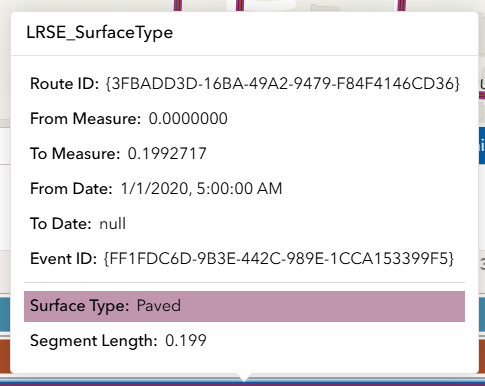
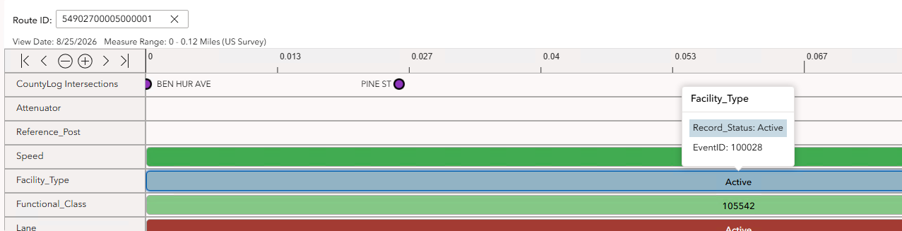
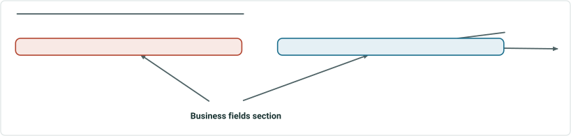

# Test Plan: Display Expanded LRS and Business Attributes in the SLD Hover Tooltip

|   |   |
| --- | --- |
| **Kind** | Test Plan · Experience Builder |
| **Release** | Enterprise 12.2 |
| **Product** | Roads & Highways · Pipeline Referencing · Utility Network |
| **Issue** | [ArcGISPro/ps-location-referencing#24784](https://devtopia.esri.com/ArcGISPro/ps-location-referencing/issues/24784) |
| **Source** | [ExB_SLD_Hover_Tooltip_Expanded_Attributes_TestPlan.pptx](<https://esriis.sharepoint.com/sites/LocationReferencing/Shared%20Documents/General/Test%20Plans/ExB_SLD_Hover_Tooltip_Expanded_Attributes_TestPlan.pptx>) |
| **Edited** | 2026-08-27 17:49 by Karlie Murray |
| **Extracted** | 2026-09-04 · lane `xmlstrip` |

<!-- metadata
```yaml
title: "Test Plan: Display Expanded LRS and Business Attributes in the SLD Hover Tooltip"
source_file: "ExB_SLD_Hover_Tooltip_Expanded_Attributes_TestPlan.pptx"
source_url: "https://esriis.sharepoint.com/sites/LocationReferencing/Shared%20Documents/General/Test%20Plans/ExB_SLD_Hover_Tooltip_Expanded_Attributes_TestPlan.pptx"
doc_id: 908
doc_kind: "Test Plan"
surface: "Experience Builder"
doc_revision: ""
target_release: "Enterprise 12.2"
pe: "karlie murray"
dev: "prutha shirodkar"
author: "Karlie Murray"
last_edited_by: "Karlie Murray"
last_edited: "2026-08-27T17:49:02Z"
extracted: 2026-09-04
extraction_lane: xmlstrip
prompt_version: "v2.0.2"
keywords: ["hover tooltip", "expanded attributes", "line event", "point event", "business attributes", "attribute set", "truncation", "regression tests"]
tools: ["Dynamic Segmentation Widget", "Straight Line Diagram"]
products: ["Roads & Highways", "Pipeline Referencing", "Utility Network"]
issues: ["ArcGISPro/ps-location-referencing#24784"]
related: [{"doc":2,"file":"iteration-planning-and-issue-tracking-for-location-referencing-3-8-12-2__doc2.md","s":1001.424},{"doc":23,"file":"enhancement-display-expanded-lrs-and-business-attributes-in-sld-hover-tooltip__doc23.md","s":7.571},{"doc":859,"file":"lrs-identify-show-coordinates-in-results-experience-builder-widget-test-plan__doc859.md","s":6.455},{"doc":71,"file":"test-plan-include-intersections-in-straight-line-diagram__doc71.md","s":4.151},{"doc":28,"file":"sld-devices-and-junctions-test-plan__doc28.md","s":4.073}]
```
-->

## Summary

This test plan covers the enhancement of the Straight Line Diagram (SLD) hover tooltip to display LRS attributes followed by business attributes using display names. It includes validation of attribute ordering, exclusion of certain fields, truncation behavior, and performance across various event types and data sets. Regression tests ensure no impact on existing SLD functionality and integration with related widgets.

## Related documents

<!-- related:begin -->
- [Iteration Planning and Issue Tracking for Location Referencing 3.8/12.2](<https://esriis.sharepoint.com/sites/lrsworkspace/LRS%20Doc%20Index/Schedules/iteration-planning-and-issue-tracking-for-location-referencing-3-8-12-2__doc2.md>) — shared issue ArcGISPro/ps-location-referencing#24784 · similar text 0.10 <!-- rel:2 -->
- [Enhancement: Display Expanded LRS and Business Attributes in SLD Hover Tooltip](<https://esriis.sharepoint.com/sites/lrsworkspace/LRS Doc Index/User Stories/enhancement-display-expanded-lrs-and-business-attributes-in-sld-hover-tooltip__doc23.md>) — similar text 0.44 · 6 title words · 2 filename words · same surface <!-- rel:23 -->
- [LRS Identify: Show Coordinates in Results Experience Builder Widget Test Plan](<https://esriis.sharepoint.com/sites/lrsworkspace/LRS%20Doc%20Index/Test%20Plans/lrs-identify-show-coordinates-in-results-experience-builder-widget-test-plan__doc859.md>) — similar text 0.21 · same kind/surface/release Enterprise 12.2/pe/dev/folder <!-- rel:859 -->
- [Test Plan: Include Intersections in Straight Line Diagram](<https://esriis.sharepoint.com/sites/lrsworkspace/LRS%20Doc%20Index/Test%20Plans/test-plan-include-intersections-in-straight-line-diagram__doc71.md>) — similar text 0.35 · 1 filename word · same kind/surface/folder <!-- rel:71 -->
- [SLD Devices and Junctions Test Plan](<https://esriis.sharepoint.com/sites/lrsworkspace/LRS%20Doc%20Index/Test%20Plans/sld-devices-and-junctions-test-plan__doc28.md>) — similar text 0.22 · 1 title word · 1 filename word · same kind/surface/folder <!-- rel:28 -->
<!-- related:end -->

<!-- docs:begin -->
## Esri documentation

_No page matched:_ [Dynamic Segmentation Widget](https://www.google.com/search?q=%22Dynamic%20Segmentation%20Widget%22+site%3Adoc.esri.com) · [Straight Line Diagram](https://www.google.com/search?q=%22Straight%20Line%20Diagram%22+site%3Adoc.esri.com)
<!-- docs:end -->

---

## Slide 1

Test Plan: Display Expanded LRS and Business Attributes in the SLD Hover Tooltip

Experience Builder  |  Dynamic Segmentation Widget
User Story: ps-location-referencing #24784

SE: prutha shirodkar
PE: karlie murray
RELEASE: Enterprise 12.2

## Slide 2

Overview & User Story
User Story
As an event editor or LRS analyst, I need to view LRS attributes (Route ID(s), Measure(s), Dates, Event ID) followed by business attributes in the SLD hover tooltip using display names, so that I can quickly understand event context without opening additional dialogs.
Workflow
Hover over event  →  Tooltip shows LRS attributes first  →  Business attributes next  →  Continue analysis
Scope of Enhancement

- Enhance the existing inline hover tooltip only (no change to click / double-click popup or highlight behavior)
- LRS attributes shown first: Route ID(s), Measure(s), Dates, Event ID
- Business (non-LRS) attributes shown after LRS attributes, using alias / display names
- Exclude ObjectID, Shape, and Shape Length, Editor Tracking Fields, Validation Fields, and Referent Fields
- Respect configured attribute sets
- Truncate overflow to fit UI
- Maintain hover performance
LEGEND
New Tooltip
Old Tooltip

 

## Slide 3



Bridge_Point

RouteIDs:
Measure: 1.5235
From Date: 1/2/2000
To Date: null
EventID: {3B29D0E5-61A6-44D8-BE80}

Record Status: Accepted
Owner: Govt
Speed

RouteIDs:
From Measure: 0
To Measure: 1.5235
From Date: 1/2/2000
To Date: null
EventID: 31485

Record Status: 5
Speed Limit: 35
Effective Date: 4/4/2011
Line Events
Point Events
Devices and Junctions – follow point event design, but will not have all fields (like EventID)
Business fields section
Line Network:
From Route and To Route are both displayed
SLD Tooltip Design For Events
Configured display field highlighted in same color as layer symbology
Business fields: system fields, editor tracking fields, validation fields, and referent fields will be excluded and should not display in tooltip.

## Slide 4

CountLog Intersections

IntersectionName: Emerson Av, English Av
RouteIDs: ,
Measure: 1.5235
From Date: 1/2/2000
To Date: null
IntersectionID: {3B29D0E5-61A6-44D8-BE80}
Pipeline Line

CenterLineID: {0E608787-64CC-4925-B8AC-E1D2E3E49FC8}
Engineering RouteID: {B80D1DA9-B731-4421-B00D-F51D4A5FCE0E}
Engineering To RouteID: {B80D1DA9-B731-4421-B00D-F51D4A5FCE0E}
Engineering From Measure: 0
Engineering To Measure: 53515

Asset group: Transmission Type
Asset type: Coated Steel
Asset ID: Ln-3-43
Road Centerline

CenterlineID: RD-1
Left From Address: 8740
Left To Address: 8702
Right From Address: 8741
Right To Address: 8703

County on Left: Franklin County
County on Right: Franklin County
Zip on Left: 43119
Zip on Right: 43119
SLD Tooltip Design For Centerlines & Intersections
*Business fields will vary based on data. If there are no business fields, the section will not display (intersections example)
Business fields: system fields, editor tracking fields, validation fields, and referent fields will be excluded and should not display in tooltip.

[figure: Intersections · Centerlines · Business fields section · ADM data · UN data · LRS fields section]

## Slide 5

Notes

- Confirm tooltip appears on hover over an event record (line and point events) centerlines, intersections, and devices/junctions
- Validate attribute ordering: LRS attributes first, business attributes second
- Only display business fields in the attribute set
- Validate alias / display names are used for all displayed fields
- Verify excluded fields do not display (ObjectID, Shape, Shape Length, Validation Fields, Referent Fields, Editor Tracking Fields)
- Test truncation / overflow behavior when attributes exceed available UI space  (no scroll experience) Max # of total fields is 20 or 25
- Verify attribute sets are respected (only configured fields shown, in set order)
- Confirm no change to click / double-click popup and highlight behavior
- No regression to Dynamic Segmentation table
- Test in Chrome and Edge browsers
- Run accessibility with Allyhawk

Test Data

- Test with line and non-line networks
  - RH data
  - UNAPR data
  - ADM data
  - PoM data
- Test with point and line events
- Spanning line events
- Layer with no business fields
- Layer with many business fields (truncation test)
- Test with large datasets to test hover performance/responsiveness
- Test with intersections, centerlines, devices and junctions

## Slide 6

SLD Tooltip Tests

| Test ID | Test Case | Expected Result |
| --- | --- | --- |
| A-1 | Hover over a line event in the SLD | Tooltip displays; LRS attributes appear first, business attributes second . From and To Measure display for line event. Only business fields from the attribute set are shown. |
| A-2 | Hover over a point event in the SLD | Tooltip displays; LRS attributes appear first, business attributes second . Single measure display for point event. Only business fields from the attribute set are shown. |
| A-3 | Confirm LRS attribute fields display | Tooltip displays Route ID(s), Measure(s), From/To Dates, and Event ID |
| A-4 | Excluded fields do not display in tooltip | ObjectID, Shape, Shape Length, Editor Tracking, Validation, and Referent fields are not shown in tooltip |
| A-5 | Hover an event that does not have business fields | Business fields section is not displayed. Only LRS attributes display. |
| A-6 | Hover an event that has null business fields | Null / empty business attribute values display gracefully (blank, not error) |
| A-7 | Hover an event with many business fields | Tooltip displays business fields gracefully. Truncates if needed. |
| A-8 | Hover an event that has attributes that exceed the UI space | Overflow is truncated cleanly. No scroll experience. |
| A-9 | Hover a feature in the SLD and confirm attributes in tooltip are correct | Match fields to another source (LRS Identify). Attribute fields match exactly. Decimal places match on numeric values. |
| A-10 | (Line Network) Hover a non-spanning line event | Tooltip displays From Route and To Route fields (same route) |
| A-11 | (Line Network) Hover a spanning line event | Tooltip displays From Route and To Route fields (different routes) |
| A-12 | Hover an intersection in the SLD | Tooltip displays ; LRS attributes appear first, business attributes second . Single measure display for intersections. |
| A-13 | Hover a centerline in the SLD (ADM or UN data) | Tooltip displays; LRS attributes appear first, business attributes second . |
| A-14 | Hover a device or junction in the SLD (UN data) | Tooltip displays; LRS attributes appear first, business attributes second . Single measure display for devices and junctions. |

## Slide 7

SLD Tooltip Configuration Tests

| Test ID | Test Case | Expected Result |
| --- | --- | --- |
| B-1 | Configure a line attribute set. In the SLD, hover a line event that is within the configured attribute set. | SLD only displays line events included in the attribute set. Tooltip only displays attribute fields that are included in the attribute set. Order of fields in the tooltip match what is configured in attribute set. |
| B-2 | Configure a point attribute set. In the SLD, hover a point event that is within the configured attribute set. | SLD only displays point events included in the attribute set. Tooltip only displays attribute fields that are included in the attribute set. Order of fields in the tooltip match what is configured in attribute set. |
| B-3 | Change the configured display field for a layer. In the SLD, hover over a feature in that same layer. | In the tooltip, the chosen display field is highlighted in the same color the layer’s symbology is set to. |
|  |  |  |
|  |  |  |
|  |  |  |

## Slide 8

Regression Tests

| Test ID | Test Case | Expected Result |
| --- | --- | --- |
| C-1 | Populate the SLD by typing in the route field | SLD populates with the correct route |
| C-2 | Layers can be turned on/off by clicking on the layer name in the SLD | Layers move to bottom when turned off and go back to original position when turned back on |
| C-3 | Double-click on a record in the SLD | Attribute popup opens. Editable/non-editable fields unchanged. |
| C-4 | Edit an editable field in the attribute popup | Edits can be applied |
| C-5 | Hover the measure ruler | Tooltip displays the correct measure |
| C-6 | Hover a feature in the SLD | Feature in SLD is highlighted (tooltip also displays) |
| C-7 | Click once on a feature in the SLD | Feature is highlighted in the SLD and map |
| C-8 | Select the Map Interact button and zoom in/out and pan the map around the displayed route | SLD follows where the map moves |
| C-9 | Select the Map Interact button and scroll the SLD horizontally | Map follows where the SLD scrolls to |
| C-10 | Unselect the Map Interact button and repeat tests C-8 & C-9 | Map and SLD do not follow each other |
| C-11 | Click the zoom in/out and Navigate forward/back buttons on SLD | SLD responds to selected action and zooms in/out or scrolls forward/back |
| C-12 | Turn off an event layer in the map and open SLD on a route where that event exists | The event that is turned off in the map does not display in the SLD |
| C-13 | Compare the results in the SLD and Table view of the DynSeg widget | The dynamic segmentation results in the table and the SLD match |

## Slide 9

Regression Tests

| Test ID | Test Case | Expected Result |
| --- | --- | --- |
| C-14 | Data Actions: Select by Route widget Search route > Data Actions > Dynamic Segmentation | DynSeg widget populates with the correct route from Search by Route widget |
| C-15 | Data Actions: LRS Identify widget Identify a route > Data Actions > Dynamic Segmentation | DynSeg widget populates with the correct route from LRS Identify widget |
|  |  |  |
|  |  |  |
|  |  |  |
|  |  |  |
