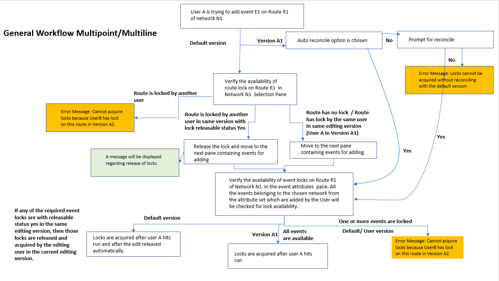
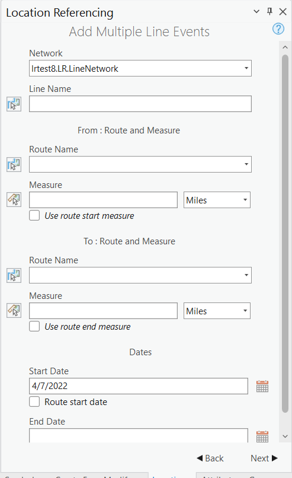

# Test Plan for Conflict Prevention for Add Multiple Line Events Tool in ArcGIS Pro

|   |   |
| --- | --- |
| **Kind** | Test Plan · Pro |
| **Release** | — |
| **Source** | [Conflict Prevention_Multiplelineevents_Pro_TestPlan.docx](<https://esriis.sharepoint.com/sites/LocationReferencing/Shared%20Documents/General/Test%20Plans/Conflict%20Prevention_Multiplelineevents_Pro_TestPlan.docx>) |
| **Edited** | 2022-04-12 23:45 by Lakshmi Ananthanarayanan |
| **Extracted** | 2026-09-04 · lane `xmlstrip` |

<!-- metadata
```yaml
title: "Test Plan for Conflict Prevention for Add Multiple Line Events Tool in ArcGIS Pro"
source_file: "Conflict Prevention_Multiplelineevents_Pro_TestPlan.docx"
source_url: "https://esriis.sharepoint.com/sites/LocationReferencing/Shared%20Documents/General/Test%20Plans/Conflict%20Prevention_Multiplelineevents_Pro_TestPlan.docx"
doc_id: 668
doc_kind: "Test Plan"
surface: "Pro"
doc_revision: ""
target_release: ""
pe: ""
dev: ""
author: "Lkshmi Ananthanarayanan"
last_edited_by: "Lakshmi Ananthanarayanan"
last_edited: "2022-04-12T23:45:00Z"
extracted: 2026-09-04
extraction_lane: xmlstrip
prompt_version: "v2.0.2"
keywords: ["conflict prevention", "event lock", "line event", "nonline network", "line network", "attribute set", "versioning", "lock transfer"]
tools: ["Add Multiple Line Events"]
products: []
issues: []
related: [{"doc":667,"file":"conflict-prevention-for-event-editing-in-pro-add-multiple-point-events-tool__doc667.md","s":8.56},{"doc":666,"file":"conflict-prevention-for-event-editing-in-pro-lr-event-tools__doc666.md","s":6.522},{"doc":670,"file":"conflict-prevention-for-event-editing-in-pro-core-tools__doc670.md","s":5.9},{"doc":415,"file":"test-plan-conflict-prevention-for-lrs-widgets__doc415.md","s":5.644},{"doc":671,"file":"conflict-prevention-for-event-editing-in-pro-core-tools__doc671.md","s":5.571}]
```
-->

## Summary

This test plan covers conflict prevention locking behavior for the Add Multiple Line Events tool in ArcGIS Pro. It includes tests on branched version service data with conflict prevention enabled, across nonline and line networks, spanning and nonspanning line events, and various attribute sets. The plan verifies lock acquisition, transfer, and error handling scenarios for multiple users and versions.

## Related documents

<!-- related:begin -->
- [Conflict Prevention for Event Editing in Pro – Add Multiple Point Events Tool Test Plan](<https://esriis.sharepoint.com/sites/lrsworkspace/LRS Doc Index/Test Plans/conflict-prevention-for-event-editing-in-pro-add-multiple-point-events-tool__doc667.md>) — similar text 0.61 · 6 title words · 3 filename words · same kind/surface/folder <!-- rel:667 -->
- [Conflict Prevention for Event Editing in Pro – LR Event Tools](<https://esriis.sharepoint.com/sites/lrsworkspace/LRS Doc Index/Test Plans/conflict-prevention-for-event-editing-in-pro-lr-event-tools__doc666.md>) — similar text 0.34 · 3 title words · 3 filename words · same kind/surface/folder <!-- rel:666 -->
- [Conflict Prevention for Event Editing in Pro – Core Tools](<https://esriis.sharepoint.com/sites/lrsworkspace/LRS Doc Index/Test Plans/conflict-prevention-for-event-editing-in-pro-core-tools__doc670.md>) — similar text 0.31 · 3 title words · 3 filename words · same kind/surface/folder <!-- rel:670 -->
- [Test Plan: Conflict Prevention for LRS Widgets](<https://esriis.sharepoint.com/sites/lrsworkspace/LRS Doc Index/Test Plans/test-plan-conflict-prevention-for-lrs-widgets__doc415.md>) — similar text 0.73 · 2 title words · 1 filename word · same kind/folder <!-- rel:415 -->
- [Conflict Prevention for Event Editing in Pro – Core Tools](<https://esriis.sharepoint.com/sites/lrsworkspace/LRS Doc Index/Test Plans/conflict-prevention-for-event-editing-in-pro-core-tools__doc671.md>) — similar text 0.32 · 3 title words · 3 filename words · same kind/surface/folder <!-- rel:671 -->
<!-- related:end -->

<!-- docs:begin -->
## Esri documentation

[Add multiple line events](https://doc.esri.com/en/arcgis-pro/latest/help/production/location-referencing-pipelines/add-multiple-line-events.html) · [Conflict prevention](https://doc.esri.com/en/arcgis-pro/latest/help/production/location-referencing-pipelines/conflict-prevention.html)
<!-- docs:end -->

---

Test Plan for Conflict prevention for Add multiple line Events tool in Pro

- Test on branched version service data with conflict prevention enabled
- Test on nonline and line network, test on spanning line event and Nonspanning line event
- Using attribute sets – Alllineevents (default (9 events)), AttributesetN1 (Containing E1, E2, E3), AttributesetL1(containing E1_L1, ES1_L1, ES2_L1), AttributesetL2 (containing ES1_L2), AttributesetN1L1 (containing events E1, E1_L1, ES2_L1), AttributesetN1N2 (containing events E1, E2, E3, E_N2),
AttributesetL1L2 (containing ES1_L1, ES1_L2)

- N1 – nonline network – three events E1, E2 and E3
- N2 – Nonline network – one event E_N2
- L1 – Line network - three events – Nonspanning event - E1_L1, Spanning events – ES1_L1 & ES2_L1
- L2 – line network –   two events – Nonspanning event -E1_L2, Spanning event – ES1_L2
- User A has versions Version A1 and VersionA2.
- User B has version Version B1.

In case of event lock, for nonline network event lock is applied for a route and for line network event lock is applied for a line (ie event is locked for all the routes in a line).
Verify both in default version and user version. (100% testing in user version, 10% in default)

All the testcases mentioned in this test plan in the following pages are for acquiring conflict prevention locks after reconciling with default.

[figure: All the testcases mentioned in th · is test · plan · in the following pages · are for acquiring conflict prevention lock · s · after reconciling · with · default.]

| TC No | Test case | Locked by | Locked in | Expected result |
| --- | --- | --- | --- | --- |
| 1 | No route /line lock exists | None | None | Move to the next pane for acquiring event lock |
| 2 | Route /line locked by same user in the same editing version | User A | Version A 1 | Move to the next pane for acquiring event lock |
| 3 | Concurrent Route /line locked by another user in different version | User B | Version A 2 | Move to the next pane for acquiring event lock |
|  |  | Concurrent Route |  |  |
| 4 | Route /line of different network locked by the same user in different version | User A | Version B1 | Move to the next pane for acquiring event lock |
|  |  | Route of different network |  |  |
| 5 | Route /line locked by another user in same editing version and not edited in that version . | User B | Version A1 | Release the route lock and move to the next pane for acquiring event lock |
| 6 | Route /line locked by current user in different version and not edited in that version | User A | Version A2 | Cannot release event lock. Show error message |
| 7 | Route /line locked by another user in same editing version . Edited in that version | User B | Version A 1 | Cannot release event lock. Show error message |
| 8 | Route /line locked by the current user in different version and has edits in the version | User A | Version A 2 | Cannot release event lock. Show error message |

[figure: Verifying the · availability of route · / · line · lock in pane 2 where we choose the · route in the · network. · Test all · the test cases for both line · network ( · line lock) · and nonline network · (route lock) · separately · . · Verify with both RouteID and · RouteName · / · LineID · Verify by both using the route · picker and · typing the · routeId · / · routename · manually]

    In Pane 2, checking for route/line lock

| TC No. | Events added | Test Case | Nonline Network1 |  |  | Nonline Network2 | LineNetwork1 |  |  | LineNetwork2 |  | Message | Result |
| --- | --- | --- | --- | --- | --- | --- | --- | --- | --- | --- | --- | --- | --- |
|  |  |  | E1 | E2 | E3 | E_N2 | E1_L1 | ES1_L1 | ES2_L1 | E1_L2 | ES1_L2 |  |  |
| 9 | Default Attribute Set (all line events) | No lock exists and choosing any of the networks in the network pane will result in changes in acquiring locks in the events pane. |  |  |  |  |  |  |  |  |  |  |  |
|  |  | Choosing Nonline N1 |  |  |  |  |  |  |  |  |  | Event lock acquired for the events E1, E2 & E3 of the Network1 | Message for acquiring locks at the top of pane – for all events |
|  |  | Choosing Nonline N2 |  |  |  |  |  |  |  |  |  | Event lock acquired for the events E_N2, of the Network2 |  |
|  |  | Choosing Line L1 |  |  |  |  |  |  |  |  |  | Event lock acquired for the events E1_L1, ES1_L1 & ES2_L1 of the line Network1 |  |
|  |  | Choosing Line L2 |  |  |  |  |  |  |  |  |  | Event lock acquired for the events E1_L2 &ES1_L2 for the line Network2 |  |
| 10 | Default Attribute set (all line events) | Event locked by another user in a same version with releasable status yes for event E2 of N1 and ES1_L1 of Linenetwork1 |  |  |  |  |  |  |  |  |  |  |  |
|  |  | Choosing Nonline N1 |  | Lock transfer from UserB to User A inUserA.A1 |  |  |  |  |  |  |  | Event lock acquired for the events E1, E2 & E3 of the Network1 | Message for acquiring locks at the top of pane – for all events |
|  |  | Choosing Nonline N2 |  |  |  |  |  |  |  |  |  | Event lock acquired for the events E_N2, of the Network2 |  |
|  |  | Choosing Line L1 |  |  |  |  |  | Lock transfer from UserB to User A inUserA.A1 |  |  |  | Event lock acquired for the events E1_L1, ES1_L1 & ES2_L1 of the line Network1 |  |
|  |  | Choosing Line L2 |  |  |  |  |  |  |  |  |  | Event lock acquired for the events E1_L2 &ES1_L2 for the line Network2 |  |

Current user is User A, adding multiple line events in version A1 using default attribute set.  UserA has two versions A1 and A2 and UserB has a version B1. For both User A and User B use editor / GIS professional privileges.

| TC No. | Events added | Test Case | Nonline Network1 |  |  | Nonline Network2 | LineNetwork1 |  |  | LineNetwork2 |  | Message | Result |
| --- | --- | --- | --- | --- | --- | --- | --- | --- | --- | --- | --- | --- | --- |
|  |  |  | E1 | E2 | E3 | E_N2 | E1_L1 | ES1_L1 | ES2_L1 | E1_L2 | ES1_L2 |  |  |
| 11 | Default Attribute Set (all line events) All events are checked and edited in that selected Network | Lock exists on one of the events - locked by different user in the same version . Event E2 of N1 is locked by User B in Version A1. |  |  |  |  |  |  |  |  |  |  |  |
|  |  | Choosing Nonline N1 |  | Locked by User B in A1 |  |  |  |  |  |  |  | No Event lock acquired | Error Message |
|  |  | Choosing Nonline N2 |  |  |  |  |  |  |  |  |  | Event lock acquired for the events E_N2, of the Network2 | Message for acquiring locks at the top of pane – for all events |
|  |  | Choosing Line L1 |  |  |  |  |  |  |  |  |  | Event lock acquired for the events E1_L1, ES1_L1 & ES2_L1 of the line Network1 |  |
|  |  | Choosing Line L2 |  |  |  |  |  |  |  |  |  | Event lock acquired for the events E1_L2 &ES1_L2 for the line Network2 |  |
| 12 | Default Attribute set (all line events) | Some of the events are already locked by current user in the current editing version. Event E3 in N1, Event Es1_L2 in line network2. |  |  |  |  |  |  |  |  |  |  |  |
|  |  | Choosing Nonline N1 |  |  | UserA in A1 |  |  |  |  |  |  | Event lock acquired for the events E1 & E2 . E3 already locked by User A for the Network1 | Message for acquiring locks at the top of pane – for all events |
|  |  | Choosing Nonline N2 |  |  |  |  |  |  |  |  |  | Event lock acquired for the events E_N2, of the Network2 |  |
|  |  | Choosing Line L1 |  |  |  |  |  |  |  |  |  | Event lock acquired for the events E1_L1, ES1_L1 & ES2_L1 of the line Network1 |  |
|  |  | Choosing Line L2 |  |  |  |  |  |  |  |  | UserA in A1 | Event lock acquired for the events E1_L2 & ES1_L2 already locked by User A for the line Network2 |  |

| TC No. | Events added | Test Case | Nonline Network1 |  |  | Nonline Network2 | LineNetwork1 |  |  | LineNetwork2 |  | Message | Result |
| --- | --- | --- | --- | --- | --- | --- | --- | --- | --- | --- | --- | --- | --- |
|  |  |  | E1 | E2 | E3 | E_N2 | E1_L1 | ES1_L1 | ES2_L1 | E1_L2 | ES1_L2 |  |  |
| 1 3 | Default Attribute Set (all line events) All events are checked and edited in that selected Network | Some of the events are already locked by same user in another version - Event E1 of Network1, E S 1_L1 of line network1 and E1_L2 of linenetwork2 are locked by User A in version A2 |  |  |  |  |  |  |  |  |  |  |  |
|  |  | Choosing Nonline N1 | Locked by User A in A 2 |  |  |  |  |  |  |  |  | No Event lock acquired | Error Message |
|  |  | Choosing Nonline N2 |  |  |  |  |  |  |  |  |  | Event lock acquired for the events E_N2, of the Network2 | Message for acquiring locks at the top of pane |
|  |  | Choosing Line L1 |  |  |  |  |  | Locked by User A in A 2 |  |  |  | No Event lock acquired | Error Message |
|  |  | Choosing Line L2 |  |  |  |  |  |  |  | Locked by User A in A 2 |  | No Event lock acquired | Error Message |
| 14 | Default Attribute set (all line events) | Some of the events are already locked by another user in another version - E1 of network1, E_N2 of N2, E1_L1 of L 1, ES1_L2 are locked by User B in version B1 |  |  |  |  |  |  |  |  |  |  |  |
|  |  | Choosing Nonline N1 and adding only event E3 | Locked by User B in B1 X | x (unchecked) |  |  |  |  |  |  |  | Event lock acquired for the events E 3 of for the Network1 | Message for acquiring locks at the top of pane – for all events |
|  |  | Choosing Nonline N2 |  |  |  | Locked by User B in B1 |  |  |  |  |  | No Event lock acquired | Error Message |
|  |  | Choosing Line L1 and adding only event ES2_L1 |  |  |  |  | Locked by User B in B1 X | X (unchecked) |  |  |  | Event lock acquired for the events ES2_L1 of the line Network1 | Message for acquiring locks at the top of pane |
|  |  | Choosing Line L2 , adding all events |  |  |  |  |  |  |  |  | Locked by User B in B1 | No Event lock acquired | Error Message |

Current user is User A, adding multiple line events in version A1 using attribute set AttributesetN1 (Containing E1, E2, E3).  UserA has two versions A1 and A2 and UserB has a version B1.

| TC No. | Events added | Test Case | Nonline Network1 |  |  | Nonline Network2 | LineNetwork1 |  |  | LineNetwork2 |  | Message | Result |
| --- | --- | --- | --- | --- | --- | --- | --- | --- | --- | --- | --- | --- | --- |
|  |  |  | E1 | E2 | E3 | E_N2 | E1_L1 | ES1_L1 | ES2_L1 | E1_L2 | ES1_L2 |  |  |
| 15 | AttributesetN1 ( Containing E1, E2, E3) | No lock exists and choosing anyone of the networks in the network pane will result in changes in acquiring locks in the events pane. |  |  |  |  |  |  |  |  |  |  |  |
|  |  | Choosing Nonline N1 |  |  |  |  |  |  |  |  |  | Event lock acquired for the events E1, E2 & E3 of the Network1 | Message for acquiring locks at the top of pane – for all events |
|  |  | Choosing Nonline N2 |  |  |  |  |  |  |  |  |  | No Event lock acquired | Error message "No attributes are selected." |
|  |  | Choosing Line L1 |  |  |  |  |  |  |  |  |  | No Event lock acquired | Error message "No attributes are selected." |
|  |  | Choosing Line L2 |  |  |  |  |  |  |  |  |  | No Event lock acquired | Error message "No attributes are selected." |
| 16 | AttributesetN1 ( Containing E1, E2, E3) | Event locked by another user in a same version with releasable status yes for event E2 of N1 and ES1_L1 of Linenetwork1 |  |  |  |  |  |  |  |  |  |  |  |
|  |  | Choosing Nonline N1 |  | Lock transfer from UserB to User A inUserA.A1 |  |  |  |  |  |  |  | Event lock acquired for the events E1, E2 & E3 of the Network1 | Message for acquiring locks at the top of pane – for all events |
|  |  | Choosing Nonline N2 |  |  |  |  |  |  |  |  |  | No Event lock acquired | Error message "No attributes are selected." |
|  |  | Choosing Line L1 |  |  |  |  |  | Lock available for transfer . ( From User B) |  |  |  | No Event lock acquired . | Error message "No attributes are selected." |
|  |  | Choosing Line L2 |  |  |  |  |  |  |  |  |  | No Event lock acquired. | Error message "No attributes are selected." |

| TC No. | Events added | Test Case | Nonline Network1 |  |  | Nonline Network2 | LineNetwork1 |  |  | LineNetwork2 |  | Message | Result |
| --- | --- | --- | --- | --- | --- | --- | --- | --- | --- | --- | --- | --- | --- |
|  |  |  | E1 | E2 | E3 | E_N2 | E1_L1 | ES1_L1 | ES2_L1 | E1_L2 | ES1_L2 |  |  |
| 17 | AttributesetN1 ( Containing E1, E2, E3) | Lock exists on one of the events - locked by different user in the same version ( not transferrable) . Event E2 of N1 is locked by User B in Version A1. |  |  |  |  |  |  |  |  |  |  |  |
|  |  | Choosing Nonline N1 |  | Locked by User B in A1 |  |  |  |  |  |  |  | No Event lock acquired | Error message at the top of the pane : Cannot acquire locks |
|  |  | Choosing Nonline N2 |  |  |  |  |  |  |  |  |  | No Event lock acquired | Error message "No attributes are selected." |
|  |  | Choosing Line L1 |  |  |  |  |  |  |  |  |  | No Event lock acquired |  |
|  |  | Choosing Line L2 |  |  |  |  |  |  |  |  |  | No Event lock acquired |  |
| 1 8 | AttributesetN1 ( Containing E1, E2, E3) | Some of the events are already locked by current user in the current editing version. Event E3 in N1, Event E S 1_L2 in line network2. |  |  |  |  |  |  |  |  |  |  |  |
|  |  | Choosing Nonline N1 |  |  | UserA in A1 |  |  |  |  |  |  | Event lock acquired for the events E1 & E2 . E3 already locked by User A for the Network1 | Message for acquiring locks at the top of pane – for all events |
|  |  | Choosing Nonline N2 |  |  |  |  |  |  |  |  |  | No Event lock acquired | Error message "No attributes are selected." |
|  |  | Choosing Line L1 |  |  |  |  |  |  |  |  |  | No Event lock acquired |  |
|  |  | Choosing Line L2 |  |  |  |  |  |  |  |  | UserA in A1 . Already locked | No Event lock acquired |  |

| TC No. | Events added | Test Case | Nonline Network1 |  |  | Nonline Network2 | LineNetwork1 |  |  | LineNetwork2 |  | Message | Result |
| --- | --- | --- | --- | --- | --- | --- | --- | --- | --- | --- | --- | --- | --- |
|  |  |  | E1 | E2 | E3 | E_N2 | E1_L1 | ES1_L1 | ES2_L1 | E1_L2 | ES1_L2 |  |  |
| 19 | AttributesetN1 ( Containing E1, E2, E3) | Some of the events are already locked by same user in another version - Event E1 of Network1, ES1_L1 of line network1 and E1_L2 of linenetwork2 are locked by User A inversion A2 |  |  |  |  |  |  |  |  |  |  |  |
|  |  | Choosing Nonline N1 | Locked by User A in A 2 |  |  |  |  |  |  |  |  | No Event lock acquired | Error message at the top of the pane : Cannot acquire locks |
|  |  | Choosing Nonline N2 |  |  |  |  |  |  |  |  |  | No Event lock acquired | Error message "No attributes are selected." |
|  |  | Choosing Line L1 |  |  |  |  |  | Locked by User A in A2 |  |  |  | No Event lock acquired |  |
|  |  | Choosing Line L2 |  |  |  |  |  |  |  | Locked by User A in A 2 |  | No Event lock acquired |  |
| 20 | AttributesetN1 ( Containing E1, E2, E3) | Some of the events are already locked by another user in another version - E1 of network1, E_N2 of N2, E1_L1 of L1, ES1_L2 are locked by User B in version B1 |  |  |  |  |  |  |  |  |  |  |  |
|  |  | Choosing Nonline N1 and adding only event E3 | Locked by User B in B1 (unchecked by user A) | X ( unchecked by user A ) |  |  |  |  |  |  |  | Event lock acquired for the event E 3 of for the Network1 | Message for acquiring locks at the top of pane – for all events |
|  |  | Choosing Nonline N2 |  |  |  | Locked by User B in B1 |  |  |  |  |  | No Event lock acquired | Error message "No attributes are selected." |
|  |  | Choosing Line L1 |  |  |  |  | Locked by User B in B1 |  |  |  |  | No Event lock acquired |  |
|  |  | Choosing Line L2, adding all events |  |  |  |  |  |  |  |  | Locked by User B in B1 | No Event lock acquired |  |

Current user is User A, adding multiple line events in version A1 using attribute set AttributesetL1(containing E1_L1, ES1_L1, ES2_L1), UserA has two versions A1 and A2 and UserB has a version B1.

| TC No. | Events added | Test Case | Nonline Network1 |  |  | Nonline Network2 | LineNetwork1 |  |  | LineNetwork2 |  | Message | Result |
| --- | --- | --- | --- | --- | --- | --- | --- | --- | --- | --- | --- | --- | --- |
|  |  |  | E1 | E2 | E3 | E_N2 | E1_L1 | ES1_L1 | ES2_L1 | E1_L2 | ES1_L2 |  |  |
| 21 | AttributesetL1 ( containing E1_L1, ES1_L1, ES2_L1), | No lock exists and choosing anyone of the networks in the network pane will result in changes in acquiring locks in the events pane. |  |  |  |  |  |  |  |  |  |  |  |
|  |  | Choosing Nonline N1 |  |  |  |  |  |  |  |  |  | No Event lock acquired | Error message "No attributes are selected." |
|  |  | Choosing Nonline N2 |  |  |  |  |  |  |  |  |  | No Event lock acquired | Error message "No attributes are selected." |
|  |  | Choosing Line L1 |  |  |  |  |  |  |  |  |  | Event lock acquired for the events E1 _L1 , E S1_L1 & E S2_L1 of the line Network1 | Message for acquiring locks at the top of pane – for all events |
|  |  | Choosing Line L2 |  |  |  |  |  |  |  |  |  | No Event lock acquired | Error message "No attributes are selected." |
| 22 | AttributesetL1 ( containing E1_L1, ES1_L1, ES2_L1), | Event locked by another user in a same version with releasable status yes for event E2 of N1 and ES1_L1 of Linenetwork1 |  |  |  |  |  |  |  |  |  |  |  |
|  |  | Choosing Nonline N1 |  | Lock available for transfer (User B) |  |  |  |  |  |  |  | No Event lock acquired | Error message "No attributes are selected." |
|  |  | Choosing Nonline N2 |  |  |  |  |  |  |  |  |  | No Event lock acquired | Error message "No attributes are selected." |
|  |  | Choosing Line L1 |  |  |  |  |  | Lock transfer from UserB to User A inUserA.A1 |  |  |  | Event lock acquired for the events E1 _L1 , E S1_L1 & E S2_L1 of the line Network1 . | Message for acquiring locks at the top of pane – for all events |
|  |  | Choosing Line L2 |  |  |  |  |  |  |  |  |  | No Event lock acquired . | Error message "No attributes are selected." |

| TC No. | Events added | Test Case | Nonline Network1 |  |  | Nonline Network2 | LineNetwork1 |  |  | LineNetwork2 |  | Message | Result |
| --- | --- | --- | --- | --- | --- | --- | --- | --- | --- | --- | --- | --- | --- |
|  |  |  | E1 | E2 | E3 | E_N2 | E1_L1 | ES1_L1 | ES2_L1 | E1_L2 | ES1_L2 |  |  |
| 23 | AttributesetL1 ( containing E1_L1, ES1_L1, ES2_L1), ) | Lock exists on one of the events - locked by different user in the same version (not transferrable) . Event E S2_L1 of L 1 is locked by User B in Version A1. |  |  |  |  |  |  |  |  |  |  |  |
|  |  | Choosing Nonline N1 |  |  |  |  |  |  |  |  |  | No Event lock acquired | Error message "No attributes are selected." |
|  |  | Choosing Nonline N2 |  |  |  |  |  |  |  |  |  | No Event lock acquired | Error message "No attributes are selected." |
|  |  | Choosing Line L1 |  |  |  |  |  |  | Locked by User B in A1 |  |  | No Event lock acquired | Error message at the top of the pane : Cannot acquire locks |
|  |  | Choosing Line L2 |  |  |  |  |  |  |  |  |  | No Event lock acquired | Error message "No attributes are selected." |
| 24 | AttributesetL1 ( containing E1_L1, ES1_L1, ES2_L1), ) | Some of the events are already locked by current user in the current editing version. Event E3 in N1, Event ES1_L2 in line network2. |  |  |  |  |  |  |  |  |  |  |  |
|  |  | Choosing Nonline N1 |  |  | UserA in A1 . |  |  |  |  |  |  | No Event lock acquired | Error message "No attributes are selected |
|  |  | Choosing Nonline N2 |  |  |  |  |  |  |  |  |  | No Event lock acquired | Message for acquiring locks at the top of pane – for all events |
|  |  | Choosing Line L1 |  |  |  |  |  |  | UserA in A1 . Already locked |  |  | Event lock acquired for the events E1 _L1& E S1_L1. E S2_L1 is already locked by User A for the Network1 | Error message "No attributes are selected." |
|  |  | Choosing Line L2 |  |  |  |  |  |  |  |  |  | No Event lock acquired | Error message "No attributes are selected." |

| TC No. | Events added | Test Case | Nonline Network1 |  |  | Nonline Network2 | LineNetwork1 |  |  | LineNetwork2 |  | Message | Result |
| --- | --- | --- | --- | --- | --- | --- | --- | --- | --- | --- | --- | --- | --- |
|  |  |  | E1 | E2 | E3 | E_N2 | E1_L1 | ES1_L1 | ES2_L1 | E1_L2 | ES1_L2 |  |  |
| 25 | AttributesetL1 ( containing E1_L1, ES1_L1, ES2_L1), ) | Some of the events are already locked by same user in another version - Event E1 of Network1, ES1_L1 of line network1 and E1_L2 of linenetwork2 are locked by User A in version A2 |  |  |  |  |  |  |  |  |  |  |  |
|  |  | Choosing Nonline N1 | Locked by User A in A2 |  |  |  |  |  |  |  |  | No Event lock acquired | Error message "No attributes are selected |
|  |  | Choosing Nonline N2 |  |  |  |  |  |  |  |  |  | No Event lock acquired | Error message "No attributes are selected." |
|  |  | Choosing Line L1 |  |  |  |  |  | Locked by User A in A 2 |  |  |  | No Event lock acquired | Error message at the top of the pane : Cannot acquire locks |
|  |  | Choosing Line L2 |  |  |  |  |  |  |  | Locked by User A in A 2 |  | No Event lock acquired | Error message "No attributes are selected |
| 26 | AttributesetL1 ( containing E1_L1, ES1_L1, ES2_L1), ) | Some of the events are already locked by another user in another version - E1 of network1, E_N2 of N2, E1_L1 of L1, ES1_L2 are locked by User B in version B1 |  |  |  |  |  |  |  |  |  |  |  |
|  |  | Choosing Nonline N1 | Locked by User B in B1 |  |  |  |  |  |  |  |  | No Event lock acquired | Error message "No attributes are selected ” |
|  |  | Choosing Nonline N2 |  |  |  | Locked by User B in B1 |  |  |  |  |  | No Event lock acquired | Error message "No attributes are selected." |
|  |  | Choosing Line L1 and adding only ES1_L1 |  |  |  |  | Locked by User B in B1 |  | X ( user unchecked) |  |  | Event lock acquired for the event E S1_L1 of for the line Network1 | Message for acquiring locks at the top of pane – for all events |
|  |  | Choosing Line L2, adding all events |  |  |  |  |  |  |  |  | Locked by User B in B1 | No Event lock acquired | Error message "No attributes are selected ” |

| TC No. | Events added | Test Case | Nonline Network1 |  |  | Nonline Network2 | LineNetwork1 |  |  | LineNetwork2 |  | Message | Result |
| --- | --- | --- | --- | --- | --- | --- | --- | --- | --- | --- | --- | --- | --- |
|  |  |  | E1 | E2 | E3 | E_N2 | E1_L1 | ES1_L1 | ES2_L1 | E1_L2 | ES1_L2 |  |  |
| 27 | AttributesetN1L1 (containing events E1, E1_L1, ES2_L1) | No lock exists and choosing anyone of the networks in the network pane will result in changes in acquiring locks in the events pane. |  |  |  |  |  |  |  |  |  |  |  |
|  |  | Choosing Nonline N1 |  |  |  |  |  |  |  |  |  | Event lock acquired for the events E1 of the Network1 | Message for acquiring locks at the top of pane – for all events |
|  |  | Choosing Nonline N2 |  |  |  |  |  |  |  |  |  | No Event lock acquired | Error message "No attributes are selected." |
|  |  | Choosing Line L1 |  |  |  |  |  |  |  |  |  | Event lock acquired for the events E1_L1, & ES2_L1 of the line Network1 | Message for acquiring locks at the top of pane – for all events |
|  |  | Choosing Line L2 |  |  |  |  |  |  |  |  |  | No Event lock acquired | Error message "No attributes are selected." |
| 28 | AttributesetN1L1 (containing events E1, E1_L1, ES2_L1) | Event locked by another user in a same version with releasable status yes for event E 1 of N1 and ES1_L1 of Linenetwork1 |  |  |  |  |  |  |  |  |  |  |  |
|  |  | Choosing Nonline N1 | Lock transfer from UserB to User A inUserA.A1 |  |  |  |  |  |  |  |  | Event lock acquired for the events E1 of the Network1 | Message for acquiring locks at the top of pane |
|  |  | Choosing Nonline N2 |  |  |  |  |  |  |  |  |  | No Event lock acquired | Error message "No attributes are selected." |
|  |  | Choosing Line L1 |  |  |  |  |  | Lock available for transfe r ( User B ) |  |  |  | Event lock acquired for the events E1_L1, & ES2_L1 of the line Network1 | Message for acquiring locks at the top of pane – for all events |
|  |  | Choosing Line L2 |  |  |  |  |  | Locked by User B in A1 |  |  |  | No Event lock acquired | Error message at the top of the pane: Cannot acquire locks |

Current user is User A, adding multiple line events in version A1 using AttributesetN1L1 (containing events E1, E1_L1, ES2_L1) attribute set.  UserA has two versions A1 and A2 and UserB has a version B1.

| TC No. | Events added | Test Case | Nonline Network1 |  |  | Nonline Network2 | LineNetwork1 |  |  | LineNetwork2 |  | Message | Result |
| --- | --- | --- | --- | --- | --- | --- | --- | --- | --- | --- | --- | --- | --- |
|  |  |  | E1 | E2 | E3 | E_N2 | E1_L1 | ES1_L1 | ES2_L1 | E1_L2 | ES1_L2 |  |  |
|  | AttributesetN1L1 (containing events E1, E1_L1, ES2_L1) | Lock exists on one of the events - locked by different user in the same version (not transferrable) . Event E 1 of N1 & Event ES2_L1 are locked by User B in Version A1. |  |  |  |  |  |  |  |  |  |  |  |
|  |  | Choosing Nonline N1 | Locked by User B in A1 |  |  |  |  |  |  |  |  | No Event lock acquired | Error message at the top of the pane: Cannot acquire locks |
|  |  | Choosing Nonline N2 |  |  |  |  |  |  |  |  |  | No Event lock acquired | Error message "No attributes are selected." |
|  |  | Choosing Line L1 |  |  |  |  |  |  | Locked by User B in A1 |  |  | No Event lock acquired | Error message at the top of the pane: Cannot acquire locks |
|  |  | Choosing Line L2 |  |  |  |  |  |  |  |  |  | No Event lock acquired | Error message "No attributes are selected." |
| 29 | AttributesetN1L1 (containing events E1, E1_L1, ES2_L1) | Some of the events are already locked by current user in the current editing version. Event E 1 in N1, Event E1_L 1 in line network 1 . |  |  |  |  |  |  |  |  |  |  |  |
|  |  | Choosing Nonline N1 | UserA in A1 |  |  |  |  |  |  |  |  | E 1 is already locked by User A for the Network1 | No new locks acquired. No message |
|  |  | Choosing Nonline N2 |  |  |  |  |  |  |  |  |  | No Event lock acquired | Error message "No attributes are selected |
|  |  | Choosing Line L1 |  |  |  |  | UserA in A1 |  |  |  |  | Event lock acquired for the events , ES2_L1 of the line Network1 . E S1_L1 is already locked | Message for acquiring locks at the top of pane |
|  |  | Choosing Line L2 |  |  |  |  |  |  |  |  |  | No Event lock acquired | Error message "No attributes are selected |

| TC No. | Events added | Test Case | Nonline Network1 |  |  | Nonline Network2 | LineNetwork1 |  |  | LineNetwork2 |  | Message | Result |
| --- | --- | --- | --- | --- | --- | --- | --- | --- | --- | --- | --- | --- | --- |
|  |  |  | E1 | E2 | E3 | E_N2 | E1_L1 | ES1_L1 | ES2_L1 | E1_L2 | ES1_L2 |  |  |
| 30 | AttributesetN1N2 (containing events E1, E2, E3, E_N2) | No lock exists and choosing anyone of the networks in the network pane will result in changes in acquiring locks in the events pane. |  |  |  |  |  |  |  |  |  |  |  |
|  |  | Choosing Nonline N1 |  |  |  |  |  |  |  |  |  | Event lock acquired for the events E1, E2 & E3 of the Network1 | Message for acquiring locks at the top of pane – for all events |
|  |  | Choosing Nonline N2 |  |  |  |  |  |  |  |  |  | Event lock acquired for the events E_N2, of the Network2 |  |
|  |  | Choosing Line L1 |  |  |  |  |  |  |  |  |  | No Event lock acquired | Error message "No attributes are selected ” |
|  |  | Choosing Line L2 |  |  |  |  |  |  |  |  |  | No Event lock acquired |  |
| 31 | AttributesetN1N2 (containing events E1, E2, E3, E_N2) ) | Event locked by another user in a same version with releasable status yes for event E2 of N1 and ES1_L1 of Linenetwork1 |  |  |  |  |  |  |  |  |  |  |  |
|  |  | Choosing Nonline N1 |  | Lock transfer from UserB to User A inUserA.A1 |  |  |  |  |  |  |  | Event lock acquired for the events E1, E2 & E3 of the Network1 | Message for acquiring locks at the top of pane – for all events |
|  |  | Choosing Nonline N2 |  |  |  |  |  |  |  |  |  | Event lock acquired for the events E _N2 of the Network 2 |  |
|  |  | Choosing Line L1 |  |  |  |  |  | Lock available for transfer |  |  |  | No Event lock acquired | Error message "No attributes are selected ” |
|  |  | Choosing Line L2 |  |  |  |  |  |  |  |  |  | No Event lock acquired |  |

Current user is User A, adding multiple line events in version A1 using AttributesetN1N2 (containing events E1, E2, E3, E_N2). User A has two versions A1 and A2 and UserB has a version B1

| TC No. | Events added | Test Case | Nonline Network1 |  |  | Nonline Network2 | LineNetwork1 |  |  | LineNetwork2 |  | Message | Result |
| --- | --- | --- | --- | --- | --- | --- | --- | --- | --- | --- | --- | --- | --- |
|  |  |  | E1 | E2 | E3 | E_N2 | E1_L1 | ES1_L1 | ES2_L1 | E1_L2 | ES1_L2 |  |  |
| 32 | AttributesetN1N2 (containing events E1, E2, E3, E_N2) | Lock exists on one of the events - locked by another user in the same version with releasable status no or OnPost . Event E2 of N1 is locked by User B in Version A1. |  |  |  |  |  |  |  |  |  |  |  |
|  |  | Choosing Nonline N1 |  | Locked by User B in A1 (user B edited) |  |  |  |  |  |  |  | No Event lock acquired | Error message at the top of the pane: Cannot acquire locks |
|  |  | Choosing Nonline N2 |  |  |  |  |  |  |  |  |  | Event lock acquired for the events E_N2, of the Network2 | Message for acquiring locks at the top of pane – for all events |
|  |  | Choosing Line L1 |  |  |  |  |  |  |  |  |  | No Event lock acquired | Error message "No attributes are selected ” |
|  |  | Choosing Line L2 |  |  |  |  |  |  |  |  |  | No Event lock acquired | Error message "No attributes are selected” |
| 33 | AttributesetN1N2 (containing events E1, E2, E3, E_N2) | Some of the events are already locked by current user in the current editing version. Event E3 in N1, Event ES1_L2 in line network2. |  |  |  |  |  |  |  |  |  |  |  |
|  |  | Choosing Nonline N1 | UserA in A1 |  | UserA in A1 |  |  |  |  |  |  | Event lock acquired for the event E2 . E1& E3 already locked by User A for the Network1 | Message for acquiring locks at the top of pane – for all events |
|  |  | Choosing Nonline N2 |  |  |  |  |  |  |  |  |  | Event lock acquired for the events E_N2, of the Network2 |  |
|  |  | Choosing Line L1 |  |  |  |  |  |  |  |  |  | No Event lock acquired | Error message "No attributes are selected ” |
|  |  | Choosing Line L2 |  |  |  |  |  |  |  |  | UserA in A1 | No Event lock acquired |  |

| TC No. | Events added | Test Case | Nonline Network1 |  |  | Nonline Network2 | LineNetwork1 |  |  | LineNetwork2 |  | Message | Result |
| --- | --- | --- | --- | --- | --- | --- | --- | --- | --- | --- | --- | --- | --- |
|  |  |  | E1 | E2 | E3 | E_N2 | E1_L1 | ES1_L1 | ES2_L1 | E1_L2 | ES1_L2 |  |  |
| 34 | AttributesetL1L2 (containing ES1_L1, ES1 _ L2 ) | Some of the events are already locked by same user in another version - Event E1 of Network1, ES1_L1 of line network1 and E1_L2 of linenetwork2 are locked by User A in version A2 |  |  |  |  |  |  |  |  |  |  |  |
|  |  | Choosing Nonline N1 | Locked by User A in A2 |  |  |  |  |  |  |  |  | No Event lock acquired | Error message "No attributes are selected” |
|  |  | Choosing Nonline N2 |  |  |  |  |  |  |  |  |  | No Event lock acquired | Error message "No attributes are selected ” |
|  |  | Choosing Line L1 |  |  |  |  |  | Locked by User A in A 2 |  |  |  | No Event lock acquired | Error message at the top of the pane: Cannot acquire locks |
|  |  | Choosing Line L2 |  |  |  |  |  |  |  | Locked by User A in A 2 |  | Event lock acquired for the events E S1 _ L 2 of the line Network2 | Message for acquiring locks at the top of pane |
| 35 | AttributesetL1L2 (containing ES1_L1, ES1 _ L2 ) ) | Some of the events are already locked by another user in another version - E1 of network1, E_N2 of N2, E1_L1 of L1, E1_L2 are locked by User B in version B1 |  |  |  |  |  |  |  |  |  |  |  |
|  |  | Choosing Nonline N1 | Locked by User B in B1 |  |  |  |  |  |  |  |  | No Event lock acquired | Error message "No attributes are selected” |
|  |  | Choosing Nonline N2 |  |  |  | Locked by User B in B1 |  |  |  |  |  | No Event lock acquired | Error message "No attributes are selected ” |
|  |  | Choosing Line L1 |  |  |  |  | Locked by User B in B1 |  |  |  |  | Event lock acquired for the events ES 1 _L1 of the line Network1 | Message for acquiring locks at the top of pane |
|  |  | Choosing Line L2, not adding ES1_L2. |  |  |  |  |  |  |  | Locked by User B in B1 | X ( unchecked by user A) | No Event lock acquired | Error message "No attributes are selected ” |

Other test cases:

- Verify a test case with more events are locked thereby a list of locked events is generated. verify the list for its correctness.
- Acquiring lock for a test case through REST and ensure the results are correct
- Verify locks can be acquired using protected version
- Verify locks can be acquired using private version
- User B has event locks in the releasable status of Yes in a protected version UserB.P1. User A tries to the same event in the same version when the version is not in use by User B. Lock should not be transferred to User A.  Error message should be displayed saying User B has locked the event.
- Verify the above test case in Private version.
- Verify a portal user with data viewer role cannot acquire lock
- Verify a portal user having no access to the service cannot acquire lock
9.            Do few test cases with the client dataset - which has number of events and with number of locks. Do cases targeting acquiring lock, failing to acquire lock and transfer of locks

- In the default version do a test case of acquiring lock and verify the locks are released automatically. Also test case of cancelling or undoing the event added in which case also locks are removed automatically

 
