# Test Plan for REST Referent To Geometry in Linear Referencing

|   |   |
| --- | --- |
| **Kind** | Test Plan · Pro |
| **Release** | — |
| **Product** | Pipeline Referencing |
| **Source** | [TestPlan_RefToGeom_V2.pptx](<https://esriis.sharepoint.com/sites/LocationReferencing/Shared%20Documents/General/Test%20Plans/TestPlan_RefToGeom_V2.pptx>) |
| **Edited** | 2023-03-27 14:46 by Johum Khushk |
| **Extracted** | 2026-09-04 · lane `xmlstrip` |

<!-- metadata
```yaml
title: "Test Plan for REST Referent To Geometry in Linear Referencing"
source_file: "TestPlan_RefToGeom_V2.pptx"
source_url: "https://esriis.sharepoint.com/sites/LocationReferencing/Shared%20Documents/General/Test%20Plans/TestPlan_RefToGeom_V2.pptx"
doc_id: 588
doc_kind: "Test Plan"
surface: "Pro"
doc_revision: "V2"
target_release: ""
pe: ""
dev: ""
author: "Rahul Rakshit"
last_edited_by: "Johum Khushk"
last_edited: "2023-03-27T14:46:28Z"
extracted: 2026-09-04
extraction_lane: xmlstrip
prompt_version: "v2.0.2"
keywords: ["referent to geometry", "point event", "point feature", "intersection", "offset distance", "route", "measure", "geometry"]
tools: ["Referent To Geometry"]
products: ["Pipeline Referencing"]
issues: []
related: [{"doc":563,"file":"test-plan-for-rest-referent-to-geometry__doc563.md","s":11.904},{"doc":587,"file":"rest-geometry-to-referent-test-plan__doc587.md","s":3.422},{"doc":260,"file":"generate-a-route-log-using-the-glrsdp-gp-tool-test-plan__doc260.md","s":3.247},{"doc":231,"file":"add-line-events-by-offsetting-from-other-points-test-plan__doc231.md","s":3.217},{"doc":277,"file":"update-measures-from-lrs-support-events-and-intersections__doc277.md","s":3.06}]
```
-->

## Summary

This document provides a detailed test plan for the REST endpoint 'Referent To Geometry' used in Esri's Linear Referencing System. It covers positive and negative test cases involving point events, point features, intersections, and line geometries with various offset distances and temporal parameters. The tests validate correct measure calculations, geometry outputs, error handling, and unit conversions across different route configurations including simple, complex, gapped, concurrent, and vertical routes.

## Related documents

<!-- related:begin -->
- [Test Plan for REST Referent To Geometry](<https://esriis.sharepoint.com/sites/lrsworkspace/LRS Doc Index/Test Plans/test-plan-for-rest-referent-to-geometry__doc563.md>) — similar text 0.92 · 3 title words · 2 filename words · same kind/folder <!-- rel:563 -->
- [REST Geometry to Referent Test Plan](<https://esriis.sharepoint.com/sites/lrsworkspace/LRS Doc Index/Test Plans/rest-geometry-to-referent-test-plan__doc587.md>) — similar text 0.19 · 3 title words · same kind/folder <!-- rel:587 -->
- [Generate a Route Log using the GLRSDP GP Tool – Test Plan](<https://esriis.sharepoint.com/sites/lrsworkspace/LRS Doc Index/Test Plans/generate-a-route-log-using-the-glrsdp-gp-tool-test-plan__doc260.md>) — similar text 0.08 · same kind/surface/folder <!-- rel:260 -->
- [Add Line Events by offsetting from other points – Test Plan](<https://esriis.sharepoint.com/sites/lrsworkspace/LRS Doc Index/Test Plans/add-line-events-by-offsetting-from-other-points-test-plan__doc231.md>) — similar text 0.13 · same kind/surface/folder <!-- rel:231 -->
- [Update Measures From LRS: Support Events and Intersections](<https://esriis.sharepoint.com/sites/lrsworkspace/LRS Doc Index/Test Plans/update-measures-from-lrs-support-events-and-intersections__doc277.md>) — similar text 0.11 · same kind/surface/folder <!-- rel:277 -->
<!-- related:end -->

<!-- docs:begin -->
## Esri documentation

[View LRS intersection properties](https://doc.esri.com/en/arcgis-pro/latest/help/production/location-referencing-pipelines/view-lrs-intersection-properties.html) · [Split a centerline by measure](https://doc.esri.com/en/arcgis-pro/latest/help/production/location-referencing-pipelines/split-a-centerline-by-measure.html)

_No page matched:_ [Referent To Geometry](https://www.google.com/search?q=%22Referent%20To%20Geometry%22+site%3Adoc.esri.com)
<!-- docs:end -->

---

## Slide 1

Notes:

- Test using BV sde, Projected and Un-Projected data
- Test will be applicable to point FCs i.e., point events registered with parent network, point events not registered with parent network, point events as referents, intersections, non LRS feature points
- For input, user can provide just offset distance (point) OR from/to offset distance (line) – should we change the name of REST END point ?
- Out put can be point or line geometry

Rules:

- Offset distance can be either a positive or negative value.  If positive, go downstream along the route.  If negative, go upstream along the route
- For line network, when providing offset distance, line should be same when giving an input
- If user does not provide offset units, by default it will be units of the network
- If temporal view date parameter is empty, it will default to today’s date and results will be returned as per the time frame of the routes
- If the point event is registered with the network, then only 1 event measure is returned (unless multiple measures are present at the location)
- If the point feature/event is not registered with the network, then REST end point can return multiple measures for each route present at the location
- For an intersection, the output will return measure on each route associated with an intersection
- Z values are considered for distance calculations.

REST: Referent To Geometry

## Slide 2

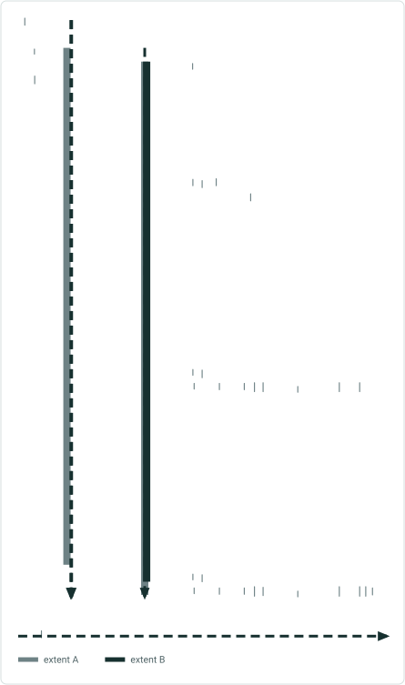
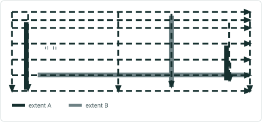

REST: Referent To Geometry
Input Location Syntax:
[
  {
    "layerId" : <layerId1>,
    "ObjectId" : <ObjectId1>,
    "Offset" : <Offset1>

```
  },
  {
```

    "layerId" : <layerId2>,
    "ObjectId" : <ObjectId2>,
    "fromOffset" : <fromOffset2>,
    "toOffset" : <toOffset2>

```
  },
  {
```

    "layerId" : "<layerId3>",
    "fromObjectId" : "<fromObjectId3>"
    "fromOffset" : <fromOffset3>
    "toObjectId" : "<toObjectId3>"
    "toOffset" : < toOffset3>

```
  },
  ...
]
```

 

## Negative Tests <!-- slide 3 -->

### Temporal View Date Is Invalid (e.g., 1 / 1 / 9999 or $$$)

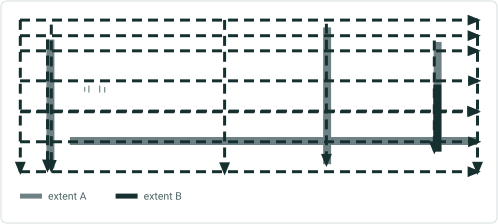

REST: Referent To Geometry

- In location parameter, user provides layer id that is not a point event layer
- In location parameter, user provides layer id that doesnot exist
- In location parameter, user provides layer id that is invalid e.g., $$$
- In location parameter, fromObjectId is not present in the data
- In location parameter, fromObjectId is invalid e.g., $$$ or &*^
- In location parameter, fromObjectId provided is not present on a route (so no measures can be found)
- In location parameter, toObjectId is not present in the data
- In location parameter, toObjectId is invalid e.g., $$$ or &*^
- In location parameter, toObjectId provided is not present on a route (so no measures can be found)
- In location parameter, fromOffset is not present in the data
- In location parameter, fromOffset is invalid e.g., $$$ or &*^
- In location parameter, toOffset is not present in the data
- In location parameter, toOffset is invalid e.g., $$$ or &*^
- Locations parameter provided has incorrect syntax
- Locations parameter is empty
- One of the sub parameters in locations parameter is empty
**Temporal View Date is invalid (e.g., 1/1/9999 or $$$)**
- Temporal View Date is not numeric (xyz)
- Out Spatial Reference is invalid (e.g., 99999)
- Out Spatial Reference is not numeric  (e.g., abc)
- GDB version provided does not exist
- GDB version is invalid
- Should I validate all the locating errors? Do the most common cases including multimatch – Check doc for loc errors
- Verify error messages – input invalid, layer id invalid, input is a line feature


## Slide 4

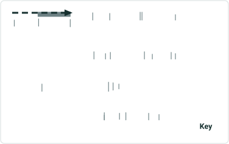

REST: Referent To Geometry

| Positive Tests Types |  |
| --- | --- |
| Input | Output |
| 1.1 Point event with offset distance | Point geom. output (associated with a route) |
| 1.2 Point event with from/to offset distance | Line geom. output (associated with a route) |
| 2.1 Point feature with offset distance | Point geom. output (for all the routes present at the location) |
| 2.2 Point feature with from/to offset distance | Line geom. output (for all the routes present at the location) |
| 3.1 Intersection feature with offset distance | Point geom. output (associated with routes in an intersection) |
| 3.2 Intersection feature with from/to offset distance | Point geom. output (associated with routes in an intersection) |

Key

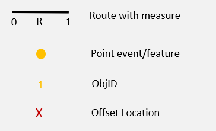

## Slide 5

(1-4) Point event with offset distance, simple route
REST: Referent To Geometry

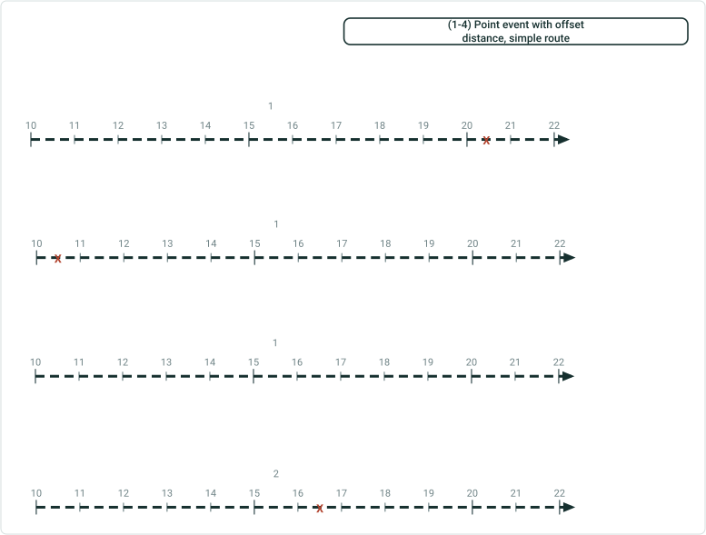

| Input | Output |
| --- | --- |
| layerId : 1, ObjectId : 1 Offset : 5 | routeId : R1, Measure: 20.5, geometryType : point, geometry: xyz |

R1 (1/1/2000 - null)

| Input | Output |
| --- | --- |
| layerId : 1, ObjectId : 1 Offset : -5 | routeId : R1, Measure: 10.5, geometryType : point, geometry: xyz |

| Input | Output |
| --- | --- |
| layerId : 1, ObjectId : 1 Offset : -10 | routeId : R1, Measure: location not found |

R1 (1/1/2000 - null)
Units for the LRS Network are in miles and offset units are in feet, 1 mile  = 5280 ft
R1 (1/1/2000 - null)
R1 (1/1/2000 - null)

| Input | Output |
| --- | --- |
| layerId : 2, ObjectId : 2 Offset : 5280 | routeId : R1, Measure: 16.5, geometryType : point, geometry: xyz |


## Note: Do few of the test cases <!-- slide 6 -->

(4-6) Point event with from/to offset distance, non-line simple route
REST: Referent To Geometry

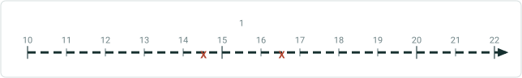

| Input | Output |
| --- | --- |
| layerId : 1, fromObjectId : 1 fromOffset : -1 toObjectId : 1 toOffset : 1 | routeId : R1, Measure: 14.5, toMeasure : 16.5 geometryType : line, geometry: xyz |

R1 (1/1/2000 - null)
R1 (1/1/2000 - null)
R2 (1/1/2000 - null)

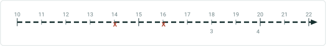

| Input | Output |
| --- | --- |
| layerId : 1, fromObjectId : 3 fromOffset : -4 toObjectId : 4 toOffset : -4 | routeId : R2, Measure: 14, toMeasure : 16 geometryType : line, geometry: xyz |

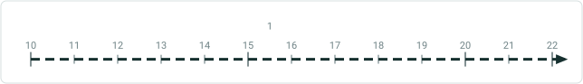

| Input | Output |
| --- | --- |
| layerId : 1, fromObjectId : 3 fromOffset : -20 toObjectId : 4 toOffset : 20 | routeId : R2, Measure: location not found |

Note: Do few of the test cases with just “"ObjectId" in input pram.


## Slide 7

(7-8) Point event with from/to offset distance, non-line simple route
REST: Referent To Geometry

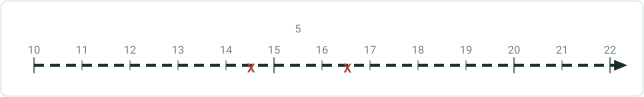

| Input | Output |
| --- | --- |
| layerId : 1, fromObjectId : 5 fromOffset : -5280 toObjectId : 5 toOffset : 5280 | routeId : R3, Measure: 14.5, toMeasure : 16.5 geometryType : line, geometry: xyz |

Units for the LRS Network are in miles and offset units are in feet, 1 mile  = 5280 ft
R3 (1/1/2000 - null)
R2 (1/1/2000 - null)

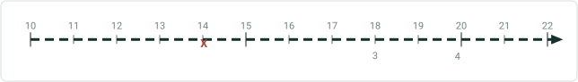

| Input | Output |
| --- | --- |
| layerId : 1, fromObjectId : 3 fromOffset : -4 toObjectId : 4 toOffset : -100 | routeId : R2, Measure: 14, toMeasure : not found, geometryType : geometry: no geom. Status: esriLocatingToPartialMatch |


## Slide 8

(9-10) Point event with from/to offset distance, line simple route
REST: Referent To Geometry

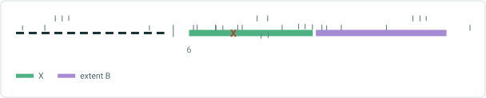

| Input | Output |
| --- | --- |
| layerId : 3, fromObjectId : 6 fromOffset : 30 toObjectId : 6 toOffset : 1000 | routeId : R2L3, Measure: 145, torouteid : toMeasure : geometryType :, geometry: xyz Status: esriLocatingToPartialMatch |

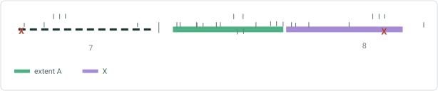

| Input | Output |
| --- | --- |
| layerId : 3, fromObjectId : 7 fromOffset : -5.5 toObjectId : 8 toOffset : 1.5 | routeId : R1L3, Measure: 0, toRouteid : R3L3 toMeasure : 7.5 geometryType : line, geometry: xyz |

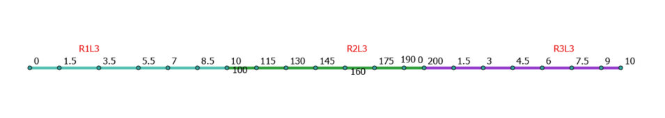 

## Slide 9

(11-12) Point event with from/to offset distance, line simple route
REST: Referent To Geometry
Routes are in opposite direction in a line

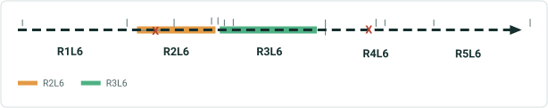

| Input | Output |
| --- | --- |
| layerId : 3, fromObjectId : 9 fromOffset : 100 toObjectId :10 toOffset : -25 | routeId : R2L6, Measure: 170, torouteid : R4L6 toMeasure : 150 geometryType : line, geometry: xyz |

Routes are in opposite direction in a line

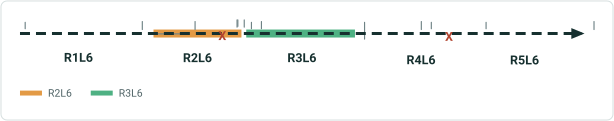

| Input | Output |
| --- | --- |
| layerId : 3, fromObjectId : 9 fromOffset : 0 toObjectId :10 toOffset : 0 | routeId : R2L6, Measure: 70, torouteid : R4L6 toMeasure : 175 geometryType : line, geometry: xyz |

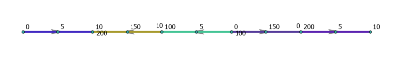 

## Slide 10

(13-14) Point event with from/to offset distance, non-line gapped route
REST: Referent To Geometry

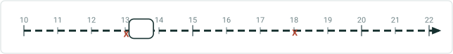

| Input | Output |
| --- | --- |
| layerId : 1, fromObjectId : 11 fromOffset : -15840 toObjectId : 11 toOffset : 10560 | routeId : R4, Measure: 13, toMeasure : 18 geometryType : line, geometry: xyz |

Units for the LRS Network are in miles and offset units are in feet, 1 mile  = 5280 ft
R4 (1/1/2000 - null)

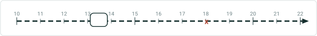

| Input | Output |
| --- | --- |
| layerId : 1, fromObjectId : 11 fromOffset : -18480 toObjectId : 11 toOffset : 10560 | routeId : R4, Measure: not found, toMeasure : 18, geometryType : geometry: xyz status: esriLocatingFromPartialMatch |

Units for the LRS Network are in miles and offset units are in feet, 1 mile  = 5280 ft
R4 (1/1/2000 - null)

| Input | Output |
| --- | --- |
| layerId : 1, ObjectId : 11 fromOffset : -15840 toOffset : 10560 | routeId : R4, Measure: 13, toMeasure : 18 geometryType : line, geometry: xyz |


## Slide 11

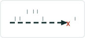
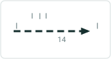
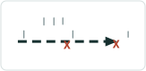


(15-16) Point event with from/to offset distance, line gapped route
REST: Referent To Geometry

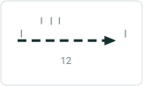

| Input | Output |
| --- | --- |
| layerId : 2, fromObjectId : 12 fromOffset : 10 toObjectId : 13 toOffset : 100 | routeId : R1L4, Measure: 15, TorouteId : R2L4, toMeasure : 200 geometryType : line, geometry: xyz |

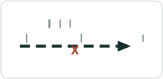

| Input | Output |
| --- | --- |
| layerId : 2, fromObjectId : 14 fromOffset : 10 toObjectId : 14 toOffset : 15 tempViewDate :  | routeId : R1L6, Measure: 15, TorouteId : R1L6, toMeasure : 20 geometryType : point, geometry: xyz |

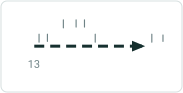

| Input | Output |
| --- | --- |
| layerId : 2, fromObjectId : 14 fromOffset : 10 toObjectId : 14 toOffset : 15 tempViewDate: | routeId : R1L6, Measure: 175, TorouteId : R1L6, toMeasure : 200 geometryType : point, geometry: xyz |

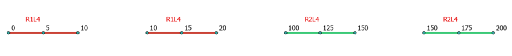  

## Slide 12

(17-18) Point event with from/to offset distance, concurrent route
REST: Referent To Geometry
R6 (1/1/2000 - null)

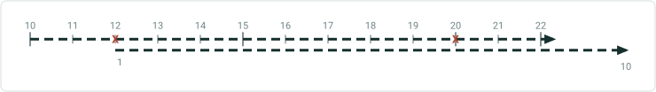

| Input | Output |
| --- | --- |
| layerId : 1, fromObjectId : 15 fromOffset : -5 toObjectId : 15 toOffset : 3 TempViewDate :  | routeId : R6, Measure: 12, TorouteId : R6, toMeasure : 20 geometryType : point, geometry: xyz |

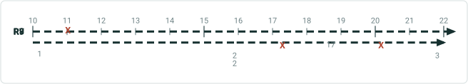

| Input | Output |
| --- | --- |
| layerId : 1, fromObjectId : 16 Offset : -5 layerId : 1, fromObjectId : 17 fromOffset : -0.25 toObjectId : 17 toOffset : 0.25 TempViewDate :  | routeId : R7, Measure: 11, geometryType : point, geometry: xyz routeId : R9, Measure: 2.25, TorouteId : R9, toMeasure : 2.75 geometryType : point, geometry: xyz |

R6_1 (1/1/2000 - null)


## Slide 13

(19-20) Point event as offset, complex route
REST: Referent To Geometry

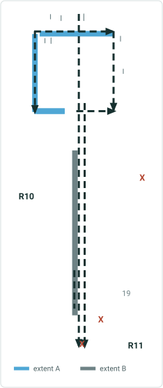

| Input | Output |
| --- | --- |
| layerId : 1, ObjectId : 18 Offset :10 | routeId : R10, Measure: 20, geometryType : point, geometry: xyz routeId : R10, Measure: 60, geometryType : point, geometry: xyz |

| Input | Output |
| --- | --- |
| layerId : 2, fromObjectId : 19 fromOffset : 5 toObjectId : 20 toOffset : -10 | routeId : R11, Measure: 10, TorouteId : R11, toMeasure : 70 geometryType : line, geometry: xyz |

| Input | Output |
| --- | --- |
| layerId : 2, fromObjectId : 19 fromOffset : 5 toObjectId : 20 toOffset : -10 | routeId : R11, Measure: 10, TorouteId : R11, toMeasure : 15 geometryType : line, geometry: xyz |


## Slide 14

(21 - 22) Point event as offset, complex route
REST: Referent To Geometry

| Input | Output |
| --- | --- |
| layerId : 1, ObjectId : 21 Offset :18 | routeId : R12, Measure: 28, geometryType : point, geometry: xyz routeId : R12, Measure: 0, geometryType : point, geometry: xyz |

| Input | Output |
| --- | --- |
| layerId : 2, fromObjectId : 22 fromOffset : 0 toObjectId : 23 toOffset : -8 | routeId : R13, Measure: 10, TorouteId : R13, toMeasure : 72 geometryType : line, geometry: xyz |

| Input | Output |
| --- | --- |
| layerId : 2, fromObjectId : 22 fromOffset : 0 toObjectId : 23 toOffset : -8 | routeId : R13, Measure: 10, TorouteId : R13, toMeasure : 14.8 geometryType : line, geometry: xyz |

[figure: R13 · R12 · 21 · X · 22 · 23 · 1–3]


## Slide 15

(23 - 24) Point event as offset, routes in a line shape like complex case
REST: Referent To Geometry

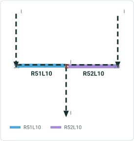

| Input | Output |
| --- | --- |
| layerId : 1, ObjectId : 24 Offset :10 | routeId : R41L7, Measure: 20, geometryType : point, geometry: xyz |

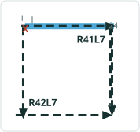

| Input | Output |
| --- | --- |
| layerId : 2, fromObjectId : 25 fromOffset : -10 toObjectId : 26 toOffset : -10 | routeId : R51L10, Measure: 10, TorouteId : R52L10, toMeasure : 0 geometryType : line, geometry: xyz (multi part geom.) |


## Slide 16

(25-26) Point event as offset, line network vertical routes
REST: Referent To Geometry

| Input | Output |
| --- | --- |
| layerId : 3, fromObjectId : 27 fromOffset : -5 toObjectId : 28 toOffset : 1.5 | routeId : R1LV2, Measure: 0, TorouteId : R3LV2, toMeasure : 3 geometryType : point, geometry: xyz |

| Input | Output |
| --- | --- |
| layerId : 3, fromObjectId : 27 fromOffset : -5 toObjectId : 28 toOffset : 100 | routeId : R1LV2, Measure: 0, TorouteId : R3LV2, toMeasure : not found geometryType : point, geometry: xyz Status: measure not found |

[figure: 27 · 28 · X]


## Slide 17

(27) Point event with from/to offset distance, time slices
REST: Referent To Geometry

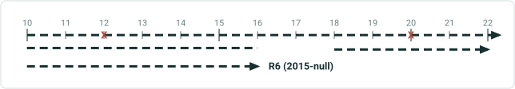

| Input | Output |
| --- | --- |
| layerId : 1, fromObjectId : 15 fromOffset : -5 toObjectId : 15 toOffset : 3 TempViewDate :  | routeId : R6, Measure: 12, TorouteId : R6, toMeasure : 20 geometryType : point, geometry: xyz |

| Input | Output |
| --- | --- |
| layerId : 1, fromObjectId : 15 fromOffset : -5 toObjectId : 15 toOffset : 3 TempViewDate: | routeId : R6, Measure: 12, TorouteId : R6, toMeasure : 20 geometryType : point, geometry: xyz |


## Slide 18

(28) Point event with from/to offset distance
REST: Referent To Geometry

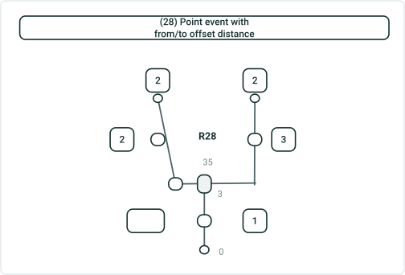

| Input | Output |
| --- | --- |
| layerId : 1, fromObjectId : 35 fromOffset : -1 toObjectId : 35 toOffset : 0 | routeId : R28, Measure: 0, TorouteId : R28, toMeasure : 1 geometryType : line, geometry: xyz |

| Input | Output |
| --- | --- |
| layerId : 1, fromObjectId : 35 fromOffset : -1 toObjectId : 35 toOffset : 0 | routeId : R28, Measure: 0, TorouteId : R28, toMeasure : 3 geometryType : line, geometry: xyz |

## Slide 19

(29) Point event with from/to offset distance, concurrent route
REST: Referent To Geometry

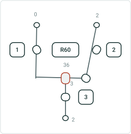

| Input | Output |
| --- | --- |
| layerId : 1, ObjectId : 36 fromOffset : -1 toOffset : 0 | routeId : R60, Measure: 0, TorouteId : R60, toMeasure : 1 geometryType : line, geometry: xyz |

| Input | Output |
| --- | --- |
| layerId : 1, ObjectId : 36 fromOffset : -1 toOffset : 1 | routeId : R60, Measure: 0, TorouteId : R60, toMeasure : 3 geometryType : line, geometry: xyz |

## Slide 20

Point feature as input
REST: Referent To Geometry
R6 (1/1/2000 - null)


| Input | Output |
| --- | --- |
| layerId : 1, fromObjectId : 29 fromOffset : -5 toObjectId : 15 toOffset : 3 | routeId : R6, Measure: 12, TorouteId : R1L6, toMeasure : 20 geometryType : point, geometry: xyz routeId : R6_1, Measure: 1, TorouteId : R6_1, toMeasure : 6 geometryType : point, geometry: xyz |

(30) For test case 1-16, 19-26 test with point feature as input (not event), validate that results are same

(31) Point feature with from/to offset distance, concurrent route
R6_1 (1/1/2000 - null)


## Slide 21

(32) Point feature with from/to offset distance, concurrent route
REST: Referent To Geometry

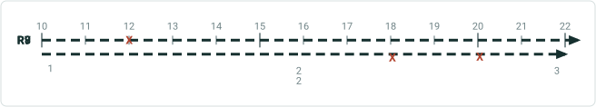

| Input | Output |
| --- | --- |
| layerId : 1, fromObjectId : 30 Offset : -4 layerId : 5, fromObjectId : 31 fromOffset : -1 toObjectId : 31 toOffset : 1 | routeId : R7, Measure: 12, geometryType : point, geometry: xyz routeId : R8, Measure: not found, geometryType : point, geometry: xyz routeId : R9, Measure:, TorouteId : R9, toMeasure : geometryType : line, geometry: xyz routeId : R7, Measure: 18, TorouteId : R7, toMeasure : 20, geometryType : line, geometry: xyz |


## Slide 22

(33) Point feature with offset distance - different units, concurrent route
REST: Referent To Geometry

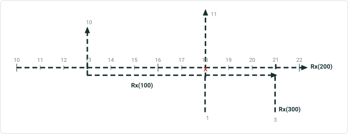

| Input | Output |
| --- | --- |
| layerId : 3, fromObjectId : 32 Offset : 10560 *Network in miles, offset distance in feet | routeId : Rx(100), Measure: 3, geometryType : point, geometry: xyz routeId : Rx(200), Measure: 18, geometryType : point, geometry: xyz |


## Slide 23

(34) Point feature with offset distance - different units, concurrent route with complex shape
REST: Referent To Geometry

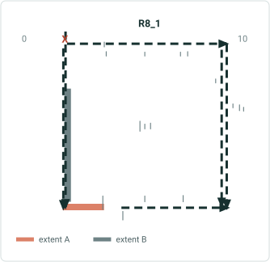

| Input | Output |
| --- | --- |
| layerId : 3, ObjectId : 33 Offset : 2640 *Network in miles, offset distance in feet | routeId : R8_1 , Measure: 1.5, geometryType : point, geometry: xyz routeId : T0, Measure: 0, geometryType : point, geometry: xyz routeId : T0, Measure: 4, geometryType : point, geometry: xyz |

Note: Check measure for R8_1 for output

## Slide 24

REST: Referent To Geometry

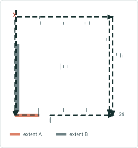

| Input | Output |
| --- | --- |
| layerId : 3, ObjectId : 38 Offset : -10560 *Network in miles, offset distance in feet | routeId : T0 , Measure: 0, geometryType : point, geometry: xyz |

X
(35) Point is at the center of a loop

38

| Output |
| --- |
| routeId : T0 , Measure: 4, geometryType : point, geometry: xyz |

## Slide 25

REST: Referent To Geometry

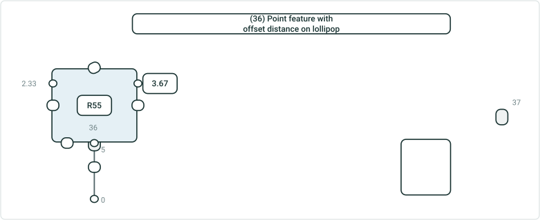

| Input | Output |
| --- | --- |
| layerId : 1, ObjectId : 36 Offset : 0 | routeId : R55, Measure: 1, geometryType : point, geometry: xyz |

(36) Point feature with offset distance on lollipop

| Input | Output |
| --- | --- |
| layerId : 1, ObjectId : 36 Offset : 0 | routeId : R55, Measure: 5, geometryType : point, geometry: xyz |

| Input | Output |
| --- | --- |
| layerId : 1, ObjectId : 37 Offset : 0 | routeId : R31, Measure: 1, geometryType : point, geometry: xyz |

| Input | Output |
| --- | --- |
| layerId : 1, ObjectId : 37 Offset : 0 | routeId : R31, Measure: 5, geometryType : point, geometry: xyz |

## Slide 26

REST: Referent To Geometry
X
(37) Point is at the center of a loop  (38) Point is not on route

39

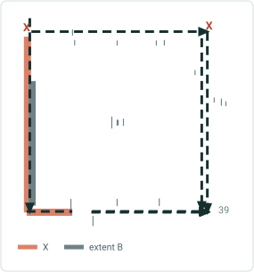

| Input | Output |
| --- | --- |
| layerId : 5, ObjectId : 39 fromOffset : -2 toOffset : 1 | routeId : T0, Measure: 0, TorouteId : T0, toMeasure : 3 geometryType : line, geometry: xyz |

X

| Input | Output |
| --- | --- |
| layerId : 5, ObjectId : 39 fromOffset : -2 toOffset : 1 | routeId : T0, Measure: 4, TorouteId : T0, toMeasure : 3 geometryType : line, geometry: xyz |

| Input | Output |
| --- | --- |
| layerId : 5, ObjectId : 39 fromOffset : -5 toOffset : 5 | routeId : T0, Measure: not found, TorouteId : T0, toMeasure : not found status: esriLocatingnotfound |

## Slide 27

(38) Point feature is equidistance with several routes
REST: Referent To Geometry

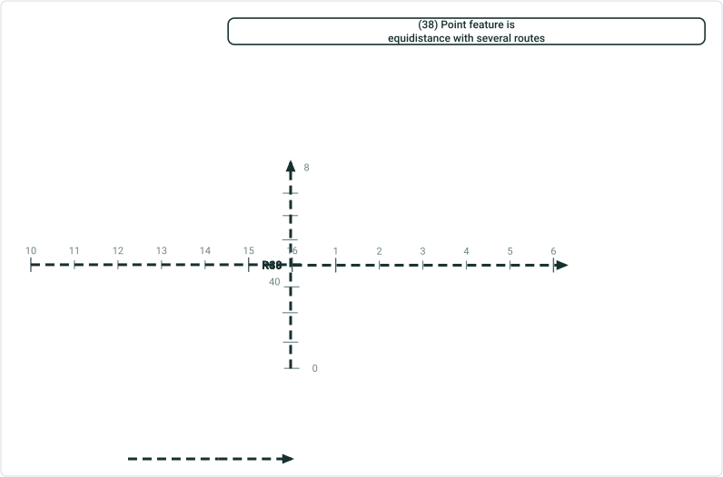

| Input | Output |
| --- | --- |
| layerId : 3, fromObjectId : 40 fromOffset : 0 toOffset : 1 | routeId : R39 Measure: 16, toMeasure : not found, geometryType : line, geometry: xyz routeId : R40 Measure: 0, toMeasure : 1, geometryType : point, geometry: xyz routeId : R38 Measure: 4, toMeasure : 5, geometryType : point, geometry: xyz |

Provide measure such that it becomes null extent in output


## Slide 28

(39) Point feature with from/to offset distance, multiple time slices
REST: Referent To Geometry


| Input | Output |
| --- | --- |
| layerId : 1, fromObjectId : 41 fromOffset : -5 toObjectId : 41 toOffset : 3 TempViewDate :  | routeId : R6, Measure: 12, TorouteId : R6, toMeasure : 20 geometryType : line, geometry: xyz |

| Input | Output |
| --- | --- |
| layerId : 1, fromObjectId : 41 fromOffset : -5 toObjectId : 41 toOffset : 3 TempViewDate :  | routeId : R6, Measure: 12, TorouteId : R6, toMeasure : 20 geometryType : line, geometry: xyz |

| Input | Output |
| --- | --- |
| layerId : 1, fromObjectId : 15 fromOffset : -5 toObjectId : 15 toOffset : 3 TempViewDate :  | routeId : R6, Measure: 12, TorouteId : R6, toMeasure : geometryType : point, geometry: xyz status: partial match for to measure |


## Slide 29

REST: Referent To Geometry

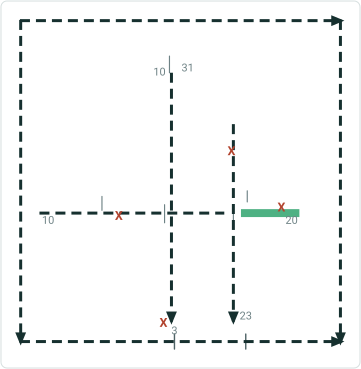

| Input | Output |
| --- | --- |
| layerId : 1, ObjectId : 1 Offset : -2 | routeId : A, Measure: 13, geometryType : point, geometry: xyz routeId : B, Measure: 3, geometryType : point, geometry: xyz |

40- Intersection feature as input, point as output

| Input | Output |
| --- | --- |
| layerId : 1, ObjectId : 3 Offset : 2 | routeId : A, Measure: 19, geometryType : point, geometry: xyz routeId : C, Measure: 28, geometryType : point, geometry: xyz |

## Slide 30

41- Intersection feature as input, line as output
REST: Referent To Geometry

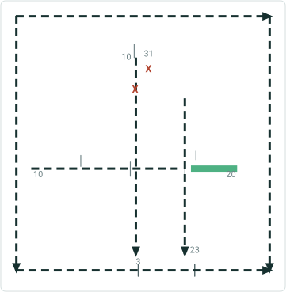

| Input | Output |
| --- | --- |
| layerId : 1, fromObjectId : 2 fromOffset : -2 toObjectId : 2 toOffset : 0 | routeId : B, Measure: -8, TorouteId : B, toMeasure : 10 geometryType : line, geometry: xyz routeId : C, Measure: 29, TorouteId : C, toMeasure : 31 geometryType : line, geometry: xyz |

## Slide 31

42-Intersection feature as input, point output
REST: Referent To Geometry

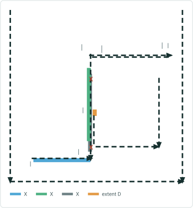

| Input | Output |
| --- | --- |
| layerId : 1, ObjectId : 3 Offset : -2 | routeId : B, Measure: 18, geometryType : point, geometry: xyz routeId : A, Measure:3, geometryType:point , geometry: xyz routeId : P1:22, Measure: no measure found |

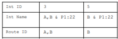

## GCS Data test cases <!-- slide 32 -->

GCS Data Test cases
REST: Referent To Geometry

43. GCS Data: Make sure that there exists only two end vertices and the z values are 0. Test all the 6 variations on this route + input event/point/intersection at the end and at the middle of the route. Follow the test case 1-16, 19-26, 30 – will not be able to locate measures.

44. Create a route with a 10-mile length. make sure that there exists only two end vertices and the z values are not 0. Test all the 6 variations on this route + input event / point / intersection at the end and at the middle of the route. Follow the test case 25, 26 – will not be able to locate measures.

45. Create a route with a 10-mile length. make sure that there exists multiple vertices with different z values. Test all the 6 variations on this route + input event/point/intersection at the end and at the middle of the route. Follow the test case 1-16, 19-26, 30.

46. Create a route with following z values: 5, 10,0,15, 35,0. (This might change – confirm with Eric)
Understand the formula in white paper and determine if out put measure is correct in case of z values above.
Test with both GCS & projected data.

47. See the mockup of Find tool in exp. builder and think of additional cases needed.

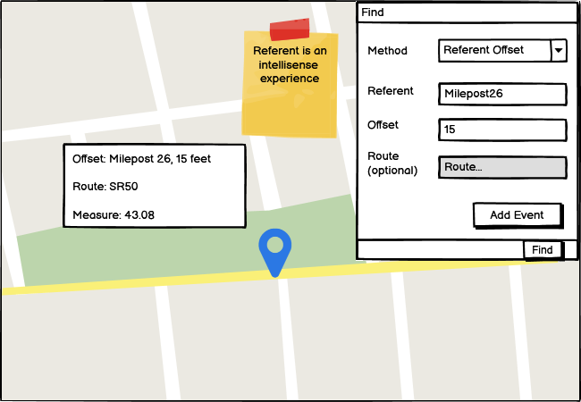 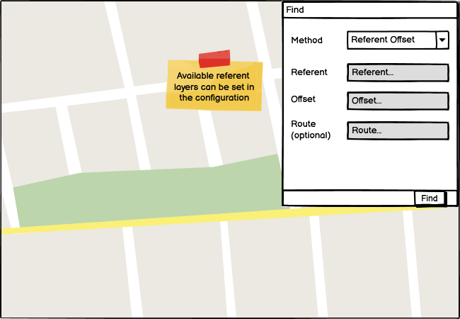

## Case 49 <!-- slide 33 -->

### Line Network – Output Is Multi-part Geometry

48.

| Input | Output |
| --- | --- |
| layerId : 3, fromObjectId : 42 fromOffset : 0.5 toObjectId :43 toOffset : -1.5 | routeId : R2L, Measure: 3, torouteid : R5L toMeasure : 1, geometryType : line, geometry: xyz |

| Input | Output |
| --- | --- |
| layerId : 5, ObjectId : 42 fromOffset : -2 toOffset : 2 | routeId : R48, Measure: 0, TorouteId : R48, toMeasure : 4 geometryType : line, geometry: xyz |

| Output |
| --- |
| routeId : R48, Measure: 0, TorouteId : R48, toMeasure : 8 geometryType : line, geometry: xyz |

| Output (confirm)? |
| --- |
| routeId : R48, Measure: 4, TorouteId : R48, toMeasure : 8 geometryType : line, geometry: xyz |

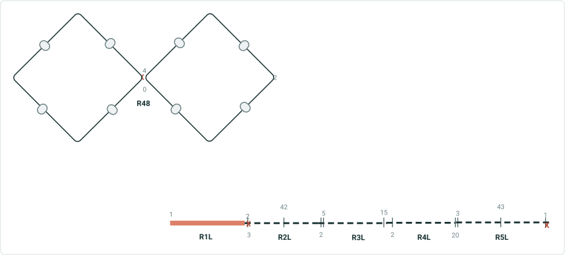

| Input | Output | Output | Output |
| --- | --- | --- | --- |
| layerId : 5, ObjectId : 42 Offset : -2 | routeId : R48, Measure: 0, geometryType : point, geometry: xyz | routeId : R48, Measure: 4, geometryType : point, geometry: xyz | routeId : R48, Measure: 8, geometryType : point, geometry: xyz |


