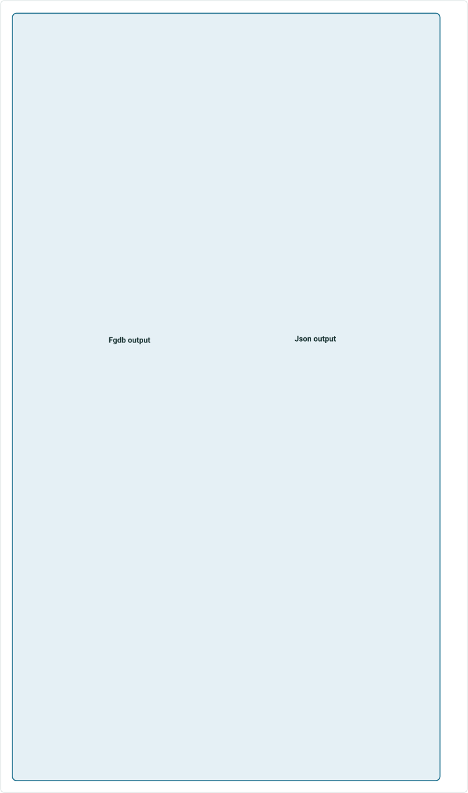
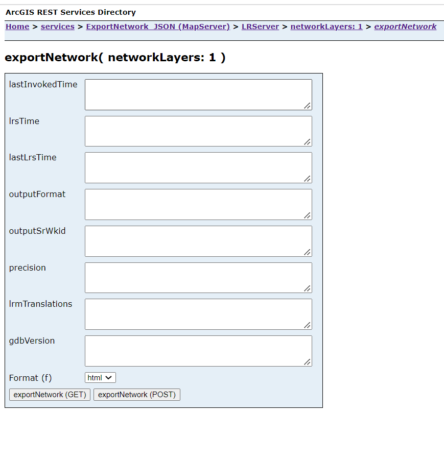
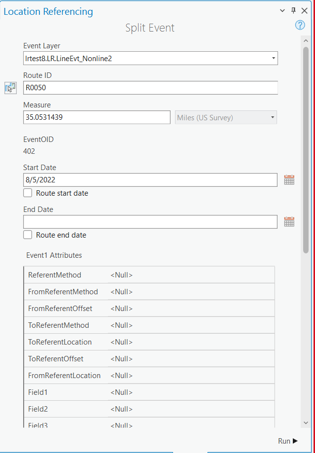
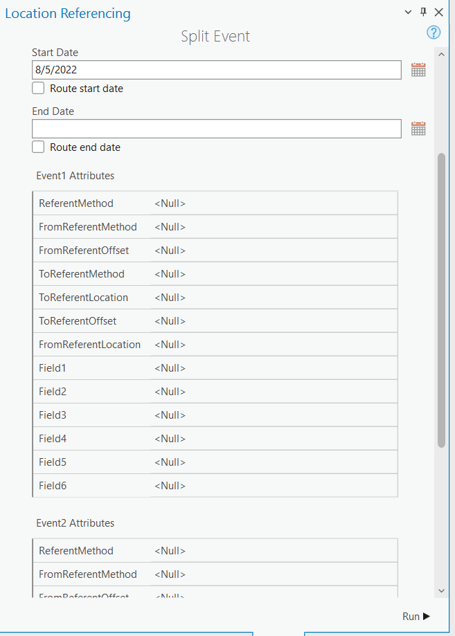

# Test Plan for Supporting JSON in Export Network

|   |   |
| --- | --- |
| **Kind** | Test Plan · Server |
| **Release** | — |
| **Product** | Roads & Highways · Pipeline Referencing · Utility Network |
| **Source** | [ExportNetwork_Json.pptx](<https://esriis.sharepoint.com/sites/LocationReferencing/Shared%20Documents/General/Test%20Plans/ExportNetwork_Json.pptx>) |
| **Edited** | 2022-08-05 23:46 by Lakshmi Ananthanarayanan |
| **Extracted** | 2026-09-04 · lane `xmlstrip` |

<!-- metadata
```yaml
title: "Test Plan for Supporting JSON in Export Network"
source_file: "ExportNetwork_Json.pptx"
source_url: "https://esriis.sharepoint.com/sites/LocationReferencing/Shared%20Documents/General/Test%20Plans/ExportNetwork_Json.pptx"
doc_id: 639
doc_kind: "Test Plan"
surface: "Server"
doc_revision: ""
target_release: ""
pe: ""
dev: ""
author: "Lakshmi Ananthanarayanan"
last_edited_by: "Lakshmi Ananthanarayanan"
last_edited: "2022-08-05T23:46:04Z"
extracted: 2026-09-04
extraction_lane: xmlstrip
prompt_version: "v2.0.2"
keywords: ["export network", "json output", "rest endpoint", "feature compare", "network concurrency", "lrm translations", "test plan"]
tools: ["Feature compare", "JSON to features conversion"]
products: ["Roads & Highways", "Pipeline Referencing", "Utility Network"]
issues: []
related: [{"doc":805,"file":"support-line-networks-and-json-in-export-network__doc805.md","s":5.111},{"doc":806,"file":"export-network-in-pro__doc806.md","s":3.265},{"doc":298,"file":"prototype-json-requests-and-returns-in-rest-for-relocate-events__doc298.md","s":2.162},{"doc":229,"file":"support-search-tolerance-parameter-in-update-measures-from-lrs-tool-test-plan__doc229.md","s":2.116},{"doc":255,"file":"generate-a-route-log-including-spanning-events-and-centerline-test-plan__doc255.md","s":2.104}]
```
-->

## Summary

This document outlines a test plan for verifying JSON support in the Export Network REST endpoint. It covers verification of JSON output format compliance with geoJSON, output file handling including large files, and support for GET and POST requests. Test cases include various parameter scenarios and network types such as Nonline, Line, and PoM networks.

## Related documents

<!-- related:begin -->
- [Support line networks and JSON in Export Network](<https://esriis.sharepoint.com/sites/lrsworkspace/LRS%20Doc%20Index/User%20Stories/support-line-networks-and-json-in-export-network__doc805.md>) — similar text 0.27 · 3 title words · 3 filename words <!-- rel:805 -->
- [Export Network in Pro](<https://esriis.sharepoint.com/sites/lrsworkspace/LRS Doc Index/Design Spikes/export-network-in-pro__doc806.md>) — similar text 0.18 · 2 title words · 2 filename words <!-- rel:806 -->
- [Prototype: JSON requests and returns in REST for Relocate Events](<https://esriis.sharepoint.com/sites/lrsworkspace/LRS%20Doc%20Index/Design%20Spikes/prototype-json-requests-and-returns-in-rest-for-relocate-events__doc298.md>) — similar text 0.07 · 1 title word · 1 filename word · same surface <!-- rel:298 -->
- [Support Search Tolerance Parameter in Update Measures from LRS Tool – Test Plan](<https://esriis.sharepoint.com/sites/lrsworkspace/LRS Doc Index/Test Plans/support-search-tolerance-parameter-in-update-measures-from-lrs-tool-test-plan__doc229.md>) — similar text 0.11 · same kind/folder <!-- rel:229 -->
- [Generate a route Log including spanning events and centerline – Test Plan](<https://esriis.sharepoint.com/sites/lrsworkspace/LRS Doc Index/Test Plans/generate-a-route-log-including-spanning-events-and-centerline-test-plan__doc255.md>) — similar text 0.05 · same kind/folder <!-- rel:255 -->
<!-- related:end -->

<!-- docs:begin -->
## Esri documentation

_No page matched:_ [Feature compare](https://www.google.com/search?q=%22Feature%20compare%22+site%3Adoc.esri.com) · [JSON to features conversion](https://www.google.com/search?q=%22JSON%20to%20features%20conversion%22+site%3Adoc.esri.com)
<!-- docs:end -->

---

## Same test cases <!-- slide 1 -->



Verification Workflow
Same test cases are run for each network separately  to create Fgdb as output and to create Json as output and then they will be compared.

Fgdb/
Json
Query the Export network rest end point
Fgdb output
Json output
Convert it into Fgdb using JSON to features conversion tool GP tool

Feature compare  using Feature compare GP tool
Results should be same.

Test plan for supporting JSON in Export Network

## Slide 2


Data

- RH data
- APR+UN data
- Caltrans data
Edit log data should contain edits related to all activity type and edits should include gapped routes. Data should contain overlapping routes for the same network and between the networks for concurrencies and lrm translations. For LRM translations do a couple of edits where the network exist (in the INDOT data). Ensure output data can be directly used as an input and does not need any data conversions for its usage.
Verification

- Verify that there is support for JSON as an output format for this tool
- Verify the obtained JSON format match geoJSON  - Route
- Output should have one JSON file for each– Concurrency, LRM Translations,  Gap, Networks, export details.
- Verify for a larger output (greater than 250mb), Zip file is created.
- Verify by utilizing the JSON output by scripting in python, JavaScript.
- Verify that the export to Json is supported by both GET and POST request.

Test Cases

- No time parameter provided
- Providing all the three parameters last invoked time, LRS time and last LRS time.
- No time parameter with lrm translations
Networks

- Nonline Network
- Line Network
- PoM Network



## Slide 3

[figure: 1–4]

        

## Slide 4



