# Test Plan: Reverse Line Orders GP Tool

|   |   |
| --- | --- |
| **Kind** | Test Plan · Pro |
| **Release** | — |
| **Product** | Pipeline Referencing · Utility Network |
| **Issue** | [ArcGISPro/ps-location-referencing#4983](https://devtopia.esri.com/ArcGISPro/ps-location-referencing/issues/4983) |
| **Source** | [ReverseLineOrderstool_TestPlan_JK.pptx](<https://esriis.sharepoint.com/sites/LocationReferencing/Shared%20Documents/General/Test%20Plans/ReverseLineOrderstool_TestPlan_JK.pptx>) |
| **Edited** | 2023-06-13 20:45 by Johum Khushk |
| **Extracted** | 2026-09-04 · lane `xmlstrip` |

<!-- metadata
```yaml
title: "Test Plan: Reverse Line Orders GP Tool"
source_file: "ReverseLineOrderstool_TestPlan_JK.pptx"
source_url: "https://esriis.sharepoint.com/sites/LocationReferencing/Shared%20Documents/General/Test%20Plans/ReverseLineOrderstool_TestPlan_JK.pptx"
doc_id: 547
doc_kind: "Test Plan"
surface: "Pro"
doc_revision: ""
target_release: ""
pe: ""
dev: ""
author: "Lakshmi Ananthanarayanan"
last_edited_by: "Johum Khushk"
last_edited: "2023-06-13T20:45:28Z"
extracted: 2026-09-04
extraction_lane: xmlstrip
prompt_version: "v2.0.2"
keywords: ["reverse line order", "line order", "route", "line network", "derived network", "conflict prevention", "time sliced routes"]
tools: ["Reverse Line Orders"]
products: ["Pipeline Referencing", "Utility Network"]
issues: ["ArcGISPro/ps-location-referencing#4983"]
related: [{"doc":576,"file":"reverse-line-orders-tool__doc576.md","s":4.867},{"doc":530,"file":"enhance-reverse-line-orders-tool-to-create-common-time-slice__doc530.md","s":4.604},{"doc":629,"file":"investigate-line-order-with-reverse-stationing__doc629.md","s":3.575},{"doc":535,"file":"reassign-ui-existing-line-test-plan__doc535.md","s":3.481},{"doc":564,"file":"append-routes-line-order-check-test-plan__doc564.md","s":3.473}]
```
-->

## Summary

This test plan covers verification and negative test cases for the Reverse Line Orders geoprocessing tool used on line networks. It includes tests for functionality with different route selections, time slices, conflict prevention, and derived network generation to ensure line order reversal behaves correctly without affecting route direction or calibration.

## Related documents

<!-- related:begin -->
- [Reverse Line Orders tool](<https://esriis.sharepoint.com/sites/lrsworkspace/LRS Doc Index/User Stories/reverse-line-orders-tool__doc576.md>) — similar text 0.19 · 4 title words · 3 filename words · same surface <!-- rel:576 -->
- [Enhance Reverse Line Orders tool to create common time slice](<https://esriis.sharepoint.com/sites/lrsworkspace/LRS Doc Index/User Stories/enhance-reverse-line-orders-tool-to-create-common-time-slice__doc530.md>) — similar text 0.22 · 4 title words · 2 filename words · same surface <!-- rel:530 -->
- [Investigate Line Order with Reverse Stationing](<https://esriis.sharepoint.com/sites/lrsworkspace/LRS Doc Index/Other/investigate-line-order-with-reverse-stationing__doc629.md>) — similar text 0.10 · 2 title words · 2 filename words · same surface <!-- rel:629 -->
- [Reassign UI Existing Line Test Plan](<https://esriis.sharepoint.com/sites/lrsworkspace/LRS Doc Index/Test Plans/reassign-ui-existing-line-test-plan__doc535.md>) — similar text 0.15 · 1 title word · 1 filename word · same kind/surface/folder <!-- rel:535 -->
- [Append Routes: Line Order Check Test Plan](<https://esriis.sharepoint.com/sites/lrsworkspace/LRS%20Doc%20Index/Test%20Plans/append-routes-line-order-check-test-plan__doc564.md>) — similar text 0.12 · 1 title word · 1 filename word · same kind/surface/folder <!-- rel:564 -->
<!-- related:end -->

<!-- docs:begin -->
## Esri documentation

[Conflict prevention](https://doc.esri.com/en/arcgis-pro/latest/help/production/location-referencing-pipelines/conflict-prevention.html)

_No page matched:_ [Reverse Line Orders](https://www.google.com/search?q=%22Reverse%20Line%20Orders%22+site%3Adoc.esri.com)
<!-- docs:end -->

---

## Slide 1 — Test Plan: Reverse Line Orders GP Tool

User Story: https://devtopia.esri.com/ArcGISPro/ps-location-referencing/issues/4983

Data

- Test in FS , DC & fgdb
- Test in APR, APR+UN
- Test for line network only
- Test in either projected or unprojected data
- Test with conflict prevention enabled (FS)

General GP tool verification

- Test with inline python
- Test with standalone python script
- Test with model-builder
- Test in model-builder in conjunction with other tools
- Verify by hitting cancel no changes are applied and the tool does not modify the input

## Case 5 <!-- slide 2 -->

### Verify Irrespective of a Single Route / Multiple Routes

Verification
**Verify irrespective of a single route / multiple routes selected in a line all the routes on the line should have their line order reversed. The line order continuity should make sense.**

- Verify the tool requires a selection set for reversing the line order. Do we display an error if no route is selected in the network – yes an error is displayed.
- Verify the input is network feature class only – no table input.
- Verify the tool supports line network only and do not support post mile network.
- Verify locks are acquired for the line when conflict prevention is enabled.
- If the tool completes, verify the log file contains correct information.
- Verify the error messages for the negative test cases.
- After reversing the route, generate derived network and verify the derived network follows the reversed line order.
- Verify the direction of calibration of the route remains unchanged after reversing the line order.
- Run the tool which will reverse the line order. Then run the tool again which should flip the line order to the initial state.


## Negative test cases <!-- slide 3 -->

Negative Test Cases

- Input feature class is not a network
- Input network feature class does not have any selection
- Input feature class is nonline network
- Input feature class is postmile network

UI test cases

- There is no default value for the network feature class
- Only the line network should show up in the drop down  All network should show up and give an error if the tool is run or loaded in the network drop down.
- Test in light and Dark mode
- The information next to the input parameter should show up proper message
- Do we need to show a warning or just document it? if only few routes on a line is selected:“ If only a route/ few routes are selected in a line network , the line order for the all the routes for the selected time range will be reversed.” – only add it in the doc
- Verify undo / redo functionality (FS – version)

Conflict Prevention test cases

- Verify lock is acquired for the line if the line order is reversed and a message is displayed for acquiring locks.
- If the line is already locked by a different user in another version, provide error message (locked by editing a route locked by editing an event).
- If the line is already locked by the same user in the same editing version, no further locks are acquired and proceed with the tool.
- In the positive test case, select routes belonging to more than one line and run the tool. All the lines belonging to the chosen routes should have their line order reversed and locks acquired.
- Verify entire workflow for conflict prevention (release locks, auto release lock in default, releasable status message in locks table).
- Test with event that span / not span routes and generate events to see any thing changes ?  Shapes should not change for events and nothing breaks on route.
- Test with generate events and DEM GP tool and see if any thing changes , before I do the flip.
- Expected: Report the out put to team after scrum.

## Case 30 <!-- slide 4 -->

### In a Line, Select All the Routes and Reverse

Test Cases
**In a line, select all the routes and reverse, line order are reversed.**

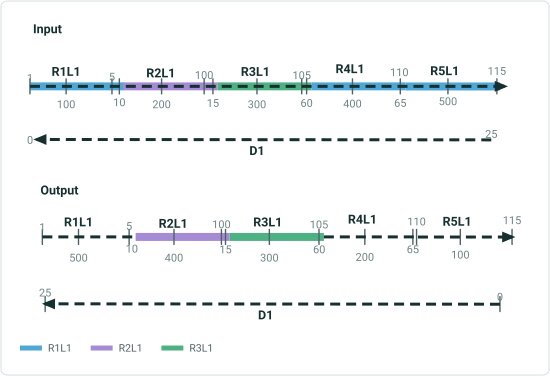

| Route | From Date | To Date | Line Order Input | Line order Output |
| --- | --- | --- | --- | --- |
| R1L1 | 1/1/2000 | Null | 100 | 500 |
| R2L1 | 1/1/2000 | Null | 200 | 400 |
| R3L1 | 1/1/2000 | Null | 300 | 300 |
| R4L1 | 1/1/2020 | Null | 400 | 200 |
| R5L1 | 1/1/2000 | Null | 500 | 100 |

The route direction and calibration remains intact, and no changes are made on the routes. After reversing the line order, check the derived network by running generate routes for the derived route network.

- Add a usage note the user need to run GR tool to update the shape of D network.

## Case 31 <!-- slide 5 -->

### In a Line, Select All the Routes and Reverse

**In a line, select all the routes and reverse, line order reversed. Line orders are different from 100 but still monotonic**

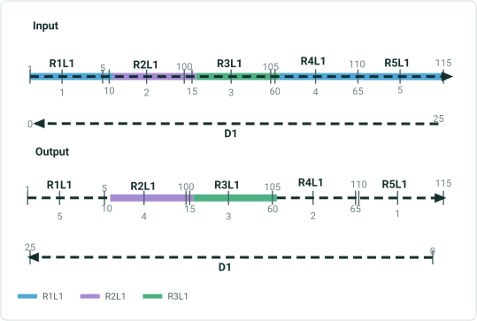

| Route | From Date | To Date | Line Order Input | Line order Output |
| --- | --- | --- | --- | --- |
| R1L1 | 1/1/2000 | Null | 1 | 5 |
| R2L1 | 1/1/2000 | Null | 2 | 4 |
| R3L1 | 1/1/2000 | Null | 3 | 3 |
| R4L1 | 1/1/2020 | Null | 4 | 2 |
| R5L1 | 1/1/2000 | Null | 5 | 1 |

The route direction and calibration remains intact, and no changes are made on the routes. After reversing the line order, check the derived network by running generate routes for the derived route network.

## Case 32 <!-- slide 6 -->

### In a Line, Select All the Routes and Reverse

**In a line, select all the routes and reverse, line order reversed. Line orders are not monotonic, they are jumbled. *Check derived network generation**

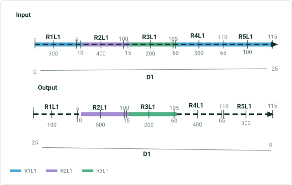

| Route | From Date | To Date | Line Order Input | Line order Output |
| --- | --- | --- | --- | --- |
| R1L1 | 1/1/2000 | Null | 300 | 300 |
| R2L1 | 1/1/2000 | Null | 400 | 200 |
| R3L1 | 1/1/2000 | Null | 200 | 400 |
| R4L1 | 1/1/2020 | Null | 500 | 100 |
| R5L1 | 1/1/2000 | Null | 100 | 500 |

The route direction and calibration remains intact, and no changes are made on the routes. After reversing the line order, check the derived network by running generate routes for the derived route network.
Update the line order in the table,

See what happens to the derive network! And update the graphic

## Case 33 <!-- slide 7 -->

### In a Line, Select Only the First Route and Run the Tool

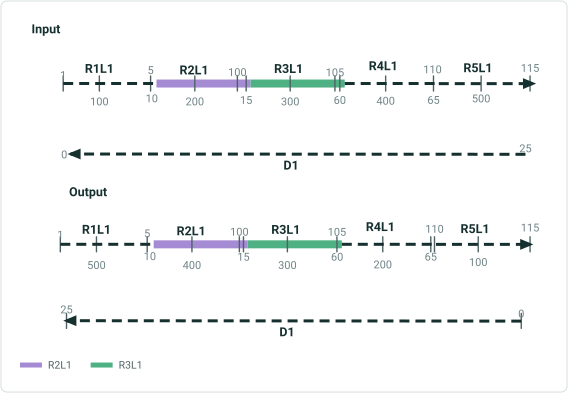

| Route | From Date | To Date | Line Order Input | Line order Output |
| --- | --- | --- | --- | --- |
| R1L1 | 1/1/2000 | Null | 100 | 500 |
| R2L1 | 1/1/2000 | Null | 200 | 400 |
| R3L1 | 1/1/2000 | Null | 300 | 300 |
| R4L1 | 1/1/2020 | Null | 400 | 200 |
| R5L1 | 1/1/2000 | Null | 500 | 100 |

The route direction and calibration remains intact, and no changes are made on the routes. All the routes in the line where the route is selected will have their line order changed . After reversing the line order, check the derived network by running generate routes for the derived route network.

## Case 34 <!-- slide 8 -->

### In a Line, Select Only Middle Routes & and Reverse.

**In a line, select only middle routes(R3 & R4) and reverse.**

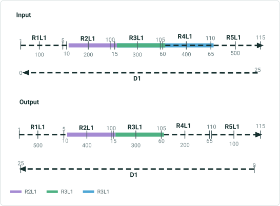

| Route | From Date | To Date | Line Order Input | Line order Output |
| --- | --- | --- | --- | --- |
| R1L1 | 1/1/2000 | Null | 100 | 500 |
| R2L1 | 1/1/2000 | Null | 200 | 400 |
| R3L1 | 1/1/2000 | Null | 300 | 300 |
| R4L1 | 1/1/2020 | Null | 400 | 200 |
| R5L1 | 1/1/2000 | Null | 500 | 100 |

The route direction and calibration remains intact, and no changes are made on the routes. All the routes in the line where the route is selected will have their line order changed . After reversing the line order, check the derived network by running generate routes for the derived route network.

## Case 35 <!-- slide 9 -->

### In a Line, Select Only the Last Route and Reverse

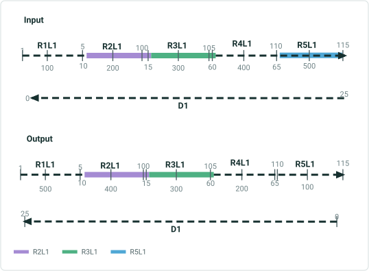

| Route | From Date | To Date | Line Order Input | Line order Output |
| --- | --- | --- | --- | --- |
| R1L1 | 1/1/2000 | Null | 100 | 500 |
| R2L1 | 1/1/2000 | Null | 200 | 400 |
| R3L1 | 1/1/2000 | Null | 300 | 300 |
| R4L1 | 1/1/2020 | Null | 400 | 200 |
| R5L1 | 1/1/2000 | Null | 500 | 100 |

The route direction and calibration remains intact, and no changes are made on the routes. All the routes in the line where the route is selected will have their line order changed . After reversing the line order, check the derived network by running generate routes for the derived route network.

## Case 36 <!-- slide 10 -->

### In a Line, Select the Second Route

**In a line, select the second route , routes are in opposite direction.**

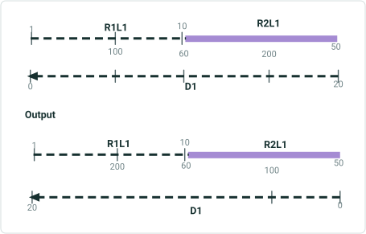

| Route | From Date | To Date | Line Order Input | Line order Output |
| --- | --- | --- | --- | --- |
| R1L1 | 1/1/2000 | Null | 100 | 200 |
| R2L1 | 1/1/2000 | Null | 200 | 100 |

The route direction and calibration remains intact, and no changes are made on the routes. All the routes in the line where the route is selected will have their line order changed . After reversing the line order, check the derived network by running generate routes for the derived route network.

## Case 37 <!-- slide 11 -->

### In a Line, Select Only One Middle Route and Reverse.

**In a line, select only one middle route (R3L1)and reverse.**

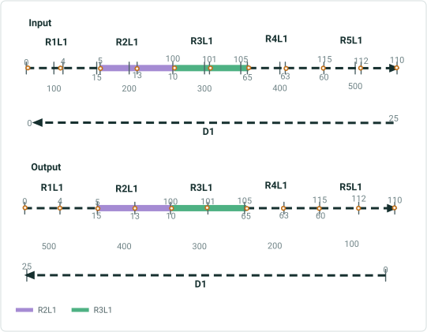

| Route | From Date | To Date | Line Order Input | Line order Output |
| --- | --- | --- | --- | --- |
| R1L1 | 1/1/2000 | Null | 100 | 500 |
| R2L1 | 1/1/2000 | Null | 200 | 400 |
| R3L1 | 1/1/2000 | Null | 300 | 300 |
| R4L1 | 1/1/2020 | Null | 400 | 200 |
| R5L1 | 1/1/2000 | Null | 500 | 100 |

The route direction and calibration remains intact, and no changes are made on the routes. All the routes in the line where the route is selected will have their line order changed . After reversing the line order, check the derived network by running generate routes for the derived route network. Extra calibration point are added in the route. Verify there are no changes in the calibration of the route by reversing the line order

## Case 38 <!-- slide 12 -->

### Closed Line – Routes Form a Loop. (Route Is Selected)

**Closed line – Routes form a loop. (Route R2L1 is selected)**

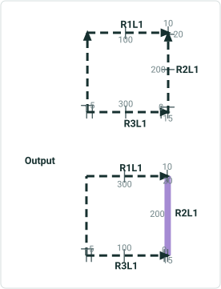

| Route | From Date | To Date | Line Order Input | Line order Output |
| --- | --- | --- | --- | --- |
| R1L1 | 1/1/2000 | Null | 100 | 300 |
| R2L1 | 1/1/2000 | Null | 200 | 200 |
| R3L1 | 1/1/2000 | Null | 300 | 100 |

The route direction and calibration remains intact, and no changes are made on the routes. All the routes in the line where the route is selected will have their line order changed . After reversing the line order, check the derived network by running generate routes for the derived route network.

## Case 39 <!-- slide 13 -->

### Routes in a Line – Branch

**Routes in a line – Branch – select all the routes and reverse line order**

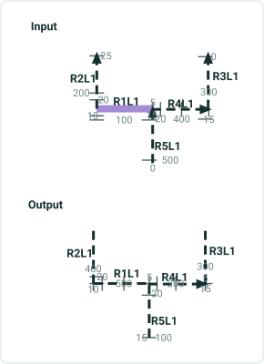

| Route | From Date | To Date | Line Order Input | Line order Output |
| --- | --- | --- | --- | --- |
| R1L1 | 1/1/2000 | Null | 100 | 500 |
| R2L1 | 1/1/2000 | Null | 200 | 400 |
| R3L1 | 1/1/2000 | Null | 300 | 300 |
| R4L1 | 1/1/2000 | Null | 400 | 200 |
| r5L1 | 1/1/2000 | Null | 500 | 100 |

The route direction and calibration remains intact, and no changes are made on the routes. All the routes in the line where the route is selected will have their line order changed . After reversing the line order, check the derived network by running generate routes for the derived route network.

## Case 40 <!-- slide 14 -->

### Gapped Routes – Gap Between Routes in a Line

| Route | From Date | To Date | Line Order Input | Line order Output |
| --- | --- | --- | --- | --- |
| R1L1 | 1/1/2000 | Null | 100 | 300 |
| R2L1 | 1/1/2000 | Null | 200 | 200 |
| R3L1 | 1/1/2000 | Null | 300 | 100 |

[figure: Input · R1L1 · R2L1 · 100 · 200 · R3L1 · 300 · 1 · 5 · 15 · 105 · 115 · 110 · D1 · 25 · 0 · Output]

## Case 41 <!-- slide 15 -->

### Gapped Routes – Gap Between Routes in a Line

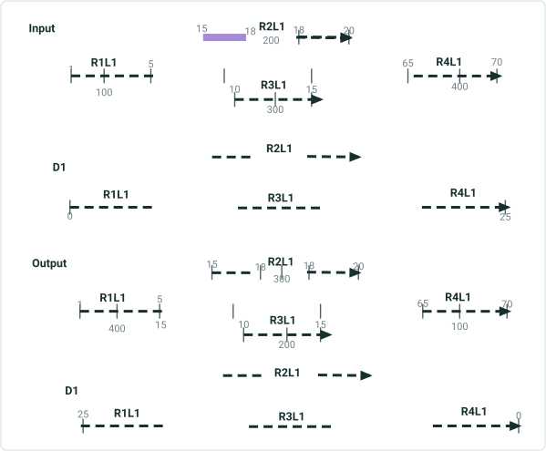

| Route | From Date | To Date | Line Order Input | Line order Output |
| --- | --- | --- | --- | --- |
| R1L1 | 1/1/2000 | Null | 100 | 400 |
| R2L1 | 1/1/2000 | Null | 200 | 300 |
| R3L1 | 1/1/2000 | Null | 300 | 200 |
| R4L1 | 1/1/2000 | Null | 400 | 100 |
|  |  |  |  |  |

## Case 42 <!-- slide 16 -->

### Time Sliced Routes

**Time sliced routes – all routes in a line have similar time slices**
Input ( Select time slice 1/1/2020 – Null of route R3L1)

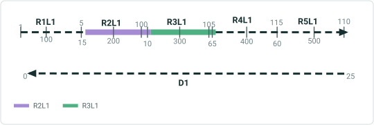

| Time | Route | Line order |
| --- | --- | --- |
| 1/1/2000 – 1/1/2020 | R1L1 | 100 |
| 1/1/2000 – 1/1/2020 | R2L1 | 200 |
| 1/1/2000 – 1/1/2020 | R3L1 | 300 |
| 1/1/2000 – 1/1/2020 | R4L1 | 400 |
| 1/1/2000 – 1/1/2020 | R5L1 | 500 |

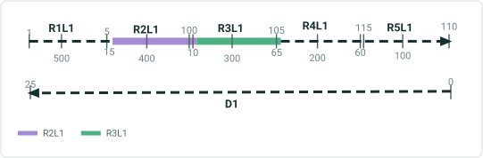

| Time | Route | Line order |
| --- | --- | --- |
| 1/1/2020 – Null | R1L1 | 100 |
| 1/1/2020 – Null | R2L1 | 200 |
| 1/1/2020 – Null | R3L1 | 300 |
| 1/1/2020 – Null | R4L1 | 400 |
| 1/1/2020 – Null | R5L1 | 500 |

Output ( representation  of routes for time slice 1/1/2020 – Null).

| Time | Route | Line order |
| --- | --- | --- |
| 1/1/2000 – 1/1/2020 | R1L1 | 100 |
| 1/1/2000 – 1/1/2020 | R2L1 | 200 |
| 1/1/2000 – 1/1/2020 | R3L1 | 300 |
| 1/1/2000 – 1/1/2020 | R4L1 | 400 |
| 1/1/2000 – 1/1/2020 | R5L1 | 500 |

| Time | Route | Line order |
| --- | --- | --- |
| 1/1/2020 – Null | R1L1 | 500 |
| 1/1/2020 – Null | R2L1 | 400 |
| 1/1/2020 – Null | R3L1 | 300 |
| 1/1/2020 – Null | R4L1 | 200 |
| 1/1/2020 – Null | R5L1 | 100 |

## Case 43 <!-- slide 17 -->

### Time Sliced Routes

**Time sliced routes – some routes in a line have different time slices (select only R3L1 (1/1/2010 – Null) as input**
Output
All the routes which overlap with the selected route time slice will have their line order reversed.

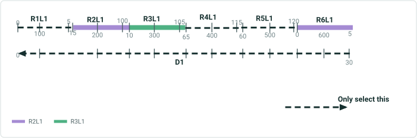

| Route | From Date | To Date | Line Order Input |
| --- | --- | --- | --- |
| R1L1 | 1/1/2000 | Null | 100 |
| R2L1 | 1/1/2000 | Null | 200 |
| R3L1 | 1/1/2000 | 1/1/2010 | 300 |
| R3L1 | 1/1/2010 | Null | 300 |
| R4L1 | 1/1/2000 | 1/1/2010 | 400 |
| R4L1 | 1/1/2010 | Null | 400 |
| R5L1 | 1/1/2000 | Null | 500 |
| R6L1 | 1/1/2000 | Null | 600 |

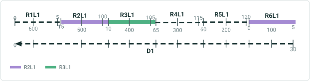

| Route | From Date | To Date | Line Order output |
| --- | --- | --- | --- |
| R1L1 | 1/1/2000 | Null | 600 |
| R2L1 | 1/1/2000 | Null | 500 |
| R3L1 | 1/1/2000 | 1/1/2010 | 400 |
| R3L1 | 1/1/2010 | Null | 400 |
| R4L1 | 1/1/2000 | 1/1/2010 | 300 |
| R4L1 | 1/1/2010 | Null | 300 |
| R5L1 | 1/1/2000 | Null | 200 |
| R6L1 | 1/1/2000 | Null | 100 |

Check with a route from 1990 – 1999 and its line order should not have an impact.

## Case 44 <!-- slide 18 -->

### Time Sliced Routes. All Routes in a Line Have Different Time

**Time sliced routes. All routes in a line have different time slices (select only R1L1 (2000 – null))**
Output  All the routes which overlap with the selected route time slice will have their line order reversed.

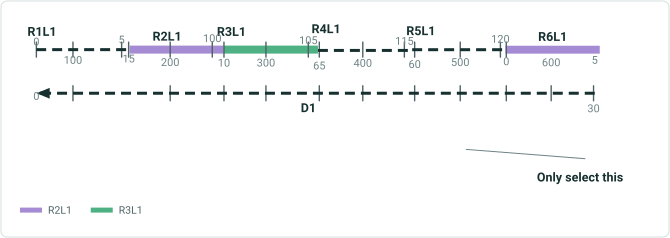

| Route | From Date | To Date | Line Order Input |
| --- | --- | --- | --- |
| R1L1 | 1/1/2000 | Null | 100 |
| R2L1 | 1/1/2000 | Null | 200 |
| R3L1 | 1/1/2000 | 1/1/2010 | 300 |
| R3L1 | 1/1/2010 | Null | 300 |
| R4L1 | 1/1/2000 | 1/1/2010 | 400 |
| R4L1 | 1/1/2010 | Null | 400 |
| R5L1 | 1/1/2000 | Null | 500 |
| R6L1 | 1/1/2000 | Null | 600 |


| Route | From Date | To Date | Line Order output |
| --- | --- | --- | --- |
| R1L1 | 1/1/2000 | Null | 600 |
| R2L1 | 1/1/2000 | Null | 500 |
| R3L1 | 1/1/2000 | 1/1/2010 | 400 |
| R3L1 | 1/1/2010 | Null | 400 |
| R4L1 | 1/1/2000 | 1/1/2010 | 300 |
| R4L1 | 1/1/2010 | Null | 300 |
| R5L1 | 1/1/2000 | Null | 200 |
| R6L1 | 1/1/2000 | Null | 100 |

## Case 45 <!-- slide 19 -->

### Time Sliced Routes

**Time sliced routes – all routes in a line have different time slices, select only R2L1 (2000 – 2005)**
Output  Any route the routes which overlap with the selected route time slice will have their line order reversed.

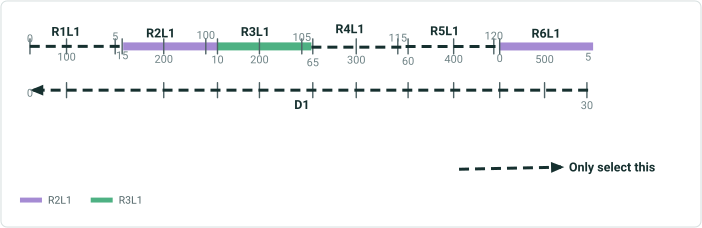

| Route | From Date | To Date | Line Order Input |
| --- | --- | --- | --- |
| R1L1 | 1/1/2000 | Null | 100 |
| R2L1 | 1/1/2000 | 1/1/2005 | 200 |
| R3L1 | 1/1/2005 | 1/1/2015 | 200 |
| R3L1 | 1/1/2015 | Null | 200 |
| R4L1 | 1/1/2005 | 1/1/2015 | 300 |
| R4L1 | 1/1/2015 | Null | 300 |
| R5L1 | 1/1/2016 | Null | 400 |
| R6L1 | 1/1/2018 | Null | 500 |

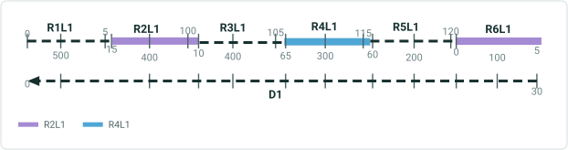

| Route | From Date | To Date | Line Order Input |
| --- | --- | --- | --- |
| R1L1 | 1/1/2000 | Null | 500 |
| R2L1 | 1/1/2000 | 1/1/2005 | 400 |
| R3L1 | 1/1/2005 | 1/1/2015 | 400 |
| R3L1 | 1/1/2015 | Null | 400 |
| R4L1 | 1/1/2005 | 1/1/2015 | 300 |
| R4L1 | 1/1/2015 | Null | 300 |
| R5L1 | 1/1/2016 | Null | 200 |
| R6L1 | 1/1/2018 | Null | 100 |

## Case 46 <!-- slide 20 -->

### Time Sliced Routes

**Time sliced routes – all routes in a line have different time slices - select only R2L1 (1995 - null)**
Output  All the routes which overlap with the selected route time slice will have their line order reversed.

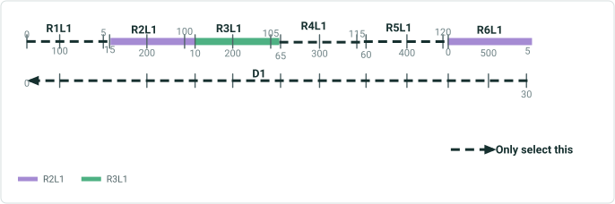

| Route | From Date | To Date | Line Order Input |
| --- | --- | --- | --- |
| R1L1 | 1/1/1995 | null | 100 |
| R2L1 | 1/1/1995 | 1/1/2005 | 200 |
| R3L1 | 1/1/2005 | 1/1/2010 | 200 |
| R3L1 | 1/1/2010 | Null | 200 |
| R4L1 | 1/1/2008 | 1/1/2012 | 300 |
| R4L1 | 1/1/2012 | Null | 300 |
| R5L1 | 1/1/2008 | Null | 400 |
| R6L1 | 1/1/2012 | Null | 500 |


| Route | From Date | To Date | Line Order Input |
| --- | --- | --- | --- |
| R1L1 | 1/1/1995 | null | 500 |
| R2L1 | 1/1/1995 | 1/1/2005 | 400 |
| R3L1 | 1/1/2005 | 1/1/2010 | 400 |
| R3L1 | 1/1/2010 | Null | 400 |
| R4L1 | 1/1/2008 | 1/1/2012 | 300 |
| R4L1 | 1/1/2012 | Null | 300 |
| R5L1 | 1/1/2008 | Null | 200 |
| R6L1 | 1/1/2012 | Null | 100 |

## Case 47 <!-- slide 21 -->

### Time Sliced Routes

**Time sliced routes – A line having routes of multiple time slices. Select all the routes and reverse . R2L1 is reassigned to R3L1 during 1/1/2015.**

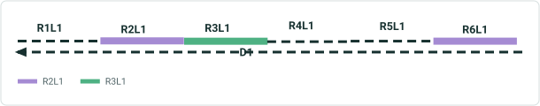

| Route | From Date | To Date | Line Order Input |
| --- | --- | --- | --- |
| R1L1 | 1/1/2000 | Null | 100 |
| R2L1 | 1/1/2005 | 1/1/2015 | 200 |
| R3L1 | 1/1/2005 | 1/1/2015 | 300 |
| R3L1 | 1/1/2015 | Null | 200 |
| R4L1 | 1/1/2010 | 1/1/2015 | 400 |
| R4L1 | 1/1/2015 | Null | 300 |
| R5L1 | 1/1/2020 | Null | 400 |
| R6L1 | 1/1/2025 | Null | 500 |

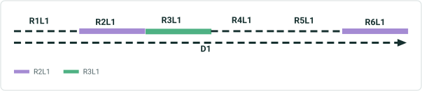

| Route | From Date | To Date | Line Order Input |
| --- | --- | --- | --- |
| R1L1 | 1/1/2000 | Null | 500 |
| R2L1 | 1/1/2005 | 1/1/2015 | 400 |
| R3L1 | 1/1/2005 | 1/1/2015 | 300 |
| R3L1 | 1/1/2015 | Null | 400 |
| R4L1 | 1/1/2010 | 1/1/2015 | 200 |
| R4L1 | 1/1/2015 | Null | 300 |
| R5L1 | 1/1/2020 | Null | 200 |
| R6L1 | 1/1/2025 | Null | 100 |

## Case 48 <!-- slide 22 -->

### Time Sliced Routes

**Time sliced routes – A line having routes of multiple time slices – also verify the out put warning message.**

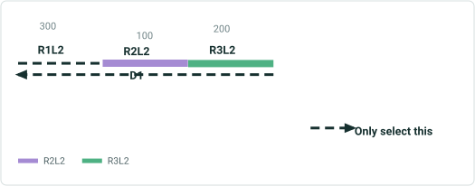

| Route | From Date | To Date | Line Order Input |
| --- | --- | --- | --- |
| R1L2 | 1/1/2000 | 1/1/2004 | 300 |
| R1L2 | 1/1/2004 | null | 300 |
| R2L2 | 1/1/1995 | 1/1/1997 | 100 |
| R2L2 | 1/1/2000 | 1/1/2004 | 100 |
| R2L2 | 1/1/2004 | null | 100 |
| R3L2 | 1/1/1995 | 1/1/1997 | 200 |
| R3L2 | 1/1/2000 | 1/1/2004 | 200 |
| R3L2 | 1/1/2004 | null | 200 |

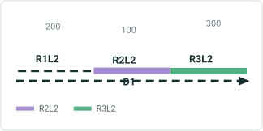

| Route | From Date | To Date | Line Order Input |
| --- | --- | --- | --- |
| R1L2 | 1/1/2000 | 1/1/2004 | 300 |
| R1L2 | 1/1/2004 | null | 200 |
| R2L2 | 1/1/1995 | 1/1/1997 | 100 |
| R2L2 | 1/1/2000 | 1/1/2004 | 100 |
| R2L2 | 1/1/2004 | null | 100 |
| R3L2 | 1/1/1995 | 1/1/1997 | 200 |
| R3L2 | 1/1/2000 | 1/1/2004 | 00 |
| R3L2 | 1/1/2004 | null | 300 |

Check derive route representation
