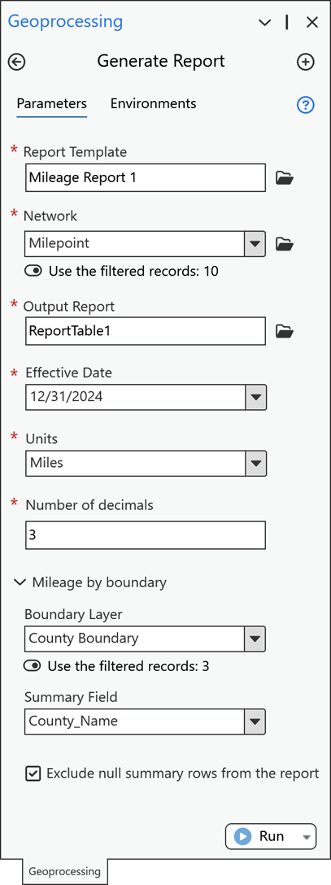
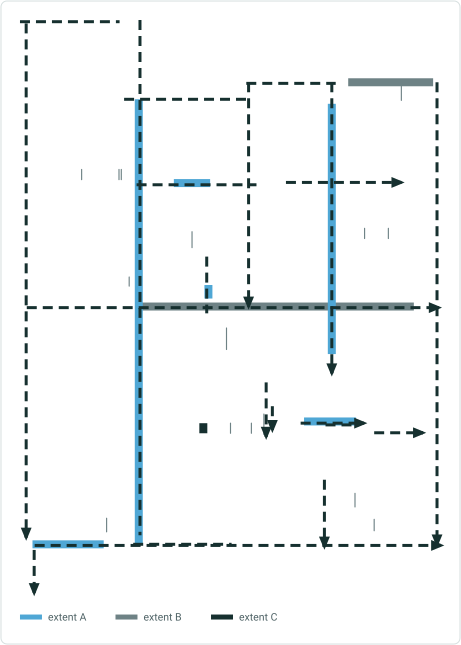
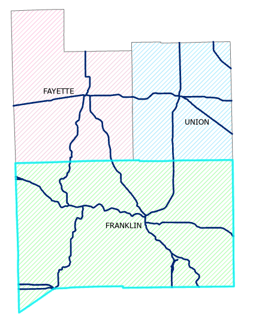
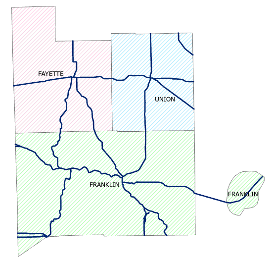

# Transform LRS Data GP tool: Summarize by polygon boundaries – Test Plan

|   |   |
| --- | --- |
| **Kind** | Test Plan · Pro |
| **Release** | — |
| **Issue** | [ArcGISPro/ps-location-referencing#5744](https://devtopia.esri.com/ArcGISPro/ps-location-referencing/issues/5744) |
| **Source** | [TransformReportingDataGP_BoundarySum_Testplan.pptx](<https://esriis.sharepoint.com/sites/LocationReferencing/Shared%20Documents/General/Test%20Plans/TransformReportingDataGP_BoundarySum_Testplan.pptx>) |
| **Edited** | 2024-06-27 20:44 by Praveen Kumar |
| **Extracted** | 2026-09-04 · lane `xmlstrip` |

<!-- metadata
```yaml
title: "Transform LRS Data GP tool: Summarize by polygon boundaries – Test Plan"
source_file: "TransformReportingDataGP_BoundarySum_Testplan.pptx"
source_url: "https://esriis.sharepoint.com/sites/LocationReferencing/Shared%20Documents/General/Test%20Plans/TransformReportingDataGP_BoundarySum_Testplan.pptx"
doc_id: 359
doc_kind: "Test Plan"
surface: "Pro"
doc_revision: ""
target_release: ""
pe: "Praveen Kumar"
dev: "Michael"
author: "Lakshmi Ananthanarayanan"
last_edited_by: "Praveen Kumar"
last_edited: "2024-06-27T20:44:05Z"
extracted: 2026-09-04
extraction_lane: xmlstrip
prompt_version: "v2.0.2"
keywords: ["polygon boundary", "summary field", "geoprocessing tool", "route mileage", "boundary layer", "test case", "cancellation", "complex route"]
tools: ["Transform LRS Data GP tool"]
products: []
issues: ["ArcGISPro/ps-location-referencing#5744"]
related: [{"doc":372,"file":"transform-lrs-data-gp-tool-test-plan__doc372.md","s":7.616},{"doc":260,"file":"generate-a-route-log-using-the-glrsdp-gp-tool-test-plan__doc260.md","s":7.145},{"doc":339,"file":"generate-lr-data-product-support-summary-and-length-fields-from-the-template__doc339.md","s":5.294},{"doc":321,"file":"support-multiple-summary-fields-in-generate-lrs-data-product-test-plan__doc321.md","s":3.901},{"doc":172,"file":"generatelengthsummary-test-plan__doc172.md","s":3.617}]
```
-->

## Summary

Test plan for the Transform LRS Data geoprocessing tool that summarizes route data by polygon boundaries. It covers UI verification, functionality checks including support for various route types and databases, automation, and negative test cases. The plan includes detailed test cases for route boundary inclusion, handling of gapped and complex routes, and cancellation behavior.

## Related documents

<!-- related:begin -->
- [Transform LRS Data GP tool – Test Plan](<https://esriis.sharepoint.com/sites/lrsworkspace/LRS Doc Index/Test Plans/transform-lrs-data-gp-tool-test-plan__doc372.md>) — similar text 0.35 · 2 title words · 3 filename words · same kind/surface/dev/folder <!-- rel:372 -->
- [Generate a Route Log using the GLRSDP GP Tool – Test Plan](<https://esriis.sharepoint.com/sites/lrsworkspace/LRS Doc Index/Test Plans/generate-a-route-log-using-the-glrsdp-gp-tool-test-plan__doc260.md>) — similar text 0.32 · 1 title word · 1 filename word · same kind/surface/pe/dev/folder <!-- rel:260 -->
- [Generate LR Data Product: Support summary and length fields from the template – Test Plan](<https://esriis.sharepoint.com/sites/lrsworkspace/LRS Doc Index/Test Plans/generate-lr-data-product-support-summary-and-length-fields-from-the-template__doc339.md>) — similar text 0.20 · 1 filename word · same kind/surface/dev/folder <!-- rel:339 -->
- [Support multiple summary fields in Generate LRS Data Product – Test Plan](<https://esriis.sharepoint.com/sites/lrsworkspace/LRS Doc Index/Test Plans/support-multiple-summary-fields-in-generate-lrs-data-product-test-plan__doc321.md>) — similar text 0.24 · 1 filename word · same kind/surface/dev/folder <!-- rel:321 -->
- [GenerateLengthSummary – Test Plan](<https://esriis.sharepoint.com/sites/lrsworkspace/LRS Doc Index/Test Plans/generatelengthsummary-test-plan__doc172.md>) — similar text 0.18 · 1 filename word · same kind/surface/dev <!-- rel:172 -->
<!-- related:end -->

<!-- docs:begin -->
## Esri documentation

[Complex scenarios for route calibration](https://doc.esri.com/en/arcgis-pro/latest/help/production/location-referencing-pipelines/complex-scenarios-for-route-calibration.html)

_No page matched:_ [Transform LRS Data GP tool](https://www.google.com/search?q=%22Transform%20LRS%20Data%20GP%20tool%22+site%3Adoc.esri.com)
<!-- docs:end -->

---

## Slide 1 — Transform LRS Data GP tool : Summarize by polygon boundaries – Test Plan

https://devtopia.esri.com/ArcGISPro/ps-location-referencing/issues/5744

PE: Praveen Kumar
Dev: Michael

## Slide 2

GP tool:

- Add a new parameter ‘Boundary Layer’  to Transform LRS Data GP tool that accepts polygon features as input.
- Add a new parameter ‘Summary Field’ to the gp tool

UI verification

- Verify in the pane the label of the boundary layer and summary fields are of same font size and aligned properly
- Verify the boundary layer and summary field is not marked with * (to show it as optional)
- Users can change the layer in the pane
- Users can change the summary field in the pane
- When few features are selected ensure that the ‘use the selected records:’ is shown.
- 508 and i18n


## Negative Cases <!-- slide 3 -->

### Verify Simple Route, Gapped Routes, Multi-gapped Routes

Functionality Verification

**Verify simple route, gapped routes, multi-gapped routes, 3D and complex shapes are supported.**
- Verify the boundary layer accept only polygon features
- Verify the boundary layer is acceptable even if it in different database
- Verify that the multipart polygons are supported in the boundary layer
- Verify that the selection set of the boundary layer is honoured
- Verify that the summary field drop down lists only the non-system fields
- Verify in python inline and stand alone
- Verify in model builder include chaining
- Verify tool supports running against fgdb, egdb, fs default and versions
- Verify there is a progress bar at the bottom of tool pane and it shows the progress
- Clicking cancel will actually cancel the tool – depend on what stage of cancel, output will be different
Automation: PY
Doc: update the GP doc

- Boundary layer is not a polygon layer
- Summary field does not exist
- User provides incorrect format for these fields (this can happen in python)
- User provide incorrect file type we don’t support yet in python



## Slide 4

Testing

- Test in fgdb, egdb (oracle + sql), fs - default and versions
- Test with nonline, Line,  derived routes, PoM and Addressing (sanity)
- Test with and without route selection and definition query
- Test with and without boundary selection and definition query
- The tool should run when the layers are checked off (invisible) in map
- Test running against thousands of routes
- Test running against 0 route e.g. an effective date that no route exists – output should not contain any row
- Test simple, gapped routes, multi-gapped routes, complex shapes, and z values
- Test with different gap calibration rules
- Test with overlapping routes
- Test with routes with time slices at different locations – only the time slice that exists in Effective Date is returned
- Test with routes that have measures different from geographic length
- Test with uncalibrated routes – they will not be added in the output csv
- Test cancelling tool while it’s running – not generate anything
- Test python inline and stand alone
- Test chained model builder

## Slide 5

TC1



| County | Miles |
| --- | --- |
| FAYETTE | 121.4341308 |
| FRANKLIN | 296.8384691 |
| UNION | 128.8240573 |


## Slide 6

TC2

Route on boundary goes to franklin or union?
We should include in either of one.

| County | Miles |
| --- | --- |
| FAYETTE | 121.4341308 |
| FRANKLIN | 296.8384691 |
| UNION | 128.8240573 |


## Slide 7

TC3

| County | Miles |
| --- | --- |
| FAYETTE | 131.4341308 |
| FRANKLIN | 306.8384691 |
| UNION | 128.8240573 |

We should include the parts inside the respective boundary in which its falling, if its exactly coincident with boundary include in any one boundary.


## Slide 8

TC4

| County | Miles |
| --- | --- |
| FRANKLIN | 296.8384691 |



## Slide 9

TC5

| County | Miles |
| --- | --- |
| RUSH | 0 |


## Slide 10

TC6

| County | Miles |
| --- | --- |
| FAYETTE | 121.4341308 |
| FRANKLIN | 320.8384691 |
| UNION | 128.8240573 |

Route mileage outside boundary is not included



## Slide 11

TC7

| County | Miles |
| --- | --- |
| UNION | 31.4341308 |


## Slide 12

TC8


| County | Miles |
| --- | --- |
| FRANKLIN | 0 |


## Slide 13

TC9

| County | Miles |
| --- | --- |
| FRANKLIN | 220.654651 |

Should not include the routes which falls in the hollow portion


