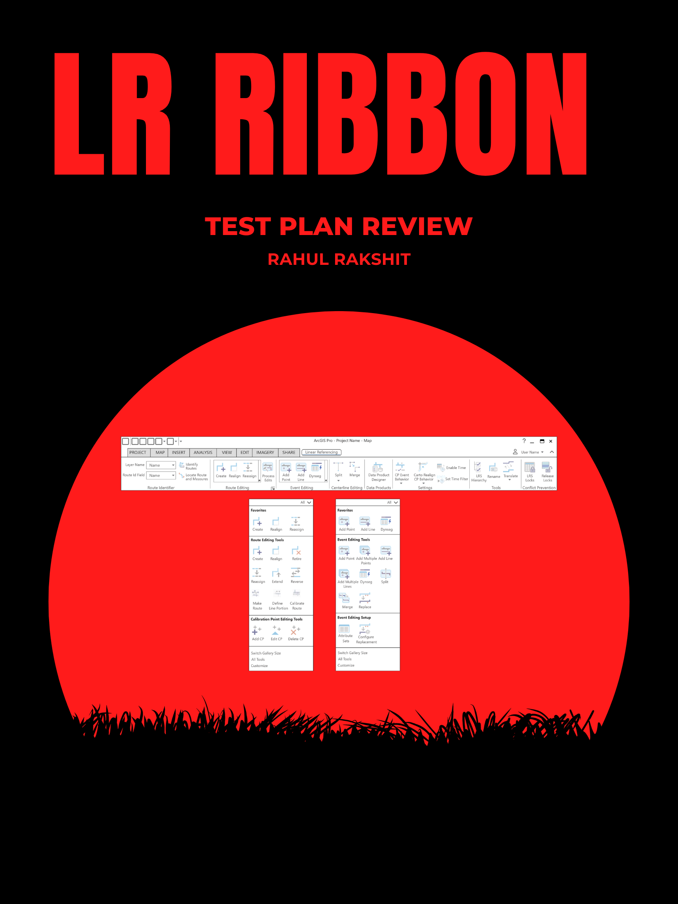
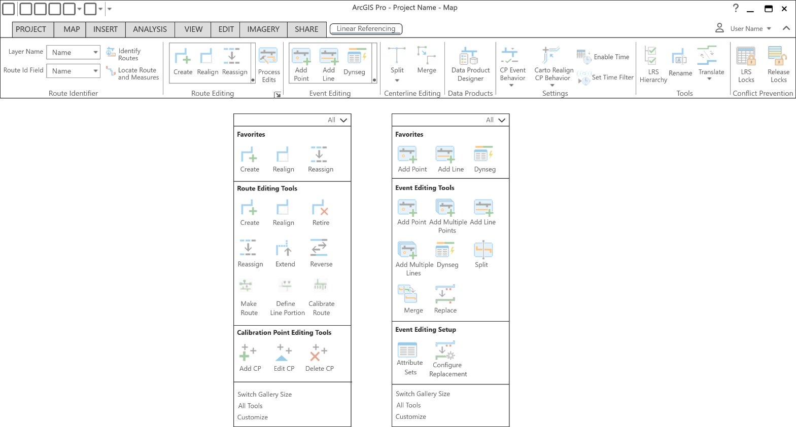

# Unified Ribbon Test Plan

| Field | Value |
| --- | --- |
| **Doc** | 20 · Test Plan · Pro |
| **Product** | Roads & Highways · Pipeline Referencing · Utility Network |
| **Release** | — |
| **Issues** | — |
| **Source** | [Unified_Ribbon_TestPlan1.pptx](<https://esriis.sharepoint.com/sites/LocationReferencing/Shared%20Documents/General/Test%20Plans/Unified_Ribbon_TestPlan1.pptx>) |
| **People** | author Rahul Rakshit · PE — · dev — |
| **Edited** | 2026-06-22 15:13 by Rahul Rakshit |
| **Extracted** | 2026-09-04 · lane xmlstrip · format 3.0 · prompt v2.0.2 |
| **Keywords** | ribbon · route editing · tooltips · keyboard navigation · dark mode · feature class · linear referencing extension · location referencing |
| **Tools** | Make Route · Define Line Portion · Calibrate Route · Route Identifier tools · Event Editing Group tools · Centerline Editing Group tools · Conflict Prevention Group tools |

## Summary

Test plan for verifying the behavior and functionality of the unified ribbon in ArcGIS Pro when working with feature classes containing measures. Includes tests for tool availability, licensing messages, ribbon customization, dark mode, tooltips, keyboard navigation, screen reader support, and context-based tool visibility across various resolutions and scales.

## Related documents

<!-- related:begin -->
- [Add Point Event to Dominant Route in ArcGIS Pro – Test Plan](<https://esriis.sharepoint.com/sites/lrsworkspace/LRS Doc Index/Test Plans/3916-add-point-event-to-dominant-route-in-pro.md>) — similar text 0.04 · same kind/surface/folder <!-- rel:360 s=2.982 -->
- [Reorganize Location Referencing Pro Options Test Plan](<https://esriis.sharepoint.com/sites/lrsworkspace/LRS Doc Index/Test Plans/5826-reorganize-lr-pro-options-rh-apr-v2-2024-08.md>) — similar text 0.07 · same kind/surface/folder <!-- rel:340 s=2.613 -->
- [Set Time Filter Button LR Pro Ribbon: Test Plan](<https://esriis.sharepoint.com/sites/lrsworkspace/LRS Doc Index/Test Plans/4138-set-time-filter-button-lr-pro-ribbon.md>) — similar text 0.10 · 1 title word · same kind/surface/folder <!-- rel:656 s=2.565 -->
- [Iteration Planning and Issue Tracking for Location Referencing 3.8/12.2](<https://esriis.sharepoint.com/sites/lrsworkspace/LRS%20Doc%20Index/Schedules/3040-iteration-planning-and-issue-tracking-for-lr-3-8-12-2.md>) — similar text 0.03 · same surface <!-- rel:2 s=2.529 -->
- [Regression Testing Task List V1](<https://esriis.sharepoint.com/sites/lrsworkspace/LRS%20Doc%20Index/Test%20Plans/regression-testing-task-list-v1.md>) — similar text 0.07 · same kind/surface <!-- rel:115 s=2.323 -->
<!-- related:end -->

<!-- docs:begin -->
## Esri documentation

[View utility network feature class properties](https://doc.esri.com/en/arcgis-pro/latest/help/production/location-referencing-pipelines/view-utility-network-feature-class-properties.html) · [Set Location Referencing options](https://doc.esri.com/en/arcgis-pro/latest/help/production/roads-highways/set-location-referencing-options.html)

_No page matched:_ [Make Route](https://www.google.com/search?q=%22Make%20Route%22+site%3Adoc.esri.com) · [Define Line Portion](https://www.google.com/search?q=%22Define%20Line%20Portion%22+site%3Adoc.esri.com) · [Calibrate Route](https://www.google.com/search?q=%22Calibrate%20Route%22+site%3Adoc.esri.com) · [Route Identifier tools](https://www.google.com/search?q=%22Route%20Identifier%20tools%22+site%3Adoc.esri.com) · [Event Editing Group tools](https://www.google.com/search?q=%22Event%20Editing%20Group%20tools%22+site%3Adoc.esri.com) · [Centerline Editing Group tools](https://www.google.com/search?q=%22Centerline%20Editing%20Group%20tools%22+site%3Adoc.esri.com) · [Conflict Prevention Group tools](https://www.google.com/search?q=%22Conflict%20Prevention%20Group%20tools%22+site%3Adoc.esri.com)
<!-- docs:end -->

---

## Overview

### Slide 1 <!-- slide 1 -->

## Test Cases

### TC-U01 — Verify ribbon display, tool availability and messages <!-- src: LLM · slide 2 · "Verify that" checklist -->
- **Group:** Verify that
- **Steps:**
1. The ribbon shows up ONLY when a feature class containing measures is present in the TOC
2. All the tools in the Route Identifier group are available when a feature class containing measures is present in the TOC
3. The Make Route, Define Line Portion, and Calibrate Route tools in the Route Editing group display the message “Only Linear Referencing Extension tools can be used to edit this layer” whenever a feature class with the Linear Referencing data model, and the Linear Referencing extension license is supplied as the tool input.
4. The tools in the Route Editing group—except the Make Route, Define Line Portion, and Calibrate Route tools—along with the Event Editing Group, Centerline Editing Group, Data Products, Settings Group, Tools Group, and Conflict Prevention Group, display the message “Only Map Linear Referencing tools can be used to edit this layer” whenever a feature class (with the Linear Referencing data model, and the Linear Referencing extension license) is supplied as the tool input.
5. Verify that all the tools show up in the  ‘commands’ list when customizing the ribbon
6. Test dark mode
7. Verify tooltips on all the tools
8. Test with FGDB, DC and FS along with RH, APR, APR-UN, Addressing, Caltrans and FGDB m enabled feature classes with non LR data type

### TC-U02 — Verify resolutions, ribbon load, accessibility and context behavior <!-- src: LLM · slide 3 · "Verify that" checklist -->
- **Group:** Verify that
- **Steps:**
1. Test with following resolutions and scale:
2. Test with minimized tool icons
3. Open project with existing LR layers → Ribbon loads automatically
4. Open project with existing m enabled layers → Ribbon loads automatically
5. Remove all m enabled layers from the TOC → Ribbon goes away
6. Disabled tools show appropriate tooltips with the reason
7. Test Keyboard navigation across ribbon
8. Test keyboard shortcuts provided in Pro
9. Test custom keyboard shortcuts
10. Test id the Tab order is correct
11. Test Screen reader announcements
12. The context based behavior of present Location Referencing tools remain the same. E.g., The Conflict Prevention section only shows up when it’s enabled.

| Resolution | Scale |
| --- | --- |
| 720 | 100, 125, 150, 175, 200 |
| 1080 | 100, 125, 150, 175, 200 |
| 1440 | 100, 125, 150, 175, 200 |
| 2160 | 100, 125, 150, 175, 200 |
