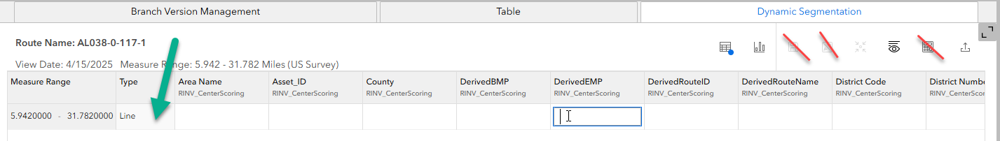
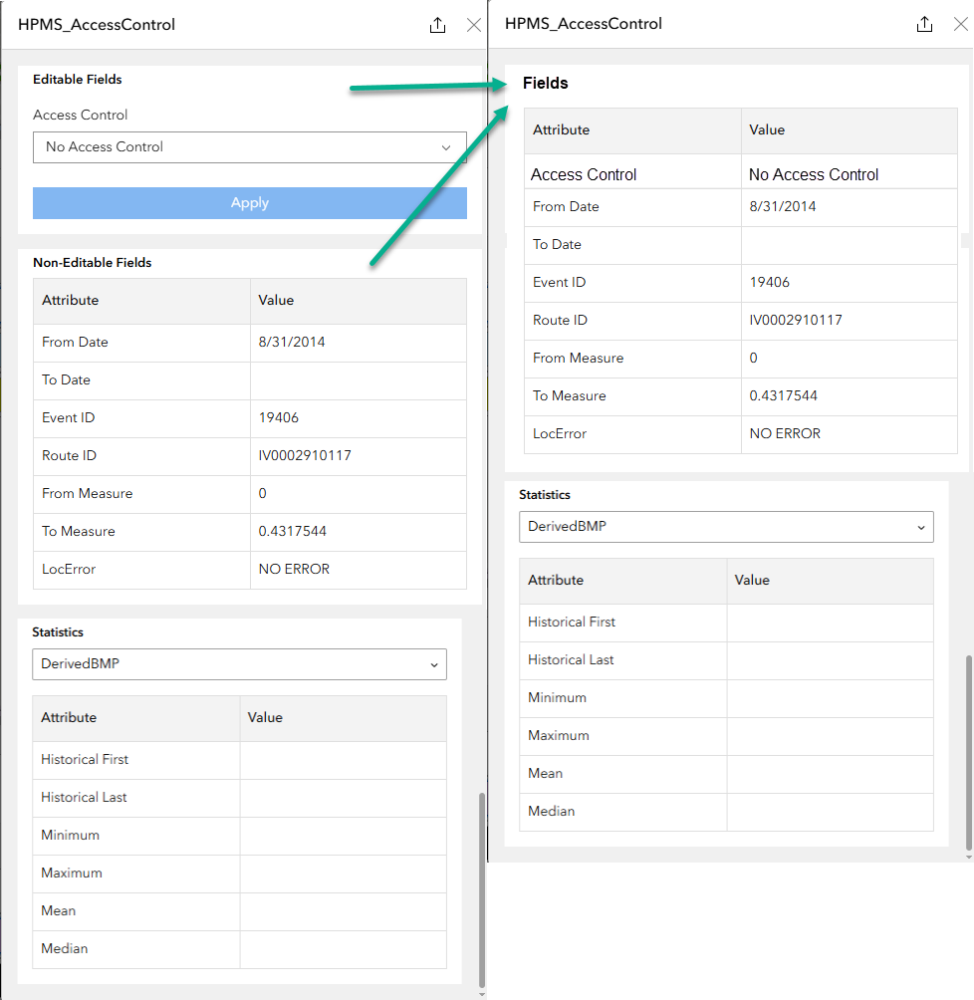

# View-only (non editable) DynSeg / SLD in Experience Builder – test plan

|   |   |
| --- | --- |
| **Kind** | Test Plan · Experience Builder |
| **Release** | — |
| **Issue** | [Beijing-R-D-Center/ExperienceBuilder-Web-Extensions#26137](https://devtopia.esri.com/Beijing-R-D-Center/ExperienceBuilder-Web-Extensions/issues/26137) · [Beijing-R-D-Center/ExperienceBuilder-Web-Extensions#20071](https://devtopia.esri.com/Beijing-R-D-Center/ExperienceBuilder-Web-Extensions/issues/20071) · [Beijing-R-D-Center/ExperienceBuilder-Web-Extensions#20917](https://devtopia.esri.com/Beijing-R-D-Center/ExperienceBuilder-Web-Extensions/issues/20917) · [Beijing-R-D-Center/ExperienceBuilder-Web-Extensions#20594](https://devtopia.esri.com/Beijing-R-D-Center/ExperienceBuilder-Web-Extensions/issues/20594) |
| **Source** | [UneditableDynsegSLD_testplan.pptx](<https://esriis.sharepoint.com/sites/LocationReferencing/Shared%20Documents/General/Test%20Plans/UneditableDynsegSLD_testplan.pptx>) |
| **Edited** | 2025-05-27 17:13 by Claire Wang |
| **Extracted** | 2026-09-04 · lane `xmlstrip` |

<!-- metadata
```yaml
title: "View-only (non editable) DynSeg / SLD in Experience Builder – test plan"
source_file: "UneditableDynsegSLD_testplan.pptx"
source_url: "https://esriis.sharepoint.com/sites/LocationReferencing/Shared%20Documents/General/Test%20Plans/UneditableDynsegSLD_testplan.pptx"
doc_id: 161
doc_kind: "Test Plan"
surface: "Experience Builder"
doc_revision: ""
target_release: ""
pe: ""
dev: "1"
author: "Lakshmi Ananthanarayanan"
last_edited_by: "Claire Wang"
last_edited: "2025-05-27T17:13:11Z"
extracted: 2026-09-04
extraction_lane: xmlstrip
prompt_version: "v2.0.2"
keywords: ["dynamic segmentation", "straight line diagram", "experience builder", "view only mode", "allow editing toggle", "attribute sets", "non editable fields", "test cases", "automation"]
tools: ["DynSeg", "Straight Line Diagram"]
products: []
issues: ["Beijing-R-D-Center/ExperienceBuilder-Web-Extensions#26137", "Beijing-R-D-Center/ExperienceBuilder-Web-Extensions#20071", "Beijing-R-D-Center/ExperienceBuilder-Web-Extensions#20917", "Beijing-R-D-Center/ExperienceBuilder-Web-Extensions#20594"]
related: [{"doc":346,"file":"dynamic-segmentation-straight-line-diagram-support-exb__doc346.md","s":1003.298},{"doc":189,"file":"view-only-dynseg-and-sld-user-story__doc189.md","s":6.139},{"doc":170,"file":"add-spanning-line-events-to-dominant-routes-in-experience-builder-test-plan__doc170.md","s":4.649},{"doc":171,"file":"flatten-sld-results-in-rows-and-use-10-tick-marks-in-ruler-test-plan__doc171.md","s":4.605},{"doc":456,"file":"exb-search-by-referent-test-plan__doc456.md","s":3.623}]
```
-->

## Summary

Test plan for the view-only (non editable) mode of Dynamic Segmentation (DynSeg) and Straight Line Diagram (SLD) widgets in Experience Builder. Covers configuration options, functionality changes when editing is disabled, and detailed test cases including user roles and multiple widget configurations. Includes automation considerations and documentation updates.

## Related documents

<!-- related:begin -->
- [Dynamic Segmentation – Straight Line Diagram Support - ExB](<https://esriis.sharepoint.com/sites/lrsworkspace/LRS Doc Index/Test Plans/dynamic-segmentation-straight-line-diagram-support-exb__doc346.md>) — shared issue Beijing-R-D-Center/ExperienceBuilder-Web-Extensions#20594 · similar text 0.19 · 1 filename word · same kind/surface/folder <!-- rel:346 -->
- [View only DynSeg and SLD User Story](<https://esriis.sharepoint.com/sites/lrsworkspace/LRS Doc Index/User Stories/view-only-dynseg-and-sld-user-story__doc189.md>) — similar text 0.47 · 4 title words · 2 filename words · same surface <!-- rel:189 -->
- [Add Spanning Line Events to Dominant Routes in Experience Builder – Test Plan](<https://esriis.sharepoint.com/sites/lrsworkspace/LRS Doc Index/Test Plans/add-spanning-line-events-to-dominant-routes-in-experience-builder-test-plan__doc170.md>) — similar text 0.21 · 2 title words · 1 filename word · same kind/surface/dev/folder <!-- rel:170 -->
- [Flatten SLD results in rows and use 10 tick marks in ruler– test plan](<https://esriis.sharepoint.com/sites/lrsworkspace/LRS Doc Index/Test Plans/flatten-sld-results-in-rows-and-use-10-tick-marks-in-ruler-test-plan__doc171.md>) — similar text 0.19 · 1 title word · 2 filename words · same kind/surface/dev <!-- rel:171 -->
- [ExB Search By Referent – Test Plan](<https://esriis.sharepoint.com/sites/lrsworkspace/LRS Doc Index/Test Plans/exb-search-by-referent-test-plan__doc456.md>) — similar text 0.11 · 1 filename word · same kind/surface/dev/folder <!-- rel:456 -->
<!-- related:end -->

<!-- docs:begin -->
## Esri documentation

[Apply dynamic segmentation](https://doc.esri.com/en/arcgis-pro/latest/help/production/location-referencing-pipelines/apply-dynamic-segmentation.html)

_No page matched:_ [DynSeg](https://www.google.com/search?q=%22DynSeg%22+site%3Adoc.esri.com) · [Straight Line Diagram](https://www.google.com/search?q=%22Straight%20Line%20Diagram%22+site%3Adoc.esri.com)
<!-- docs:end -->

---

## Slide 1 — View-only (non editable) DynSeg /SLD in ExB – test plan

https://devtopia.esri.com/Beijing-R-D-Center/ExperienceBuilder-Web-Extensions/issues/26137

PE:
Dev:

## Slide 2

Configuration
Add toggle option above Merge coincident events called “Allow editing”

  - Default is on
  - When it’s on, Dynseg table and SLD remain editable
  - When it’s off, merge coincident event option can also be on but it won’t have any effect as editing is disabled

Functionality
When Allow editing option is off, in Dynseg table:

- Hide the Save, Discard, and Field Calculator buttons – make sure there is no gap/white space issues in all sized views
- Double clicking a field does not enable editing or enable the cursor.
  - Use the same cell color (light grey) or white, decided by the PE, and behavior that we already support (e.g. the geometry Type cell; point event fields in the row of Line type)

In SLD:

- After double clicking an event record, pop-up window does not distinguish Editable Fields vs. Non-Editable Fields.
- Show 1 section called “Fields” that shows all fields.
- All fields behave like the current “Non-Editable Fields”
- No change to Statistics section.

 

## Slide 3

Test

- Verify configuration in express and non-express modes
- Test Dynseg table and SLD
- Verify the tool results are the same as when Allow editing option is on
- Verify hover still works the way it is today
- Test with nonline and line networks, with line and/or point event attribute sets
- Test different attribute sets
- When logged in user is viewer, even when the Allow editing option is on, keep current viewer behavior in table and SLD (they can still add/change values but cannot save the edits)
- Test with all the user types, especially for those with editing capabilities, like creator, professional plus, editor, and etc
- Verify the tool aligns with any other Experience Builder specifications/requirements
- If multiple DynSeg widgets are configured, the editability should not affect each other. E.g. Dynseg 1 is editable, while DynSeg2 is not. This is a rare case.
- 508/i18n
- Test with various themes for the text color showing in the pane
- Test in different browsers (chrome and firefox) and layouts

## Slide 4

Test Cases

- Non-line network with line attribute set only. Verify table and the pop-up window in SLD.
- Non-line network with line and point attribute sets. Verify table and the pop-up window in SLD.
- Line network with point attribute set only. Verify table and the pop-up window in SLD.
- Line network with line and point attribute sets. Verify table and the pop-up window in SLD.
- If this user story is implemented after showing intersections, centerlines, and site addresses in SLD, also make sure they remain non-editable.
- Log in as viewer. When Allow editing option is off, viewer cannot edit anything.
  - Log in as viewer. When allow editing option is on, viewer can still add/change values but cannot save the edits
- Test when multiple Dynseg widgets are configured and they have different Allow editing options.

Existing Data
Consider utilizing data and a few cases from the existing Dynseg/SLD user stories, and/or automation
	Pop-up window; Dynseg Table; SLD

## Slide 5

Automation
Existing automation will fail if it has a configuration part. Fix it.
Add cases when results are view only

Documentation
Add to existing Dynseg/SLD topics
