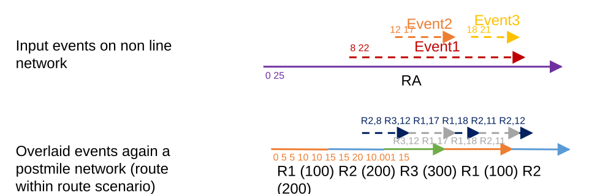

# Overlay Events: Support overlay of an event against a Postmile network with routes within routes

| Field | Value |
| --- | --- |
| **Doc** | 832 · User Story · Pro |
| **Product** | Roads & Highways |
| **Release** | — |
| **Issues** | [ArcGISPro/ps-location-referencing#1453](https://devtopia.esri.com/ArcGISPro/ps-location-referencing/issues/1453) |
| **Source** | [OverlayPostmileRoutewithinRoute.pptx](<https://esriis.sharepoint.com/sites/LocationReferencing/Shared%20Documents/General/OverlayPostmileRoutewithinRoute.pptx>) |
| **People** | author William Isley · PE — · dev — |
| **Edited** | 2020-03-10 21:49 by Nathan Easley |
| **Extracted** | 2026-09-04 · lane xmlstrip · format 3.0 · prompt v2.0.2 |
| **Keywords** | postmile network · route within route · overlay events · dynamic segmentation · measures · shapes · routes · event overlay |
| **Tools** | Overlay Events GP tool |

## Summary

User story for overlaying events against a postmile network with a route within route scenario to ensure correct measures, route IDs, dates, and shapes in the output feature class or table. Includes testing scenarios for various route within route conditions and gaps.

## Related documents

<!-- related:begin -->
- [Translate Events: Support translation of an event to a network with Postmile routes within routes](<https://esriis.sharepoint.com/sites/lrsworkspace/LRS Doc Index/User Stories/1958-translate-events-support-translation-of-an-event.md>) — similar text 0.61 · 6 title words · 3 filename words · same kind/surface/folder <!-- rel:831 s=9.075 -->
- [Support Complex Route Shapes in Overlay Events GP tool](<https://esriis.sharepoint.com/sites/lrsworkspace/LRS Doc Index/User Stories/support-complex-route-shapes-in-overlay-events-gp.md>) — similar text 0.38 · 3 title words · 2 filename words · same kind/surface/folder <!-- rel:799 s=5.071 -->
- [Support Vertical Route Segments in Overlay Events GP tool](<https://esriis.sharepoint.com/sites/lrsworkspace/LRS Doc Index/User Stories/support-vertical-route-segments-in-overlay-events-gp.md>) — similar text 0.33 · 3 title words · 1 filename word · same kind/surface/folder <!-- rel:765 s=4.553 -->
- [Update Address Range Information in Overlay Events and Query Attribute Sets](<https://esriis.sharepoint.com/sites/lrsworkspace/LRS Doc Index/User Stories/5537-update-address-range-information-in-overlay-events-and-query.md>) — similar text 0.10 · 2 title words · 1 filename word · same kind/surface/folder <!-- rel:344 s=3.718 -->
- [Consider Point Events in Query Attribute Set and Overlay Events](<https://esriis.sharepoint.com/sites/lrsworkspace/LRS Doc Index/User Stories/consider-point-events-in-query-attribute-set-and-overlay.md>) — similar text 0.22 · 2 title words · 1 filename word · same kind/surface/folder <!-- rel:392 s=3.703 -->
<!-- related:end -->

<!-- docs:begin -->
## Esri documentation

[Methods for calibrating routes with physical gaps](https://doc.esri.com/en/arcgis-pro/latest/help/production/roads-highways/methods-for-calibrating-routes-with-physical-gaps.html) · [Apply dynamic segmentation](https://doc.esri.com/en/arcgis-pro/latest/help/production/roads-highways/apply-dynamic-segmentation.html) · [Split a centerline by measure](https://doc.esri.com/en/arcgis-pro/latest/help/production/roads-highways/split-a-centerline-by-measure.html) · [Complex shapes](https://doc.esri.com/en/arcgis-pro/latest/help/production/roads-highways/complex-shapes.html)

_No page matched:_ [Overlay Events GP tool](https://www.google.com/search?q=%22Overlay%20Events%20GP%20tool%22+site%3Adoc.esri.com)
<!-- docs:end -->

---

## Story
### Overlay Events: Support overlay of an event against a Postmile network with routes within routes <!-- slide 1 -->
User Story

### User Story <!-- slide 2 -->
As a Roads and Highways user at Caltrans, I need to be able to overlay events against a postmile network where the event would fall along a route with a route within route scenario so that the measures and shapes in the output feature class/table are correct and accurate.

## Acceptance Criteria
### Route with Route in Overlay Events <!-- slide 3 -->
- In the overlay events GP tool, choosing events to be dynamically segmented against a postmile network with a route within route scenario needs to be supported.
- When an event is overlaid against a postmile network and the from and to routeIDs would be on the same route, with at least one other route between the two parts of the from/to route, the following should occur:
  - The correct From RouteID, To RouteID, From Measure, To Measure, and From/To Dates should be applied to the output record
  - The correct shape should be built (if the output format is a feature class), which begins/ends at the correct locations on the route, with the shape encompassing the entire path between those two points on the postmile line
- If the input of the tool has multiple event records that will result in additional slicing so a single output record no longer reaches across the route within route scenario, the output records should still have the correct RouteIDs, Measures, Dates, and Shapes
R1 (100)  R2 (200)  R3 (300)   R1 (100)    R2 (200)
0                  5  5                 10  10                15  15                  20   10.001        15
R2,8     R3,12              R1,17  R1,18    R2,11 R2,12
Input events on non line network

Overlaid events again a postmile network (route within route scenario)
 R3,12       R1,17        R1,18  R2,11

[figure: RA · 0 25 · Event1 · 8 22 · Event2 · 12 17 · Event3 · 18 21]

## Testing
<!-- slide 4 -->
- Verify the previous test cases from https://devtopia.esri.com/ArcGISPro/ps-location-referencing/issues/1453 still work
- Test the following scenarios:
  - One or more events overlaid against a postmile route where From/To RouteIDs are on the same route without any gaps
  - One or more events overlaid against a postmile route where From/To RouteIDs are on the same route with a physical gap (without any routes filling the gap)
  - One or more events overlaid against a postmile route where From/To RouteIDs are on the same route with a route within route scenario (at least one other route on the same line between the From/To locations)
  - One or more events overlaid against a postmile route where From/To RouteIDs are on the same route with a route within route scenario (at least one other route on the same line between the From/To locations), but the segmentation results in shapes that don’t span across the route within route scenario
  - One or more events overlaid against a postmile route where From/To RouteIDs are on the same route with a route within route scenario, but the route between the From/To locations in on a different line (edge case that might not exist in the Caltrans data)

## Assignment
<!-- slide 5 -->
Story Points:
Dev:
PE:
