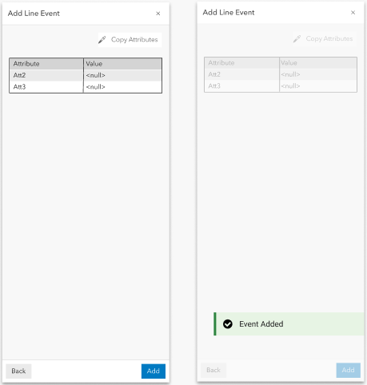
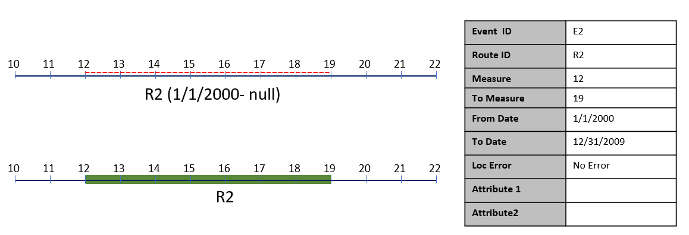
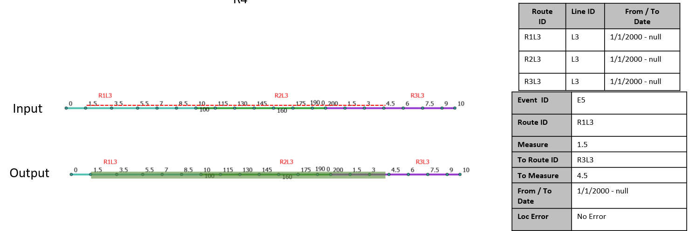
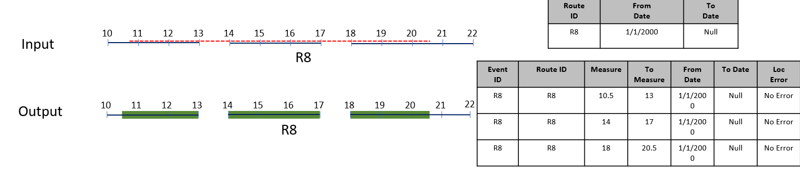
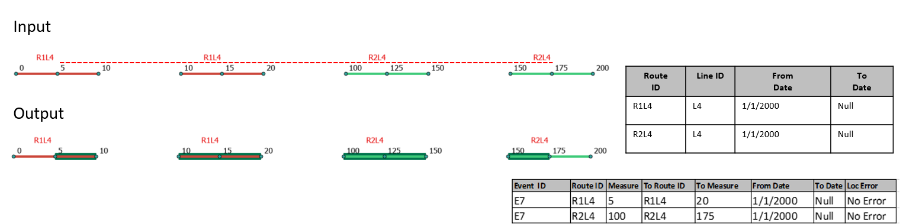
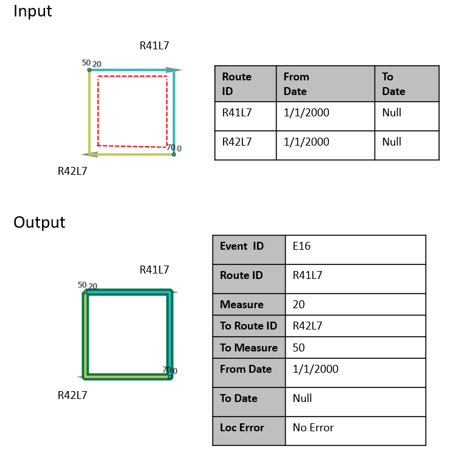

# Experience Builder: Add Single Line Event Widget

| Field | Value |
| --- | --- |
| **Doc** | 455 · User Story · Experience Builder |
| **Product** | Roads & Highways |
| **Release** | — |
| **Issues** | [Beijing-R-D-Center/ExperienceBuilder-Web-Extensions#16340](https://devtopia.esri.com/Beijing-R-D-Center/ExperienceBuilder-Web-Extensions/issues/16340) |
| **Source** | [ExB_AddSingleLineEvent.docx](<https://esriis.sharepoint.com/sites/LocationReferencing/Shared%20Documents/General/Test%20Plans/ExB_AddSingleLineEvent.docx>) |
| **People** | author Praveen Kumar · PE Claire · dev Dan |
| **Edited** | 2023-11-14 16:42 by Claire Wang |
| **Extracted** | 2026-09-04 · lane xmlstrip · format 3.0 · prompt v2.0.2 |
| **Keywords** | line event · spanning event · route · measure · attribute configuration · experience builder widget · ui testing |
| **Tools** | Add Single Line Event |

## Summary

This document describes the user story and testing plan for the Add Single Line Event widget in Experience Builder. It covers configuration, UI tests, negative tests, functional tests, and automation considerations for line and non-line networks, spanning and non-spanning events, and various route types. The document also includes details on attribute configuration, error handling, and user interface behavior.

## Related documents

<!-- related:begin -->
- [Experience Builder: Add Single Point Event Widget](<https://esriis.sharepoint.com/sites/lrsworkspace/LRS Doc Index/Test Plans/exb-add-single-point-event-widget.md>) — similar text 0.46 · 6 title words · 2 filename words · same surface/folder <!-- rel:463 s=6.683 -->
- [Add Line Events User Story for Experience Builder](<https://esriis.sharepoint.com/sites/lrsworkspace/LRS Doc Index/User Stories/add-line-events-for-exb.md>) — similar text 0.47 · 4 title words · 3 filename words · same kind/surface <!-- rel:484 s=6.347 -->
- [Experience Builder: Add Multiple Line Events Widget Test Plan](<https://esriis.sharepoint.com/sites/lrsworkspace/LRS Doc Index/Test Plans/16343-exb-add-multiple-line-events-widget.md>) — similar text 0.52 · 5 title words · 2 filename words · same surface/folder <!-- rel:457 s=6.264 -->
- [Add Line Event tool in ArcGIS Pro](<https://esriis.sharepoint.com/sites/lrsworkspace/LRS Doc Index/User Stories/add-line-event-tool-in-pro.md>) — similar text 0.29 · 3 title words · 4 filename words · same kind <!-- rel:687 s=6.095 -->
- [Data Action Support for Add Line Event Widget – Test Plan](<https://esriis.sharepoint.com/sites/lrsworkspace/LRS Doc Index/Test Plans/17675-data-action-support-for-add-line-event-widget.md>) — similar text 0.25 · 4 title words · 2 filename words · same surface/dev/folder <!-- rel:431 s=6.087 -->
<!-- related:end -->

<!-- docs:begin -->
## Esri documentation

[Split a centerline by measure](https://doc.esri.com/en/arcgis-pro/latest/help/production/roads-highways/split-a-centerline-by-measure.html)

_No page matched:_ [Add Single Line Event](https://www.google.com/search?q=%22Add%20Single%20Line%20Event%22+site%3Adoc.esri.com)
<!-- docs:end -->

---

### Experience Builder: Add Single Line event Widget
User Story: https://devtopia.esri.com/Beijing-R-D-Center/ExperienceBuilder-Web-Extensions/issues/16340
PE: Claire
Dev: Dan

### Data

1. Test with both Line and Non-line (single + multi field RouteID) Network

1. Test with spanning and non-spanning events

1. Test on Normal, Gapped, Complex (more on RH side), and Vertical routes.

1. Test in different browsers (Chrome, Edge, (Firefox and Safari can be done through automation))

1. Test deploying in tab and mobile layouts (UI testing and execute one or two test cases).

1. Web testing in chrome and safari in mobile (use ExB provided screen size)

1. 508 testing

1. i18n testing

1. Test on projected and unprojected data.

1. Test on different themes

### Automation
Follow UI automation from other experience builder widgets

### Documentation

1. Create a documentation topic for this widget that follows the same format used in https://doc.arcgis.com/en/experience-builder/11.1/configure-widgets/widgets-overview.htm

1. Make sure to include graphic examples in the doc, use Arcgis Pro documentation as a guide.

### Configuration

1. Verify any map can be selected from the list.

1. Verify all the line event layers from the selected map are imported.

1. If there is no LRS enabled service in the webmap, don’t show any event layers and provide a message that no LRS enabled service is present

1. Should be able to import all the layers from the map using the Load Layers button

1. Should be able to reorder the imported layers

1. Should be able to remove any layer using x button

1. Allow only importing from a single map

1. Changing map and importing again should clear present list of layers and import the line event layers from the new map.

1. Provide an error message if there are no Line event layers in the list after importing.

1. Provide an error message if the network is not imported for the events (registered network for the events).

1. Provide an error message if the map has layers from more than one service.

1. Display the layer configuration after a layer is selected.

1. Should be able to change the label in the layer configuration.

1. Should be able to configure the attribute fields for each event layer to display/edit when adding the event.

1. For configure fields, show business fields only to display and edit. LRS fields and System fields should not be selected and listed in the configuration.

1. be able to select \ unselect the fields to show.

1. be able to enable \ disable the fields to edit.

1. be able to reorder the fields in the section of configure fields.

1. By default, enable ‘Use field alias’ for the fields

1. Should be able to add field description using settings button for the field.

1. When the event layer is selected under Default Settings, make sure ‘Method’ and ‘Type’ auto populates with correct values.

1. Test loading, point event layers should not be able to load.

1. Toggle ‘Use field alias’ on and off, make sure correct field names display below.

### UI Tests – First Pane

1. Open Type (single line) should be as per the settings from the configuration.

1. Event layer should be as per the settings from the configuration

1. Verify other line events can be selected from the dropdown

1. The order of the layers displayed in the dropdown should match with the order set in the configuration.

1. Verify that the default option is “Using route and measure"

1. the Network is automatically set to the registered network of the selected event layer

1. Verify user cannot change the network until the measure translation is supported

1. Verify the ‘Route Name” is displayed instead of route id for the events configured with route name

1. From and To RouteID and Measure fields should be empty until the user types or select using the picker tools

1. Verify if selected event is non-spanning, To Route should be disabled

1. Verify snapping is enabled when using the picker

1. When a route is selected using picker, populate the measure value from that location and vice versa.

1. Verify that the measure units are set to the network units & tolerance

1. Provide some measures in stationing format – might not be available until Sharon is done, so we can copy into this widget

1. Verify the route selector UI is shown when the user clicks a location with the route picker that has multiple routes at that location

1. Verify the route selector UI is shown when user types in a route with multiple time slices

1. Routes listed in the selector should be filtered based on the time settings of the map.

1. Verify the intellisense experience for RouteID/Name (after the 3rd character is typed) – might not be available until Sharon is done, so we can copy into this widget

1. Verify the from and to routes flash 3 times, once they are chosen on the map using the route picker

1. Verify the green and red dots are shown at the from and to locations

1. Verify that the Date text boxes are populated with the current date by default & empty End Date

1. Verify these dates can be changed by using the Route Date or typing

1. Test Merge Coincident Events checkbox

1. Test Retire Overlapping Events checkbox

1. Test Reset button - When user clicks on reset, clear user entered values and bring form to initial loading state

### Negative Tests

1. Verify Next button is disabled if any of the required field is empty (Route/Measure/From Date)

1. Verify error message when the routeid / route name / measures are invalid

1. Verify error message when from date is less than or equal to the to date

1. Verify the routeid \ routename\ measure exists in the provided date and are validated

### UI Tests – Second Pane

1. Test with and without additional attributes for the event

1. Make sure the attribute fields as per the configuration settings of the event layer selected.

1. Verify user can enter\edit values for the editable fields.

1. Verify, coded value domains, range domains, subtypes, non-nullable fields, attribute rules, contingent values and default values for any fields work as expected

1. Verify the Copy Attributes (Eyedropper) works as expected

1. When clicking Add, execute creating the event and provide a confirmation message.

1. Once the operation is complete, the 2nd pane transitions back to the initial pane

1. If the user clicks Back, go back to the previous step make sure entered values are preserved

1. If any fields are not populated correctly, make sure appropriate error for the field(s) is displayed, that need to be updated.

1. Verify, when hovered on the field, description is displayed.

### Negative Tests

1. Violate attribute rules or and other rules I have in attributes

1. Enter invalid attribute

### Functional Tests (From Previous Test Plan)

1. Create a line event on a simple route (1b – add an overlapping event 1/1/2010 with same attributes and merge coincident; 1c – add an overlapping event 1/1/2020 with different attributes and remove overlapping events)

1. Create spanning line event on multiple simple routes (2b – add an overlapping event 1/1/2010 with same attributes and merge coincident; 2c – add an overlapping event 1/1/2020 with different attributes and remove overlapping events)

1. Create a line event on a gapped route – will create multiple event – if stepping is 0, may not be multipart

1. Create spanning line event on multiple gapped routes – will create multiple events

1. Create a line event on a loop

1. Create a spanning line event on routes forming a loop shape (6b – add an overlapping event 1/1/2010 with same attributes and merge coincident; 6c – add an overlapping event 1/1/2020 with different attributes and remove overlapping events)

1. Create a line event on a lollipop with gap

1. Create a line event on an infinity route (8b – add an overlapping event 1/1/2000 with same attributes and merge coincident; 8c – add an overlapping event 1/1/2020 with different attributes and remove overlapping events)

1. Create a spanning line event on routes forming an alpha shape (9c - add an overlapping event 1/1/2000 with different attributes and remove overlapping events)

1. Create a line event on a branched route – will create multipart event (10b – add an overlapping event 1/1/2000 with same attributes and merge coincident)

1. Create a line event on a vertical route (8b – add an overlapping event 1/1/2010 at the end with same attributes and merge coincident; 8c – add an overlapping event 1/1/2010 at the beginning with different attributes and remove overlapping events)

1. Create spanning line event on multiple vertical routes – if gap exists event will be multipart

