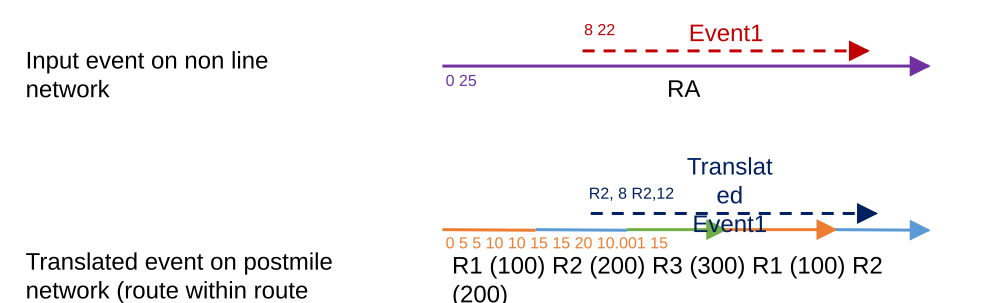

# Translate Events: Support translation of an event to a network with Postmile routes within routes

| Field | Value |
| --- | --- |
| **Doc** | 831 · User Story · Pro |
| **Product** | Roads & Highways |
| **Release** | — |
| **Issues** | [ArcGISPro/ps-location-referencing#1958](https://devtopia.esri.com/ArcGISPro/ps-location-referencing/issues/1958) · [ArcGISPro/ps-location-referencing#2256](https://devtopia.esri.com/ArcGISPro/ps-location-referencing/issues/2256) |
| **Source** | [TranslatePostmileRoutewithinRoute.pptx](<https://esriis.sharepoint.com/sites/LocationReferencing/Shared%20Documents/General/TranslatePostmileRoutewithinRoute.pptx>) |
| **People** | author William Isley · PE — · dev — |
| **Edited** | 2020-03-10 19:10 by Nathan Easley |
| **Extracted** | 2026-09-04 · lane xmlstrip · format 3.0 · prompt v2.0.2 |
| **Keywords** | postmile · route within route · event translation · non line network · measures · shapes |
| **Tools** | Translate Events GP tool |

## Summary

This user story describes the need to translate events from a non line network to a postmile network in scenarios where there is a route within route configuration. It specifies the expected behavior for correct route IDs, measures, dates, and shapes during translation. Testing scenarios include verifying translations with and without gaps and with complex route within route cases.

## Related documents

<!-- related:begin -->
- [Overlay Events: Support overlay of an event against a Postmile network with routes within routes](<https://esriis.sharepoint.com/sites/lrsworkspace/LRS Doc Index/User Stories/1453-overlay-events-support-overlay-of-an-event-against.md>) — similar text 0.61 · 6 title words · 3 filename words · same kind/surface/folder <!-- rel:832 s=9.075 -->
- [Support Complex Route Shapes in Translate Events GP tool](<https://esriis.sharepoint.com/sites/lrsworkspace/LRS Doc Index/User Stories/support-complex-route-shapes-in-translate-events-gp.md>) — similar text 0.29 · 3 title words · 2 filename words · same kind/surface/folder <!-- rel:798 s=6.256 -->
- [Support Vertical Route Segments in Translate Events GP Tool](<https://esriis.sharepoint.com/sites/lrsworkspace/LRS Doc Index/User Stories/support-vertical-route-segments-in-translate-events-gp.md>) — similar text 0.35 · 3 title words · 1 filename word · same kind/surface/folder <!-- rel:767 s=5.089 -->
- [Support Complex Route Shapes in Overlay Events GP tool](<https://esriis.sharepoint.com/sites/lrsworkspace/LRS Doc Index/User Stories/support-complex-route-shapes-in-overlay-events-gp.md>) — similar text 0.18 · 2 title words · 1 filename word · same kind/surface/folder <!-- rel:799 s=3.517 -->
- [Support Complex Route Shapes in Generate Routes](<https://esriis.sharepoint.com/sites/lrsworkspace/LRS Doc Index/User Stories/support-complex-route-shapes-in-generate-routes.md>) — similar text 0.15 · 2 title words · 1 filename word · same kind/surface/folder <!-- rel:849 s=3.448 -->
<!-- related:end -->

<!-- docs:begin -->
## Esri documentation

[Methods for calibrating routes with physical gaps](https://doc.esri.com/en/arcgis-pro/latest/help/production/roads-highways/methods-for-calibrating-routes-with-physical-gaps.html) · [Split a centerline by measure](https://doc.esri.com/en/arcgis-pro/latest/help/production/roads-highways/split-a-centerline-by-measure.html) · [Complex shapes](https://doc.esri.com/en/arcgis-pro/latest/help/production/roads-highways/complex-shapes.html)

_No page matched:_ [Translate Events GP tool](https://www.google.com/search?q=%22Translate%20Events%20GP%20tool%22+site%3Adoc.esri.com)
<!-- docs:end -->

---

## Story
### Translate Events: Support translation of an event to a network with Postmile routes within routes <!-- slide 1 -->
User Story

### User Story <!-- slide 2 -->
As a Roads and Highways user at Caltrans, I need to be able to translate events from a non line network to the postmile network where there is a route within route scenario so that the measures and shapes are correct and accurate.

## Acceptance Criteria
### Route with Route in Translate Events <!-- slide 3 -->
- In the translate events GP tool, translating from a non line network to a postmile network with a route within route scenario needs to be supported (When translating to postmile with different from and to routeIDs is already supported).
- When an event is translated from a non line network to a postmile network and the from and to routeIDs would be the same route, with at least one other route between the two parts of the from/to route, the following should occur:
  - The correct From RouteID, To RouteID, From Measure, To Measure, and From/To Dates should be applied to the translated record
  - The correct shape should be built, which begins/ends at the correct locations on the route, with the shape encompassing the entire path between those two points on the postmile line
R1 (100)  R2 (200)  R3 (300)   R1 (100)    R2 (200)
0                  5  5                 10  10                15  15                  20   10.001        15
Input event on non line network

Translated event on postmile network (route within route scenario)

[figure: RA · 0 25 · Event1 · 8 22 · Translated Event1 · R2, 8 R2,12]

## Testing
<!-- slide 4 -->
- Verify the previous test cases from https://devtopia.esri.com/ArcGISPro/ps-location-referencing/issues/1958 and https://devtopia.esri.com/ArcGISPro/ps-location-referencing/issues/2256 still work
- Test the following scenarios:
  - Translated From/To RouteIDs are on the same route without any gaps
  - Translated From/To RouteIDs are on the same route with a physical gap (without any routes filling the gap)
  - Translated From/To RouteIDs are on the same route with a route within route scenario (at least one other route on the same line between the From/To locations)
  - Translated From/To RouteIDs are on the same route with a route within route scenario, but the route between the From/To locations in on a different line (edge case that might not exist in the Caltrans data)

## Assignment
<!-- slide 5 -->
Story Points:
Dev:
PE:
