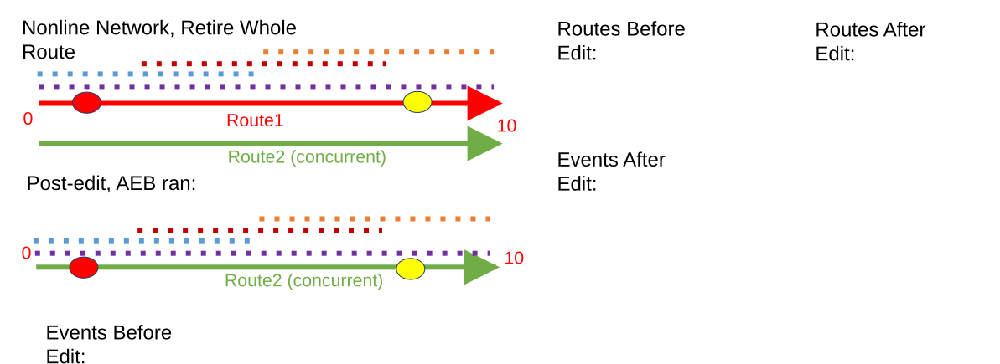
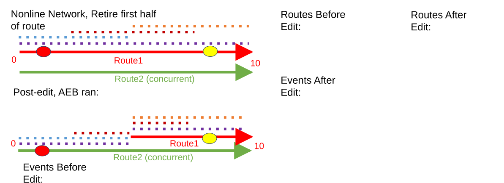
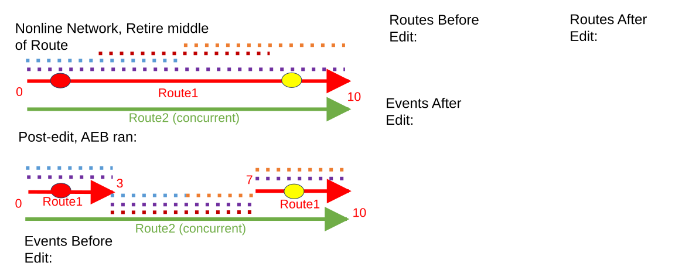
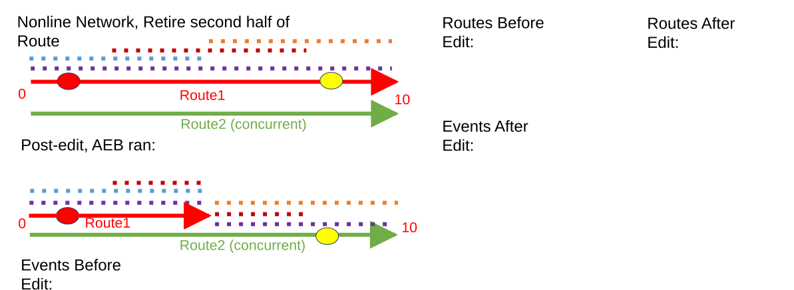
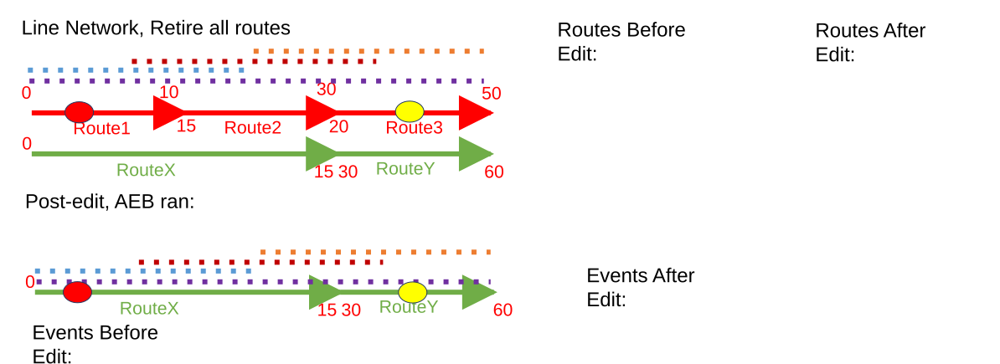
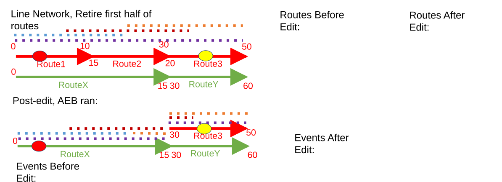
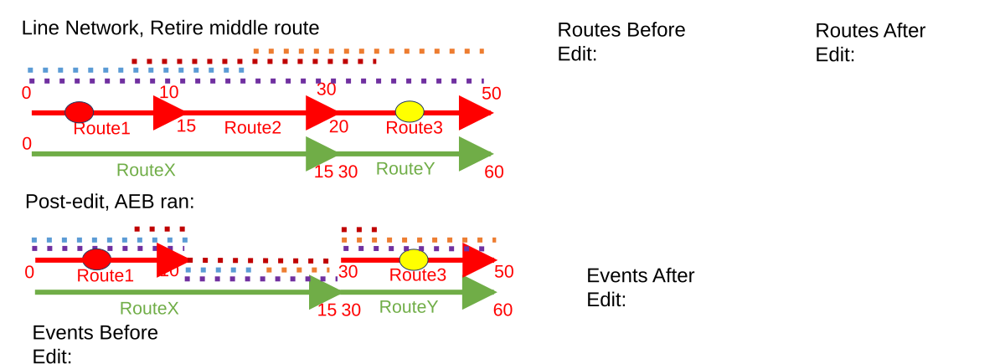
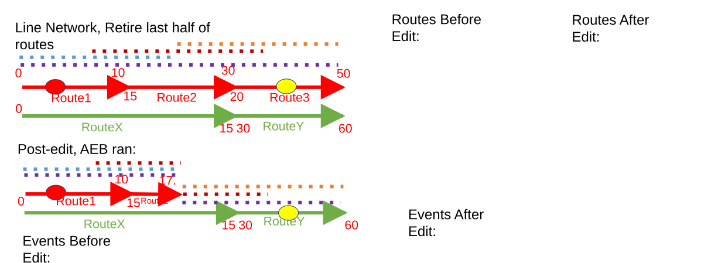
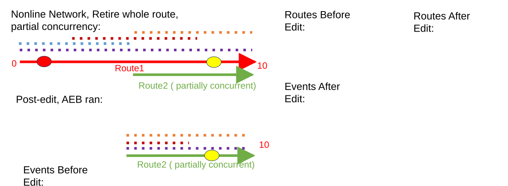

# Support Snap Event Behavior in Retire Routes

| Field | Value |
| --- | --- |
| **Doc** | 479 · User Story · Experience Builder |
| **Product** | Roads & Highways · Pipeline Referencing |
| **Release** | — |
| **Issues** | [ArcGISPro/ps-location-referencing#3780](https://devtopia.esri.com/ArcGISPro/ps-location-referencing/issues/3780) |
| **Source** | [3780-SupportSnapEBinRetireRoute_V4.pptx](<https://esriis.sharepoint.com/sites/LocationReferencing/Shared%20Documents/General/3780-SupportSnapEBinRetireRoute_V4.pptx>) · rev V4 |
| **People** | author Mac Christmas · PE — · dev — |
| **Edited** | 2023-10-24 20:15 by Rahul Rakshit |
| **Extracted** | 2026-09-04 · lane xmlstrip · format 3.0 · prompt v2.0.2 |
| **Keywords** | snap event behavior · retire route · event snapping · concurrent route · stay put · line event · route retirement · event behavior |
| **Tools** | — |

## Summary

User story describing the need for Snap Event Behavior (Snap EB) in the Retire Routes functionality to allow events to snap to concurrent or abandoned routes when retiring a route. Includes acceptance criteria, example route and event data tables, and diagrams illustrating event snapping behavior for various retire scenarios in both line and nonline networks. Also covers testing, automation, and documentation plans for this feature.

## Related documents

<!-- related:begin -->
- [Support Snap Event Behavior in Retire Routes](<https://esriis.sharepoint.com/sites/lrsworkspace/LRS Doc Index/User Stories/3780-support-snap-eb-in-retire-routes-rh-apr-v5.md>) — shared issue ArcGISPro/ps-location-referencing#3780 · similar text 0.94 · 6 title words · 5 filename words · same kind/surface/folder <!-- rel:478 s=1011.437 -->
- [Retire Routes: Snap Event Behavior Test Plan](<https://esriis.sharepoint.com/sites/lrsworkspace/LRS Doc Index/Test Plans/3780-retire-routes-snap-eb.md>) — shared issue ArcGISPro/ps-location-referencing#3780 · similar text 0.72 · 5 title words · 2 filename words · same surface <!-- rel:454 s=1007.164 -->
- [Support Snap Event Behavior in Realign Route](<https://esriis.sharepoint.com/sites/lrsworkspace/LRS Doc Index/User Stories/support-snap-eb-in-realign-route.md>) — similar text 0.13 · 4 title words · 3 filename words · same kind/folder <!-- rel:730 s=5.655 -->
- [Support Event Behaviors for New Reassign Method: Transfer to another line](<https://esriis.sharepoint.com/sites/lrsworkspace/LRS Doc Index/User Stories/support-eb-for-new-reassign-method-transfer-to-another-line.md>) — similar text 0.13 · 2 title words · same kind/surface/folder <!-- rel:572 s=3.666 -->
- [Cover Event Behavior in Realign Route with Concurrencies](<https://esriis.sharepoint.com/sites/lrsworkspace/LRS Doc Index/User Stories/cover-eb-in-realign-route-with-concurrencies.md>) — similar text 0.11 · 2 title words · 1 filename word · same kind/folder <!-- rel:715 s=3.633 -->
<!-- related:end -->

<!-- docs:begin -->
## Esri documentation

[Retire routes](https://doc.esri.com/en/arcgis-pro/latest/help/production/roads-highways/retire-routes.html) · [Event behavior](https://doc.esri.com/en/arcgis-pro/latest/help/production/roads-highways/what-is-event-behavior.html)
<!-- docs:end -->

---

## Story
### Support Snap Event Behavior in Retire Routes <!-- slide 1 -->
User Story

### User Story <!-- slide 2 -->
As an LRS Editor, I need the ability for my events to snap to a concurrent or abandoned route when I retire a route, so that I don’t have to recreate the event characteristics in the area manually.
Persona
LRS Editor: This user is responsible for making edits to the LRS.  The edits they need to make come in from field crews/contractors in a variety of formats (shapefiles, engineering drawings, FGDBs, etc.).  The LRS Editor, moving into ArcGIS Pro, expects the Snap EB to be present for Retire Routes to ensure events snap to concurrent routes when retiring and they may be holding off migrating to Pro for this reason.

## Acceptance Criteria
<!-- slide 3 -->
- Need to add Snap event behavior to Retire Routes, following ArcMap functionality
  - Snap maintains geographic location, but updates measures
  - Events will snap to a concurrent route when a concurrent route exists
  - If no concurrent route exists, then the events will perform Stay Put
    - Line events that cross a retirement section of parent route will be split
  - Upstream events will have no action
  - Downstream events, when recalibrate downstream is checked, will honor whatever event behavior is configured for calibrate downstream
    - When recalibrate downstream is not checked, the downstream events will have no change

### Nonline Network, Retire Whole Route <!-- slide 4 -->
| RouteID | FromDate | ToDate |
| --- | --- | --- |
| Route1 | 1/1/2000 | NULL |
| Route2 | 1/1/2000 | NULL |

| RouteID | FromDate | ToDate |
| --- | --- | --- |
| Route1 | 1/1/2000 | 1/1/2005 |
| Route2 | 1/1/2000 | NULL |

| Event Layer | EventID | RouteID | From Date | To Date | From Measure | To Measure |
| --- | --- | --- | --- | --- | --- | --- |
| Point | Pt1 | Route1 | 1/1/2000 | NULL | 2 | N/A |
| Point | Pt2 | Route1 | 1/1/2000 | NULL | 8 | N/A |
| Line | Line1 | Route1 | 1/1/2000 | NULL | 0 | 10 |
| Line | Line2 | Route1 | 1/1/2000 | NULL | 0 | 5 |
| Line | Line3 | Route1 | 1/1/2000 | NULL | 3 | 7 |
| Line | Line4 | Route1 | 1/1/2000 | NULL | 5 | 10 |

| Event Layer | EventID | RouteID | From Date | To Date | From Measure | To Measure |
| --- | --- | --- | --- | --- | --- | --- |
| Point | Pt1 | Route1 | 1/1/2000 | 1/1/2005 | 2 | N/A |
| Point | Pt2 | Route1 | 1/1/2000 | 1/1/2005 | 8 | N/A |
| Line | Line1 | Route1 | 1/1/2000 | 1/1/2005 | 0 | 10 |
| Line | Line2 | Route1 | 1/1/2000 | 1/1/2005 | 0 | 5 |
| Line | Line3 | Route1 | 1/1/2000 | 1/1/2005 | 3 | 7 |
| Line | Line4 | Route1 | 1/1/2000 | 1/1/2005 | 5 | 10 |
| Point | Pt1 | Route2 | 1/1/2005 | NULL | 2 | N/A |
| Point | Pt2 | Route2 | 1/1/2005 | NULL | 8 | N/A |
| Line | Line1 | Route2 | 1/1/2005 | NULL | 0 | 10 |
| Line | Line2 | Route2 | 1/1/2005 | NULL | 0 | 5 |
| Line | Line3 | Route2 | 1/1/2005 | NULL | 3 | 7 |
| Line | Line4 | Route2 | 1/1/2005 | NULL | 5 | 10 |

[figure: Routes Before Edit: · Routes After Edit: · Events Before Edit: · Events After Edit: · Route1 · Route2 (concurrent) · Post-edit, AEB ran: · 0 · 10]

### Nonline Network, Retire first half of route <!-- slide 5 -->
| RouteID | FromDate | ToDate |
| --- | --- | --- |
| Route1 | 1/1/2000 | NULL |
| Route2 | 1/1/2000 | NULL |

| RouteID | FromDate | ToDate |
| --- | --- | --- |
| Route1 | 1/1/2000 | 1/1/2005 |
| Route2 | 1/1/2000 | NULL |

| Event Layer | EventID | RouteID | From Date | To Date | From Measure | To Measure |
| --- | --- | --- | --- | --- | --- | --- |
| Point | Pt1 | Route1 | 1/1/2000 | NULL | 2 | N/A |
| Point | Pt2 | Route1 | 1/1/2000 | NULL | 8 | N/A |
| Line | Line1 | Route1 | 1/1/2000 | NULL | 0 | 10 |
| Line | Line2 | Route1 | 1/1/2000 | NULL | 0 | 5 |
| Line | Line3 | Route1 | 1/1/2000 | NULL | 3 | 7 |
| Line | Line4 | Route1 | 1/1/2000 | NULL | 5 | 10 |

| Event Layer | EventID | RouteID | From Date | To Date | From Measure | To Measure |
| --- | --- | --- | --- | --- | --- | --- |
| Point | Pt1 | Route1 | 1/1/2000 | 1/1/2005 | 2 | N/A |
| Point | Pt2 | Route1 | 1/1/2000 | 1/1/2005 | 8 | N/A |
| Line | Line1 | Route1 | 1/1/2000 | 1/1/2005 | 0 | 10 |
| Line | Line2 | Route1 | 1/1/2000 | 1/1/2005 | 0 | 5 |
| Line | Line3 | Route1 | 1/1/2000 | 1/1/2005 | 3 | 7 |
| Line | Line4 | Route1 | 1/1/2000 | 1/1/2005 | 5 | 10 |
| Point | Pt1 | Route2 | 1/1/2005 | NULL | 2 | N/A |
| Point | Pt2 | Route1 | 1/1/2005 | NULL | 8 | N/A |
| Line | Line1 | Route2 | 1/1/2005 | NULL | 0 | 5 |
| Line | Line1 | Route1 | 1/1/2005 | NULL | 5 | 10 |
| Line | Line2 | Route2 | 1/1/2005 | NULL | 0 | 5 |
| Line | Line3 | Route2 | 1/1/2005 | NULL | 3 | 5 |
| Line | Line3 | Route1 | 1/1/2005 | NULL | 5 | 7 |
| Line | Line4 | Route1 | 1/1/2005 | NULL | 5 | 10 |

[figure: Routes Before Edit: · Routes After Edit: · Events Before Edit: · Events After Edit: · Route1 · Route2 (concurrent) · Post-edit, AEB ran: · 0 · 10]

### Nonline Network, Retire middle of Route <!-- slide 6 -->
| RouteID | FromDate | ToDate |
| --- | --- | --- |
| Route1 | 1/1/2000 | NULL |
| Route2 | 1/1/2000 | NULL |

| RouteID | FromDate | ToDate |
| --- | --- | --- |
| Route1 | 1/1/2000 | 1/1/2005 |
| Route2 | 1/1/2000 | NULL |

| Event Layer | EventID | RouteID | From Date | To Date | From Measure | To Measure |
| --- | --- | --- | --- | --- | --- | --- |
| Point | Pt1 | Route1 | 1/1/2000 | NULL | 2 | N/A |
| Point | Pt2 | Route1 | 1/1/2000 | NULL | 8 | N/A |
| Line | Line1 | Route1 | 1/1/2000 | NULL | 0 | 10 |
| Line | Line2 | Route1 | 1/1/2000 | NULL | 0 | 5 |
| Line | Line3 | Route1 | 1/1/2000 | NULL | 3 | 7 |
| Line | Line4 | Route1 | 1/1/2000 | NULL | 5 | 10 |

| Event Layer | EventID | RouteID | From Date | To Date | From Measure | To Measure |
| --- | --- | --- | --- | --- | --- | --- |
| Point | Pt1 | Route1 | 1/1/2000 | 1/1/2005 | 2 | N/A |
| Point | Pt2 | Route1 | 1/1/2000 | 1/1/2005 | 8 | N/A |
| Line | Line1 | Route1 | 1/1/2000 | 1/1/2005 | 0 | 10 |
| Line | Line2 | Route1 | 1/1/2000 | 1/1/2005 | 0 | 5 |
| Line | Line3 | Route1 | 1/1/2000 | 1/1/2005 | 3 | 7 |
| Line | Line4 | Route1 | 1/1/2000 | 1/1/2005 | 5 | 10 |
| Point | Pt1 | Route1 | 1/1/2005 | NULL | 2 | N/A |
| Point | Pt2 | Route1 | 1/1/2005 | NULL | 8 | N/A |
| Line | Line1 | Route1 | 1/1/2005 | NULL | 0 | 3 |
| Line | Line1 | Route2 | 1/1/2005 | NULL | 3 | 7 |
| Line | Line1 | Route1 | 1/1/2005 | NULL | 7 | 10 |
| Line | Line2 | Route1 | 1/1/2005 | NULL | 0 | 3 |
| Line | Line2 | Route2 | 1/1/2005 | NULL | 3 | 5 |
| Line | Line3 | Route2 | 1/1/2005 | NULL | 3 | 7 |
| Line | Line4 | Route2 | 1/1/2005 | NULL | 5 | 7 |
| Line | Line4 | Route1 | 1/1/2005 | NULL | 7 | 10 |

[figure: Routes Before Edit: · Routes After Edit: · Events Before Edit: · Events After Edit: · Route1 · Route2 (concurrent) · Post-edit, AEB ran: · 0 · 10 · 3 · 7]

### Nonline Network, Retire second half of Route <!-- slide 7 -->
| RouteID | FromDate | ToDate |
| --- | --- | --- |
| Route1 | 1/1/2000 | NULL |
| Route2 | 1/1/2000 | NULL |

| RouteID | FromDate | ToDate |
| --- | --- | --- |
| Route1 | 1/1/2000 | 1/1/2005 |
| Route2 | 1/1/2000 | NULL |

| Event Layer | EventID | RouteID | From Date | To Date | From Measure | To Measure |
| --- | --- | --- | --- | --- | --- | --- |
| Point | Pt1 | Route1 | 1/1/2000 | NULL | 2 | N/A |
| Point | Pt2 | Route1 | 1/1/2000 | NULL | 8 | N/A |
| Line | Line1 | Route1 | 1/1/2000 | NULL | 0 | 10 |
| Line | Line2 | Route1 | 1/1/2000 | NULL | 0 | 5 |
| Line | Line3 | Route1 | 1/1/2000 | NULL | 3 | 7 |
| Line | Line4 | Route1 | 1/1/2000 | NULL | 5 | 10 |

| Event Layer | EventID | RouteID | From Date | To Date | From Measure | To Measure |
| --- | --- | --- | --- | --- | --- | --- |
| Point | Pt1 | Route1 | 1/1/2000 | 1/1/2005 | 2 | N/A |
| Point | Pt2 | Route1 | 1/1/2000 | 1/1/2005 | 8 | N/A |
| Line | Line1 | Route1 | 1/1/2000 | 1/1/2005 | 0 | 10 |
| Line | Line2 | Route1 | 1/1/2000 | 1/1/2005 | 0 | 5 |
| Line | Line3 | Route1 | 1/1/2000 | 1/1/2005 | 3 | 7 |
| Line | Line4 | Route1 | 1/1/2000 | 1/1/2005 | 5 | 10 |
| Point | Pt1 | Route1 | 1/1/2005 | NULL | 2 | N/A |
| Point | Pt2 | Route2 | 1/1/2005 | NULL | 8 | N/A |
| Line | Line1 | Route1 | 1/1/2005 | NULL | 0 | 5 |
| Line | Line1 | Route2 | 1/1/2005 | NULL | 5 | 10 |
| Line | Line2 | Route1 | 1/1/2005 | NULL | 0 | 5 |
| Line | Line3 | Route1 | 1/1/2005 | NULL | 3 | 5 |
| Line | Line3 | Route2 | 1/1/2005 | NULL | 5 | 7 |
| Line | Line4 | Route1 | 1/1/2005 | NULL | 5 | 10 |

[figure: Routes Before Edit: · Routes After Edit: · Events Before Edit: · Events After Edit: · Route1 · Route2 (concurrent) · Post-edit, AEB ran: · 0 · 10]

### Line Network, Retire all routes <!-- slide 8 -->
| Line ID | Route ID | From Date | ToDate |
| --- | --- | --- | --- |
| Line1 | Route1 | 1/1/2000 | NULL |
| Line1 | Route2 | 1/1/2000 | NULL |
| Line1 | Route3 | 1/1/2000 | NULL |
| Line2 | RouteX | 1/1/2000 | NULL |
| Line2 | RouteY | 1/1/2000 | NULL |

| Line ID | RouteID | From Date | ToDate |
| --- | --- | --- | --- |
| Line1 | Route1 | 1/1/2000 | 1/1/2005 |
| Line1 | Route2 | 1/1/2000 | 1/1/2005 |
| Line1 | Route3 | 1/1/2000 | 1/1/2005 |
| Line2 | RouteX | 1/1/2000 | NULL |
| Line2 | RouteY | 1/1/2000 | NULL |

| Event Layer | Event ID | From RouteID | To RouteID | From Date | To Date | From Measure | To Measure |
| --- | --- | --- | --- | --- | --- | --- | --- |
| Point | Pt1 | Route1 | N/A | 1/1/2000 | NULL | 2 | N/A |
| Point | Pt2 | Route3 | N/A | 1/1/2000 | NULL | 40 | N/A |
| Line | Line1 | Route1 | Route3 | 1/1/2000 | NULL | 0 | 50 |
| Line | Line2 | Route1 | Route2 | 1/1/2000 | NULL | 0 | 17.5 |
| Line | Line3 | Route1 | Route3 | 1/1/2000 | NULL | 7 | 30 |
| Line | Line4 | Route2 | Route3 | 1/1/2000 | NULL | 17.5 | 50 |

| Event Layer | Event ID | From RouteID | To RouteID | From Date | To Date | From Measure | To Measure |
| --- | --- | --- | --- | --- | --- | --- | --- |
| Point | Pt1 | Route1 | N/A | 1/1/2000 | 1/1/2005 | 2 | N/A |
| Point | Pt2 | Route3 | N/A | 1/1/2000 | 1/1/2005 | 40 | N/A |
| Line | Line1 | Route1 | Route3 | 1/1/2000 | 1/1/2005 | 0 | 50 |
| Line | Line2 | Route1 | Route2 | 1/1/2000 | 1/1/2005 | 0 | 17.5 |
| Line | Line3 | Route1 | Route3 | 1/1/2000 | 1/1/2005 | 7 | 30 |
| Line | Line4 | Route2 | Route3 | 1/1/2000 | 1/1/2005 | 17.5 | 50 |
| Point | Pt1 | RouteX | N/A | 1/1/2005 | NULL | 2 | N/A |
| Point | Pt2 | RouteY | N/A | 1/1/2005 | NULL | 45 | N/A |
| Line | Line1 | RouteX | RouteY | 1/1/2005 | NULL | 0 | 60 |
| Line | Line2 | RouteX | RouteX | 1/1/2005 | NULL | 0 | 12.5 |
| Line | Line3 | RouteX | RouteY | 1/1/2005 | NULL | 7 | 35 |
| Line | Line4 | RouteX | RouteY | 1/1/2005 | NULL | 12 | 60 |

[figure: Route1 · RouteX · Route2 · Route3 · 0 · 10 · 15 · 30 · 50 · 20 · 60 · RouteY · Post-edit, AEB ran: · Routes Before Edit: · Routes After Edit: · Events Before Edit: · Events After Edit:]

### Line Network, Retire first half of routes <!-- slide 9 -->
| Line ID | Route ID | From Date | ToDate |
| --- | --- | --- | --- |
| Line1 | Route1 | 1/1/2000 | NULL |
| Line1 | Route2 | 1/1/2000 | NULL |
| Line1 | Route3 | 1/1/2000 | NULL |
| Line2 | RouteX | 1/1/2000 | NULL |
| Line2 | RouteY | 1/1/2000 | NULL |

| Line ID | RouteID | From Date | ToDate |
| --- | --- | --- | --- |
| Line1 | Route1 | 1/1/2000 | 1/1/2005 |
| Line1 | Route2 | 1/1/2000 | 1/1/2005 |
| Line1 | Route3 | 1/1/2000 | 1/1/2005 |
| Line1 | Route3 | 1/1/2005 | NULL |
| Line2 | RouteX | 1/1/2000 | NULL |
| Line2 | RouteY | 1/1/2000 | NULL |

| Event Layer | Event ID | From RouteID | To RouteID | From Date | To Date | From Measure | To Measure |
| --- | --- | --- | --- | --- | --- | --- | --- |
| Point | Pt1 | Route1 | N/A | 1/1/2000 | NULL | 2 | N/A |
| Point | Pt2 | Route3 | N/A | 1/1/2000 | NULL | 40 | N/A |
| Line | Line1 | Route1 | Route3 | 1/1/2000 | NULL | 0 | 50 |
| Line | Line2 | Route1 | Route2 | 1/1/2000 | NULL | 0 | 17.5 |
| Line | Line3 | Route1 | Route3 | 1/1/2000 | NULL | 7 | 30 |
| Line | Line4 | Route2 | Route3 | 1/1/2000 | NULL | 17.5 | 50 |

| Event Layer | Event ID | From RouteID | To RouteID | From Date | To Date | From Measure | To Measure |
| --- | --- | --- | --- | --- | --- | --- | --- |
| Point | Pt1 | Route1 | N/A | 1/1/2000 | 1/1/2005 | 2 | N/A |
| Point | Pt2 | Route3 | N/A | 1/1/2000 | 1/1/2005 | 40 | N/A |
| Line | Line1 | Route1 | Route3 | 1/1/2000 | 1/1/2005 | 0 | 50 |
| Line | Line2 | Route1 | Route2 | 1/1/2000 | 1/1/2005 | 0 | 17.5 |
| Line | Line3 | Route1 | Route3 | 1/1/2000 | 1/1/2005 | 7 | 30 |
| Line | Line4 | Route2 | Route3 | 1/1/2000 | 1/1/2005 | 17.5 | 50 |
| Point | Pt1 | RouteX | N/A | 1/1/2005 | NULL | 2 | N/A |
| Point | Pt2 | Route3 | N/A | 1/1/2005 | NULL | 40 | N/A |
| Line | Line1 | RouteX | RouteX | 1/1/2005 | NULL | 0 | 15 |
| Line | Line1 | Route3 | Route3 | 1/1/2005 | NULL | 30 | 50 |
| Line | Line2 | RouteX | RouteX | 1/1/2005 | NULL | 0 | 12.5 |
| Line | Line3 | RouteX | RouteX | 1/1/2005 | NULL | 7 | 15 |
| Line | Line3 | Route3 | Route3 | 1/1/2005 | NULL | 30 | 35 |
| Line | Line4 | RouteX | RouteX | 1/1/2005 | NULL | 12.5 | 15 |
| Line | Line4 | Route3 | Route3 | 1/1/2005 | NULL | 30 | 50 |

[figure: Route1 · RouteX · Route2 · Route3 · 0 · 10 · 15 · 30 · 50 · 20 · 60 · RouteY · Post-edit, AEB ran: · Routes Before Edit: · Routes After Edit: · Events Before Edit: · Events After Edit:]

### Line Network, Retire middle route <!-- slide 10 -->
| Line ID | Route ID | From Date | ToDate |
| --- | --- | --- | --- |
| Line1 | Route1 | 1/1/2000 | NULL |
| Line1 | Route2 | 1/1/2000 | NULL |
| Line1 | Route3 | 1/1/2000 | NULL |
| Line2 | RouteX | 1/1/2000 | NULL |
| Line2 | RouteY | 1/1/2000 | NULL |

| Line ID | RouteID | From Date | ToDate |
| --- | --- | --- | --- |
| Line1 | Route1 | 1/1/2000 | NULL |
| Line1 | Route2 | 1/1/2000 | 1/1/2005 |
| Line1 | Route3 | 1/1/2000 | 1/1/2005 |
| Line1 | Route3 | 1/1/2005 | NULL |
| Line2 | RouteX | 1/1/2000 | NULL |
| Line2 | RouteY | 1/1/2000 | NULL |

| Event Layer | Event ID | From RouteID | To RouteID | From Date | To Date | From Measure | To Measure |
| --- | --- | --- | --- | --- | --- | --- | --- |
| Point | Pt1 | Route1 | N/A | 1/1/2000 | NULL | 2 | N/A |
| Point | Pt2 | Route3 | N/A | 1/1/2000 | NULL | 40 | N/A |
| Line | Line1 | Route1 | Route3 | 1/1/2000 | NULL | 0 | 50 |
| Line | Line2 | Route1 | Route2 | 1/1/2000 | NULL | 0 | 17.5 |
| Line | Line3 | Route1 | Route3 | 1/1/2000 | NULL | 7 | 30 |
| Line | Line4 | Route2 | Route3 | 1/1/2000 | NULL | 17.5 | 50 |

| Event Layer | Event ID | From RouteID | To RouteID | From Date | To Date | From Measure | To Measure |
| --- | --- | --- | --- | --- | --- | --- | --- |
| Point | Pt1 | Route1 | N/A | 1/1/2000 | NULL | 2 | N/A |
| Point | Pt2 | Route3 | N/A | 1/1/2000 | 1/1/2005 | 40 | N/A |
| Line | Line1 | Route1 | Route3 | 1/1/2000 | 1/1/2005 | 0 | 50 |
| Line | Line2 | Route1 | Route2 | 1/1/2000 | 1/1/2005 | 0 | 17.5 |
| Line | Line3 | Route1 | Route3 | 1/1/2000 | 1/1/2005 | 7 | 30 |
| Line | Line4 | Route2 | Route3 | 1/1/2000 | 1/1/2005 | 17.5 | 50 |
| Point | Pt2 | Route2 | N/A | 1/1/2005 | NULL | 45 | N/A |
| Line | Line1 | Route1 | Route1 | 1/1/2005 | NULL | 0 | 10 |
| Line | Line1 | RouteX | RouteX | 1/1/2005 | NULL | 10 | 15 |
| Line | Line1 | Route3 | Route3 | 1/1/2005 | NULL | 30 | 50 |
| Line | Line2 | Route1 | Route1 | 1/1/2005 | NULL | 0 | 10 |
| Line | Line2 | RouteX | RouteX | 1/1/2005 | NULL | 10 | 12.5 |
| Line | Line3 | Route1 | Route1 | 1/1/2005 | NULL | 7 | 10 |
| Line | Line3 | RouteX | RouteX | 1/1/2005 | NULL | 10 | 15 |
| Line | Line3 | Route3 | Route3 | 1/1/2005 | NULL | 30 | 35 |
| Line | Line4 | RouteX | RouteX | 1/1/2005 | NULL | 12.5 | 15 |
| Line | Line4 | Route3 | Route3 | 1/1/2005 | NULL | 30 | 60 |

[figure: Route1 · RouteX · Route2 · Route3 · 0 · 10 · 15 · 30 · 50 · 20 · 60 · RouteY · Post-edit, AEB ran: · Routes Before Edit: · Routes After Edit: · Events Before Edit: · Events After Edit:]

### Line Network, Retire last half of routes <!-- slide 11 -->
| Line ID | Route ID | From Date | ToDate |
| --- | --- | --- | --- |
| Line1 | Route1 | 1/1/2000 | NULL |
| Line1 | Route2 | 1/1/2000 | NULL |
| Line1 | Route3 | 1/1/2000 | NULL |
| Line2 | RouteX | 1/1/2000 | NULL |
| Line2 | RouteY | 1/1/2000 | NULL |

| Line ID | RouteID | From Date | ToDate |
| --- | --- | --- | --- |
| Line1 | Route1 | 1/1/2000 | 1/1/2005 |
| Line1 | Route2 | 1/1/2000 | 1/1/2005 |
| Line1 | Route3 | 1/1/2000 | 1/1/2005 |
| Line1 | Route1 | 1/1/2000 | NULL |
| Line1 | Route2 | 1/1/2000 | NULL |
| Line2 | RouteX | 1/1/2000 | NULL |
| Line2 | RouteY | 1/1/2000 | NULL |

| Event Layer | Event ID | From RouteID | To RouteID | From Date | To Date | From Measure | To Measure |
| --- | --- | --- | --- | --- | --- | --- | --- |
| Point | Pt1 | Route1 | N/A | 1/1/2000 | NULL | 2 | N/A |
| Point | Pt2 | Route3 | N/A | 1/1/2000 | NULL | 40 | N/A |
| Line | Line1 | Route1 | Route3 | 1/1/2000 | NULL | 0 | 50 |
| Line | Line2 | Route1 | Route2 | 1/1/2000 | NULL | 0 | 17.5 |
| Line | Line3 | Route1 | Route3 | 1/1/2000 | NULL | 7 | 30 |
| Line | Line4 | Route2 | Route3 | 1/1/2000 | NULL | 17.5 | 50 |

| Event Layer | Event ID | From RouteID | To RouteID | From Date | To Date | From Measure | To Measure |
| --- | --- | --- | --- | --- | --- | --- | --- |
| Point | Pt1 | Route1 | N/A | 1/1/2000 | 1/1/2005 | 2 | N/A |
| Point | Pt2 | Route3 | N/A | 1/1/2000 | 1/1/2005 | 40 | N/A |
| Line | Line1 | Route1 | Route3 | 1/1/2000 | 1/1/2005 | 0 | 50 |
| Line | Line2 | Route1 | Route2 | 1/1/2000 | 1/1/2005 | 0 | 17.5 |
| Line | Line3 | Route1 | Route3 | 1/1/2000 | 1/1/2005 | 7 | 30 |
| Line | Line4 | Route2 | Route3 | 1/1/2000 | 1/1/2005 | 17.5 | 50 |
| Point | Pt1 | Route1 | N/A | 1/1/2005 | NULL | 2 | N/A |
| Point | Pt2 | RouteY | N/A | 1/1/2005 | NULL | 45 | N/A |
| Line | Line1 | Route1 | Route2 | 1/1/2005 | NULL | 0 | 17.5 |
| Line | Line1 | RouteX | RouteY | 1/1/2005 | NULL | 12 | 60 |
| Line | Line2 | Route1 | Route2 | 1/1/2005 | NULL | 0 | 17.5 |
| Line | Line3 | Route1 | Route2 | 1/1/2005 | NULL | 7 | 17.5 |
| Line | Line3 | RouteX | RouteY | 1/1/2005 | NULL | 12.5 | 35 |
| Line | Line4 | RouteX | RouteY | 1/1/2005 | NULL | 12.5 | 60 |

[figure: Route1 · RouteX · Route2 · Route3 · 0 · 10 · 15 · 30 · 50 · 20 · 60 · RouteY · Post-edit, AEB ran: · Routes Before Edit: · Routes After Edit: · Events Before Edit: · Events After Edit: · 17.5]

### Nonline Network, Retire whole route, partial concurrency: <!-- slide 12 -->
| RouteID | FromDate | ToDate |
| --- | --- | --- |
| Route1 | 1/1/2000 | NULL |
| Route2 | 1/1/2000 | NULL |

| RouteID | FromDate | ToDate |
| --- | --- | --- |
| Route1 | 1/1/2000 | 1/1/2005 |
| Route2 | 1/1/2000 | NULL |

Route2 ( partially concurrent)

| Event Layer | EventID | RouteID | From Date | To Date | From Measure | To Measure |
| --- | --- | --- | --- | --- | --- | --- |
| Point | Pt1 | Route1 | 1/1/2000 | NULL | 2 | N/A |
| Point | Pt2 | Route1 | 1/1/2000 | NULL | 8 | N/A |
| Line | Line1 | Route1 | 1/1/2000 | NULL | 0 | 10 |
| Line | Line2 | Route1 | 1/1/2000 | NULL | 0 | 5 |
| Line | Line3 | Route1 | 1/1/2000 | NULL | 3 | 7 |
| Line | Line4 | Route1 | 1/1/2000 | NULL | 5 | 10 |

| Event Layer | EventID | RouteID | From Date | To Date | From Measure | To Measure |
| --- | --- | --- | --- | --- | --- | --- |
| Point | Pt1 | Route1 | 1/1/2000 | 1/1/2005 | 2 | N/A |
| Point | Pt2 | Route1 | 1/1/2000 | 1/1/2005 | 8 | N/A |
| Line | Line1 | Route1 | 1/1/2000 | 1/1/2005 | 0 | 10 |
| Line | Line2 | Route1 | 1/1/2000 | 1/1/2005 | 0 | 5 |
| Line | Line3 | Route1 | 1/1/2000 | 1/1/2005 | 3 | 7 |
| Line | Line4 | Route1 | 1/1/2000 | 1/1/2005 | 5 | 10 |
| Point | Pt2 | Route2 | 1/1/2005 | NULL | 8 | N/A |
| Line | Line1 | Route2 | 1/1/2005 | NULL | 5 | 10 |
| Line | Line3 | Route2 | 1/1/2005 | NULL | 5 | 7 |
| Line | Line4 | Route2 | 1/1/2005 | NULL | 5 | 10 |

Route2 ( partially concurrent)

[figure: Post-edit, AEB ran: · 10 · Routes Before Edit: · Routes After Edit: · Events After Edit: · Events Before Edit: · Route1 · 0]

## Testing
<!-- slide 13 -->
- Test with RH and APR datasets
- Test in FGDB, EGDB, and FS
- Retire whole, partial, middle, and multiple routes with events that have Snap EB configured
  - The events will Snap or Stay Put dependent on whether a concurrent route is found
- Test with multiple concurrent routes to ensure route dominance rules are honored

## Automation
<!-- slide 14 -->
- Create REST automation for Snap EB in Retire Routes

## Documentation
<!-- slide 15 -->
- Update the Event Behavior for Route Retirement doc, adding info for Snap EB in Retire Routes
  - Add graphics, tables, and verbiage
  - See ArcMap doc for info that may help in writing the doc

## Assignment
<!-- slide 16 -->
Story Points:
Dev:
PE:
