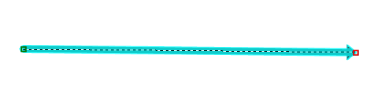

# LRS in GCS: In-memory only Densification

| Field | Value |
| --- | --- |
| **Doc** | 485 · User Story · Pro |
| **Product** | Pipeline Referencing |
| **Release** | — |
| **Issues** | [ArcGISPro/ps-location-referencing#5415](https://devtopia.esri.com/ArcGISPro/ps-location-referencing/issues/5415) |
| **Source** | [5415-LRSinGCSInMemoryOnlyDensify_V2.pptx](<https://esriis.sharepoint.com/sites/LocationReferencing/Shared%20Documents/General/5415-LRSinGCSInMemoryOnlyDensify_V2.pptx>) · rev V2 |
| **People** | author Mac Christmas · PE — · dev — |
| **Edited** | 2023-10-18 18:59 by Mac Christmas |
| **Extracted** | 2026-09-04 · lane xmlstrip · format 3.0 · prompt v2.0.2 |
| **Keywords** | densification · gcs · centerline · route geometry · calibration points · rest endpoints · in memory |
| **Tools** | Create Route · Retire · Realign · Extend · Reassign · Split Centerline by Measure · Add Calibration Points · Edit Calibration Points · Delete Calibration Points · Identify · Update Measures From LRS · Locate Route and Measure · Cartorealignment · geometryToMeasure · measureToGeometry · translate · concurrenecies · applyEdits · queryAttributeSet · deriveEventMeasures |

## Summary

User story describing the need for LRS data in a geographic coordinate system (GCS) to support all LRS operations with sparse vertices by performing densification in-memory only, ensuring that centerline and route geometry match and revert to original state after edits. Includes acceptance criteria, testing scenarios for various LRS tools and REST endpoints, and automation plans for route editing.

## Related documents

<!-- related:begin -->
- [Flip Centerline Tool In-Memory Flip User Story](<https://esriis.sharepoint.com/sites/lrsworkspace/LRS%20Doc%20Index/User%20Stories/4613-flip-centerline-tool-in-memory-flip-rh-apr-un-2023-03-2.md>) — similar text 0.15 · 1 title word · 1 filename word · same kind/surface/folder <!-- rel:602 s=4.048 -->
- [Flip Centerline Tool In-Memory Flip User Story](<https://esriis.sharepoint.com/sites/lrsworkspace/LRS Doc Index/User Stories/4613-flip-centerline-tool-in-memory-flip-rh-apr-un-2023-02.md>) — similar text 0.14 · 1 title word · 1 filename word · same kind/surface/folder <!-- rel:609 s=3.828 -->
- [Regression Testing Task List V1](<https://esriis.sharepoint.com/sites/lrsworkspace/LRS%20Doc%20Index/Test%20Plans/regression-testing-task-list-v1.md>) — similar text 0.12 · same surface <!-- rel:115 s=3.591 -->
- [Flip Centerline Tool In-Memory Flip User Story](<https://esriis.sharepoint.com/sites/lrsworkspace/LRS Doc Index/User Stories/4613-flip-centerline-tool-in-memory-flip-rh-apr-un-2023-03.md>) — similar text 0.16 · 1 title word · 1 filename word · same kind/surface/folder <!-- rel:601 s=3.483 -->
- [Update centerline measures when splitting UN pipelines](<https://esriis.sharepoint.com/sites/lrsworkspace/LRS Doc Index/User Stories/update-centerline-measures-when-splitting-un-pipelines.md>) — similar text 0.18 · same kind/surface/folder <!-- rel:684 s=3.374 -->
<!-- related:end -->

<!-- docs:begin -->
## Esri documentation

[Create a route](https://doc.esri.com/en/arcgis-pro/latest/help/production/location-referencing-pipelines/create-a-new-route.html) · [Retire routes](https://doc.esri.com/en/arcgis-pro/latest/help/production/location-referencing-pipelines/retire-routes.html) · [Realign routes](https://doc.esri.com/en/arcgis-pro/latest/help/production/location-referencing-pipelines/realign-routes.html) · [Extend a route](https://doc.esri.com/en/arcgis-pro/latest/help/production/location-referencing-pipelines/extend-a-route.html) · [Route reassignment](https://doc.esri.com/en/arcgis-pro/latest/help/production/location-referencing-pipelines/reassign-routes.html) · [Split a centerline by measure](https://doc.esri.com/en/arcgis-pro/latest/help/production/location-referencing-pipelines/split-a-centerline-by-measure.html) · [Add calibration points](https://doc.esri.com/en/arcgis-pro/latest/help/production/location-referencing-pipelines/add-calibration-points.html) · [Delete calibration points](https://doc.esri.com/en/arcgis-pro/latest/help/production/location-referencing-pipelines/delete-calibration-points.html) · [Split a centerline by point](https://doc.esri.com/en/arcgis-pro/latest/help/production/location-referencing-pipelines/split-a-centerline.html)

_No page matched:_ [Edit Calibration Points](https://www.google.com/search?q=%22Edit%20Calibration%20Points%22+site%3Adoc.esri.com) · [Identify](https://www.google.com/search?q=%22Identify%22+site%3Adoc.esri.com) · [Update Measures From LRS](https://www.google.com/search?q=%22Update%20Measures%20From%20LRS%22+site%3Adoc.esri.com) · [Locate Route and Measure](https://www.google.com/search?q=%22Locate%20Route%20and%20Measure%22+site%3Adoc.esri.com) · [Cartorealignment](https://www.google.com/search?q=%22Cartorealignment%22+site%3Adoc.esri.com) · [geometryToMeasure](https://www.google.com/search?q=%22geometryToMeasure%22+site%3Adoc.esri.com) · [translate](https://www.google.com/search?q=%22translate%22+site%3Adoc.esri.com) · [concurrenecies](https://www.google.com/search?q=%22concurrenecies%22+site%3Adoc.esri.com) · [applyEdits](https://www.google.com/search?q=%22applyEdits%22+site%3Adoc.esri.com) · [queryAttributeSet](https://www.google.com/search?q=%22queryAttributeSet%22+site%3Adoc.esri.com) · [deriveEventMeasures](https://www.google.com/search?q=%22deriveEventMeasures%22+site%3Adoc.esri.com)
<!-- docs:end -->

---

## Story
### LRS in GCS: In-memory only Densification <!-- slide 1 -->
User Story

### User Story <!-- slide 2 -->
As an LRS Editor, I need the ability for my LRS data in a GCS to work with all LRS operations when the data has sparse vertices that exceed the standard threshold for LRS tools to successfully execute, so that the LRS operations succeed, but the density and location of vertices do not change.
Persona
Persona:
LRS Editor: This user is responsible for making edits to the LRS.  The edits they need to make come in from field crews/contractors in a variety of formats (shapefiles, engineering drawings, FGDBs, etc.).  The LRS Editor is constantly making changes to routes and events with new information, and the current densification of routes with sparse vertices is causing a mismatch between my centerlines and routes.

## Acceptance Criteria
<!-- slide 3 -->
- Based on the GCS fix from last release
  - Verify measures are the same as the 3.2 densification fix
- Densification for LRS calculations will be in-memory only
  - After the edit/calculation is performed, the geometry will revert to pre-analysis/edit state
- Centerline and Route geometry must match
  - Input and output should always match
  - Only time we should be changing centerline/route geometry is when a vertex is added for CPs added on a route

### Before Edit: <!-- slide 4 -->
During Edit (In-memory Densification):
After Edit (Return to original state of only 2 vertices):

## Testing
<!-- slide 5 -->
- Test with APR GCS dataset
- Test scenarios tested in original GCS issue and ensure that all tools work as intended:
  - Create Route (simple, vertical, 3D)
  - Retire
  - Realign
  - Extend
  - Reassign
  - Split Centerline by Measure
  - Add, Edit, Delete Calibration Points
  - Identify
  - Update Measures from LRS
  - Locate Route and Measure
  - Cartorealignment
  - REST:
    - geometryToMeasure
    - measureToGeometry
    - translate
    - concurrenecies
    - applyEdits
    - queryAttributeSet
    - deriveEventMeasures
- After running tools, make sure that centerline and route geometry match

## Automation
<!-- slide 6 -->
- Add automation for GCS dataset
  - REST automate all route editing and key REST endpoints that were not working in the past before GCS fix

## Documentation
<!-- slide 7 -->
- No updates needed

## Assignment
<!-- slide 8 -->
Story Points:
Dev:
PE:
