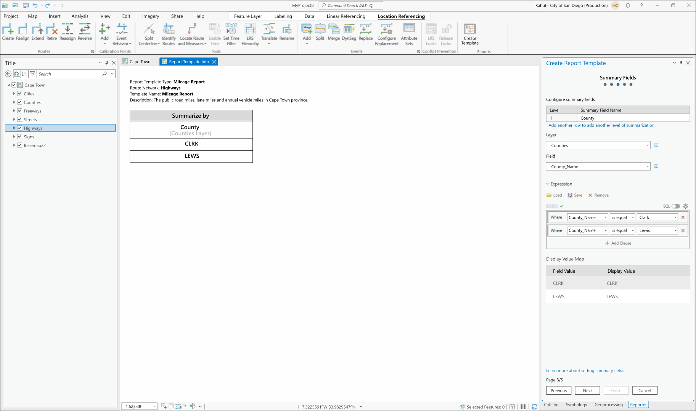
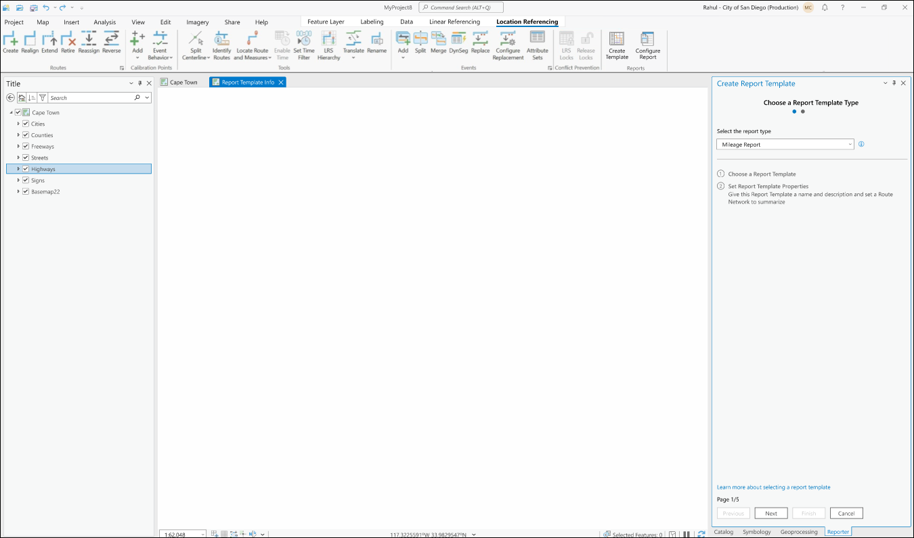
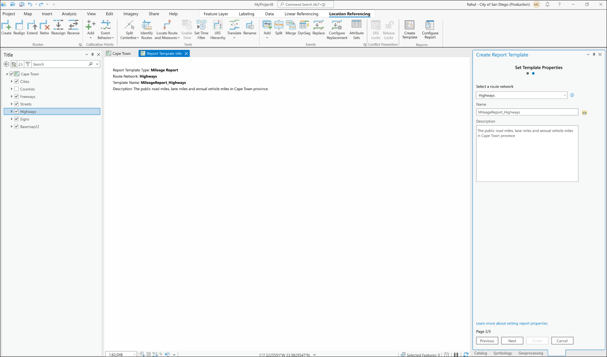

# LR Reporting Canvas Experience User Story

| Field | Value |
| --- | --- |
| **Doc** | 367 · User Story · Pro |
| **Product** | — |
| **Release** | — |
| **Issues** | [ArcGISPro/ps-location-referencing#5797](https://devtopia.esri.com/ArcGISPro/ps-location-referencing/issues/5797) |
| **Source** | [Report_Canvas1.pptx](<https://esriis.sharepoint.com/sites/LocationReferencing/Shared%20Documents/General/Report_Canvas1.pptx>) |
| **People** | author Rahul Rakshit · PE — · dev — |
| **Edited** | 2024-05-22 15:20 by Rahul Rakshit |
| **Extracted** | 2026-09-04 · lane xmlstrip · format 3.0 · prompt v2.0.2 |
| **Keywords** | report template · canvas · create template wizard · gis analyst · mileage summary |
| **Tools** | Generate Report |

## Summary

This document describes a user story for developing a reusable canvas experience in ArcGIS Pro to create report templates for the Generate Report geoprocessing tool. It details the workflow for GIS Analysts to open a blank canvas via the Create Template wizard, update canvas contents based on wizard inputs, and the canvas behavior including its connection to the active map and non-persistence to the project. Testing considerations include theme support and accessibility compliance.

## Related documents

<!-- related:begin -->
- [LR Data Products: Support multiple summary fields](<https://esriis.sharepoint.com/sites/lrsworkspace/LRS Doc Index/User Stories/lr-data-products-support-multiple-summary-fields.md>) — similar text 0.46 · 2 filename words · same kind/surface/folder <!-- rel:356 s=4.632 -->
- [LR Reporting: Create a template tool User Story](<https://esriis.sharepoint.com/sites/lrsworkspace/LRS Doc Index/User Stories/lr-reporting-create-a-template-tool.md>) — similar text 0.32 · 1 title word · 1 filename word · same kind/surface/folder <!-- rel:374 s=4.56 -->
- [User Story for LRS Data Product Template with Length Range Values](<https://esriis.sharepoint.com/sites/lrsworkspace/LRS Doc Index/User Stories/for-lrs-data-product-template-with-length-range-values.md>) — similar text 0.41 · 2 filename words · same kind/surface/folder <!-- rel:343 s=4.026 -->
- [User Story for LRS Data Product Template with Multiple Length Fields](<https://esriis.sharepoint.com/sites/lrsworkspace/LRS Doc Index/User Stories/for-lrs-data-product-template-with-multiple-length-fields.md>) — similar text 0.39 · 2 filename words · same kind/surface/folder <!-- rel:342 s=3.969 -->
- [Generate LRS Data Product Support Summary and Length](<https://esriis.sharepoint.com/sites/lrsworkspace/LRS Doc Index/User Stories/generate-lrs-data-product-support-summary-and-length.md>) — similar text 0.27 · same kind/surface/folder <!-- rel:357 s=2.798 -->
<!-- related:end -->

<!-- docs:begin -->
## Esri documentation

_No page matched:_ [Generate Report](https://www.google.com/search?q=%22Generate%20Report%22+site%3Adoc.esri.com)
<!-- docs:end -->

---

## Slide 1 — LR Reporting: Develop a canvas experience

We have a design for a canvas to demonstrate how the report fields shape up when the template is built.

## Slide 2 — LR Reporting: Develop a canvas experience

User Story
As a GIS Analyst, I need the ability to create a reusable report template that can be used by the Generate Report geoprocessing tool. It’d be very helpful if I can view how the mileage and summary fields are shaping up when creating the report template.
Persona
GIS Analyst: These users know how to work with ArcGIS Pro. They will design a reusable report template based on an existing paper or digital report. Their duty will be to ensure that the report's constituents closely mirror those of its predecessors.
They may also create a new templates as needed by their agency.
Workflow

- The user opens the Create Template wizard
- A blank canvas opens in the main pane of ArcGIS Pro
style.visibilitystyle.visibility

## Slide 3 — User Story: Details

Reference: Spike: https://devtopia.esri.com/ArcGISPro/ps-location-referencing/issues/5797
1. Open a blank canvas when the Create Template wizard is invoked. This is the initial state of the canvas.

## Slide 4 — User Story: Details

2. Update the contents of the canvas as per the inputs provided in the wizard. Update applied when the focus is lost from a parameter.
Limit to page 2 of the wizard for this user story.

## Slide 5 — User Story: Details

- The canvas should be reusable.
- The canvas is connected to the active map and the wizard, if any one of them closes, so does the pane.
- The canvas is not saved to the project. If the user wants to open it later, they can open the Report. Template Json to open the canvas.
- The canvas does not persist to the CIM.
- Both canvas and dock pane Wizard can be displayed with a single button (Create Template).
- Reuse the LR Dock Pane for the wizard and the canvas.
- The contents of the canvas are non editable.

## Slide 6

Testing

- Test with dark and light theme
- 508 and i18n compliance

## Slide 7

Documentation

## Slide 8

Automation
