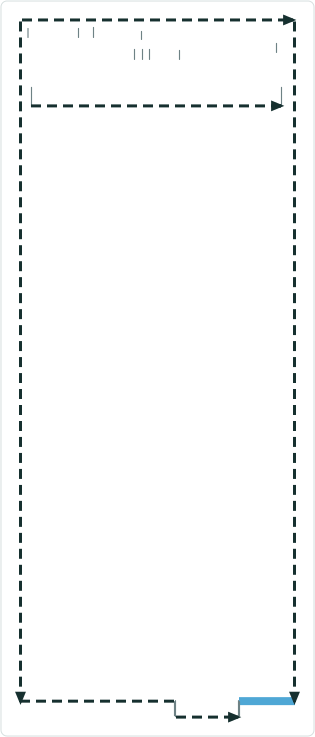
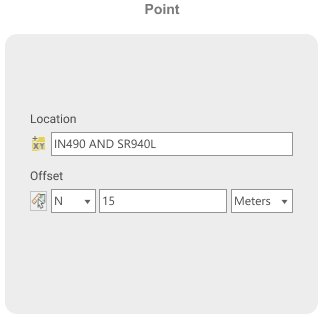
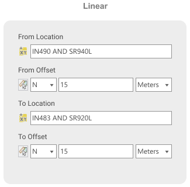

# Add Event Intersection Offset Method

|   |   |
| --- | --- |
| **Kind** | User Story · Pro |
| **Release** | — |
| **Source** | [AddEventIntersectionOffsetMethod.pptx](<https://esriis.sharepoint.com/sites/LocationReferencing/Shared%20Documents/General/AddEventIntersectionOffsetMethod.pptx>) |
| **Edited** | 2022-02-15 19:40 by Nathan Easley |
| **Extracted** | 2026-09-04 · lane `xmlstrip` |

<!-- metadata
```yaml
title: "Add Event Intersection Offset Method"
source_file: "AddEventIntersectionOffsetMethod.pptx"
source_url: "https://esriis.sharepoint.com/sites/LocationReferencing/Shared%20Documents/General/AddEventIntersectionOffsetMethod.pptx"
doc_id: 679
doc_kind: "User Story"
surface: "Pro"
doc_revision: ""
target_release: ""
pe: ""
dev: ""
author: "William Isley"
last_edited_by: "Nathan Easley"
last_edited: "2022-02-15T19:40:10Z"
extracted: 2026-09-04
extraction_lane: xmlstrip
prompt_version: "v2.0.2"
keywords: ["event editing", "intersection offset", "offset", "route", "location", "lrs editor"]
tools: ["Add Point", "Multiple Point", "Line", "Multiple Line"]
products: []
issues: []
related: [{"doc":272,"file":"add-point-event-point-offset-method__doc272.md","s":7.952},{"doc":618,"file":"add-line-event-tools-intersection-location-offset-method-test-plan__doc618.md","s":6.959},{"doc":268,"file":"add-line-events-point-offset-method__doc268.md","s":6.949},{"doc":658,"file":"add-point-event-tools-coordinate-offset-method__doc658.md","s":6.438},{"doc":648,"file":"add-line-event-tools-coordinate-offset-method__doc648.md","s":6.312}]
```
-->

## Summary

This user story describes the need for LRS Editors to add events in ArcGIS Pro using offsets from intersections. It details the user interface changes for adding point and line events with an intersection offset method and outlines testing, automation, and documentation requirements.

## Related documents

<!-- related:begin -->
- [Add Point Event Point Offset Method](<https://esriis.sharepoint.com/sites/lrsworkspace/LRS Doc Index/User Stories/add-point-event-point-offset-method__doc272.md>) — similar text 0.54 · 4 title words · 4 filename words · same kind/surface/folder <!-- rel:272 -->
- [Add Line Event Tools – Intersection Location Offset Method Test Plan](<https://esriis.sharepoint.com/sites/lrsworkspace/LRS Doc Index/Test Plans/add-line-event-tools-intersection-location-offset-method-test-plan__doc618.md>) — similar text 0.18 · 5 title words · 5 filename words <!-- rel:618 -->
- [Add Line Events Point Offset Method](<https://esriis.sharepoint.com/sites/lrsworkspace/LRS Doc Index/User Stories/add-line-events-point-offset-method__doc268.md>) — similar text 0.46 · 3 title words · 4 filename words · same kind/surface/folder <!-- rel:268 -->
- [Add Point Event Tools: Coordinate Offset Method](<https://esriis.sharepoint.com/sites/lrsworkspace/LRS Doc Index/User Stories/add-point-event-tools-coordinate-offset-method__doc658.md>) — similar text 0.40 · 4 title words · 3 filename words · same kind/surface/folder <!-- rel:658 -->
- [Add Line Event Tools: Coordinate Offset Method](<https://esriis.sharepoint.com/sites/lrsworkspace/LRS Doc Index/User Stories/add-line-event-tools-coordinate-offset-method__doc648.md>) — similar text 0.40 · 4 title words · 3 filename words · same kind/surface/folder <!-- rel:648 -->
<!-- related:end -->

<!-- docs:begin -->
## Esri documentation

[Add calibration points](https://doc.esri.com/en/arcgis-pro/latest/help/production/location-referencing-pipelines/add-calibration-points.html) · [Lines](https://doc.esri.com/en/arcgis-pro/latest/help/production/location-referencing-pipelines/what-is-a-line.html) · [Multiple linear referencing methods](https://doc.esri.com/en/arcgis-pro/latest/help/production/location-referencing-pipelines/multiple-linear-referencing-methods.html) · [Event editing using the attribute table](https://doc.esri.com/en/arcgis-pro/latest/help/production/location-referencing-pipelines/event-editing-using-the-attribute-table.html) · [Storing referent and offset information for event location](https://doc.esri.com/en/arcgis-pro/latest/help/production/location-referencing-pipelines/storing-referent-and-offset-information-for-event-location.html) · [Location errors](https://doc.esri.com/en/arcgis-pro/latest/help/production/location-referencing-pipelines/location-errors.html)

_No page matched:_ [Multiple Point](https://www.google.com/search?q=%22Multiple%20Point%22+site%3Adoc.esri.com)
<!-- docs:end -->

---

## Slide 1 — Add Event Intersection Offset Method

User Story

## Slide 2 — User Story

As an LRS Editor, I need the capability to add events in ArcGIS Pro based on offsets from an intersection, so that I can locate new events from the field that come in via this collection method.

Persona
LRS Editor: This user is responsible for making edits to the LRS.  The edits they need to make come in from field crews/contractors in a variety of formats (shapefiles, engineering drawing, fgdbs).  The LRS Editor is responsible for making the route and event edits based on these documents. For some users, their event data comes in via offsets from road and other intersection locations.  Users want to be able to locate events by entering this information.

## Slide 3 — Add Point/Lines Events tools



In the Add Point, Multiple Point, Line, and Multiple Line, support a method called Intersection Offset
Add this method as an option to all 4 tools when they’re initially opened
All mockups can be found at https://www.figma.com/file/Y3dXxrZtsLFcObC1PdABxS/Point%2FLine-Event-Editing-UX%2FUI?node-id=97%3A2347


## Slide 4 — Add Point/Lines Events tools


After transitioning to the next pane, show the same UI as in the previous 4 user stories, except instead of showing Route and Measure, show Route, Location, and Offset.
For Location, allow the user to either type the Intersection Name or use the picker to select it from the map
For Offset, allow the user to type the measure (with or without direction) or use the picker to select it from the map
Show the offset location(s) with the same markers for the tools today
If no direction is selected, assume the measure is a positive offset from the Intersection location
If a negative offset value is populated, treat that as a negative offset from the Intersection location
If the user changes the unit of measure and there is already a measure populated, update the location of the marker on the map
The user can type the offset value first even if the Intersection location hasn’t been selected (but can’t use the picker on the map).  Once the Intersection location is selected, show the marker on the map for the offset value location.

 

## Slide 5 — Testing

Test with a 4 add event tools
Test on a variety of network types (Line, NonLine with multifield RouteID, NonLine with singlefield RouteID, NonLine with autogenerated RouteID)
Test on both spanning and non spanning events
Feature Service testing only (no need to worry about direct connect or fgdb)
Test offsetting from intersections on the following route types

  - Normal
  - Gapped (include different gap calibration methods)
  - Loops
  - Lollipops
  - Alpha
  - Branch
  - Vertical
Test with and without the direction
508/i18n testing

## Slide 6 — Automation

Create a 1-2 UI test cases for the tool

## Slide 7 — Documentation

Create a new topic called Adding Events via Intersection Offset method
Follow the format of the existing Event Editor topic

## Slide 8 — Assignment

Story Points:
Dev:
PE:
