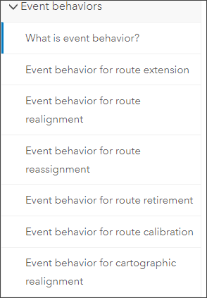

# Add Event Spanning Route Examples in APR Event Behavior Document

|   |   |
| --- | --- |
| **Kind** | User Story · Pro |
| **Release** | — |
| **Product** | Pipeline Referencing |
| **Source** | [Event_spanning_APR_doc_UserStory.pptx](<https://esriis.sharepoint.com/sites/LocationReferencing/Shared%20Documents/General/Event_spanning_APR_doc_UserStory.pptx>) |
| **Edited** | 2019-11-20 19:39 by Rahul Rakshit |
| **Extracted** | 2026-09-04 · lane `xmlstrip` |

<!-- metadata
```yaml
title: "Add Event Spanning Route Examples in APR Event Behavior Document"
source_file: "Event_spanning_APR_doc_UserStory.pptx"
source_url: "https://esriis.sharepoint.com/sites/LocationReferencing/Shared%20Documents/General/Event_spanning_APR_doc_UserStory.pptx"
doc_id: 869
doc_kind: "User Story"
surface: "Pro"
doc_revision: ""
target_release: ""
pe: "Jim"
dev: ""
author: "Rahul Rakshit"
last_edited_by: "Rahul Rakshit"
last_edited: "2019-11-20T19:39:02Z"
extracted: 2026-09-04
extraction_lane: xmlstrip
prompt_version: "v2.0.2"
keywords: ["event spanning", "event behavior", "line network", "route", "apr"]
tools: []
products: ["Pipeline Referencing"]
issues: []
related: [{"doc":606,"file":"combined-apr-un-ribbon-user-story__doc606.md","s":3.148},{"doc":443,"file":"event-behavior-for-route-retirement__doc443.md","s":2.918},{"doc":425,"file":"event-behavior-for-route-retirement__doc425.md","s":2.912},{"doc":420,"file":"event-behavior-for-route-retirement__doc420.md","s":2.912},{"doc":441,"file":"event-behavior-for-route-retirement__doc441.md","s":2.906}]
```
-->

## Summary

User story for adding a new section on event behaviors on a line network with examples of events that span routes in the APR event behavior document. The section should provide detailed examples of edits typical for APR users without changing the existing document's formatting or content without PE consultation.

## Related documents

<!-- related:begin -->
- [Combined APR-UN Ribbon User Story](<https://esriis.sharepoint.com/sites/lrsworkspace/LRS Doc Index/User Stories/combined-apr-un-ribbon-user-story__doc606.md>) — similar text 0.06 · 1 title word · 1 filename word · same kind/surface/folder <!-- rel:606 -->
- [Event Behavior for Route Retirement](<https://esriis.sharepoint.com/sites/lrsworkspace/LRS Doc Index/Other/event-behavior-for-route-retirement__doc443.md>) — similar text 0.07 · 3 title words · 1 filename word · same surface <!-- rel:443 -->
- [Event Behavior for Route Retirement](<https://esriis.sharepoint.com/sites/lrsworkspace/LRS Doc Index/Other/event-behavior-for-route-retirement__doc425.md>) — similar text 0.06 · 3 title words · 1 filename word · same surface <!-- rel:425 -->
- [Event Behavior for Route Retirement](<https://esriis.sharepoint.com/sites/lrsworkspace/LRS Doc Index/Other/event-behavior-for-route-retirement__doc420.md>) — similar text 0.06 · 3 title words · 1 filename word · same surface <!-- rel:420 -->
- [Event Behavior for Route Retirement](<https://esriis.sharepoint.com/sites/lrsworkspace/LRS Doc Index/Other/event-behavior-for-route-retirement__doc441.md>) — similar text 0.06 · 3 title words · 1 filename word · same surface <!-- rel:441 -->
<!-- related:end -->

<!-- docs:begin -->
## Esri documentation

[Event editing using the attribute table](https://doc.esri.com/en/arcgis-pro/latest/help/production/location-referencing-pipelines/event-editing-using-the-attribute-table.html) · [Event behavior](https://doc.esri.com/en/arcgis-pro/latest/help/production/location-referencing-pipelines/what-is-event-behavior.html)
<!-- docs:end -->

---

## Slide 1 — Add event spanning route examples in the APR event behavior doc

## Slide 2 — User Story

This is a APR doc only user story
For each event behavior topic listed here:

Our implementation team and users such as Sempra have been asking for our event behavior doc to show examples of events spanning routes.

- Add a new section on event behaviors on a line network with examples of events that span routes.
- Provide the same amount of detail that is provided in the present doc.
- Provide examples of edits that the APR users would usually do.
- Do not change the formatting of the graphics without consulting with the PE.
- Do not change the contents of the present doc by any way.



## Slide 3 — Estimation

Estimate:
Writer: Jim
Consultant:
