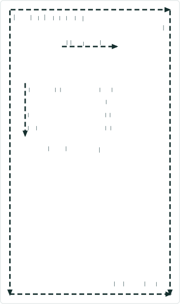
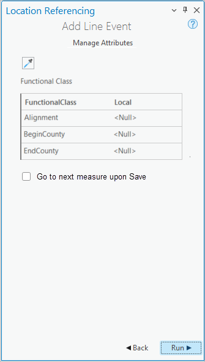

# Add Line Event Go To Next Measure on Save option

|   |   |
| --- | --- |
| **Kind** | User Story · Pro |
| **Release** | — |
| **Source** | [AddLineEventContinueFromPreviousEndMeasure.pptx](<https://esriis.sharepoint.com/sites/LocationReferencing/Shared%20Documents/General/AddLineEventContinueFromPreviousEndMeasure.pptx>) |
| **Edited** | 2024-12-17 00:56 by Nathan Easley |
| **Extracted** | 2026-09-04 · lane `xmlstrip` |

<!-- metadata
```yaml
title: "Add Line Event Go To Next Measure on Save option"
source_file: "AddLineEventContinueFromPreviousEndMeasure.pptx"
source_url: "https://esriis.sharepoint.com/sites/LocationReferencing/Shared%20Documents/General/AddLineEventContinueFromPreviousEndMeasure.pptx"
doc_id: 270
doc_kind: "User Story"
surface: "Pro"
doc_revision: ""
target_release: ""
pe: ""
dev: ""
author: "William Isley"
last_edited_by: "Nathan Easley"
last_edited: "2024-12-17T00:56:21Z"
extracted: 2026-09-04
extraction_lane: xmlstrip
prompt_version: "v2.0.2"
keywords: ["line event", "route", "measure", "event editing", "adjacent events", "pro project properties"]
tools: ["Add Line Event", "Add Multiple Line Event"]
products: []
issues: []
related: [{"doc":269,"file":"add-line-event-length-method__doc269.md","s":5.902},{"doc":687,"file":"add-line-event-tool-in-arcgis-pro__doc687.md","s":5.8},{"doc":686,"file":"add-multiple-line-events-tool-in-arcgis-pro__doc686.md","s":5.308},{"doc":225,"file":"add-line-event-tools-continue-from-previous-measure-option-test-plan__doc225.md","s":5.219},{"doc":214,"file":"add-line-event-tools-continue-from-previous-measure-option-test-plan__doc214.md","s":5.219}]
```
-->

## Summary

User story describing the need for LRS Editors to add adjacent line events sequentially along a newly created route using an option to go to the next measure upon save. It covers the tool enhancements, testing, automation, and documentation updates related to this feature.

## Related documents

<!-- related:begin -->
- [Add Line Event Length Method](<https://esriis.sharepoint.com/sites/lrsworkspace/LRS Doc Index/User Stories/add-line-event-length-method__doc269.md>) — similar text 0.32 · 3 title words · 3 filename words · same kind/surface/folder <!-- rel:269 -->
- [Add Line Event tool in ArcGIS Pro](<https://esriis.sharepoint.com/sites/lrsworkspace/LRS Doc Index/User Stories/add-line-event-tool-in-arcgis-pro__doc687.md>) — similar text 0.28 · 3 title words · 3 filename words · same kind/surface/folder <!-- rel:687 -->
- [Add Multiple Line Events tool in ArcGIS Pro](<https://esriis.sharepoint.com/sites/lrsworkspace/LRS Doc Index/User Stories/add-multiple-line-events-tool-in-arcgis-pro__doc686.md>) — similar text 0.29 · 2 title words · 3 filename words · same kind/surface/folder <!-- rel:686 -->
- [Add Line Event Tools: Continue from Previous Measure Option Test Plan](<https://esriis.sharepoint.com/sites/lrsworkspace/LRS Doc Index/Test Plans/add-line-event-tools-continue-from-previous-measure-option-test-plan__doc225.md>) — similar text 0.28 · 5 title words · 2 filename words · same surface <!-- rel:225 -->
- [Add Line Event Tools: Continue from Previous Measure Option Test Plan](<https://esriis.sharepoint.com/sites/lrsworkspace/LRS Doc Index/Test Plans/add-line-event-tools-continue-from-previous-measure-option-test-plan__doc214.md>) — similar text 0.28 · 5 title words · 2 filename words · same surface <!-- rel:214 -->
<!-- related:end -->

<!-- docs:begin -->
## Esri documentation

[Split a centerline by measure](https://doc.esri.com/en/arcgis-pro/latest/help/production/location-referencing-pipelines/split-a-centerline-by-measure.html) · [Event editing using the attribute table](https://doc.esri.com/en/arcgis-pro/latest/help/production/location-referencing-pipelines/event-editing-using-the-attribute-table.html)

_No page matched:_ [Add Line Event](https://www.google.com/search?q=%22Add%20Line%20Event%22+site%3Adoc.esri.com) · [Add Multiple Line Event](https://www.google.com/search?q=%22Add%20Multiple%20Line%20Event%22+site%3Adoc.esri.com)
<!-- docs:end -->

---

## Slide 1 — Add Line Event Go To Next Measure on Save option

User Story

## Slide 2 — User Story

As an LRS Editor, I need the capability to add adjacent line events sequentially, so that I can streamline the addition of new line events on a newly created route.

Persona
LRS Editor: This user is responsible for making edits to the LRS.  The edits they need to make come in from field crews/contractors in a variety of formats (shapefiles, engineering drawing, fgdbs).  The LRS Editor is responsible for making the route and event edits based on these documents. One scenario that these editors will go through is to add new events along a newly created route.  These edits want to add adjacent events from beginning of the route to the end in a streamlined manner.  Providing an option to go to the next measure upon save will result in the tool transitioning the To Measure of a newly created event to be the From Measure of the next event as they move down a route adding events.

## Slide 3 — Add Line Events tools



In the Add Line and Multiple Line Event tools, support an option on the attributes pane called “Go To Next Measure Upon Save”
Default state is the option is unchecked
In the Pro project properties, add an option to all this option to be checked/unchecked by default
When unchecked, continue to have the tool what it does today when Run is clicked
When checked and Run is clicked, transition the tool to the second pane with Event layer, Network, etc.
Populate whatever method was used for the To Method in the previous edit as the From Method (i.e., if Coordinates was the method and coordinates 24.567, -97.093 was populated for the To Method for the previous edit, Coordinates and 24.567, -97.093 would become the From Method and coordinates for the next edit)
Continue to honor the same To Method as in the previous edit (i.e., if the first edit had Route/Measure as the From and Coordinates as the To and this option is checked, the next edit would have Coordinates as the From and Coordinates as the To)
Develop the option so it can be translated for internationalization



## Slide 4 — Testing

Test with a mix of Add Line and Add Multiple Line Event tools
Mix and match spanning and non spanning events on line and non line networks
Feature service testing only
508/i18n testing

## Slide 5 — Automation

Create 1-2 automated test cases for UI automation for the tools

## Slide 6 — Documentation

Update all the Add Line Events topics to discuss this option being available and when it would be used

## Slide 7 — Assignment

Story Points:
Dev:
PE:
