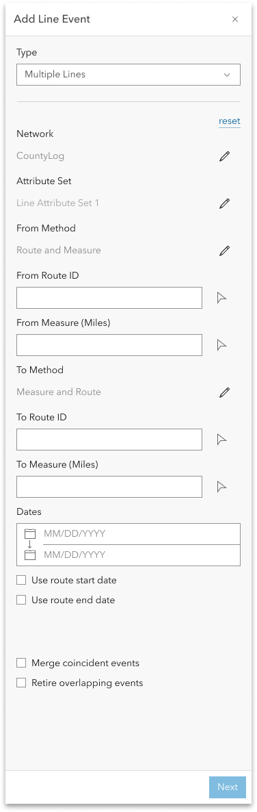

# User Story Add Line Event (Multiple)

| Field | Value |
| --- | --- |
| **Doc** | 480 · User Story · Experience Builder |
| **Product** | — |
| **Release** | — |
| **Issues** | — |
| **Source** | [ExB_AddLineEvents_Multiple.pptx](<https://esriis.sharepoint.com/sites/LocationReferencing/Shared%20Documents/General/ExB_AddLineEvents_Multiple.pptx>) |
| **People** | author Praveen Kumar · PE — · dev — |
| **Edited** | 2023-10-24 14:16 by Praveen Kumar |
| **Extracted** | 2026-09-04 · lane xmlstrip · format 3.0 · prompt v2.0.2 |
| **Keywords** | line event · event editing · experience builder · route picker · attribute set · validation · user interface |
| **Tools** | Add Line Event |

## Summary

This document describes a user story for adding multiple line events in a web application configured through Experience Builder. It details configuration settings, user interface behavior, validation rules, testing scenarios, automation guidance, and documentation requirements for the Add Line Event widget. The focus is on enabling LRS Editors to efficiently complete event editing workflows with proper attribute handling and error management.

## Related documents

<!-- related:begin -->
- [Add Line Events User Story for Experience Builder](<https://esriis.sharepoint.com/sites/lrsworkspace/LRS Doc Index/User Stories/add-line-events-for-exb.md>) — similar text 0.75 · 2 title words · 3 filename words · same kind/surface/folder <!-- rel:484 s=7.423 -->
- [Add Point Events in Experience Builder](<https://esriis.sharepoint.com/sites/lrsworkspace/LRS Doc Index/User Stories/add-point-events-in-exb-2023-09.md>) — similar text 0.69 · 1 title word · 3 filename words · same kind/surface/folder <!-- rel:495 s=6.532 -->
- [Add Point Events in Experience Builder](<https://esriis.sharepoint.com/sites/lrsworkspace/LRS Doc Index/User Stories/add-point-events-in-exb-2023-09-2.md>) — similar text 0.72 · 1 title word · 2 filename words · same kind/surface/folder <!-- rel:496 s=6.104 -->
- [Add Point Event Experience Builder Widget](<https://esriis.sharepoint.com/sites/lrsworkspace/LRS Doc Index/User Stories/add-point-event-exb-widget.md>) — similar text 0.66 · 2 title words · 2 filename words · same kind/surface/folder <!-- rel:497 s=5.869 -->
- [Experience Builder: Add Single Line Event Widget](<https://esriis.sharepoint.com/sites/lrsworkspace/LRS Doc Index/User Stories/16340-exb-add-single-line-event-widget.md>) — similar text 0.45 · 3 title words · 2 filename words · same kind/surface <!-- rel:455 s=5.292 -->
<!-- related:end -->

<!-- docs:begin -->
## Esri documentation

[Event editing using the attribute table](https://doc.esri.com/en/arcgis-pro/latest/help/production/location-referencing-pipelines/event-editing-using-the-attribute-table.html)

_No page matched:_ [Add Line Event](https://www.google.com/search?q=%22Add%20Line%20Event%22+site%3Adoc.esri.com)
<!-- docs:end -->

---

## Story
### User Story Add Line Event (Multiple) <!-- slide 1 -->
As an LRS Editor, I need to Add Line Events in web application configured through experience builder, so that I can complete LRS event editing workflow.

Persona
Event Editor: These users are responsible for making edits to route characteristics and assets.  Typically located in different business units/departments than the LRS route editors, these users have varied GIS experience, but a high level of knowledge about the characteristics they maintain (safety, pavement, crashes, etc.)  These users need to be able to Add Line Events using a web application.

## Acceptance Criteria
### Configuration <!-- slide 2 -->
Will be part of this use story

### Add Line Event (Multiple) <!-- slide 3 -->
Configuration

- Should be able to set the default Attribute set for Multiple Line event to the existing Add line event widget configuration.

### Add Line Event (Multiple) <!-- slide 4 -->
- When  opened Type should be as per the settings from the configuration.
- Default Attribute set selected should be as per the settings from the configuration.
- All other attribute sets should be displayed in the dropdown and user should be able to change when needed.
- Network to which the event layers are registered should be displayed automatically.
- Option for From and To Method should be as per the configuration and allow user to change to any other available method using the edit button (when we start supporting other methods).
- If the LRS Network is configured with RouteName, then show RouteName instead of RouteID.
- For Route ID and Measure fields user should be able to select using the picker or type the values.
- When a route is selected using picker, populate the measure value from that location and vice versa.

### Add Line Event <!-- slide 5 -->
- If the user clicks at a location with the route picker that has more than one route at that location, provide the route selector UI (also applicable when no time filter applied to the map and there are multiple time slices of a single route).
- If a user types in a RouteID/Name and there are multiple time slices of that route, prompt the user to select which time slice they want to utilize (we can use the picker experience from the point above).
- Routes listed in the selector should be filtered based on the time settings of the map.
- Measure units should be defaulted to the Network units and the no of decimal places to display should be as per the m tolerance of the network.
- Once a route is selected on the map using the route picker, flash the route 3 times.
- When from measure on a route is selected on the map using the measure picker, provide a green dot and display the measure on the map.
- When to measure on a route is selected on the map using the measure picker, provide a red dot and display the measure on the map.

### Add Line Event (Multiple) <!-- slide 6 -->
- User should not be able to change the network until the measure translation is supported (disable the pencil).
- Default for the start date should be current date (today) and to date as null.
- Display check boxes for Use route start date and Use route end date.
- When use route start date is checked, populate the from date with the route start date
- When use route end date is checked, populate the to date with the route end date
- Always enable snapping while using the route \ measure pickers
- When user clicks on reset, clear user entered values and bring form to initial loading state.
- Merge adjacent events when the ‘Merge coincident events option’ is checked.
- Retire any overlapping events if ‘Retire overlapping events’ option is checked
- After providing all the information and clicking on Next button should take to 2nd pane.

### Add Line Event (Multiple) <!-- slide 7 -->
Multiple Line event

- For the selected attribute set show the attribute fields as per the configuration.
- User should be able to enter \ edit values for the editable fields.
- Make sure to honor coded value domains, range domains, subtypes, non nullable fields, attribute rules, contingent values and default values for any fields wherever applicable.
- If any layer is not in the webmap, does not show the field information.
- If the user clicks Add, execute creating the events and provide a confirmation message.
- Once the operation is complete, transition back to the initial pane.
- If the user clicks Back, go back to the previous step and preserve the entered values.
- If any fields are not populated correctly, do not Run and show an error for the field(s) that need to be updated.

### Add Line Event (Multiple) <!-- slide 8 -->
- Provide error messages when the routeid / route name / measures are invalid.
- Provide error messages when from date is greater than or equal to the to date.
- Validate the routeid \ routename\ measure exists in the provided date.
- Next button should be enabled only when the route / measure / dates are valid.

## Testing
<!-- slide 9 -->
- Test on events registered to a variety of network types (Line, NonLine with multifield RouteID, NonLine with singlefield RouteID)
- Test adding a Line event on a variety of route types
  - Normal, Gapped (include different gap calibration methods)
  - Complex, and Vertical (can we test vertical routes?)
- Test in different browsers (Chrome, Edge, (Firefox and Safari can be done through automation))
- Add a test scenario where an attribute rule is violated and make sure an appropriate error message is returned
- Test deploying in tab and mobile layouts (UI testing and execute one or two test cases).
- Web testing in chrome and safari in mobile.
- Test on projected and unprojected data.
- 508/i18n testing
- Test on different themes

## Automation
<!-- slide 10 -->
Follow UI  automation from other experience builder widgets

## Documentation
<!-- slide 11 -->
- Create a documentation topic for this widget that follows the same format used in https://doc.arcgis.com/en/experience-builder/11.1/configure-widgets/widgets-overview.htm
- We’re not sure where this widget will live within that topic at this time (need to confirm with the Experience Builder team), but the topic can at least follow the same format as others
- Make sure to include graphic examples in the doc, use Arcgis Pro documentation as a guide.

## Assignment
<!-- slide 12 -->
Story Points:
Dev:
PE:
