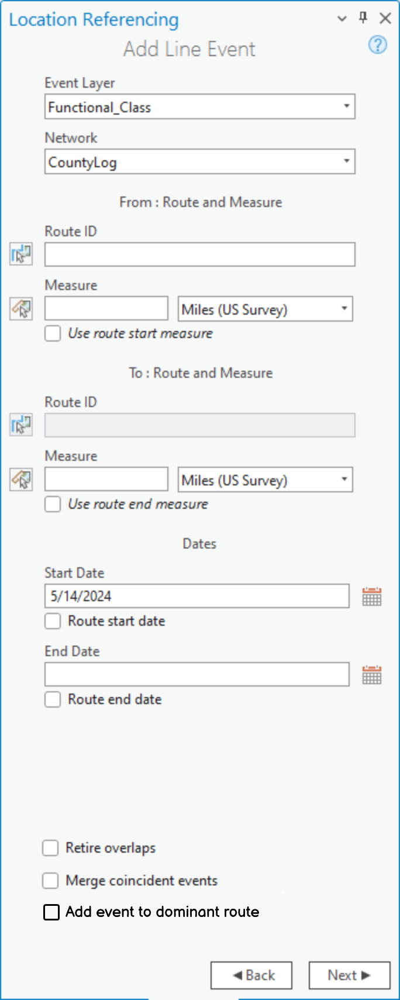
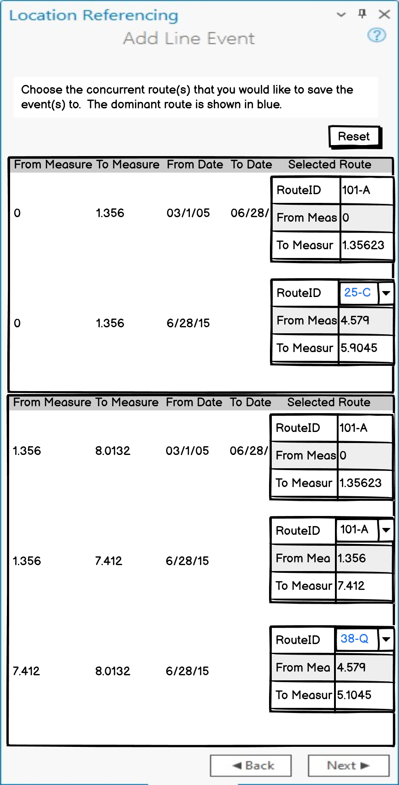

# Add Line Event to Dominant Route in ArcGIS Pro

|   |   |
| --- | --- |
| **Kind** | User Story · Pro |
| **Release** | — |
| **Product** | Roads & Highways · Pipeline Referencing |
| **Source** | [AddLnEventtoDominantRtePro.pptx](<https://esriis.sharepoint.com/sites/LocationReferencing/Shared%20Documents/General/AddLnEventtoDominantRtePro.pptx>) |
| **Edited** | 2024-05-14 22:58 by Nathan Easley |
| **Extracted** | 2026-09-04 · lane `xmlstrip` |

<!-- metadata
```yaml
title: "Add Line Event to Dominant Route in ArcGIS Pro"
source_file: "AddLnEventtoDominantRtePro.pptx"
source_url: "https://esriis.sharepoint.com/sites/LocationReferencing/Shared%20Documents/General/AddLnEventtoDominantRtePro.pptx"
doc_id: 370
doc_kind: "User Story"
surface: "Pro"
doc_revision: ""
target_release: ""
pe: ""
dev: ""
author: "William Isley"
last_edited_by: "Nathan Easley"
last_edited: "2024-05-14T22:58:12Z"
extracted: 2026-09-04
extraction_lane: xmlstrip
prompt_version: "v2.0.2"
keywords: ["line event", "dominant route", "concurrency", "event editor", "route measures", "event placement", "arcgis pro"]
tools: ["Add Line Event", "Add Multiple Line Event", "Calculate Route Concurrencies"]
products: ["Roads & Highways", "Pipeline Referencing"]
issues: []
related: [{"doc":358,"file":"add-line-event-to-dominant-route-in-arcgis-pro-test-plan__doc358.md","s":6.426},{"doc":169,"file":"add-point-and-non-spanning-line-event-to-dominant-route-in-experience-builder__doc169.md","s":5.084},{"doc":360,"file":"add-point-event-to-dominant-route-in-arcgis-pro-test-plan__doc360.md","s":5.054},{"doc":686,"file":"add-multiple-line-events-tool-in-arcgis-pro__doc686.md","s":4.493},{"doc":326,"file":"add-linear-events-to-dominant-routes__doc326.md","s":4.176}]
```
-->

## Summary

This document describes a user story for adding linear events to the primary or dominant route in ArcGIS Pro to prevent events from being assigned to non-dominant routes during concurrency. It outlines requirements for tool behavior, UI panes, concurrency logic, and project options, as well as testing, automation, and documentation plans. The focus is on ensuring event editors can reliably place events on dominant routes in concurrent route scenarios.

## Related documents

<!-- related:begin -->
- [Add Line Event to Dominant Route in ArcGIS Pro – Test Plan](<https://esriis.sharepoint.com/sites/lrsworkspace/LRS Doc Index/Test Plans/add-line-event-to-dominant-route-in-arcgis-pro-test-plan__doc358.md>) — similar text 0.23 · 6 title words · 3 filename words · same surface <!-- rel:358 -->
- [Add Point and non-Spanning Line Event to Dominant Route in Experience Builder – Test Plan](<https://esriis.sharepoint.com/sites/lrsworkspace/LRS Doc Index/Test Plans/add-point-and-non-spanning-line-event-to-dominant-route-in-experience-builder__doc169.md>) — similar text 0.30 · 5 title words · 2 filename words <!-- rel:169 -->
- [Add Point Event to Dominant Route in ArcGIS Pro – Test Plan](<https://esriis.sharepoint.com/sites/lrsworkspace/LRS Doc Index/Test Plans/add-point-event-to-dominant-route-in-arcgis-pro-test-plan__doc360.md>) — similar text 0.34 · 5 title words · 2 filename words · same surface <!-- rel:360 -->
- [Add Multiple Line Events tool in ArcGIS Pro](<https://esriis.sharepoint.com/sites/lrsworkspace/LRS Doc Index/User Stories/add-multiple-line-events-tool-in-arcgis-pro__doc686.md>) — similar text 0.21 · 3 title words · 1 filename word · same kind/surface/folder <!-- rel:686 -->
- [Add Linear Events to Dominant Routes](<https://esriis.sharepoint.com/sites/lrsworkspace/LRS Doc Index/Other/add-linear-events-to-dominant-routes__doc326.md>) — similar text 0.17 · 2 title words · 2 filename words · same surface <!-- rel:326 -->
<!-- related:end -->

<!-- docs:begin -->
## Esri documentation

_No page matched:_ [Add Line Event](https://www.google.com/search?q=%22Add%20Line%20Event%22+site%3Adoc.esri.com) · [Add Multiple Line Event](https://www.google.com/search?q=%22Add%20Multiple%20Line%20Event%22+site%3Adoc.esri.com) · [Calculate Route Concurrencies](https://www.google.com/search?q=%22Calculate%20Route%20Concurrencies%22+site%3Adoc.esri.com)
<!-- docs:end -->

---

## Slide 1 — Add Line Event to Dominant Route in ArcGIS Pro

User Story
ArcGIS Pro

## Slide 2 — User Story

As an event editor, I need linear events to be saved to the primary/dominant route, so that I don’t have to worry about events ending up on the non-dominant route and being missed during reporting.
Persona
Event Editor: These users are responsible for making edits to route characteristics and assets.  Typically located in different business units/departments than the LRS route editors, these users have varied GIS experience, but a high level of knowledge about the characteristics they maintain (safety, pavement, crashes, etc.).  At almost all DoTs, events need to be placed onto the dominant/primary route when there is a concurrency.  Adding this option will ensure an event always ends up on the dominant route when there is a concurrency.

## Slide 3 — Requirements

In the Add Line Event and Add Multiple Line Event tools, add an option at the bottom of the second screen called “Add event(s) to dominant route”
When unchecked, the tool should continue to work the same way it does today
When checked and the user clicks the next button, utilize the concurrency logic to determine if there is a concurrency between the From and To Measure during the time range between the Start and End Date in the UI where the line event(s) are being added
If there is no concurrency between the From and To Measure at any point in time between the Start and End date in the UI, have the tool continue to the current 3rd pane in the tool with the attribute grid



## Slide 4 — Requirements

If there is a concurrency at any point in time between the Start and End date at that location between the From and To Measures, have the tool transition to the new 3rd pane
This pane will show the route and measures of the event being added and the route and measure of the dominant/primary route at the location for each unique time slice
Organize the grid from the concurrency at the smallest measure to the largest measure on the route and measures entered on the previous pane.  Within each section, order the time slices from oldest at the top to newest at the bottom.
If there is a segment/timeslice of the route where no concurrency exists, just show the route and measure that will be added but don’t provide a drop down to change the selection
Show the RouteID with a drop down.  The default should be the dominant/primary route and measures.
The primary/dominant route and measures should be in blue.  The non primary/dominant route and measures should be in black.
If the event(s) being added span routes, continue to show the concurrencies on a route-by-route basis beginning with the From Route From Measure ending with the To Route To Measure.
If the user checks Reset, then reset the options in the drop downs to what was returned by the concurrency logic
When the user clicks next, transition to the now 4th pane with the attributes
If conflict prevention is enabled:

  - For Add Line, acquire the locks when next is clicked on this pane
  - For Add Multiple Line, continue to acquire on the attributes pane



## Slide 5 — Requirements

In the Pro project options, add a checkbox between the Set LRS layers and Merge coincident events options called “Don’t allow override of event placement on dominant routes”
Default for this would be unchecked
When this option is checked and the user checks the Add Event to Dominant Route option in Add Line/Multiple Line Event, do not show the second pane for choosing/overriding the dominant route and simply take the default option returned by the concurrency logic

## Slide 6 — Testing

Test with line and non line networks
Test with spanning and non spanning events
Focus primarily on scenarios with concurrent routes, but sanity test scenarios where there is no concurrency
Test scenarios where there a concurrencies across multiple time slices and the primary/dominant route changes over time
Test in Dark Mode
Consider utilizing the data used for the Calculate Route Concurrencies GP tool for testing

## Slide 7 — Automation

Add test cases to the existing UI automation for the tools

## Slide 8 — Documentation

Create a new topic called “Add line events to dominant routes” that goes within the Add Line Events section of the RH and APR doc TOC
Make sure to include graphics that discuss what this option will do and how the user will utilize this option
Utilize the Event Editor topic as a guide

## Slide 9 — Story Points

Story Points:
Dev:
PE:
