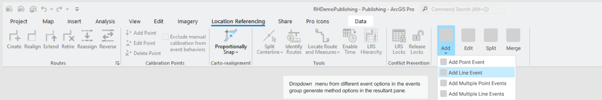
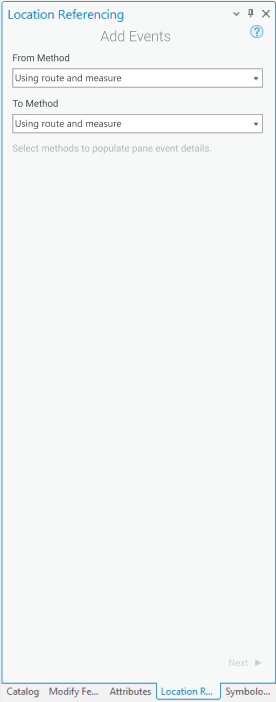
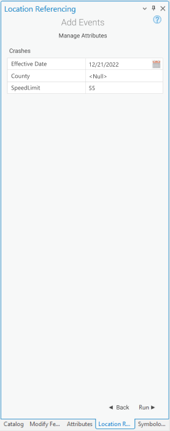

# Add Line Event tool in ArcGIS Pro

| Field | Value |
| --- | --- |
| **Doc** | 687 · User Story · Pro |
| **Product** | — |
| **Release** | — |
| **Issues** | — |
| **Source** | [AddSingleLineEvent.pptx](<https://esriis.sharepoint.com/sites/LocationReferencing/Shared%20Documents/General/AddSingleLineEvent.pptx>) |
| **People** | author William Isley · PE — · dev — |
| **Edited** | 2022-01-21 01:06 by Nathan Easley |
| **Extracted** | 2026-09-04 · lane xmlstrip · format 3.0 · prompt v2.0.2 |
| **Keywords** | line event · route · measure · event attributes · location referencing · lrs editor · event layer · route picker |
| **Tools** | Add Line Event |

## Summary

This document describes the user story for adding a line event tool in ArcGIS Pro to enable LRS Editors to complete full LRS editing workflows within a single application. It details the UI design, workflow steps, attribute handling, and testing scenarios for the Add Line Event tool. The document also outlines automation and documentation tasks related to the tool's development and deployment.

## Related documents

<!-- related:begin -->
- [Add Single Point Event tool in ArcGIS Pro](<https://esriis.sharepoint.com/sites/lrsworkspace/LRS Doc Index/User Stories/add-single-point-event-tool-in-pro.md>) — similar text 0.74 · 4 title words · 3 filename words · same kind/surface/folder <!-- rel:688 s=8.932 -->
- [Add Multiple Line Events tool in ArcGIS Pro](<https://esriis.sharepoint.com/sites/lrsworkspace/LRS Doc Index/User Stories/add-multiple-line-events-tool-in-pro.md>) — similar text 0.84 · 4 title words · 3 filename words · same kind/surface/folder <!-- rel:686 s=8.322 -->
- [Add Multiple Point Events tool in ArcGIS Pro](<https://esriis.sharepoint.com/sites/lrsworkspace/LRS Doc Index/User Stories/add-multiple-point-events-tool-in-pro.md>) — similar text 0.79 · 3 title words · 2 filename words · same kind/surface/folder <!-- rel:685 s=6.521 -->
- [Experience Builder: Add Single Line Event Widget](<https://esriis.sharepoint.com/sites/lrsworkspace/LRS Doc Index/User Stories/16340-exb-add-single-line-event-widget.md>) — similar text 0.29 · 3 title words · 4 filename words · same kind <!-- rel:455 s=6.095 -->
- [User Story Add Line Event (Multiple)](<https://esriis.sharepoint.com/sites/lrsworkspace/LRS Doc Index/User Stories/add-line-event-multiple.md>) — similar text 0.34 · 3 title words · 2 filename words · same kind/folder <!-- rel:480 s=5.285 -->
<!-- related:end -->

<!-- docs:begin -->
## Esri documentation

[Split a centerline by measure](https://doc.esri.com/en/arcgis-pro/latest/help/production/location-referencing-pipelines/split-a-centerline-by-measure.html) · [Event editing using the attribute table](https://doc.esri.com/en/arcgis-pro/latest/help/production/location-referencing-pipelines/event-editing-using-the-attribute-table.html) · [Set Location Referencing options](https://doc.esri.com/en/arcgis-pro/latest/help/production/location-referencing-pipelines/set-location-referencing-options.html)

_No page matched:_ [Add Line Event](https://www.google.com/search?q=%22Add%20Line%20Event%22+site%3Adoc.esri.com)
<!-- docs:end -->

---

## Story
### Add Line Event tool in ArcGIS Pro <!-- slide 1 -->
User Story

### User Story <!-- slide 2 -->
As an LRS Editor, I need the capability to add a line event in ArcGIS Pro, so that I can complete entire LRS editing workflows within a single application.

Persona
LRS Editor: This user is responsible for making edits to the LRS.  The edits they need to make come in from field crews/contractors in a variety of formats (shapefiles, engineering drawing, fgdbs).  The LRS Editor is responsible for making the route and event edits based on these documents. As of now, the LRS Editor can edit an event’s shape and location in Pro, but none of the attributes such as Route ID, Route Name, measure and date fields are updated.  We need to build a tool that allows them to create a line event inside of ArcGIS Pro.

## Acceptance Criteria
### Add Line Event (Loc Ref ribbon) <!-- slide 3 -->
- Add a button called Add Line Event to the other Add event buttons (note the Add Point Event story was supposed to make requests for icons for all 4 tools)
- When the button is clicked, open the tool
- All mockups can be found at https://www.figma.com/file/Y3dXxrZtsLFcObC1PdABxS/Point%2FLine-Event-Editing-UX%2FUI?node-id=97%3A2347

### Add Line Event (tool) <!-- slide 4 -->
- When the Add Line Event button is clicked, open the Add Events pane (under the Location Referencing tab)
- Default the UI to select “Using Route and Measure” for both the From and To Methods (we’ll add additional methods in later user stories)
- When the user clicks Next, transition to the next screen in the pane

### Add Line Event (tool) <!-- slide 5 -->
- After transitioning to the next pane, show the From and To Methods populated with Route and Measure (follow the pattern from Add Single Point Event tool)
- By default, show the Event Layer, Network, Route ID, From Measure, To Measure, Effective Date, and End Date parameters
- Default the Event Layer to show the first line layer in the LRS enabled service in the map.  Populate the drop down with the other line layers in the service. (No fgdb or direct connect)
- Default the LRS Networks to show the LRS Network associated with the default Event Layer selected.  (In a future story we’ll add measure translation and would show all the LRS Networks in the map, but for now just show the one associated with the event selected)
- RouteID and From/To Measures should be empty until the user types or using the picker tools to populate
- If a user selects either the Route or Measure pickers to interact with the map, ensure the scrolling measures appear when they’re moving their cursor along routes in the map
- Default the units in the measure parameters to whatever units the Default LRS Network is in
- If the event layer selected belongs to a network with Lines configured, show LineID above the RouteID (it should look like the RouteID textbox and include a picker as well)
- If the event layer selected is configured to span routes, show To RouteID after From Measure but before To Measure (it should appear and work the same as the From RouteID)
- If the event layer selected belongs to a network with Route Name configured, show Route Name instead of RouteID (but still have the same look and functionality with a route picker tool)

### Add Line Event (tool) <!-- slide 6 -->
- Allow the user to populate the measure, routeID/name, or lineID first.  If they choose a measure, then populate the routeID/name/lineID automatically based on the measure on the route they selected.  If they choose a routeID/name first and lineID is configured, populate the lineID automatically.
- If the user clicks a location with the route picker that has more than one route at that location, provide the route selector UI that we use in other route editing tools when they select a location with more than one route (this would also apply to there being no time filter applied to the map and there are multiple time slices of a single route)
- If a user types in a RouteID and there are multiple time slices of that route, prompt the user to select which time slice they want to utilize (we can use the picker experience from the point above)
- Include an intellisense experience for LineID/RouteID/Name (after the 3rd character is typed, use Locate Route and Measure tool as a guide)
- Once a route is selected on the map using the route picker, flash the route 3 times like we do in route editing tools
- When a measure on a route is selected on the map using the measure picker, provide a green dot for the From Measure and red dot for the To Measure
- The Effective Date text box should be populated with the current date
- Leave the End Date text box empty
- Don’t add the 4 check boxes (Retire Overlaps, Merge Coincident Events, Prevent Measures not on route, and Add events to dominant routes) as we’ll add them in later user stories
- When the user clicks Next, transition to the next screen in the pane
- Add a back button to this pane in case the user wants to change the method in the future
- If there is no LRS enabled service in the map in Pro, don’t show any event or network layers and provide a message that no LRS enabled service is present
- If the From and To Measures are reversed (From>To) or the From and To RouteIDs are reversed for a spanning route (From Route line order > To Route line order) we should reverse the values to match the direction of increasing calibration/line order

### Add Line Event (tool) <!-- slide 7 -->
- The next pane should show the non-LRS and non-system attributes for the event layer selected in the previous step
- Make sure to honor coded value domains, range domains, subtypes, non nullable fields, and default values for any fields where applicable
- If the user clicks Back, go back to the previous step
- If the user clicks Run, execute creating the event
- If any fields are not populated correctly, do not Run and show an error for the field(s) that need to be updated
- Once the operation is complete, transition back to the initial method screen and show a message that the event was successfully created
- If the event created spans a gap in the route, check the gap calibration rules for the network the event is a part of to determine if it should be a single multipart event (step or add = 0) or split into two or more single part events (Euclidean, step or add > 0)

## Testing
<!-- slide 8 -->
- Test on a variety of network types (Line, NonLine with multifield RouteID, NonLine with singlefield RouteID, NonLine with autogenerated RouteID)
- Test on both spanning and non spanning events
- Feature Service testing only (no need to worry about direct connect or fgdb)
- Test adding a line event on a variety of route types
  - Normal
  - Gapped (include different gap calibration methods)
  - Loops
  - Lollipops
  - Alpha
  - Branch
  - Vertical
- Include various testing scenarios that would invoke a Loc Error
- 508/i18n testing

## Automation
<!-- slide 9 -->
- Create a few UI test cases for the tool
- Add all the test cases for ReadyAPI automation using LRS applyEdits (if the decision is made to go with core applyEdits, then no need to automate as that will be covered by the core editing tool user story)

## Documentation
<!-- slide 10 -->
- Create a new topic called Adding Line Events (in the same section of the documentation for the previous event editing topics using core tools)
- Follow the format of the existing Event Editor topic related to Adding Linear Events via Route and Measure
- Feel free to utilize the same graphics and tables as the Creating Event Features using core tools topic
- Once the topic is created, test that is correctly opens from the tool tip on the UI in Pro

## Assignment
<!-- slide 11 -->
Story Points:
Dev:
PE:
