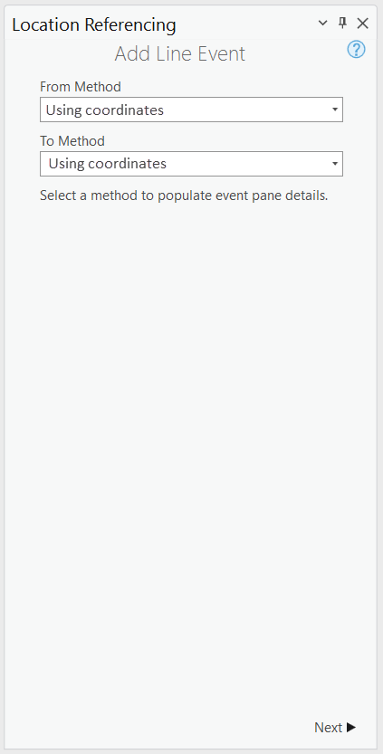
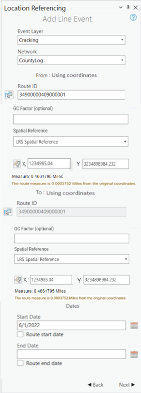
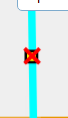
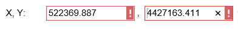
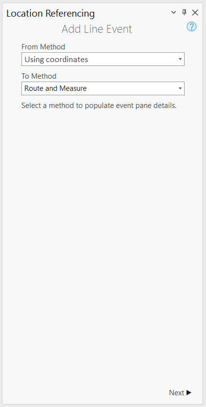
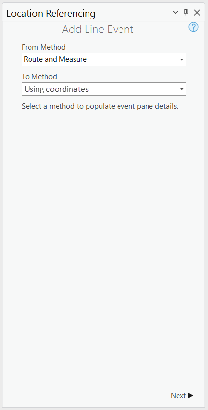
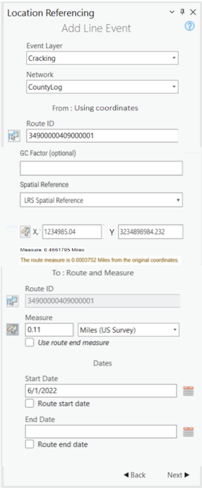
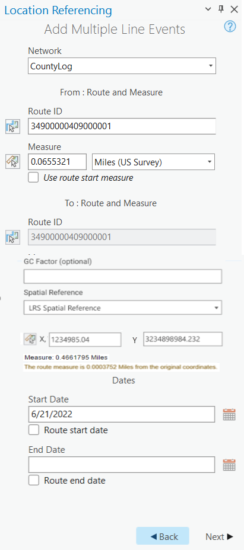

# Add Line Event Tools: Coordinate Offset Method

|   |   |
| --- | --- |
| **Kind** | User Story · Pro |
| **Release** | — |
| **Source** | [Add Line Events_ Coordinate offset method in Pro.pptx](<https://esriis.sharepoint.com/sites/LocationReferencing/Shared%20Documents/General/Add%20Line%20Events_%20Coordinate%20offset%20method%20in%20Pro.pptx>) |
| **Edited** | 2022-07-25 20:05 by Johum Khushk |
| **Extracted** | 2026-09-04 · lane `xmlstrip` |

<!-- metadata
```yaml
title: "Add Line Event Tools: Coordinate Offset Method"
source_file: "Add Line Events_ Coordinate offset method in Pro.pptx"
source_url: "https://esriis.sharepoint.com/sites/LocationReferencing/Shared%20Documents/General/Add%20Line%20Events_%20Coordinate%20offset%20method%20in%20Pro.pptx"
doc_id: 648
doc_kind: "User Story"
surface: "Pro"
doc_revision: ""
target_release: ""
pe: ""
dev: ""
author: "William Isley"
last_edited_by: "Johum Khushk"
last_edited: "2022-07-25T20:05:57Z"
extracted: 2026-09-04
extraction_lane: xmlstrip
prompt_version: "v2.0.2"
keywords: ["line event", "coordinate offset", "event editing", "spatial reference", "validation", "route measure", "referent"]
tools: ["Add Line", "Add Multiple Line"]
products: []
issues: []
related: [{"doc":658,"file":"add-point-event-tools-coordinate-offset-method__doc658.md","s":10.402},{"doc":268,"file":"add-line-events-point-offset-method__doc268.md","s":6.624},{"doc":636,"file":"add-line-event-tool-coordinate-offset-method-test-plan__doc636.md","s":6.584},{"doc":679,"file":"add-event-intersection-offset-method__doc679.md","s":6.312},{"doc":272,"file":"add-point-event-point-offset-method__doc272.md","s":6.094}]
```
-->

## Summary

Describes a user story for LRS Editors to add line events in ArcGIS Pro using a coordinate offset method. Details UI changes, validation rules, spatial reference options, and testing scenarios for adding events based on X,Y coordinates. Includes automation and documentation plans for this feature.

## Related documents

<!-- related:begin -->
- [Add Point Event Tools: Coordinate Offset Method](<https://esriis.sharepoint.com/sites/lrsworkspace/LRS Doc Index/User Stories/add-point-event-tools-coordinate-offset-method__doc658.md>) — similar text 0.77 · 6 title words · 6 filename words · same kind/surface/folder <!-- rel:658 -->
- [Add Line Events Point Offset Method](<https://esriis.sharepoint.com/sites/lrsworkspace/LRS Doc Index/User Stories/add-line-events-point-offset-method__doc268.md>) — similar text 0.34 · 4 title words · 4 filename words · same kind/surface/folder <!-- rel:268 -->
- [Add Line Event Tool Coordinate Offset Method Test Plan](<https://esriis.sharepoint.com/sites/lrsworkspace/LRS%20Doc%20Index/Test%20Plans/add-line-event-tool-coordinate-offset-method-test-plan__doc636.md>) — similar text 0.33 · 6 title words · 3 filename words · same surface <!-- rel:636 -->
- [Add Event Intersection Offset Method](<https://esriis.sharepoint.com/sites/lrsworkspace/LRS Doc Index/User Stories/add-event-intersection-offset-method__doc679.md>) — similar text 0.40 · 4 title words · 3 filename words · same kind/surface/folder <!-- rel:679 -->
- [Add Point Event Point Offset Method](<https://esriis.sharepoint.com/sites/lrsworkspace/LRS Doc Index/User Stories/add-point-event-point-offset-method__doc272.md>) — similar text 0.37 · 4 title words · 3 filename words · same kind/surface/folder <!-- rel:272 -->
<!-- related:end -->

<!-- docs:begin -->
## Esri documentation

[Event editing using the attribute table](https://doc.esri.com/en/arcgis-pro/latest/help/production/location-referencing-pipelines/event-editing-using-the-attribute-table.html) · [Storing referent and offset information for event location](https://doc.esri.com/en/arcgis-pro/latest/help/production/location-referencing-pipelines/storing-referent-and-offset-information-for-event-location.html)

_No page matched:_ [Add Line](https://www.google.com/search?q=%22Add%20Line%22+site%3Adoc.esri.com) · [Add Multiple Line](https://www.google.com/search?q=%22Add%20Multiple%20Line%22+site%3Adoc.esri.com)
<!-- docs:end -->

---

## Slide 1 — Add Line Event Tools: Coordinate Offset Method

User Story

## Slide 2 — User Story

As an LRS Editor, I need the capability to add events in ArcGIS Pro, based on provided co- ordinates, so that I can locate new events from the field that come in via this collection method.

Persona
LRS Editor: This user is responsible for making edits to the LRS. For some users, their event data (for example pavement condition, grade) comes in as gps x,y coordinates. Using ‘Coordinate offset’ method editor can create line events by typing or selecting x- and y-coordinates.

## Slide 3 — Add Line Event Tools: Coordinate Offset Method


In the Add Line , Add Multiple Line tools (exclude Event Replacement), support a method called ‘Using coordinates’.

Add this method as a drop-down option to both tools when they’re initially opened. Default is route and measure method.



## Slide 4


After transitioning to the 2nd pane, show the same UI as in the previous user stories, except instead of showing Route and Measure, show ‘Using coordinates’
Show a label with the method “Using Coordinates” above the RouteID/Name like it is done for Route and Measure method

For Measures, allow the user to either type the X, Y value or use the picker to select location from the map
 Measure selector should work with snapping.
No. of decimal values displayed in measure should be as per M resolution of network
Add validations for Measure (X/Y not provided, one of them not provided, type non-numeric value)
Provide three options, for Spatial Reference dropdown: LRS Spatial Reference, Web map spatial reference, GCS_WGS_1984
If the user changes spatial reference and there is already a location selected on map, then verify the coordinates based upon the selected spatial reference. If the coordinates cannot be located show an error message upon hover: The Coordinates could not be projected

Once the location is selected on route, show selected location on the map (including distance) with the same markers that are used in Event Editor

If the user clicks on a location that isn’t on a route, the route measure closest to the original coordinates will be selected and its distance from the route will be displayed (as shown in yellow on UI)
If referents are configured, then ‘using coordinates’ should be the dreferentmethod

User can type GC factor in the text box (Will adjust the coordinates by dividing X and Y by the value specified. The value should be a number and cannot be 0)
If 2nd pane is filled out and user goes back to 1st  pane:

  - If user selects a different method, reset 2nd    (3rd pane if applicable) and clear markers on map
  - If user selects same method again, keep the markers on map and any thing filled out in 3rd pane
User moves to 3rd pane, fill  out the attributes and hits back , markers on map + any information on (2nd, 3rd ) panes should remain intact
- UI is applicable for both single / multiple line event tools
No Limit of decimal values as per EE

   

## Slide 5


- All points mentioned in the previous slide are applicable here as well

Mix of methods

   

## Slide 6 — Testing

Test with both add line event tools
Test on a variety of network types (Line, NonLine with multifield RouteID, NonLine with singlefield RouteID, NonLine with autogenerated RouteID)
Make sure to test with both Projected and Unprojected data
Feature Service testing only (no testing with direct connect or fgdb)
Test with variety of route types

  - Normal
  - Gapped (include different gap calibration methods)
  - Loops
  - Lollipops
  - Alpha
  - Branch
  - Vertical
Test with and without referents configured for an event - confirm that the referent information is populated
Mix and match with previously available method/s
Test few cases with conflict prevention
508/i18n testing

## Slide 7 — Automation

Create all the cases for REST automation
Create few cases for test complete (only positive cases)

## Slide 8 — Documentation

Create a new topic called Add Events via coordinate Offset method
Have three sections (point, line, line spanning)
Follow the format of the existing Event Editor topic/s (https://enterprise.arcgis.com/de/roads-highways/latest/event-editor/adding-linear-events-by-coordinate-location.htm )

## Slide 9 — Assignment

Story Points
Dev:
PE:
