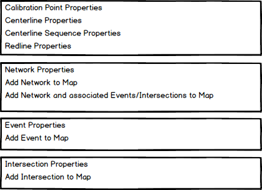

# Add LRS Container to Catalog Window

| Field | Value |
| --- | --- |
| **Doc** | 833 · User Story · Pro |
| **Product** | — |
| **Release** | — |
| **Issues** | — |
| **Source** | [AddLRSContainertoCatalogWindow.pptx](<https://esriis.sharepoint.com/sites/LocationReferencing/Shared%20Documents/General/AddLRSContainertoCatalogWindow.pptx>) |
| **People** | author William Isley · PE — · dev — |
| **Edited** | 2020-02-04 16:31 by Nathan Easley |
| **Extracted** | 2026-09-04 · lane xmlstrip · format 3.0 · prompt v2.0.2 |
| **Keywords** | lrs container · lrs hierarchy · feature dataset · catalog window · context menu · location referencing tab · network properties · event properties · intersection properties |
| **Tools** | — |

## Summary

Describes a user story for adding an LRS Container to the Catalog Window in ArcGIS Pro to view the hierarchy of the LRS and associated networks and events. Details the container behavior, context menu options for LRS components, and testing and documentation requirements.

## Related documents

<!-- related:begin -->
- [LRS Intersection Properties User Story](<https://esriis.sharepoint.com/sites/lrsworkspace/LRS Doc Index/User Stories/lrs-intersection-properties.md>) — similar text 0.25 · same kind/surface/folder <!-- rel:843 s=3.77 -->
- [Linear Referencing Ribbon – Unified Experience](<https://esriis.sharepoint.com/sites/lrsworkspace/LRS Doc Index/User Stories/lr-ribbon-unified-experience.md>) — similar text 0.07 · same kind/surface/folder <!-- rel:42 s=2.894 -->
- [LRS Addressing and Utility Network Properties User Story](<https://esriis.sharepoint.com/sites/lrsworkspace/LRS Doc Index/User Stories/lrs-addressing-and-un-properties.md>) — similar text 0.19 · same kind/surface/folder <!-- rel:190 s=2.801 -->
- [LRS and Gap Calibration Properties User Story](<https://esriis.sharepoint.com/sites/lrsworkspace/LRS Doc Index/User Stories/lrs-and-gap-calibration-properties.md>) — similar text 0.20 · same kind/surface/folder <!-- rel:842 s=2.537 -->
- [Migrate LRS to New GDB Tool](<https://esriis.sharepoint.com/sites/lrsworkspace/LRS Doc Index/User Stories/migrate-lrs-to-new-gdb-tool.md>) — similar text 0.08 · same kind/surface/folder <!-- rel:569 s=2.45 -->
<!-- related:end -->

<!-- docs:begin -->
## Esri documentation

[View the LRS hierarchy](https://doc.esri.com/en/arcgis-pro/latest/help/production/location-referencing-pipelines/view-the-lrs-hierarchy.html) · [Create a template for an LRS feature count data product](https://doc.esri.com/en/arcgis-pro/latest/help/production/roads-highways/create-a-template-for-an-lrs-feature-count-data-product.html) · [View LRS Network properties](https://doc.esri.com/en/arcgis-pro/latest/help/production/location-referencing-pipelines/view-lrs-network-properties.html) · [View LRS event properties](https://doc.esri.com/en/arcgis-pro/latest/help/production/location-referencing-pipelines/view-lrs-event-properties.html) · [View LRS intersection properties](https://doc.esri.com/en/arcgis-pro/latest/help/production/location-referencing-pipelines/view-lrs-intersection-properties.html)
<!-- docs:end -->

---

## Story
### Add LRS Container to Catalog Window <!-- slide 1 -->
User Story

### User Story <!-- slide 2 -->
As a Location Referencing user in Pro, I need to be able to view the hierarchy of the LRS, so I can determine which types of networks exist and which events are associated with each network without having to leave ArcGIS Pro.

## Acceptance Criteria
### LRS Container/LRS Hierarchy <!-- slide 3 -->
- Create an LRS Container that appears within the Feature Dataset when an LRS and LRS Controller Dataset are present
- Do not show if the Controller Dataset isn’t present
- The container will show the name of the LRS and the same icon as used in ArcMap
- When a user double clicks or right clicks the container, open the LRS Hierarchy window
- This window should open in the same manner as the Catalog, GP, or LRS Editing panes
- It should be dock able, non-modal, and remain open until a user closes it
- It should open expanded, but users should be able to collapse the LRS and Networks
- Use our existing icons from ArcMap as a guide, work with Graphics to get new ones created that are in the Pro style
- Consult with the UI/UX team then take the design through integration with the Pro team.

### LRS Container <!-- slide 4 -->
- When a user right clicks the LRS, Networks, Events, or Intersections, open the right click context menu.
  - For LRS, show the CP, CL, CLS, and Redline properties.  When any of them are selected, open the Feature Class/Table properties opened to the Location Referencing tab.
  - For the Network, show three options: Network properties, Add Network to Map, and Add Network and associated Events/Intersections to Map.  When properties is selected, open the Network FC properties opened to the Location Referencing tab.  When Add Network to Map is selected, add the Network FC to the map.  When Add Network and associated Events/Intersections to Map, add the Network and associated Events/Intersections to the map.
  - For the Event, show two options: Event properties, Add Event to Map.  When properties is selected, open the Event FC properties opened to the Location Referencing tab.  When Add Event to Map is selected, add the Event FC to the map.
  - For the Intersection, show two options: Intersection properties, Add Intersection to Map.  When properties is selected, open the Intersection FC properties opened to the Location Referencing tab.  When Add Intersection to Map is selected, add the Intersection FC to the map.
  - Add to the selected map.  If no map is open, add to a new map.  If a layer is already in a map, add it again.

## Testing
<!-- slide 5 -->
- Verify the container only appears when an LRS Controller Dataset is present
- Verify the correct properties for a fc/table are launched to the Loc Ref tab
- Verify the correct layers are added to the map when selected
- Verify the hierarchy docks in the same manner as the LRS Editing window
- Verify the hierarchy doesn’t close or prevent other tools from opening/being executed

## Documentation
<!-- slide 6 -->
- Create a topic about being able to see the hierarchy
- Mention being able to launch the properties as well as being able to add to the map
- Update any screenshots in existing topics that show the catalog window with the new Catalog icon

## Assignment
<!-- slide 7 -->
Story Points:
Dev:
