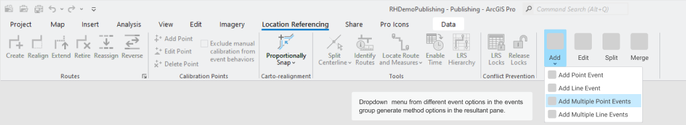
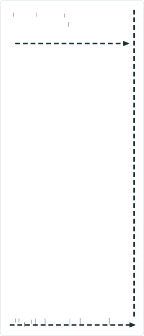
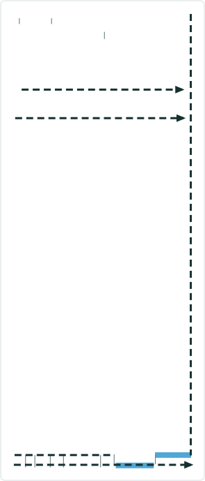
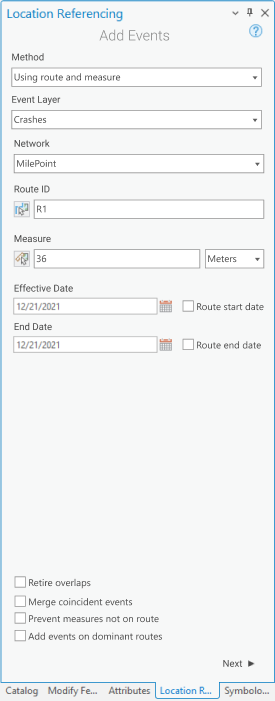
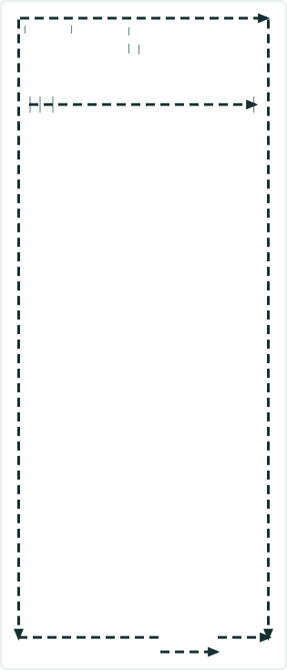
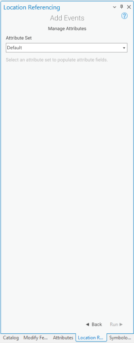
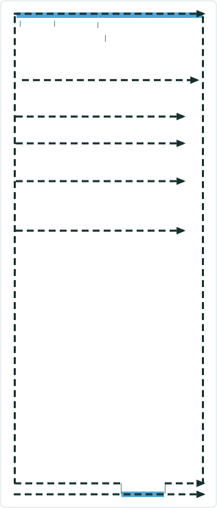
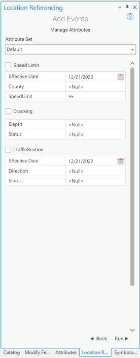

# Add Multiple Point Events tool in ArcGIS Pro

|   |   |
| --- | --- |
| **Kind** | User Story · Pro |
| **Release** | — |
| **Source** | [AddMultiplePointEvent.pptx](<https://esriis.sharepoint.com/sites/LocationReferencing/Shared%20Documents/General/AddMultiplePointEvent.pptx>) |
| **Edited** | 2022-01-21 00:51 by Nathan Easley |
| **Extracted** | 2026-09-04 · lane `xmlstrip` |

<!-- metadata
```yaml
title: "Add Multiple Point Events tool in ArcGIS Pro"
source_file: "AddMultiplePointEvent.pptx"
source_url: "https://esriis.sharepoint.com/sites/LocationReferencing/Shared%20Documents/General/AddMultiplePointEvent.pptx"
doc_id: 685
doc_kind: "User Story"
surface: "Pro"
doc_revision: ""
target_release: ""
pe: ""
dev: ""
author: "William Isley"
last_edited_by: "Nathan Easley"
last_edited: "2022-01-21T00:51:33Z"
extracted: 2026-09-04
extraction_lane: xmlstrip
prompt_version: "v2.0.2"
keywords: ["point event", "route", "measure", "attribute set", "event creation", "lrs editor", "arcgis pro"]
tools: ["Add Multiple Point Events"]
products: []
issues: []
related: [{"doc":686,"file":"add-multiple-line-events-tool-in-arcgis-pro__doc686.md","s":8.349},{"doc":688,"file":"add-single-point-event-tool-in-arcgis-pro__doc688.md","s":7.349},{"doc":687,"file":"add-line-event-tool-in-arcgis-pro__doc687.md","s":6.521},{"doc":272,"file":"add-point-event-point-offset-method__doc272.md","s":5.356},{"doc":495,"file":"add-point-events-in-experience-builder__doc495.md","s":5.135}]
```
-->

## Summary

User story describing the need for an Add Multiple Point Events tool in ArcGIS Pro to allow LRS Editors to add multiple point events at a single location within the application. The tool includes UI workflows for selecting routes, measures, attribute sets, and event creation with validation and error handling. Testing and automation plans are outlined for various network types and scenarios.

## Related documents

<!-- related:begin -->
- [Add Multiple Line Events tool in ArcGIS Pro](<https://esriis.sharepoint.com/sites/lrsworkspace/LRS Doc Index/User Stories/add-multiple-line-events-tool-in-arcgis-pro__doc686.md>) — similar text 0.83 · 5 title words · 3 filename words · same kind/surface/folder <!-- rel:686 -->
- [Add Single Point Event tool in ArcGIS Pro](<https://esriis.sharepoint.com/sites/lrsworkspace/LRS Doc Index/User Stories/add-single-point-event-tool-in-arcgis-pro__doc688.md>) — similar text 0.76 · 4 title words · 3 filename words · same kind/surface/folder <!-- rel:688 -->
- [Add Line Event tool in ArcGIS Pro](<https://esriis.sharepoint.com/sites/lrsworkspace/LRS Doc Index/User Stories/add-line-event-tool-in-arcgis-pro__doc687.md>) — similar text 0.79 · 3 title words · 2 filename words · same kind/surface/folder <!-- rel:687 -->
- [Add Point Event Point Offset Method](<https://esriis.sharepoint.com/sites/lrsworkspace/LRS Doc Index/User Stories/add-point-event-point-offset-method__doc272.md>) — similar text 0.34 · 2 title words · 3 filename words · same kind/surface/folder <!-- rel:272 -->
- [Add Point Events in Experience Builder](<https://esriis.sharepoint.com/sites/lrsworkspace/LRS Doc Index/User Stories/add-point-events-in-experience-builder__doc495.md>) — similar text 0.34 · 3 title words · 3 filename words · same kind/folder <!-- rel:495 -->
<!-- related:end -->

<!-- docs:begin -->
## Esri documentation

[Add multiple point events](https://doc.esri.com/en/arcgis-pro/latest/help/production/roads-highways/add-multiple-point-events.html) · [Split a centerline by measure](https://doc.esri.com/en/arcgis-pro/latest/help/production/location-referencing-pipelines/split-a-centerline-by-measure.html)
<!-- docs:end -->

---

## Slide 1 — Add Multiple Point Events tool in ArcGIS Pro

User Story

## Slide 2 — User Story

As an LRS Editor, I need the capability to add multiple point events at a single location in ArcGIS Pro, so that I can complete entire LRS editing workflows within a single application.

Persona
LRS Editor: This user is responsible for making edits to the LRS.  The edits they need to make come in from field crews/contractors in a variety of formats (shapefiles, engineering drawing, fgdbs).  The LRS Editor is responsible for making the route and event edits based on these documents. As of now, the LRS Editor can edit an event’s shape and location in Pro, but none of the attributes such as Route ID, Route Name, measure and date fields are updated.  We need to build a tool that allows them to create multiple point events at a single location inside of ArcGIS Pro.

## Slide 3 — Add Multiple Point Events (Loc Ref ribbon)


Add a new button to the events section called Add Multiple Point Events. (Note the icons for this tool should have been requested already as part of the Add Point Event user story)

All mockups can be found at https://www.figma.com/file/Y3dXxrZtsLFcObC1PdABxS/Point%2FLine-Event-Editing-UX%2FUI?node-id=97%3A2347



## Slide 4 — Add Multiple Point Events (tool)



When the Add Point Event button is clicked, open the Add Events pane (under the Location Referencing tab)
Default the UI to select “Using Route and Measure” (we’ll add additional methods in later user stories)
When the user clicks Next, transition to the next screen in the pane


## Slide 5 — Add Multiple Point Events (tool)



After transitioning to the next pane, show the Method populated with Route and Measure (disregard the UI mockup, make it a greyed out and unselectable textbox)
By default, show the Event Layer, Network, Route ID, Measure, Effective Date, and End Date parameters
Default the Event Layer to show the first point layer in the LRS enabled service in the map.  Populate the drop down with the other point layers in the service. (No fgdb or direct connect)
Default the LRS Networks to show the LRS Network associated with the default Event Layer selected.  (In a future story we’ll add measure translation and would show all the LRS Networks in the map, but for now just show the one associated with the event selected)
RouteID and Measure should be empty until the user types or using the picker tools to populate
If a user selects either the Route or Measure pickers to interact with the map, ensure the scrolling measures appear when they’re moving their cursor along routes in the map
Default the units in the measure parameter to whatever units the Default LRS Network is in
If the event layer selected belongs to a network with Lines configured, show LineID above the RouteID (it should look like the RouteID textbox and include a picker as well)
If the event layer selected belongs to a network with Route Name configured, show Route Name instead of RouteID (but still have the same look and functionality with a route picker tool)
Allow the user to populate the measure, routeID/name, or lineID first.  If they choose a measure, then populate the routeID/name/lineID automatically based on the measure on the route they selected.  If they choose a routeID/name first and lineID is configured, populate the lineID automatically.



## Slide 6 — Add Multiple Point Events (tool)


If the user clicks a location with the route picker that has more than one route at that location, provide the route selector UI that we use in other route editing tools when they select a location with more than one route (this would also apply to there being no time filter applied to the map and there are multiple time slices of a single route)
If a user types in a RouteID and there are multiple time slices of that route, prompt the user to select which time slice they want to utilize (we can use the picker experience from the point above)
Include an intellisense experience for LineID/RouteID/Name (after the 3rd character is typed, use Locate Route and Measure tool as a guide)
Once a route is selected on the map using the route picker, flash the route 3 times like we do in route editing tools
When a measure on a route is selected on the map using the measure picker, provide a green dot at that location like we do in Realign Route
The Effective Date text box should be populated with the current date
Leave the End Date text box empty
Don’t add the 4 check boxes (Retire Overlaps, Merge Coincident Events, Prevent Measures not on route, and Add events to dominant routes) as we’ll add them in later user stories
When the user clicks Next, transition to the next screen in the pane
Add a back button to this pane in case the user wants to change the method in the future
If there is no LRS enabled service in the map in Pro, don’t show any event or network layers and provide a message that no LRS enabled service is present


## Slide 7 — Add Multiple Point Events (tool)



The next pane should show the attribute sets that are available for the LRS service the network in the previous step came from
Default to whatever the Default attribute set is and show the remaining attribute sets in the drop down



## Slide 8 — Add Multiple Point Events (tool)



When an attribute set is selected, show all the attributes configured for the selected attribute set
Make sure to honor coded value domains, range domains, subtypes, non nullable fields, and default values for any fields where applicable
If the user clicks Back, go back to the previous step (the pane with the RouteID(s), Measures, and Dates)
If the user clicks Run, execute creating the event
Allow the user to change the attribute set in the drop down.  If the attribute set is changed, clear out whatever attributes were shown for the previous attribute set and show the updated fields for the newly selected attribute set.
Note: In the mockup all the event layers are unchecked, that is incorrect.  They should all be checked by default.
If any fields are not populated correctly, do not Run and show an error for the field(s) that need to be updated
Once the operation is complete, transition back to the initial method screen and show a message that the event was successfully created



## Slide 9 — Testing

Test on a variety of network types (Line, NonLine with multifield RouteID, NonLine with singlefield RouteID, NonLine with autogenerated RouteID)
Feature Service testing only (no need to worry about direct connect or fgdb)
Test adding a point events on a variety of route types

  - Normal
  - Gapped (include different gap calibration methods)
  - Loops
  - Lollipops
  - Alpha
  - Branch
  - Vertical
Include various testing scenarios that would invoke a Loc Error
508/i18n testing

## Slide 10 — Automation

Create a few UI test cases for the tool
Add all the test cases for ReadyAPI automation using LRS applyEdits (if the decision is made to go with core applyEdits, then no need to automate as that will be covered by the core editing tool user story)

## Slide 11 — Documentation

Create a new topic called Adding Multiple Point Events (in the same section of the documentation for the previous event editing topics using core tools)
Follow the format of the existing Event Editor topic related to Adding Linear Events via Route and Measure (just substitute that there are point events being created instead of linear events)
Feel free to utilize the same graphics and tables as the Creating Event Features using core tools topic
Once the topic is created, test that is correctly opens from the tool tip on the UI in Pro

## Slide 12 — Assignment

Story Points:
Dev:
PE:
