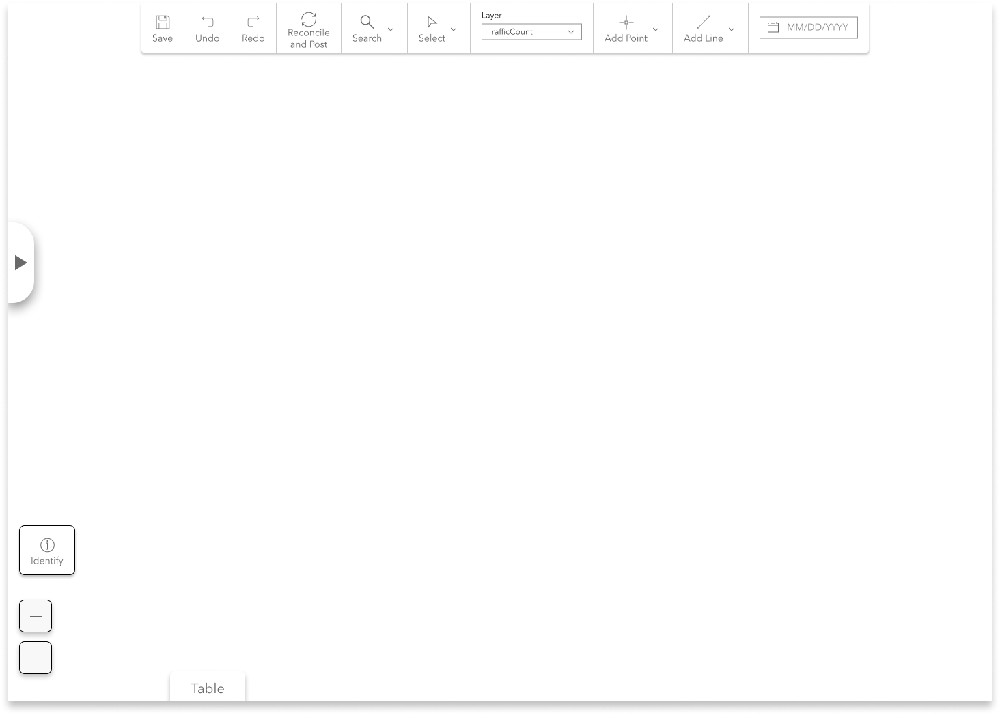
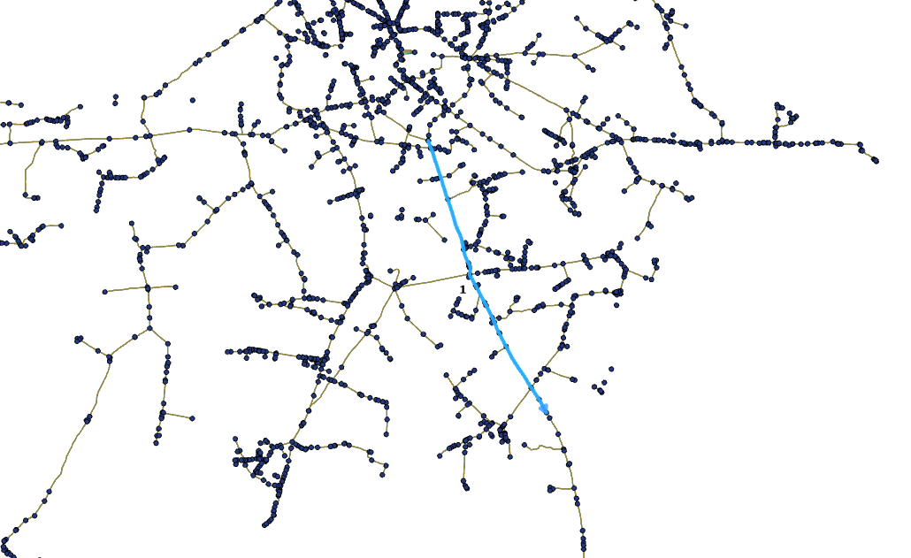
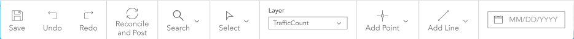
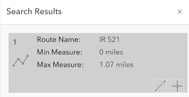
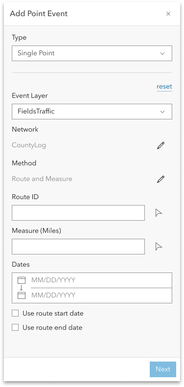

# Add Point Event Experience Builder Widget

| Field | Value |
| --- | --- |
| **Doc** | 497 · User Story · Experience Builder |
| **Product** | — |
| **Release** | — |
| **Issues** | — |
| **Source** | [ExB_AddPointEvents.pptx](<https://esriis.sharepoint.com/sites/LocationReferencing/Shared%20Documents/General/ExB_AddPointEvents.pptx>) |
| **People** | author Praveen Kumar · PE LRS Editor · dev — |
| **Edited** | 2023-09-09 18:05 by Praveen Kumar |
| **Extracted** | 2026-09-04 · lane xmlstrip · format 3.0 · prompt v2.0.2 |
| **Keywords** | point event · event editing · experience builder · route picker · attribute set · configuration |
| **Tools** | Add Point Event |

## Summary

This document describes the user story, configuration, interface, and testing considerations for the Add Point Event widget in Experience Builder. It covers the capabilities needed by LRS Editors to add point events through a web application, configuration options for event layers and attributes, UI behavior, error handling, and testing scenarios. It also includes notes on automation and documentation requirements for the widget.

## Related documents

<!-- related:begin -->
- [Add Point Events in Experience Builder](<https://esriis.sharepoint.com/sites/lrsworkspace/LRS Doc Index/User Stories/add-point-events-in-exb-2023-09.md>) — similar text 0.72 · 4 title words · 3 filename words · same kind/surface/folder <!-- rel:495 s=7.91 -->
- [Add Point Events in Experience Builder](<https://esriis.sharepoint.com/sites/lrsworkspace/LRS Doc Index/User Stories/add-point-events-in-exb-2023-09-2.md>) — similar text 0.72 · 4 title words · 3 filename words · same kind/surface/folder <!-- rel:496 s=7.517 -->
- [Add Line Events User Story for Experience Builder](<https://esriis.sharepoint.com/sites/lrsworkspace/LRS Doc Index/User Stories/add-line-events-for-exb.md>) — similar text 0.70 · 3 title words · 2 filename words · same kind/surface/folder <!-- rel:484 s=6.215 -->
- [User Story Add Line Event (Multiple)](<https://esriis.sharepoint.com/sites/lrsworkspace/LRS Doc Index/User Stories/add-line-event-multiple.md>) — similar text 0.66 · 2 title words · 2 filename words · same kind/surface/folder <!-- rel:480 s=5.869 -->
- [Experience Builder: Add Single Point Event Widget](<https://esriis.sharepoint.com/sites/lrsworkspace/LRS Doc Index/Test Plans/exb-add-single-point-event-widget.md>) — similar text 0.36 · 6 title words · 2 filename words · same surface <!-- rel:463 s=5.719 -->
<!-- related:end -->

<!-- docs:begin -->
## Esri documentation

[Event editing using the attribute table](https://doc.esri.com/en/arcgis-pro/latest/help/production/location-referencing-pipelines/event-editing-using-the-attribute-table.html)

_No page matched:_ [Add Point Event](https://www.google.com/search?q=%22Add%20Point%20Event%22+site%3Adoc.esri.com)
<!-- docs:end -->

---

## Story
### Add Point Event <!-- slide 1 -->
ExB

### User Story <!-- slide 2 -->
As an LRS Editor, I need the capability to add point events in web application configured through experience builder, so that I can complete LRS event editing workflow.

Persona
LRS Editor: This user is responsible for making edits to the LRS.  The edits they need to make come in from field crews/contractors in a variety of formats (shapefiles, engineering drawing, fgdbs).  The LRS Editor is responsible for making the event edits based on these documents. As support to javascript3 is ending,  We need to build an application that allows the users to create point events through a web application.

## Acceptance Criteria
### Configuration <!-- slide 3 -->

### Configuration <!-- slide 4 -->

### Add Point Event <!-- slide 5 -->
Configuration

- If there is no LRS enabled service in the webmap, don’t show any event layers and provide a message that no LRS enabled service is present.
- Should be able to import all the layers from the map using the import all button.
- Should be able to reorder the imported layers.
- Should be able to set the default layer for single point event.
- Should be able to set the default attribute set for multiple point events.
- Should be able to set the default method for adding events.
- Should be able to set the default layer for the Add point event UI
- Provide an error message if there are no point event layers in the list after importing.
- Provide an error message if the networks are not imported.

### Add Point Event <!-- slide 6 -->
Configuration

- Should be able to select any layer, display the layer configuration after its selected.
- Should be able to change the label in the layer configuration.
- Should be able to configure the attribute fields for each event layer to display when adding the event.
- For configure default option should be to use the web map settings.
- For configure fields when customize option is selected, only business fields should be selected to show and edit, LRS fields and System fields should not be selected and listed in the configuration.
- If needed user should be able to select \ unselect the fields to show.
- If needed user should be able to select \ unselect the fields to edit.
- Should be able to reorder the fields in the edit section of configure fields.
- No configuration option for attribute sets (fields to display will be read from attribute set)

### Add Point Event <!-- slide 7 -->
Can be invoked through

  - Button in the home page
  - Button in the search results pane
  - Under Actions in the table

When the widget is opened show the Type, Event Layer, Network, Method, RouteID, Measure and Dates

### Add Point Event <!-- slide 8 -->
- Default option for the Type should be ‘Single Point’
- Event layer selected should be as per the settings from the configuration.
- All other point event layers should be displayed in the dropdown and user should be able to select anyone.
- Network to which the event layer is registered should be displayed automatically.
- Option for Method should be as per the configuration.
- If the LRS Network is configured with RouteName, then show RouteName instead of RouteID.
- For Route ID and Measure fields user should be able to select using the picker or type the values.
- When a route is selected using picker, populate the measure value from that location and vice versa.
- Measure units should be defaulted to the Network units.

### Add Point Event <!-- slide 9 -->
- If the user clicks a location with the route picker that has more than one route at that location, provide the route selector UI (also applicable when no time filter applied to the map and there are multiple time slices of a single route).
- If a user types in a RouteID/Name and there are multiple time slices of that route, prompt the user to select which time slice they want to utilize (we can use the picker experience from the point above).
- Include an intellisense experience for RouteID/Name (after the 3rd character is typed).
- Once a route is selected on the map using the route picker, flash the route 3 times.
- When a measure on a route is selected on the map using the measure picker, provide a green dot and display the measure on the map.
- Default for the start date should be current date (today) and to date as null.
- Display check boxes for Use route start date and Use route end date.
- User should not be able to change the network until the measure translation is not supported.

### Add Point Event <!-- slide 10 -->
- When use route start date is checked, populate the from date with the route start date
- When use route end date is checked, populate the to date with the route end date
- When the Type is Multiple Points do not show event layer and display the ‘Attribute Set’ below the Network.
- Show the option set in the configuration and user should be able to choose any available attribute set using the edit button.
- Provide error messages when the routeid / route name / measures are invalid.
- After providing all the information and clicking on Next button should take to 2nd pane.

### Add Point Event <!-- slide 11 -->
Single point event

- For single point event show the attribute fields as per the configuration settings of the event layer selected.
- User should be able to enter \ edit values for the editable fields.
- Make sure to honor coded value domains, range domains, subtypes, non nullable fields, and default values for any fields where applicable.
- Should be able to copy the attributes from existing feature.

### Add Point Event <!-- slide 12 -->
Multiple point event (Attribute set)

- For Multiple point events show the attribute fields as per the configuration of the selected attribute set.
- User should be able to enter \ edit values for the fields.
- Make sure to honor coded value domains, range domains, subtypes, non nullable fields, and default values for any fields where applicable.
- If the checkbox for any layer \ field is not checked, then do not add \ update those fields \ layer.
- Should be able to copy the attributes from existing feature.

### Add Point Event <!-- slide 13 -->
- If the user clicks Save, execute creating the event and provide a confirmation message.
- Once the operation is complete, transition back to the initial pane.
- If the user clicks Back, go back to the previous step and preserve the entered values.
- If any fields are not populated correctly, do not Run and show an error for the field(s) that need to be updated.
- Provide error messages when the routeid / route name / measures are invalid.

## Testing
<!-- slide 14 -->
- Test on events registered to a variety of network types (Line, NonLine with multifield RouteID, NonLine with singlefield RouteID)
- Test adding a point event on a variety of route types
  - Normal, Gapped (include different gap calibration methods)
  - Complex, and Vertical (can we test vertical routes?)
- Include various testing scenarios that would invoke a Loc Error
- Add a test scenario where an attribute rule is violated and make sure an appropriate error message is returned
- Test on projected and unprojected data.
- 508/i18n testing

## Automation
<!-- slide 15 -->
Follow UI  automation from other experience builder widgets

## Documentation
<!-- slide 16 -->
- Create a documentation topic for this widget that follows the same format used in https://doc.arcgis.com/en/experience-builder/11.1/configure-widgets/widgets-overview.htm
- We’re not sure where this widget will live within that topic at this time (need to confirm with the Experience Builder team), but the topic can at least follow the same format as others
- Make sure to include graphic examples in the doc, use event editor documentation as a guide.
