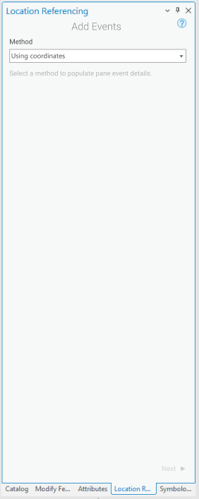
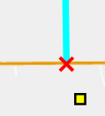
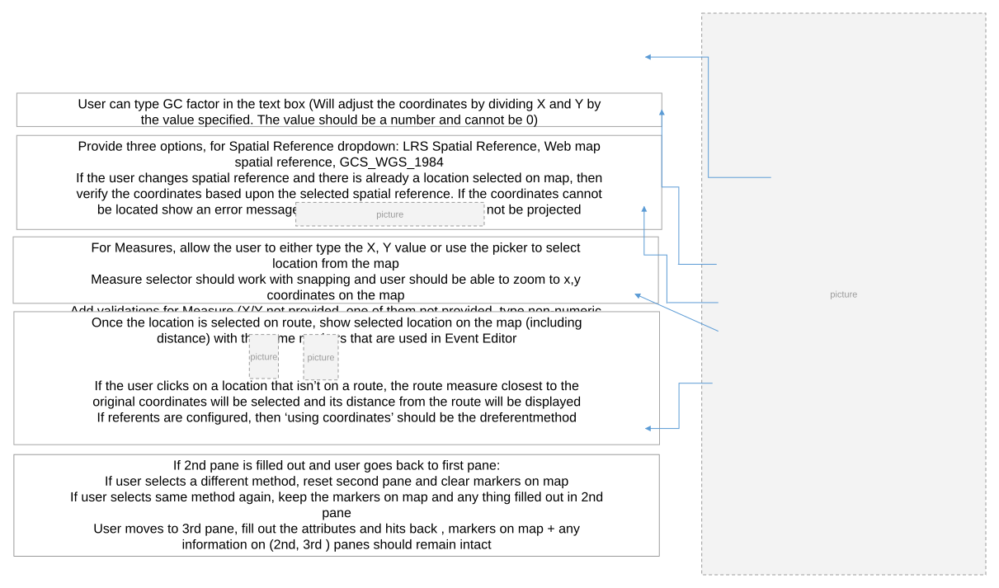

# Add Point Event Tools: Coordinate Offset Method

| Field | Value |
| --- | --- |
| **Doc** | 658 · User Story · Pro |
| **Product** | — |
| **Release** | — |
| **Issues** | — |
| **Source** | [Add Point Events_ Coordinate offset method in Pro - Copy.pptx](<https://esriis.sharepoint.com/sites/LocationReferencing/Shared%20Documents/General/Add%20Point%20Events_%20Coordinate%20offset%20method%20in%20Pro%20-%20Copy.pptx>) |
| **People** | author William Isley · PE — · dev — |
| **Edited** | 2022-06-21 21:34 by Johum Khushk |
| **Extracted** | 2026-09-04 · lane xmlstrip · format 3.0 · prompt v2.0.2 |
| **Keywords** | point event · coordinate offset · add event · spatial reference · validation · map interaction · referent |
| **Tools** | Add Point Event · Add Multiple Point Event · Event Replacement |

## Summary

User story describing the capability for LRS Editors to add point events in ArcGIS Pro using a coordinate offset method. It details UI changes, validation rules, spatial reference options, and map interaction for adding events by coordinates. Testing, automation, and documentation plans for this feature are also outlined.

## Related documents

<!-- related:begin -->
- [Add Line Event Tools: Coordinate Offset Method](<https://esriis.sharepoint.com/sites/lrsworkspace/LRS Doc Index/User Stories/add-line-event-tools-coordinate-offset-method.md>) — similar text 0.77 · 6 title words · 6 filename words · same kind/surface/folder <!-- rel:648 s=10.402 -->
- [Add Point Event Point Offset Method](<https://esriis.sharepoint.com/sites/lrsworkspace/LRS Doc Index/User Stories/add-point-event-point-offset-method.md>) — similar text 0.40 · 5 title words · 4 filename words · same kind/surface/folder <!-- rel:272 s=7.264 -->
- [Add Point Event tool/ Add Multipoint Events tool Coordinate offset method – Test Plan](<https://esriis.sharepoint.com/sites/lrsworkspace/LRS Doc Index/Test Plans/3905-add-point-event-tool-add-multipoint-events-tool-coordinate.md>) — similar text 0.31 · 6 title words · 4 filename words · same surface <!-- rel:638 s=6.918 -->
- [Add Line Events Point Offset Method](<https://esriis.sharepoint.com/sites/lrsworkspace/LRS Doc Index/User Stories/add-line-events-point-offset-method.md>) — similar text 0.36 · 4 title words · 4 filename words · same kind/surface/folder <!-- rel:268 s=6.576 -->
- [Add Event Intersection Offset Method](<https://esriis.sharepoint.com/sites/lrsworkspace/LRS Doc Index/User Stories/add-event-intersection-offset-method.md>) — similar text 0.40 · 4 title words · 3 filename words · same kind/surface/folder <!-- rel:679 s=6.438 -->
<!-- related:end -->

<!-- docs:begin -->
## Esri documentation

[Storing referent and offset information for event location](https://doc.esri.com/en/arcgis-pro/latest/help/production/location-referencing-pipelines/storing-referent-and-offset-information-for-event-location.html)

_No page matched:_ [Add Point Event](https://www.google.com/search?q=%22Add%20Point%20Event%22+site%3Adoc.esri.com) · [Add Multiple Point Event](https://www.google.com/search?q=%22Add%20Multiple%20Point%20Event%22+site%3Adoc.esri.com) · [Event Replacement](https://www.google.com/search?q=%22Event%20Replacement%22+site%3Adoc.esri.com)
<!-- docs:end -->

---

## Story
### Add Point Event Tools: Coordinate Offset Method <!-- slide 1 -->
User Story

### User Story <!-- slide 2 -->
As an LRS Editor, I need the capability to add events in ArcGIS Pro, based on provided co- ordinates, so that I can locate new events from the field that come in via this collection method.

Persona
LRS Editor: This user is responsible for making edits to the LRS. For some users, their event data (for example crashes, traffic count sites) come in as gps x,y coordinates. Using ‘Coordinate offset’ method editor can create point events by typing or selecting x- and y-coordinates.

## Acceptance Criteria
### Add Point Event Tools: Coordinate Offset Method <!-- slide 3 -->
- In the Add Point , Add Multiple Point Event and Event Replacement tools, support a method called ‘Using coordinates’.
- Add this method as a drop-down option to both tools when they’re initially opened.

<!-- slide 4 -->
- After transitioning to the 2nd pane, show the same UI as in the previous user stories, except instead of showing Route and Measure, show ‘Using coordinates’
- Show a label with the method “Using Coordinates” above the RouteID/Name like it is done for Route and Measure method

For Measures, allow the user to either type the X, Y value or use the picker to select location from the map
 Measure selector should work with snapping and user should be able to zoom to x,y coordinates on the map
Add validations for Measure (X/Y not provided, one of them not provided, type non-numeric value)
Provide three options, for Spatial Reference dropdown: LRS Spatial Reference, Web map spatial reference, GCS_WGS_1984
If the user changes spatial reference and there is already a location selected on map, then verify the coordinates based upon the selected spatial reference. If the coordinates cannot be located show an error message upon hover: Coordinates could not be projected

Once the location is selected on route, show selected location on the map (including distance) with the same markers that are used in Event Editor

If the user clicks on a location that isn’t on a route, the route measure closest to the original coordinates will be selected and its distance from the route will be displayed
If referents are configured, then ‘using coordinates’ should be the dreferentmethod

User can type GC factor in the text box (Will adjust the coordinates by dividing X and Y by the value specified. The value should be a number and cannot be 0)
If 2nd pane is filled out and user goes back to first pane:

  - If user selects a different method, reset second pane and clear markers on map
  - If user selects same method again, keep the markers on map and any thing filled out in 2nd pane
User moves to 3rd pane, fill  out the attributes and hits back , markers on map + any information on (2nd, 3rd ) panes should remain intact

### Notes

Add screen shot from EE(showing distance)

<!-- slide 5 -->
- All points mentioned in the previous slide are applicable here as well

## Testing
<!-- slide 6 -->
- Test with both add point event tools (mix and match test cases between the 2 tools)
- Test on a variety of network types (Line, NonLine with multifield RouteID, NonLine with singlefield RouteID, NonLine with autogenerated RouteID)
- Make sure to test with both Projected and Unprojected data
- Feature Service testing only (no testing with direct connect or fgdb)
- Test with variety of route types
  - Normal
  - Gapped (include different gap calibration methods)
  - Loops
  - Lollipops
  - Alpha
  - Branch
  - Vertical
- Test with and without referents configured for an event - confirm that the referent information is populated
- Mix and match with previously available method/s
- Test few cases with conflict prevention
- 508/i18n testing

## Automation
<!-- slide 7 -->
- Create all the cases for REST automation
- Create few cases for test complete (only positive cases)

## Documentation
<!-- slide 8 -->
- Create a new topic called Add Events via coordinate Offset method
- Have three sections (point, line, line spanning)
- Follow the format of the existing Event Editor topic/s (https://enterprise.arcgis.com/de/roads-highways/latest/event-editor/adding-linear-events-by-coordinate-location.htm )

## Assignment
<!-- slide 9 -->
Story Points
Dev:
PE:
