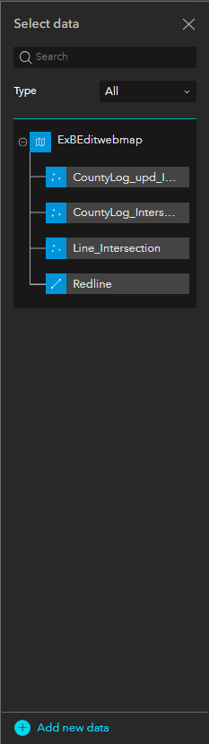
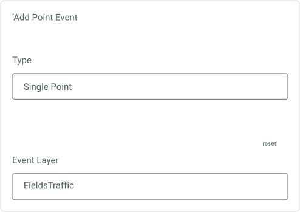
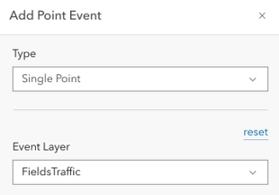
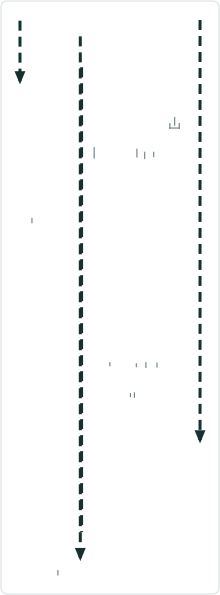
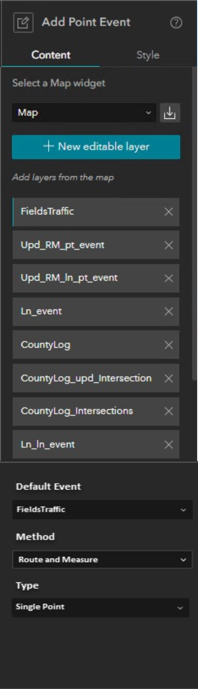
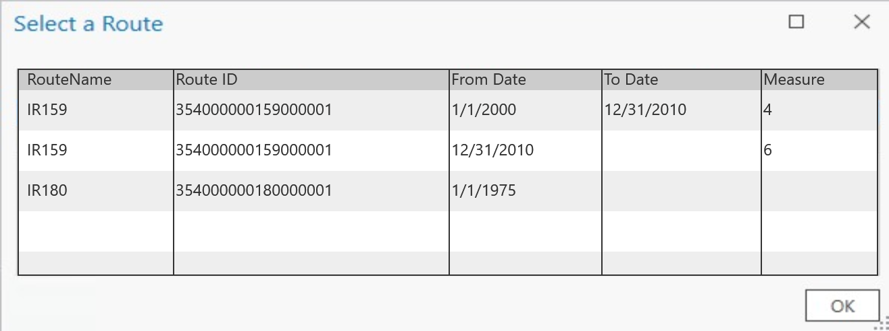

# Add Point Events in Experience Builder

|   |   |
| --- | --- |
| **Kind** | User Story · Experience Builder |
| **Release** | — |
| **Source** | [ExB_AddPointEvents_Single.pptx](<https://esriis.sharepoint.com/sites/LocationReferencing/Shared%20Documents/General/ExB_AddPointEvents_Single.pptx>) |
| **Edited** | 2023-09-12 18:48 by Praveen Kumar |
| **Extracted** | 2026-09-04 · lane `xmlstrip` |

<!-- metadata
```yaml
title: "Add Point Events in Experience Builder"
source_file: "ExB_AddPointEvents_Single.pptx"
source_url: "https://esriis.sharepoint.com/sites/LocationReferencing/Shared%20Documents/General/ExB_AddPointEvents_Single.pptx"
doc_id: 496
doc_kind: "User Story"
surface: "Experience Builder"
doc_revision: ""
target_release: ""
pe: ""
dev: ""
author: "Praveen Kumar"
last_edited_by: "Praveen Kumar"
last_edited: "2023-09-12T18:48:28Z"
extracted: 2026-09-04
extraction_lane: xmlstrip
prompt_version: "v2.0.2"
keywords: ["point event", "event editor", "experience builder", "route picker", "measure picker", "event validation"]
tools: ["Add Point Event"]
products: []
issues: []
related: [{"doc":495,"file":"add-point-events-in-experience-builder__doc495.md","s":8.397},{"doc":484,"file":"add-line-events-user-story-for-experience-builder__doc484.md","s":8.059},{"doc":497,"file":"add-point-event-experience-builder-widget__doc497.md","s":7.517},{"doc":480,"file":"user-story-add-line-event-multiple__doc480.md","s":6.104},{"doc":434,"file":"add-multiple-point-events__doc434.md","s":5.498}]
```
-->

## Summary

User story describing the need for LRS Editors to add point events using a web application configured through Experience Builder. It covers configuration options, user interface behavior, validation rules, testing scenarios, automation guidance, and documentation requirements for the Add Point Event widget.

## Related documents

<!-- related:begin -->
- [Add Point Events in Experience Builder](<https://esriis.sharepoint.com/sites/lrsworkspace/LRS Doc Index/User Stories/add-point-events-in-experience-builder__doc495.md>) — similar text 0.79 · 5 title words · 3 filename words · same kind/surface/folder <!-- rel:495 -->
- [Add Line Events User Story for Experience Builder](<https://esriis.sharepoint.com/sites/lrsworkspace/LRS Doc Index/User Stories/add-line-events-user-story-for-experience-builder__doc484.md>) — similar text 0.80 · 4 title words · 3 filename words · same kind/surface/folder <!-- rel:484 -->
- [Add Point Event Experience Builder Widget](<https://esriis.sharepoint.com/sites/lrsworkspace/LRS Doc Index/User Stories/add-point-event-experience-builder-widget__doc497.md>) — similar text 0.72 · 4 title words · 3 filename words · same kind/surface/folder <!-- rel:497 -->
- [User Story Add Line Event (Multiple)](<https://esriis.sharepoint.com/sites/lrsworkspace/LRS Doc Index/User Stories/user-story-add-line-event-multiple__doc480.md>) — similar text 0.72 · 1 title word · 2 filename words · same kind/surface/folder <!-- rel:480 -->
- [Add Multiple Point Events](<https://esriis.sharepoint.com/sites/lrsworkspace/LRS Doc Index/Test Plans/add-multiple-point-events__doc434.md>) — similar text 0.37 · 3 title words · 3 filename words · same surface <!-- rel:434 -->
<!-- related:end -->

<!-- docs:begin -->
## Esri documentation

_No page matched:_ [Add Point Event](https://www.google.com/search?q=%22Add%20Point%20Event%22+site%3Adoc.esri.com)
<!-- docs:end -->

---

## Slide 1 — User Story

As an LRS Editor, I need to add point events in web application configured through experience builder, so that I can complete LRS event editing workflow.

Persona
Event Editor: These users are responsible for making edits to route characteristics and assets.  Typically located in different business units/departments than the LRS route editors, these users have varied GIS experience, but a high level of knowledge about the characteristics they maintain (safety, pavement, crashes, etc.)  These users need to be able to add point events using a web application.
Add Point Event

## Slide 2 — Add Point Event


ExB


## Slide 3 — Configuration



## Slide 4 — Configuration






## Slide 5 — Add Point Event



Configuration

- If there is no LRS enabled service in the webmap, don’t show any event layers and provide a message that no LRS enabled service is present.
- Should be able to import all the layers from the map using the import all button.
- Should be able to add any missing layer using the  ‘New editable Layer’ option.
- Should be able to reorder the imported layers.
- Allow only importing from a single map (if another map is chosen then clear the present layers before importing layers from different map).
- Provide an error message if there are no point event layers in the list after importing.
- Provide an error message if the network is not imported for the events (registered network for the events imported).
- Provide a message if the map has layers from more than one service.



## Slide 6 — Add Point Event

Configuration

- Should be able to set the default layer for single point event.
- Should be able to set the default type.
- Should be able to set the default method for adding events.
- Should be able to select any layer, display the layer configuration after its selected.
- Should be able to change the label in the layer configuration.
- Should be able to configure the attribute fields for each event layer to display when adding the event.
- For configure fields show only customize option, only business fields should be selected to show and edit, LRS fields and System fields should not be selected and listed in the configuration.
- If needed user should be able to select \ unselect the fields to show.
- If needed user should be able to select \ unselect the fields to edit.
- Should be able to reorder the fields in the edit section of configure fields.

## Slide 7 — Add Point Event


- Type should be as per the settings from the configuration.
- Event layer selected should be as per the settings from the configuration.
- All other point event layers should be displayed in the dropdown and user should be able to select anyone.
- The order of the layers displayed in the dropdown should match with the order set in the configuration.
- Network to which the event layer is registered should be displayed automatically.
- Option for Method should be as per the configurationand allow user to change to any other available method using the edit button (pencil).
- If the LRS Network is configured with RouteName, then show RouteName instead of RouteID.
- For Route ID and Measure fields user should be able to select using the picker or type the values.
- When a route is selected using picker, populate the measure value from that location and vice versa.


## Slide 8 — Add Point Event


- If the user clicks a location with the route picker that has more than one route at that location, provide the route selector UI (also applicable when no time filter applied to the map and there are multiple time slices of a single route).
- If a user types in a RouteID/Name and there are multiple time slices of that route, prompt the user to select which time slice they want to utilize (we can use the picker experience from the point above).
- Routes listed in the selector should be filtered based on the timeline settings of the map.
- Measure units should be defaulted to the Network units and the no of decimal places to display should be as per the tolerance of the network.
- Once a route is selected on the map using the route picker, flash the route 3 times.
- When a measure on a route is selected on the map using the measure picker, provide a green dot and display the measure on the map.
- User should not be able to change the network until the measure translation is supported (disable the pencil).

 

## Slide 9 — Add Point Event

- Default for the start date should be current date (today) and to date as null.
- Display check boxes for Use route start date and Use route end date.
- When use route start date is checked, populate the from date with the route start date
- When use route end date is checked, populate the to date with the route end date
- After providing all the information and clicking on Next button should take to 2nd pane.
- Always enable snapping while using the route \ measure pickers
- When user clicks on reset, clear user entered values and bring it to initial loading state.

## Slide 10 — Add Point Event


Single point event

- For single point event show the attribute fields as per the configuration settings of the event layer selected.
- User should be able to enter \ edit values for the editable fields.
- Make sure to honor coded value domains, range domains, subtypes, non nullable fields, attribute rules, contingent values and default values for any fields where applicable.
- If the user clicks Save, execute creating the event and provide a confirmation message.
- Once the operation is complete, transition back to the initial pane.
- If the user clicks Back, go back to the previous step and preserve the entered values.
- If any fields are not populated correctly, do not Run and show an error for the field(s) that need to be updated.

 

## Slide 11 — Add Point Event

- Provide error message when the user click Next without filling routeid.
- Provide error message when the user click Next without filling measure.
- Provide error message when the user click Next without filling the from date.
- Provide error messages when the routeid / route name / measures are invalid.
- Provide error messages when from date is less than or equal to the to date.
- Validate the routeid \ routename\ measure exists in the provided date.
- Provide error messages when the user clicks at a location where no route exists.

## Slide 12 — Testing

- Test on events registered to a variety of network types (Line, NonLine with multifield RouteID, NonLine with singlefield RouteID)
- Test adding a point event on a variety of route types
  - Normal, Gapped (include different gap calibration methods)
  - Complex, and Vertical (can we test vertical routes?)
- Include various testing scenarios that would invoke a Loc Error
- Add a test scenario where an attribute rule is violated and make sure an appropriate error message is returned
- Test on projected and unprojected data.
- 508/i18n testing
- Test on different themes

## Slide 13 — Automation

Follow UI  automation from other experience builder widgets

## Slide 14 — Documentation

- Create a documentation topic for this widget that follows the same format used in https://doc.arcgis.com/en/experience-builder/11.1/configure-widgets/widgets-overview.htm
- We’re not sure where this widget will live within that topic at this time (need to confirm with the Experience Builder team), but the topic can at least follow the same format as others
- Make sure to include graphic examples in the doc, use event editor documentation as a guide.

## Slide 15 — Assignment

Story Points: 20
Dev:
PE:
