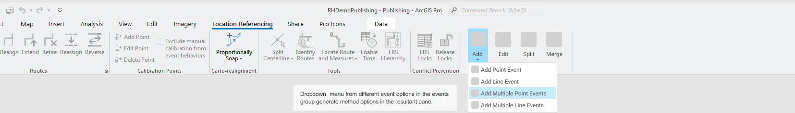
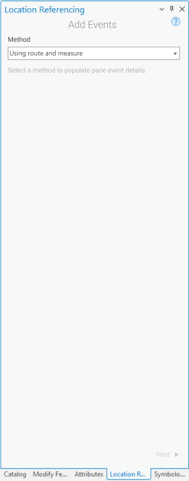

# Add Single Point Event tool in ArcGIS Pro

| Field | Value |
| --- | --- |
| **Doc** | 688 · User Story · Pro |
| **Product** | — |
| **Release** | — |
| **Issues** | — |
| **Source** | [AddSinglePointEvent.pptx](<https://esriis.sharepoint.com/sites/LocationReferencing/Shared%20Documents/General/AddSinglePointEvent.pptx>) |
| **People** | author William Isley · PE — · dev — |
| **Edited** | 2022-01-19 17:56 by Nathan Easley |
| **Extracted** | 2026-09-04 · lane xmlstrip · format 3.0 · prompt v2.0.2 |
| **Keywords** | point event · route id · measure · location referencing ribbon · event layer · route picker · effective date · loc error · validation · testing · automation · documentation |
| **Tools** | Add Point Event |

## Summary

Describes the user story for adding a point event in ArcGIS Pro within the Location Referencing ribbon. Details the UI workflow, validation, testing scenarios, automation plans, and documentation requirements for the Add Point Event tool. Focuses on enabling LRS Editors to complete event edits including route and measure attributes in a single application.

## Related documents

<!-- related:begin -->
- [Add Line Event tool in ArcGIS Pro](<https://esriis.sharepoint.com/sites/lrsworkspace/LRS Doc Index/User Stories/add-line-event-tool-in-pro.md>) — similar text 0.74 · 4 title words · 3 filename words · same kind/surface/folder <!-- rel:687 s=8.932 -->
- [Add Multiple Point Events tool in ArcGIS Pro](<https://esriis.sharepoint.com/sites/lrsworkspace/LRS Doc Index/User Stories/add-multiple-point-events-tool-in-pro.md>) — similar text 0.76 · 4 title words · 3 filename words · same kind/surface/folder <!-- rel:685 s=7.349 -->
- [Add Multiple Line Events tool in ArcGIS Pro](<https://esriis.sharepoint.com/sites/lrsworkspace/LRS Doc Index/User Stories/add-multiple-line-events-tool-in-pro.md>) — similar text 0.73 · 3 title words · 2 filename words · same kind/surface/folder <!-- rel:686 s=6.197 -->
- [Add Point Event Point Offset Method](<https://esriis.sharepoint.com/sites/lrsworkspace/LRS Doc Index/User Stories/add-point-event-point-offset-method.md>) — similar text 0.32 · 3 title words · 3 filename words · same kind/surface/folder <!-- rel:272 s=5.658 -->
- [Add Point Events in Experience Builder](<https://esriis.sharepoint.com/sites/lrsworkspace/LRS Doc Index/User Stories/add-point-events-in-exb-2023-09-2.md>) — similar text 0.33 · 2 title words · 3 filename words · same kind/folder <!-- rel:496 s=5.139 -->
<!-- related:end -->

<!-- docs:begin -->
## Esri documentation

[Split a centerline by measure](https://doc.esri.com/en/arcgis-pro/latest/help/production/location-referencing-pipelines/split-a-centerline-by-measure.html)

_No page matched:_ [Add Point Event](https://www.google.com/search?q=%22Add%20Point%20Event%22+site%3Adoc.esri.com)
<!-- docs:end -->

---

## Story
### Add Single Point Event tool in ArcGIS Pro <!-- slide 1 -->
User Story

### User Story <!-- slide 2 -->
As an LRS Editor, I need the capability to add a point event in ArcGIS Pro, so that I can complete entire LRS editing workflows within a single application.

Persona
LRS Editor: This user is responsible for making edits to the LRS.  The edits they need to make come in from field crews/contractors in a variety of formats (shapefiles, engineering drawing, fgdbs).  The LRS Editor is responsible for making the route and event edits based on these documents. As of now, the LRS Editor can edit an event’s shape and location in Pro, but none of the attributes such as Route ID, Route Name, measure and date fields are updated.  We need to build a tool that allows them to create a point event inside of ArcGIS Pro.

## Acceptance Criteria
### Add Single Point event (Loc Ref ribbon) <!-- slide 3 -->
- Add a section to the Location Referencing ribbon called Events.  Add a new button to the section called Add Point Event. (Note we’ll eventually add 3 additional tools, Add Line Event, Add Multiple Point Events, and Add Multiple Line Events so go ahead and request icons for all 4 tools)
- These 4 tools should behave similarly to the Split Centerline experience we have on the ribbon.  One tool shows up on the ribbon and a user can select that tool by clicking the icon.  If they want to open one of the other tools, they need to click the arrow section to get the drop down list.  Whatever tool is selected will open and it’s icon becomes the one that appears on the ribbon.
- Disregard the Edit, Split, and Merge buttons for now, just focus on creating the Add Point Event button
- All mockups can be found at https://www.figma.com/file/Y3dXxrZtsLFcObC1PdABxS/Point%2FLine-Event-Editing-UX%2FUI?node-id=97%3A2347

### Add Single Point event (tool) <!-- slide 4 -->
- When the Add Point Event button is clicked, open the Add Events pane (under the Location Referencing tab)
- Default the UI to select “Using Route and Measure” (we’ll add additional methods in later user stories)
- When the user clicks Next, transition to the next screen in the pane

### Add Single Point event (tool) <!-- slide 5 -->
- After transitioning to the next pane, show the Method populated with Route and Measure (disregard the UI mockup, make it a greyed out and unselectable textbox)
- By default, show the Event Layer, Network, Route ID, Measure, Effective Date, and End Date parameters
- Default the Event Layer to show the first point layer in the LRS enabled service in the map.  Populate the drop down with the other point layers in the service.
- Default the LRS Networks to show the LRS Network associated with the default Event Layer selected.  (In a future story we’ll add measure translation and would show all the LRS Networks in the map, but for now just show the one associated with the event selected)
- RouteID and Measure should be empty until the user types or using the picker tools to populate
- If a user selects either the Route or Measure pickers to interact with the map, ensure the scrolling measures appear when they’re moving their cursor along routes in the map
- Default the units in the measure parameter to whatever units the Default LRS Network is in
- If the event layer selected belongs to a network with Lines configured, show LineID above the RouteID (it should look like the RouteID textbox and include a picker as well)
- If the event layer selected belongs to a network with Route Name configured, show Route Name instead of RouteID (but still have the same look and functionality with a route picker tool)
- Allow the user to populate the measure, routeID/name, or lineID first.  If they choose a measure, then populate the routeID/name/lineID automatically based on the measure on the route they selected.  If they choose a routeID/name first and lineID is configured, populate the lineID automatically.

### Add Single Point event (tool) <!-- slide 6 -->
- If the user clicks a location with the route picker that has more than one route at that location, provide the route selector UI that we use in other route editing tools when they select a location with more than one route
- Once a route is selected on the map using the route picker, flash the route 3 times like we do in route editing tools
- When a measure on a route is selected on the map using the measure picker, provide a green dot at that location like we do in Realign Route
- Once a RouteID is selected, populate the Effective Date text box with the From Date of the route selected
- Leave the End Date text box empty less the route selected has a To Date populated
- Don’t add the 4 check boxes (Retire Overlaps, Merge Coincident Events, Prevent Measures not on route, and Add events to dominant routes) as we’ll add them in later user stories
- When the user clicks Next, transition to the next screen in the pane

### Add Single Point event (tool) <!-- slide 7 -->
- The next pane should show the non-LRS and non-system attributes for the event layer selected in the previous step
- Make sure to honor coded value domains, range domains, subtypes, non nullable fields, and default values for any fields where applicable
- If the user clicks Back, go back to the previous step
- If the user clicks Run, execute creating the event
- If any fields are not populated correctly, do not Run and show an error for the field(s) that need to be updated
- Once the operation is complete, transition back to the initial method screen and show a message that the event was successfully created

### Loc Errors <!-- slide 8 -->
- In order to prevent some of the common LocErrors, we should do some validation in the UI before executing the operation
  - Validate the RouteID/Measure/Date combination to prevent RouteNotFound and Partial Match errors
  - If there is an error with one or more of the parameters, like a RouteID that is invalid, we should provide an error in the tool UI like we do for similar errors in other editing tools we support in Pro

## Testing
<!-- slide 9 -->
- Test on a variety of network types (Line, NonLine with multifield RouteID, NonLine with singlefield RouteID, NonLine with autogenerated RouteID)
- Feature Service testing only (no need to worry about direct connect or fgdb)
- Test adding a point event on a variety of route types
  - Normal
  - Gapped (include different gap calibration methods)
  - Loops
  - Lollipops
  - Alpha
  - Branch
  - Vertical
- Include various testing scenarios that would invoke a Loc Error

## Automation
<!-- slide 10 -->
Create a few UI test cases for the tool
Add all the test cases for ReadyAPI automation using LRS applyEdits

## Documentation
<!-- slide 11 -->
Create a new topic called Adding Point Events (in the same section of the documentation for the previous event editing topics using core tools)
Follow the format of the existing Event Editor topic related to Adding Point Events via Route and Measure
Feel free to utilize the same graphics and tables as the Creating Event Features using core tools topic

## Assignment
<!-- slide 12 -->
Story Points:
Dev:
PE:
