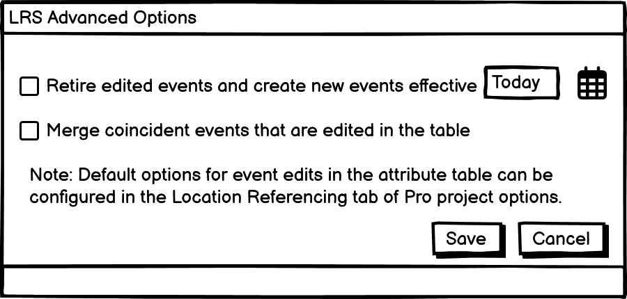

# Advanced Table Editing Options in ArcGIS Pro

|   |   |
| --- | --- |
| **Kind** | User Story · Pro |
| **Release** | — |
| **Source** | [AdvancedTableEditingOptionsPro.pptx](<https://esriis.sharepoint.com/sites/LocationReferencing/Shared%20Documents/General/AdvancedTableEditingOptionsPro.pptx>) |
| **Edited** | 2024-05-15 21:05 by Nathan Easley |
| **Extracted** | 2026-09-04 · lane `xmlstrip` |

<!-- metadata
```yaml
title: "Advanced Table Editing Options in ArcGIS Pro"
source_file: "AdvancedTableEditingOptionsPro.pptx"
source_url: "https://esriis.sharepoint.com/sites/LocationReferencing/Shared%20Documents/General/AdvancedTableEditingOptionsPro.pptx"
doc_id: 369
doc_kind: "User Story"
surface: "Pro"
doc_revision: ""
target_release: ""
pe: ""
dev: ""
author: "William Isley"
last_edited_by: "Nathan Easley"
last_edited: "2024-05-15T21:05:20Z"
extracted: 2026-09-04
extraction_lane: xmlstrip
prompt_version: "v2.0.2"
keywords: ["event editing", "attribute table", "retire events", "merge events", "time slicing", "dynamic segmentation", "location referencing options"]
tools: []
products: []
issues: []
related: [{"doc":492,"file":"spike-advanced-table-editing-options-in-pro__doc492.md","s":5.958},{"doc":336,"file":"advanced-editing-options-test-plan__doc336.md","s":4.909},{"doc":371,"file":"reorganize-location-referencing-pro-options__doc371.md","s":4.325},{"doc":318,"file":"event-editing-using-the-attribute-table__doc318.md","s":3.32},{"doc":370,"file":"add-line-event-to-dominant-route-in-arcgis-pro__doc370.md","s":3.224}]
```
-->

## Summary

This document describes a user story for event editors who need advanced table editing options in ArcGIS Pro to retire and merge coincident events when updating attributes. It outlines requirements for prompting users with options to retire edited events and merge coincident events, configuration settings in Location Referencing options, and testing scenarios. It also covers documentation updates and considerations for UI automation.

## Related documents

<!-- related:begin -->
- [Spike: Advanced Table Editing options in Pro](<https://esriis.sharepoint.com/sites/lrsworkspace/LRS Doc Index/Design Spikes/spike-advanced-table-editing-options-in-pro__doc492.md>) — similar text 0.20 · 5 title words · 4 filename words · same surface/folder <!-- rel:492 -->
- [Advanced Editing Options Test Plan](<https://esriis.sharepoint.com/sites/lrsworkspace/LRS Doc Index/Test Plans/advanced-editing-options-test-plan__doc336.md>) — similar text 0.17 · 3 title words · 4 filename words · same surface <!-- rel:336 -->
- [Reorganize Location Referencing Pro options](<https://esriis.sharepoint.com/sites/lrsworkspace/LRS Doc Index/User Stories/reorganize-location-referencing-pro-options__doc371.md>) — similar text 0.21 · 2 title words · 2 filename words · same kind/surface/folder <!-- rel:371 -->
- [Event Editing Using the Attribute Table](<https://esriis.sharepoint.com/sites/lrsworkspace/LRS Doc Index/Other/event-editing-using-the-attribute-table__doc318.md>) — similar text 0.15 · 2 title words · 2 filename words · same surface <!-- rel:318 -->
- [Add Line Event to Dominant Route in ArcGIS Pro](<https://esriis.sharepoint.com/sites/lrsworkspace/LRS Doc Index/User Stories/add-line-event-to-dominant-route-in-arcgis-pro__doc370.md>) — similar text 0.24 · 1 title word · 1 filename word · same kind/surface/folder <!-- rel:370 -->
<!-- related:end -->

<!-- docs:begin -->
## Esri documentation

[Event editing using the attribute table](https://doc.esri.com/en/arcgis-pro/latest/help/production/location-referencing-pipelines/event-editing-using-the-attribute-table.html) · [Event behavior for route retirement](https://doc.esri.com/en/arcgis-pro/latest/help/production/location-referencing-pipelines/event-behavior-for-route-retirement.html) · [Apply dynamic segmentation](https://doc.esri.com/en/arcgis-pro/latest/help/production/location-referencing-pipelines/apply-dynamic-segmentation.html) · [Set Location Referencing options](https://doc.esri.com/en/arcgis-pro/latest/help/production/location-referencing-pipelines/set-location-referencing-options.html)
<!-- docs:end -->

---

## Slide 1 — Advanced Table Editing options in ArcGIS Pro

User Story
ArcGIS Pro

## Slide 2 — User Story

As an event editor, I need to have events retire and/or merge with coincident events when updating attributes, so that I reduce the number of event records within each event and automatically have time slicing applied.
Persona
Event Editor: These users are responsible for making edits to route characteristics and assets.  Typically located in different business units/departments than the LRS route editors, these users have varied GIS experience, but a high level of knowledge about the characteristics they maintain (safety, pavement, crashes, etc.).  At many DoTs that have historically done event editing via tables, they want to continue to do event editing in the Attribute Table.  They want options to automatically time slice events when attributes are updated as well as to automatically merge coincident events to streamline their workflows and reduce additional non-tabular based operations as part of their everyday work.

## Slide 3 — Requirements

When an LRS event that was edited within the Pro attribute table is saved, prompt the user with LRS advanced options (Retire edited events and create new events effective <date> and Merge coincident events that are edited)
This experience should appear in a modular window that overrides the applying edits message/window that appears
Allow the user to choose which option(s) they want to apply for each edit
If the Retire edited events… option is checked, ensure the user populates a date before clicking save
Default to today’s date (unless a default is configured in Location Referencing options, see next slide)
Only apply this retire option for event records with non LRS attributes updated
When saved, time slice any event record(s) that were edited so there is a before record with a to date matching the Retire edited events option… and an after record with the from date matching the date in the Retire edited events option with the update attributes
If the Merge coincident events… option is checked, determine whether any of the edited events (both LRS and non LRS attributes) can be merged with coincident events (both in measure and time) when saved
When saved, the options would be applied client side and the current core apply edits operation would continue to be utilized (see option 3 in the spike results)
Note the retire option would not be applied to a new event record (i.e. a user adds a record that is completely new and doesn’t have a shape).  The merge option could still be applied in this case.



## Slide 4 — Requirements

In the Location Referencing Options in Pro, add three values above Merge coincident events in the dynamic segmentation table

  - Retire edited events and create new events effective <date> in the attribute table (Provide an experience/option for the user to select today’s date so it will be carried into the next day when the Pro project is reopened)
  - Merge coincident events that are edited in the attribute table
  - Automatically apply these options when editing in the attribute table and don’t prompt me
Consider grouping these in some way so the user will understand the Automatically apply option is related to the other two options only

## Slide 5 — Testing

Test with point, line, and spanning event types
Test with a mix of scenarios where you change non LRS and LRS attributes in events
Test scenarios where the default from the Pro options is overridden
Test a scenario where a new event is added via the attribute table
Test a scenario where a middle event is changed so that it would merge with the adjacent events on both ends
Test with the project being closed and reopened the next day to ensure the current date is changed

## Slide 6 — Automation

Do we need to add UI automation for these cases?

## Slide 7 — Documentation

Add information about these options in the Event editing using the attribute table topic
Make sure to mention these new options, how they can be configured to default within the Pro options and will prompt each time an event edit is saved in the attribute table (unless configured to not appear).
Also update the Set Location Referencing options topic to mention these new options (and link them back to the event editing in the attribute table topic)
Also update the screenshot of the Location Referencing options

## Slide 8 — Story Points

Story Points:
Dev:
PE:
