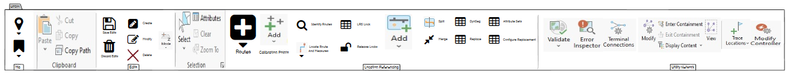

# Combined APR-UN Ribbon User Story

|   |   |
| --- | --- |
| **Kind** | User Story · Pro |
| **Release** | UPDM 2023 |
| **Product** | Pipeline Referencing · Utility Network |
| **Issue** | [ArcGISPro/ps-location-referencing#4958](https://devtopia.esri.com/ArcGISPro/ps-location-referencing/issues/4958) |
| **Source** | [4958-CombinedAPR-UNRibbon_UserStory_V1.pptx](<https://esriis.sharepoint.com/sites/LocationReferencing/Shared%20Documents/General/4958-CombinedAPR-UNRibbon_UserStory_V1.pptx>) |
| **Edited** | 2023-03-01 00:00 by Mac Christmas |
| **Extracted** | 2026-09-04 · lane `xmlstrip` |

<!-- metadata
```yaml
title: "Combined APR-UN Ribbon User Story"
source_file: "4958-CombinedAPR-UNRibbon_UserStory_V1.pptx"
source_url: "https://esriis.sharepoint.com/sites/LocationReferencing/Shared%20Documents/General/4958-CombinedAPR-UNRibbon_UserStory_V1.pptx"
doc_id: 606
doc_kind: "User Story"
surface: "Pro"
doc_revision: "V1"
target_release: "UPDM 2023"
pe: ""
dev: ""
author: "Mac Christmas"
last_edited_by: "Mac Christmas"
last_edited: "2023-03-01T00:00:39Z"
extracted: 2026-09-04
extraction_lane: xmlstrip
prompt_version: "v2.0.2"
keywords: ["combined ribbon", "utility network", "location referencing", "route editing", "event editing", "conflict prevention", "arcgis pro ribbon", "add-in"]
tools: ["Location Referencing Tab", "Route Editing", "CP Editing", "Event Editing", "Identify Routes", "Locate Route and Measure", "Conflict Prevention", "Validate", "Error Inspector", "Terminal Connections", "Associations", "Modify Controller", "Trace", "Clipboard", "Save", "Features", "Selection", "Modification Tools", "Elevation", "Explore", "Bookmarks"]
products: ["Pipeline Referencing", "Utility Network"]
issues: ["ArcGISPro/ps-location-referencing#4958"]
related: [{"doc":596,"file":"create-combined-apr-un-pro-ribbon-add-in-test-plan__doc596.md","s":1004.417},{"doc":633,"file":"spike-combined-apr-un-pro-ribbon__doc633.md","s":4.961},{"doc":566,"file":"unified-pipeline-tools-add-in__doc566.md","s":4.484},{"doc":869,"file":"add-event-spanning-route-examples-in-apr-event-behavior-document__doc869.md","s":3.148},{"doc":506,"file":"support-running-aeb-generate-routes-and-derive-event-measures-as-a-single__doc506.md","s":3.029}]
```
-->

## Summary

User story for combining all important APR, Utility Network, Map, Selection, and Editing tab tools into a single tab on the ArcGIS Pro ribbon to streamline workflows for LRS and Utility Network editors. The document outlines the need, personas, tools to include, testing criteria, and documentation updates for the new combined ribbon tab add-in.

## Related documents

<!-- related:begin -->
- [Create combined APR-UN Pro ribbon add-in – Test Plan](<https://esriis.sharepoint.com/sites/lrsworkspace/LRS Doc Index/Test Plans/create-combined-apr-un-pro-ribbon-add-in-test-plan__doc596.md>) — shared issue ArcGISPro/ps-location-referencing#4958 · similar text 0.33 · 3 title words · same surface <!-- rel:596 -->
- [Spike: Combined APR-UN Pro Ribbon](<https://esriis.sharepoint.com/sites/lrsworkspace/LRS Doc Index/Design Spikes/spike-combined-apr-un-pro-ribbon__doc633.md>) — similar text 0.20 · 3 title words · 2 filename words · same surface/folder <!-- rel:633 -->
- [Unified Pipeline Tools add-in](<https://esriis.sharepoint.com/sites/lrsworkspace/LRS Doc Index/Other/unified-pipeline-tools-add-in__doc566.md>) — similar text 0.19 · same surface <!-- rel:566 -->
- [Add Event Spanning Route Examples in APR Event Behavior Document](<https://esriis.sharepoint.com/sites/lrsworkspace/LRS Doc Index/User Stories/add-event-spanning-route-examples-in-apr-event-behavior-document__doc869.md>) — similar text 0.06 · 1 title word · 1 filename word · same kind/surface/folder <!-- rel:869 -->
- [Support Running AEB, Generate Routes, and Derive Event Measures as a Single Operation via the LR Pro Ribbon](<https://esriis.sharepoint.com/sites/lrsworkspace/LRS Doc Index/User Stories/support-running-aeb-generate-routes-and-derive-event-measures-as-a-single__doc506.md>) — similar text 0.18 · 1 title word · same kind/surface/folder <!-- rel:506 -->
<!-- related:end -->

<!-- docs:begin -->
## Esri documentation

[Edit feature services](https://doc.esri.com/en/arcgis-pro/latest/help/production/location-referencing-pipelines/edit-feature-services.html) · [Event editing using the attribute table](https://doc.esri.com/en/arcgis-pro/latest/help/production/location-referencing-pipelines/event-editing-using-the-attribute-table.html) · [Conflict prevention](https://doc.esri.com/en/arcgis-pro/latest/help/production/location-referencing-pipelines/conflict-prevention.html) · [View utility network feature class properties](https://doc.esri.com/en/arcgis-pro/latest/help/production/location-referencing-pipelines/view-utility-network-feature-class-properties.html) · [Set Location Referencing options](https://doc.esri.com/en/arcgis-pro/latest/help/production/location-referencing-pipelines/set-location-referencing-options.html) · [Add calibration points](https://doc.esri.com/en/arcgis-pro/latest/help/production/location-referencing-pipelines/add-calibration-points.html)

_No page matched:_ [Location Referencing Tab](https://www.google.com/search?q=%22Location%20Referencing%20Tab%22+site%3Adoc.esri.com) · [Route Editing](https://www.google.com/search?q=%22Route%20Editing%22+site%3Adoc.esri.com) · [Identify Routes](https://www.google.com/search?q=%22Identify%20Routes%22+site%3Adoc.esri.com) · [Locate Route and Measure](https://www.google.com/search?q=%22Locate%20Route%20and%20Measure%22+site%3Adoc.esri.com) · [Validate](https://www.google.com/search?q=%22Validate%22+site%3Adoc.esri.com) · [Error Inspector](https://www.google.com/search?q=%22Error%20Inspector%22+site%3Adoc.esri.com) · [Terminal Connections](https://www.google.com/search?q=%22Terminal%20Connections%22+site%3Adoc.esri.com) · [Associations](https://www.google.com/search?q=%22Associations%22+site%3Adoc.esri.com) · [Modify Controller](https://www.google.com/search?q=%22Modify%20Controller%22+site%3Adoc.esri.com) · [Trace](https://www.google.com/search?q=%22Trace%22+site%3Adoc.esri.com) · [Clipboard](https://www.google.com/search?q=%22Clipboard%22+site%3Adoc.esri.com) · [Save](https://www.google.com/search?q=%22Save%22+site%3Adoc.esri.com) +5
<!-- docs:end -->

---

## Slide 1 — Combined APR-UN Ribbon

User Story

## Slide 2 — User Story

As a LRS and Utility Network editor, I need the ease-of-use capability of having all my important APR, UN, Map, Selection, and Editing tab tools combined into one tab on the Pro ribbon to better streamline my workflows by reducing the number of times I must switch tabs to complete my most common workflows.
Persona
LRS/UN Editor:  This user is responsible for making edits to the LRS and Utility Network.  The edits they need to make come in from field crews/contractors in a variety of formats (shapefiles, engineering drawings, FGDBs, etc.).  The LRS/UN Editor is frequently making edits to both the LRS and UN, with each component having its tools on separate ribbons.  Because of this, the LRS/UN Editor is constantly switching between these tabs, as well as the Map, Selection and Editing tabs, causing a great loss in efficiency for this user.  With all commonly used tools from each ribbon on the same tab, this user will greatly increase their workflow efficiency.

## Slide 3 — Combined APR-UN Ribbon

Reduce clicking between tabs on ribbon
Want all common tools on one tab
Create new tab on Ribbon called UPDM (or something else?)

  - Follow Crime Analysis Solution Example
    - Add-In included within solution zip folder
    - Add-In cannot overwrite existing settings, only add a tab on the ribbon
    - UPDM solution deployment is not necessary for using the Add-in
Build Add-In using Pro SDK

  - Reach out to Crime Analysis solution team if needed

## Slide 4 — Combined APR-UN Ribbon: Tools to Include

Location Referencing Tab
Route Editing
CP Editing
Event Editing
Identify Routes
Locate Route and Measure
Conflict Prevention

Utility Network Tab
Validate
Error Inspector
Terminal Connections
Associations
Modify Controller
Trace
Edit Tab
Clipboard
Save
Features
Selection
Modification Tools
Elevation

Map Tab
Explore
Clipboard (Duplicate, also on Edit tab)
Bookmarks

## Slide 5 — Mockup:




## Slide 6 — Testing

Ensure installing the Add-In adds the new tab to the Pro Ribbon and does not overwrite any existing ribbon customizations
Ensure uninstalling the Add-In removes the new tab from the Pro Ribbon and keeps existing ribbon customizations intact
Test all tools to ensure they launch and execute correctly
Ensure all tools are organized in an efficient manner for common workflows

## Slide 7 — Automation

N/A

## Slide 8 — Documentation

Include note in APR “Manage Pipeline Referencing and a utility network together” about the add in here

  - Add new header and section to the doc
  - Since UPDM solution is not necessary to use the Add-in, if user has both APR and UN in use, they can still use the Add-in
Update solution overview info with Add-In details here
Update solution data dictionary, if needed, here

## Slide 9 — Post-Issue Closing:

Work with UPDM solution team to get Add-In added to next release of UPDM (UPDM 2023)

  - Most likely Q3/Q4 of 2023
APR Stakeholders will likely want to show this at ERGIS and other upcoming events, provide it to them beforehand

## Slide 10 — Assignment

Story Points:
Dev:
PE:
